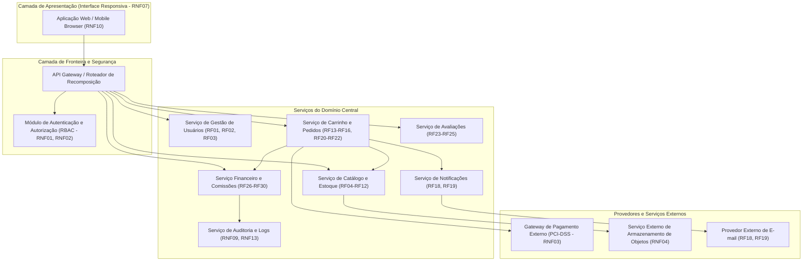
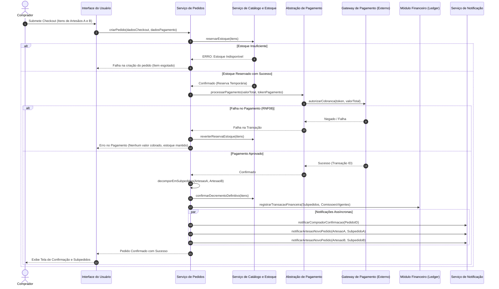
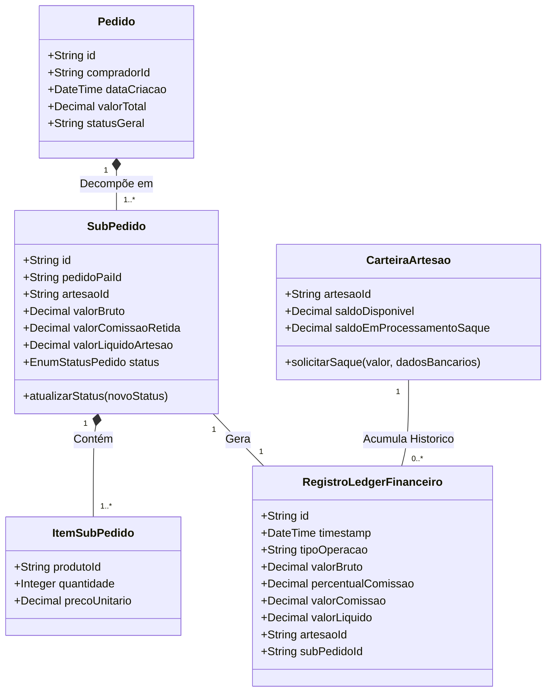

# Relatório Técnico de Arquitetura de Software

---

## 1. Identificação das HUs

Este documento estabelece o projeto arquitetural para a **Plataforma de Marketplace para Artesãos**, garantindo o alinhamento entre as necessidades do negócio, os aspectos funcionais e as restrições operacionais/não funcionais.

### Mapeamento das Histórias de Usuário (HUs) e Perfis
* **Perfil: Artesão (Vendedor)**
  * **HU01 — Cadastrar produto com fotos:** Permite o cadastro e publicação de itens artesanais com suporte a fotos. (*Mapeia: RF04, RF06, RNF04*)
  * **HU02 — Gerenciar estoque dos produtos:** Permite atualização manual e garante o decremento e bloqueio automático pós-venda. (*Mapeia: RF07, RF08, RF09*)
  * **HU03 — Acompanhar e atualizar status dos pedidos recebidos:** Permite avanço de estados do subpedido (recebido, em preparação, enviado, entregue). (*Mapeia: RF20, RF21*)
  * **HU04 — Visualizar painel financeiro:** Apresenta demonstrativo detalhado de vendas, taxas de comissão e saldo líquido. (*Mapeia: RF28, RF29, RNF06*)
  * **HU05 — Solicitar saque do saldo disponível:** Permite resgate de valores acumulados para conta bancária. (*Mapeia: RF30, RNF09*)
  * **HU06 — Responder avaliações de compradores:** Permite interação direta em réplica única pública. (*Mapeia: RF25*)

* **Perfil: Comprador**
  * **HU07 — Navegar e pesquisar produtos:** Fornece busca textual e por categorias com filtros de disponibilidade. (*Mapeia: RF10, RF11, RNF05*)
  * **HU08 — Adicionar itens ao carrinho e finalizar compra:** Suporta múltiplos artesãos em um único carrinho com desacoplamento em subpedidos e pagamento transacional único. (*Mapeia: RF13, RF14, RF15, RF16, RF17, RF22, RNF08*)
  * **HU09 — Acompanhar status dos pedidos:** Acompanhamento em tempo real dos subpedidos. (*Mapeia: RF21, RF22*)
  * **HU10 — Avaliar produto após entrega:** Libera avaliação condicional (nota 1 a 5 e comentário) pós-confirmação de entrega. (*Mapeia: RF23, RF24*)

* **Perfil: Administrador**
  * **HU11 — Gerenciar categorias da plataforma:** Gestão de taxonomia e regras de remoção com segurança de catálogo. (*Mapeia: RF12*)
  * **HU12 — Configurar percentual de comissão:** Define a taxa global de comissão da plataforma com retenção de histórico imutável. (*Mapeia: RF26, RF27, RNF09, RNF13*)

---

## 2. Diagramas de Arquitetura (Mermaid)

### 2.1 Visão Geral dos Componentes da Arquitetura (Visão Lógica)



---

### 2.2 Diagrama de Sequência: Processamento de Pedido Multi-Artesão e Transação de Pagamento



---

### 2.3 Modelo Estrutural do Domínio Financeiro e Pedidos (Diagrama de Classes Aumentado)



---

## 3. Decisões de Arquitetura

### ADR-01: Decomposição de Pedidos Consolidados em Subpedidos por Artesão
* **Contexto:** O requisito RF22 exige que o comprador consiga adquirir produtos de múltiplos artesãos em um único pedido/checkout (HU08), enquanto RF20 e HU03 exigem que cada artesão gerencie o ciclo de vida (status) de suas vendas de forma isolada.
* **Decisão:** Adotar o padrão de *Order-Suborder Split*. O objeto `Pedido` atua como um agregador financeiro para a transação do comprador, enquanto objetos filhos `SubPedido` são instanciados por artesão. Cada `SubPedido` possui seu próprio ciclo de vida independente (Recebido, Em Preparação, Enviado, Entregue).
* **Consequências:** Simplifica a gestão individual por artesão, desacopla a notificação e rastreio de logística, mas exige que a interface de acompanhamento do comprador (HU09) consolide as visões dos subpedidos.

### ADR-02: Transacionalidade do Processamento de Pagamento e Estoque (Two-Phase Commit Semântico)
* **Contexto:** Os requisitos RNF08 e RF09 determinam que a compra deve ser estritamente transacional: falhas no pagamento impedem o decremento de estoque e não devem gerar cobranças parciais.
* **Decisão:** Implementar padrão de reserva temporária de estoque com *Rollback* Automático via SAGA de Orquestração ou Transação ACID local na camada de Pedidos. O decremento definitivo do estoque só é efetivado mediante a confirmação síncrona do gateway de pagamento.
* **Consequências:** Garante consistência forte e impede *overselling* (vendas sem estoque disponível - RF08). Aumenta ligeiramente a complexidade da camada de integração de pagamentos.

### ADR-03: Livro-Razão Financeiro Imutável (Ledger) para Transações e Saques
* **Contexto:** Os requisitos RNF09, RF26, RF28, RF29 e RF30 exigem extrema auditabilidade e rastreabilidade sobre as vendas, comissões da plataforma e solicitações de saques. O requisito HU12 determina que alterações de taxa de comissão afetem apenas vendas futuras.
* **Decisão:** Projetar o módulo financeiro baseado no padrão de *Append-Only Ledger* (Registro de Eventos Imutáveis). Toda venda confirmada gera um registro histórico contendo o valor bruto, o percentual de comissão **snapshot do momento da venda**, o valor retido e o valor líquido repassado.
* **Consequências:** Elimina inconsistências financeiras por recálculos históricos retroativos. Garante aderência ao RNF09 e simplifica o cálculo do painel financeiro (RNF06).

### ADR-04: Abstração do Armazenamento de Arquivos de Mídia
* **Contexto:** O requisito RNF04 exige o uso de serviço externo de armazenamento de objetos desacoplado do servidor da aplicação para as fotos dos produtos (HU01).
* **Decisão:** Criar uma interface abstrata de repositório de arquivos de mídia (*Media Storage Interface*). A aplicação nunca grava arquivos localmente em seu disco de execução; apenas emite URLs assinadas para upload/download direto no serviço de objetos.
* **Consequências:** Garante escalabilidade horizontal da aplicação e diminui a carga nos servidores de processamento.

### ADR-05: Identidade Única com Múltiplos Perfis de Acesso (Dual-Role Identity)
* **Contexto:** Os requisitos RF01 e RF03 especificam que um mesmo usuário pode atuar simultaneamente como comprador e como artesão.
* **Decisão:** Modelar a entidade de Identidade (Usuário) separada das entidades de Perfil (*Role Profile*). O token de sessão do usuário carrega a lista de permissões ativas (`ROLE_BUYER`, `ROLE_ARTISAN`, `ROLE_ADMIN`), permitindo alternância de contexto no front-end sem necessidade de múltiplos cadastros ou novos logins.
* **Consequências:** Melhora a experiência do usuário (UX) e atende plenamente ao RF03 e RNF01.

---

## 4. Tabela de Componentes e Rastreabilidade

| Componente | Responsabilidade Principal | Comunica-se com | Origem (HU / Critério de Aceite / RF / RNF) |
| :--- | :--- | :--- | :--- |
| **Serviço de Identidade e Acesso** | Gerenciar autenticação, cadastro de usuários, hash seguro de senhas e autorização baseada em papéis (RBAC). | Aplicação Web, Banco de Dados Principal | RF01, RF02, RF03, RNF01, RNF02, RNF11 |
| **Serviço de Catálogo e Estoque** | Gerenciar categorias, cadastro de produtos, regras de estoque, busca/filtros e validação de disponibilidade. | Serviço de Armazenamento de Mídia, API Gateway, Serviço de Pedidos | RF04, RF05, RF06, RF07, RF08, RF09, RF10, RF11, RF12, HU01, HU02, HU07, HU11, RNF05 |
| **Abstração de Armazenamento de Mídia** | Receber e servir imagens de produtos de forma desacoplada do servidor principal. | Serviço de Catálogo, Serviço Externo de Object Storage | RNF04, HU01 (Critério 2) |
| **Serviço de Carrinho e Pedidos** | Gerenciar itens do carrinho, orquestrar checkout, decompor pedidos em subpedidos por artesão e gerenciar atualizações de status. | Serviço de Catálogo, Abstração de Pagamento, Serviço Financeiro, Serviço de Notificação | RF13, RF14, RF15, RF16, RF20, RF21, RF22, HU03, HU08, HU09, RNF08 |
| **Abstração de Gateway de Pagamento** | Encapsular integração com gateway PCI-DSS, processar pagamentos de forma transacional sem armazenar dados sensíveis de cartão. | Gateway de Pagamento Externo, Serviço de Pedidos | RF16, RF17, RNF03, RNF08 |
| **Serviço Financeiro e Ledger** | Calcular comissões, manter histórico imutável de transações, gerenciar saldo disponível e processar solicitações de saque. | Serviço de Pedidos, Serviço de Auditoria, API Gateway | RF26, RF27, RF28, RF29, RF30, HU04, HU05, HU12, RNF06, RNF09 |
| **Serviço de Avaliações** | Permitir envio de notas/comentários pós-entrega e republicação de respostas pelos artesãos. | Serviço de Pedidos (validação de entrega), API Gateway | RF23, RF24, RF25, HU06, HU10 |
| **Serviço de Notificações** | Enviar e-mails transacionais e notificações em plataforma sobre confirmações, vendas e atualizações de status. | Provedor Externo de E-mail, Serviço de Pedidos | RF18, RF19, HU03 (Critério 3), HU08 (Critério 3) |
| **Serviço de Log e Auditoria** | Registrar eventos críticos e alterações de sistema (ex: mudança de comissão, saques, falhas de pagamento). | Serviço Financeiro, Serviço de Pedidos, Serviço de Identidade | RNF09, RNF13, HU12 (Critério 2) |

---

## 5. Bloqueios e Pendências

### Bloqueios Arquiteturais Identificados (Gaps de Requisito Operacional)

1. **BLQ-01: Fluxo de Aprovação de Saque Bancário (HU05 / RF30)**
   * *Pendência:* O requisito HU05 define que o artesão pode solicitar o saque do saldo disponível e que o valor entra "em processamento". No entanto, **não há especificação** se o processamento é automático (via integração de transferência bancária) ou se exige um fluxo de aprovação/liberação manual por parte do Administrador.
   * *Impacto:* Risco no desenho do módulo de conciliação financeira e na interface do Administrador.
   * *Ação Necessária:* Alinhamento com o PO para definir a regra de negócio do ciclo de vida do saque (ex: Pendente -> Aprovado -> Pago / Rejeitado).

2. **BLQ-02: Regra de Expurgamento/Reclassificação em Exclusão de Categorias (HU11 / RF12)**
   * *Pendência:* O critério de aceite da HU11 menciona que ao remover uma categoria, os artesãos devem ser notificados para reclassificação. Contudo, não especifica o que ocorre imediatamente com a visibilidade dos produtos afetados (ficam em uma categoria "Sem Categoria"? Ficam despublicados automaticamente?).
   * *Impacto:* Risco de inconsistência na navegação do catálogo (RF10) ou quebra de filtros na busca de produtos.
   * *Ação Necessária:* Definir se existirá uma categoria *fallback* padrão ("Outros") ou despublicação temporária automática.

3. **BLQ-03: Política de Cancelamentos e Reembolsos Parciais por Subpedido**
   * *Pendência:* A especificação contempla a divisão em subpedidos por artesão (RF22), mas omite o cenário de cancelamento individual por parte do comprador ou cancelamento por falta de item por um único artesão.
   * *Impacto:* Necessidade de estorno parcial do pagamento no Gateway de Pagamento e estorno proporcional da comissão retida.
   * *Ação Necessária:* Especificar os requisitos de estorno/cancelamento de subpedidos.

---

## 6. Cobertura de Requisitos

### Matriz de Rastreabilidade Total (RFs e RNFs)

| Requisito | Tipo | Coberto no Projeto? | Componente / Decisão Responsável |
| :--- | :--- | :---: | :--- |
| **RF01** | Funcional | **SIM** | Serviço de Identidade e Acesso / ADR-05 |
| **RF02** | Funcional | **SIM** | Serviço de Identidade e Acesso |
| **RF03** | Funcional | **SIM** | Serviço de Identidade e Acesso / ADR-05 |
| **RF04** | Funcional | **SIM** | Serviço de Catálogo / HU01 |
| **RF05** | Funcional | **SIM** | Serviço de Catálogo |
| **RF06** | Funcional | **SIM** | Serviço de Catálogo |
| **RF07** | Funcional | **SIM** | Serviço de Catálogo / HU02 |
| **RF08** | Funcional | **SIM** | Serviço de Catálogo / ADR-02 |
| **RF09** | Funcional | **SIM** | Serviço de Catálogo e Serviço de Pedidos / ADR-02 |
| **RF10** | Funcional | **SIM** | Serviço de Catálogo / HU07 |
| **RF11** | Funcional | **SIM** | Serviço de Catálogo / HU07 |
| **RF12** | Funcional | **SIM** | Serviço de Catálogo / HU11 |
| **RF13** | Funcional | **SIM** | Serviço de Carrinho e Pedidos |
| **RF14** | Funcional | **SIM** | Serviço de Carrinho e Pedidos |
| **RF15** | Funcional | **SIM** | Serviço de Carrinho e Pedidos |
| **RF16** | Funcional | **SIM** | Serviço de Carrinho e Pedidos / Abstração de Pagamento |
| **RF17** | Funcional | **SIM** | Abstração de Gateway de Pagamento |
| **RF18** | Funcional | **SIM** | Serviço de Notificações / Serviço de Pedidos |
| **RF19** | Funcional | **SIM** | Serviço de Notificações |
| **RF20** | Funcional | **SIM** | Serviço de Carrinho e Pedidos (Subpedidos) / HU03 |
| **RF21** | Funcional | **SIM** | Serviço de Carrinho e Pedidos / HU09 |
| **RF22** | Funcional | **SIM** | Serviço de Carrinho e Pedidos / ADR-01 |
| **RF23** | Funcional | **SIM** | Serviço de Avaliações / HU10 |
| **RF24** | Funcional | **SIM** | Serviço de Avaliações / Serviço de Catálogo |
| **RF25** | Funcional | **SIM** | Serviço de Avaliações / HU06 |
| **RF26** | Funcional | **SIM** | Serviço Financeiro / ADR-03 |
| **RF27** | Funcional | **SIM** | Serviço Financeiro / HU12 |
| **RF28** | Funcional | **SIM** | Serviço Financeiro / HU04 |
| **RF29** | Funcional | **SIM** | Serviço Financeiro / HU04 |
| **RF30** | Funcional | **SIM** | Serviço Financeiro / HU05 |
| **RNF01** | Não Funcional | **SIM** | Serviço de Identidade (RBAC) |
| **RNF02** | Não Funcional | **SIM** | Serviço de Identidade (Hash seguro de senhas) |
| **RNF03** | Não Funcional | **SIM** | Abstração de Pagamento (HTTPS + Tokenização PCI-DSS) |
| **RNF04** | Não Funcional | **SIM** | Abstração de Armazenamento de Mídia / ADR-04 |
| **RNF05** | Não Funcional | **SIM** | Serviço de Catálogo (Indexação de busca + Caching de leitura) |
| **RNF06** | Não Funcional | **SIM** | Serviço Financeiro (Visões pré-computadas no Ledger) |
| **RNF07** | Não Funcional | **SIM** | Camada de Apresentação (UI Responsiva) |
| **RNF08** | Não Funcional | **SIM** | Serviço de Pedidos + Pagamentos / ADR-02 |
| **RNF09** | Não Funcional | **SIM** | Serviço Financeiro + Serviço de Log e Auditoria / ADR-03 |
| **RNF10** | Não Funcional | **SIM** | Camada de Apresentação (Cross-browser compliance) |
| **RNF11** | Não Funcional | **SIM** | Serviço de Identidade e Acesso (Compliance LGPD) |
| **RNF12** | Não Funcional | **SIM** | Infraestrutura e Arquitetura Desacoplada |
| **RNF13** | Não Funcional | **SIM** | Serviço de Log e Auditoria |

---

## 7. Gap Analysis

Esta seção detalha as lacunas identificadas nos requisitos de entrada, avalia os impactos no desenvolvimento e propõe as ações mitigatórias a serem adotadas pela engenharia de software.

```
+---------------------------------------------------------------------------------------------------------+
|                                             GAP ANALYSIS                                                |
+------------------------------------+----------------------------------+---------------------------------+
| Lacuna Encontrada (Spec Gap)       | Impacto Arquitetural             | Ação Recomendada para o Time    |
+------------------------------------+----------------------------------+---------------------------------+
| 1. Ausência de cálculo de frete    | Sem especificação de cálculo de  | Implementar interface genérica  |
|    ou custo de envio por subpedido | frete por região/artesão, o      | de cálculo de frete para plug-in |
|    (RF15, RF22).                   | valor total cobrado pode ser     | futuro de tabelas ou serviços de|
|                                    | divergente da realidade logísticas| entregas.                       |
+------------------------------------+----------------------------------+---------------------------------+
| 2. Mecanismo impreciso de          | A remoção de categoria pode      | Estabelecer a criação de uma    |
|    reclassificação de produtos após | deixar produtos órfãos, quebrando| categoria padrão "Geral/Outros" |
|    exclusão de categoria (HU11).   | a listagem do catálogo.          | para reclassificação temporária |
|                                    |                                  | automática.                     |
+------------------------------------+----------------------------------+---------------------------------+
| 3. Indefinição do workflow de      | Risco de vulnerabilidade em      | Adicionar estado "Aguardando    |
|    aprovação do saque (HU05).      | transferências financeiras sem   | Liberação" no fluxo de saque e  |
|                                    | conciliação ou checagem humana.  | providenciar tela de gestão de  |
|                                    |                                  | saques para o Perfil Admin.     |
+------------------------------------+----------------------------------+---------------------------------+
| 4. Tratamento de concorrência no   | Duas compras simultâneas do      | Aplicar Bloqueio Pessimista ou  |
|    último item em estoque (RF08).   | mesmo item podem gerar estoque   | Atômico (`UPDATE stock WHERE    |
|                                    | negativo se não controlado.      | stock >= qty`) na reserva.      |
+------------------------------------+----------------------------------+---------------------------------+
```

---

### Parecer Arquitetural Final
A arquitetura proposta garante desacoplamento funcional, atende rigorosamente às diretrizes de **neutralidade tecnológica** e provê capacidade de sustentação para a expansão do marketplace de artesanato. O sistema encontra-se estruturalmente blindado contra inconsistências transacionais e financeiras através dos padrões *Ledger Imutável* e *Saga/Two-Phase Commit Semântico*.