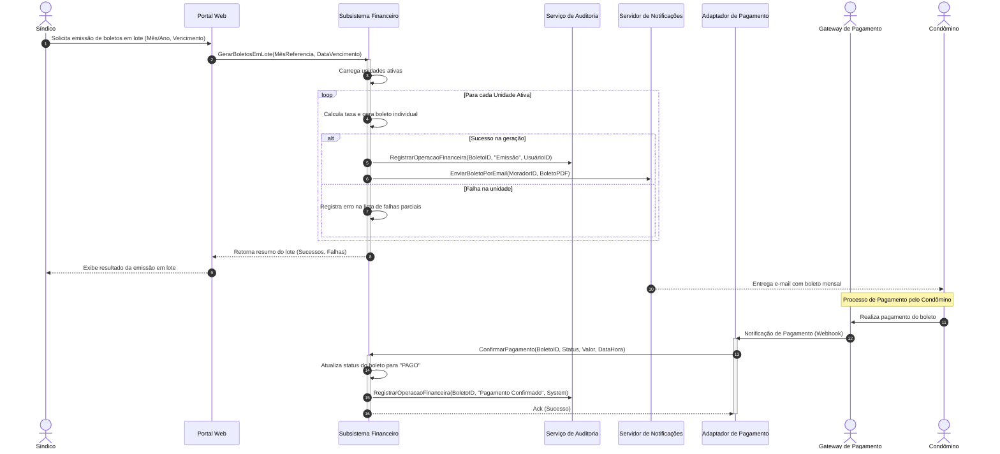
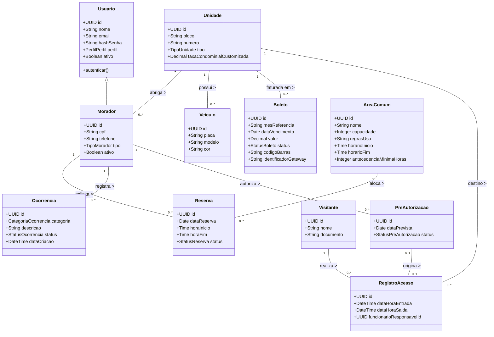

# Relatório Técnico de Arquitetura de Software

---

## 1. Identificação das HUs

A tabela abaixo correlaciona as Histórias de Usuário (HUs) com os Requisitos Funcionais (RF) e Não Funcionais (RNF) do Sistema de Administração de Condomínio Residencial.

| HU ID | Perfil | Nome da HU | Resumo da Necessidade | RFs Associados | RNFs Associados |
| :--- | :--- | :--- | :--- | :--- | :--- |
| **HU01** | Síndico | Cadastrar unidades e moradores | Permitir o cadastro de unidades e moradores vinculados, validando obrigatoriedades e unicidade de CPF. | RF04, RF05, RF06, RF07, RF08 | RNF04 |
| **HU02** | Síndico | Emitir boletos em lote | Processar emissão em lote de boletos para o mês de referência com notificação aos condôminos e relatório de falhas. | RF09, RF10, RF13 | RNF05, RNF11, RNF13 |
| **HU03** | Síndico | Acompanhar inadimplências | Exibir painel com unidades com boletos em atraso, suporte a filtros e exportação em CSV. | RF15 | RNF05, RNF08 |
| **HU04** | Síndico | Publicar comunicados | Publicar comunicados no portal, permitir fixação no topo e disparar avisos por e-mail. | RF16, RF17 | RNF13 |
| **HU05** | Síndico | Gerenciar ocorrências | Visualizar, filtrar, categorizar e alterar status de ocorrências, notificando o autor. | RF23, RF24 | RNF13 |
| **HU06** | Síndico | Criar e registrar assembleias | Agendar assembleias, notificar condôminos, registrar atas e anexar documentos. | RF18, RF19 | RNF09, RNF10 |
| **HU07** | Síndico | Gerenciar áreas comuns e reservas | Cadastrar áreas comuns, definir regras de uso, visualizar calendário geral e cancelar reservas. | RF25, RF27, RF29 | RNF08 |
| **HU08** | Condômino | Visualizar e pagar boleto pelo portal | Consultar boletos pendentes/pagos, baixar documento de cobrança e visualizar confirmação automática de pagamento. | RF11, RF12, RF14 | RNF01, RNF03, RNF05 |
| **HU09** | Condômino | Reservar área comum | Solicitar reserva de espaço comum com checagem de sobreposição em tempo real e confirmação por e-mail. | RF26, RF27 | RNF07, RNF08 |
| **HU10** | Condômino | Registrar e acompanhar ocorrência | Cadastrar reclamação/sugestão com fotos, acompanhar histórico e receber notificações. | RF21, RF24 | RNF09, RNF13 |
| **HU11** | Condômino | Pré-autorizar entrada de visitante | Registrar dados de visitante e data prevista para agilizar a liberação na portaria, com opção de cancelamento. | RF31 | RNF04, RNF09 |
| **HU12** | Condômino | Acompanhar assembleias e consultar atas | Visualizar agendamentos de assembleias e baixar atas/documentos em PDF via portal. | RF20 | RNF09, RNF10 |
| **HU13** | Funcionário | Registrar entrada e saída de visitantes | Registrar acesso presencial (dados do visitante, horário, unidade), relacionar a pré-autorização e fechar visita. | RF30, RF32 | RNF04, RNF06 |
| **HU14** | Funcionário | Consultar pré-autorizações de acesso | Consultar pré-autorizações do dia por unidade/nome e converter em entrada efetiva. | RF31, RF32 | RNF06, RNF09 |

---

## 2. Diagramas de Arquitetura (Mermaid)

### 2.1. Visão Geral de Componentes da Arquitetura (Architecture Blueprint)

```mermaid
componentDiagram
    [Interface Web / Mobile] as ClientApp
    
    package "Camada de Fronteira e Controle de Acesso" {
        [API Gateway / Ingress Controller] as Gateway
        [Módulo de Autenticação e Acesso] as AuthModule
    }

    package "Domínio Principal de Negócio" {
        [Módulo de Gestão de Unidades e Moradores] as ModUnits
        [Subsistema Financeiro e Cobrança] as ModFinance
        [Módulo de Comunicados e Assembleias] as ModNotices
        [Módulo de Gestão de Ocorrências] as ModOccurrences
        [Engine de Reserva de Áreas Comuns] as ModReservations
        [Módulo de Controle de Visitantes] as ModVisitors
    }

    package "Serviços Transversais e Suporte" {
        [Servidor de Notificações] as NotificationService
        [Serviço de Logs e Auditoria Imutável] as AuditService
        [Adaptador de Integração de Pagamento] as PaymentAdapter
    }

    database "Armazenamento Relacional Persistente" as Database
    database "Trilha de Auditoria Imutável" as AuditStore
    cloud "Gateway de Pagamento Externo" as ExternalPaymentGateway

    ClientApp --> Gateway
    Gateway --> AuthModule
    Gateway --> ModUnits
    Gateway --> ModFinance
    Gateway --> ModNotices
    Gateway --> ModOccurrences
    Gateway --> ModReservations
    Gateway --> ModVisitors

    ModFinance --> PaymentAdapter
    PaymentAdapter --> ExternalPaymentGateway
    ExternalPaymentGateway ..> PaymentAdapter : Webhook / Notification

    ModFinance --> NotificationService
    ModNotices --> NotificationService
    ModOccurrences --> NotificationService
    ModReservations --> NotificationService

    ModUnits --> Database
    ModFinance --> Database
    ModNotices --> Database
    ModOccurrences --> Database
    ModReservations --> Database
    ModVisitors --> Database

    ModFinance --> AuditService
    ModVisitors --> AuditService
    AuditService --> AuditStore
```

---

### 2.2. Diagrama de Sequência: Processamento de Boletos em Lote e Baixa Automática (HU02, HU08, RF10, RF11, RF12, RNF05, RNF11)



---

### 2.3. Diagrama de Classes de Domínio (Modelo Conceitual)



---

## 3. Decisões de Arquitetura

### ADR 01: Modularização Interna Orientada a Domínios com Comunicação Assíncrona para Eventos
* **Contexto:** O sistema necessita lidar com regras distintas (financeiro, reservas, portaria, ocorrências) sem gerar forte acoplamento que impeça a evolução independente.
* **Decisão:** Adotar uma arquitetura orientada a componentes/módulos bem delimitados (Domain-Driven Boundary). A comunicação direta para dados de consulta é feita por interfaces conceituais internas, enquanto ações disparadas por eventos (ex.: boleto pago, comunicado publicado, alteração de status) utilizam um Barramento Interno de Eventos para integração assíncrona.
* **Consequências:** 
  * *Positivas:* Alta manutenibilidade, isolamento de falhas, facilidade para futura extração de microserviços caso haja pico de carga na portaria ou reservas.
  * *Negativas:* Ligeiro aumento na complexidade de orquestração de eventos internos.

### ADR 02: Padrão de Integração com Gateway de Pagamento via Tokenização e Webhooks (Conformidade PCI-DSS)
* **Contexto:** RF11, RF12, RNF03 e RNF11 exigem processamento financeiro e notificação automática sem retenção de dados sensíveis de pagamento.
* **Decisão:** Implementar um *Adaptador de Integração de Pagamentos* que delega todo o manuseio de dados de pagamento (cartão/boleto) diretamente ao Gateway parceiro. O sistema local armazenará apenas o `identificadorGateway`, o status da transação e o código de barras gerado. O recebimento de status de pagamento será via Webhook assíncrono idempotente.
* **Consequências:**
  * *Positivas:* Cumprimento estrito do RNF03 (PCI-DSS), reduzindo drasticamente o escopo de auditoria de segurança.
  * *Negativas:* Dependência da disponibilidade de rede para webhook do Gateway externos.

### ADR 03: Padrão de Trilha de Auditoria Imutável para Operações Financeiras e Acessos
* **Contexto:** RNF05 e RNF06 exigem registro imutável com usuário, data e hora de todas as operações financeiras e registros de visitantes.
* **Decisão:** Implementar um *Serviço de Logs e Auditoria Imutável* separado do banco operacional principal. Todo registro gravado nesse componente utiliza uma estrutura de dados de "append-only" (apenas inserção, sem suporte a alteração ou exclusão por usuários/sistema).
* **Consequências:**
  * *Positivas:* Garantia de não repúdio, total conformidade com rastreabilidade e facilidade de auditoria legal.
  * *Negativas:* Necessidade de governança rigorosa de capacidade de armazenamento à medida que os acessos crescem.

### ADR 04: Tratamento Transacional Resiliente para Processamento em Lote de Boletos
* **Contexto:** RF13 e RNF11 requerem emissão em lote de boletos com resiliência a falhas parciais, sem corromper as emissões bem-sucedidas.
* **Decisão:** O processamento em lote utilizará uma estratégia de execução isolada por unidade (*Unit of Work per Account*). Cada boleto é processado em sua própria transação atômica local. As unidades com falha de processamento ou integração serão capturadas e compiladas em um relatório resumido de execução sem estornar a geração dos boletos concluídos com êxito.
* **Consequências:**
  * *Positivas:* Cumprimento total do RNF11, evitando o travamento do faturamento do condomínio inteiro por erro em uma única unidade.
  * *Negativas:* Exige do Síndico a verificação e reprocessamento manual do lote das unidades pendentes/falhas.

### ADR 05: Estratégia de Bloqueio Concorrente para Reserva de Áreas Comuns
* **Contexto:** RF27 estabelece que o sistema deve impedir rigorosamente reservas sobrepostas para uma mesma área comum no mesmo intervalo de tempo.
* **Decisão:** Utilizar bloqueio pessimista (*Pessimistic Locking*) ou transações com isolamento *Serializable* na Engine de Reservas durante o processo de checagem e confirmação da reserva.
* **Consequências:**
  * *Positivas:* Elimina condição de corrida (Race Conditions) ao tentar reservar o mesmo salão de festas no mesmo segundo.
  * *Negativas:* Breve retenção de bloqueio no registro da área comum durante a requisição de reserva.

---

## 4. Tabela de Componentes e Rastreabilidade

| Componente | Responsabilidade Principal | Comunica-se com | Origem (HU / Critério de Aceite) |
| :--- | :--- | :--- | :--- |
| **Módulo de Autenticação e Gestão de Acessos** | Controlar a autenticação, encerramento de sessão, verificação de perfis de acesso e políticas de segurança de senha e inatividade. | Todos os módulos do sistema (como autorizador de chamadas) | HU01, RNF01, RNF02 |
| **Módulo de Gestão de Unidades e Moradores** | Manter cadastros de blocos, unidades, moradores (proprietários/inquilinos), desativações sem perda de histórico e veículos vinculados. | Módulo de Autenticação, Subsistema Financeiro, Módulo de Visitantes | HU01, RF04, RF05, RF06, RF07, RF08, RNF04 |
| **Subsistema Financeiro e de Cobrança** | Configurar taxas, gerar boletos individuais e em lote, controlar status financeiro, gerar painel de inadimplência e baixa manual. | Adaptador de Pagamentos, Servidor de Notificações, Serviço de Auditoria, Módulo de Unidades | HU02, HU03, HU08, RF09, RF10, RF12, RF13, RF14, RF15, RNF05, RNF08, RNF11 |
| **Adaptador de Integração de Pagamento** | Mediar comunicação segura com o Gateway externo para emissão de cobranças e recepção de Webhooks de baixa de boletos. | Gateway de Pagamento Externo, Subsistema Financeiro | HU08, RF11, RNF03 |
| **Módulo de Comunicados e Assembleias** | Gerenciar comunicados (com fixação topo), agendamento de assembleias, publicação de atas e anexos. | Servidor de Notificações, Módulo de Unidades e Moradores | HU04, HU06, HU12, RF16, RF17, RF18, RF19, RF20 |
| **Módulo de Gestão de Ocorrências** | Permitir criação, atualização de ciclo de vida (status), categorização e acompanhamento de reclamações e solicitações. | Servidor de Notificações, Módulo de Unidades e Moradores | HU05, HU10, RF21, RF22, RF23, RF24 |
| **Engine de Reserva de Áreas Comuns** | Gerenciar espaços, horários, capacidade, regras e realizar o controle concorrente de agendamentos e cancelamentos. | Servidor de Notificações, Módulo de Unidades e Moradores | HU07, HU09, RF25, RF26, RF27, RF28, RF29, RNF08 |
| **Módulo de Controle de Acesso de Visitantes** | Registrar entradas e saídas na portaria, consultar e vincular pré-autorizações e disponibilizar histórico de acessos. | Serviço de Auditoria, Módulo de Unidades e Moradores | HU11, HU13, HU14, RF30, RF31, RF32, RF33, RNF04, RNF06 |
| **Servidor de Notificações** | Formatar e disparar e-mails para boletos, comunicados, avisos de assembleias e alterações de ocorrências/reservas. | Módulo Financeiro, Módulo de Comunicados, Módulo de Ocorrências, Engine de Reservas | HU02, HU04, HU05, HU06, HU09, HU10, RF17, RF24 |
| **Serviço de Logs e Auditoria Imutável** | Registrar eventos de segurança, operações financeiras, acessos de visitantes e ações críticas do sistema sem permissão de alteração. | Subsistema Financeiro, Módulo de Visitantes, Módulo de Autenticação | RNF05, RNF06, RNF13 |

---

## 5. Bloqueios e Pendências

1. **Definição de Política de Tolerância a Falhas/Offline para Portaria (HU13 / HU14):**
   * *Pendência:* Os requisitos assumem operabilidade 24/7 online (RNF07), mas não especificam o comportamento esperado do controle de visitantes na portaria caso haja interrupção temporária na conexão de internet local do condomínio.
2. **Protocolo de Expiração de Pré-Autorizações de Visitantes (HU11 / HU14):**
   * *Pendência:* O RF31 especifica apenas a informação da "data prevista". Não foi definido se pré-autorizações não utilizadas no dia expiram automaticamente à meia-noite ou se permanecem válidas por período configurável.
3. **Mecanismo de Retentativa e Conciliação em Falhas de Notificação (HU02 / HU04):**
   * *Pendência:* Caso o servidor de SMTP/notificação falhe durante o disparo de boletos em lote ou comunicados, não está especificada a política de nova tentativa ou painel de envio pendente/rejeitado.
4. **Política de Retenção e Anonimização de Dados Pessoais (LGPD / RNF04):**
   * *Pendência:* Embora o RF07 oriente a desativação de moradores preservando histórico e o RNF04 cite a LGPD, falta especificar o ciclo de vida e a janela de expurgo/anonimização dos dados de visitantes e ex-moradores após encerramento do vínculo contratual.

---

## 6. Cobertura de Requisitos

A matriz abaixo confirma a rastreabilidade total de todos os Requisitos Funcionais (RF01-RF33) e Requisitos Não Funcionais (RNF01-RNF13) no modelo arquitetural proposto.

| Requisito | Atendido por (Módulo / ADR) | Rastreabilidade na HU |
| :--- | :--- | :--- |
| **RF01** | Módulo de Autenticação e Gestão de Acessos | HU01 |
| **RF02** | Módulo de Autenticação e Gestão de Acessos | Visão Geral |
| **RF03** | Módulo de Autenticação e Gestão de Acessos | Visão Geral |
| **RF04** | Módulo de Gestão de Unidades e Moradores | HU01 |
| **RF05** | Módulo de Gestão de Unidades e Moradores | HU01 |
| **RF06** | Módulo de Gestão de Unidades e Moradores | HU01 |
| **RF07** | Módulo de Gestão de Unidades e Moradores | HU01 |
| **RF08** | Módulo de Gestão de Unidades e Moradores | HU01 |
| **RF09** | Subsistema Financeiro e de Cobrança | HU02 |
| **RF10** | Subsistema Financeiro e de Cobrança | HU02, HU08 |
| **RF11** | Adaptador de Integração de Pagamento | HU08 / ADR 02 |
| **RF12** | Subsistema Financeiro + Adaptador de Pagamento | HU08 / ADR 02 |
| **RF13** | Subsistema Financeiro e de Cobrança | HU02 / ADR 04 |
| **RF14** | Subsistema Financeiro e de Cobrança | HU08 |
| **RF15** | Subsistema Financeiro e de Cobrança | HU03 |
| **RF16** | Módulo de Comunicados e Assembleias | HU04 |
| **RF17** | Servidor de Notificações | HU04 |
| **RF18** | Módulo de Comunicados e Assembleias | HU06 |
| **RF19** | Módulo de Comunicados e Assembleias | HU06 |
| **RF20** | Módulo de Comunicados e Assembleias | HU12 |
| **RF21** | Módulo de Gestão de Ocorrências | HU10 |
| **RF22** | Módulo de Gestão de Ocorrências | HU05 |
| **RF23** | Módulo de Gestão de Ocorrências | HU05 |
| **RF24** | Servidor de Notificações | HU05, HU10 |
| **RF25** | Engine de Reserva de Áreas Comuns | HU07 |
| **RF26** | Engine de Reserva de Áreas Comuns | HU09 |
| **RF27** | Engine de Reserva de Áreas Comuns | HU07, HU09 / ADR 05 |
| **RF28** | Engine de Reserva de Áreas Comuns | HU07, HU09 |
| **RF29** | Engine de Reserva de Áreas Comuns | HU07 |
| **RF30** | Módulo de Controle de Acesso de Visitantes | HU13 |
| **RF31** | Módulo de Controle de Acesso de Visitantes | HU11, HU14 |
| **RF32** | Módulo de Controle de Acesso de Visitantes | HU13, HU14 |
| **RF33** | Módulo de Controle de Acesso de Visitantes | HU13 |
| **RNF01** | Módulo de Autenticação e Gestão de Acessos | Todas |
| **RNF02** | Módulo de Autenticação e Gestão de Acessos | Todas |
| **RNF03** | Adaptador de Integração de Pagamento | HU08 / ADR 02 |
| **RNF04** | Todos os Módulos (Governança de Dados) | HU01, HU11, HU13 |
| **RNF05** | Serviço de Logs e Auditoria Imutável | HU02, HU03, HU08 / ADR 03 |
| **RNF06** | Serviço de Logs e Auditoria Imutável | HU13, HU14 / ADR 03 |
| **RNF07** | Infraestrutura e Gateway de Borda | Todas |
| **RNF08** | Subseções de Consulta de Performance (Cache / Índices) | HU03, HU07, HU09 |
| **RNF09** | Frontend / Camada de Apresentação Responsiva | HU06, HU10, HU11, HU12, HU14 |
| **RNF10** | Compatibilidade de Interface Web | HU06, HU12 |
| **RNF11** | Subsistema Financeiro e de Cobrança | HU02 / ADR 04 |
| **RNF12** | Infraestrutura e Serviços Transversais | Governança |
| **RNF13** | Serviço de Logs e Auditoria Imutável | HU02, HU04, HU05, HU10, HU13 |

---

## 7. Gap Analysis

A análise a seguir detalha as omissões ou ambiguidades identificadas na especificação de requisitos, apontando seus impactos no design da arquitetura e as ações recomendadas.

```
+---------------------------------------------------------------------------------------------------------+
| GAP 01: Tratamento de Estornos, Cancelamento de Boletos e Pagamentos Duplicados                          |
+---------------------------------------------------------------------------------------------------------+
| Detalhamento: O sistema contempla emissão e baixa de boletos, mas não especifica regras de negócio      |
| para o cancelamento de títulos emitidos incorretamente ou o tratamento de Webhooks informando estornos |
| ou pagamentos duplicados pelo mesmo condômino.                                                          |
|                                                                                                         |
| Impacto Arquitetural: O Subsistema Financeiro pode ficar com inconsistência no painel de inadimplência |
| ou na trilha de auditoria caso ocorra uma alteração de estado não prevista pelo fluxo do sistema.       |
|                                                                                                         |
| Ação Recomendada: Incluir os estados 'CANCELADO' e 'ESTORNADO' na máquina de estados da entidade        |
| Boleto e estender a API do Adaptador de Pagamento para tratar os eventos de estorno e cancelamento.    |
+---------------------------------------------------------------------------------------------------------+
```

```
+---------------------------------------------------------------------------------------------------------+
| GAP 02: Limite de Capacidade de Anexos e Armazenamento em Ocorrências e Atas de Assembleia              |
+---------------------------------------------------------------------------------------------------------+
| Detalhamento: Os critérios de aceite das HUs HU06 e HU10 permitem anexar fotos em ocorrências e documentos |
| em PDF nas atas de assembleias, contudo não estabelecem limites de tamanho ou quantidade por upload.    |
|                                                                                                         |
| Impacto Arquitetural: Risco de degradação da disponibilidade (RNF07), estouro de cota de armazenamento e |
| falha no tempo de resposta HTTP durante uploads desproporcionais de arquivos não compactados.           |
|                                                                                                         |
| Ação Recomendada: Estabelecer um componente dedicado de validação de mídias com cota máxima de upload  |
| (ex.: 5MB por arquivo em PDF/imagem) com pré-processamento/compactação antes da gravação persistente.  |
+---------------------------------------------------------------------------------------------------------+
```

```
+---------------------------------------------------------------------------------------------------------+
| GAP 03: Tratamento para Concorrência de Entrada Presencial e Pré-Autorização de Visitantes              |
+---------------------------------------------------------------------------------------------------------+
| Detalhamento: A HU11 permite ao condômino pré-autorizar ou cancelar uma visita. Porém, se o condômino |
| cancelar a autorização exatamente no momento em que o visitante estiver se identificando na portaria,   |
| o sistema não tem regra explicitada para tratar a transição de estado na portaria.                      |
|                                                                                                         |
| Impacto Arquitetural: Potencial inconsistência na UI da Portaria (HU13/HU14), exibindo pré-autorização  |
| obsoleta que já foi revogada no portal pelo morador.                                                    |
|                                                                                                         |
| Ação Recomendada: Implementar sincronização por canal de eventos instantâneo para a tela da portaria e |
| validação no instante da confirmação do registro de entrada do visitante pelo funcionário.              |
+---------------------------------------------------------------------------------------------------------+
```

```
+---------------------------------------------------------------------------------------------------------+
| GAP 04: Tratamento da LGPD na Gestão do Histórico de Acessos de Visitantes                              |
+---------------------------------------------------------------------------------------------------------+
| Detalhamento: O RF33 exige a manutenção do histórico de acessos de visitantes, e o RNF06 exige registro |
| imutável, enquanto o RNF04 cita a conformidade com a LGPD. Contudo, não é especificado por quanto tempo |
| os dados identificáveis (nome, documento) de visitantes casuais devem ser mantidos armazenados.         |
|                                                                                                         |
| Impacto Arquitetural: Armazenar dados pessoais por tempo indeterminado pode violar o princípio da       |
| minimização e limitação da conservação previsto na LGPD.                                                |
|                                                                                                         |
| Ação Recomendada: Definir um processo automatizado no Serviço de Auditoria para anonimização dos        |
| dados pessoais dos registros de visitantes após a expiração do prazo legal de guarda recomendado pelo   |
| departamento de governança jurídica do projeto.                                                         |
+---------------------------------------------------------------------------------------------------------+
```