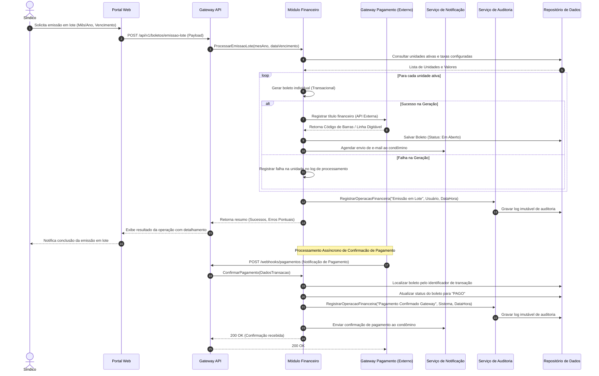
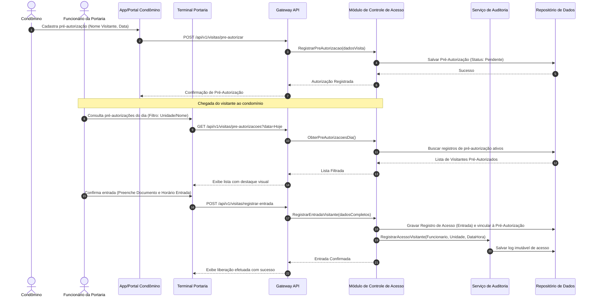

# Relatório Técnico de Arquitetura de Software

---

## 1. Identificação das HUs

A tabela a seguir apresenta o mapeamento completo das Histórias de Usuário (HU01 a HU14), correlacionando os perfis envolvidos, seus objetivos centrais, critérios de aceite associados e o alinhamento com os Requisitos Funcionais (RF) e Não Funcionais (RNF).

| ID HU | Perfil | Objetivo de Negócio | Critérios de Aceite Principais | RFs Associados | RNFs Associados |
| :--- | :--- | :--- | :--- | :--- | :--- |
| **HU01** | Síndico | Cadastrar unidades e vincular moradores (proprietários/inquilinos). | Bloco e número obrigatórios; CPF único por morador; suporte a múltiplos moradores por unidade. | RF04, RF05, RF06, RF07, RF08 | RNF04 |
| **HU02** | Síndico | Emitir boletos de condomínio em lote para o mês de referência. | Mês e vencimento configuráveis; geração individual por unidade ativa; envio por e-mail; relatório de falhas pontuais sem abortar o lote. | RF09, RF10, RF13 | RNF05, RNF11, RNF13 |
| **HU03** | Síndico | Acompanhar inadimplências através de painel consolidado. | Listagem por atraso pós-vencimento; filtros por bloco, período e faixa; exportação para CSV. | RF15 | RNF08 |
| **HU04** | Síndico | Publicar comunicados informativos no portal. | Campos de título, corpo e data; notificação imediata por e-mail; fixação no topo do portal. | RF16, RF17 | RNF13 |
| **HU05** | Síndico | Gerenciar e categorizar ocorrências enviadas pelos usuários. | Exibição detalhada por origem/status/categoria; filtros avançados; notificação automática a cada mudança de estado. | RF23, RF24 | RNF13 |
| **HU06** | Síndico | Criar assembleias e registrar atas vinculadas aos eventos. | Notificação por e-mail na criação; anexação de documentos (PDFs); disponibilização pública da ata no portal. | RF18, RF19 | RNF13 |
| **HU07** | Síndico | Gerenciar cadastro de áreas comuns e regras de reserva. | Regras de antecedência e horários; visualização do calendário geral; poder de cancelamento administrativo com notificação. | RF25, RF29, RF28 | RNF08 |
| **HU08** | Condômino | Visualizar e pagar boletos pelo portal do morador. | Listagem de boletos e seus status; download de PDF/código de barras; atualização automática via gateway. | RF10, RF11, RF12 | RNF03, RNF05, RNF09 |
| **HU09** | Condômino | Reservar área comum para data e horário específicos. | Checagem de disponibilidade em tempo real; confirmação imediata sem sobreposição; e-mail de confirmação. | RF26, RF27 | RNF08, RNF09 |
| **HU10** | Condômino | Registrar e acompanhar ocorrências no portal. | Formulário com categoria, descrição e fotos; exibição do histórico de evolução; notificações de atualização. | RF21 | RNF09, RNF13 |
| **HU11** | Condômino | Pré-autorizar a entrada de visitantes na portaria. | Dados do visitante e data prevista; visibilidade instantânea na portaria; opção de cancelamento antes da entrada. | RF31 | RNF06, RNF09 |
| **HU12** | Condômino | Acompanhar agendamento de assembleias e consultar atas. | Exibição de pautas e datas das próximas assembleias; download e visualização de atas passadas em PDF. | RF20 | RNF09, RNF10 |
| **HU13** | Funcionário | Registrar entrada e saída física de visitantes na portaria. | Exigência de documento, nome, unidade e horário; destaque para pré-autorização; registro de encerramento da visita. | RF30 | RNF06 |
| **HU14** | Funcionário | Consultar pré-autorizações ativas para o dia corrente. | Filtros por unidade e nome; vinculação direta da pré-autorização ao registro de entrada efetivo. | RF32, RF33 | RNF06 |

---

## 2. Diagramas de Arquitetura (Mermaid)

### 2.1. Diagrama de Visão Geral de Componentes e Módulos do Sistema

O gráfico de componentes a seguir representa a separação modular abstrata do sistema, demonstrando as fronteiras de contexto, os pontos de integração externos e os fluxos de comunicação internos.

```mermaid
graph TD
    classDef client fill:#e1f5fe,stroke:#01579b,stroke-width:2px;
    classDef module fill:#fff3e0,stroke:#e65100,stroke-width:2px;
    classDef external fill:#f3e5f5,stroke:#4a148c,stroke-width:2px;
    classDef storage fill:#e8f5e9,stroke:#1b5e20,stroke-width:2px;

    subgraph Camada_Apresentacao ["Camada de Apresentação (Interfaces Responsivas)"]
        PortalSindico["Portal do Síndico / Web"]:::client
        PortalCondomino["Portal do Condômino / Web & Mobile"]:::client
        TerminalPortaria["Terminal de Operação da Portaria"]:::client
    end

    subgraph Nucleo_Arquitetural ["Núcleo do Sistema (Backend Modular)"]
        API_Gateway["Gateway API / Roteador & Autenticação"]:::module
        
        Mod_Auth["Módulo de Gestão de Identidade e Acesso (RBAC)"]:::module
        Mod_Cadastros["Módulo de Unidades, Moradores e Veículos"]:::module
        Mod_Financeiro["Módulo Financeiro e Cobrança em Lote"]:::module
        Mod_Comunicacao["Módulo de Comunicados e Assembleias"]:::module
        Mod_Ocorrencias["Módulo de Gestão de Ocorrências"]:::module
        Mod_Reservas["Módulo de Reservas de Áreas Comuns"]:::module
        Mod_Portaria["Módulo de Controle de Acesso e Visitantes"]:::module
        
        Servico_Notificacao["Serviço de Notificações (E-mail / Push)"]:::module
        Servico_Auditoria["Serviço de Trilha de Auditoria e Logs"]:::module
    end

    subgraph Integracoes_Externas ["Serviços Externos"]
        Gateway_Pagamento["Gateway de Pagamento Externo (PCI-DSS)"]:::external
        Servico_Email_Externo["Provedor de E-mail / SMTP Transacional"]:::external
    end

    subgraph Camada_Persistencia ["Camada de Dados & Armazenamento"]
        Repositorio_Dados[("Repositório Relacional de Dados")]:::storage
        Repositorio_Arquivos[("Repositório de Documentos / Atas / Fotos")]:::storage
        Repositorio_Auditoria[("Trilha Imutável de Auditoria")]:::storage
    end

    %% Conexões das Interfaces com o Gateway
    PortalSindico --> API_Gateway
    PortalCondomino --> API_Gateway
    TerminalPortaria --> API_Gateway

    %% Roteamento do Gateway API
    API_Gateway --> Mod_Auth
    API_Gateway --> Mod_Cadastros
    API_Gateway --> Mod_Financeiro
    API_Gateway --> Mod_Comunicacao
    API_Gateway --> Mod_Ocorrencias
    API_Gateway --> Mod_Reservas
    API_Gateway --> Mod_Portaria

    %% Interações de Negócio e Serviços
    Mod_Financeiro --> Gateway_Pagamento
    Mod_Financeiro --> Servico_Auditoria
    Mod_Financeiro --> Servico_Notificacao
    
    Mod_Comunicacao --> Servico_Notificacao
    Mod_Ocorrencias --> Servico_Notificacao
    Mod_Reservas --> Servico_Notificacao
    
    Mod_Portaria --> Servico_Auditoria
    Mod_Auth --> Servico_Auditoria

    Servico_Notificacao --> Servico_Email_Externo

    %% Conexões com Persistência
    Mod_Auth --> Repositorio_Dados
    Mod_Cadastros --> Repositorio_Dados
    Mod_Financeiro --> Repositorio_Dados
    Mod_Comunicacao --> Repositorio_Dados
    Mod_Comunicacao --> Repositorio_Arquivos
    Mod_Ocorrencias --> Repositorio_Dados
    Mod_Ocorrencias --> Repositorio_Arquivos
    Mod_Reservas --> Repositorio_Dados
    Mod_Portaria --> Repositorio_Dados
    Servico_Auditoria --> Repositorio_Auditoria
```

---

### 2.2. Diagrama de Sequência: Emissão em Lote de Boletos, Confirmação de Pagamento Assíncrona e Auditoria

O diagrama abaixo especifica a dinâmica entre os participantes durante a execução da emissão em lote de boletos (HU02, RF10, RF13, RNF11), a posterior confirmação de pagamento via Webhook (RF11, RF12, RNF03) e o registro imutável de auditoria (RNF05).

---

### 2.3. Diagrama de Sequência: Pré-Autorização e Liberação de Visitantes na Portaria

O diagrama descreve o fluxo de pré-autorização pelo condômino (HU11) e posterior validação/entrada registrada pelo funcionário da portaria (HU13, HU14, RF30, RF31, RF32, RNF06).

---

## 3. Decisões de Arquitetura

### 3.1. Abstração e Estrutura Modular (Monólito Modular com Fronteiras Claras)
Para garantir alta manutenibilidade (RNF13) e evitar a complexidade operacional desnecessária de microsserviços na fase inicial, a arquitetura é projetada como um **Monólito Modular Domain-Driven**. As fronteiras entre domínios (Financeiro, Portaria, Ocorrências, Reservas, Comunicação) são rigidamente estabelecidas por interfaces/APIs internas de contrato estrito. Essa abordagem facilita a separação futura em serviços independentes, caso o volume de requisições justifique.

### 3.2. Modelo de Autenticação, Autorização e Gestão de Sessão (RBAC)
*   **Controle de Acesso Baseado em Perfis (RBAC - Role-Based Access Control):** A autorização é baseada estritamente em papéis (`Síndico`, `Condômino`, `Funcionário`, `Administrador`), atendendo ao RF01 e RF02.
*   **Gestão de Sessão e Expiração:** O sistema implementa autenticação via tokens seguros com controle estrito de inatividade. O encerramento automático da sessão ocorre após 30 minutos sem interação do usuário (RNF01).
*   **Armazenamento Protegido de Credenciais:** As senhas de usuários são tratadas com algoritmos de hashing criptográfico unidirecional dotados de fator de trabalho configurável e *salting* automático antes da persistência (RNF02).

### 3.3. Segurança de Dados, Compliance com a LGPD e PCI-DSS
*   **Conformidade PCI-DSS (RNF03):** O sistema não armazena, processa ou trafega dados sensíveis de cartões de crédito em sua infraestrutura. Toda transação financeira é realizada via tokenização fornecida por um Gateway de Pagamento externo auditado. A comunicação ocorre exclusivamente através de HTTPS com TLS 1.3.
*   **Conformidade LGPD (RNF04):** Os dados pessoais de moradores, funcionários e visitantes (CPF, e-mail, telefone, documentos de identificação) são tratados com restrição de visibilidade por perfil (princípio do menor privilégio).

### 3.4. Rastreabilidade e Trilha de Auditoria Imutável
*   **Operações Financeiras (RNF05):** Qualquer alteração ou criação de títulos (emissão, baixa manual, confirmação automática) dispara a criação de um registro append-only (somente leitura/inclusão) contendo o ID do usuário responsável (ou sistema), timestamp de precisão em milissegundos e estado anterior/novo da transação.
*   **Controle de Acesso de Visitantes (RNF06):** Todo registro de movimentação na portaria é imutável, associando obrigatoriamente o visitante, a unidade de destino, o horário de entrada/saída e o identificador do funcionário que liberou o acesso.

### 3.5. Resiliência e Trata de Falhas em Processamento em Lote
*   **Isolamento Transacional de Emissão de Boletos (RNF11):** A emissão de boletos em lote (HU02) é projetada utilizando o padrão *Batch Processing with Partial Fault Tolerance*. Falhas individuais na geração ou registro de boleto de uma unidade (ex: inconsistência cadastral) não cancelam o lote inteiro. O sistema registra a falha pontual em uma tabela de controle de execução e continua o processamento para as demais unidades ativas, fornecendo ao término um relatório consolidador ao síndico.

### 3.6. Concorrência e Prevenção de Sobreposição em Reservas
*   **Garantia de Não Sobreposição (RF27):** Para impedir reservas duplicadas para o mesmo espaço e horário (HU09), o Módulo de Reservas utiliza concorrência controlada no nível do mecanismo de persistência através de travas exclusivas (*Pessimistic/Optimistic Locking*) ou restrições de intervalo de tempo (*Exclusion Constraints*), garantindo a atomicidade da reserva.

---

## 4. Tabela de Componentes e Rastreabilidade

| Componente | Responsabilidade Principal | Comunica-se com | Origem (HU / Critério de Aceite) |
| :--- | :--- | :--- | :--- |
| **API Gateway / Auth Router** | Ponto de entrada único das requisições; roteamento; validação de tokens e controle de expiração de sessão por inatividade (30 min). | Todos os Módulos do Núcleo | RNF01, RNF09, RNF10 |
| **Módulo de Autenticação e Usuários** | Gestão de perfis (RBAC), cadastro de usuários, hashing seguro de senhas e autenticação/logout. | Repositório Relacional, Serviço de Auditoria | RF01, RF02, RF03, RNF01, RNF02 |
| **Módulo de Gestão de Unidades e Moradores** | Cadastro e edição de blocos, unidades, moradores (proprietários/inquilinos), desativação lógica mantendo histórico e veículos. | Repositório Relacional | RF04, RF05, RF06, RF07, RF08, HU01 |
| **Módulo Financeiro e Cobrança** | Configuração de taxas condominiais, emissão individual e em lote de boletos, integração com gateway, baixa manual e painel de inadimplência. | Gateway de Pagamento Externo, Serviço de Notificação, Serviço de Auditoria, Repositório Relacional | RF09, RF10, RF11, RF12, RF13, RF14, RF15, HU02, HU03, HU08, RNF03, RNF05, RNF08, RNF11 |
| **Módulo de Comunicação e Assembleias** | Publicação de comunicados com destaques, criação de assembleias, anexação e publicação de atas em PDF. | Serviço de Notificação, Repositório de Arquivos, Repositório Relacional | RF16, RF17, RF18, RF19, RF20, HU04, HU06, HU12, RNF10, RNF13 |
| **Módulo de Gestão de Ocorrências** | Registro de solicitações/reclamações por moradores e funcionários, categorização, controle do fluxo de estados (aberto, em andamento, encerrado) e fotos. | Serviço de Notificação, Repositório de Arquivos, Repositório Relacional | RF21, RF22, RF23, RF24, HU05, HU10, RNF13 |
| **Módulo de Reservas de Áreas Comuns** | Cadastro de espaços e regras de uso, verificação de disponibilidade sem sobreposição de horários, agendamento, cancelamento e calendário. | Serviço de Notificação, Repositório Relacional | RF25, RF26, RF27, RF28, RF29, HU07, HU09, RNF08 |
| **Módulo de Controle de Acesso e Visitantes** | Registro de entrada/saída de visitantes na portaria, consulta e vinculação de pré-autorizações feitas por moradores, histórico de acesso. | Serviço de Auditoria, Repositório Relacional | RF30, RF31, RF32, RF33, HU11, HU13, HU14, RNF06 |
| **Serviço de Notificações Transacionais** | Gerenciamento e disparo assíncrono de notificações via e-mail sobre novos comunicados, boletos, ocorrências, assembleias e reservas. | Provedor de E-mail Externo | RF17, RF24, HU02, HU04, HU05, HU06, HU09 |
| **Serviço de Trilha de Auditoria** | Gravação de registros imutáveis de operações financeiras e logs de controle de acesso de visitantes. | Repositório Imutável de Auditoria | RNF05, RNF06, RNF13 |

---

## 5. Bloqueios e Pendências

A análise dos requisitos revelou as seguintes pendências técnicas e de negócio que necessitam de alinhamento prévio antes da fase detalhada de implementação:

| ID | Descrição da Pendência / Bloqueio | Impacto Arquitetural | Ação Recomendada |
| :--- | :--- | :--- | :--- |
| **PEND-01** | **Política de Retenção e Anonimização LGPD (RNF04 vs RNF06/RNF12):** O RNF04 exige conformidade com a LGPD, mas os requisitos RF07 e RNF06 solicitam a manutenção perpétua ou de longo prazo do histórico de moradores desativados e visitantes. | Conflito entre diretrizes de expurgo/direito ao esquecimento da LGPD e a retenção de logs de segurança/auditoria. | Definir a política legal de retenção de dados (ex: manter logs de portaria por X anos e anonimizar dados de moradores desativados após o prazo prescricional). |
| **PEND-02** | **Tratamento de Contingência Operacional da Portaria em caso de Queda de Conectividade:** O RNF07 estabelece disponibilidade 24/7 (99,5%), mas não especifica como a portaria opera se houver interrupção local da internet. | Bloqueio potencial no acesso físico ao condomínio caso o sistema esteja inalcançável no terminal da portaria. | Definir requisito de cache local/modo offline temporário para a interface da portaria com sincronização posterior. |
| **PEND-03** | **Políticas de Reprocessamento e Retentativa do Gateway de Pagamento:** Não há especificação clara sobre o comportamento do sistema caso a API do Gateway de Pagamento esteja fora do ar durante a emissão em lote (RF13/RNF11). | Risco de acúmulo de requisições pendentes e indefinição no status da emissão em lote. | Implementar uma fila de retentativas assíncronas (*Dead Letter Queue* / *Retry Pattern*) para comunicação com o Gateway de Pagamento. |
| **PEND-04** | **Limites e Regras de Armazenamento de Anexos (Fotos e PDFs):** O sistema permite upload de fotos de ocorrências (HU10) e atas em PDF (HU06), mas não define limites de tamanho por arquivo ou cota por condomínio. | Risco de degradação da performance, estouro de capacidade do repositório de arquivos e custos descontrolados. | Estabelecer restrições de formato (ex: PDF, JPEG, PNG), tamanho máximo (ex: 5MB por arquivo) e sanitização antimalware no upload. |

---

## 6. Cobertura de Requisitos

A matriz abaixo garante que 100% dos Requisitos Funcionais (RF01-RF33) e Não Funcionais (RNF01-RNF13) foram devidamente atendidos pela arquitetura proposta.

### Matriz de Rastreabilidade Total

| Requisito | Atendido pelo Componente / Arquitetura | Mapeado na HU |
| :--- | :--- | :--- |
| **RF01** | Módulo de Autenticação e Usuários (Perfis: Síndico, Condômino, Funcionário, Admin) | N/A (Infra) |
| **RF02** | API Gateway / Auth Router (Mecanismo RBAC) | N/A (Infra) |
| **RF03** | Módulo de Autenticação e Usuários (Login / Logout) | N/A (Infra) |
| **RF04** | Módulo de Gestão de Unidades e Moradores | HU01 |
| **RF05** | Módulo de Gestão de Unidades e Moradores | HU01 |
| **RF06** | Módulo de Gestão de Unidades e Moradores | HU01 |
| **RF07** | Módulo de Gestão de Unidades e Moradores (Soft Delete com Histórico) | HU01 |
| **RF08** | Módulo de Gestão de Unidades e Moradores | HU01 |
| **RF09** | Módulo Financeiro e Cobrança | HU02 |
| **RF10** | Módulo Financeiro e Cobrança | HU02, HU08 |
| **RF11** | Módulo Financeiro e Cobrança + Gateway Externo | HU08 |
| **RF12** | Módulo Financeiro e Cobrança (Processamento Webhook) | HU08 |
| **RF13** | Módulo Financeiro e Cobrança (Processamento em Lote Isolado) | HU02 |
| **RF14** | Módulo Financeiro e Cobrança (Baixa Manual) | HU03 |
| **RF15** | Módulo Financeiro e Cobrança (Painel de Inadimplência) | HU03 |
| **RF16** | Módulo de Comunicação e Assembleias | HU04 |
| **RF17** | Módulo de Comunicação e Assembleias + Serviço de Notificações | HU04 |
| **RF18** | Módulo de Comunicação e Assembleias | HU06 |
| **RF19** | Módulo de Comunicação e Assembleias | HU06 |
| **RF20** | Módulo de Comunicação e Assembleias | HU12 |
| **RF21** | Módulo de Gestão de Ocorrências | HU10 |
| **RF22** | Módulo de Gestão de Ocorrências | HU05 |
| **RF23** | Módulo de Gestão de Ocorrências | HU05 |
| **RF24** | Módulo de Gestão de Ocorrências + Serviço de Notificações | HU05, HU10 |
| **RF25** | Módulo de Reservas de Áreas Comuns | HU07 |
| **RF26** | Módulo de Reservas de Áreas Comuns | HU09 |
| **RF27** | Módulo de Reservas de Áreas Comuns (Controle de Concorrência/Trava) | HU09 |
| **RF28** | Módulo de Reservas de Áreas Comuns | HU07 |
| **RF29** | Módulo de Reservas de Áreas Comuns | HU07 |
| **RF30** | Módulo de Controle de Acesso e Visitantes | HU13 |
| **RF31** | Módulo de Controle de Acesso e Visitantes | HU11 |
| **RF32** | Módulo de Controle de Acesso e Visitantes | HU14 |
| **RF33** | Módulo de Controle de Acesso e Visitantes | HU13, HU14 |
| **RNF01** | API Gateway / Auth Router (Gestão de Sessão com 30 min timeout) | Todas |
| **RNF02** | Módulo de Autenticação e Usuários (Algoritmo de Hashing Unidirecional) | N/A (Infra) |
| **RNF03** | Módulo Financeiro (Integração Gateway sem armazenar dados de cartão - PCI-DSS) | HU08 |
| **RNF04** | Todos os Módulos (Visibilidade por Perfil & Criptografia em Repouso - LGPD) | Todas |
| **RNF05** | Serviço de Trilha de Auditoria (Logs Imutáveis de Finanças) | HU02, HU03, HU08 |
| **RNF06** | Serviço de Trilha de Auditoria (Logs Imutáveis de Portaria) | HU11, HU13, HU14 |
| **RNF07** | Infraestrutura Geral (Arquitetura de Alta Disponibilidade - SLA 99,5%) | Todas |
| **RNF08** | Módulo Financeiro / Reservas (Consultas Otimizadas com Índices < 3s) | HU03, HU07, HU09 |
| **RNF09** | Interfaces Web / Mobile (Layout Responsivo e Adaptativo) | HU08 a HU12 |
| **RNF10** | Camada de Apresentação (Compatibilidade Cross-Browser) | HU12 |
| **RNF11** | Módulo Financeiro (Processamento Transacional Tolerante a Falhas Parciais) | HU02 |
| **RNF12** | Infraestrutura de Persistência (Rotina de Backup Diário e Retenção de 90 Dias) | N/A (Infra) |
| **RNF13** | Serviço de Trilha de Auditoria (Logs Críticos de Eventos do Sistema) | HU02, HU04, HU05 |

---

## 7. Gap Analysis

A análise detalhada de divergências entre as necessidades de negócio do condomínio e as especificações de software revela as seguintes lacunas, acompanhadas de seus impactos arquiteturais e ações estruturantes recomendadas:

### Gap 1: Ausência de Mecanismo de Notificação Instantânea no Local para Portaria
*   **Descrição da Lacuna:** As pré-autorizações de visitantes cadastradas pelos moradores (HU11) dependem da consulta manual pelo funcionário da portaria (HU14). Não foi especificado um canal de notificação em tempo real (ex: push/web-socket) para avisar a portaria quando um condômino registra uma pré-autorização de última hora.
*   **Impacto Arquitetural:** Exige que a portaria atualize a lista manualmente via busca periódica, podendo gerar lentidão no fluxo de liberação da portaria.
*   **Ação Recomendada:** Adicionar ao *Módulo de Controle de Acesso* um canal de envio de eventos em tempo real para os terminais da portaria, permitindo que novas pré-autorizações apareçam instantaneamente no painel do funcionário.

### Gap 2: Tratamento de Reservas de Áreas Comuns Sujeitas a Taxas de Uso
*   **Descrição da Lacuna:** O *Módulo de Reservas* (RF25-RF29, HU07, HU09) lida com o agendamento de áreas comuns, porém não prevê a integração com o *Módulo Financeiro* no caso de espaços que cobram taxa de utilização (ex: salão de festas com taxa de limpeza).
*   **Impacto Arquitetural:** Falta de acoplamento direto entre a confirmação da reserva e a inclusão automática do valor da taxa na próxima cobrança do condômino.
*   **Ação Recomendada:** Adicionar ao modelo de dados do *Módulo de Reservas* o campo opcional `TaxaDeUso` e estender o contrato de integração com o *Módulo Financeiro* para lançamento automático do débito na conta do condômino ao confirmar a reserva.

### Gap 3: Exportação e Relatórios de Inadimplência
*   **Descrição da Lacuna:** O critério de aceite da HU03 prevê a exportação da lista de inadimplentes em formato CSV, porém o RF15 menciona apenas a exibição em painel. Além disso, não há detalhamento sobre os mecanismos de segurança aplicados ao arquivo exportado.
*   **Impacto Arquitetural:** A geração de relatórios com dados financeiros e pessoais expõe o sistema a riscos de vazamento de dados caso o download não seja devidamente auditável.
*   **Ação Recomendada:** Unificar o requisito na especificação técnica, condicionando o download de relatórios CSV ao Módulo de Auditoria (RNF05), registrando qual usuário exportou o arquivo, a data/hora e os filtros aplicados.

### Gap 4: Gerenciamento de Moradores Inquilinos versus Proprietários
*   **Descrição da Lacuna:** O RF06 exige registrar se o morador é proprietário ou inquilino. No entanto, o sistema não especifica os privilégios de acesso diferenciais entre esses tipos de perfis (ex.: se o inquilino pode votar em assembleias ou se o proprietário não residente recebe cópia dos boletos).
*   **Impacto Arquitetural:** O controle de autorização (RBAC) pode se tornar ambíguo sem a separação clara das permissões de negócio para cada tipo de vínculo com a unidade.
*   **Ação Recomendada:** Definir no *Módulo de Autenticação e Usuários* as regras operacionais precisas: proprietários não residentes possuem acesso pleno aos boletos e assembleias, enquanto inquilinos possuem acesso primário às reservas, ocorrências e controle de portaria da unidade.