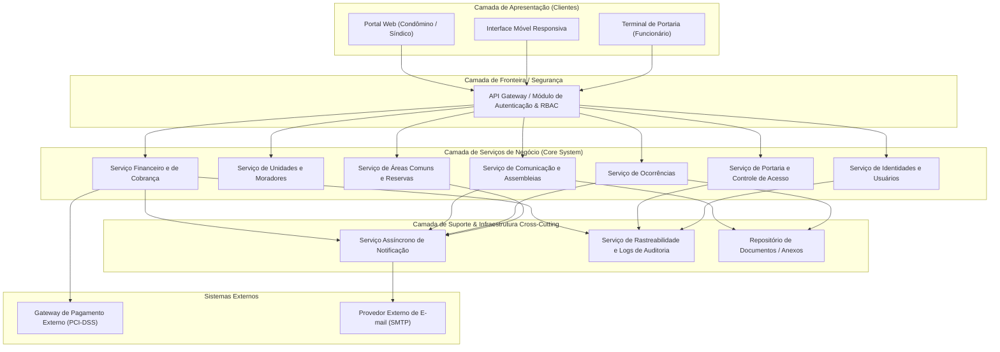
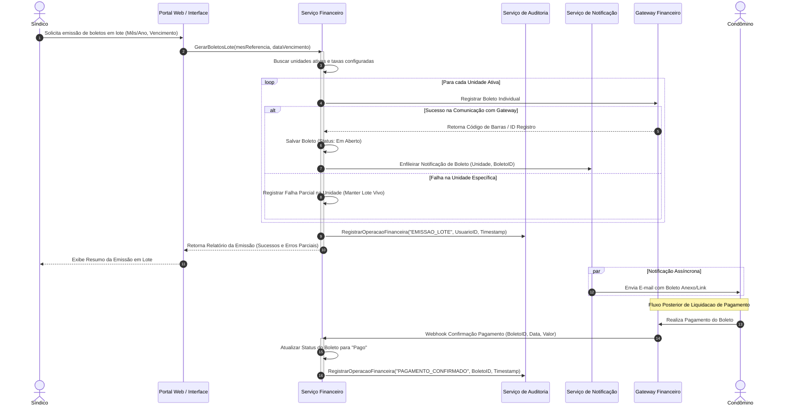
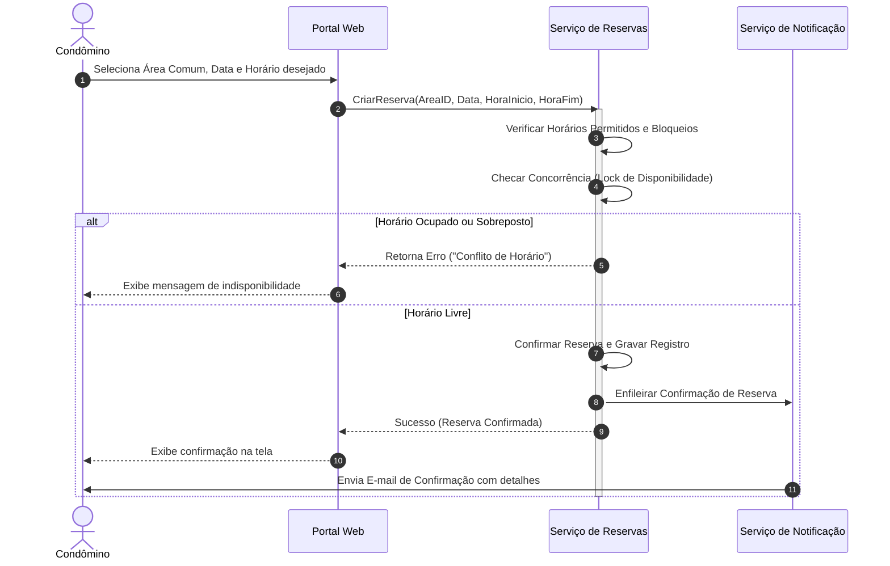

# Relatório Técnico de Arquitetura de Software

## 1. Identificação das HUs

A tabela abaixo estabelece o mapeamento entre as Histórias de Usuário (HUs), os perfis de acesso correlatos, as descrições funcionais e o rastreamento dos Requisitos Funcionais (RF) e Não Funcionais (RNF) correspondentes.

| ID HU | Perfil | Título | Descrição Resumida | RFs Associados | RNFs Associados |
| :--- | :--- | :--- | :--- | :--- | :--- |
| **HU01** | Síndico | Cadastrar unidades e moradores | Permite cadastrar unidades, vincular moradores (proprietários/inquilinos) e controlar veículos e desativação sem exclusão de histórico. | RF04, RF05, RF06, RF07, RF08 | RNF02, RNF04 |
| **HU02** | Síndico | Emitir boletos em lote | Permite gerar cobranças mensais massivas com mês de referência e vencimento, despachando boletos por e-mail e tratando falhas parciais. | RF09, RF10, RF13 | RNF05, RNF11, RNF13 |
| **HU03** | Síndico | Acompanhar inadimplências | Disponibiliza painel consolidado com filtros e exportação CSV das unidades com boletos vencidos em aberto. | RF15 | RNF08, RNF09 |
| **HU04** | Síndico | Publicar comunicados | Permite emitir avisos com opção de fixação no topo e envio imediato de notificações aos condôminos por e-mail. | RF16, RF17 | RNF13 |
| **HU05** | Síndico | Gerenciar ocorrências | Permite visualizar, categorizar e alterar status de solicitações/reclamações, disparando avisos aos solicitantes. | RF23, RF24 | RNF13 |
| **HU06** | Síndico | Criar e registrar assembleias | Permite agendar assembleias, notificar condôminos, registrar atas e vincular documentos em anexo (ex.: PDF de presença). | RF18, RF19 | RNF09, RNF10 |
| **HU07** | Síndico | Gerenciar áreas comuns e reservas | Permite cadastrar espaços, definir regras/horários, visualizar calendário consolidado e cancelar reservas com notificação. | RF25, RF29 | RNF08 |
| **HU08** | Condômino | Visualizar e pagar boleto pelo portal | Permite consultar boletos (em aberto/pagos/vencidos), efetuar download e processar pagamento via gateway. | RF10, RF11, RF12 | RNF01, RNF03, RNF05 |
| **HU09** | Condômino | Reservar área comum | Permite consultar disponibilidade em tempo real, agendar horários e receber confirmação por e-mail sem sobreposição. | RF26, RF27, RF28 | RNF07, RNF08 |
| **HU10** | Condômino | Registrar e acompanhar ocorrência | Permite abrir chamados com anexos/fotos e monitorar a evolução e o histórico de atualizações pelo portal. | RF21, RF24 | RNF09, RNF13 |
| **HU11** | Condômino | Pré-autorizar entrada de visitante | Permite cadastrar visitantes esperados por data, agilizando a liberação pela portaria e podendo cancelar a qualquer tempo. | RF31 | RNF04, RNF09 |
| **HU12** | Condômino | Acompanhar assembleias e consultar atas | Permite visualizar a pauta de assembleias futuras e efetuar download de atas anteriores no portal. | RF20 | RNF07, RNF10 |
| **HU13** | Funcionário | Registrar entrada e saída de visitantes | Permite controle rigoroso de acesso com documento, vinculação de pré-autorizações e encerramento de estadias. | RF30, RF32 | RNF04, RNF06 |
| **HU14** | Funcionário | Consultar pré-autorizações de acesso | Permite listar e filtrar as entradas liberadas pelos condôminos para o dia corrente. | RF32 | RNF06, RNF09 |

---

## 2. Diagramas de Arquitetura (Mermaid)

### 2.1 Visão Geral de Componentes da Solução (C4 Level 2 - Container / Componentes)

O diagrama abaixo apresenta os módulos lógicos do sistema, as interfaces de usuário e as integrações externas (Gateway de Pagamentos e Serviço de E-mail).

---

### 2.2 Diagrama de Sequência: Emissão e Processamento de Boletos em Lote (HU02, HU08, RF10-RF14)

O diagrama de sequência a seguir ilustra o ciclo transacional de emissão em lote de boletos pelo síndico, a notificação assíncrona, a confirmação via webhook/gateway e o registro de auditoria imutável.

---

### 2.3 Diagrama de Sequência: Reserva de Área Comum com Validação de Sobreposição (HU09, RF26, RF27)

Este diagrama detalha o tratamento de concorrência e validação no agendamento de espaços compartilhados.

---

## 3. Decisões de Arquitetura

### ADR-01: Autenticação, Autorização (RBAC) e Gerenciamento de Sessão
* **Contexto**: RF01, RF02, RF03, RNF01, RNF02. O sistema possui 4 perfis bem definidos (Síndico, Condômino, Funcionário, Administrador) com níveis de acesso distintos.
* **Decisão**: 
  1. A autenticação será centralizada no **Módulo de Autenticação e Gestão de Identidades**.
  2. Implementação do modelo **RBAC (Role-Based Access Control)** para controle granular de permissões por perfil em todas as chamadas de API.
  3. Armazenamento de credenciais utilizando algoritmo de hashing criptográfico unidirecional seguro com sal (conforme especificado em RNF02 - `bcrypt`).
  4. Encerramento automático de sessões inativas após 30 minutos contínuos sem requisições (RNF01), controlado por via de tokens de acesso com expiração curta e renovação vinculada à atividade do usuário.

### ADR-02: Padrão Transacional de Processamento e Auditoria Financeira
* **Contexto**: RF09-RF15, RNF03, RNF05, RNF11. Operações financeiras envolvem lotes massivos, integrações externas de pagamento e exigentem auditoria irrestrita.
* **Decisão**:
  1. **Isolamento de Dados Sensíveis**: Conformidade estrita com PCI-DSS (RNF03). Nenhum dado de cartão de crédito será trafegado ou armazenado na base local; todo o checkout e tokenização são delegados ao *Gateway de Pagamento Externo*.
  2. **Transacionalidade Parcial em Lote**: A geração de boletos em lote (RNF11) adotará o padrão de isolamento por unidade (*Unit-level Transactional Isolation*). A falha no processamento individual de uma unidade não anula o lote inteiro, registrando-se o status com sucesso parcial e gerando log de erro explícito por unidade afetada.
  3. **Imutabilidade de Trilha de Auditoria**: Qualquer gravação, liquidação ou alteração manual de cobrança (RF14) dispara obrigatoriamente um evento gravado pelo **Serviço de Rastreabilidade** em tabela com controle de escrita append-only (sem permissão de `UPDATE` ou `DELETE`), identificando o operador, carimbo de tempo e payload alterado (RNF05).

### ADR-03: Processamento Assíncrono de Notificações
* **Contexto**: RF17, RF24, HU02, HU04, HU09, HU10. Múltiplos eventos do sistema exigem o disparo automático de e-mails (novos comunicados, alterações de status de ocorrência, emissão de boletos, confirmação de reservas).
* **Decisão**:
  1. Adotar desacoplamento via **Filas de Mensagens / Notificações Assíncronas**. O serviço acionador (ex: Serviço de Comunicados) publica um evento de notificação e responde imediatamente à interface do usuário, evitando bloqueios na camada HTTP.
  2. O **Serviço Assíncrono de Notificação** consome os eventos e gerencia as retentativas (*retry pattern*) junto ao provedor de e-mail externo, isolando a disponibilidade do sistema de eventuais instabilidades na entrega de mensagens.

### ADR-04: Governança de Dados, Privacidade e Retenção (LGPD & Backup)
* **Contexto**: RF07, RNF04, RNF06, RNF12, RNF13. A solução manipula dados pessoais (nome, CPF, veículo, fotos, históricos de acesso).
* **Decisão**:
  1. **Preservação do Histórico de Moradores**: Para atender ao RF07 e à LGPD (RNF04), morador desativado terá seu acesso revogado e seus dados pessoais mantidos sob marcação de inatividade (`IsActive = false`), garantindo a integridade dos históricos financeiros e de acesso associados, com restrição de visibilidade apenas a auditorias legais e ao síndico.
  2. **Política de Log e Rastreabilidade de Visitantes**: Todo acesso registrado na portaria (RNF06) é auditável e imutável.
  3. **Estratégia de Backup e Retenção**: A infraestrutura deve realizar snapshots e backups lógicos automatizados diariamente (RNF12), armazenados com criptografia em repouso e política de retenção mínima de 90 dias.

### ADR-05: Controle de Concorrência e Reservas de Áreas Comuns
* **Contexto**: RF26, RF27, HU09. Impedir que dois condôminos reservem o mesmo espaço no mesmo intervalo de tempo simultaneamente.
* **Decisão**:
  1. Aplicação de **Locking Pessimista/Otimista no Mecanismo de Persistência** no momento da validação de choque de horários (`HoraInicio` e `HoraFim`).
  2. A verificação de disponibilidade e a criação do registro de reserva ocorrem dentro do mesmo bloco de isolamento de transação, garantindo consistência estrita (*serializable*) contra sobreposições (RF27).

---

## 4. Tabela de Componentes e Rastreabilidade

| Componente | Responsabilidade Principal | Comunica-se com | Origem (HU / Critério de Aceite) |
| :--- | :--- | :--- | :--- |
| **Portal Web / Interface Móvel** | Apresentação responsiva das funcionalidades para Síndico, Condômino e Funcionário. | API Gateway | HU01 a HU14; RNF09, RNF10 |
| **Módulo de Autenticação e Gestão de Identidades (IAM/RBAC)** | Autenticar usuários, aplicar hash `bcrypt`, gerenciar expiração de sessão (30 min) e impor controle de acesso baseado em papéis. | Todos os Serviços Core, Serviço de Auditoria | RF01, RF02, RF03; RNF01, RNF02 |
| **Gestor de Cadastros Base** | Administrar o ciclo de vida de unidades, moradores (proprietário/inquilino), desativação lógica e veículos. | API Gateway, Serviço de Auditoria | HU01; RF04, RF05, RF06, RF07, RF08 |
| **Módulo Financeiro e de Cobranças** | Gerenciar taxas, emissão de boletos em lote, atualização de status de boletos, registros manuais e painel de inadimplência. | Gateway Financeiro Externo, Serviço Assíncrono de Notificação, Serviço de Auditoria | HU02, HU03, HU08; RF09, RF10, RF12, RF13, RF14, RF15; RNF05, RNF08, RNF11 |
| **Adaptador de Integrador Financeiro** | Isolar a integração com Gateway de Pagamento externo, emitir códigos de barra e processar webhooks de confirmação (PCI-DSS). | Módulo Financeiro, Gateway de Pagamento Externo | HU08; RF11, RF12; RNF03 |
| **Módulo de Comunicação e Assembleias** | Gerenciar publicação/fixação de comunicados, agendamento de assembleias, registro de atas e upload de anexos em PDF. | Repositório de Documentos, Serviço Assíncrono de Notificação | HU04, HU06, HU12; RF16, RF18, RF19, RF20; RNF13 |
| **Módulo de Ocorrências** | Permitir abertura de chamados (com fotos), triagem pelo síndico, atualização de status e acompanhamento pelo condômino. | Repositório de Documentos, Serviço Assíncrono de Notificação | HU05, HU10; RF21, RF22, RF23, RF24; RNF13 |
| **Módulo de Reserva de Espaços Comuns** | Cadastrar áreas comuns, gerenciar regras/horários, prevenir reservas sobrepostas e exibir calendário de uso. | Serviço Assíncrono de Notificação | HU07, HU09; RF25, RF26, RF27, RF28, RF29; RNF08 |
| **Módulo de Portaria e Controle de Acesso** | Registrar entradas e saídas de visitantes, pré-autorizações por condôminos e consulta de histórico na portaria. | Serviço de Auditoria | HU11, HU13, HU14; RF30, RF31, RF32, RF33; RNF06 |
| **Serviço Assíncrono de Notificação** | Processar filas de e-mail para envio de boletos, avisos de comunicados, confirmações de reservas e mudanças de ocorrências. | Provedor Externo de E-mail | HU02, HU04, HU05, HU06, HU07, HU09, HU10; RF17, RF24 |
| **Serviço de Rastreabilidade e Logs de Auditoria** | Registrar de forma imutável todas as transações financeiras, alterações críticas, acessos de visitantes e logs do sistema. | Todos os Serviços Core | RNF05, RNF06, RNF13 |
| **Repositório de Documentos e Anexos** | Armazenar e servir arquivos anexos como atas de assembleias (PDF) e fotos de ocorrências de forma segura. | Módulo de Comunicação, Módulo de Ocorrências | HU06, HU10, HU12; RF19, RF21 |

---

## 5. Bloqueios e Pendências

### Bloqueios Identificados
1. **Regras de Cancelamento Financeiro e Reversão de Boletos Emitidos em Lote**:
   * *Descrição*: Os requisitos (RF10, RF13) cobrem a geração de boletos, mas não detalham o fluxo transacional quando uma taxa condominial é configurada incorretamente ou quando um boleto emitido em lote precisa ser cancelado/substituído antes do vencimento.
   * *Impacto*: Riscos de inconsistência de cobrança no Gateway Financeiro Externo e divergência nos dados do painel de inadimplência (RF15).

2. **Politica de Expiração e Validade Jurídica para Pré-Autorizações de Visitantes**:
   * *Descrição*: A HU11 e o RF31 permitem que condôminos pré-autorizem visitantes por data, porém não especificam o comportamento caso o visitante compareça em horário/data diferente da agendada ou a política de retenção desses registros em conformidade com a LGPD.
   * *Impacto*: Gargalo de segurança no controle de acesso pela portaria (HU13) e riscos de responsabilidade sobre privacidade de dados de terceiros.

### Pendências de Especificação
1. **Formato e Limite do Upload de Arquivos**:
   * *Descrição*: HU06 e HU10 mencionam anexar arquivos PDF (atas) e fotos (ocorrências), mas não estabelecem limites de tamanho por arquivo, cota por condomínio ou extensoes permitidas.
   * *Ação Necessária*: Definir especificação técnica de payload máximo e tipos de arquivos aceitos.
2. **Critérios de Tolerância e Reagendamento na Emissão Parcial de Boletos (RNF11)**:
   * *Descrição*: O RNF11 estabelece que a emissão em lote deve registrar quais unidades falharam. Falta definir se haverá mecanismo automatizado de *retry* (re-tentativa) ou se o fluxo dependerá exclusivamente de intervenção manual do síndico.

---

## 6. Cobertura de Requisitos

A matriz a seguir garante o mapeamento de 100% dos Requisitos Funcionais e Não Funcionais na arquitetura proposta.

| ID Requisito | Tipo | Coberto pelo Componente / Mecanismo Arquitetural | Status |
| :--- | :--- | :--- | :--- |
| **RF01** | Funcional | Módulo de Autenticação e Gestão de Identidades (RBAC) | Coberto |
| **RF02** | Funcional | Módulo de Autenticação e Gestão de Identidades (RBAC) | Coberto |
| **RF03** | Funcional | Módulo de Autenticação e Gestão de Identidades | Coberto |
| **RF04** | Funcional | Gestor de Cadastros Base | Coberto |
| **RF05** | Funcional | Gestor de Cadastros Base | Coberto |
| **RF06** | Funcional | Gestor de Cadastros Base | Coberto |
| **RF07** | Funcional | Gestor de Cadastros Base (Flag de Desativação Lógica) | Coberto |
| **RF08** | Funcional | Gestor de Cadastros Base | Coberto |
| **RF09** | Funcional | Módulo Financeiro e de Cobranças | Coberto |
| **RF10** | Funcional | Módulo Financeiro e de Cobranças | Coberto |
| **RF11** | Funcional | Adaptador de Integrador Financeiro | Coberto |
| **RF12** | Funcional | Adaptador de Integrador Financeiro / Webhooks | Coberto |
| **RF13** | Funcional | Módulo Financeiro e de Cobranças (Emissão em Lote) | Coberto |
| **RF14** | Funcional | Módulo Financeiro e de Cobranças / Serviço de Auditoria | Coberto |
| **RF15** | Funcional | Módulo Financeiro e de Cobranças (Painel de Inadimplência) | Coberto |
| **RF16** | Funcional | Módulo de Comunicação e Assembleias | Coberto |
| **RF17** | Funcional | Serviço Assíncrono de Notificação | Coberto |
| **RF18** | Funcional | Módulo de Comunicação e Assembleias | Coberto |
| **RF19** | Funcional | Módulo de Comunicação e Assembleias / Repositório de Docs | Coberto |
| **RF20** | Funcional | Módulo de Comunicação e Assembleias | Coberto |
| **RF21** | Funcional | Módulo de Ocorrências / Repositório de Docs | Coberto |
| **RF22** | Funcional | Módulo de Ocorrências | Coberto |
| **RF23** | Funcional | Módulo de Ocorrências | Coberto |
| **RF24** | Funcional | Serviço Assíncrono de Notificação | Coberto |
| **RF25** | Funcional | Módulo de Reserva de Espaços Comuns | Coberto |
| **RF26** | Funcional | Módulo de Reserva de Espaços Comuns | Coberto |
| **RF27** | Funcional | Módulo de Reserva de Espaços Comuns (Locking de Concorrência) | Coberto |
| **RF28** | Funcional | Módulo de Reserva de Espaços Comuns | Coberto |
| **RF29** | Funcional | Módulo de Reserva de Espaços Comuns (Calendário Consolidado) | Coberto |
| **RF30** | Funcional | Módulo de Portaria e Controle de Acesso | Coberto |
| **RF31** | Funcional | Módulo de Portaria e Controle de Acesso | Coberto |
| **RF32** | Funcional | Módulo de Portaria e Controle de Acesso | Coberto |
| **RF33** | Funcional | Módulo de Portaria e Controle de Acesso / Serviço de Auditoria | Coberto |
| **RNF01** | Não Funcional | Módulo de Autenticação (Sessão 30 min) | Coberto |
| **RNF02** | Não Funcional | Módulo de Autenticação (Hash bcrypt) | Coberto |
| **RNF03** | Não Funcional | Adaptador de Integrador Financeiro (Isolamento PCI-DSS) | Coberto |
| **RNF04** | Não Funcional | Diretriz LGPD em Gestor de Cadastros e Portaria | Coberto |
| **RNF05** | Não Funcional | Serviço de Rastreabilidade e Logs de Auditoria (Trilha Imutável) | Coberto |
| **RNF06** | Não Funcional | Serviço de Rastreabilidade (Logs de Visitantes) | Coberto |
| **RNF07** | Não Funcional | Infraestrutura e Arquitetura de Serviços (Disponibilidade 99,5%) | Coberto |
| **RNF08** | Não Funcional | Módulo Financeiro e Reserva (Desempenho <= 3s via Índices) | Coberto |
| **RNF09** | Não Funcional | Camada de Apresentação (Interface Responsiva Web/Mobile) | Coberto |
| **RNF10** | Não Funcional | Camada de Apresentação (Suporte Multi-browser) | Coberto |
| **RNF11** | Não Funcional | Módulo Financeiro (Emissão Transacional isolada em Lote) | Coberto |
| **RNF12** | Não Funcional | Infraestrutura de Backup Automatizado (Diário / Retenção 90 dias) | Coberto |
| **RNF13** | Não Funcional | Serviço de Rastreabilidade e Logs de Auditoria | Coberto |

---

## 7. Gap Analysis

Esta seção consolida as lacunas encontradas nos requisitos de entrada, os riscos arquiteturais derivados e as ações necessárias recomendadas para a fase de construção.

| # | Gap / Lacuna Identificada | Impacto Arquitetural / Téchnico | Ação Recomendada |
| :--- | :--- | :--- | :--- |
| **1** | **Comunicação Assíncrona e Webhook Fallback para Boletos (RF11, RF12)** | Risco de perda de confirmações de pagamento caso o webhook do Gateway de Pagamento falhe ou fique indisponível temporariamente. | Implementar uma tarefa programada (*Cron/Worker*) de reconciliação bancária periódica para consultar o status de boletos pendentes diretamente na API do Gateway. |
| **2** | **Tratamento de Sobrecarga no Envio Massivo de E-mails (HU02, HU04)** | O disparo de comunicados ou boletos para centenas de condôminos simultaneamente pode causar gargalos e bloqueios no servidor SMTP ou marcar o domínio como SPAM. | Adotar arquitetura de enfileiramento com *rate limiting* e integrar com serviço terceirizado especializado em e-mails transacionais. |
| **3** | **Exportação do Painel de Inadimplência (HU03, RNF08)** | Requisições concorrentes de exportação de grandes volumes em CSV podem elevar o consumo de memória e comprometer a meta de tempo de resposta (<3s). | Gerar os arquivos CSV via processamento assíncrono ou com consulta otimizada paginada em memória via *streaming*. |
| **4** | **Gestão de Exceções no Registro de Visitas sem Pré-Autorização (RF30, RF31)** | Falta definir no fluxo de portaria o procedimento quando o visitante chega sem pré-autorização e o condômino não atende a interfonia/contato. | Incluir na interface da portaria um status temporário de "Aguardando Liberação" com registro de tentativa para fins de auditoria. |
| **5** | **Política de Retenção e Anonimização de Pessoas Físicas (RNF04 - LGPD)** | Manter dados de condôminos/moradores antigos indefinidamente viola o princípio da minimização da LGPD se não houver base legal especificada. | Definir regra de negócio para anonimização automatizada dos dados pessoais de ex-moradores após o prazo legal caduco de guarda financeira/jurídica. |