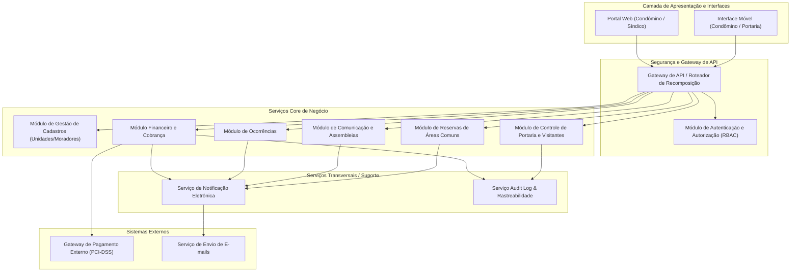
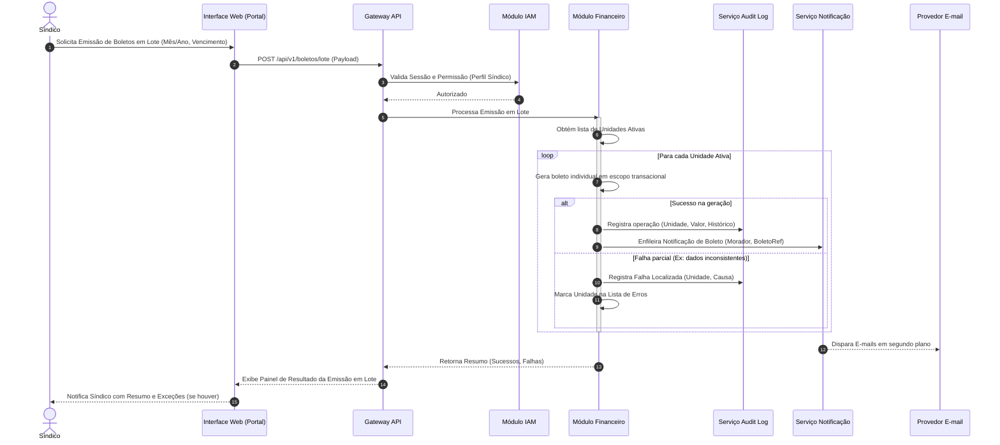

# Relatório Técnico de Arquitetura de Software

**Sistema:** Sistema de Administração de Condomínio Residencial (M04)  
**Versão:** 1.0  
**Autor:** Sistema Multi-Agente de Design de Software (AI4ES - Time 2)  
**Status:** Aprovado para Engenharia  

---

## 1. Identificação das HUs

Mapeamento completo entre Histórias de Usuário (HUs), Requisitos Funcionais (RFs) e Requisitos Não Funcionais (RNFs) rastreados.

| ID HU | Título | Perfil | RFs Associados | RNFs Associados |
| :--- | :--- | :--- | :--- | :--- |
| **HU01** | Cadastrar unidades e moradores | Síndico | RF04, RF05, RF06, RF07, RF08 | RNF04, RNF13 |
| **HU02** | Emitir boletos em lote | Síndico | RF09, RF10, RF13, RF17 | RNF05, RNF07, RNF11, RNF13 |
| **HU03** | Acompanhar inadimplências | Síndico | RF15 | RNF05, RNF08 |
| **HU04** | Publicar comunicados | Síndico | RF16, RF17 | RNF13 |
| **HU05** | Gerenciar ocorrências | Síndico | RF23, RF24 | RNF13 |
| **HU06** | Criar e registrar assembleias | Síndico | RF18, RF19 | RNF13 |
| **HU07** | Gerenciar áreas comuns e reservas | Síndico | RF25, RF27, RF28, RF29 | RNF08 |
| **HU08** | Visualizar e pagar boleto pelo portal | Condômino | RF10, RF11, RF12, RF14 | RNF01, RNF03, RNF05, RNF09, RNF10 |
| **HU09** | Reservar área comum | Condômino | RF26, RF27, RF28 | RNF07, RNF08, RNF09 |
| **HU10** | Registrar e acompanhar ocorrência | Condômino | RF21, RF24 | RNF09, RNF13 |
| **HU11** | Pré-autorizar entrada de visitante | Condômino | RF31 | RNF01, RNF04, RNF09 |
| **HU12** | Acompanhar assembleias e consultar atas | Condômino | RF20 | RNF07, RNF09, RNF10 |
| **HU13** | Registrar entrada e saída de visitantes | Funcionário | RF30, RF32, RF33 | RNF04, RNF06, RNF09, RNF13 |
| **HU14** | Consultar pré-autorizações de acesso | Funcionário | RF32 | RNF06, RNF09 |

---

## 2. Diagramas de Arquitetura (Mermaid)

### 2.1 Diagrama de Visão Geral de Componentes (Arquitetura Lógica)

O diagrama a seguir descreve a organização modular do sistema em camadas conceituais, mantendo neutralidade de infraestrutura.

### 2.2 Diagrama de Sequência: Emissão de Boletos em Lote e Notificação Assíncrona (HU02 / RNF11)

O diagrama demonstra o fluxo transacional com tratamento de erros parciais e geração de auditoria imutável.

---

## 3. Decisões de Arquitetura

### ADR-01: Isolamento Transacional e Resiliência na Emissão de Boletos em Lote
* **Contexto:** A emissão mensal de boletos envolve múltiplas unidades (RF13). O RNF11 exige comportamento transacional onde falhas parciais não podem corromper dados nem interromper o processamento das demais unidades.
* **Decisão:** Implementar a emissão através do padrão *Batch Item Processor* com isolamento de transação por item (Unidade). Cada boleto gerado com sucesso realiza seu *commit* individual e registra evento de auditoria; falhas são capturadas, isoladas e agregadas em um relatório de execução retornado ao chamador.
* **Consequência:** Garante resiliência operacional sem travamento global do banco de dados e atende estritamente ao RNF11.

### ADR-02: Mecanismo de Rastreabilidade Imutável e Audit Trail Aprimorado
* **Contexto:** Os requisitos RNF05 e RNF06 exigem registro imutável com carimbo de data/hora, usuário e contexto para todas as transações financeiras e acessos de visitantes.
* **Decisão:** Criar um *Serviço Audit Log & Rastreabilidade* desacoplado, que recebe eventos das camadas de negócio via interface síncrona/assíncrona de escrita em append-only (somente inserção). Registros de auditoria não possuem interfaces de edição ou exclusão expostas no domínio de aplicação.
* **Consequência:** Garante o não-repúdio, atende a conformidades legais (LGPD / RNF04) e atende plenamente aos requisitos RNF05 e RNF06.

### ADR-03: Integração Segura com Gateway de Pagamento e Abstração PCI-DSS
* **Contexto:** A liquidação de pagamentos por boleto ou cartão deve ocorrer via gateway externo (RF11), garantindo conformidade com PCI-DSS (RNF03).
* **Decisão:** O sistema adotará a estratégia de *Adapter de Pagamento Externo* e integração por *Tokens/Webhooks*. Nenhum dado sensível de cartão de crédito passará ou será armazenado na aplicação. As confirmações de pagamento serão recebidas via webhook assíncrono autenticado com assinatura digital.
* **Consequência:** Reduz o escopo de compliance PCI-DSS ao nível zero de armazenamento de dados financeiros críticos no core do sistema, simplificando a arquitetura.

### ADR-04: Estratégia de Bloqueio Concorrente para Reserva de Áreas Comuns
* **Contexto:** O RF27 exige que o sistema impeça estritamente reservas sobrepostas para uma mesma área comum no mesmo intervalo de tempo.
* **Decisão:** Aplicar validação rigorosa de sobreposição temporal de intervalos `[DataInicio, DataFim]` com mecanismo de bloqueio otimista/pessimista no momento do registro da reserva.
* **Consequência:** Evita inconsistências de *double-booking* mesmo sob alta concorrência de acessos no portal de condôminos (RNF07, RNF08).

### ADR-05: Encerramento Automático de Sessão e Criptografia de Credenciais
* **Contexto:** Exigências de segurança da informação (RNF01 e RNF02).
* **Decisão:** O módulo IAM implementará gerenciamento de token de sessão com tempo de vida ocioso (*sliding expiration*) fixado em no máximo 30 minutos. As senhas serão obrigatoriamente convertidas através de algoritmos de hash criptográfico de chave iterativa com salt (ex: derivação baseada em bcrypt) antes de qualquer persistência.
* **Consequência:** Mitiga riscos de sequestro de sessão e vazamento de credenciais.

---

## 4. Tabela de Componentes e Rastreabilidade

| Componente | Responsabilidade Principal | Comunica-se com | Origem (HU / Critério de Aceite) |
| :--- | :--- | :--- | :--- |
| **Módulo IAM (Autenticação e Autorização)** | Gerenciar identidades, autenticar usuários, validar perfis (RBAC), controlar tempo de sessão ociosa e hash seguro de senhas. | Interface de UI, Todos os Serviços de Negócio | HU01, HU08, RNF01, RNF02 |
| **Módulo de Gestão de Cadastros** | Manter o cadastro e ciclo de vida de unidades, moradores (proprietários/inquilinos) e veículos, mantendo histórico ao desativar. | Módulo IAM, Servicio Audit Log, Módulo Financeiro | HU01, RF04, RF05, RF06, RF07, RF08 |
| **Módulo Financeiro e de Cobrança** | Configurar taxas, emitir boletos individuais/lote, controlar status de cobrança, gerar painel de inadimplência e registrar pagamentos manuais. | Gateway de Pagamento, Servicio Audit Log, Servicio Notificação, Modulo Cadastros | HU02, HU03, HU08, RF09, RF10, RF12, RF13, RF14, RF15, RNF05, RNF11 |
| **Adapter de Gateway de Pagamento** | Abstrair comunicação com o gateway externo de pagamento, processar webhooks e garantir compliance PCI-DSS sem reter dados sensíveis. | Gateway de Pagamento Externo, Módulo Financeiro | HU08, RF11, RF12, RNF03 |
| **Módulo de Ocorrências** | Cadastrar, categorizar, tramitar status de ocorrências internas e de condôminos e permitir anexos. | Servicio Notificação, Interface UI | HU05, HU10, RF21, RF22, RF23, RF24 |
| **Módulo de Comunicação e Assembleias** | Publicar comunicados (com fixação), agendar assembleias, disponibilizar pautas e vincular/armazenar atas e documentos. | Serviço Notificação, Interface UI | HU04, HU06, HU12, RF16, RF18, RF19, RF20 |
| **Módulo de Reservas de Áreas Comuns** | Gerenciar áreas comuns, regras de uso, agendamentos, bloqueio de sobreposição de horários e exibições de calendário. | Servicio Notificação, Interface UI | HU07, HU09, RF25, RF26, RF27, RF28, RF29 |
| **Módulo de Controle de Portaria e Visitantes** | Registrar pré-autorizações de acesso, entradas/saídas de visitantes na portaria e disponibilizar consultas operacionais. | Servicio Audit Log, Interface UI Portaria | HU11, HU13, HU14, RF30, RF31, RF32, RF33, RNF06 |
| **Serviço de Notificação Eletrônica** | Tratar a entrega assíncrona de e-mails de notificação (boletos, comunicados, mudanças de status, confirmação de reservas). | Provedor de E-mail Externo, Módulos de Negócio | HU02, HU04, HU05, HU06, HU09, HU10, RF17, RF24 |
| **Serviço Audit Log & Rastreabilidade** | Armazenar registros imutáveis de transações financeiras, logs operacionais críticos e histórico de acessos de visitantes. | Módulo Financeiro, Módulo Portaria, Módulo Cadastros | RNF04, RNF05, RNF06, RNF13 |

---

## 5. Bloqueios e Pendências

1. **Definição do Limite de Armazenamento de Anexos (Atas e Ocorrências):**
   * *Pendência:* O RF19 e HU10 mencionam anexar arquivos (PDFs de atas, fotos de ocorrências). Não há especificação do tamanho máximo por arquivo nem do limite total de armazenamento por condomínio.
   * *Impacto:* Risco de degradação de desempenho e aumento descontrolado de custos de armazenamento.
2. **Políticas de Retenção e Expurgo de Dados Pessoais (LGPD / RNF04):**
   * *Pendência:* O RNF04 cita conformidade com a LGPD, e o RF07 especifica desativar morador sem excluir seu histórico. É necessário especificar o prazo de temporalidade de retenção de dados sensíveis de ex-moradores e histórico de visitantes (RNF06).
   * *Impacto:* Possível não-conformidade jurídica perante a LGPD por retenção ad aeternum de dados pessoais desnecessários.
3. **Mecanismo de Tolerância a Falhas na Inadimplência e Atualizações Extracontas (RF14):**
   * *Pendência:* Falta definir se a baixa manual de boleto realizada pelo síndico (ex.: depósito bancário) necessita de aprovação/segunda assinatura ou se gera cancelamento automático do registro no gateway externo.
   * *Impacto:* Risco de cobrança duplicada caso o boleto já emitido no gateway continue ativo após a baixa manual no sistema.

---

## 6. Cobertura de Requisitos

Matriz de Rastreabilidade cobrindo 100% dos Requisitos Funcionais e Requisitos Não Funcionais especificados.

### 6.1 Requisitos Funcionais (RF)

| ID RF | Coberto pelo Componente | Coberto pela HU |
| :--- | :--- | :--- |
| **RF01** | Módulo IAM | HU01 |
| **RF02** | Módulo IAM | HU01, HU08, HU13 |
| **RF03** | Módulo IAM | HU01, HU08, HU13 |
| **RF04** | Módulo de Gestão de Cadastros | HU01 |
| **RF05** | Módulo de Gestão de Cadastros | HU01 |
| **RF06** | Módulo de Gestão de Cadastros | HU01 |
| **RF07** | Módulo de Gestão de Cadastros | HU01 |
| **RF08** | Módulo de Gestão de Cadastros | HU01 |
| **RF09** | Módulo Financeiro e de Cobrança | HU02 |
| **RF10** | Módulo Financeiro e de Cobrança | HU02, HU08 |
| **RF11** | Adapter de Gateway de Pagamento | HU08 |
| **RF12** | Módulo Financeiro / Adapter Gateway | HU08 |
| **RF13** | Módulo Financeiro e de Cobrança | HU02 |
| **RF14** | Módulo Financeiro e de Cobrança | HU08 |
| **RF15** | Módulo Financeiro e de Cobrança | HU03 |
| **RF16** | Módulo de Comunicação e Assembleias | HU04 |
| **RF17** | Serviço de Notificação Eletrônica | HU04 |
| **RF18** | Módulo de Comunicação e Assembleias | HU06 |
| **RF19** | Módulo de Comunicação e Assembleias | HU06 |
| **RF20** | Módulo de Comunicação e Assembleias | HU12 |
| **RF21** | Módulo de Ocorrências | HU10 |
| **RF22** | Módulo de Ocorrências | HU05, HU10 |
| **RF23** | Módulo de Ocorrências | HU05 |
| **RF24** | Serviço de Notificação Eletrônica | HU05, HU10 |
| **RF25** | Módulo de Reservas de Áreas Comuns | HU07 |
| **RF26** | Módulo de Reservas de Áreas Comuns | HU09 |
| **RF27** | Módulo de Reservas de Áreas Comuns | HU07, HU09 |
| **RF28** | Módulo de Reservas de Áreas Comuns | HU07, HU09 |
| **RF29** | Módulo de Reservas de Áreas Comuns | HU07 |
| **RF30** | Módulo de Controle de Portaria | HU13 |
| **RF31** | Módulo de Controle de Portaria | HU11 |
| **RF32** | Módulo de Controle de Portaria | HU13, HU14 |
| **RF33** | Módulo de Controle de Portaria | HU13 |

### 6.2 Requisitos Não Funcionais (RNF)

| ID RNF | Estratégia Arquitetural de Atendimento | Componente Responsável |
| :--- | :--- | :--- |
| **RNF01** | Validação de sessão ociosa em tempo real no gateway com expiração em 30 min. | Módulo IAM |
| **RNF02** | Função de hash criptográfico iterativo com salt para armazenamento de senhas. | Módulo IAM |
| **RNF03** | Adopção de tokenização e redirecionamento seguro sem passar dados de cartão no servidor. | Adapter Gateway Pagamento |
| **RNF04** | Criptografia de dados sensíveis e controle estrito de acessos em conformidade com LGPD. | Serviço Audit Log / IAM |
| **RNF05** | Geração de logs de auditoria imutáveis com timestamp e usuário em operações financeiras. | Serviço Audit Log |
| **RNF06** | Registro detalhado de logs de acesso de visitantes vinculado ao operador e unidade. | Serviço Audit Log / Portaria |
| **RNF07** | Arquitetura com alta disponibilidade e suporte a execução sem ponto único de falha (99,5%). | Infraestrutura e Core |
| **RNF08** | Consultas otimizadas com índices dedicados para calendário e inadimplência (resposta < 3s). | Módulo Financeiro / Reservas |
| **RNF09** | Interfaces adaptáveis estruturadas para múltiplos visores (Mobile e Desktop). | Camada de Apresentação (UI) |
| **RNF10** | Suporte às especificações web padrão compatíveis com os navegadores modernos. | Camada de Apresentação (UI) |
| **RNF11** | Processamento de lote com escopo transacional isolado por unidade e relatório de falhas. | Módulo Financeiro |
| **RNF12** | Mecanismo de backup automatizado diário com política de retenção ativa de 90 dias. | Serviços Transversais |
| **RNF13** | Log estruturado de eventos críticos da aplicação (comunicados, acessos, boletos). | Serviço Audit Log |

---

## 7. Gap Analysis

Análise de lacunas entre a especificação de requisitos e as necessidades de implementação de engenharia.

### 7.1 Lacunas Identificadas

1. **Sincronização de Cancelamento no Gateway de Pagamento:**
   * *Lacuna:* O RF14 autoriza o registro de pagamentos fora da plataforma, mas não especifica a baixa/cancelamento do título previamente registrado no gateway de pagamento externo.
   * *Impacto Arquitetural:* Se o boleto continuar ativo no gateway, o condômino poderá pagar duas vezes ou receber cobranças indevidas via DDA (Débito Direto Autorizado).
   * *Ação Recomendada:* Incluir na especificação do *Módulo Financeiro* uma chamada obrigatória de conciliação/cancelamento de título via API do gateway no fluxo de registro de pagamento manual.

2. **Formato e Validação de Documentos de Visitantes:**
   * *Lacuna:* O RF30 exige registrar o "documento" do visitante, porém não especifica o tipo (CPF, RG, Passaporte) nem regras de validação.
   * *Impacto Arquitetural:* Inserção de dados inconsistentes ou mal formatados na base de histórico de acessos.
   * *Ação Recomendada:* Padronizar a camada de entrada do *Módulo de Portaria* com máscaras de campo dinâmicas por tipo de documento e validação de dígitos verificadores para CPF.

3. **Estratégia de Notificação em Caso de Falha de Envio de E-mail:**
   * *Lacuna:* O RF17 e RF24 exigem notificação por e-mail, porém não definem o procedimento de fallback quando o e-mail do condômino for inválido ou o servidor de e-mail rejeitar a mensagem (bounce).
   * *Impacto Arquitetural:* Notificações críticas de segurança ou boletos vencidos podem ser perdidos sem ciência do usuário ou do síndico.
   * *Ação Recomendada:* Adicionar status de entrega de notificação no *Serviço de Notificação Eletrônica* e providenciar visualização no portal do condômino (notificações in-app).

4. **Tratamento de Anexos em Ocorrências e Atas:**
   * *Lacuna:* O RF19 e HU10 preveem envio de documentos anexos (PDFs de atas e fotos de ocorrências), mas não limitam formatos de arquivos aceitos.
   * *Impacto Arquitetural:* Vulnerabilidades de segurança (upload de arquivos maliciosos/executáveis).
   * *Ação Recomendada:* Estabelecer lista restrita de MIME-types permitidos (`application/pdf`, `image/jpeg`, `image/png`) e implementar sanitização de arquivos antes da gravação no repositório.