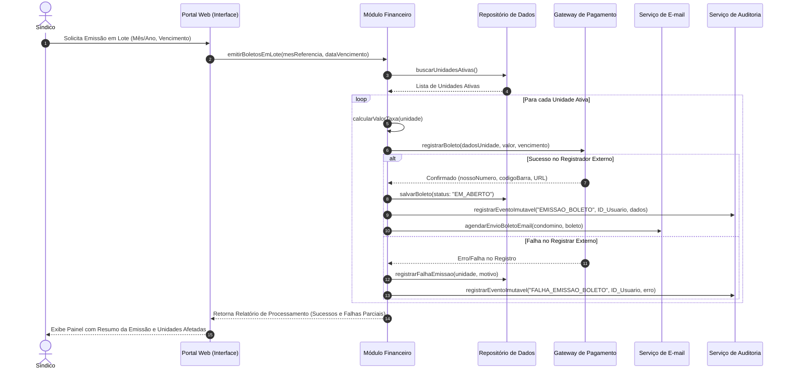

# Relatório Técnico de Arquitetura de Software

## 1. Identificação das HUs

A tabela abaixo mapeia o conjunto de Histórias de Usuário (HUs) extraídas dos requisitos de negócio, detalhando os perfis envolvidos, seus objetivos principais e o escopo funcional/impacto no sistema.

| ID HU | Título | Papel / Ator | Objetivo Principal | Escopo / Impacto Arquitetural |
| :--- | :--- | :--- | :--- | :--- |
| **HU01** | Cadastrar unidades e moradores | Síndico | Manter cadastro de unidades, moradores (proprietários/inquilinos) e veículos atualizados. | Gestão de dados cadastrais centrais; validação de unicidade de CPF; suporte a múltiplos moradores por unidade. |
| **HU02** | Emitir boletos em lote | Síndico | Gerar boletos mensais para todas as unidades ativas de forma automatizada. | Processamento transacional em lote; notificação assíncrona; isolamento de falhas parciais (RNF11). |
| **HU03** | Acompanhar inadimplências | Síndico | Consultar e exportar relatórios/painéis de boletos em atraso por período e bloco. | Consultas analíticas agregadas; exportação de dados (CSV); alta disponibilidade e tempo de resposta curto (RNF08). |
| **HU04** | Publicar comunicados | Síndico | Disparar avisos e notícias para os moradores no portal e via e-mail. | Publicação de conteúdo; disparo massivo de notificações por e-mail; ordenação/fixação no topo. |
| **HU05** | Gerenciar ocorrências | Síndico | Categorizar, acompanhar e atualizar o ciclo de vida de chamados dos moradores/funcionários. | Controle de estados (workflow); filtragem parametrizada; notificações por e-mail a cada mudança de estado. |
| **HU06** | Criar e registrar assembleias | Síndico | Agendar eventos deliberativos e disponibilizar atas/anexos pós-evento. | Gestão de eventos; armazenamento e distribuição de arquivos vinculados (PDFs); notificações. |
| **HU07** | Gerenciar áreas comuns e reservas | Síndico | Configurar espaços compartilhados, limites, antecedência e visibilidade de reservas. | Definição de regras de domínio; visualização de calendário global; capacidade de cancelamento administrativo. |
| **HU08** | Visualizar e pagar boleto | Condômino | Consultar boletos pendentes/pagos e obter dados/arquivos para pagamento. | Consulta de dados financeiros pessoais; integração com gateway de pagamento; atualização de status em tempo real. |
| **HU09** | Reservar área comum | Condômino | Solicitar reserva de espaço em data/horário específicos pelo portal. | Controle estrito de concorrência (evitar sobreposição - RF27); confirmação imediata e notificação. |
| **HU10** | Registrar e acompanhar ocorrência | Condômino | Abrir solicitações/reclamações com anexos e acompanhar o histórico de resolução. | Entrada de dados pelos condôminos; suporte a upload de imagens; visualização de linha do tempo de status. |
| **HU11** | Pré-autorizar entrada de visitante | Condômino | Cadastrar visitas esperadas para agilizar a liberação na portaria. | Liberação antecipada de acesso; expiração por data; integração com o módulo de portaria. |
| **HU12** | Acompanhar assembleias e atas | Condômino | Consultar agenda de assembleias futuras e baixar atas de reuniões passadas. | Visualização read-only de eventos e documentos anexos em PDF. |
| **HU13** | Registrar entrada/saída de visitante | Funcionário | Controlar o fluxo físico de entrada e saída na portaria do condomínio. | Operação em tempo real; consulta rápida de pré-autorizações; auditoria imutável de acessos (RNF06). |
| **HU14** | Consultar pré-autorizações | Funcionário | Listar autorizações prévias do dia para validação rápida no acesso. | Filtro otimizado para portaria; vinculação entre a pré-autorização e o registro efetivo de entrada. |

---

## 2. Diagramas de Arquitetura (Mermaid)

### 2.1 Visão Geral de Componentes da Arquitetura

O diagrama abaixo ilustra os módulos lógicos do sistema, suas interações e as integrações externas necessárias.

```mermaid
graph TD
    classDef client fill:#e1f5fe,stroke:#0288d1,stroke-width:1px,color:#01579b;
    classDef core fill:#fff3e0,stroke:#f57c00,stroke-width:1px,color:#e65100;
    classDef ext fill:#eceff1,stroke:#607d8b,stroke-width:1px,color:#263238;
    classDef store fill:#e8f5e9,stroke:#388e3c,stroke-width:1px,color:#1b5e20;

    subgraph Interface_Usuario [" Camada de Apresentação (Responsiva) "]
        PortalWeb["Portal Web / Mobile App"]:::client
        InterfacePortaria["Terminal de Portaria"]:::client
    end

    subgraph Módulos_Core [" Núcleo do Sistema (Backend) "]
        AuthModule["Módulo de Autenticação & Autorização (RBAC)"]:::core
        CadastrosModule["Módulo de Unidades e Moradores"]:::core
        FinancModule["Módulo Financeiro & Boletos"]:::core
        CommsModule["Módulo de Comunicados & Assembleias"]:::core
        OcorrenciasModule["Módulo de Ocorrências"]:::core
        ReservasModule["Módulo de Áreas Comuns & Reservas"]:::core
        PortariaModule["Módulo de Controle de Acesso & Visitantes"]:::core
        AuditModule["Serviço de Trilha de Auditoria & Logs Imutáveis"]:::core
    end

    subgraph Serviços_Externos [" Integradores Externos "]
        PaymentGateway["Gateway de Pagamento Externo"]:::ext
        EmailService["Serviço Externo de E-mail (SMTP/API)"]:::ext
    end

    subgraph Camada_Dados [" Persistência de Dados & Arquivos "]
        DataStore[("Repositório de Dados Persistente")]:::store
        FileStore[("Repositório de Documentos / Anexos")]:::store
    end

    %% Conexões Apresentação -> Backend
    PortalWeb --> AuthModule
    PortalWeb --> CadastrosModule
    PortalWeb --> FinancModule
    PortalWeb --> CommsModule
    PortalWeb --> OcorrenciasModule
    PortalWeb --> ReservasModule
    PortalWeb --> PortariaModule

    InterfacePortaria --> AuthModule
    InterfacePortaria --> PortariaModule
    InterfacePortaria --> OcorrenciasModule

    %% Conexões Internas
    FinancModule --> PaymentGateway
    FinancModule --> AuditModule
    PortariaModule --> AuditModule
    OcorrenciasModule --> AuditModule
    
    CommsModule --> EmailService
    OcorrenciasModule --> EmailService
    FinancModule --> EmailService
    ReservasModule --> EmailService

    %% Persistência
    AuthModule --> DataStore
    CadastrosModule --> DataStore
    FinancModule --> DataStore
    CommsModule --> DataStore
    CommsModule --> FileStore
    OcorrenciasModule --> DataStore
    OcorrenciasModule --> FileStore
    ReservasModule --> DataStore
    PortariaModule --> DataStore
    AuditModule --> DataStore
```

### 2.2 Diagrama de Sequência: Emissão de Boletos em Lote e Notificação (HU02 / RF13 / RNF11)

Diagrama detalhado que demonstra a transacionalidade em lote, com isolamento de falhas parciais e auditoria.

---

## 3. Decisões de Arquitetura

### D1: Arquitetura Modular por Bounded Contexts (Monólito Modular ou Microserviços Lógicos)
* **Descrição**: A arquitetura é dividida internamente em domínios bem delimitados (*Auth*, *Cadastros*, *Financeiro*, *Comunicação*, *Ocorrências*, *Reservas*, *Portaria*, *Auditoria*).
* **Justificativa**: Garante o isolamento de responsabilidades, facilitando a manutenibilidade (RNF13) e permitindo evoluções independentes de regras de negócio sem acoplamento nocivo entre financeiro e controle de acesso, por exemplo.

### D2: Garantia de Concorrência Positiva em Reservas de Áreas Comuns
* **Descrição**: Implementação de mecanismos de *Locking* (Bloqueio Transacional) ou Validação Atômica no nível da camada de persistência/serviço para verificação de disponibilidade de datas/horários.
* **Justificativa**: Atende diretamente ao requisito **RF27** ("impedir reservas sobrepostas para uma mesma área comum no mesmo horário"), garantindo a consistência das reservas mesmo em cenários de requisições simultâneas.

### D3: Processamento Resiliente e Parcial de Operações em Lote
* **Descrição**: A emissão de boletos em lote (HU02 / RF13) deve operar em modo transacional iterativo com tratamento individualizado por unidade.
* **Justificativa**: Cumpre o requisito **RNF11**, garantindo que uma falha ao gerar o boleto de uma unidade específica (ex.: falha de comunicação com o gateway) não aborte o lote inteiro, registrando o erro específico e concluindo com sucesso os demais boletos.

### D4: Estrutura de Auditoria e Logs Imutáveis
* **Descrição**: Criação de um serviço dedicado de auditoria centralizado que registra eventos de alteração de estados financeiros e acessos de visitantes.
* **Justificativa**: Atende aos requisitos **RNF05** (registros imutáveis de operações financeiras com usuário, data e hora), **RNF06** (logs de acessos de visitantes) e **RNF13** (logs de eventos críticos).

### D5: Estratégia de Conformidade com LGPD e Segurança
* **Descrição**: Armazenamento de credenciais via *hashing* irreversível forte (RNF02), encerramento de sessão inativa após 30 minutos (RNF01) e isolamento dos dados de pagamentos através da não retenção de dados sensíveis de cartão no sistema (delegando inteiramente ao Gateway PCI-DSS conforme RNF03).
* **Justificativa**: Assegura a conformidade regulatória (RNF04 - LGPD) e a proteção de dados sensíveis dos moradores e visitantes.

---

## 4. Tabela de Componentes e Rastreabilidade

| Componente | Responsabilidade Principal | Comunica-se com | Origem (HU / Critério de Aceite) |
| :--- | :--- | :--- | :--- |
| **Gestor de Autenticação e Autorização** | Autenticar usuários, gerenciar sessões (timeout de 30 min), aplicar hash de senhas e controlar acessos por perfil (RBAC). | Todos os módulos do sistema. | RF01, RF02, RF03, RNF01, RNF02 |
| **Gestor de Cadastro Predial e Moradores** | Cadastrar e gerenciar unidades, moradores (proprietários/inquilinos), históricos e veículos vinculados. | Gestor de Autenticação, Módulo Financeiro, Controle de Portaria. | RF04, RF05, RF06, RF07, RF08, HU01 |
| **Processador Financeiro e Boletos** | Configurar taxas condominiais, emitir boletos individuais/lote, calcular inadimplências e gerar relatórios. | Integrador de Gateway, Serviço de Notificação, Repositório de Auditoria. | RF09, RF10, RF12, RF13, RF14, RF15, HU02, HU03, HU08, RNF11 |
| **Integrador de Gateway de Pagamento** | Comunicar-se com APIs financeiras externas para registro de boletos, recebimento de confirmações de pagamento via webhook/retorno e adesão a PCI-DSS. | Processador Financeiro, Gateway Externo de Pagamentos. | RF11, RF12, RNF03 |
| **Central de Comunicados e Assembleias** | Publicar comunicados (com fixação no topo), agendar assembleias, disponibilizar atas e anexos em PDF. | Servicio de Notificação, Repositório de Documentos. | RF16, RF18, RF19, RF20, HU04, HU06, HU12 |
| **Motor de Ocorrências** | Registrar chamados (moradores/funcionários), gerenciar ciclo de vida (aberta, em andamento, encerrada), categorizar e anexar mídias. | Servicio de Notificação, Repositório de Documentos, Repositório de Auditoria. | RF21, RF22, RF23, HU05, HU10 |
| **Agendador e Validador de Reservas** | Cadastrar áreas comuns, gerenciar regras/horários, consultar disponibilidade e processar reservas sem sobreposição. | Servicio de Notificação, Gestor de Cadastro. | RF25, RF26, RF27, RF28, RF29, HU07, HU09 |
| **Controlador de Acesso e Portaria** | Gerenciar pré-autorizações de visitantes, registrar entrada/saída físico-temporal e consultar históricos. | Repositório de Auditoria, Gestor de Cadastro. | RF30, RF31, RF32, RF33, HU11, HU13, HU14, RNF06 |
| **Serviço de Notificação** | Enviar alertas e e-mails automáticos acionados por eventos do sistema (novos comunicados, mudanças de status, boletos, confirmação de reservas). | Serviço Externo de E-mail, Módulos (Financeiro, Comunicação, Ocorrências, Reservas). | RF17, RF24, HU02, HU04, HU05, HU06, HU09, HU10 |
| **Repositório de Auditoria e Log Imutável** | Gravar com segurança registros inalteráveis de transações financeiras, logs de acesso à portaria e operações críticas. | Repositório de Dados Persistente, Módulos Financeiro, Portaria e Ocorrências. | RNF05, RNF06, RNF13 |

---

## 5. Bloqueios e Pendências

### Bloqueio 1: Especificação do Gateway de Pagamento e Protocolos de Confirmação
* **Impacto**: O requisito RF11/RF12 exige atualização automática de status via Gateway. A ausência do contrato exato da API do fornecedor inviabiliza o desenho completo das interfaces de webhook, tratamento de *idempotência* e conciliação de retornos bancários.
* **Ação**: Solicitar ao cliente a definição do provedor financeiro (gateway) e documentação da API de integração.

### Pendência 2: Política de Retenção e Descarte de Dados Pessoais (LGPD x Auditoria)
* **Impacto**: RNF04 exige conformidade com LGPD, enquanto RNF06 e RF33 exigem guardar histórico de acessos de visitantes. Não há especificação sobre o tempo limite de retenção dos dados sensíveis de visitantes (documento, foto, horários) após o encerramento da visita.
* **Ação**: Definir com o DPO / Jurídico do cliente o prazo de expiração e anonimização de registros de visitantes antigos.

### Pendência 3: Mecanismo de Tolerância a Falhas e Re-envio de E-mails
* **Impacto**: Diversas HUs exigem notificação imediata por e-mail (HU02, HU04, HU05, HU06, HU09, HU10). Falhas momentâneas no servidor SMTP externo podem impedir o envio imediato.
* **Ação**: Especificar uma fila de retentativa assíncrona (Retry Pattern) no Serviço de Notificação.

---

## 6. Cobertura de Requisitos

A matriz abaixo comprova a rastreabilidade total entre os Requisitos Funcionais (RF), Requisitos Não-Funcionais (RNF) e a solução arquitetural projetada.

| Requisito | Coberto no Componente / Elemento Arquitetural | Status |
| :--- | :--- | :--- |
| **RF01 - RF03** | Gestor de Autenticação e Autorização | **Coberto** |
| **RF04 - RF08** | Gestor de Cadastro Predial e Moradores | **Coberto** |
| **RF09 - RF15** | Processador Financeiro e Boletos + Integrador Gateway | **Coberto** |
| **RF16 - RF20** | Central de Comunicados e Assembleias + Serviço Notificação | **Coberto** |
| **RF21 - RF24** | Motor de Ocorrências + Serviço Notificação | **Coberto** |
| **RF25 - RF29** | Agendador e Validador de Reservas | **Coberto** |
| **RF30 - RF33** | Controlador de Acesso e Portaria | **Coberto** |
| **RNF01** | Gestor de Autenticação (Sessão inativa 30 min + Auth) | **Coberto** |
| **RNF02** | Gestor de Autenticação (Hash de senha forte / bcrypt) | **Coberto** |
| **RNF03** | Integrador de Gateway de Pagamento (Conformidade PCI-DSS) | **Coberto** |
| **RNF04** | Arquitetura Geral (Controles LGPD / Minimização de dados) | **Coberto** |
| **RNF05** | Repositório de Auditoria e Log Imutável (Operações Financeiras) | **Coberto** |
| **RNF06** | Repositório de Auditoria e Log Imutável (Acessos de Visitantes) | **Coberto** |
| **RNF07** | Infraestrutura e Modelo de Disponibilidade High-Availability (99,5%) | **Coberto** |
| **RNF08** | Desempenho (Otimização de consultas indexadas e cache para painéis) | **Coberto** |
| **RNF09** | Camada de Apresentação Responsiva (Portal Web / Mobile) | **Coberto** |
| **RNF10** | Compatibilidade Web Multi-browser | **Coberto** |
| **RNF11** | Processador Financeiro (Processamento transacional em lote com falha parcial) | **Coberto** |
| **RNF12** | Politica de Persistência e Estratégia de Backup Diário ( Retenção 90 dias) | **Coberto** |
| **RNF13** | Repositório de Auditoria (Logs de eventos críticos) | **Coberto** |

---

## 7. Gap Analysis

Durante a análise arquitetural, foram identificadas as seguintes lacunas operacionais e de especificação, acompanhadas dos seus impactos e ações recomendadas:

### Gap 1: Tratamento de Multa, Juros e Segunda Via de Boletos Vencidos
* **Descrição da Lacuna**: Os requisitos RF09 a RF15 tratam de emissão e baixa de boletos, mas não detalham o comportamento do sistema quando um boleto é acessado pelo condômino (HU08) **após a data de vencimento**.
* **Impacto Arquitetural**: O *Processador Financeiro* precisa saber se deve recalcular juros/multa em tempo real e solicitar a atualização da linha digitável junto ao gateway de pagamento, ou se o boleto original permanece pagável via banco.
* **Recomendação**: Adicionar regra de negócio para atualização automática de encargos e geração de 2ª via atualizada.

### Gap 2: Cobrança / Taxas Associadas à Reserva de Áreas Comuns
* **Descrição da Lacuna**: O módulo de reservas (RF25-RF29) permite reservar espaços, mas não prevê a eventual cobrança de taxas de uso (ex.: taxa de limpeza para salão de festas) nem a integração automática com o módulo financeiro/boleto do mês seguinte.
* **Impacto Arquitetural**: Ausência de acoplamento/integração entre o *Agendador de Reservas* e o *Processador Financeiro*.
* **Recomendação**: Alinhar se as reservas são estritamente gratuitas ou se deve haver emissão de taxa de reserva associada à conta da unidade.

### Gap 3: Gestão de Notificações de Notificação Falhas (Email Bouncing)
* **Descrição da Lacuna**: Os requisitos preveem notificações vitais por e-mail (boletos, comunicados, atas, emergências). Não há especificação sobre como tratar e-mails inválidos ou falhas permanentes de entrega (*bounces*).
* **Impacto Arquitetural**: O síndico e o condômino podem presumir que a notificação foi entregue sem que o destinatário a tenha recebido.
* **Recomendação**: Incluir no *Serviço de Notificação* o tratamento de webhooks de *bounce/delivery status* informados pelo provedor de e-mail, registrando no painel do síndico os moradores com notificação pendente ou incorreta.