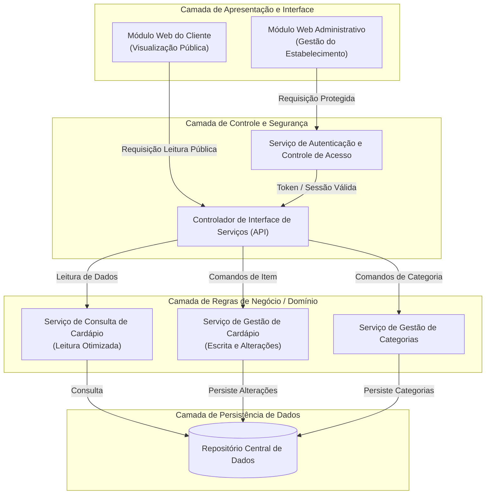
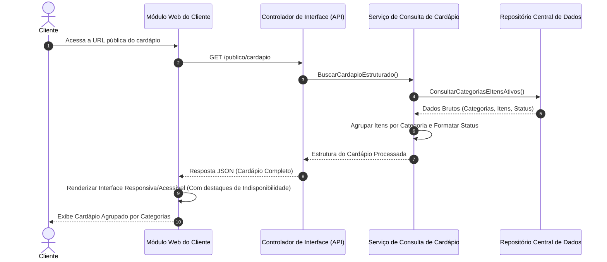
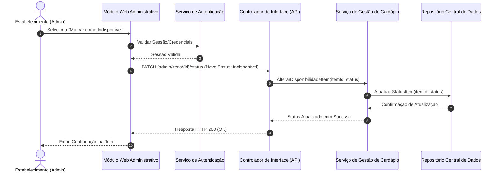
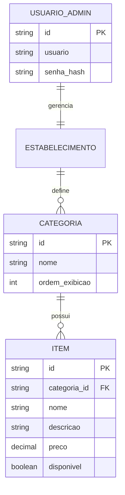

# Relatório Técnico de Arquitetura de Software

---

## 1. Identificação das HUs

A tabela a seguir consolida a rastreabilidade entre as Histórias de Usuário (HUs), Perfis de Acesso, Requisitos Funcionais (RFs) e Requisitos Não Funcionais (RNFs) associados.

| HU ID | Perfil / Ator | Descrição Sucinta | RFs Cobertos | RNFs Relacionados |
| :--- | :--- | :--- | :--- | :--- |
| **HU01** | Estabelecimento (Admin) | Cadastrar item no cardápio com nome, descrição e preço. | RF01, RF11 | RNF03, RNF05 |
| **HU02** | Estabelecimento (Admin) | Criar categorias e associar itens a elas, além de definir ordem. | RF04, RF05, RF09 | RNF03, RNF05 |
| **HU03** | Estabelecimento (Admin) | Editar dados de um item já cadastrado. | RF02, RF11 | RNF03, RNF05 |
| **HU04** | Estabelecimento (Admin) | Marcar e reativar disponibilidade de um item sem removê-lo. | RF06, RF07, RF10 | RNF03, RNF05 |
| **HU05** | Estabelecimento (Admin) | Remover item do cardápio mediante confirmação. | RF03 | RNF03, RNF05 |
| **HU06** | Cliente | Visualizar o cardápio sem necessidade de cadastro ou autenticação. | RF08 | RNF01, RNF02, RNF04, RNF06, RNF07 |
| **HU07** | Cliente | Navegar pelos itens do cardápio agrupados por categorias. | RF09, RF11 | RNF01, RNF02, RNF06, RNF07 |
| **HU08** | Cliente | Identificar visualmente os itens marcados como indisponíveis. | RF10 | RNF01, RNF06, RNF07 |

---

## 2. Diagramas de Arquitetura (Mermaid)

### 2.1. Diagrama de Componentes (Arquitetura Logica Modular)

O diagrama abaixo ilustra a separação lógica de responsabilidades, garantindo modularidade (RNF05) e a separação entre a visão pública e restrita (RNF03, RF08).

---

### 2.2. Diagrama de Sequência: Consulta Pública do Cardápio pelo Cliente (HU06, HU07, HU08)

Este diagrama detalha a consulta anônima e de alta performance, garantindo tempo de resposta reduzido (RNF02) sem exigir autenticação (RF08).

---

### 2.3. Diagrama de Sequência: Alteração de Disponibilidade de Item pelo Administrador (HU04)

Este diagrama representa o fluxo protegido de atualização do status de um item, refletindo de forma imediata na visão do cliente.

---

### 2.4. Diagrama de Entidade e Relacionamento Conceitual (Dados)

---

## 3. Decisões de Arquitetura

### Decisão 1: Desacoplamento do Acesso Público vs. Administrativo
* **Contexto:** Os clientes devem acessar o cardápio de forma anônima e ultra-rápida (RF08, RNF02), enquanto o estabelecimento necessita de controle administrativo autenticado e seguro (RNF03).
* **Decisão:** Separar a camada de controle em dois perfis de endpoints/interfaces funcionais: rotas públicas (otimizadas para leitura e sem barreiras de autenticação) e rotas administrativas (protegidas por verificação rigorosa de credenciais/sessão).
* **Consequência:** Aumenta a segurança da área restrita sem comprometer a latência da visualização do cliente público.

### Decisão 2: Arquitetura em Camadas Lógicas com Modulo de Leitura Otimizado
* **Contexto:** Atender aos requisitos de manutenibilidade (RNF05) e disponibilidade contínua (RNF04 - 99% 24/7).
* **Decisão:** Implementar a lógica de negócios dividida em componentes especializados: *Serviço de Consulta de Cardápio* (focado em leitura otimizada e agregação de dados) e *Serviço de Gestão de Cardápio* (focado nas operações de criação, alteração e deleção de itens e categorias).
* **Consequência:** Facilita a manutenção, testes isolados e permite evolução da camada de leitura independentemente da camada de escrita.

### Decisão 3: Abordagem "Client-Side Rendering" para Acessibilidade e Responsividade
* **Contexto:** A interface do cliente deve ser responsiva (RNF01), compatível com múltiplos navegadores (RNF06) e aderente à acessibilidade WCAG 2.1 nível A (RNF07).
* **Decisão:** A camada de frontend do cliente será estruturada para consumir payloads de dados padronizados (JSON) e realizar a renderização localmente, utilizando marcação semântica HTML e controles de opacidade/rótulos para itens indisponíveis.
* **Consequência:** Garante baixo tráfego de dados na rede, carregamento rápido (< 3s - RNF02) e fácil conformidade com leitores de tela e dispositivos móveis.

---

## 4. Tabela de Componentes e Rastreabilidade

| Componente | Responsabilidade Principal | Comunica-se com | Origem (HU / Critério de Aceite) |
| :--- | :--- | :--- | :--- |
| **Módulo Web do Cliente** | Apresentar o cardápio público, agrupado por categorias, responsivo, acessível e com indicação visual de indisponibilidade. | Controlador de Interface (API) | HU06, HU07, HU08, RNF01, RNF06, RNF07 |
| **Módulo Web Administrativo** | Prover interface para o estabelecimento cadastrar, editar, ordenar categorias, alterar status e remover itens. | Serviço de Autenticação, Controlador de Interface (API) | HU01, HU02, HU03, HU04, HU05 |
| **Serviço de Autenticação** | Autenticar usuários administradores, gerenciar sessões e proibir acesso não autorizado a rotas de gestão. | Módulo Web Administrativo, Controlador de Interface (API) | RNF03 (vinculado a HU01-HU05) |
| **Controlador de Interface (API)** | Atuar como porta de entrada, roteando requisições públicas ou privadas para os respectivos serviços de domínio. | Módulo Web Cliente/Admin, Serviços de Domínio | RF01-RF11 |
| **Serviço de Consulta de Cardápio** | Montar a estrutura consolidada do cardápio (Categorias + Itens + Status) para leitura rápida. | Repositório Central de Dados | HU06, HU07, HU08, RF08, RF09, RF10, RNF02 |
| **Serviço de Gestão de Cardápio** | Executar as regras de criação, edição, alteração de status (disponível/indisponível) e exclusão de itens. | Repositório Central de Dados | HU01, HU03, HU04, HU05, RF01, RF02, RF03, RF06, RF07 |
| **Serviço de Gestão de Categorias** | Gerenciar o ciclo de vida das categorias e controlar a ordem de exibição das mesmas. | Repositório Central de Dados | HU02, RF04, RF05 |
| **Repositório Central de Dados** | Garantir a persistência e integridade relacional entre Categorias, Itens e Dados do Estabelecimento. | Serviços de Domínio | RF01-RF07, RNF04, RNF05 |

---

## 5. Bloqueios e Pendências

1. **Mecanismo de Ordenação Manual de Categorias (HU02):**
   * *Pendência:* A HU02 exige que a ordem das categorias seja controlável pelo estabelecimento, porém o RF04 cita apenas "criar, edite e remova". É necessário definir o algoritmo/mecanismo de reordenação (ex: campo numérico ordinal de posição explicitado nas solicitações da API).
2. **Definição do Fluxo de Remoção e Exclusão Lógica vs. Física (HU05 / RF03):**
   * *Pendência:* Não está especificado se a exclusão de um item que já possui histórico deve ser física ou lógica (soft delete). Recomenda-se exclusão lógica para preservação de dados históricos do restaurante.
3. **Ausência de Requisito de Imagem/Foto nos Itens:**
   * *Pendência:* Nem os RFs nem as HUs mencionam o upload ou exibição de imagens do prato/item (apenas nome, descrição e preço). Requer confirmação com a área de produto se esta funcionalidade é escopo futuro ou ausência propositada.
4. **Limites de Tamanho de Campos e Validações de Domínio (HU01 / Critérios de Aceite):**
   * *Pendência:* Falta definição sobre os limites máximos de caracteres para nome, descrição e precisão decimal do preço, bem como regras para preços zerados ou negativos.

---

## 6. Cobertura de Requisitos

### 6.1. Requisitos Funcionais (RFs)

| ID RF | Coberto? | Componente / Elemento Arquitetural Responsável |
| :--- | :---: | :--- |
| **RF01** | Sim | `Serviço de Gestão de Cardápio` / `Repositório Central de Dados` |
| **RF02** | Sim | `Serviço de Gestão de Cardápio` / `Repositório Central de Dados` |
| **RF03** | Sim | `Serviço de Gestão de Cardápio` / `Repositório Central de Dados` |
| **RF04** | Sim | `Serviço de Gestão de Categorias` / `Repositório Central de Dados` |
| **RF05** | Sim | `Serviço de Gestão de Cardápio` e `Serviço de Gestão de Categorias` |
| **RF06** | Sim | `Serviço de Gestão de Cardápio` (Atualização de flag `disponivel = false`) |
| **RF07** | Sim | `Serviço de Gestão de Cardápio` (Atualização de flag `disponivel = true`) |
| **RF08** | Sim | `Módulo Web do Cliente` / Endpoint Público do `Controlador de Interface (API)` |
| **RF09** | Sim | `Serviço de Consulta de Cardápio` / `Módulo Web do Cliente` |
| **RF10** | Sim | `Módulo Web do Cliente` (Componente de UI para marcação visual) |
| **RF11** | Sim | `Serviço de Consulta de Cardápio` / `Módulo Web do Cliente` |

### 6.2. Requisitos Não Funcionais (RNFs)

| ID RNF | Coberto? | Estratégia / Decisão Arquitetural de Atendimento |
| :--- | :---: | :--- |
| **RNF01** | Sim | Interface responsiva no `Módulo Web do Cliente` utilizando layouts flexíveis/adaptativos sem barreiras de uso mobile. |
| **RNF02** | Sim | Desacoplamento do endpoint público no `Serviço de Consulta de Cardápio` enviando estrutura enxuta de dados para carga em < 3s. |
| **RNF03** | Sim | Intercepção obrigatória pelo `Serviço de Autenticação` antes do acesso a qualquer rota do `Módulo Web Administrativo`. |
| **RNF04** | Sim | Separação modular de serviços e repositório resiliente para garantir disponibilidade de 99% 24/7 na camada de leitura. |
| **RNF05** | Sim | Arquitetura desacoplada em módulos lógicos independentes (Apresentação, Serviços de Domínio e Persistência). |
| **RNF06** | Sim | Adoção de padrões web universais (HTML/CSS/JS sem dependência de engines proprietárias) no `Módulo Web do Cliente`. |
| **RNF07** | Sim | Implementação do `Módulo Web do Cliente` seguindo semanticamente as diretrizes WCAG 2.1 A (contraste, leitores de tela). |

---

## 7. Gap Analysis

A análise a seguir detalha as lacunas identificadas entre a especificação atual de requisitos e os impactos arquiteturais práticos para a implementação do sistema:

| Lacuna Identificada | Impacto Arquitetural | Ação Recomendada para o Time |
| :--- | :--- | :--- |
| **Falta de Especificação para Imagens do Cardápio** | Se for decidido adicionar imagens futuramente, a camada de persistência e os contratos de API atuais precisarão sofrer alterações breaking (incompatibilidade), além da necessidade de um serviço de armazenamento de arquivos estáticos. | Validar com o Product Owner (PO) na Fase 0 se imagens farão parte do escopo V1. Se sim, incluir o atributo `url_imagem` na entidade `ITEM`. |
| **Mecanismo de Ordenação de Categorias Não Mapeado em RF** | A HU02 cita controle da ordem pelo estabelecimento, mas não há detalhamento de API nem atributo explícito previsto nos requisitos funcionais. | Incluir o atributo `ordem_exibicao` (inteiro) na entidade de Categoria e expor o endpoint `PUT /admin/categorias/ordem` na API. |
| **Falta de Atualização em Tempo Real (Real-time)** | Se o cliente estiver com o cardápio aberto no celular e o estabelecimento alterar um item para "Indisponível", o cliente só verá se recarregar a página. | Caso seja crítico um feedback instantâneo para o cliente, deve-se incluir arquitetura de eventos/push (ex: WebSockets). Se não for crítico, manter estratégia de cache e atualização ao recarregar. |
| **Tratamento da Deleção de Categorias com Itens Associados** | O sistema permite remover categorias (RF04), mas não especifica o que ocorre com os itens contidos nelas (exclusão em cascata, orfanato de itens ou bloqueio de exclusão). | Adotar a regra de negócio de "Bloqueio de Exclusão": Uma categoria só pode ser removida se não houver itens vinculados a ela, ou obrigar a reatribuição dos itens antes da remoção. |
| **Multi-tenancy / Suporte a Múltiplos Restaurantes** | Os requisitos não deixam claro se o sistema atenderá um único restaurante (Single-tenant) ou uma plataforma para múltiplos estabelecimentos (SaaS Multi-tenant). | Mantenha o modelo de dados preparado para suporte a `estabelecimento_id` nas tabelas principais para evitar refatoração massiva no futuro. |