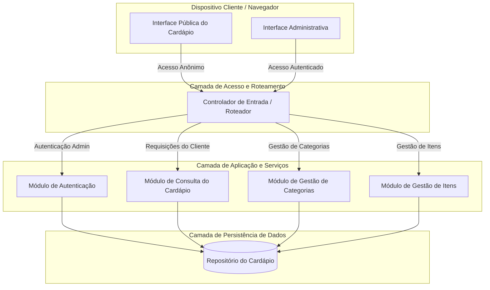
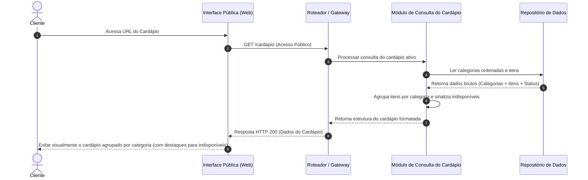
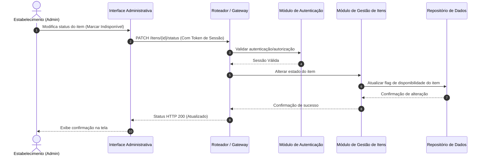

# Relatório Técnico de Arquitetura de Software

## 1. Identificação das HUs

A tabela abaixo consolida as Histórias de Usuário (HUs), perfis de acesso, critérios de aceite associados e o mapeamento direto com os Requisitos Funcionais (RF) e Requisitos Não Funcionais (RNF).

| ID | Perfil | História de Usuário (Resumo) | Critérios de Aceite principais | RFs Associados | RNFs Associados |
| :--- | :--- | :--- | :--- | :--- | :--- |
| **HU01** | Estabelecimento | Cadastrar item no cardápio | Validação de campos obrigatórios (nome, preço); Exibição imediata no cardápio. | RF01, RF05, RF11 | RNF03, RNF05 |
| **HU02** | Estabelecimento | Organizar itens por categoria | Criação de categorias; Associação 1:N (Item pertence a uma categoria); Controle de ordenação. | RF04, RF05, RF09 | RNF03, RNF05 |
| **HU03** | Estabelecimento | Editar item do cardápio | Atualização de nome, descrição, preço; Reflexo imediato na visão pública. | RF02, RF11 | RNF03, RNF05 |
| **HU04** | Estabelecimento | Marcar item como indisponível | Alteração do estado do item sem exclusão; Possibilidade de reativação imediata. | RF06, RF07, RF10 | RNF03, RNF05 |
| **HU05** | Estabelecimento | Remover item do cardápio | Confirmação prévia para exclusão; Remoção permanente da lista pública. | RF03 | RNF03, RNF05 |
| **HU06** | Cliente | Visualizar cardápio sem cadastro | Acesso direto via URL sem autenticação; Layout funcional em dispositivos móveis. | RF08 | RNF01, RNF02, RNF04, RNF06, RNF07 |
| **HU07** | Cliente | Navegar no cardápio por categorias | Identificação visual de categorias; Agrupamento claro de itens por categoria. | RF09, RF11 | RNF01, RNF06, RNF07 |
| **HU08** | Cliente | Identificar itens indisponíveis | Indicação visual clara (opacidade/label); Manutenção do item na lista sem remoção. | RF10 | RNF01, RNF06, RNF07 |

---

## 2. Diagramas de Arquitetura (Mermaid)

### 2.1 Diagrama de Visão Geral de Componentes

Visão lógica de alto nível, separando as camadas do sistema e assegurando desacoplamento funcional e modularidade (RNF05).

### 2.2 Diagrama de Sequência — Consulta Pública de Cardápio (HU06, HU07, HU08)

Demonstra a jornada de um cliente acessando o cardápio sem autenticação, cumprindo os limites de tempo de resposta e organização por categorias.

### 2.3 Diagrama de Sequência — Gestão e Indisponibilidade de Itens pelo Admin (HU01, HU04)

Demonstra o fluxo administrativo protegido por autenticação para alteração de visibilidade e cadastro.

---

## 3. Decisões de Arquitetura

*   **ADR-01: Separação Clara entre Fluxos de Leitura (Público) e Escrita (Administrativo)**
    *   *Contexto:* O público geral precisa ler o cardápio sem qualquer barreira de login (RF08), enquanto operações de edição exigem rígido controle de acesso (RNF03).
    *   *Decisão:* Criar um módulo desacoplado e otimizado especificamente para consultas públicas de cardápio (`Menu_Query_Service`), isolado das rotas mutáveis tratadas pelos módulos administrativos.
    *   *Consequência:* Garante alta disponibilidade (RNF04) e tempo de resposta reduzido (RNF02), evitando sobrecarga nas rotas administrativas.

*   **ADR-02: Modelo de Dados Híbrido com Agrupamento por Categoria**
    *   *Contexto:* Os itens do cardápio obrigatoriamente pertencem a uma única categoria (HU02) e devem ser retornados estruturados hierarquicamente na interface (RF09).
    *   *Decisão:* A representação das entidades na persistência associará 1 Categoria a N Itens, assegurando a integridade referencial sem permitir que um item fique órfão ou associado a múltiplas categorias simultaneamente.

*   **ADR-03: Soft-Disable para Indisponibilidade de Itens**
    *   *Contexto:* Itens indisponíveis não devem ser removidos do banco nem da lista do cliente, mas apenas sinalizados visualmente (RF06, RF10, HU04, HU08).
    *   *Decisão:* Utilizar uma flag booleana de estado (`disponivel: true/false`) no modelo do item em vez de remover registros ou alterar a associação de categoria.
    *   *Consequência:* Permite reativação imediata (RF07) e preserva o histórico de cadastro do item sem quebrar a consistência da interface pública.

*   **ADR-04: Independência de Frameworks e Tecnologias Proprietárias**
    *   *Contexto:* Atendimento à diretriz de neutralidade tecnológica.
    *   *Decisão:* A solução é projetada com base em contratos de interfaces e serviços desacoplados (Padrão Camadas/Serviços), permitindo implementação em qualquer ecossistema de infraestrutura ou linguagem de programação que suporte protocolo HTTP e renderização Web Responsiva (RNF01, RNF06).

---

## 4. Tabela de Componentes e Rastreabilidade

| Componente | Responsabilidade Principal | Comunica-se com | Origem (HU / Critério de Aceite) |
| :--- | :--- | :--- | :--- |
| **Interface Pública (Web UI)** | Apresentar o cardápio responsivo aos clientes, renderizar agrupamento de categorias e estados visuais (indisponibilidade). | Gateway | HU06 (CA1, CA2), HU07 (CA1, CA2), HU08 (CA1, CA2), RNF01, RNF06, RNF07 |
| **Interface Administrativa (Web UI)** | Prover telas para gestão do cardápio (cadastro, edição, remoção, ordenação e status de itens/categorias). | Gateway | HU01 (CA1), HU02 (CA1, CA3), HU03 (CA2), HU04 (CA2), HU05 (CA1) |
| **Controlador / Gateway de API** | Centralizar requisições HTTP, direcionar rotas públicas e aplicar filtros de segurança para rotas administrativas. | Interface Pública, Interface Admin, Auth Service, Módulos do Sistema | RNF03, RNF05 |
| **Módulo de Autenticação** | Validar credenciais do estabelecimento (usuário/senha) e gerenciar tokens/sessões de acesso. | Gateway, Repositório de Dados | RNF03 |
| **Módulo de Consulta do Cardápio** | Processar e agrupar a estrutura pública do cardápio por categorias para leitura sem autenticação. | Gateway, Repositório de Dados | HU06 (CA1), HU07 (CA2), HU08 (CA2), RF08, RF09, RNF02 |
| **Módulo de Gestão de Categorias** | Gerenciar o ciclo de vida e a ordem de exibição das categorias de produto. | Gateway, Repositório de Dados | HU02 (CA1, CA2, CA3), RF04, RF05 |
| **Módulo de Gestão de Itens** | Gerenciar CRUD de itens do cardápio, alterações de estado (disponível/indisponível) e validação de campos obrigatórios. | Gateway, Repositório de Dados | HU01 (CA1, CA2), HU03 (CA1), HU04 (CA1, CA2), HU05 (CA1, CA2), RF01, RF02, RF03, RF06, RF07 |
| **Repositório de Dados** | Armazenar e prover persistência transacional para entidades do sistema (Usuários, Categorias, Itens). | Módulos de Serviço e Autenticação | RNF04, RNF05 |

---

## 5. Bloqueios e Pendências

1.  **Regra de Exclusão de Categorias com Itens Associados:**
    *   *Descrição:* O requisito RF04 e HU02 permitem remover categorias, mas não especificam o comportamento esperado para os itens associados a uma categoria excluída (ex: exclusão em cascata, bloqueio de remoção ou reatribuição a uma categoria "Sem Categoria").
    *   *Impacto:* Risco de inconsistência de dados ou itens inacessíveis na visão do cliente.

2.  **Mídia de Imagem/Foto dos Itens:**
    *   *Descrição:* Os requisitos solicitam cadastro de nome, descrição e preço (RF01, RF11), omitindo explicitamente suporte a upload/armazenamento de fotos do prato.
    *   *Impacto:* Necessidade de confirmação com o cliente do produto se fotos farão parte do escopo técnico para provisionar storage de arquivos.

3.  **Suporte a Multi-estabelecimento (Multi-tenancy):**
    *   *Descrição:* A especificação menciona "o estabelecimento", sem detalhar se o software atenderá uma única loja isolada ou se é uma plataforma SaaS para múltiplos restaurantes na mesma instância.
    *   *Impacto:* Afeta diretamente o desenho do banco de dados e chaveamento de isolamento de tenants.

4.  **Mecanismo de Ordenação Personalizada:**
    *   *Descrição:* HU02 cita que a ordem das categorias deve ser controlável, mas não especifica a forma de ordenação individual dos itens dentro de uma mesma categoria.

---

## 6. Cobertura de Requisitos

### 6.1 Requisitos Funcionais (RF)

| Requisito | Atendido? | Componente / Arquitetura | Observações |
| :--- | :---: | :--- | :--- |
| **RF01** | Sim | Módulo de Gestão de Itens | Garante validação e inclusão de nome, descrição e preço. |
| **RF02** | Sim | Módulo de Gestão de Itens | Provê endpoints/serviços para alteração de atributos. |
| **RF03** | Sim | Módulo de Gestão de Itens | Permite exclusão lógica/física com confirmação. |
| **RF04** | Sim | Módulo de Gestão de Categorias | Provê ciclo de vida completo de categorias e ordenação. |
| **RF05** | Sim | Módulo de Gestão de Categorias / Itens | Mantém vínculo relacional 1:N entre Categoria e Item. |
| **RF06** | Sim | Módulo de Gestão de Itens | Implementa flag de indisponibilidade mantendo o item existente. |
| **RF07** | Sim | Módulo de Gestão de Itens | Permite a reversão da flag de indisponibilidade. |
| **RF08** | Sim | Módulo de Consulta / Interface Pública | Rotas abertas e públicas sem interceptação de credenciais. |
| **RF09** | Sim | Módulo de Consulta / Interface Pública | Estruturação de payload de saída agrupado por categorias. |
| **RF10** | Sim | Interface Pública | Camada visual renderiza indicação visual (ex: opacidade/badge). |
| **RF11** | Sim | Interface Pública | Exibição obrigatória de nome, descrição e preço de cada item. |

### 6.2 Requisitos Não Funcionais (RNF)

| Requisito | Atendido? | Estratégia Arquitetural |
| :--- | :---: | :--- |
| **RNF01** | Sim | Layout da Interface Pública projetado sob princípios de design responsivo (Fluid Grid/Mobile-first). |
| **RNF02** | Sim | Desacoplamento do serviço de leitura de cardápio (`Menu_Query_Service`), permitindo cache agressivo e payload otimizado. |
| **RNF03** | Sim | Rotas administrativas protegidas por filtro/middleware de Autenticação (`Auth_Service`). |
| **RNF04** | Sim | Separação modular que permite alta disponibilidade da camada pública independente da área administrativa. |
| **RNF05** | Sim | Arquitetura em módulos independentes com responsabilidades bem definidas. |
| **RNF06** | Sim | Utilização de padrões Web universais na camada de apresentação. |
| **RNF07** | Sim | Conformidade na camada visual com diretrizes WCAG 2.1 A (contrastes, marcação semântica HTML e suporte a leitores de tela). |

---

## 7. Gap Analysis

A análise abaixo detalha as lacunas de especificação identificadas no pacote de requisitos de entrada, seu impacto técnico no sistema e as recomendações arquiteturais:

| ID Gap | Lacuna de Especificação | Impacto na Arquitetura | Ação Recomendada |
| :--- | :--- | :--- | :--- |
| **GAP-01** | **Regras de Exclusão de Categorias em Uso** Não se define o comportamento do sistema ao remover uma categoria que possui itens vinculados. | Risco de violação de integridade de dados ou geração de itens inacessíveis na consulta pública. | **Regra Proposta:** Impedir a exclusão de categoria enquanto houver itens associados a ela, ou exigir a migração prévia dos itens para outra categoria ativa. |
| **GAP-02** | **Ausência de Suporte a Recursos Multimídia (Imagens)** O escopo não contempla upload e gerenciamento de imagens dos pratos. | Limitação de atratividade visual do cardápio público e ausência de componente de armazenamento não estruturado no design. | Validar com os interessados se fotos serão exigidas. Caso sim, prever componente desacoplado de Gestão de Mídia/Storage. |
| **GAP-03** | **Falta de Especificação de Tenant (Single vs Multi-tenant)** O documento trata o sistema como voltado a "o estabelecimento" (singular). | Risco de refatoração massiva no modelo de dados caso a aplicação seja disponibilizada como plataforma SaaS para múltiplos restaurantes. | Projetar o modelo de dados já prevendo a entidade `Estabelecimento` como identificador raiz (chave de isolamento) em todas as tabelas/coleções. |
| **GAP-04** | **Ordenação Fina de Itens dentro da Categoria** A HU02 especifica controle de ordem apenas para as categorias, omitindo a ordenação dos itens. | A ordenação de itens dentro de uma categoria dependerá da ordem de inserção ou alfabética, o que pode não atender ao negócio. | Adicionar o atributo `ordem_exibicao` também na entidade `Item` para viabilizar controle de sequência pelo estabelecimento. |
| **GAP-05** | **Falta de Trilha de Auditoria (Logs Admin)** Sem previsão de registros de alteração de preço ou disponibilidade. | Dificuldade no rastreamento de erros operacionais em ambientes com múltiplos atendentes/gerentes. | Incluir registro histórico leve de alterações críticas de preço e exclusões no Módulo de Gestão. |