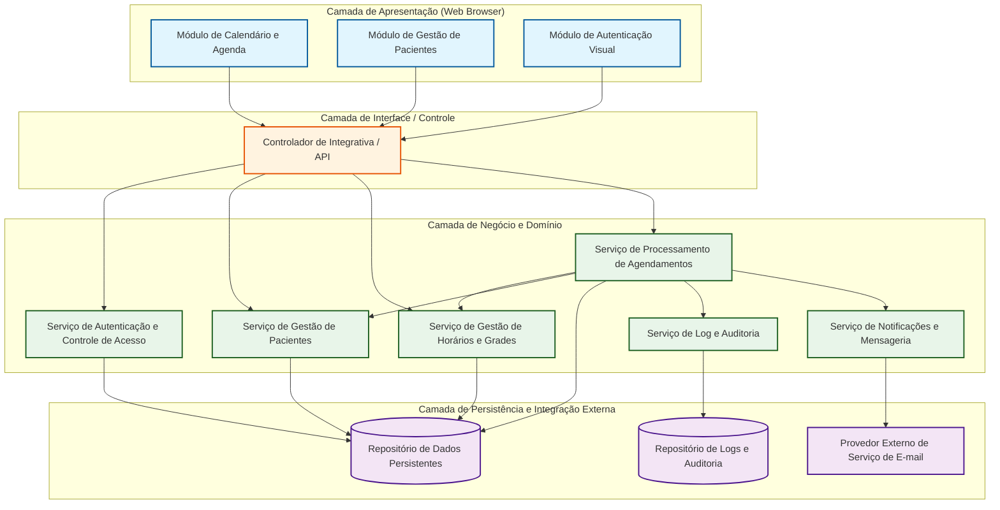
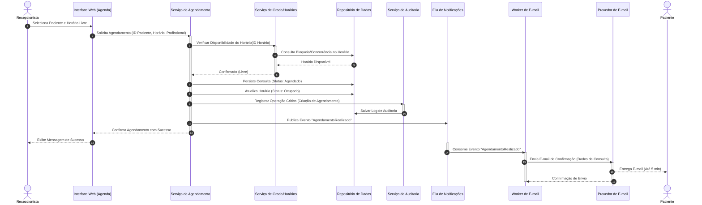

# Relatório Técnico de Arquitetura de Software

---

## 1. Identificação das HUs

A tabela abaixo mapeia as Histórias de Usuário (HUs) fornecidas aos respectivos Requisitos Funcionais (RFs) e Não Funcionais (RNFs), detalhando os atores e critérios de aceite associados.

| ID | Perfil / Ator | Descrição Resumida | RFs Relacionados | RNFs Relacionados | Critérios de Aceite Principais |
|---|---|---|---|---|---|
| **HU01** | Recepcionista | Cadastrar novo paciente com dados pessoais e contato. | RF01 | RNF01, RNF02 | Campos obrigatórios (nome, telefone, e-mail); validação de formato de e-mail; prevenção de duplicidade por CPF ou e-mail. |
| **HU02** | Recepcionista | Pesquisar paciente por nome ou telefone. | RF03 | RNF01, RNF04 | Busca por correspondência parcial; retorno em lista contendo nome e telefone. |
| **HU03** | Recepcionista | Visualizar agenda do profissional em formato de calendário. | RF04, RF11 | RNF01, RNF03, RNF04, RNF07 | Visões diária e semanal; diferenciação visual clara entre horários livres e ocupados; navegação temporal. |
| **HU04** | Recepcionista | Agendar consulta vinculando paciente a horário livre. | RF05, RF06, RF09 | RNF01, RNF05, RNF08 | Seleção exclusiva de horários livres; confirmação em tela; disparo de e-mail automático. |
| **HU05** | Recepcionista | Cancelar consulta agendada. | RF07, RF10 | RNF01, RNF05, RNF08 | Confirmação prévia exigida; liberação imediata do horário na agenda; notificação por e-mail ao paciente. |
| **HU06** | Recepcionista | Remarcar consulta para novo horário disponível. | RF08, RF10 | RNF01, RNF05, RNF08 | Seleção em horários vagos da grade; liberação automática do horário antigo; notificação por e-mail com novos dados. |
| **HU07** | Recepcionista | Consultar histórico de consultas de um paciente. | RF12 | RNF01, RNF02 | Listagem de consultas realizadas e canceladas com data, hora e status; acesso via cadastro do paciente. |
| **HU08** | Paciente | Receber e-mail de confirmação de agendamento. | RF09 | RNF05 | E-mail contendo profissional, data, horário e endereço da clínica; envio em até 5 minutos. |
| **HU09** | Paciente | Receber notificação por e-mail em caso de cancelamento ou remarcação. | RF10 | RNF05 | Notificação clara de cancelamento ou com os novos dados de remarcação. |

---

## 2. Diagramas de Arquitetura (Mermaid)

### 2.1. Diagrama de Componentes da Arquitetura (Visão Conceitual Abstrata)

Este diagrama ilustra os componentes lógicos da solução, garantindo a separação de responsabilidades e neutralidade tecnológica.

---

### 2.2. Diagrama de Sequência: Agendamento de Consulta e Notificação Assíncrona

O fluxo abaixo descreve o processo completo de agendamento de consulta, incluindo validação de horários, garantia de não sobreposição, auditoria e disparo da notificação.

---

## 3. Decisões de Arquitetura

### ADR-01: Separação em Camadas Lógicas Desacopladas
* **Contexto:** Necessidade de garantir compatibilidade com múltiplos navegadores (RNF07), manutenibilidade e isolamento das regras de negócio.
* **Decisão:** A solução é estruturada em três camadas abstratas: Apresentação (Interface Web), Serviços de Negócio (Lógica de Domínio) e Persistência de Dados.
* **Impacto:** Permite a evolução independente da interface e do núcleo do sistema, além de facilitar a criação de testes automatizados isolados.

### ADR-02: Garantia de Consistência e Prevenção de Sobreposição de Agendamentos
* **Contexto:** RF06 exige rigorosamente que duas consultas não sejam agendadas no mesmo horário para o mesmo profissional.
* **Decisão:** Adotar controle de concorrência com bloqueio transacional (ou trava otimista/pessimista no nível de persistência) durante a confirmação da reserva do horário.
* **Impacto:** Evita *race conditions* quando múltiplos usuários ou abas tentarem alocar o mesmo slot simultaneamente.

### ADR-03: Arquitetura Assíncrona para Disparo de Notificações
* **Contexto:** RF09, RF10 e RNF05 exigem envio de e-mails em até 5 minutos sem impactar a resposta da interface para a recepcionista (RNF04).
* **Decisão:** O envio de e-mails será processado de forma assíncrona, desvinculado da transação principal HTTP. O serviço de agendamento emite um evento de domínio, que é processado por um componente em segundo plano.
* **Impacto:** Garante que falhas temporárias na rede ou no provedor de e-mail não façam a interface travar ou falhar para a recepcionista, mantendo o tempo de resposta abaixo de 2 segundos.

### ADR-04: Centralização do Registro de Auditoria e Logs
* **Contexto:** RNF08 exige o registro de logs de operações críticas (criação, cancelamento e remarcação de consultas).
* **Decisão:** Criação de um Módulo de Auditoria dedicado, acionado de forma padronizada sempre que ocorrerem mutações no ciclo de vida da consulta.
* **Impacto:** Facilita a rastreabilidade de ações, atende requisitos de segurança/governança e auxilia na resolução de disputas operacionais.

### ADR-05: Conformidade com Proteção de Dados (LGPD)
* **Contexto:** RNF02 exige conformidade com a LGPD no armazenamento de dados dos pacientes.
* **Decisão:** Aplicar controle estrito de acessos baseado em perfis (RBAC), criptografia de dados sensíveis em repouso e em trânsito, e isolamento de consultas de histórico.
* **Impacto:** Assegura a privacidade dos dados de saúde e reduz a exposição a vazamentos de informações.

---

## 4. Tabela de Componentes e Rastreabilidade

| Componente | Responsabilidade Principal | Comunica-se com | Origem (HU / Critério de Aceite) |
|---|---|---|---|
| **Módulo de Autenticação e Autorização** | Validar credenciais de recepcionistas e administradores, gerenciando sessões e permissões. | Repositório de Dados Persistentes | RNF01 |
| **Módulo de Gestão de Pacientes** | Cadastrar, editar e pesquisar pacientes; validar campos obrigatórios e formatos (e-mail/CPF). | Repositório de Dados Persistentes | HU01, HU02, RF01, RF02, RF03 |
| **Módulo de Gestão de Horários e Agenda** | Manter a grade de atendimento do profissional e prover a visualização diária/semanal de horários. | Repositório de Dados Persistentes | HU03, RF04, RF11, RNF03, RNF04 |
| **Módulo de Processamento de Agendamentos** | Realizar agendamentos, cancelamentos e remarcações, impedindo sobreposição de horários (double-booking). | Módulo de Horários, Módulo de Pacientes, Repositório de Dados, Servicio de Auditoria, Serviço de Notificações | HU04, HU05, HU06, RF05, RF06, RF07, RF08 |
| **Módulo de Histórico do Paciente** | Compilar e exibir a lista de consultas realizadas e canceladas associadas ao paciente. | Repositório de Dados Persistentes | HU07, RF12 |
| **Módulo de Notificações e Mensageria** | Processar e enviar e-mails de confirmação, remarcação e cancelamento de forma assíncrona. | Provedor Externo de E-mail | HU08, HU09, RF09, RF10, RNF05 |
| **Módulo de Log e Auditoria** | Registrar todas as ações críticas (criação, alteração, cancelamento) para governança e segurança. | Repositório de Logs e Auditoria | RNF08 |
| **Serviço de Armazenamento de Dados** | Garantir a persistência segura, integridade e conformidade LGPD das informações. | Todos os módulos de backend | RNF02 |

---

## 5. Bloqueios e Pendências

1. **Ambiguidade no campo CPF (HU01 vs RF01):**
   * *Descrição:* A HU01 exige validação de duplicidade por CPF ("O sistema não deve permitir cadastro duplicado para um mesmo CPF ou e-mail"), porém o RF01 não inclui o CPF na lista de campos cadastrais do paciente (menciona apenas nome, data de nascimento, telefone e e-mail).
   * *Impacto:* Risco de omissão do campo na modelagem da entidade Paciente e na interface de cadastro.
   * *Status:* **Bloqueante para Modelagem de Dados.**

2. **Ausência de Dados Institucionais da Clínica na Base (HU08):**
   * *Descrição:* A HU08 exige que o e-mail de confirmação enviado ao paciente contenha o "endereço da clínica". Contudo, não há nenhum Requisito Funcional detalhando o cadastro ou parametrização do endereço/dados da clínica.
   * *Impacto:* Risco de ter informação estática (*hardcoded*) no modelo de e-mail.
   * *Status:* **Pendência de Especificação.**

3. **Política de Antecedência para Cancelamento/Remarcação:**
   * *Descrição:* Os requisitos (RF07, RF08, HU05, HU06) não definem limites de tempo para cancelamento ou remarcação (ex.: "permitido até 24h antes").
   * *Impacto:* Possibilidade de cancelamentos/remarcações retroativos ou a instantes do horário da consulta.
   * *Status:* **Pendência de Regra de Negócio.**

4. **Definição dos Estados da Consulta (Ciclo de Vida):**
   * *Descrição:* O RF12 menciona consultas "realizadas e canceladas", mas os requisitos funcionais cobrem apenas a transição para "agendado" e "cancelado". Não há fluxo descrito para marcar a consulta como "realizada/atendida".
   * *Impacto:* O histórico pode não refletir corretamente quais consultas foram efetivamente concluídas.
   * *Status:* **Pendência de Regra de Negócio.**

---

## 6. Cobertura de Requisitos

| Requisito | Tipo | História de Usuário (HU) | Componente Arquitetural Responsável | Status |
|---|---|---|---|---|
| **RF01** | Funcional | HU01 | Módulo de Gestão de Pacientes | Coberto |
| **RF02** | Funcional | HU01 | Módulo de Gestão de Pacientes | Coberto |
| **RF03** | Funcional | HU02 | Módulo de Gestão de Pacientes | Coberto |
| **RF04** | Funcional | HU03 | Módulo de Gestão de Horários e Agenda | Coberto |
| **RF05** | Funcional | HU04 | Módulo de Processamento de Agendamentos | Coberto |
| **RF06** | Funcional | HU04 | Módulo de Processamento de Agendamentos | Coberto |
| **RF07** | Funcional | HU05 | Módulo de Processamento de Agendamentos | Coberto |
| **RF08** | Funcional | HU06 | Módulo de Processamento de Agendamentos | Coberto |
| **RF09** | Funcional | HU04, HU08 | Módulo de Notificações e Mensageria | Coberto |
| **RF10** | Funcional | HU05, HU06, HU09 | Módulo de Notificações e Mensageria | Coberto |
| **RF11** | Funcional | HU03 | Módulo de Gestão de Horários e Agenda | Coberto |
| **RF12** | Funcional | HU07 | Módulo de Histórico do Paciente | Coberto |
| **RNF01** | Segurança | Todas (visão geral) | Módulo de Autenticação e Autorização | Coberto |
| **RNF02** | Segurança | HU01, HU07 | Serviço de Armazenamento de Dados | Coberto |
| **RNF03** | Usabilidade | HU03 | Camada de Apresentação (Interface Web) | Coberto |
| **RNF04** | Desempenho | HU02, HU03 | Módulo de Gestão de Horários / Camada API | Coberto |
| **RNF05** | Confiabilidade | HU08, HU09 | Módulo de Notificações e Mensageria | Coberto |
| **RNF06** | Disponibilidade| N/A (Infraestrutura) | Arquitetura de Implantação / Operações | Coberto |
| **RNF07** | Compatibilidade| N/A (Frontend) | Camada de Apresentação (Interface Web) | Coberto |
| **RNF08** | Manutenibilidade| HU04, HU05, HU06 | Módulo de Log e Auditoria | Coberto |

---

## 7. Gap Analysis

| ID | Lacuna / Omisão Identificada | Impacto Arquitetural / Operacional | Ação Recomendada |
|---|---|---|---|
| **GAP-01** | Inconsistência na definição de campos do paciente (CPF presente no critério de aceite da HU01, mas ausente no RF01). | O esquema de dados de paciente pode ser modelado sem o campo CPF, quebrando a regra de unicidade especificada na HU01. | Incluir formalmente o campo `CPF` no requisito RF01 e adotá-lo como chave de unicidade junto ao `e-mail`. |
| **GAP-02** | Ausência de cadastro de informações institucionais da clínica (Endereço/Telefone). | E-mails de notificação (HU08) não terão fonte dinâmica para obter o endereço da clínica. | Criar um componente/tabela de Configurações da Clínica para armazenar endereço, nome fantasia e telefone de contato. |
| **GAP-03** | Falta de especificação da transição do status "Realizada" da consulta. | Impossibilidade de transicionar automaticamente ou manualmente uma consulta de "Agendada" para "Realizada" no histórico (RF12). | Incluir um RF/HU para o registro de conclusão de atendimento pelo profissional ou pela recepcionista. |
| **GAP-04** | Ausência de mecanismos explícitos para direitos do titular da LGPD (Exclusão/Anonimização). | Vulnerabilidade de conformidade com a LGPD (RNF02) caso um paciente solicite a exclusão de seus dados pessoais. | Especificar procedimentos/serviços de anonimização ou exclusão lógica de dados pessoais respeitando guarda legal de prontuários. |
| **GAP-05** | Falta de tratamento para falhas na entrega de e-mails de notificação. | Descumprimento do RNF05 (envio em até 5 min) caso o provedor externo de e-mail apresente instabilidade. | Implementar padrão de fila com *retry* automático e alertas de monitoramento para falhas de entrega. |