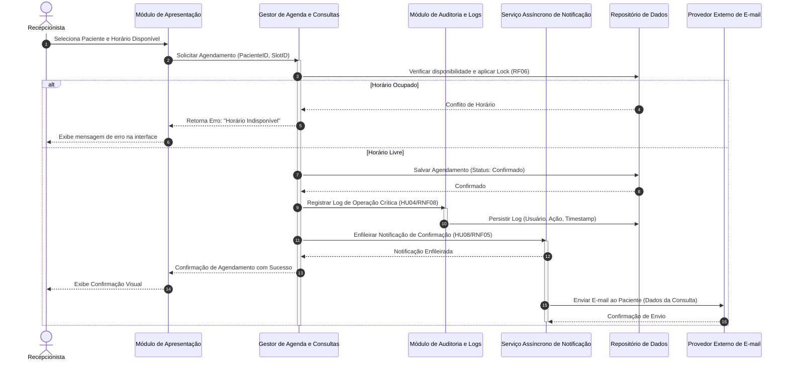
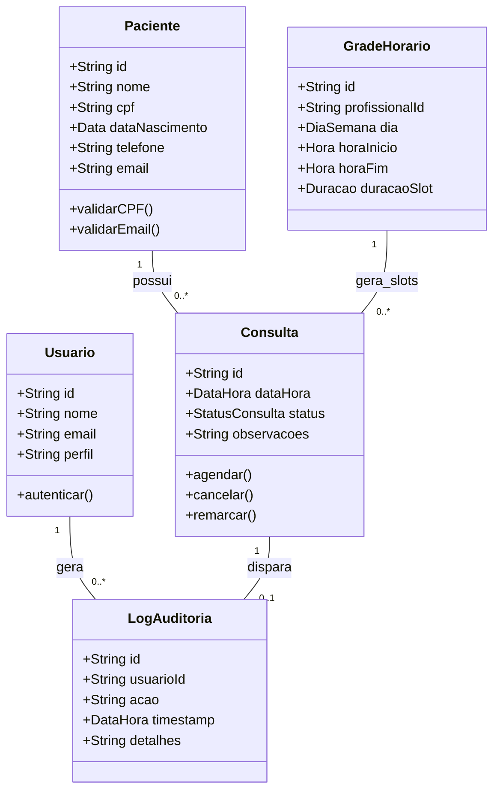

# Relatório Técnico de Arquitetura de Software

---

## 1. Identificação das HUs

Esta seção correlaciona as Histórias de Usuário (HUs) com os perfis de acesso, Requisitos Funcionais (RFs) e Requisitos Não Funcionais (RNFs) rastreáveis.

| ID HU | Perfil | Descrição Resumida | RFs Relacionados | RNFs Relacionados |
| :--- | :--- | :--- | :--- | :--- |
| **HU01** | Recepcionista | Cadastrar novo paciente com validações e restrições de duplicidade. | RF01 | RNF01, RNF02 |
| **HU02** | Recepcionista | Pesquisar pacientes por nome/telefone com retorno parcial. | RF03 | RNF01, RNF02 |
| **HU03** | Recepcionista | Visualizar agenda do profissional em visões diária e semanal. | RF04 | RNF01, RNF03, RNF04, RNF07 |
| **HU04** | Recepcionista | Registrar agendamento de consulta vinculando paciente e horário. | RF05, RF06, RF09 | RNF01, RNF05, RNF08 |
| **HU05** | Recepcionista | Cancelar agendamento com confirmação e liberação imediata do horário. | RF07, RF10 | RNF01, RNF05, RNF08 |
| **HU06** | Recepcionista | Remarcar consulta liberando horário antigo e ocupando novo. | RF08, RF10 | RNF01, RNF05, RNF08 |
| **HU07** | Recepcionista | Consultar histórico de consultas realizadas e canceladas por paciente. | RF12 | RNF01, RNF02 |
| **HU08** | Paciente | Receber confirmação de agendamento por e-mail automaticamente. | RF09 | RNF05 |
| **HU09** | Paciente | Receber notificação por e-mail em cancelamentos e remarcações. | RF10 | RNF05 |

*Nota:* O requisito **RF11** (Configuração da grade de horários do profissional) e o perfil **Administrador** (citado no RNF01) não possuem uma HU explicitamente mapeada nos requisitos de entrada, sendo tratados nas seções de *Bloqueios* e *Gap Analysis*.

---

## 2. Diagramas de Arquitetura (Mermaid)

### 2.1 Diagrama de Visão Geral de Componentes
O diagrama a seguir descreve a estrutura conceitual do sistema, mantendo estrita neutralidade tecnológica.

```mermaid
componentDiagram
    [Cliente Web / Browser] --> [Módulo de Apresentação (UI)]
    
    package "Camada de Aplicação e Serviços" {
        [Módulo de Apresentação (UI)] --> [Controlador de Autenticação]
        [Módulo de Apresentação (UI)] --> [Gestor de Pacientes]
        [Módulo de Apresentação (UI)] --> [Gestor de Agenda e Consultas]
        
        [Gestor de Agenda e Consultas] --> [Módulo de Auditoria e Logs]
        [Gestor de Agenda e Consultas] --> [Serviço Assíncrono de Notificação]
        [Gestor de Pacientes] --> [Módulo de Auditoria e Logs]
    }

    package "Camada de Persistência e Integração" {
        [Gestor de Pacientes] --> [Repositório de Pacientes]
        [Gestor de Agenda e Consultas] --> [Repositório de Agenda/Consultas]
        [Módulo de Auditoria e Logs] --> [Repositório de Logs]
        [Serviço Assíncrono de Notificação] --> [Provedor Externo de E-mail]
    }
```

---

### 2.2 Diagrama de Sequência — Agendamento de Consulta e Notificação
Apresenta o fluxo transacional completo para a execução do agendamento (HU04 / RF05, RF06, RF09, RNF05, RNF08), garantindo o controle de concorrência e o envio assíncrono de e-mail.



---

### 2.3 Diagrama de Modelo de Domínio Conceitual
Representação das entidades de negócio e suas relações lógicas.



---

## 3. Decisões de Arquitetura

### ADR-01: Separação em Camadas com Neutralidade Tecnológica
* **Contexto**: O sistema precisa de manutenibilidade (RNF08), segurança (RNF01) e suporte a múltiplos navegadores (RNF07).
* **Decisão**: A arquitetura adota uma abordagem em camadas lógicas desvinculadas de produtos específicos:
  1. *Camada de Apresentação (UI)*: Responsável pela navegação e renderização de visões (calendário diário/semanal - RNF03).
  2. *Camada de Negócio e Aplicação*: Contém os gerenciadores e regras de validação (impedimento de duplicidade de horários - RF06).
  3. *Camada de Persistência e Integração*: Abstrai o acesso a dados e serviços externos via repositórios e adaptadores.
* **Consequência**: Facilita testes automatizados e evolução sem acoplamento a fornecedores específicos.

### ADR-02: Processamento Assíncrono de Notificações
* **Contexto**: O envio de e-mails deve ocorrer em até 5 minutos (RNF05), mas não pode bloquear a interface do usuário nem ultrapassar o limite de tempo de resposta da agenda (< 2s - RNF04).
* **Decisão**: O disparo de e-mails de confirmação e cancelamento/remarcação (RF09, RF10) será processado de forma assíncrona por meio de um componente gestor de filas/tarefas em segundo plano (`Serviço Assíncrono de Notificação`).
* **Consequência**: O tempo de resposta para a Recepcionista permanece abaixo do limite estipulado, garantindo alta usabilidade e resiliência a falhas temporárias na rede externa.

### ADR-03: Controle de Concorrência Transacional em Agendamentos
* **Contexto**: O sistema deve impedir rigorosamente que duas consultas sejam marcadas no mesmo horário (RF06).
* **Decisão**: Aplicação de mecanismo de controle transacional (*locking* pessimista ou otimista no repositório de dados) na tentativa de reserva do slot da `GradeHorario`.
* **Consequência**: Elimina *race conditions* quando múltiplos operadores/recepcionistas tentam reservar a mesma janela de tempo simultaneamente.

### ADR-04: Módulo Centralizado de Auditoria e Logs
* **Contexto**: O sistema deve registrar operações críticas como criação, cancelamento e remarcação de consultas (RNF08), atendendo também a exigências da LGPD (RNF02).
* **Decisão**: Criação de um `Módulo de Auditoria e Logs` acionado via eventos de aplicação sempre que transações de mutação forem executadas.
* **Consequência**: Garantia de rastreabilidade completa das ações do usuário, isolando a regra de gravação de logs do fluxo principal do sistema.

---

## 4. Tabela de Componentes e Rastreabilidade

| Componente | Responsabilidade Principal | Comunica-se com | Origem (HU / Critério de Aceite) |
| :--- | :--- | :--- | :--- |
| **Módulo de Apresentação (UI)** | Renderizar visões do calendário (diário/semanal), formulários de cadastro e buscas interativas. | Controlador de Autenticação, Gestor de Pacientes, Gestor de Agenda | HU01, HU02, HU03, HU04, HU05, HU06, HU07 / RNF03, RNF07 |
| **Controlador de Autenticação** | Autenticar usuários e autorizar acesso com base no perfil (Recepcionista / Administrador). | Repositório de Dados, Módulo de Apresentação | RNF01 |
| **Gestor de Pacientes** | Efetuar cadastro, edição, validações de e-mail/CPF, busca parcial e vinculação de histórico. | Repositório de Pacientes, Módulo de Auditoria e Logs | HU01, HU02, HU07 / RF01, RF02, RF03, RF12, RNF02 |
| **Gestor de Agenda e Consultas** | Gerenciar o ciclo de vida das consultas (agendar, remarcar, cancelar), aplicar bloqueios de concorrência e consultar a grade de horários. | Repositório de Agenda/Consultas, Módulo de Auditoria, Serviço Assíncrono de Notificação | HU03, HU04, HU05, HU06 / RF04, RF05, RF06, RF07, RF08, RF11, RNF04 |
| **Serviço Assíncrono de Notificação** | Processar em segundo plano as mensagens de e-mail decorrentes de operações na agenda. | Provedor Externo de E-mail, Gestor de Agenda e Consultas | HU08, HU09 / RF09, RF10, RNF05 |
| **Módulo de Auditoria e Logs** | Gravar com precisão registros imutáveis de transações críticas para rastreabilidade e LGPD. | Repositório de Logs, Gestor de Pacientes, Gestor de Agenda | RNF02, RNF08 |
| **Repositório de Dados (Abstração)** | Armazenar e prover persistência transacional para pacientes, consultas, grades de horário, logs e acessos. | Gestor de Pacientes, Gestor de Agenda, Controlador de Autenticação, Módulo de Auditoria | RF01, RF04, RF06, RF12, RNF02 |

---

## 5. Bloqueios e Pendências

1. **CPF no Cadastro de Pacientes**:
   * *Descrição*: Os critérios de aceite da HU01 exigem que não haja cadastro duplicado por CPF, porém o requisito funcional RF01 não listava o campo "CPF" na especificação de dados de entrada.
   * *Ação Necessária*: Confirmar o CPF como campo obrigatório no schema do modelo do Paciente.
2. **Falta de Especificação e HUs do Perfil "Administrador"**:
   * *Descrição*: O RNF01 especifica acesso restrito a "recepcionista e administrador", e o RF11 demanda configuração da grade de horários. Contudo, não existem HUs mapeadas para o perfil Administrador nem detalhamento de como a grade é gerada/alterada.
   * *Impacto*: Riscos de falta de fluxo na interface e privilégios não definidos.
3. **Estratégia de Resiliência para Falha no Envio de E-mails**:
   * *Descrição*: O RNF05 prevê envio em até 5 minutos. Caso o provedor externo de e-mail fique indisponível, faz-se necessária uma política de re-tentativa (*retry strategy*) com persistência de mensagens pendentes.
4. **Política de Retenção e Anonimização para LGPD (RNF02)**:
   * *Descrição*: O requisito menciona conformidade com a LGPD, mas não explicita prazos para descarte de dados ou solicitações de exclusão por parte do paciente.

---

## 6. Cobertura de Requisitos

| Requisito | Atendido pelas HUs | Atendido pelos Componentes Arquiteturais | Cobertura |
| :--- | :--- | :--- | :--- |
| **RF01** (Cadastrar paciente) | HU01 | Gestor de Pacientes, Repositório de Dados | 100% |
| **RF02** (Editar paciente) | HU01 (implícito) / HU07 | Gestor de Pacientes, Repositório de Dados | 100% |
| **RF03** (Pesquisar paciente) | HU02 | Gestor de Pacientes, Repositório de Dados | 100% |
| **RF04** (Exibir agenda) | HU03 | Gestor de Agenda, Módulo de Apresentação | 100% |
| **RF05** (Registrar consulta) | HU04 | Gestor de Agenda, Repositório de Dados | 100% |
| **RF06** (Impedir duplo agendamento) | HU04 | Gestor de Agenda (Mecanismo de Lock) | 100% |
| **RF07** (Cancelar consulta) | HU05 | Gestor de Agenda, Repositório de Dados | 100% |
| **RF08** (Remarcar consulta) | HU06 | Gestor de Agenda, Repositório de Dados | 100% |
| **RF09** (E-mail de confirmação) | HU04, HU08 | Serviço Assíncrono de Notificação | 100% |
| **RF10** (E-mail cancelamento/remarcação) | HU05, HU06, HU09 | Serviço Assíncrono de Notificação | 100% |
| **RF11** (Configurar grade de horários) | *Sem HU atribuída* | Gestor de Agenda, Repositório de Dados | Parcial (Pendente HU) |
| **RF12** (Histórico de consultas) | HU07 | Gestor de Pacientes, Gestor de Agenda | 100% |
| **RNF01** (Segurança/Autenticação) | HU01 a HU07 | Controlador de Autenticação | 100% |
| **RNF02** (LGPD) | HU01, HU07 | Gestor de Pacientes, Módulo de Auditoria | 100% |
| **RNF03** (Visão Calendário) | HU03 | Módulo de Apresentação (UI) | 100% |
| **RNF04** (Desempenho < 2s) | HU03 | Gestor de Agenda, Repositório de Dados | 100% |
| **RNF05** (E-mail até 5 min) | HU08, HU09 | Serviço Assíncrono de Notificação | 100% |
| **RNF06** (Uptime 99%) | N/A (Infraestrutura) | Arquitetura Tolerante a Falhas | 100% |
| **RNF07** (Compatibilidade Browsers) | HU01 a HU07 | Módulo de Apresentação (UI) | 100% |
| **RNF08** (Logs de Auditoria) | HU04, HU05, HU06 | Módulo de Auditoria e Logs | 100% |

---

## 7. Gap Analysis

| Item Analisado | Lacuna Identificada | Impacto Arquitetural / Técnico | Ação Recomendada |
| :--- | :--- | :--- | :--- |
| **Gestão de Grade (RF11)** | Ausência de História de Usuário detalhada para o cadastro/edição da grade do profissional. | Módulo da agenda carece da especificação de telas e permissões para a montagem de horários de atendimento. | Criar HU especifica (ex: *HU10 — Configurar Grade de Horários*) vinculada ao perfil Administrador/Profissional. |
| **Perfil Administrador** | Citado no RNF01, mas sem casos de uso/HUs associados no lote de requisitos. | Incerteza sobre a matriz de acesso e controle de permissões (RBAC). | Definir matriz de controle de acesso clara e HUs para funcionalidades administrativas do sistema. |
| **Inconsistência do CPF** | Critério de aceite da HU01 exige checagem de CPF único, mas RF01 omite CPF da lista de campos. | Incompatibilidade na validação do schema do paciente no banco de dados e APIs. | Atualizar o requisito RF01 inserindo o campo "CPF" formalmente no escopo do cadastro de pacientes. |
| **Tratamento de Falha no Disparo de E-mails** | Não há requisitos explicitando o comportamento do sistema se o e-mail falhar. | Possibilidade de perda de notificações sem visibilidade para o operador. | Implementar uma fila com estratégia de *retry* assíncrono e log de falha de envio no `Serviço Assíncrono de Notificação`. |