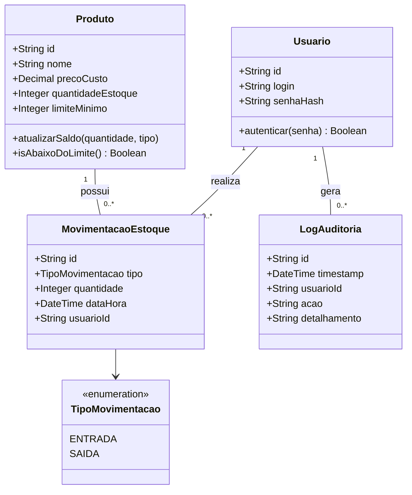

# Relatório Técnico de Arquitetura de Software

## 1. Identificação das HUs

| ID | História de Usuário (HU) | Perfil | Valor de Negócio / Objetivo | Requisitos Relacionados |
| :--- | :--- | :--- | :--- | :--- |
| **HU01** | Cadastrar produto | Operador | Permitir inclusão de novos produtos no catálogo do sistema. | RF01, RNF01, RNF02 |
| **HU02** | Registrar entrada de mercadoria | Operador | Atualizar saldo incremental e registrar histórico de compras/recebimentos. | RF04, RF07, RNF03, RNF04, RNF08 |
| **HU03** | Registrar saída de produto | Operador | Decrementar estoque com validação de saldo e garantir integridade de dados. | RF05, RF06, RF07, RNF03, RNF04, RNF08 |
| **HU04** | Ser alertado sobre estoque baixo | Operador | Notificar visualmente o operador sobre necessidade de reposição de itens. | RF09, RNF04 |
| **HU05** | Configurar limite mínimo de estoque | Operador | Estabelecer parametrização individual por produto para acionamento de alertas. | RF08 |
| **HU06** | Consultar saldo atual do estoque | Operador | Prover visão abrangente e imediata da situação física dos produtos. | RF10, RF12, RNF05 |
| **HU07** | Consultar histórico de movimentações | Operador | Permitir rastreabilidade temporal e auditabilidade das operações. | RF11, RNF05, RNF08 |
| **HU08** | Exportar dados de estoque e movimentações | Operador | Permitir extração local de arquivos CSV para backup e análise externa. | RNF07 |

---

## 2. Diagramas de Arquitetura (Mermaid)

### 2.1 Visão de Componentes do Sistema (Visão de Blocos)

```mermaid
componentDiagram
    package "Camada de Apresentação (Desktop)" {
        [Interface Desktop Windows] as UI
    }

    package "Camada de Serviços & Domínio" {
        [Módulo de Autenticação] as Auth
        [Gerenciador de Produtos] as ProdMgmt
        [Gerenciador de Movimentação] as MovMgmt
        [Motor de Alertas] as AlertEngine
        [Serviço de Exportação (CSV)] as ExportSvc
        [Serviço de Auditoria e Logs] as AuditSvc
    }

    package "Camada de Persistência Local" {
        [Mecanismo de Persistência Embarcada] as LocalDB
        [Sistema de Arquivos Local] as FileSystem
    }

    UI --> Auth : Autentica usuário
    UI --> ProdMgmt : CRUD Produtos / Limite Mínimo
    UI --> MovMgmt : Registra Entrada/Saída
    UI --> AlertEngine : Recebe notificações
    UI --> ExportSvc : Solicita exportação CSV

    MovMgmt --> ProdMgmt : Consulta/Atualiza Saldo
    MovMgmt --> AlertEngine : Dispara validação de limite
    MovMgmt --> AuditSvc : Registra transação
    ProdMgmt --> AuditSvc : Registra alterações

    Auth --> LocalDB : Valida credenciais
    ProdMgmt --> LocalDB : LER/GRAVAR
    MovMgmt --> LocalDB : LER/GRAVAR
    AuditSvc --> LocalDB : GRAVAR

    ExportSvc --> LocalDB : Consulta dados
    ExportSvc --> FileSystem : Escreve arquivo CSV
```

### 2.2 Diagrama de Sequência: Registro de Saída de Produto com Validação e Alerta (HU03, HU04)

```mermaid
sequenceDiagram
    autonumber
    actor Operador as Operador de Estoque
    participant UI as Interface Desktop
    participant MovSvc as Gerenciador de Movimentação
    participant ProdSvc as Gerenciador de Produtos
    participant AlertEng as Motor de Alertas
    participant AuditSvc as Serviço de Auditoria
    participant DB as Banco de Dados Embarcado

    Operador ->> UI: Solicita registro de saída (ProdutoID, Quantidade)
    UI ->> MovSvc: registrarSaida(produtoId, qtd, usuarioId)
    
    activate MovSvc
    MovSvc ->> ProdSvc: obterProduto(produtoId)
    activate ProdSvc
    ProdSvc ->> DB: Query Produto por ID
    DB -->> ProdSvc: Dados do Produto (Saldo Atual, Limite Mínimo)
    ProdSvc -->> MovSvc: Objeto Produto
    deactivate ProdSvc

    alt Quantidade Solicitada > Saldo Atual (RF06)
        MovSvc -->> UI: Erro: Quantidade solicitada superior ao estoque disponível
        UI -->> Operador: Exibe mensagem de erro na tela
    else Saldo Suficiente
        MovSvc ->> DB: Iniciar Transação Local
        MovSvc ->> ProdSvc: atualizarSaldo(produtoId, novoSaldo)
        ProdSvc ->> DB: UPDATE Produto SET saldo = novoSaldo
        MovSvc ->> DB: INSERT Movimentacao (Tipo: SAIDA, Qtd, DataHora, Usuario)
        
        MovSvc ->> AuditSvc: registrarLog(usuarioId, Acao.SAIDA_ESTOQUE, detalhamento)
        AuditSvc ->> DB: INSERT LogAuditoria
        
        MovSvc ->> DB: Commit Transação
        
        MovSvc ->> AlertEng: verificarLimiteMinimo(produtoId, novoSaldo, limiteMin)
        activate AlertEng
        alt novoSaldo <= limiteMin (RF09 / HU04)
            AlertEng -->> UI: Emitir Alerta Visível (Produto, Saldo Atual, Limite)
        end
        deactivate AlertEng

        MovSvc -->> UI: Confirmação de Saída Registrada
        deactivate MovSvc
        UI -->> Operador: Exibe confirmação e atualiza saldo na tela
    end
end
```

### 2.3 Diagrama de Classes de Domínio (Modelo Conceitual)



---

## 3. Decisões de Arquitetura

### 3.1 Estilo Arquitetural: Aplicação Desktop Monolítica em Camadas (Layered Monolith)
* **Justificativa:** Em conformidade com o **RNF01** (Execução local em sistema Windows) e **RNF02** (Armazenamento local em banco de dados embarcado sem servidor externo). Não há requisito para descentralização física de serviços ou arquitetura distribuída.
* **Impacto:** Alta facilidade de implantação (*zero-configuration installation*), baixa complexidade operacional e baixíssima latência nas consultas locais.

### 3.2 Garantia de Integridade e Persistência Transacional (ACID Local)
* **Justificativa:** Atendimento direto ao **RNF03** (Garantia contra perda de lançamentos em falhas inesperadas) e **RF07** (Atualização automática imediata).
* **Impacto:** Todas as movimentações de estoque (entradas e saídas) e gravações no log de auditoria devem ser executadas dentro de **transações atômicas** no motor do banco de dados embarcado. Em caso de queda de energia ou fechamento abrupto, o estado permanece consistente via *Write-Ahead Logging* (WAL) ou mecanismo equivalente do banco embarcado.

### 3.3 Motor de Avaliação de Alertas Orientado a Eventos Internos (In-Process Events)
* **Justificativa:** Atendimento ao **RF09** e **HU04** (Alertas imediatos na interface ao atingir ou ultrapassar o limite mínimo).
* **Impacto:** Após qualquer mutação de saldo, o serviço de movimentação dispara um evento em memória capturado pelo *Motor de Alertas*, garantindo a atualização imediata da interface visual sem a necessidade de *polling* contínuo no banco de dados.

### 3.4 Padrão de Interceptação para Auditabilidade e Rastreabilidade
* **Justificativa:** Cumprimento rigoroso do **RNF08** (Rastreabilidade contendo data, hora e usuário responsável por cada operação).
* **Impacto:** Injeção da responsabilidade de auditoria na camada de serviço. Cada operação de alteração de catálogo ou movimentação passa por um componente centralizador de auditoria antes da finalização da transação.

### 3.5 Isolação da Camada de Exportação de Dados (CSV)
* **Justificativa:** Atendimento aos requisitos **RNF07** e **HU08**.
* **Impacto:** Leitura assíncrona desacoplada da interface principal para não congelar a UI durante a geração do arquivo CSV, respeitando limites de desempenho visual.

---

## 4. Tabela de Componentes e Rastreabilidade

| Componente | Responsabilidade Principal | Comunica-se com | Origem (HU / Critério de Aceite) |
| :--- | :--- | :--- | :--- |
| **Interface Desktop Windows** | Apresentação visual, captura de dados do operador, exibição de alertas visuais e listagens de estoque/histórico em até 3 cliques. | Módulo de Autenticação, Gerenciador de Produtos, Gerenciador de Movimentação, Exportação CSV. | HU01 a HU08, RNF01, RNF04, RNF05 |
| **Módulo de Autenticação** | Controle de acesso via usuário e senha, gestão da sessão do operador ativo no sistema. | Interface Desktop, Mecanismo de Persistência Embarcada. | RNF06, RNF08 |
| **Gerenciador de Produtos** | Gestão do cadastro de produtos (inclusão, edição, exclusão), consulta por nome e configuração individual do limite mínimo de estoque. | Interface Desktop, Serviço de Auditoria, Persistência Embarcada. | HU01, HU05, HU06, RF01, RF02, RF03, RF08, RF12 |
| **Gerenciador de Movimentação** | Processamento transacional de entradas e saídas de mercadorias, validação de saldo disponível e cálculo de estoque. | Interface Desktop, Gerenciador de Produtos, Motor de Alertas, Serviço de Auditoria, Persistência Embarcada. | HU02, HU03, RF04, RF05, RF06, RF07, RNF03 |
| **Motor de Alertas de Estoque** | Avaliação do saldo em relação ao limite mínimo configurado e emissão do estado de alerta para a camada visual. | Gerenciador de Movimentação, Interface Desktop. | HU04, RF09 |
| **Serviço de Exportação de Dados** | Leitura das tabelas locais e formatação dos arquivos em padrão CSV para diretórios selecionados. | Interface Desktop, Persistência Embarcada, Sistema de Arquivos Local. | HU08, RNF07 |
| **Serviço de Auditoria e Logs** | Registro imutável de operações contendo timestamp, identificador do usuário e ação executada. | Gerenciador de Produtos, Gerenciador de Movimentação, Persistência Embarcada. | RNF08, HU02, HU03, HU07 |
| **Mecanismo de Persistência Embarcada** | Armazenamento físico de dados localmente com suporte a transações ACID e consultas indexadas. | Módulo de Autenticação, Gerenciador de Produtos, Gerenciador de Movimentação, Serviço de Auditoria. | RNF02, RNF03, RNF05 |

---

## 5. Bloqueios e Pendências

### 5.1 Bloqueios (Critical Blockers)
* **Nenhum bloqueio crítico mapeado:** Os requisitos de entrada permitem a definição completa da arquitetura lógica funcional desktop local.

### 5.2 Pendências de Especificação e Requisitos (Pending Clarifications)
1. **Gestão de Usuários e Primeiro Acesso:** O requisito **RNF06** exige autenticação por usuário e senha, porém não há detalhamento de telas/funções para cadastro inicial de usuários, alteração ou recuperação de senha.
2. **Concorrência Local entre Sessões do Sistema Operacional:** O **RNF02** especifica banco embarcado local. Caso dois usuários executem a aplicação em contas de usuário do Windows diferentes apontando para o mesmo arquivo de banco, como será tratado o bloqueio de arquivo (*file lock*)?
3. **Backup / Restauração do Banco de Dados:** O **RNF07** prevê exportação CSV para fins de backup, mas o CSV é um formato analítico/plano. Não há especificação sobre restauração de dados (*Restore*) em caso de falha de disco ou migração de computador.

---

## 6. Cobertura de Requisitos

| Requisito | Coberto pelo Componente / Módulo | Coberto pela HU | Diagrama/Artefato de Suporte |
| :--- | :--- | :--- | :--- |
| **RF01** (Cadastrar produto) | Gerenciador de Produtos | HU01 | Visão de Componentes / Modelo de Classes |
| **RF02** (Editar produto) | Gerenciador de Produtos | HU01 | Visão de Componentes |
| **RF03** (Remover produto) | Gerenciador de Produtos | HU01 | Visão de Componentes |
| **RF04** (Registrar entrada) | Gerenciador de Movimentação | HU02 | Visão de Componentes / Modelo de Classes |
| **RF05** (Registrar saída) | Gerenciador de Movimentação | HU03 | Diagrama de Sequência |
| **RF06** (Impedir saída > estoque) | Gerenciador de Movimentação | HU03 | Diagrama de Sequência |
| **RF07** (Atualizar saldo aut.) | Gerenciador de Movimentação | HU02, HU03 | Diagrama de Sequência |
| **RF08** (Limite mínimo por prod.) | Gerenciador de Produtos | HU05 | Modelo de Classes |
| **RF09** (Alerta de estoque baixo) | Motor de Alertas de Estoque | HU04 | Diagrama de Sequência |
| **RF10** (Exibir saldo de todos) | Interface Desktop / Gerenciador de Produtos | HU06 | Visão de Componentes |
| **RF11** (Historico movimentações) | Gerenciador de Movimentação | HU07 | Visão de Componentes / Modelo de Classes |
| **RF12** (Pesquisar produto nome) | Gerenciador de Produtos | HU02, HU06 | Visão de Componentes |
| **RNF01** (Desktop Windows) | Interface Desktop Windows | - | Arquitetura de Camadas |
| **RNF02** (Persistência embarcada)| Mecanismo de Persistência Embarcada | - | Visão de Componentes |
| **RNF03** (Garantia sem perdas) | Mecanismo de Persistência / Movimentação | HU02, HU03 | Diagrama de Sequência (Transação Local) |
| **RNF04** (Até 3 interações) | Interface Desktop Windows | HU02, HU03, HU04 | Decisões de Arquitetura |
| **RNF05** (Carregamento < 2s) | Persistência / Índices em Banco Embarcado | HU06, HU07 | Decisões de Arquitetura |
| **RNF06** (Autenticação) | Módulo de Autenticação | - | Visão de Componentes |
| **RNF07** (Exportar CSV) | Serviço de Exportação de Dados | HU08 | Visão de Componentes |
| **RNF08** (Rastreabilidade) | Serviço de Auditoria e Logs | HU02, HU03, HU07 | Diagrama de Sequência / Modelo de Classes |

---

## 7. Gap Analysis

| Lacuna Identificada (Gap) | Impacto Arquitetural | Ação Recomendada para o Time de Dev |
| :--- | :--- | :--- |
| **Ausência de Módulo de Gestão de Credenciais de Usuário** | Impossibilidade de cadastrar novos operadores no sistema no primeiro uso (*bootstrapping*). | Implementar um script/módulo de migração inicial que crie um usuário padrão de administração no primeiro boot da aplicação local. |
| **Regra de Exclusão de Produtos com Histórico de Movimentação (RF03)** | Excluir um produto que possui lançamentos de entrada/saída associados causará violação de integridade referencial ou perda de rastreabilidade de histórico (RF11/RNF08). | Adotar a estratégia de **Exclusão Lógica (Soft Delete)** através de uma flag `ativo: boolean` na entidade Produto, impedindo novas movimentações sem apagar o histórico existente. |
| **Estratégia de Indexação para Consulta Instantânea (RNF05)** | Risco do carregamento ultrapassar 2 segundos à medida que a tabela de histórico de movimentação acumular dezenas de milhares de registros. | Criar índices compostos obrigatoriamente nas colunas `(produto_id, data_hora)` no banco embarcado para garantir tempo de resposta otimizado nas consultas do histórico. |
| **Formato e Delimitador do Arquivo CSV (RNF07 / HU08)** | Incompatibilidade ao abrir o arquivo CSV em softwares de planilha (devido a variações de localidade regional, ex.: vírgula vs. ponto e vírgula, e codificação UTF-8/ANSI). | Padronizar a exportação com codificação **UTF-8 com BOM** e utilizar o ponto e vírgula (`;`) como delimitador padrão para sistemas Windows em português. |