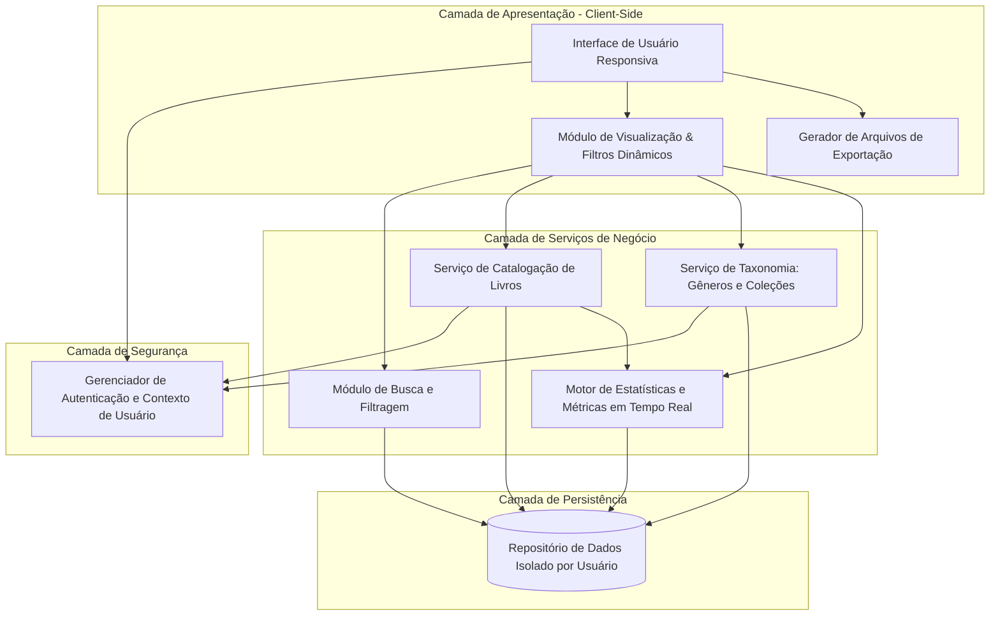
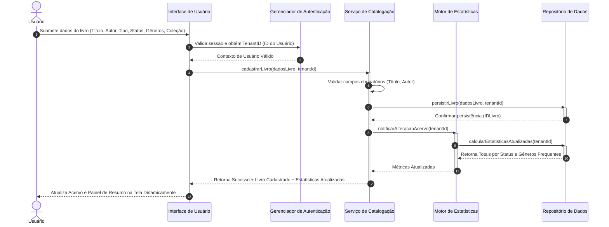

# Relatório Técnico de Arquitetura de Software

## 1. Identificação das HUs

A tabela a seguir consolida a rastreabilidade entre as Histórias de Usuário (HUs), atores, descrição funcional e os Requisitos Funcionais (RF) e Não Funcionais (RNF) associados.

| ID | Título da HU | Ator Principal | Descrição Sumária | Requisitos Associados |
| :--- | :--- | :--- | :--- | :--- |
| **HU01** | Cadastrar livro | Usuário | Cadastrar livro informando título, autor, editora, tipo (físico/digital) e status de leitura. | RF01, RF04, RF13, RNF01, RNF04 |
| **HU02** | Atualizar status de leitura | Usuário | Alterar o status de leitura de um livro (não lido, lendo, concluído) a qualquer momento. | RF04, RF05, RNF04, RNF05 |
| **HU03** | Organizar livros por gênero | Usuário | Criar, editar e remover gêneros literários, associando um livro a múltiplos gêneros. | RF06, RF08, RNF04 |
| **HU04** | Organizar livros por coleção | Usuário | Criar, editar e remover coleções personalizadas, associando um livro a no máximo uma coleção. | RF07, RF08, RNF04 |
| **HU05** | Filtrar o acervo | Usuário | Filtrar o acervo por múltiplos atributos combinados com atualização dinâmica e opção de limpeza. | RF09, RNF02, RNF03 |
| **HU06** | Pesquisar livros por título ou autor | Usuário | Realizar busca textual por título ou autor com resultados parciais e dinâmicos em tempo real. | RF12, RNF02, RNF03 |
| **HU07** | Visualizar resumo do acervo | Usuário | Exibir estatísticas consolidadas (totais por status e gêneros frequentes) atualizadas em tempo real. | RF10, RF11, RNF05 |
| **HU08** | Exportar o acervo | Usuário | Exportar os dados completos do acervo em formato CSV ou JSON para download via navegador. | RNF06, RNF07 |

---

## 2. Diagramas de Arquitetura (Mermaid)

### 2.1. Diagrama de Componentes (Visão Visão Lógica)

### 2.2. Diagrama de Sequência: Cadastro de Livro e Atualização de Resumo em Tempo Real

---

## 3. Decisões de Arquitetura

1. **Isolamento de Dados por Usuário (Multi-Tenancy Lógico na Camada de Aplicação)**:
   - *Decisão*: Toda requisição à camada de serviços deve obrigatoriamente validar o contexto do usuário autenticado (`tenantId`/`userId`).
   - *Justificativa*: Atender ao RNF01, garantindo que a biblioteca seja estritamente pessoal e nenhum usuário acesse registros de outros.

2. **Desplocamento do Processamento de Exportação para o Cliente**:
   - *Decisão*: A geração dos arquivos CSV e JSON para exportação do acervo será processada na camada de apresentação (navegador do cliente) a partir do conjunto de dados estruturado retornado pela API.
   - *Justificativa*: Descarrega o servidor de processamento I/O de arquivos e atende aos RNF06 e RNF07 de forma leve e responsiva.

3. **Cálculo de Estatísticas Orientado a Eventos de Domínio**:
   - *Decisão*: A inclusão, edição ou exclusão de livros ou gêneros dispara eventos internos para o *Motor de Estatísticas*, que recalcula o resumo do acervo de forma reativa.
   - *Justificativa*: Garante o cumprimento do RNF05 (atualização do resumo estatístico em tempo real) mantendo o desacoplamento entre a gestão do livro e os relatórios.

4. **Integridade Referencial Suave para Taxonomias (Desvinculação Não Causal)**:
   - *Decisão*: Ao excluir um Gênero ou Coleção, as chaves de associação nos livros correspondentes são nulas/removidas (operação `SET NULL` ou *un-link*), preservando a entidade do Livro intacta.
   - *Justificativa*: Atende expressamente aos critérios de aceite das HUs HU03 e HU04.

5. **Estratégia de Busca e Filtragem Dinâmica In-Memory / Indexada**:
   - *Decisão*: As operações de filtro dinâmico e busca textual por digitação (autocomplete/parcial) serão executadas com estratégias de debounce no client-side para coleções locais ou via índices de consulta no repositório.
   - *Justificativa*: Garante que a listagem e filtragem ocorram em tempo <= 2 segundos conforme RNF03 e HUs HU05 e HU06.

---

## 4. Tabela de Componentes e Rastreabilidade

| Componente | Responsabilidade Principal | Comunica-se com | Origem (HU / Critério de Aceite) |
| :--- | :--- | :--- | :--- |
| **Interface de Usuário Responsiva** | Prover telas responsivas para interação no desktop/mobile, capturando inputs e renderizando catálogos, filtros e estatísticas em tempo real. | Gerenciador de Autenticação, Módulo de Visualização & Filtros, Gerador de Arquivos | HU01, HU02, HU03, HU04, HU05, HU06, HU07, HU08, RNF02 |
| **Gerenciador de Autenticação e Contexto** | Garantir o acesso seguro, autenticar o usuário e injetar a identificação do usuário (*tenant*) em todas as operações do acervo. | Interface de Usuário, Serviço de Catalogação, Serviço de Taxonomia | RNF01 |
| **Serviço de Catalogação de Livros** | Gerenciar o ciclo de vida dos livros (CRUD, alteração de status, diferenciação físico/digital, associação de taxonomias). | Gerenciador de Autenticação, Repositório de Dados, Motor de Estatísticas | HU01, HU02, HU08, RF01, RF02, RF03, RF04, RF05, RF13 |
| **Serviço de Taxonomia** | Gerenciar a criação, edição e remoção de Gêneros e Coleções, mantendo as regras de vínculo (N Gêneros, 1 Coleção). | Gerenciador de Autenticação, Repositório de Dados | HU03, HU04, RF06, RF07, RF08 |
| **Módulo de Busca e Filtragem Dinâmica** | Processar consultas combinadas por múltiplos atributos e pesquisas textuais parciais com resposta dinâmica. | Repositório de Dados, Interface de Usuário | HU05, HU06, RF09, RF12, RNF03 |
| **Motor de Estatísticas e Métricas** | Calcular e recalcular em tempo real totais de livros por status e ranking de gêneros mais frequentes. | Repositório de Dados, Serviço de Catalogação | HU07, RF10, RF11, RNF05 |
| **Gerador de Arquivos de Exportação** | Transformar a estrutura de dados do acervo do usuário nos formatos CSV e JSON e acionar o download via navegador. | Interface de Usuário | HU08, RNF06, RNF07 |
| **Repositório de Dados Isolado** | Persistir as entidades (Livros, Gêneros, Coleções) garantindo isolamento lógico por usuário e durabilidade sem perda de dados. | Serviço de Catalogação, Serviço de Taxonomia, Motor de Estatísticas | RNF01, RNF04 |

---

## 5. Bloqueios e Pendências

1. **Atributos Específicos por Tipo de Livro (Físico vs. Digital)**:
   - *Pendência*: O RF13 e a HU01 citam a diferenciação entre livros físicos e digitais, porém não definem se existem atributos exclusivos para cada tipo (ex.: formato ePub/PDF, tamanho do arquivo para digitais; localização física, número de prateleira ou estado de conservação para físicos).
   - *Impacto*: Pode gerar necessidade de refatoração no modelo de dados do Livro caso novos campos específicos surjam posteriormente.

2. **Definição dos Critérios do Ranking de Gêneros Frequentes**:
   - *Pendência*: O RF11 e a HU07 citam exibir os "gêneros mais frequentes", mas não estabelecem a quantidade limite (ex.: Top 3, Top 5) ou a regra de desempate caso dois gêneros possuam a mesma contagem.
   - *Impacto*: Comportamento indeterminado na Interface de Usuário para acervos com empates múltiplos.

3. **Mecanismo de Autenticação e Gestão de Usuários**:
   - *Pendência*: O RNF01 exige acesso protegido por autenticação e acervo pessoal isolado, mas não foram fornecidos requisitos funcionais para auto-cadastro de usuários, redefinição de senha ou login social.
   - *Impacto*: Necessidade de escopo adicional para implementação do fluxo de identidade do usuário.

---

## 6. Cobertura de Requisitos

### 6.1. Requisitos Funcionais (RF)

| Requisito Funcional | Coberto pelo Componente / Mecanismo Arquitetural | Status |
| :--- | :--- | :--- |
| **RF01** (Cadastrar livro) | Serviço de Catalogação de Livros / Repositório de Dados | Coberto |
| **RF02** (Editar livro) | Serviço de Catalogação de Livros / Repositório de Dados | Coberto |
| **RF03** (Remover livro) | Serviço de Catalogação de Livros / Repositório de Dados | Coberto |
| **RF04** (3 opções de status) | Serviço de Catalogação de Livros (Enum de Status) | Coberto |
| **RF05** (Atualizar status a qualquer momento) | Serviço de Catalogação de Livros | Coberto |
| **RF06** (CRUD de Gêneros) | Serviço de Taxonomia | Coberto |
| **RF07** (CRUD de Coleções) | Serviço de Taxonomia | Coberto |
| **RF08** (Associar livro a Gêneros e Coleção) | Serviço de Catalogação + Serviço de Taxonomia | Coberto |
| **RF09** (Filtrar por qualquer atributo) | Módulo de Busca e Filtragem Dinâmica | Coberto |
| **RF10** (Resumo por status) | Motor de Estatísticas e Métricas em Tempo Real | Coberto |
| **RF11** (Gêneros mais frequentes) | Motor de Estatísticas e Métricas em Tempo Real | Coberto |
| **RF12** (Pesquisar por título ou autor) | Módulo de Busca e Filtragem Dinâmica | Coberto |
| **RF13** (Diferenciar físico de digital) | Serviço de Catalogação (Atributo TipoLivro) | Coberto |

### 6.2. Requisitos Não Funcionais (RNF)

| Requisito Não Funcional | Coberto pelo Componente / Mecanismo Arquitetural | Status |
| :--- | :--- | :--- |
| **RNF01** (Segurança e Isolamento) | Gerenciador de Autenticação e Contexto de Usuário | Coberto |
| **RNF02** (Interface Responsiva) | Interface de Usuário Responsiva (Design Adaptável) | Coberto |
| **RNF03** (Desempenho <= 2s) | Módulo de Busca e Filtragem / Índices no Repositório | Coberto |
| **RNF04** (Persistência em Banco) | Repositório de Dados Isolado | Coberto |
| **RNF05** (Atualização em Tempo Real) | Motor de Estatísticas Reativo (Event-Driven Update) | Coberto |
| **RNF06** (Compatibilidade de Navegadores) | Interface de Usuário Responsiva / Padrões Web W3C | Coberto |
| **RNF07** (Exportação CSV/JSON) | Gerador de Arquivos de Exportação | Coberto |

---

## 7. Gap Analysis

| Lacuna Identificada | Impacto Arquitetural | Ação Recomendada |
| :--- | :--- | :--- |
| **Ausência de limite e paginação para acervos muito grandes** | Se um usuário possuir milhares de livros, carregar todo o acervo de uma vez pode violar o tempo máximo de resposta de 2 segundos (RNF03) e sobrecarregar a memória do navegador. | Implementar estratégia de paginação dinâmica/scroll infinito na API e no componente de visualização, associada a buscas indexadas. |
| **Evolução de esquema para atributos específicos por tipo (Físico/Digital)** | Riscos de dados nulos sem padronização caso o produto solicite campos como URL/Tamanho em MB para digitais ou Localização/Estante para físicos. | Modelar a entidade Livro com suporte a extensibilidade de metadados (modelo de chave-valor ou atributos adicionais opcionais). |
| **Gestão de concorrência e sessão multi-dispositivo** | Se o usuário alterar o status de leitura no celular, o navegador no desktop pode ficar desatualizado (violando a expectativa de tempo real do RNF05). | Adotar comunicação bidirecional reativa (WebSockets ou Server-Sent Events) para sincronização de estatísticas entre sessões ativas do mesmo usuário. |
| **Limites e formatação na exportação de grandes volumes** | Arquivos JSON/CSV muito grandes gerados diretamente no navegador podem travar a thread da UI em dispositivos móveis menos potentes. | Implementar Web Workers no navegador para realizar o processamento de conversão para CSV/JSON em segundo plano sem bloquear a interface. |