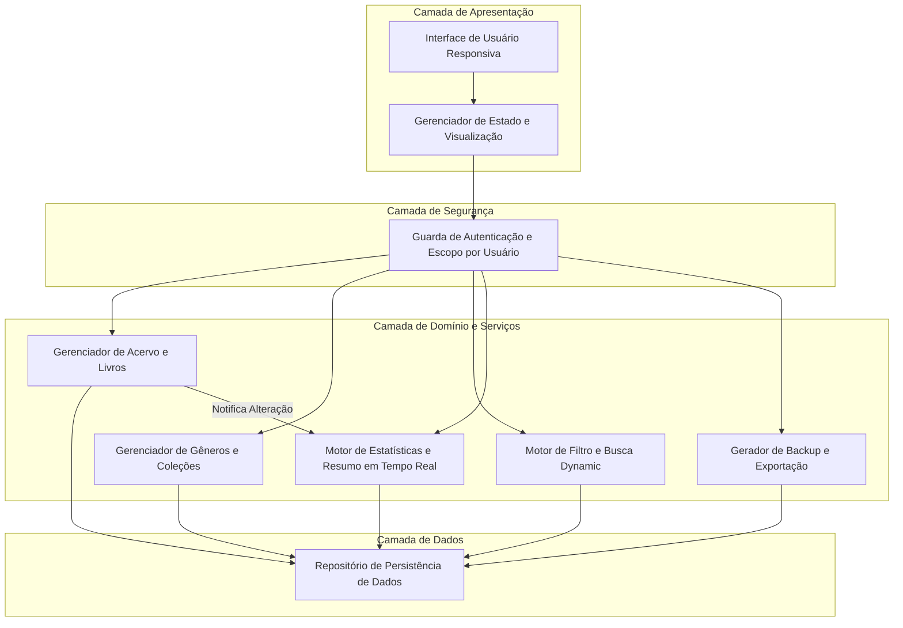
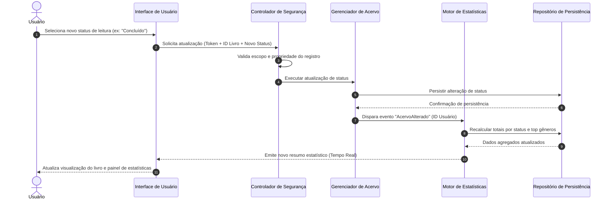

# Relatório Técnico de Arquitetura de Software

---

## 1. Identificação das HUs

A tabela abaixo correlaciona as Histórias de Usuário (HUs) com os Requisitos Funcionais (RF) e Não Funcionais (RNF) correspondentes, estabelecendo o escopo funcional do sistema de catalogação de livros:

| História de Usuário (HU) | Requisitos Funcionais (RF) | Requisitos Não Funcionais (RNF) | Descrição Sintética |
| :--- | :--- | :--- | :--- |
| **HU01 — Cadastrar livro** | RF01, RF04, RF13 | RNF01, RNF04 | Permite registrar um livro especificando título, autor, editora, tipo (físico/digital) e status de leitura. |
| **HU02 — Atualizar status de leitura** | RF04, RF05 | RNF04, RNF05 | Permite modificar a qualquer momento o status de leitura (não lido, lendo, concluído) com atualização imediata no resumo. |
| **HU03 — Organizar livros por gênero** | RF06, RF08 | RNF04 | Gestão de gêneros literários (criar, editar, remover) e associação N:N com livros sem exclusão em cascata. |
| **HU04 — Organizar livros por coleção** | RF07, RF08 | RNF04 | Gestão de coleções (criar, editar, remover) e associação 1:N com livros sem exclusão em cascata. |
| **HU05 — Filtrar o acervo** | RF09 | RNF02, RNF03 | Filtragem combinada e dinâmica do acervo por qualquer atributo cadastrado com opção de limpeza rápida. |
| **HU06 — Pesquisar livros por título ou autor** | RF12 | RNF02, RNF03 | Busca em tempo real por correspondência parcial nos campos de título e autor. |
| **HU07 — Visualizar resumo do acervo** | RF10, RF11 | RNF05 | Painel de métricas com total de livros por status e gêneros mais frequentes, atualizado em tempo real. |
| **HU08 — Exportar o acervo** | N/A | RNF06, RNF07 | Exportação do acervo em arquivos CSV ou JSON disponibilizados para download direto pelo navegador. |

---

## 2. Diagramas de Arquitetura (Mermaid)

### 2.1. Diagrama de Visão Geral de Componentes
O diagrama a seguir descreve a organização em camadas lógicas e a separação de responsabilidades no sistema.

### 2.2. Diagrama de Sequência: Atualização de Status e Recomposição de Estatísticas (HU02 / RNF05)
O diagrama detalha a sequência dinâmica quando um usuário altera o status de leitura de um livro, demonstrando o fluxo de atualização e recalculo estatístico.

---

## 3. Decisões de Arquitetura

*   **AD-01: Isolamento de Dados por Usuário no Nível de Aplicação e Persistência (RNF01)**
    *   *Descrição*: Para garantir que o acervo seja estritamente pessoal, a arquitetura exige a inclusão do identificador do usuário autenticado (`ID_Usuario`) em todos os predicados de busca e operações de escrita da camada de repositório. Nenhuma consulta pode retornar dados sem validar a propriedade da entidade.
*   **AD-02: Atualização Reativa e Desacoplada de Estatísticas (RNF05)**
    *   *Descrição*: As métricas do resumo do acervo (totais por status e gêneros mais frequentes) serão recalculadas via notificações internas acionadas após qualquer operação de criação, edição ou remoção de livros (padrão Observer/Event-Driven interno). Isso garante que o painel de estatísticas reflita as mudanças instantaneamente na interface do usuário.
*   **AD-03: Desvinculação Não Destrutiva de Relações (HU03, HU04)**
    *   *Descrição*: A remoção de um Gênero ou Coleção não causa exclusão de livros em cascata (Cascade Delete). O relacionamento é mapeado de forma opcional (`Nullable`). Ao excluir a entidade pai (Gênero/Coleção), as chaves estrangeiras associadas nos livros são simplesmente anuladas ou removidas da tabela associativa.
*   **AD-04: Processamento Local de Exportação no Cliente (HU08, RNF07)**
    *   *Descrição*: A geração dos arquivos CSV e JSON para exportação será realizada montando a estrutura de dados textual a partir da massa do acervo recuperada do repositório. A disponibilização do download será feita diretamente pelo navegador, reduzindo a carga de IO do servidor.
*   **AD-05: Estratégia de Filtragem e Busca em Memória / Indexada (RF09, RF12, RNF03)**
    *   *Descrição*: Para atender o tempo limite de resposta de 2 segundos independentemente da quantidade de livros, os filtros e buscas dinâmicas utilizarão predicados combinados e índices adequados no armazenamento de dados, permitindo correspondências parciais (*case-insensitive*) sem necessidade de varredura completa (*full scan*).

---

## 4. Tabela de Componentes e Rastreabilidade

| Componente | Responsabilidade Principal | Comunica-se com | Origem (HU / Critério de Aceite) |
| :--- | :--- | :--- | :--- |
| **Interface de Usuário Responsiva** | Apresentar telas adaptáveis (mobile/desktop), capturar interações do usuário e exibir dados/estatísticas. | Guarda de Autenticação, Gerenciador de Estado | RF01-RF13, RNF02, HU01-HU08 |
| **Guarda de Autenticação e Segurança** | Interceptar requisições, autenticar o usuário e injetar o contexto de escopo individual. | Interface de Usuário, Gerenciadores de Domínio | RNF01 |
| **Gerenciador de Acervo e Livros** | Executar regras de negócio para criação, edição, remoção e categorização de livros físicos e digitais. | Repositório de Persistência, Motor de Estatísticas | RF01, RF02, RF03, RF04, RF05, RF13, HU01, HU02 |
| **Gerenciador de Gêneros e Coleções** | Controlar o ciclo de vida de gêneros e coleções e gerenciar os vinculos não destrutivos com livros. | Repositório de Persistência | RF06, RF07, RF08, HU03, HU04 |
| **Motor de Filtro e Busca Dynamic** | Executar consultas com múltiplos critérios combinados e busca por texto parcial em tempo real. | Repositório de Persistência, Interface de Usuário | RF09, RF12, RNF03, HU05, HU06 |
| **Motor de Estatísticas e Resumo** | Calcular agregados (livros por status, gêneros mais frequentes) em tempo real após eventos do acervo. | Repositório de Persistência, Interface de Usuário | RF10, RF11, RNF05, HU07 |
| **Exportador de Acervo** | Formatar e serializar os dados do acervo em estruturas JSON e CSV para download. | Repositório de Persistência, Interface de Usuário | RNF07, HU08 |
| **Repositório de Persistência de Dados** | Prover acesso abstrato à base de dados com persistência relacional/documental segura. | Todos os Serviços de Domínio | RNF04 |

---

## 5. Bloqueios e Pendências

1.  **Pendência de Especificação:** Ausência de regras de negócio para limites de paginação ou quantidade máxima de livros retornados em uma única consulta (impacta RNF03 sob volume massivo de dados).
2.  **Pendência de Mapeamento CSV:** Não está definido no requisito como representar uma relação de 1 para N (um livro com múltiplos gêneros) dentro de uma linha de arquivo CSV plano na exportação.
3.  **Indefinição sobre Autenticação:** Não há requisitos explícitos cobrindo telas/operações de login, cadastro de conta ou recuperação de senha, embora a RNF01 exija controle estrito de acesso e isolamento de acervo.

---

## 6. Cobertura de Requisitos

A matriz a seguir mapeia a cobertura funcional e não funcional pelo design arquitetural proposto:

| Requisito | Coberto pelos Componentes / Decisões Arquiteturais | Status de Cobertura |
| :--- | :--- | :--- |
| **RF01, RF02, RF03** | Gerenciador de Acervo e Livros, Repositório de Persistência | Totalmente Coberto |
| **RF04, RF05** | Gerenciador de Acervo, AD-02 (Atualização Reativa) | Totalmente Coberto |
| **RF06, RF07, RF08** | Gerenciador de Gêneros e Coleções, AD-03 (Desvinculação Não Destrutiva) | Totalmente Coberto |
| **RF09, RF12** | Motor de Filtro e Busca Dynamic, AD-05 | Totalmente Coberto |
| **RF10, RF11** | Motor de Estatísticas e Resumo, AD-02 | Totalmente Coberto |
| **RF13** | Gerenciador de Acervo (Diferenciação Físico/Digital no Modelo de Entidade) | Totalmente Coberto |
| **RNF01** | Guarda de Autenticação e Segurança, AD-01 | Totalmente Coberto |
| **RNF02, RNF06** | Interface de Usuário Responsiva | Totalmente Coberto |
| **RNF03** | Motor de Filtro e Busca Dynamic, AD-05 | Totalmente Coberto |
| **RNF04** | Repositório de Persistência de Dados | Totalmente Coberto |
| **RNF05** | Motor de Estatísticas e Resumo, AD-02 | Totalmente Coberto |
| **RNF07** | Exportador de Acervo, AD-04 | Totalmente Coberto |

---

## 7. Gap Analysis

| Lacuna / Inconsistência Identificada | Impacto na Arquitetura | Ação Recomendada |
| :--- | :--- | :--- |
| **Falta de fluxo de autenticação/gestão de usuários (RF vs. RNF01)** | Risco de impossibilidade de implementação da segurança e do isolamento do acervo, pois faltam histórias de login/registro. | Criar HUs adicionais para "Autenticação de Usuário", "Cadastro de Conta" e "Gerenciamento de Sessão". |
| **Formatação do CSV para múltiplos gêneros por livro (HU03 + HU08)** | Potencial geração de arquivos CSV mal formatados ou perda de dados de associação de gêneros ao reimportar/abrir em tabelas externas. | Definir o contrato do formato CSV: utilizar caractere delimitador interno (ex: ponto e vírgula ou lista separada por pipe `"Ficção|Sci-Fi"`) para colunas multivaloradas. |
| **Ausência de mecanismo de Paginação (HU05, HU06, RNF03)** | Em acervos muito grandes, retornar todos os dados sem paginação degradará o tempo de resposta além de 2s e consumirá excesso de memória no cliente. | Introduzir um padrão de paginação dinâmica (*cursor-based* ou *offset*) nas APIs de consulta e filtragem do acervo. |
| **Falta de controle de ordenação da listagem do acervo** | A experiência do usuário pode ser inconsistente se o acervo for exibido em ordem aleatória. | Incluir opção de ordenação padrão (ex: por título, data de cadastro ou autor) na interface e nas rotas de busca. |