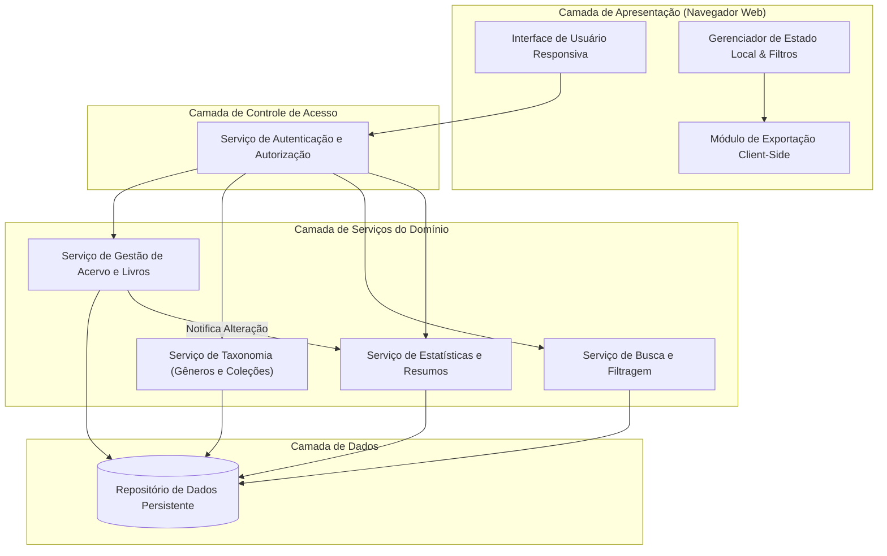
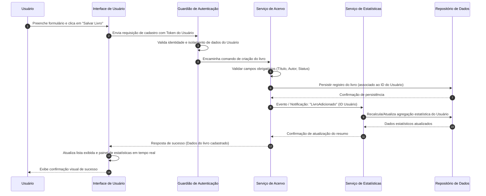

# Relatório Técnico de Arquitetura de Software

---

## 1. Identificação das HUs

A tabela abaixo correlaciona as Histórias de Usuário (HUs) com o escopo funcional e não funcional correspondente, estabelecendo a base para a rastreabilidade arquitetural.

| ID HU | Titulo | Ator | Objetivo Principal | RFs Cobertos | RNFs Cobertos |
|---|---|---|---|---|---|
| **HU01** | Cadastrar livro | Usuário | Registrar um novo livro (físico ou digital) com título, autor, editora e status de leitura. | RF01, RF04, RF13 | RNF01, RNF04 |
| **HU02** | Atualizar status de leitura | Usuário | Alterar o estado de leitura de um livro (não lido, lendo, concluído) com reflexo dinâmico. | RF04, RF05 | RNF01, RNF04, RNF05 |
| **HU03** | Organizar livros por gênero | Usuário | Gerenciar gêneros literários (CRUD) e associar múltiplos gêneros a cada livro. | RF06, RF08 | RNF01, RNF04 |
| **HU04** | Organizar livros por coleção | Usuário | Gerenciar coleções personalizadas (CRUD) e agrupar livros em no máximo uma coleção. | RF07, RF08 | RNF01, RNF04 |
| **HU05** | Filtrar o acervo | Usuário | Consultar livros combinando múltiplos critérios com atualização dinâmica e limpeza simples. | RF09 | RNF01, RNF02, RNF03 |
| **HU06** | Pesquisar livros | Usuário | Buscar livros por correspondência parcial de título ou autor em tempo de digitação. | RF12 | RNF01, RNF02, RNF03 |
| **HU07** | Visualizar resumo do acervo | Usuário | Consultar estatísticas em tempo real sobre status de leitura e gêneros mais frequentes. | RF10, RF11 | RNF01, RNF03, RNF05 |
| **HU08** | Exportar o acervo | Usuário | Gerar arquivo baixável nos formatos CSV ou JSON contendo todos os dados do acervo. | N/A | RNF01, RNF06, RNF07 |

---

## 2. Diagramas de Arquitetura (Mermaid)

### 2.1 Diagrama de Visão Geral de Componentes (Abstrato)

### 2.2 Diagrama de Sequência: Cadastro de Livro e Atualização de Estatísticas (HU01 + HU07 / RNF05)

---

## 3. Decisões de Arquitetura

### ADR-01: Isolamento de Dados por Usuário (Multi-tenancy Lógico)
* **Contexto:** RNF01 especifica que o acervo deve ser estritamente pessoal e protegido por autenticação.
* **Decisão:** Adotar isolamento lógico na camada de dados baseado em identificador único de usuário (`user_id`). Todas as requisições de leitura, escrita, filtragem e atualização devem injetar obrigatoriamente o contexto de identidade validado na camada de segurança, impedindo acesso cruzado.

### ADR-02: Cardinalidade e Desvinculação Graciosa de Taxonomias
* **Contexto:** HU03 e HU04 definem regras de categorização: Livro ↔ Gênero (1:N) e Livro ↔ Coleção (N:1). Ao remover gêneros ou coleções, os livros não podem ser excluídos.
* **Decisão:** A relação entre Livro e Gêneros será mapeada via tabela/estrutura de associação N:M. A relação entre Livro e Coleção será feita por associação opcional (chave estrangeira anulável). A exclusão de uma entidade taxonômica executará umaoperação de desvinculação em cascata (desassociar relacões), preservando a integridade e persistência do registro do livro.

### ADR-03: Processamento e Atualização Dinâmica de Estatísticas em Tempo Real
* **Contexto:** RNF05 e HU07 exigem que o resumo estatístico seja atualizado em tempo real conforme livros são adicionados, editados ou removidos.
* **Decisão:** Utilizar o padrão de Notificação de Eventos de Domínio no momento em que ocorrem alterações no ciclo de vida do livro. O Serviço de Estatísticas reagirá a esses eventos recalculando o resumo das contagens por status e gêneros mais frequentes, garantindo reatividade na interface de usuário.

### ADR-04: Processamento de Exportação Client-Side / Streaming
* **Contexto:** RNF07 e HU08 estabelecem a necessidade de exportar o acervo em CSV ou JSON diretamente via navegador.
* **Decisão:** A exportação será acionada solicitando os dados estruturados do acervo do usuário e processando a transformação de formato (CSV/JSON) e o download do arquivo diretamente no ambiente da Interface de Usuário (Client-Side), minimizando overhead no servidor e garantindo conformidade com o RNF06.

---

## 4. Tabela de Componentes e Rastreabilidade

| Componente | Responsabilidade Principal | Comunica-se com | Origem (HU / Critério de Aceite) |
|---|---|---|---|
| **Interface de Usuário (UI)** | Renderização responsiva, formulários de edição, busca dinâmica e exibição do painel estatístico. | Guardião de Autenticação, Módulo de Exportação Client-Side | RNF02, RNF06, HU01 a HU07 |
| **Guardião de Autenticação** | Garantir segurança de acesso, autoria das requisições e isolamento de acervo por usuário. | Interface de Usuário, Serviços de Domínio | RNF01 |
| **Serviço de Gestão de Acervo** | Executar operações de CRUD de livros, validação de dados obrigatórios e classificação (físico/digital). | Guardião de Autenticação, Repositório de Dados, Serviço de Estatísticas | RF01, RF02, RF03, RF04, RF05, RF13, HU01, HU02 |
| **Serviço de Taxonomia** | Gerenciar o ciclo de vida de Gêneros e Coleções e desvincular associações aquando de exclusões. | Guardião de Autenticação, Repositório de Dados, Serviço de Acervo | RF06, RF07, RF08, HU03, HU04 |
| **Serviço de Busca e Filtragem** | Realizar filtragens combinadas multi-atributos e pesquisas parciais por título/autor. | Guardião de Autenticação, Repositório de Dados | RF09, RF12, RNF03, HU05, HU06 |
| **Serviço de Estatísticas** | Agregar dados do acervo, calcular contadores por status e listar gêneros mais frequentes em tempo real. | Serviço de Acervo, Repositório de Dados | RF10, RF11, RNF05, HU07 |
| **Módulo de Exportação** | Converter dados do acervo para formatos CSV/JSON e disponibilizar arquivo para download. | Interface de Usuário | RNF07, HU08 |
| **Repositório de Dados Persistente** | Armazenar e garantir a persistência duradoura dos registros do acervo, taxonomias e vínculos. | Todos os Serviços de Domínio | RNF04 |

---

## 5. Bloqueios e Pendências

1. **Definição do Mecanismo de Autenticação:**
   * *Pendência:* O RNF01 explicita necessidade de autenticação e isolamento por usuário, mas os requisitos não especificam o fluxo de cadastro/recuperação de usuários.
   * *Impacto:* Dependência externa para integração do módulo de identidade.

2. **Limite Padrão e Paginação de Consultas:**
   * *Pendência:* O RNF03 exige resposta de busca/filtragem em até 2 segundos "independentemente do volume". Não há especificação de limitação (paginação) para acervos massivos.
   * *Impacto:* Riscos de degradação de desempenho em acervos extremamente grandes sem estratégia de paginação definida.

3. **Critério de Classificação dos "Gêneros Mais Frequentes":**
   * *Pendência:* A HU07 menciona listar os "gêneros mais frequentes", contudo não define a quantidade limite (ex: Top 3, Top 5) para exibição na interface.
   * *Impacto:* Pendência na definição de UX e na consulta de agregação estatística.

---

## 6. Cobertura de Requisitos

### Cobertura dos Requisitos Funcionais (RF)

| ID RF | Coberto pelo Componente | Coberto pela HU | Situação |
|---|---|---|---|
| **RF01** | Serviço de Gestão de Acervo | HU01 | Coberto |
| **RF02** | Serviço de Gestão de Acervo | N/A (Subentendido na manutenção) | Coberto |
| **RF03** | Serviço de Gestão de Acervo | N/A (Subentendido no CRUD de acervo) | Coberto |
| **RF04** | Serviço de Gestão de Acervo | HU01, HU02 | Coberto |
| **RF05** | Serviço de Gestão de Acervo | HU02 | Coberto |
| **RF06** | Serviço de Taxonomia | HU03 | Coberto |
| **RF07** | Serviço de Taxonomia | HU04 | Coberto |
| **RF08** | Serviço de Taxonomia / Serviço de Acervo | HU03, HU04 | Coberto |
| **RF09** | Serviço de Busca e Filtragem | HU05 | Coberto |
| **RF10** | Serviço de Estatísticas | HU07 | Coberto |
| **RF11** | Serviço de Estatísticas | HU07 | Coberto |
| **RF12** | Serviço de Busca e Filtragem | HU06 | Coberto |
| **RF13** | Serviço de Gestão de Acervo | HU01 | Coberto |

### Cobertura dos Requisitos Não Funcionais (RNF)

| ID RNF | Categoria | Coberto pela Estrutura Arquitetural | Situação |
|---|---|---|---|
| **RNF01** | Segurança | Guardião de Autenticação + Isolamento lógico no Repositório de Dados. | Coberto |
| **RNF02** | Usabilidade | Interface de Usuário Responsiva. | Coberto |
| **RNF03** | Desempenho | Índices de busca no Repositório de Dados e Serviço de Busca otimizado. | Coberto |
| **RNF04** | Persistência | Repositório de Dados Persistente com controle ACID / consistência. | Coberto |
| **RNF05** | Usabilidade | Comunicação orientada a eventos entre Serviço de Acervo e Serviço de Estatísticas. | Coberto |
| **RNF06** | Compatibilidade | Interface de Usuário desenvolvida sob padrões web universais (HTML/JS/CSS). | Coberto |
| **RNF07** | Manutenibilidade | Módulo de Exportação Client-Side. | Coberto |

---

## 7. Gap Analysis

| Lacuna Identificada | Tipo | Impacto Arquitetural | Ação Recomendada |
|---|---|---|---|
| Ausência de especificação sobre deleção lógica (Soft Delete) vs física. | Requisito de Dados | Se a remoção de um livro for física, histórico e estatísticas passadas podem ser impactados sem capacidade de recuperação. | Adotar padrão de deleção lógica (marcação de inativo) no Repositório de Dados para possibilitar restauração e auditoria. |
| Inexistência de especificação para paginação de listas de livros. | Desempenho / UX | Consultas que retornam milhares de itens podem violar o tempo limite de 2s (RNF03) e travar a interface. | Especificar e implementar paginação orientada a cursor ou offset no Serviço de Busca e Filtragem. |
| Tratamento de conflitos de nomenclatura em Gêneros/Coleções. | Regra de Negócio | Usuário pode criar gêneros duplicados com grafias idênticas ou similares (ex: "Ficção" e "ficção"). | Adicionar validação de unicidade (case-insensitive) por usuário no Serviço de Taxonomia. |
| Ausência de limites no tamanho/quantidade para exportação. | Escalabilidade | Arquivos de exportação extremamente grandes em clientes com poucos recursos de memória podem travar o navegador. | Adotar geração de arquivo via streaming de dados no Módulo de Exportação para lotes elevados. |