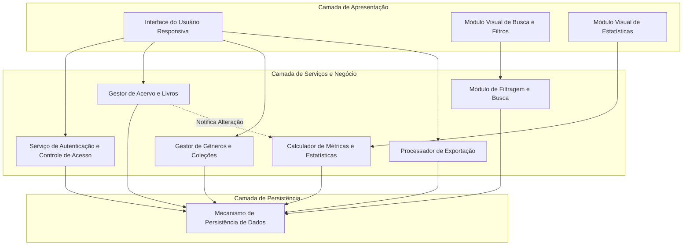
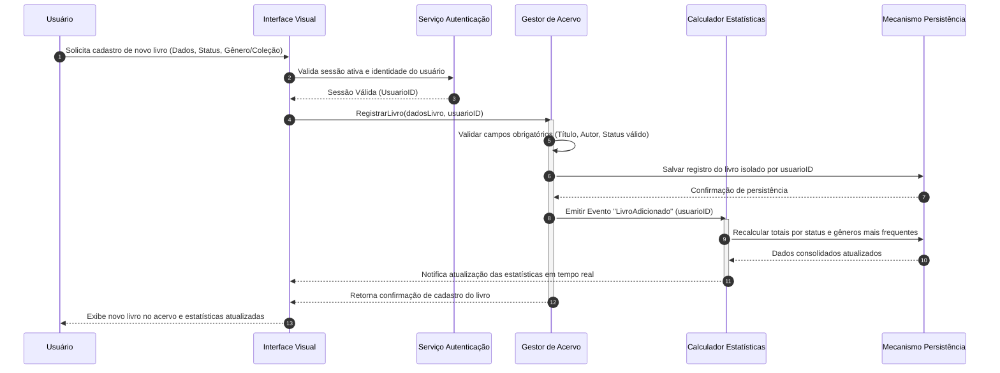
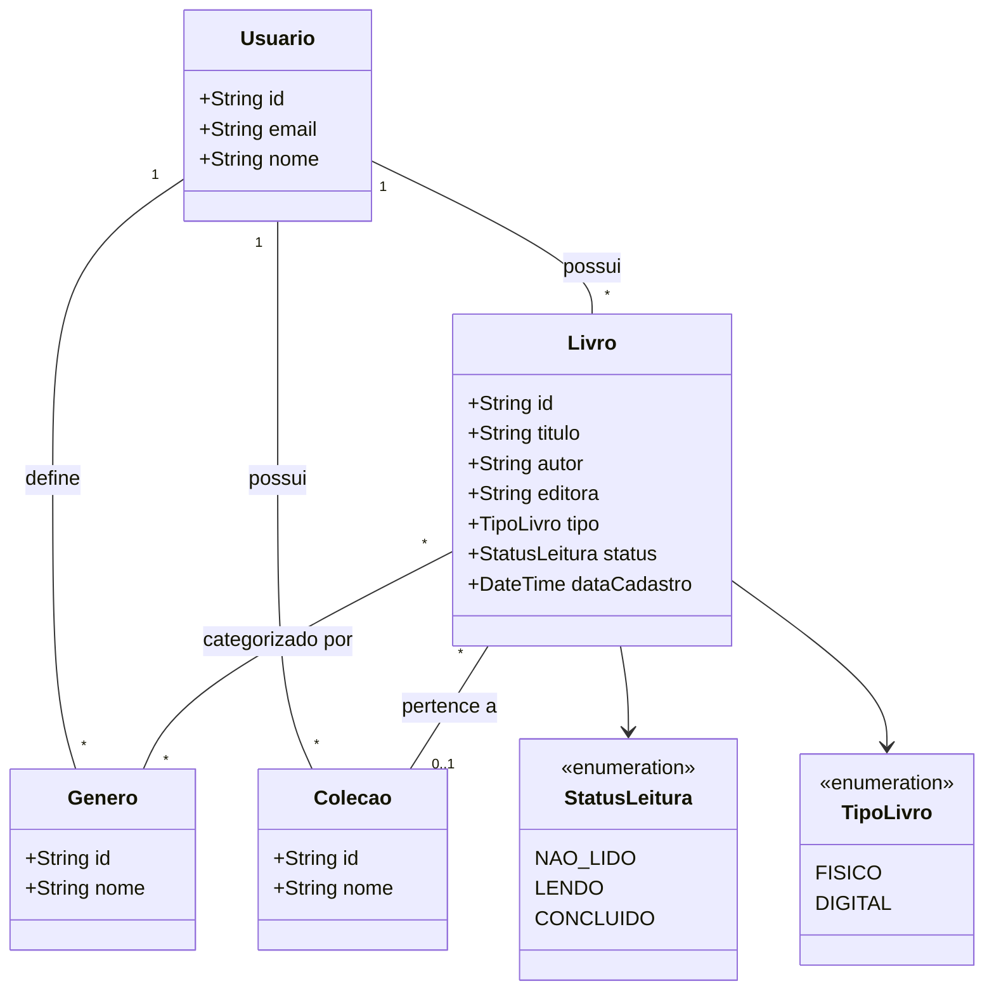

# Relatório Técnico de Arquitetura de Software

## 1. Identificação das HUs

A tabela abaixo mapeia a rastreabilidade entre as Histórias de Usuário (HUs), os Requisitos Funcionais (RFs) e os Requisitos Não Funcionais (RNFs) associados.

| ID HU | Título | Ator | Descrição Resumida | RFs Cobertos | RNFs Cobertos |
| :--- | :--- | :--- | :--- | :--- | :--- |
| **HU01** | Cadastrar livro | Usuário | Permite o cadastro de um livro com atributos obrigatórios (título, autor), tipo (físico/digital) e status de leitura. | RF01, RF04, RF13 | RNF01, RNF04 |
| **HU02** | Atualizar status de leitura | Usuário | Permite atualizar o estado de leitura (não lido, lendo, concluído) com reflexo imediato no acervo. | RF04, RF05 | RNF04, RNF05 |
| **HU03** | Organizar livros por gênero | Usuário | Permite gerenciar gêneros literários (CRUD) e associar N gêneros a um livro. | RF06, RF08 | RNF04 |
| **HU04** | Organizar livros por coleção | Usuário | Permite gerenciar coleções (CRUD) e associar um livro a no máximo uma coleção. | RF07, RF08 | RNF04 |
| **HU05** | Filtrar o acervo | Usuário | Permite a aplicação de múltiplos filtros simultâneos e limpeza de filtros. | RF09 | RNF02, RNF03, RNF06 |
| **HU06** | Pesquisar livros por título ou autor | Usuário | Permite busca textual dinâmica por correspondência parcial de título ou autor. | RF12 | RNF02, RNF03, RNF06 |
| **HU07** | Visualizar resumo do acervo | Usuário | Exibe o total de livros por status e os gêneros mais frequentes com atualização em tempo real. | RF10, RF11 | RNF05 |
| **HU08** | Exportar o acervo | Usuário | Permite o download de todo o acervo do usuário em arquivo estruturado (CSV ou JSON). | N/A | RNF07 |
| **N/A** | Remoção e edição de livros | Usuário | Manutenção direta dos dados dos livros existentes. | RF02, RF03 | RNF04, RNF05 |

---

## 2. Diagramas de Arquitetura (Mermaid)

### 2.1 Diagrama de Componentes (Visão de Visão Geral)

---

### 2.2 Diagrama de Sequência: Cadastrar Livro e Atualizar Estatísticas em Tempo Real (HU01, HU07)

---

### 2.3 Diagrama de Classes Conceptual

---

## 3. Decisões de Arquitetura

1. **Isolamento Multitenant Lógico por Usuário (RNF01)**
   * **Decisão:** Toda e qualquer consulta, alteração ou deleção no acervo exige a injeção implícita da identidade do usuário autenticado no contexto da execução.
   * **Justificativa:** Garante a segurança e a privacidade total dos acervos pessoais sem permitir vazamento inter-usuários.

2. **Padrão de Disparo de Eventos para Atualização de Estatísticas (RNF05)**
   * **Decisão:** A alteração do estado de qualquer livro (cadastro, edição, remoção ou mudança de status) dispara assincronamente a atualização dos agregados de estatísticas.
   * **Justificativa:** Garante que o painel estatístico esteja sempre em tempo real para o usuário sem congelar a interface de cadastro.

3. **Estratégia de Desvinculação em Cascata Suave (HU03, HU04)**
   * **Decisão:** A deleção de entidades agregadoras (Gêneros e Coleções) remove apenas o vínculo (chave estrangeira/referência) nas entidades `Livro`, mantendo a integridade e existência dos livros.
   * **Justificativa:** Atende estritamente aos critérios de aceite que impedem a perda de livros ao excluir categorias ou coleções.

4. **Desacoplamento de Formatos de Exportação via Estratégia de Formatação (HU08, RNF07)**
   * **Decisão:** O módulo de exportação emprega o padrão de projeto *Strategy*, onde a geração estruturada dos dados (CSV ou JSON) é independente do mecanismo de extração.
   * **Justificativa:** Facilita a inclusão futura de novos formatos de arquivo sem alterar o fluxo principal de dados.

5. **Filtragem e Busca In-Memory com Resposta de Baixa Latência (RNF03, HU05, HU06)**
   * **Decisão:** Consultas dinâmicas aplicam indexação prévia e filtros combináveis no motor de pesquisa da aplicação para garantir tempos de resposta inferiores a 2 segundos.

---

## 4. Tabela de Componentes e Rastreabilidade

| Componente | Responsabilidade Principal | Comunica-se com | Origem (HU / Critério de Aceite) |
| :--- | :--- | :--- | :--- |
| **Interface de Usuário Responsiva** | Prover navegação intuitiva, formulários responsivos e renderização dinâmica em tempo real para web/mobile. | Servidor de Autenticação, Gestor de Acervo, Gestor de Categorização, Processador de Exportação | RNF02, RNF06, HU01 a HU08 |
| **Serviço de Autenticação e Controle de Acesso** | Autenticar o usuário e garantir o contexto de isolamento de dados por conta. | Camada de Persistência | RNF01 |
| **Gestor de Acervo e Livros** | Executar operações de criação, leitura, atualização e remoção de livros (CRUD) e seus atributos. | Camada de Persistência, Calculador de Estatísticas | RF01, RF02, RF03, RF04, RF05, RF13, HU01, HU02 |
| **Gestor de Gêneros e Coleções** | Gerenciar o ciclo de vida de gêneros e coleções e tratar desvinculações. | Camada de Persistência, Gestor de Acervo | RF06, RF07, RF08, HU03, HU04 |
| **Módulo de Filtragem e Busca** | Realizar buscas dinâmicas parciais por texto e aplicação de múltiplos filtros simultâneos. | Camada de Persistência | RF09, RF12, RNF03, HU05, HU06 |
| **Calculador de Métricas e Estatísticas** | Computar totais por status de leitura e ranqueamento de gêneros mais frequentes em tempo real. | Camada de Persistência, Interface do Usuário | RF10, RF11, RNF05, HU07 |
| **Processador de Exportação** | Gerar arquivos para download contendo o acervo completo nos formatos CSV ou JSON. | Camada de Persistência, Interface do Usuário | RNF07, HU08 |
| **Camada de Persistência de Dados** | Prover o armazenamento seguro e duradouro das entidades do sistema isoladas por usuário. | Serviço de Autenticação, Gestor de Acervo, Gestor de Categorização, Calculador de Estatísticas | RNF04 |

---

## 5. Bloqueios e Pendências

1. **Tratamento de Livros Duplicados:** Não há definição nos requisitos sobre o comportamento do sistema ao tentar cadastrar dois livros idênticos (mesmo título e mesmo autor).
2. **Definição de Limite de Exibição nos "Gêneros Mais Frequentes":** O RF11 especifica a exibição dos gêneros mais frequentes, mas não limita a quantidade (ex: top 3, top 5 ou lista completa).
3. **Mapeamento de Campos de Exportação para Formato CSV:** Para relacionamentos de 1 N (um livro com múltiplos gêneros), não está especificado o caractere separador internamente à coluna do arquivo CSV.
4. **Política de Sessão e Expiratação:** Falta detalhamento sobre tempo de expiração de sessão e renovação de acesso para a RNF01.

---

## 6. Cobertura de Requisitos

A matriz abaixo comprova a totalização da cobertura de requisitos funcionais e não funcionais na solução proposta:

| Requisito | Coberto no Arquitetura? | Componente / Mecanismo Arquitetural Responsável |
| :--- | :---: | :--- |
| **RF01** | Sim | Gestor de Acervo e Livros |
| **RF02** | Sim | Gestor de Acervo e Livros |
| **RF03** | Sim | Gestor de Acervo e Livros |
| **RF04** | Sim | Enumeração `StatusLeitura` / Gestor de Acervo |
| **RF05** | Sim | Gestor de Acervo e Livros |
| **RF06** | Sim | Gestor de Gêneros e Coleções |
| **RF07** | Sim | Gestor de Gêneros e Coleções |
| **RF08** | Sim | Modelagem de Relacionamento (Livro-Gênero N:N, Livro-Coleção N:1) |
| **RF09** | Sim | Módulo de Filtragem e Busca |
| **RF10** | Sim | Calculador de Métricas e Estatísticas |
| **RF11** | Sim | Calculador de Métricas e Estatísticas |
| **RF12** | Sim | Módulo de Filtragem e Busca |
| **RF13** | Sim | Enumeração `TipoLivro` / Gestor de Acervo |
| **RNF01**| Sim | Serviço de Autenticação e Controle de Acesso |
| **RNF02**| Sim | Interface de Usuário Responsiva |
| **RNF03**| Sim | Módulo de Filtragem e Busca (Otimização de Consultas In-Memory) |
| **RNF04**| Sim | Camada de Persistência de Dados |
| **RNF05**| Sim | Notificação Event-Driven entre Gestor de Acervo e Calculador de Métricas |
| **RNF06**| Sim | Interface de Usuário Responsiva |
| **RNF07**| Sim | Processador de Exportação (Estratégia CSV/JSON) |

---

## 7. Gap Analysis

| Lacuna Identificada | Impacto Arquitetural | Ação Recomendada para o Time de Desenvolvimento |
| :--- | :--- | :--- |
| **Falta de paginação especificada na listagem geral do acervo** | Acervos com milhares de livros podem degradar a renderização da interface e violar o limite de 2 segundos (RNF03). | Implementar paginação ou rolagem infinita virtualizada (*virtual scrolling*) no frontend mantendo o tempo de consulta controlado. |
| **Ausência de mecanismo de busca fonética ou tolerância a falhas na digitação** | A busca por título/autor (RF12) pode falhar em pequenas divergências ortográficas (ex: acentuação). | Implementar normalização de texto (remoção de acentos e *case-insensitive*) na camada de busca. |
| **Formatação de múltiplos gêneros em exportação CSV** | Risco de quebra de formatação de colunas ao abrir em leitores de planilha convencionais. | Padronizar a junção dos gêneros com separador de lista delimitado por aspas (ex: `"Ficção Sci-Fi; Aventura"`). |
| **Comportamento off-line em dispositivos móveis** | Caso ocorra perda de conexão em dispositivos móveis (RNF02), o usuário pode perder cadastros não sincronizados. | Implementar uma camada temporária de cache/armazenamento local na interface para sincronização no reconectamento. |