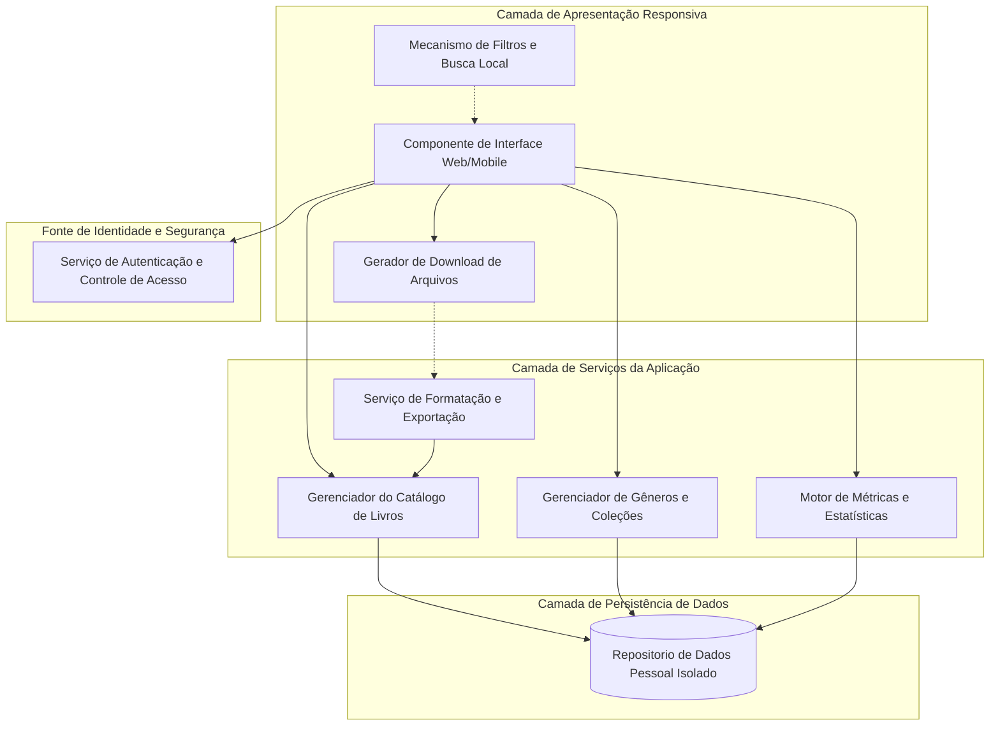
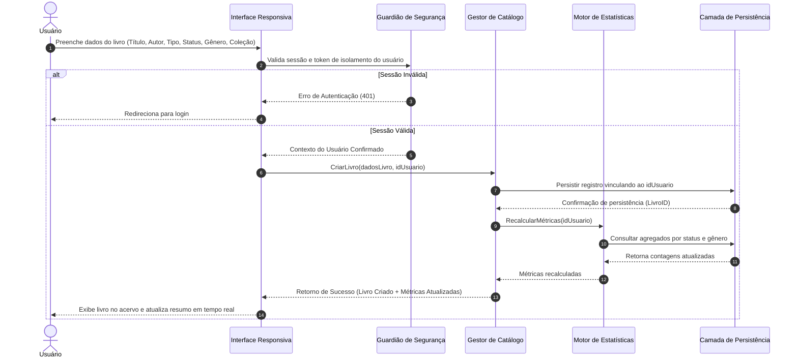
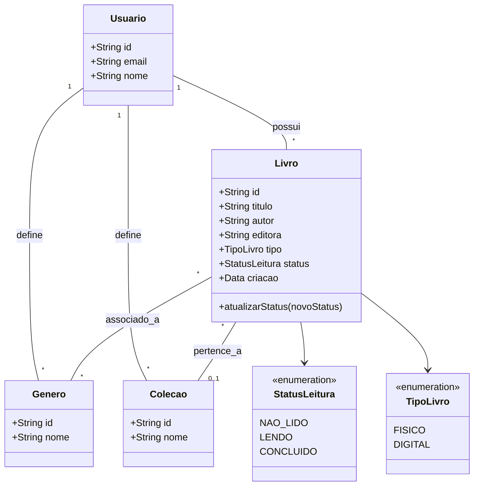

# Relatório Técnico de Arquitetura de Software

**Projeto:** Sistema de Catalogação de Livros — Biblioteca Pessoal (P04)  
**Autor:** Sistema Multi-Agente de Design de Software (AI4ES - Time 2)  
**Status:** Documento Canônico de Arquitetura  

---

## 1. Identificação das HUs

Nesta seção, as Histórias de Usuário (HU) são vinculadas diretamente aos seus Requisitos Funcionais (RF) e Não Funcionais (RNF) correspondentes, juntamente com a consolidação dos seus critérios de aceite.

| HU ID | Título | Perfil | Requisitos Vinculados | Resumo dos Critérios de Aceite |
| :--- | :--- | :--- | :--- | :--- |
| **HU01** | Cadastrar livro | Usuário | RF01, RF04, RF13, RNF01, RNF04 | Obrigatoriedade de Título e Autor; Seleção de tipo (Físico/Digital) e status (*Não lido*, *Lendo*, *Concluído*); Inclusão imediata no acervo. |
| **HU02** | Atualizar status de leitura | Usuário | RF04, RF05, RNF05 | Alteração contínua entre os status válidos; Atualização imediata dos dados e métricas do acervo. |
| **HU03** | Organizar livros por gênero | Usuário | RF06, RF08 | Gestão de gêneros (CRUD); Associação N:N (livro-gêneros); Desvinculação sem exclusão do livro ao remover gênero. |
| **HU04** | Organizar livros por coleção | Usuário | RF07, RF08 | Gestão de coleções (CRUD); Associação 1:N (coleção-livros); Desvinculação sem exclusão do livro ao remover coleção. |
| **HU05** | Filtrar o acervo | Usuário | RF09, RNF02, RNF03 | Combinação dinâmica de múltiplos filtros (Título, Autor, Editora, Status, Gênero, Coleção, Tipo); Opção de limpar filtros em clique único. |
| **HU06** | Pesquisar livros por título ou autor | Usuário | RF12, RNF03 | Busca por correspondência parcial (substring); Resposta dinâmica durante a digitação. |
| **HU07** | Visualizar resumo do acervo | Usuário | RF10, RF11, RNF05 | Exibição do total de livros por status e ranking de gêneros mais frequentes; Atualização reativa a mudanças no acervo. |
| **HU08** | Exportar o acervo | Usuário | RNF06, RNF07 | Exportação completa dos campos cadastrais; Suporte aos formatos CSV e JSON; Download direto via cliente/navegador. |

---

## 2. Diagramas de Arquitetura (Mermaid)

### 2.1. Diagrama de Visão Geral de Componentes (C4 - Nível de Componentes Conceituais)

Diagrama de alto nível ilustrando a separação de responsabilidades em camadas lógicas agnósticas a tecnologia.

### 2.2. Diagrama de Sequência: Cadastro de Livro e Atualização Reativa de Estatísticas

Diagrama detalhado do fluxo de cadastro com notificação de métricas e persistência isolada.

### 2.3. Diagrama de Modelo de Domínio Conceitual (Classes de Domínio)

---

## 3. Decisões de Arquitetura

1. **Isolamento Estrito por Tenant/Usuário (RNF01):**
   * *Decisão:* Toda entidade persistida (`Livro`, `Genero`, `Colecao`) obrigatoriamente conterá a chave de identificação do usuário proprietário (`idUsuario`). As consultas na camada de persistência devem aplicar o filtro de tenant automaticamente para impedir o vazamento de dados entre acervos pessoais.

2. **Modelo de Relacionamento Semântico e Desvinculação Segura (HU03, HU04):**
   * *Decisão:* 
     * Relação Livro-Gênero: N para N. A exclusão de um `Genero` remove apenas as associações na tabela de junção, mantendo as instâncias de `Livro` intactas.
     * Relação Livro-Coleção: 1 para N (um livro pertence a no máximo uma coleção). A exclusão de uma `Colecao` define o campo `colecao_id` no livro como Nulo (Soft-Unlink), evitando cascata de exclusão sobre livros.

3. **Arquitetura Event-Driven Local para Atualização de Estatísticas (RNF05, HU07):**
   * *Decisão:* Adotar o padrão de publicação/assinatura (ou propagação de eventos de estado) na camada de aplicação. Operações de mutação no acervo (Criação, Edição, Remoção, Atualização de Status) disparam eventos internos que forçam o recálculo do componente de estatísticas de maneira reativa.

4. **Filtragem e Pesquisa Híbrida em Memória/Servidor (RF09, RF12, RNF03):**
   * *Decisão:* Para volumes standard de acervo pessoal, a filtragem dinâmica à medida que o usuário digita (de-bounce no input) será executada na camada de visualização/cliente sobre o conjunto de dados em cache local, garantindo tempo de resposta sub-segundo (< 2s conforme RNF03). Para conjuntos expressivos, a consulta será delegada à camada de serviço com ordenação e paginação.

5. **Motor Agnostic de Exportação de Dados (RNF07, HU08):**
   * *Decisão:* Isolamento do módulo de serialização. A aplicação converterá a estrutura de dados interna do acervo em streams binários/textuais (MIME types: `text/csv` e `application/json`), disparando o download diretamente pela camada de interface web, sem a necessidade de armazenamento temporário no servidor.

---

## 4. Tabela de Componentes e Rastreabilidade

| Componente | Responsabilidade Principal | Comunica-se com | Origem (HU / Critério de Aceite) |
| :--- | :--- | :--- | :--- |
| **Componente de Interface Responsiva** | Apresentar interface responsiva em múltiplos dispositivos, capturar interações do usuário e renderizar estado do acervo. | Guardião de Segurança, Gestor de Catálogo, Gestor de Organização, Motor de Métricas, Gerador de Exportação | RNF02, RNF06, HU01 a HU08 |
| **Guardião de Segurança e Autenticação** | Garantir autenticação dos usuários e manter isolamento do acervo pessoal por ID de usuário. | Componente de Interface Responsiva, Camada de Persistência | RNF01, HU01 |
| **Gestor de Catálogo de Livros** | Processar regras de negócio CRUD de livros, diferenciação entre físico/digital e atualização de status. | Camada de Persistência, Motor de Métricas | RF01, RF02, RF03, RF04, RF05, RF13, HU01, HU02 |
| **Gestor de Organização (Gêneros/Coleções)** | Gerenciar ciclo de vida de gêneros e coleções e controlar regras de desvinculação sem perda de livros. | Camada de Persistência, Gestor de Catálogo | RF06, RF07, RF08, HU03, HU04 |
| **Mecanismo de Filtros e Busca** | Executar busca textual por correspondência parcial e aplicar múltiplos filtros combinados dynamicamente. | Componente de Interface Responsiva, Gestor de Catálogo | RF09, RF12, RNF03, HU05, HU06 |
| **Motor de Métricas e Estatísticas** | Calcular totais de livros por status e compilar ranking de gêneros mais frequentes em tempo real. | Gestor de Catálogo, Camada de Persistência | RF10, RF11, RNF05, HU07 |
| **Serviço de Formatação e Exportação** | Transformar a estrutura do acervo nos formatos CSV e JSON para disponibilização de backup. | Gestor de Catálogo, Gerador de Download de Arquivos | RNF07, HU08 |
| **Camada de Persistência de Dados** | Garantir persistência confiável dos dados em banco de dados e aplicar integridade referencial. | Gestor de Catálogo, Gestor de Organização, Motor de Métricas | RNF04 |

---

## 5. Bloqueios e Pendências

1. **Estratégia de Autenticação e Recuperação de Acesso:**
   * *Pendência:* O RNF01 especifica acesso protegido por autenticação, porém não foram fornecidos requisitos detalhados sobre auto-cadastro de usuário, recuperação de senha, nem uso de provedores de identidade externos.
   * *Impacto:* Risco de omissão de telas e fluxos de suporte de conta na camada de apresentação.

2. **Limites de Tamanho e Paginação do Acervo:**
   * *Pendência:* O RNF03 exige tempo de resposta <= 2s independentemente do volume. Não há definição de limite máximo de livros por acervo pessoal nem diretriz explicita sobre paginação gráfica.
   * *Impacto:* Potencial degradação de desempenho no cliente caso um usuário possua dezenas de milhares de livros e a renderização tente carregar todo o acervo sem paginação.

3. **Mecanismo de Importação de Backup (Simetria do RNF07):**
   * *Pendência:* Existe requisito para exportação (RNF07 / HU08), porém não há requisito funcional definindo a **importação** do arquivo exportado para restauração de backup.
   * *Impacto:* Impossibilidade do usuário restaurar um backup pessoal no sistema caso perca sua conta ou deseje migrar dados.

4. **Tratamento de Gêneros/Coleções Duplicadas:**
   * *Pendência:* Não há especificação sobre restrição de unicidade por nome para gêneros e coleções por usuário (ex: evitar a criação de dois gêneros "Ficção Científica").
   * *Impacto:* Inconsistências nas estatísticas e na experiência de filtragem do usuário.

---

## 6. Cobertura de Requisitos

| Requisito | Tipo | Coberto pela HU | Componente Arquitetural Responsável | Status da Cobertura |
| :--- | :--- | :--- | :--- | :--- |
| **RF01** | Funcional | HU01 | Gestor de Catálogo de Livros | Coberto |
| **RF02** | Funcional | HU01, HU02 | Gestor de Catálogo de Livros | Coberto |
| **RF03** | Funcional | N/A (Mapeado na Tabela) | Gestor de Catálogo de Livros | Coberto |
| **RF04** | Funcional | HU01, HU02 | Gestor de Catálogo de Livros | Coberto |
| **RF05** | Funcional | HU02 | Gestor de Catálogo de Livros | Coberto |
| **RF06** | Funcional | HU03 | Gestor de Organização | Coberto |
| **RF07** | Funcional | HU04 | Gestor de Organização | Coberto |
| **RF08** | Funcional | HU03, HU04 | Gestor de Organização / Gestor de Catálogo | Coberto |
| **RF09** | Funcional | HU05 | Mecanismo de Filtros e Busca | Coberto |
| **RF10** | Funcional | HU07 | Motor de Métricas e Estatísticas | Coberto |
| **RF11** | Funcional | HU07 | Motor de Métricas e Estatísticas | Coberto |
| **RF12** | Funcional | HU06 | Mecanismo de Filtros e Busca | Coberto |
| **RF13** | Funcional | HU01 | Gestor de Catálogo de Livros | Coberto |
| **RNF01** | Não Funcional | HU01 (Contexto) | Guardião de Segurança e Autenticação | Coberto |
| **RNF02** | Não Funcional | Todas | Componente de Interface Responsiva | Coberto |
| **RNF03** | Não Funcional | HU05, HU06 | Mecanismo de Filtros e Busca | Coberto |
| **RNF04** | Não Funcional | HU01 a HU04 | Camada de Persistência de Dados | Coberto |
| **RNF05** | Não Funcional | HU02, HU07 | Motor de Métricas e Estatísticas | Coberto |
| **RNF06** | Não Funcional | HU08 | Componente de Interface Responsiva | Coberto |
| **RNF07** | Não Funcional | HU08 | Serviço de Formatação e Exportação | Coberto |

---

## 7. Gap Analysis

| Lacuna Identificada | Requisito Origem | Impacto Arquitetural | Ação Recomendada |
| :--- | :--- | :--- | :--- |
| **Ausência de Requisito de Importação de Dados** | RNF07 / HU08 | A exportação gera um backup que o sistema atualmente não é capaz de reingestar. | Propor a criação da **HU09 - Importar Acervo**, permitindo parsing e validação de arquivos CSV/JSON. |
| **Falta de Especificação de Paginação / Carregamento Parcial** | RNF03 / RF09 | O carregamento completo do acervo via rede em acervos grandes viola a meta de performance (< 2s). | Implementar paginação no nível da API/Serviço e *virtual scrolling* no cliente web. |
| **Ausência de Validação de Unicidade em Categorias** | RF06, RF07 | Risco de duplicação de nomes de gêneros/coleções, poluindo a visualização e estatísticas. | Adicionar regra de domínio para validar unicidade de `nome` (case-insensitive) por `idUsuario`. |
| **Falta de Definição de Fluxos de Conta de Usuário** | RNF01 | Falha em especificar como novos usuários se cadastram ou autenticam na aplicação. | Definir contratos de interface para fluxo de Autenticação (Login, Registro, Recuperação de Credenciais). |
| **Comportamento da Exportação referente a Arquivos Gigantes** | RNF07, HU08 | Bloqueio do fluxo principal caso o processamento de geração de CSV/JSON ocorra na thread principal do cliente. | Utilizar processamento em segundo plano ou streaming de dados na geração dos arquivos exportados. |