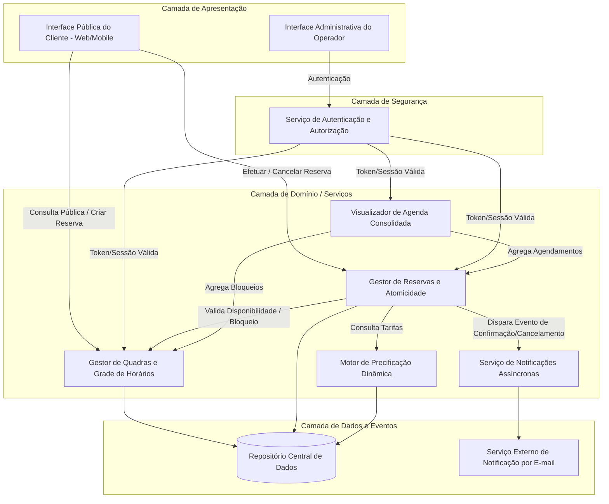
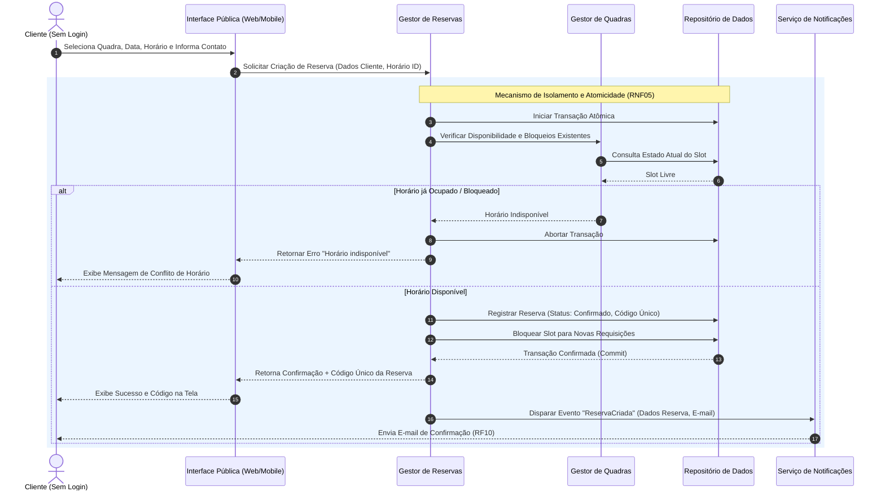

# Relatório Técnico de Arquitetura de Software

## 1. Identificação das HUs

A tabela abaixo correlaciona as Histórias de Usuário (HUs) com seus respectivos Requisitos Funcionais (RF), Requisitos Não Funcionais (RNF), Perfis de Acesso (Personas) e Nível de Prioridade Arquitetural.

| HU ID | Descrição Sucinta | Perfil / Persona | RFs Relacionados | RNFs Relacionados | Prioridade |
|-------|-------------------|------------------|------------------|-------------------|------------|
| **HU01** | Cadastrar e disponibilizar quadras com atributos (tipo, horário, valor) | Operador | RF01, RF02 | RNF03, RNF07 | Alta |
| **HU02** | Bloquear horários para manutenção/feriados | Operador | RF03 | RNF03, RNF05 | Média |
| **HU03** | Visualizar agenda consolidada diária de todas as quadras | Operador | RF11 | RNF01, RNF03, RNF06 | Média |
| **HU04** | Cancelar reserva informando justificativa obrigatória | Operador | RF09 | RNF03, RNF05 | Média |
| **HU05** | Consultar horários disponíveis por data e quadra sem autenticação | Cliente | RF04 | RNF01, RNF02, RNF06 | Alta |
| **HU06** | Realizar reserva informando contato e gerando código único | Cliente | RF05, RF06, RF07, RF10 | RNF01, RNF02, RNF05 | Crítica |
| **HU07** | Cancelar reserva própria via código de confirmação | Cliente | RF08 | RNF01, RNF05 | Média |
| **N/A** | Configuração de faixas de preço (Horário Nobre) *(Requisito de Sistema)* | Operador | RF12 | RNF03, RNF07 | Média |

---

## 2. Diagramas de Arquitetura (Mermaid)

### 2.1. Diagrama de Visão Geral de Componentes (Component Diagram)

O diagrama de componentes ilustra a separação conceitual das camadas, a exposição pública para clientes sem necessidade de login e o canal restrito e autenticado para operadores.



### 2.2. Diagrama de Sequência: Realização de Reserva com Garantia de Atomicidade (HU06 / RNF05)

O diagrama a seguir detalha a interação para garantir a prevenção de duplo agendamento simultâneo (race conditions).



---

## 3. Decisões de Arquitetura

### ADR-01: Desacoplamento do Acesso Público e Gestão Administrativa
* **Contexto:** Os clientes devem consultar disponibilidades e realizar reservas sem a necessidade de criação de conta ou autenticação (RF04, HU05), enquanto os operadores necessitam de acesso estritamente autenticado para gerenciar a estrutura (RF01-RF03, RF09, RNF03).
* **Decisão:** Adotar uma arquitetura de rotas e componentes onde as rotas de consulta/reserva do cliente utilizam endpoints públicos com limitação de taxa (rate-limiting), enquanto as ações do operador trafegam por um gateway que exige token/sessão de autenticação prévia.
* **Consequências:** Maximiza a usabilidade para o cliente final (reduz fricção), mantendo a segurança da camada administrativa.

### ADR-02: Garantia de Atomicidade na Reserva de Horários (Prevenção de Race Condition)
* **Contexto:** Múltiplos clientes podem tentar reservar a mesma quadra no mesmo horário simultaneamente (RNF05, RF07).
* **Decisão:** A validação e o registro da reserva devem ser processados dentro de um contexto transacional isolado (nível de isolamento estrito ou mecanismo de trava de concorrência no nível do banco/entidade de slot). Caso ocorram requisições simultâneas para o mesmo slot, apenas a primeira transação será concluída e as demais serão rejeitadas explicitamente.
* **Consequências:** Elimina a possibilidade de duplicidade de agendamento (duplo agendamento), garantindo a confiabilidade exigida pelo RNF05.

### ADR-03: Processamento Assíncrono de Notificações
* **Contexto:** O envio de e-mails de confirmação (RF10) e cancelamento (HU04) depende de serviços externos de e-mail e não deve bloquear o tempo de resposta da transação do usuário (RNF02 - limite de 2 segundos).
* **Decisão:** Separar a criação da reserva da emissão do e-mail. A confirmação da reserva responde imediatamente ao cliente gerando o código único na tela, enquanto uma mensagem/evento é postado internamente para o Serviço de Notificações emitir o e-mail em segundo plano.
* **Consequências:** Melhora expressiva no tempo de resposta percebido pelo cliente e resiliência a falhas temporárias nos provedores externos de e-mail.

### ADR-04: Modularidade do Motor de Precificação e Tipos de Quadra
* **Contexto:** O sistema deve suportar diferentes modalidades esportivas (RNF07) e diferentes faixas de tarifação por horário (RF12 - ex.: horário nobre).
* **Decisão:** O cálculo do valor da reserva será delegado a um componente especialista (`Motor de Precificação`), que recebe a quadra, a data e a hora, aplicando regras dinâmicas parametrizáveis sem impactar a estrutura das entidades de agendamento.
* **Consequências:** Alta manutenibilidade e facilidade para inclusão de novos tipos de quadras, regras de feriados ou reajustes sazonais de tarifas.

---

## 4. Tabela de Componentes e Rastreabilidade

| Componente | Responsabilidade Principal | Comunica-se com | Origem (HU / Critério de Aceite) |
|------------|----------------------------|-----------------|----------------------------------|
| **Interface Pública do Cliente** | Apresentar catálogo de quadras, grade de horários disponíveis e formulário de reserva/cancelamento sem exigir login. | Gestor de Quadras, Gestor de Reservas | HU05, HU06, HU07 / RF04, RF05, RF08 |
| **Interface Administrativa do Operador** | Permitir o cadastro de quadras, bloqueio de horários, cancelamento com justificativa e visualização da agenda consolidada. | Serviço de Autenticação, Gestor de Quadras, Gestor de Reservas, Visualizador de Agenda | HU01, HU02, HU03, HU04 / RF01, RF02, RF03, RF09, RF11, RF12 |
| **Serviço de Autenticação e Autorização** | Validar a identidade dos operadores e gerenciar permissões de acesso às funcionalidades restritas. | Interface Administrativa, Repositório de Dados | RNF03 |
| **Gestor de Quadras e Grade** | Manter o cadastro de quadras, controlar os horários de funcionamento e gerenciar os bloqueios administrativos (manutenção/feriados). | Repositório de Dados, Gestor de Reservas | HU01, HU02 / RF01, RF02, RF03, RNF07 |
| **Gestor de Reservas e Atomicidade** | Processar criação e cancelamento de reservas, gerar o código único de confirmação e garantir a exclusividade do horário reservado. | Gestor de Quadras, Motor de Precificação, Servicio de Notificações, Repositório de Dados | HU04, HU06, HU07 / RF05, RF06, RF07, RF08, RF09, RNF05 |
| **Motor de Precificação Dinâmica** | Calcular o valor aplicável a cada reserva com base em tabela base, horários nobres e exceções configuradas. | Gestor de Reservas, Repositório de Dados | RF12, HU01 (Critérios) |
| **Visualizador de Agenda Consolidada** | Consolidar e formatar a visão diária inter-quadras de horários ocupados, livres e bloqueados para a gestão do operador. | Gestor de Reservas, Gestor de Quadras, Repositório de Dados | HU03 / RF11 |
| **Serviço de Notificações Assíncronas** | Disparar e-mails de confirmação e cancelamento contendo dados da reserva e código de validação. | Serviço Externo de E-mail | HU04, HU06 / RF10 |
| **Repositório Central de Dados** | Armazenar o estado persistente de quadras, bloqueios, reservas, usuários operadores e regras de tarifação. | Todos os componentes da camada de negócio | RNF04, RNF05 |

---

## 5. Bloqueios e Pendências

1. **Ausência de Fluxo de Pagamento Integrado:**
   * *Pendência:* O requisito define o registro do valor da hora (RF01/RF12), mas não especifica se a confirmação da reserva depende de pagamento online prévio (ex.: cartão, PIX) ou se o pagamento ocorre presencialmente na quadra.
   * *Impacto:* Risco de "no-show" (cliente reserva e não comparece), travando a quadra sem cobrança.

2. **Políticas de Tempo de Antecedência para Reservas e Cancelamentos:**
   * *Pendência:* Não há regra explicitando até quantos minutos/horas antes do horário a reserva ou o cancelamento pelo cliente pode ser realizado (HU07 / RF08).
   * *Impacto:* Risco de cancelamentos a poucos minutos do horário, impossibilitando a reocupação da quadra.

3. **Tempo de Retenção Temporária do Slot (Hold Time):**
   * *Pendência:* Ao selecionar um horário, a interface segura o slot enquanto o cliente digita seus dados (nome, e-mail, telefone)?
   * *Impacto:* Se duas pessoas abrirem o formulário ao mesmo tempo, uma delas receberá erro no momento de clicar em "confirmar". Requer definição da experiência do usuário (UX).

4. **Recuperação de Código de Confirmação:**
   * *Pendência:* Caso o cliente perca o e-mail ou o código único de confirmação, não há especificação de um fluxo de recuperação pública por e-mail/telefone (HU07).
   * *Impacto:* Aumento de demanda manual sobre o operador para consultar ou cancelar reservas.

---

## 6. Cobertura de Requisitos

A matriz abaixo atesta a cobertura completa de todos os Requisitos Funcionais (RF) e Não Funcionais (RNF) pela arquitetura proposta.

| Requisito | Tipo | História de Usuário Mapeada | Componente Arquitetural Responsável | Atendido? |
|-----------|------|-----------------------------|-------------------------------------|-----------|
| **RF01** | Funcional | HU01 | Gestor de Quadras e Grade | Sim |
| **RF02** | Funcional | HU01 | Gestor de Quadras e Grade | Sim |
| **RF03** | Funcional | HU02 | Gestor de Quadras e Grade | Sim |
| **RF04** | Funcional | HU05 | Interface Pública / Gestor de Quadras | Sim |
| **RF05** | Funcional | HU06 | Gestor de Reservas e Atomicidade | Sim |
| **RF06** | Funcional | HU06 | Gestor de Reservas e Atomicidade | Sim |
| **RF07** | Funcional | HU06 | Gestor de Reservas e Atomicidade | Sim |
| **RF08** | Funcional | HU07 | Gestor de Reservas e Atomicidade | Sim |
| **RF09** | Funcional | HU04 | Gestor de Reservas / Interf. Adm. | Sim |
| **RF10** | Funcional | HU06 | Serviço de Notificações Assíncronas | Sim |
| **RF11** | Funcional | HU03 | Visualizador de Agenda Consolidada | Sim |
| **RF12** | Funcional | N/A (Admin) | Motor de Precificação Dinâmica | Sim |
| **RNF01** | Não Funcional | HU03, HU05, HU06, HU07 | Interface Pública / Interface Adm. | Sim |
| **RNF02** | Não Funcional | HU05, HU06 | Gestor de Quadras (Otimização de Leitura) | Sim |
| **RNF03** | Não Funcional | HU01, HU02, HU03, HU04 | Serviço de Autenticação e Autorização | Sim |
| **RNF04** | Não Funcional | Todas | Infraestrutura / Repositório de Dados | Sim |
| **RNF05** | Não Funcional | HU02, HU04, HU06, HU07 | Gestor de Reservas (Mecanismo Transacional) | Sim |
| **RNF06** | Não Funcional | HU03, HU05 | Camada de Apresentação (Web Standard) | Sim |
| **RNF07** | Não Funcional | HU01, N/A | Desenho Modular (Serviços e Precificação) | Sim |

---

## 7. Gap Analysis

A análise a seguir detalha as lacunas identificadas entre a especificação de requisitos original e os cenários reais de operação do sistema, indicando o impacto técnico e as ações recomendadas.

```
+---------------------------------------------------------------------------------------------------+
|                                        MATRIZ DE GAP ANALYSIS                                     |
+------------------------------------+--------------------------------+-----------------------------+
| Lacuna / Especificação Faltante    | Impacto Arquitetural / Operação | Ação Recomendada para o Time|
+------------------------------------+--------------------------------+-----------------------------+
| 1. Falta de Confirmação/Validação  | Risco de cadastros maliciosos  | Implementar validação básica|
|    de E-mail e Telefone do Cliente | (spam) reservando quadras com  | de sintaxe e considerar     |
|    (RF05).                         | e-mails inexistentes.          | envio de OTP/token via SMS/ |
|                                    |                                | e-mail para confirmação.    |
+------------------------------------+--------------------------------+-----------------------------+
| 2. Ausência de Mecanismo de Pagam. | Insegurança financeira para o  | Definir se haverá integração|
|    ou Sinal/Garantia financeiro    | estabelecimento; taxa elevada  | com Gateway de Pagamento    |
|    (RF05/RF06).                    | de absenteísmo (no-show).      | ou se o modelo é 100% pay-  |
|                                    |                                | on-arrival.                 |
+------------------------------------+--------------------------------+-----------------------------+
| 3. Inexistência de Regra de Tempo  | Clientes cancelando minutos    | Criar parametrizador de     |
|    Limite para Cancelamento sem    | antes do horário, inviabiliz.  | política de cancelamento    |
|    Penalidade (RF08).              | a ocupação da quadra.          | (ex.: cancelamento grátis   |
|                                    |                                | até 2h antes).              |
+------------------------------------+--------------------------------+-----------------------------+
| 4. Falta de Paginação/Filtros na   | Degradação de desempenho ao    | Implementar paginação e     |
|    Agenda Consolidada para grandes | carregar dezenas de quadras em | filtros por tipo de quadra e|
|    períodos (RF11 / RNF02).        | telas pequenas (mobile/tab).   | intervalo de horas na UI.   |
+------------------------------------+--------------------------------+-----------------------------+
| 5. Ausência de Tratamento para     | Notificações falhas podem criar| Adicionar fila de retentativa|
|    Falha na Entrega de E-mails     | incerteza no cliente sobre a   | (retry mechanism) e log de  |
|    (RF10 / RNF04).                 | confirmação do código.         | status de envio.            |
+------------------------------------+--------------------------------+-----------------------------+
```