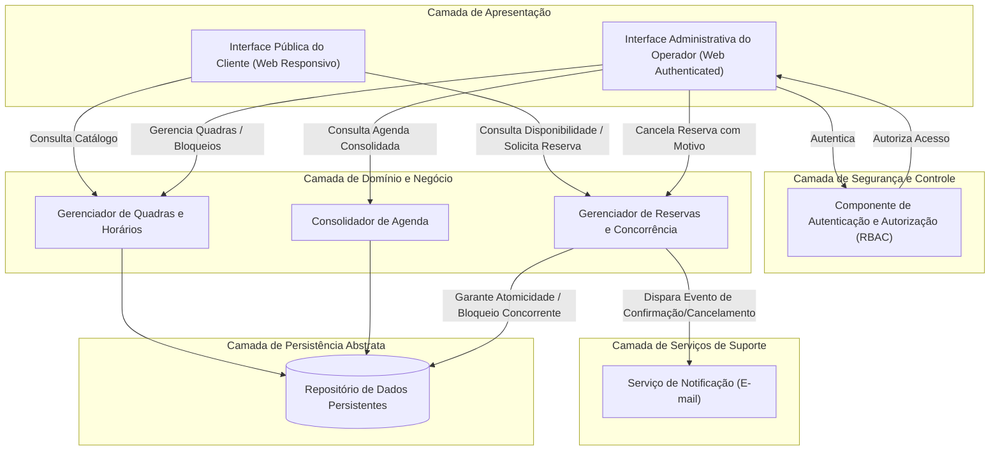

# Relatório Técnico de Arquitetura de Software

## 1. Identificação das HUs

A tabela abaixo resume o mapeamento de Histórias de Usuário (HUs), atores associados, Requisitos Funcionais (RFs) correlacionados e Critérios de Aceite observados.

| Código HU | Ator | Descrição Resumida | RFs Relacionados | Critérios de Aceite Mapeados |
|---|---|---|---|---|
| **HU01** | Operador | Cadastrar quadra com tipo, horário e tarifa base | RF01, RF12 | Campos obrigatórios (nome, tipo, valor da hora); Disponibilização imediata para consulta. |
| **HU02** | Operador | Bloquear horários de quadra para manutenção/feriados | RF03 | Horários bloqueados ficam indisponíveis para clientes; Remoção de bloqueio permitida. |
| **HU03** | Operador | Visualizar agenda diária consolidada | RF11 | Exibição global de quadras e horários; Navegação fluida entre datas. |
| **HU04** | Operador | Cancelar reserva informando motivo | RF09, RF10 | Obrigatoriedade do motivo de cancelamento; Envio de e-mail informativo ao cliente. |
| **HU05** | Cliente | Consultar disponibilidade de horários sem autenticação | RF04 | Acesso direto sem login; Indicação clara de horários ocupados/disponíveis. |
| **HU06** | Cliente | Realizar reserva mediante formulário e obter código | RF05, RF06, RF07, RF10 | Validação de disponibilidade no momento do aceite; Geração de código único; Envio de e-mail. |
| **HU07** | Cliente | Cancelar a própria reserva através do código de confirmação | RF08 | Exigência de código válido; Liberação imediata do horário na agenda pública. |

---

## 2. Diagramas de Arquitetura (Mermaid)

### 2.1. Arquitetura de Componentes Lógicos (Visão de Blocos)



---

### 2.2. Diagrama de Sequência: Realização de Reserva com Garantia de Atomicidade (HU06 / RNF05)

```mermaid
sequenceDiagram
    autonumber
    actor Cliente
    participant UI as Interface Pública (Cliente)
    participant ResSvc as Serviço de Reservas
    participant LockSvc as Controlador de Concorrência
    participant DB as Repositório de Dados
    participant NotifSvc as Serviço de Notificação

    Cliente->>UI: Solicita Reserva (Quadra, Data, Horário, Dados Contato)
    UI->>ResSvc: CriarReserva(dadosReserva)
    activate ResSvc
    
    ResSvc->>LockSvc: AdquirirTravaAtomica(QuadraID, Data, Horario)
    activate LockSvc
    alt Trava Obtida com Sucesso
        LockSvc-->>ResSvc: Sucesso (Lock concedido)
        
        ResSvc->>DB: ValidarDisponibilidade(QuadraID, Data, Horario)
        activate DB
        DB-->>ResSvc: Horário Livre
        deactivate DB

        ResSvc->>ResSvc: GerarCodigoConfirmacaoUnico()
        ResSvc->>DB: PersistirReserva(DadosReserva, Codigo, Status:Confirmada)
        activate DB
        DB-->>ResSvc: Reserva Gravada
        deactivate DB

        ResSvc->>LockSvc: LiberarTravaAtomica(QuadraID, Data, Horario)
        deactivate LockSvc

        ResSvc->>NotifSvc: EnviarEmailConfirmacao(ClienteEmail, DetalhesReserva)
        activate NotifSvc
        NotifSvc-->>ResSvc: Notificação Agendada/Enviada
        deactivate NotifSvc

        ResSvc-->>UI: Sucesso (Retorna Código de Confirmação)
        UI-->>Cliente: Exibe Mensagem e Código de Confirmação
    else Falha na Obtenção de Trava (Concorrência Detectada)
        LockSvc-->>ResSvc: Erro (Concorrência / Em Processamento)
        deactivate LockSvc
        ResSvc-->>UI: Erro (Horário sendo reservado por outro cliente)
        UI-->>Cliente: Exibe Alerta "Horário Indisponível"
    end
    deactivate ResSvc
```

---

## 3. Decisões de Arquitetura

### ADR-01: Isolamento Modular e Descouplamento por Domínio (RNF07)
* **Contexto:** O sistema precisa permitir a inclusão de novas modalidades esportivas e regras operacionais sem alterar a estrutura básica do sistema.
* **Decisão:** Adotar uma arquitetura modular baseada em domínio, isolando os componentes de *Gestão de Quadras*, *Processamento de Reservas* e *Notificações*. 
* **Consequência:** Facilidade de expansão e baixa dependência funcional entre módulos.

### ADR-02: Garantia de Atomicidade na Reserva via Trava Exclusiva (RNF05, RF07)
* **Contexto:** Requisições simultâneas para a mesma quadra e faixa de horário podem levar ao duplo agendamento (*overbooking*).
* **Decisão:** Implementar um mecanismo transacional isolado (lock otimista/pessimista ou trava distribuída em nível de serviço) que garanta que a checagem e a escrita ocorram em uma única transação atômica.
* **Consequência:** Eliminação do risco de agendamentos duplicados sob concorrência intensa.

### ADR-03: Processamento Assíncrono de Notificações (RF10, HU04)
* **Contexto:** A confirmação de reserva e notificação por e-mail não deve impactar o tempo de resposta final para o cliente na interface pública (RNF02).
* **Decisão:** Desacoplar a geração da reserva do envio do e-mail. A confirmação é gravada e a notificação é disparada de forma assíncrona por um serviço dedicado de notificação.
* **Consequência:** A resposta à requisição do usuário é mantida abaixo do limite estipulado, garantindo alta performance de navegação.

### ADR-04: Acesso Público Leve e Transparente (RF04, RNF01, RNF03)
* **Contexto:** Clientes devem consultar a grade horária sem necessidade de autenticação prévia.
* **Decisão:** Prover endpoints de consulta públicos e otimizados apenas para leitura (read-only), enquanto todas as rotas operacionais/administrativas exigem autorização via RBAC (*Role-Based Access Control*).
* **Consequência:** Experiência fluida para o cliente final e estrita proteção dos dados administrativos do operador.

---

## 4. Tabela de Componentes e Rastreabilidade

| Componente | Responsabilidade Principal | Comunica-se com | Origem (HU / Critério de Aceite) |
|---|---|---|---|
| **Interface Pública do Cliente** | Apresentar disponibilidade de horários, capturar dados de reserva e permitir cancelamento manual por código. | `Gerenciador de Reservas e Concorrência`, `Gerenciador de Quadras e Horários` | HU05, HU06, HU07 / RF04, RF05, RF08, RNF01 |
| **Interface Administrativa do Operador** | Permitir cadastro/edição de quadras, bloqueio de horários, consulta da agenda diária consolidada e cancelamento justificável. | `Componente de Autenticação e Autorização`, `Gerenciador de Quadras e Horários`, `Consolidador de Agenda`, `Gerenciador de Reservas` | HU01, HU02, HU03, HU04 / RF01, RF02, RF03, RF09, RF11, RF12 |
| **Componente de Autenticação e Autorização** | Validar credenciais de acesso do operador e controlar permissões de acesso às funcionalidades administrativas. | `Interface Administrativa do Operador` | RNF03 |
| **Gerenciador de Quadras e Horários** | Manter o cadastro de quadras, tipos esportivos, faixas tarifárias (horário nobre) e registrar bloqueios operacionais (manutenção/feriados). | `Repositório de Dados Persistentes` | HU01, HU02 / RF01, RF02, RF03, RF12, RNF07 |
| **Gerenciador de Reservas e Concorrência** | Orquestrar a criação, cancelamento e validação de reservas com exclusão mútua (trava atômica) e geração de código único. | `Repositório de Dados Persistentes`, `Serviço de Notificação` | HU04, HU06, HU07 / RF05, RF06, RF07, RF08, RF09, RNF05 |
| **Consolidador de Agenda** | Montar a visão consolidada da grade diária contendo o status de todas as quadras registradas. | `Repositório de Dados Persistentes` | HU03 / RF11 |
| **Serviço de Notificação** | Processar e enviar confirmações e notificações de cancelamento por e-mail para os clientes. | Integradores Externos de E-mail | HU04, HU06 / RF10 |

---

## 5. Bloqueios e Pendências

1. **Definição das Regras de Formatação do Código de Confirmação:** O requisito (RF06) exige código único, porém não especifica o padrão (ex: alfanumérico de 6 dígitos, hash UUID, etc.) nem a tolerância para expiração do código.
2. **Política de Restrição Temporal para Cancelamento:** Não há especificação sobre o tempo limite mínimo que o cliente possui para cancelar uma reserva (ex: até 2 horas antes do horário reservado).
3. **Mecanismo de Definição de Faixas de Horário Nobre:** O RF12 menciona tarifas diferenciadas por horário, porém não especifica se a precificação varia dinamicamente por dia da semana ou se é um valor estático fixado manualmente.
4. **Política de Retenção de Dados Pessoais (LGPD/Privacidade):** A reserva coleta dados de contato do cliente (nome, e-mail, telefone) sem cadastro prévio. Falta definir a política de expurgo ou anonimização desses dados após a realização da atividade esportiva.

---

## 6. Cobertura de Requisitos

### 6.1. Requisitos Funcionais (RF)

| Requisito Funcional | Coberto pela HU | Componente Arquitetural Responsável | Situação |
|---|---|---|---|
| **RF01** | HU01 | Gerenciador de Quadras e Horários | Coberto |
| **RF02** | - | Gerenciador de Quadras e Horários | Coberto (Ação Administrativa direta) |
| **RF03** | HU02 | Gerenciador de Quadras e Horários | Coberto |
| **RF04** | HU05 | Interface Pública / Gerenciador de Quadras | Coberto |
| **RF05** | HU06 | Gerenciador de Reservas e Concorrência | Coberto |
| **RF06** | HU06 | Gerenciador de Reservas e Concorrência | Coberto |
| **RF07** | HU06 | Gerenciador de Reservas e Concorrência | Coberto |
| **RF08** | HU07 | Gerenciador de Reservas e Concorrência | Coberto |
| **RF09** | HU04 | Gerenciador de Reservas e Concorrência | Coberto |
| **RF10** | HU04, HU06 | Serviço de Notificação | Coberto |
| **RF11** | HU03 | Consolidador de Agenda | Coberto |
| **RF12** | HU01 | Gerenciador de Quadras e Horários | Coberto |

### 6.2. Requisitos Não Funcionais (RNF)

| Requisito Não Funcional | Estratégia Arquitetural / Decisão Mapeada | Situação |
|---|---|---|
| **RNF01 (Usabilidade)** | Design de interface pública responsivo sem barreira de login/cadastro prévio. | Coberto |
| **RNF02 (Desempenho)** | Consultas de leitura otimizadas e desacoplamento assíncrono do serviço de notificação. | Coberto |
| **RNF03 (Segurança)** | Implementação de controle de acesso (RBAC) e autenticação obrigatória na área do operador. | Coberto |
| **RNF04 (Disponibilidade)** | Arquitetura modular descentralizada, apta a ser implantada sob infraestrutura de alta disponibilidade. | Coberto |
| **RNF05 (Confiabilidade)** | ADR-02: Uso de travas atômicas e isolamento transacional na criação da reserva. | Coberto |
| **RNF06 (Compatibilidade)** | Construção da camada de apresentação seguindo padrões abertos para navegação web multiplataforma. | Coberto |
| **RNF07 (Manutenibilidade)** | ADR-01: Isolamento de responsabilidades por domínios funcionais modulares. | Coberto |

---

## 7. Gap Analysis

### 7.1. Lacunas de Especificação Identificadas

1. **Ausência de Integração de Pagamento ou Sinal:**
   * *Impacto Arquitetural:* O fluxo atual permite efetuar a reserva sem garantia financeira ou confirmação de presença (risco de *no-show* elevado).
   * *Ação Recomendada:* Avaliar a necessidade de incluir um componente integrador de gateway de pagamento para cobrança adiantada ou sinal de reserva.

2. **Falta de Tratamento para Falhas no Envio de E-mail:**
   * *Impacto Arquitetural:* Se o gateway externo de e-mail estiver indisponível, o cliente pode realizar a reserva (gravada no banco), mas não receber o código por e-mail.
   * *Ação Recomendada:* Estabelecer uma fila de reexecução (*retry queue*) e permitir o reenvio manual do código pelo operador ou pela própria tela de confirmação.

3. **Inexistência de Regra para Bloqueio Recorrente ou Automatizado:**
   * *Impacto Arquitetural:* O bloqueio de horários (HU02 / RF03) parece requerer inserção manual item a item.
   * *Ação Recomendada:* Expandir o componente de gestão de quadras para suportar bloqueios por período estendido ou recorrência semanal (ex: todas as segundas de manhã).

4. **Registro e Auditoria de Motivos de Cancelamento:**
   * *Impacto Arquitetural:* O motivo do cancelamento pelo operador (RF09) precisa de um modelo de auditoria de dados rastreável.
   * *Ação Recomendada:* Incluir uma tabela/registro de histórico de eventos de cancelamento atrelado ao usuário/operador logado que executou a ação.