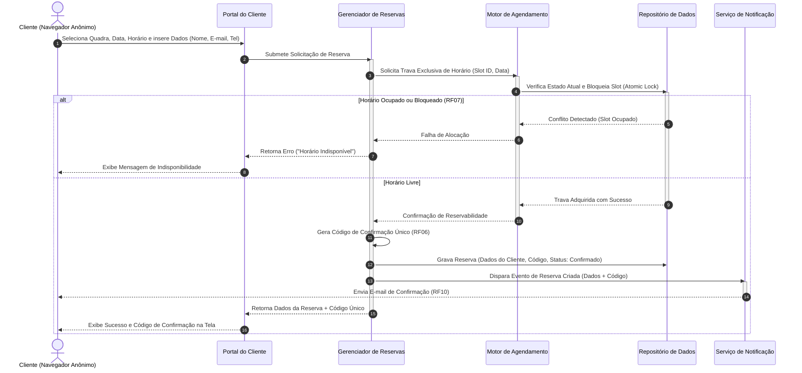

# Relatório Técnico de Arquitetura de Software

## 1. Identificação das HUs

A tabela abaixo sintetiza o mapeamento completo das Histórias de Usuário (HUs), relacionando os perfis de acesso, os Requisitos Funcionais (RF) e Não Funcionais (RNF) correspondentes, e a caracterização do escopo de negócio.

| HU ID | Perfil | Descrição Resumida | RFs Associados | RNFs Associados | Critérios / Regras de Negócio Relevantes |
|---|---|---|---|---|---|
| **HU01** | Operador | Cadastrar quadra com tipo, horário e valor/hora. | RF01, RF12 | RNF03, RNF07 | Campos obrigatórios: Nome, tipo, valor da hora. Atualização imediata na visibilidade do cliente. |
| **HU02** | Operador | Bloquear horários para manutenção/feriados. | RF03 | RNF03 | Horários bloqueados não podem figurar como disponíveis. Desbloqueio permitido a qualquer tempo. |
| **HU03** | Operador | Visualizar agenda consolidada diária de todas as quadras. | RF11 | RNF03 | Exibição em tela única de slots livres e ocupados; navegação temporal por datas. |
| **HU04** | Operador | Cancelar reserva informando justificativa. | RF09, RF10 | RNF03 | Motivo é obrigatório. Notificação automática via e-mail ao cliente. |
| **HU05** | Cliente | Consultar disponibilidade sem necessidade de login. | RF04 | RNF01, RNF02, RNF06 | Acesso anônimo/público; resposta de carga da agenda em até 2 segundos; visualização limpa de horários ocupados. |
| **HU06** | Cliente | Realizar reserva informando dados de contato. | RF05, RF06, RF07, RF10 | RNF01, RNF05, RNF06 | Validação de disponibilidade atômica no momento da confirmação; geração de código único; e-mail de confirmação. |
| **HU07** | Cliente | Cancelar reserva própria através do código de confirmação. | RF08 | RNF01, RNF06 | Validação estrita por código único; liberação imediata do slot na agenda. |

---

## 2. Diagramas de Arquitetura (Mermaid)

### 2.1. Visão de Componentes Visão Lógica (Nível de Contêineres / Módulos Conceituais)

```mermaid
graph TD
    subgraph Camada_de_Apresentacao ["Camada de Apresentação (Interface)"]
        UI_Client["Portal de Atendimento (Cliente) - Visão Pública"]
        UI_Admin["Painel Administrativo (Operador) - Área Protegida"]
    end

    subgraph Camada_de_Seguranca ["Camada de Controle de Acesso"]
        AUTH["Serviço de Autenticação e Autorização"]
    end

    subgraph Camada_de_Dominio ["Camada de Domínio e Serviços"]
        MOD_COURT["Módulo de Gestão de Quadras e Tarifas"]
        MOD_SCHED["Motor de Agendamento e Bloqueios"]
        MOD_BOOKING["Gerenciador de Reservas e Concorrência"]
        MOD_NOTIF["Serviço de Notificação de Eventos"]
    end

    subgraph Camada_de_Persistencia ["Camada de Persistência e Estado"]
        DATA_STORE[("Repositório de Dados do Sistema")]
    end

    %% Relações de comunicação
    UI_Client -->|Consulta Pública / Reserva (RF04, RF05, RF08)| MOD_SCHED
    UI_Client -->|Solicita Reserva| MOD_BOOKING
    
    UI_Admin -->|Autenticação (RNF03)| AUTH
    UI_Admin -->|Gestão de Quadras (RF01, RF02, RF12)| MOD_COURT
    UI_Admin -->|Bloqueio de Horários (RF03)| MOD_SCHED
    UI_Admin -->|Visão Agenda / Cancelamento (RF09, RF11)| MOD_BOOKING

    MOD_COURT --> DATA_STORE
    MOD_SCHED --> DATA_STORE
    MOD_BOOKING -->|Trava Atômica / Reserva (RNF05)| MOD_SCHED
    MOD_BOOKING --> DATA_STORE
    MOD_BOOKING -->|Dispara E-mail (RF10)| MOD_NOTIF
```

---

### 2.2. Diagrama de Sequência: Fluxo Atômico de Reserva de Quadra (HU06 / RF05 / RF06 / RF07 / RNF05)



---

## 3. Decisões de Arquitetura

### 3.1. Controle de Concorrência e Atomicidade no Agendamento (RNF05 / RF07)
* **Decisão:** Adotar um mecanismo de isolamento transacional com travamento atômico (*pessimistic lock* ou *atomic conditional write*) no repositório de dados durante a transição de estado de um horário (slot).
* **Justificativa:** Garantir o cumprimento estrito do RNF05 (prevenção de duplo agendamento simultâneo) e RF07. Duas requisições paralelas para o mesmo slot temporal/quadra serão serializadas; a primeira obterá o bloqueio e a segunda falhará de maneira graciosa.

### 3.2. Separação de Contextos de Acesso: Público vs. Autenticado (RNF03 / RF04)
* **Decisão:** Segregação lógica rígida entre a API pública (consultas de agenda e criação/cancelamento de reservas por código) e a API administrativa do Operador. A API administrativa exige verificação de tokens de autenticação/autorização em cada chamada.
* **Justificativa:** Atende ao RF04 (acesso do cliente sem cadastro) enquanto garante o RNF03 (área administrativa protegida).

### 3.3. Descoupling e Assincronismo no Serviço de Notificações (RF10 / HU04)
* **Decisão:** A emissão de mensagens de confirmação e cancelamento (por e-mail) será tratada de forma assíncrona por um Serviço de Notificação dedicado, desacoplado do fluxo crítico de reserva.
* **Justificativa:** A indisponibilidade pontual ou latência do provedor externo de e-mails não deve afetar a conclusão da reserva na tela do cliente nem comprometer o tempo de resposta do sistema.

### 3.4. Motor de Precificação Dinâmica por Faixa Horária (RF12 / RNF07)
* **Decisão:** Implementação da precificação através do padrão *Strategy*, onde a tarifa de uma quadra é calculada dinamica e compositivamente cruzando a tarifa base da quadra com a tabela de regras por faixa de horário (ex.: horário nobre) e modalidade esportiva.
* **Justificativa:** Cumpre o RF12 e assegura o RNF07 (manutenibilidade e facilidade de extensão para novas modalidades e regras tarifárias).

---

## 4. Tabela de Componentes e Rastreabilidade

| Componente | Responsabilidade Principal | Comunica-se com | Origem (HU / Critério de Aceite) |
|---|---|---|---|
| **Portal de Atendimento (Cliente)** | Interface pública responsiva para navegação, exibição de horários disponíveis, solicitação de reserva e cancelamento via código. | Motor de Agendamento, Gerenciador de Reservas | HU05, HU06, HU07 / RF04, RF05, RF08, RNF01, RNF06 |
| **Painel Administrativo (Operador)** | Interface protegida para gestão de quadras, parametrização tarifária, bloqueio operacionais e visão consolidada. | Serviço de Autenticação, Módulo de Quadras, Motor de Agendamento, Gerenciador de Reservas | HU01, HU02, HU03, HU04 / RF01, RF02, RF03, RF09, RF11, RNF03 |
| **Serviço de Autenticação e Autorização** | Validar credenciais de operadores, emitir e verificar tokens de segurança para acesso administrativo. | Painel Administrativo, Repositório de Dados | RNF03 |
| **Módulo de Gestão de Quadras e Tarifas** | Mantém dados cadastrais das quadras, limites operacionais, modalidades esportivas e regras de preços diferenciados. | Repositório de Dados | HU01 / RF01, RF02, RF12, RNF07 |
| **Motor de Agendamento e Bloqueios** | Gerencia a grade temporal de cada quadra, registrando bloqueios administrativos (manutenção/feriados) e slots livres. | Repositório de Dados, Gerenciador de Reservas | HU02, HU05 / RF03, RF04, RNF02 |
| **Gerenciador de Reservas e Concorrência** | Executa a criação atômica de reservas, gera códigos únicos, trata concorrência de horário e solicitações de cancelamento. | Motor de Agendamento, Serviço de Notificação, Repositório de Dados | HU04, HU06, HU07 / RF05, RF06, RF07, RF08, RF09, RNF05 |
| **Serviço de Notificação** | Monta e envia e-mails transacionais (confirmação e cancelamento de reserva) para os clientes de forma assíncrona. | Gerenciador de Reservas | HU04, HU06 / RF10 |
| **Repositório de Dados do Sistema** | Garante a persistência durável do estado do sistema e provê primitivas para isolamento transacional. | Todos os módulos de backend | RNF04, RNF05 |

---

## 5. Bloqueios e Pendências

1. **Definição da Política de Tolerância/Cancelamento Antecipado (Regra de Negócio Pendente):**
   * *Pendência:* O RF08/HU07 permite ao cliente cancelar a reserva via código, mas não explicita limite de antecedência (ex.: até 2 horas antes do horário).
   * *Impacto:* Risco de cancelamentos a segundos do horário do jogo, causando ociosidade irrecuperável de quadras.

2. **Integração com Provedor de Notificação por E-mail:**
   * *Pendência:* Ausência de parâmetros técnicos ou SLAs para o canal de e-mail (RF10).
   * *Impacto:* Necessidade de abstração via interface para evitar acoplamento a um gateway específico.

3. **Mecanismo de Proteção contra *Spam* / Agendamentos Maliciosos:**
   * *Pendência:* O fluxo do cliente é totalmente anônimo e sem login (RF04/RF05). Não há especificação de mecanismos de mitigação contra scripts de automação ou uso indevido (ex.: bots bloqueando horários).
   * *Impacto:* Risco de negação de serviço operacional (*Denial of Service* por exaustão de horários).

---

## 6. Cobertura de Requisitos

| Requisito | Tipo | Coberto no Componente / Elemento Arquitetural | Status de Cobertura |
|---|---|---|---|
| **RF01** | Funcional | Módulo de Gestão de Quadras e Tarifas | Fully Covered |
| **RF02** | Funcional | Módulo de Gestão de Quadras e Tarifas | Fully Covered |
| **RF03** | Funcional | Motor de Agendamento e Bloqueios | Fully Covered |
| **RF04** | Funcional | Portal do Cliente / Motor de Agendamento | Fully Covered |
| **RF05** | Funcional | Portal do Cliente / Gerenciador de Reservas | Fully Covered |
| **RF06** | Funcional | Gerenciador de Reservas e Concorrência | Fully Covered |
| **RF07** | Funcional | Gerenciador de Reservas / Trava Atômica | Fully Covered |
| **RF08** | Funcional | Portal do Cliente / Gerenciador de Reservas | Fully Covered |
| **RF09** | Funcional | Painel Administrativo / Gerenciador de Reservas | Fully Covered |
| **RF10** | Funcional | Serviço de Notificação | Fully Covered |
| **RF11** | Funcional | Painel Administrativo / Gerenciador de Reservas | Fully Covered |
| **RF12** | Funcional | Módulo de Gestão de Quadras e Tarifas | Fully Covered |
| **RNF01** | Não-Funcional | Portal de Atendimento / Painel Administrativo (Responsivos) | Fully Covered |
| **RNF02** | Não-Funcional | Motor de Agendamento (Estratégia de Cache e Leitura Otimizada) | Fully Covered |
| **RNF03** | Não-Funcional | Serviço de Autenticação e Autorização | Fully Covered |
| **RNF04** | Não-Funcional | Arquitetura de Serviços Redundantes e Resilientes | Fully Covered |
| **RNF05** | Não-Funcional | Gerenciador de Reservas (Mecanismo Transacional Atômico) | Fully Covered |
| **RNF06** | Não-Funcional | Camada de Apresentação (Padrões Web Acessíveis) | Fully Covered |
| **RNF07** | Não-Funcional | Estrutura Modular de Domínio (Padrão Strategy) | Fully Covered |

---

## 7. Gap Analysis

### 7.1. Lacunas Identificadas

1. **Ausência de Processamento de Pagamento ou Garantia Financeira:**
   * *Descrição:* Embora RF01 e RF12 estabeleçam a configuração de valores da hora (tarifa base e horário nobre), os requisitos funcionais da jornada do cliente (RF05/HU06) não mencionam nenhuma etapa de cobrança, pagamento online ou sinal de garantia.
   * *Impacto Arquitetural:* Se o pagamento for introduzido no futuro, a máquina de estados da reserva precisará evoluir de binária (`Livre`/`Reservado`) para incluir estados intermediários como `Pendente de Pagamento`, `Expirado` e `Confirmado`, exigindo um componente de liquidação e um temporizador de expiração de reserva pendente (*hold timer*).
   * *Ação Recomendada:* Alinhar imediatamente com o *Product Owner* se o sistema será apenas de "Reserva Única sem Pré-pagamento" ou se haverá integração com meio de pagamento.

2. **Falta de Validação de Identidade / Contato do Cliente:**
   * *Descrição:* A reserva exige apenas nome, e-mail e telefone inseridos manualmente sem confirmação ou autenticação prévia (RF05).
   * *Impacto Arquitetural:* Suscetível a cadastros com e-mails inválidos ou telefones falsos, gerando lixo na base de dados e e-mails de confirmação ricocheteados (*bounces*).
   * *Ação Recomendada:* Implementar validação de sintaxe de e-mail e um mecanismo leve de verificação ou proteção contra abuso (ex.: verificação gráfica humana / limitação de taxa por IP).

3. **Política de Grade Horária e Duração de Slots:**
   * *Descrição:* Os requisitos não especificam a granularidade padrão de agendamento (ex.: intervalos fixos de 1 hora, 30 minutos ou horários fracionados).
   * *Impacto Arquitetural:* Afeta o modelo conceitual do *Motor de Agendamento*, que precisa saber se trabalha com partições fixas de tempo (*time-slots*) ou intervalos contínuos (início e fim arbitrários).
   * *Ação Recomendada:* Adotar por padrão a modelagem por *slots* discretos personalizáveis (ex.: janelas fixas configuráveis de 60 minutos), simplificando a resolução de conflitos de concorrência.