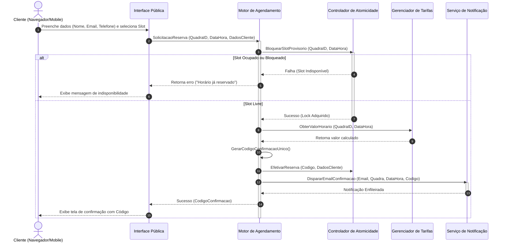

# Relatório Técnico de Arquitetura de Software

---

## 1. Identificação das HUs

A tabela a seguir consolida a rastreabilidade entre os Perfis de Usuário, Histórias de Usuário (HUs), Requisitos Funcionais (RF) e Requisitos Não Funcionais (RNF) associados:

| HU ID | Perfil | História de Usuário (Resumo) | Requisitos Funcionais (RF) | Requisitos Não Funcionais (RNF) |
|---|---|---|---|---|
| **HU01** | Operador | Cadastrar quadra informando nome, tipo, horário de funcionamento e valor base da hora. | RF01, RF02 | RNF03, RNF07 |
| **HU02** | Operador | Bloquear horários específicos para manutenção ou feriados. | RF03 | RNF03 |
| **HU03** | Operador | Visualizar agenda diária consolidada de todas as quadras. | RF11 | RNF01, RNF03 |
| **HU04** | Operador | Cancelar reserva informando motivo e notificando o cliente. | RF09, RF10 | RNF03 |
| **HU05** | Cliente | Consultar disponibilidade de horários sem necessidade de login. | RF04 | RNF01, RNF02, RNF06 |
| **HU06** | Cliente | Realizar reserva com dados de contato, gerando código único e envio de confirmação. | RF05, RF06, RF07, RF10 | RNF01, RNF05, RNF06 |
| **HU07** | Cliente | Cancelar a própria reserva mediante informe de código de confirmação. | RF08 | RNF01, RNF06 |
| **N/A** | Operador | Configuração de tarifação diferenciada por faixa de horário (horário nobre). | RF12 | RNF03, RNF07 |

---

## 2. Diagramas de Arquitetura (Mermaid)

### 2.1. Diagrama de Componentes da Arquitetura

O diagrama abaixo ilustra a segregação de responsabilidades entre as interfaces dos perfis, os serviços de negócio centrais, os mecanismos de consistência e o barramento/serviço de notificação.

```mermaid
componentDiagram
    [Interface Pública - Cliente] as UI_Cliente
    [Interface Administrativa - Operador] as UI_Operador

    package "Módulo de Segurança & Acesso" {
        [Componente de Autenticação] as AuthComp
    }

    package "Módulo de Gestão do Esporte" {
        [Gerenciador de Quadras] as QuadraComp
        [Gerenciador de Tarifas] as TarifaComp
    }

    package "Módulo de Reservas & Concorrência" {
        [Motor de Agendamentos] as AgendamentoComp
        [Controlador de Concorrência e Atomicidade] as AtomicComp
        [Visualizador de Agenda Consolidada] as AgendaComp
    }

    package "Módulo de Comunicação" {
        [Serviço de Notificações] as NotificationComp
    }

    UI_Cliente --> QuadraComp : Consulta disponibilidade (Sem Auth)
    UI_Cliente --> AgendamentoComp : Solicita reserva / cancelamento

    UI_Operador --> AuthComp : Autentica
    UI_Operador --> QuadraComp : Cadastra/Edita quadra (Com Auth)
    UI_Operador --> TarifaComp : Configura horários nobres (Com Auth)
    UI_Operador --> AgendamentoComp : Bloqueia horários / Cancela reserva (Com Auth)
    UI_Operador --> AgendaComp : Visualiza matriz consolidada (Com Auth)

    AgendamentoComp --> AtomicComp : Valida e garante slot único
    AgendamentoComp --> TarifaComp : Consulta valor do horário
    AgendamentoComp --> NotificationComp : Dispara confirmação/cancelamento
```

### 2.2. Diagrama de Sequência: Realização de Reserva Atômica (HU06, RF05, RF06, RF07, RNF05)

O fluxo a seguir garante a atomicidade da reserva, impedindo o duplo agendamento concorrente e finalizando com a notificação ao cliente.



---

## 3. Decisões de Arquitetura

### ADR 01: Segregação de Contextos de Acesso (Público vs. Autenticado)
* **Status:** Aprovado.
* **Contexto:** Clientes devem consultar disponibilidade e efetuar reservas sem criar conta (RF04, HU05), enquanto Operadores necessitam de controle restrito sobre parametrizações e agendas (RF01-RF03, RNF03).
* **Decisão:** A arquitetura expõe duas zonas funcionais distintas na camada de apresentação/API. A zona pública dispõe de rotas otimizadas apenas para leitura de disponibilidade e criação de reservas. A zona administrativa exige validação de credenciais via *Componente de Autenticação* antes de autorizar qualquer operação de escrita ou visualização global.
* **Consequência:** Garante o cumprimento do RNF03 e facilita a escalabilidade independente dos acessos de clientes e operadores.

### ADR 02: Garantia de Atomicidade na Reserva de Horários (Prevenção de Race Condition)
* **Status:** Aprovado.
* **Contexto:** Múltiplos clientes podem tentar reservar a mesma quadra no mesmo milissegundo (RF07, RNF05).
* **Decisão:** Incorporar um *Controlador de Concorrência e Atomicidade* no domínio de agendamento. Toda transação de criação de reserva deve adquirir uma trava de exclusão mútua isolada por `(QuadraID, DataHora)` durante a validação e persistência do registro. Se duas requisições simultâneas chegarem, uma adquire a trava e a outra é rejeitada imediatamente com falha de conflito.
* **Consequência:** Elimina integralmente o risco de duplo agendamento (overbooking), cumprindo o RNF05.

### ADR 03: Arquitetura Modular Baseada em Domínios Desacoplados
* **Status:** Aprovado.
* **Contexto:** O sistema precisa permitir a inclusão de novas modalidades esportivas e regras de tarifação variáveis sem impactar o núcleo de agendamentos (RF12, RNF07).
* **Decisão:** O domínio de *Gestão do Esporte* (Quadras e Tarifas) é desacoplado do *Motor de Agendamentos*. O Motor de Agendamento consulta regras de precificação por meio de interfaces abstratas. Novas modalidades ou regras tarifárias agregam apenas novos tipos e tabelas de consulta, mantendo o fluxo principal intocado.
* **Consequência:** Alta manutenibilidade e facilidade de extensão (RNF07).

### ADR 04: Processamento Assíncrono de Notificações
* **Status:** Aprovado.
* **Contexto:** A confirmação de reserva deve emitir e-mails ao cliente (RF10). Lentidões no envio de e-mail não podem impactar o tempo de resposta da transação do cliente.
* **Decisão:** A emissão de e-mails será tratada de forma assíncrona. O *Motor de Agendamento* conclui a transação atômica, gera o código e envia um evento para o *Serviço de Notificações*, liberando a resposta para a interface gráfica imediatamente.
* **Consequência:** Garante tempos de resposta rápidos para o usuário (alinhado ao RNF02) e desacopla a aplicação de eventuais instabilidades em serviços de terceiros de e-mail.

---

## 4. Tabela de Componentes e Rastreabilidade

| Componente | Responsabilidade Principal | Comunica-se com | Origem (HU / Critério de Aceite) |
|---|---|---|---|
| **Interface Pública - Cliente** | Renderização responsiva da consulta de horários, formulário de reserva e solicitação de cancelamento. | `Gerenciador de Quadras`, `Motor de Agendamentos` | HU05, HU06, HU07, RNF01, RNF06 |
| **Interface Administrativa - Operador** | Painel restrito para gestão de quadras, bloqueios, valores e visão consolidada. | `Componente de Autenticação`, `Gerenciador de Quadras`, `Gerenciador de Tarifas`, `Motor de Agendamentos`, `Visualizador de Agenda Consolidada` | HU01, HU02, HU03, HU04, RNF01, RNF03 |
| **Componente de Autenticação** | Validar credenciais do operador e proteger endpoints administrativos. | `Interface Administrativa - Operador` | RNF03 |
| **Gerenciador de Quadras** | Manter o cadastro de quadras, tipos esportivos, horários de funcionamento e bloqueios administrativos. | `Interface Pública`, `Interface Administrativa`, `Motor de Agendamentos` | HU01, HU02, RF01, RF02, RF03 |
| **Gerenciador de Tarifas** | Calcular o preço da hora com base em faixas de horário (ex.: horário nobre) e configurações da quadra. | `Motor de Agendamentos`, `Interface Administrativa` | RF12, HU01 (Critério de Aceite) |
| **Motor de Agendamentos** | Orquestrar criação de reservas, geração de código único e cancelamentos (cliente/operador). | `Controlador de Concorrência e Atomicidade`, `Gerenciador de Tarifas`, `Serviço de Notificações` | HU04, HU06, HU07, RF05, RF06, RF08, RF09 |
| **Controlador de Concorrência e Atomicidade** | Garantir exclusão mútua na alocação de slots de quadras no mesmo dia/horário. | `Motor de Agendamentos` | RF07, RNF05 |
| **Serviço de Notificações** | Formatar e disparar mensagens de e-mail (confirmação/cancelamento com motivo). | `Motor de Agendamentos` | RF10, HU04, HU06 |
| **Visualizador de Agenda Consolidada** | Montar a matriz diária consolidada de ocupação de todas as quadras para navegação por data. | `Interface Administrativa`, `Gerenciador de Quadras`, `Motor de Agendamentos` | HU03, RF11 |

---

## 5. Bloqueios e Pendências

1. **Ausência de Especificação Financeira / Meio de Pagamento:**
   * *Descrição:* Os requisitos definem valor da hora (RF01, RF12) e confirmação da reserva (RF05), mas não esclarecem se o pagamento é realizado online no momento da reserva ou presencialmente no local.
   * *Impacto Arquitetural:* Se o pagamento for online, há necessidade de integração com Gateway de Pagamento, fluxo de reserva temporária (hold) e tratamento de *webhooks* de confirmação.

2. **Política e Janela de Cancelamento:**
   * *Descrição:* Não há definição de regras de antecedência mínima para cancelamento (ex.: até 24h antes) tanto para clientes (HU07) quanto para operadores (HU04).
   * *Impacto Arquitetural:* Necessidade de implementar regras configuráveis no *Motor de Agendamentos* para permitir/recusar solicitações de cancelamento fora da janela permitida.

3. **Granularidade dos Slots de Horário:**
   * *Descrição:* Os requisitos tratam "valor da hora", mas não detalham se o sistema permite frações (ex.: reservas de 30 minutos ou 1h30).
   * *Impacto Arquitetural:* Afeta o algoritmo do *Controlador de Concorrência* e a geração da matriz no *Visualizador de Agenda Consolidada*. Assumiu-se inicialmente a alocação em blocos fixos de 60 minutos.

---

## 6. Cobertura de Requisitos

### Requisitos Funcionais (RF)

| Requisito | Coberto? | Componente / Elemento de Arquitetura Responsável |
|---|:---:|---|
| **RF01** (Cadastrar quadra) | Sí | Gerenciador de Quadras |
| **RF02** (Editar/remover quadra) | Sí | Gerenciador de Quadras |
| **RF03** (Bloquear horários) | Sí | Gerenciador de Quadras / Motor de Agendamentos |
| **RF04** (Exibir horários livres sem login) | Sí | Interface Pública - Cliente / Gerenciador de Quadras |
| **RF05** (Realizar reserva) | Sí | Motor de Agendamentos / Interface Pública |
| **RF06** (Gerar código único) | Sí | Motor de Agendamentos |
| **RF07** (Impedir duplo agendamento) | Sí | Controlador de Concorrência e Atomicidade |
| **RF08** (Cliente cancelar com código) | Sí | Motor de Agendamentos |
| **RF09** (Operador cancelar com motivo) | Sí | Motor de Agendamentos / Interface Administrativa |
| **RF10** (Enviar e-mail de confirmação) | Sí | Serviço de Notificações |
| **RF11** (Agenda diária consolidada) | Sí | Visualizador de Agenda Consolidada |
| **RF12** (Valores por faixa de horário) | Sí | Gerenciador de Tarifas |

### Requisitos Não Funcionais (RNF)

| Requisito | Coberto? | Estratégia Arquitetural |
|---|:---:|---|
| **RNF01** (Usabilidade / Responsivo) | Sí | Camadas de UI (Pública e Administrativa) projetadas sob princípios de design adaptativo para web/mobile. |
| **RNF02** (Desempenho <= 2s) | Sí | Separação de leituras de disponibilidade sem autenticação e notificação assíncrona fora da thread principal de resposta. |
| **RNF03** (Segurança / Autenticação Operador) | Sí | Proteção de todos os endpoints e telas administrativas via Componente de Autenticação. |
| **RNF04** (Disponibilidade 99% 24/7) | Sí | Arquitetura modular sem estado no núcleo de serviços, permitindo execução contínua. |
| **RNF05** (Atomicidade / Sem overbooking) | Sí | Isolamento de transações via Controlador de Concorrência e Atomicidade (ADR 02). |
| **RNF06** (Compatibilidade de Navegadores) | Sí | Interfaces construídas sobre padrões web universais suportados por navegadores modernos. |
| **RNF07** (Manutenibilidade / Modularidade) | Sí | Desacoplamento de domínios (Quadras, Agendamentos, Tarifas, Comunicação) via interfaces bem definidas (ADR 03). |

---

## 7. Gap Analysis

| Lacuna Identificada | Impacto Arquitetural | Ação Recomendada para a Equipe de Dev |
|---|---|---|
| **Falta de fluxo de pagamento no agendamento** | O sistema atual reserva o slot imediatamente. Se o pagamento for presencial, há risco de *no-show* (cliente reserva e não comparece). Se for online, falta integrar gateway de pagamento. | Alinhar com o Product Owner se haverá integração com Gateway de Pagamento. Caso positivo, projetar o estado "Reserva Pendente de Pagamento" com tempo de expiração (*TTL*). |
| **Ausência de motivo e histórico no cancelamento do cliente** | RF09 exige motivo para cancelamento do Operador, mas RF08/HU07 não preveem justificativa do Cliente. | Incluir campo opcional/obrigatório de motivo no cancelamento do cliente para fins de auditoria e métricas de desistência. |
| **Regras de tarifação dinâmica não especificadas em detalhes** | RF12 menciona "horário nobre", mas não define se a variação é por dia da semana, feriados ou sazonalidade. | Modelar o `Gerenciador de Tarifas` aceitando matrizes de regras flexíveis (ex.: Tabela por Dia da Semana + Faixa Horária + Exceções/Datas Especiais). |
| **Ausência de política de reativação de horários bloqueados** | HU02 prevê remoção de bloqueio manual pelo operador, mas não especifica notificação de clientes interessados. | Definir se a liberação de um bloqueio apenas disponibiliza o slot no calendário público ou se requer uma fila de espera/notificação. |