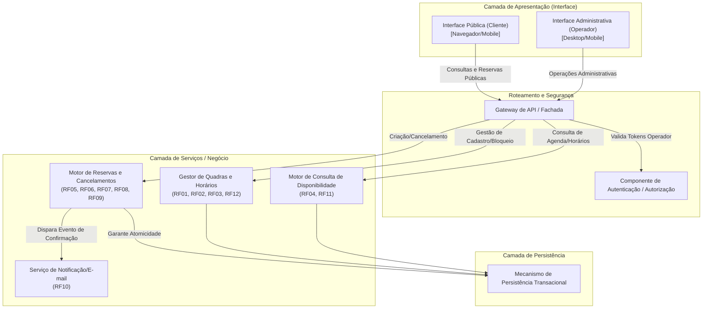
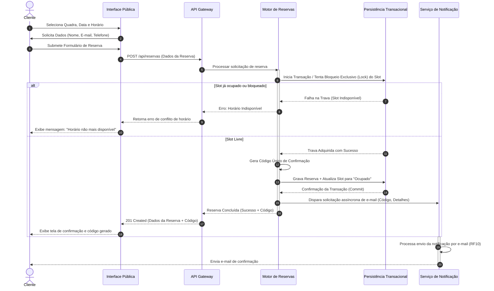

# Relatório Técnico de Arquitetura de Software

---

## 1. Identificação das HUs

A tabela a seguir consolida e rastreia as Histórias de Usuário (HU) em relação aos atores, Requisitos Funcionais (RF) e Requisitos Não Funcionais (RNF) associados:

| HU | Ator | Descrição Sucinta | RFs Relacionados | RNFs Relacionados |
| :--- | :--- | :--- | :--- | :--- |
| **HU01** | Operador | Cadastrar quadra (nome, tipo, horário funcionamento, valor/hora). | RF01 | RNF01, RNF03, RNF07 |
| **HU02** | Operador | Bloquear horários específicos para manutenção ou feriados. | RF03 | RNF01, RNF03 |
| **HU03** | Operador | Visualizar agenda diária consolidada de todas as quadras. | RF11 | RNF01, RNF03 |
| **HU04** | Operador | Cancelar reserva informando motivo e notificando o cliente. | RF09, RF10 | RNF01, RNF03 |
| **HU05** | Cliente | Consultar disponibilidade de horários sem necessidade de login. | RF04 | RNF01, RNF02, RNF06 |
| **HU06** | Cliente | Realizar reserva com validação de disponibilidade e geração de código. | RF05, RF06, RF07, RF10 | RNF01, RNF05, RNF06 |
| **HU07** | Cliente | Cancelar a própria reserva mediante informe do código de confirmação. | RF08 | RNF01, RNF05, RNF06 |

---

## 2. Diagramas de Arquitetura (Mermaid)

### 2.1. Visão Geral dos Componentes da Arquitetura

O diagrama abaixo ilustra a segregação lógica de componentes, destacando a separação entre a zona pública (acesso do cliente) e a zona administrativa (operador), intermediadas por um Gateway de API com subsistemas dedicados.

---

### 2.2. Diagrama de Sequência: Realização de Reserva com Garantia de Atomicidade (HU06)

O diagrama a seguir descreve o fluxo concorrente e atômico de uma solicitação de reserva efetuada pelo cliente.

---

## 3. Decisões de Arquitetura

### ADR-01: Separação Logica entre Acesso Público e Acesso Autenticado
* **Contexto:** Os clientes devem consultar disponibilidade e efetuar/cancelar reservas sem necessidade de conta/login (RF04, HU05), enquanto os operadores necessitam de acesso estritamente protegido para funções de administração (RF01-RF03, RF09, RF11, RNF03).
* **Decisão:** Adotar uma estratégia de endpoints segregados no API Gateway. Endpoints sob `/public/...` não exigem tokens e possuem *rate limiting* para mitigação de abusos. Endpoints sob `/admin/...` exigem validação rigorosa via componente de Autenticação/Autorização antes do repasse aos serviços centrais.
* **Consequências:** Garante cumprimento direto do RNF03 sem criar barreiras de usabilidade para o cliente final.

### ADR-02: Garantia de Atomicidade e Controle de Concorrência na Reserva
* **Contexto:** Múltiplos clientes podem tentar reservar a mesma quadra no mesmo horário simultaneamente (RNF05, RF07).
* **Decisão:** A camada de persistência transacional deve implementar controle de concorrência com bloqueio estrito (*pessimistic lock* ou изоlação de transação nível *serializable*) durante o ato de confirmação da reserva.
* **Consequências:** Evita o problema de *overbooking* (duplo agendamento). Caso ocorra disputa, apenas a primeira transação completa; as demais são rejeitadas de forma graciosa.

### ADR-03: Descouplamento do Envio de Notificações
* **Contexto:** A notificação por e-mail é obrigatória (RF10), porém provedores externos de e-mail podem apresentar latência variável ou instabilidades momentâneas.
* **Decisão:** O envio de e-mails de confirmação ou cancelamento será processado de forma assíncrona por um Serviço de Notificação desacoplado, utilizando processamento em segundo plano acionado por eventos gerados pelo Motor de Reservas.
* **Consequências:** O tempo de resposta para o cliente no ato da reserva permanece dentro dos limites operacionais (atendendo ao RNF02 e RNF05), prevenindo que a falha de um serviço externo de e-mail invalide uma reserva gravada com sucesso.

### ADR-04: Modelo Flexível para Tarifação e Modalidades Esportivas
* **Contexto:** É necessário configurar valores por faixas de horário (RF12) e garantir manutenibilidade modular para novas modalidades esportivas (RNF07).
* **Decisão:** A estrutura de dados referente às quadras deve desacoplar a entidade "Quadra" da entidade "Modalidade/Tipo" e da tabela de "Regras de Pricing/Faixa Horária".
* **Consequências:** Inclusões de novas modalidades ou ajustes na precificação (ex: horário nobre) ocorrem via parametrização, sem exigir modificações na lógica estrutural do sistema.

---

## 4. Tabela de Componentes e Rastreabilidade

| Componente | Responsabilidade Principal | Comunica-se com | Origem (HU / Critério de Aceite) |
| :--- | :--- | :--- | :--- |
| **Interface Pública (Cliente)** | Permitir navegação responsiva, consulta de disponibilidade sem login, submissão de reservas e cancelamento via código. | Gateway de API | HU05, HU06, HU07 / RNF01, RNF06 |
| **Interface Administrativa (Operador)** | Exibir painel consolidado, permitir gestão de quadras, bloqueios de horários e cancelamentos justificados. | Gateway de API | HU01, HU02, HU03, HU04 / RNF01, RNF03 |
| **Gateway de API / Fachada** | Ponto único de entrada, roteamento, limitação de taxa (rate limit) e aplicação de políticas de segurança. | Interfaces, Serviço de Auth, Serviços de Negócio | RNF02, RNF03 |
| **Componente de Autenticação / Autorização** | Validar credenciais do operador e emitir/checar tokens de acesso para a área restrita. | Gateway de API, Mecanismo de Persistência | RNF03 |
| **Gestor de Quadras e Horários** | Manter cadastros de quadras, tipos/modalidades, regras de valores diferenciados e registrar bloqueios operacionais/feriados. | Gateway de API, Mecanismo de Persistência | HU01, HU02 / RF01, RF02, RF03, RF12, RNF07 |
| **Motor de Consulta de Disponibilidade** | Consolidar e calcular a grade de horários livres e ocupados por data e quadra para exibição rápida. | Gateway de API, Mecanismo de Persistência | HU03, HU05 / RF04, RF11, RNF02 |
| **Motor de Reservas e Cancelamentos** | Processar requisições de reserva, validar disponibilidade no ato, gerar código único, realizar cancelamentos e garantir integridade atômica. | Gateway de API, Mecanismo de Persistência, Serviço de Notificação | HU04, HU06, HU07 / RF05, RF06, RF07, RF08, RF09, RNF05 |
| **Serviço de Notificação** | Processar e entregar mensagens de confirmação e cancelamento de reservas ao e-mail do cliente. | Motor de Reservas | HU04, HU06 / RF10 |
| **Mecanismo de Persistência Transacional** | Armazenar dados com garantia de propriedades ACID e gerenciar locks de concorrência. | Gestores de Negócio, Serviço de Auth | RNF04, RNF05 |

---

## 5. Bloqueios e Pendências

1. **Política de Antecedência para Cancelamento:**
   * *Pendência:* Nem a HU07 nem os RFs especificam com quanta antecedência o cliente pode cancelar uma reserva antes do horário agendado.
   * *Impacto:* Risco de cancelamentos efetuados segundos antes do horário, inviabilizando a reocupação da quadra.

2. **Detalhamento do Formato e Complexidade do Código de Confirmação:**
   * *Pendência:* O RF06 exige um código único, mas não estipula tamanho, formato (alfanumérico, numérico) ou sensibilidade.
   * *Impacto:* Códigos muito curtos podem ser alvos de ataques de força bruta no cancelamento (HU07).

3. **Validação de Identidade do Cliente no Cancelamento pelo Operador:**
   * *Pendência:* A HU04 e o RF09 exigem motivo no cancelamento pelo operador, mas não definem o tratamento caso haja pendência financeira ou ressarcimento.

4. **Tratamento de Falha na Entrega de E-mails:**
   * *Pendência:* Não há requisito explicitando a conduta do sistema caso o e-mail do cliente seja inválido ou o serviço de notificação encontre erro definitivo.
   * *Impacto:* Risco de a reserva ser efetuada mas o cliente não receber o código (embora o código deva ser exibido em tela conforme critério de aceite da HU06).

---

## 6. Cobertura de Requisitos

### 6.1. Requisitos Funcionais (RF)

| ID RF | Coberto pelo Componente | Coberto na HU | Status de Arquitetura |
| :--- | :--- | :--- | :--- |
| **RF01** | Gestor de Quadras e Horários | HU01 | **Totalmente Mapeado** |
| **RF02** | Gestor de Quadras e Horários | HU01 | **Totalmente Mapeado** |
| **RF03** | Gestor de Quadras e Horários | HU02 | **Totalmente Mapeado** |
| **RF04** | Motor de Consulta de Disponibilidade | HU05 | **Totalmente Mapeado** |
| **RF05** | Motor de Reservas e Cancelamentos | HU06 | **Totalmente Mapeado** |
| **RF06** | Motor de Reservas e Cancelamentos | HU06 | **Totalmente Mapeado** |
| **RF07** | Motor de Reservas e Cancelamentos | HU06 | **Totalmente Mapeado** |
| **RF08** | Motor de Reservas e Cancelamentos | HU07 | **Totalmente Mapeado** |
| **RF09** | Motor de Reservas e Cancelamentos | HU04 | **Totalmente Mapeado** |
| **RF10** | Serviço de Notificação | HU04, HU06 | **Totalmente Mapeado** |
| **RF11** | Motor de Consulta de Disponibilidade | HU03 | **Totalmente Mapeado** |
| **RF12** | Gestor de Quadras e Horários | HU01 | **Totalmente Mapeado** |

---

### 6.2. Requisitos Não Funcionais (RNF)

| ID RNF | Estratégia / Solução Arquitetural Adoptada | Status de Arquitetura |
| :--- | :--- | :--- |
| **RNF01** (Usabilidade) | Interfaces segregadas e otimizadas para múltiplos tamanhos de tela (Mobile/Desktop). | **Atendido pelo Design** |
| **RNF02** (Desempenho) | Consultas de disponibilidade otimizadas no Motor de Consulta; processamento assíncrono de notificações. | **Atendido pelo Design** |
| **RNF03** (Segurança) | Gateway de API integrado a componente de Autenticação/Autorização para área restrita. | **Atendido pelo Design** |
| **RNF04** (Disponibilidade) | Arquitetura desacoplada e redundante na camada de serviços e persistência. | **Atendido pelo Design** |
| **RNF05** (Confiabilidade) | Controle de concorrência e transações isoladas no Motor de Reservas. | **Atendido pelo Design** |
| **RNF06** (Compatibilidade)| Apresentação baseada em padrões web universais e desacoplada do backend. | **Atendido pelo Design** |
| **RNF07** (Manutenibilidade)| Desacoplamento do cadastro de modalidades, quadras e tarifação no Gestor de Quadras. | **Atendido pelo Design** |

---

## 7. Gap Analysis

A análise a seguir identifica lacunas de especificação entre os requisitos fornecidos e o cenário operacional real de um sistema de reservas, indicando o impacto arquitetural e as ações recomendadas:

### 1. Ausência de Mecanismo de Pagamento ou Garantia Financeira
* **Lacuna:** O sistema permite reservar sem exigir pagamento prévio ou sinal.
* **Impacto Arquitetural:** Alto risco de "reservas fantasmas" (no-show), ocupando horários válidos e gerando prejuízo operacional.
* **Ação Recomendada:** Propor a criação de um componente opcional de integração com Gateway de Pagamentos para cobrir a taxa de reserva ou permitir configuração de sinal obrigatório por parte do operador.

### 2. Ausência de Política de Temporalidade e Expiração de Reserva
* **Lacuna:** Não há especificação de limite de antecedência mínima para realizar ou cancelar reservas.
* **Impacto Arquitetural:** O Motor de Reservas pode aceitar cancelamentos com a hora já em andamento ou reservas para horários passados caso a validação de relógio não seja formalizada.
* **Ação Recomendada:** Inserir uma regra de negócio na camada de validação do Motor de Reservas exigindo `data_reserva > data_atual` e uma janela configurável para cancelamento sem penalidade.

### 3. Vulnerabilidade de Brute-Force no Cancelamento por Código
* **Lacuna:** A HU07 autoriza o cancelamento de reserva informando apenas o código de confirmação, sem vincular a e-mail ou telefone do solicitante.
* **Impacto Arquitetural:** Se o código for sequencial ou curto, um ator mal-intencionado pode varrer combinações e cancelar reservas alheias.
* **Ação Recomendada:** Exigir na interface e validar no Motor de Reservas a combinação do **Código de Confirmação + E-mail (ou Telefone)** cadastrado na reserva.

### 4. Proteção de Dados Pessoais (LGPD/Privacidade)
* **Lacuna:** O sistema coleta Nome, E-mail e Telefone de clientes sem cadastro prévio (RF05). Não há menção a termos de consentimento ou retenção de dados.
* **Impacto Arquitetural:** Necessidade de rotinas para anonimização ou expurgo de dados pessoais após a realização/cancelamento da reserva.
* **Ação Recomendada:** Definir política de retenção de dados no Mecanismo de Persistência e adicionar termo de aceite explicito na Interface Pública.