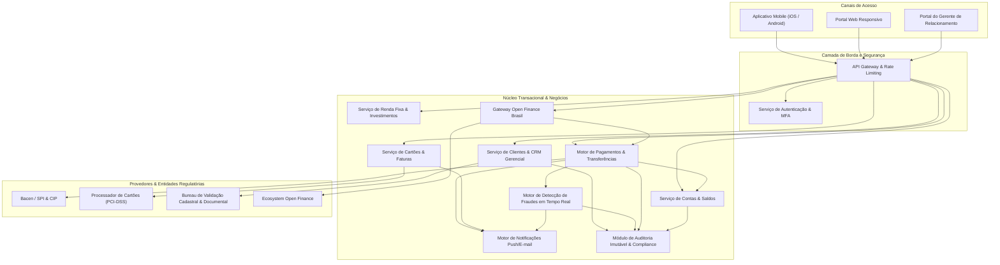
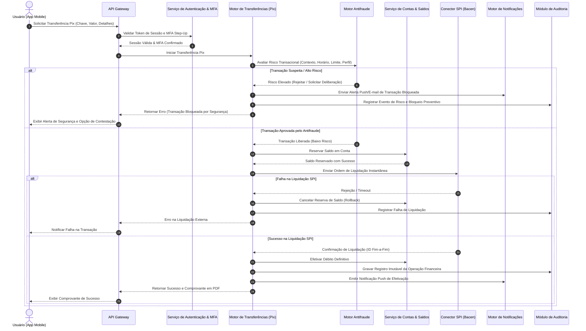

# Relatório Técnico de Arquitetura de Software

---

## 1. Identificação das HUs

A tabela abaixo resume as Histórias de Usuário (HUs) mapeadas a partir dos requisitos de negócio, categorizadas por perfil de atuação.

| ID | Perfil | Título | Objetivo Principal |
| :--- | :--- | :--- | :--- |
| **HU01** | Pessoa Física (PF) | Abrir conta com validação de identidade | Realizar onboarding 100% digital com validação documental e biométrica. |
| **HU02** | Todos os Perfis | Autenticar com múltiplos fatores | Garantir acesso seguro via MFA obrigatório (OTP e Biometria). |
| **HU03** | PF / PJ | Realizar transferência via Pix | Executar pagamentos instantâneos com validação de limites e verificação antifraude. |
| **HU04** | PF / PJ | Pagar boleto com agendamento | Liquidar e agendar títulos de cobrança e convênios com confirmação de dados. |
| **HU05** | PF / PJ | Gerenciar cartão de crédito | Consultar faturas, ajustar limites aprovados e bloquear/desbloquear cartões. |
| **HU06** | PF / PJ | Contestar transação não reconhecida | Iniciar fluxo de chargeback/contestação diretamente pelos canais digitais. |
| **HU07** | PF / PJ | Investir em renda fixa | Efetuar aportes, resgates e acompanhamento de posição consolidada. |
| **HU08** | PF / PJ | Gerenciar consentimentos do Open Finance | Autorizar, consultar e revogar compartilhamento de dados e iniciação de pagamentos. |
| **HU09** | PF / PJ | Responder a alertas de suspeita de fraude | Receber notificações em tempo real e deliberar sobre transações suspeitas bloqueadas. |
| **HU10** | Pessoa Jurídica (PJ) | Abrir conta PJ com documentação societária | Onboarding PJ com validação de poderes societários, CNPJ e KYC dos sócios. |
| **HU11** | Pessoa Jurídica (PJ) | Realizar TED para fornecedores | Efetuar transferências interbancárias em lote ou avulsas dentro da grade horária. |
| **HU12** | Gerente de Relacionamento | Acompanhar carteira de clientes | Visualizar posição consolidada de clientes sob sua gestão mediante consentimento. |
| **HU13** | Gerente de Relacionamento | Abrir solicitação de serviço em nome do cliente | Registrar demandas e pleitos operacionais com trilha de auditoria vinculada. |

---

## 2. Diagramas de Arquitetura (Mermaid)

### 2.1. Diagrama de Componentes do Sistema

O diagrama conceitual a seguir ilustra a segregação de responsabilidades em subsistemas orientados a domínio (*Bounded Contexts*), canais de entrada, camada de integração e conectores regulatórios externos.

---

### 2.2. Diagrama de Sequência: Processamento de Transferência Pix com Análise de Fraude

O fluxo abaixo descreve o ciclo de vida da execução de uma transferência Pix (HU03, HU09), detalhando a checagem síncrona antifraude, reserva de saldo, liquidação no SPI do Banco Central e emissão de comprovante.

---

## 3. Decisões de Arquitetura

### DA-01: Arquitetura Orientada a Serviços e Isolamento por Domínios (*Bounded Contexts*)
* **Contexto**: A plataforma atende a domínios com ciclos de vida e requisitos regulatórios distintos (ex.: Pix, Cartões, Open Finance, Onboarding).
* **Decisão**: Adotar isolamento lógico e funcional de serviços, desacoplando o núcleo de liquidação transacional das rotinas de suporte gerencial e onboarding.
* **Justificativa**: Garante escalabilidade horizontal independente (RNF16) e isola falhas em componentes específicos (RNF17), assegurando alta disponibilidade global (RNF13).

### DA-02: Segregação de Dados de Cartão (Conformidade PCI-DSS)
* **Contexto**: Operações com cartões de débito e crédito exigem conformidade estrita de segurança (RNF06).
* **Decisão**: O sistema não persistirá nem trafegará diretamente Dados Críticos de Autenticação (SAD) ou PAN (*Primary Account Number*). O gerenciamento de cartões utilizará *tokenização* delegada a um gateway/processador certificado PCI-DSS.
* **Justificativa**: Reduz a superfície de ataque e mitiga riscos de não conformidade legal e regulatória.

### DA-03: Padrão *Saga* Orquestrada para Transações Distribuídas
* **Contexto**: Operações financeiras (como Pix e TED) demandam reserva de saldo, checagem de limites, antifraude e envio a redes externas (SPI/CIP).
* **Decisão**: Empregar um padrão de orquestração transacional com mecanismos de compensação explícita (estorno de reservas em caso de *timeout* ou falha externa).
* **Justificativa**: Evita inconsistências de saldo (duplo débito) e atende aos limites de tempo estipulados pelo regulador (RNF15).

### DA-04: Trilha de Auditoria com Armazenamento Imutável (*Write Once, Read Many*)
* **Contexto**: Normas do Banco Central e LGPD exigem retenção de registros de operações financeiras e consentimentos por período mínimo de 5 anos (RNF12).
* **Decisão**: Todos os eventos de negócios, autenticações e logs de transações serão gravados em repositório seguro de auditoria com garantia de imutabilidade e criptografia em repouso.
* **Justificativa**: Assegura não-repúdio, rastreabilidade forense e conformidade regulatória plena (RNF07, RNF08, RNF12).

---

## 4. Tabela de Componentes e Rastreabilidade

| Componente | Responsabilidade Principal | Comunica-se com | Origem (HU / Critério de Aceite) |
| :--- | :--- | :--- | :--- |
| **API Gateway & Rate Limiting** | Ponto único de entrada, roteamento, terminação TLS 1.2+, validação de cabeçalhos e controle de taxa de requisições. | Clientes (Web/Mobile), Serviço de Autenticação, Microserviços de Negócio | RNF01, RNF04, RNF19, RNF21 |
| **Serviço de Autenticação & MFA** | Gestão de sessões, autenticação multifator (OTP/Biometria), controle de timeout de inatividade e bloqueio remoto. | API Gateway, Módulo de Auditoria, Motor de Notificações | RF03, RF04, RF05, RF06, HU02 |
| **Serviço de Onboarding & KYC** | Coleta, análise e orquestração de validações documentais para PF e PJ, compliance PLD/FT e abertura de contas. | Bureau de Validação Externa, Serviço de Contas, Módulo de Auditoria | RF01, RF02, RF08, RNF08, HU01, HU10 |
| **Serviço de Contas & Saldos** | Manutenção de saldos em tempo real, cálculo de rendimentos de poupança, controle de limites e emissão de extratos. | Motor de Pagamentos, Serviço de Investimentos, Módulo de Auditoria | RF08, RF09, RF10, RF11, RF12, RF13, RNF14 |
| **Motor de Pagamentos & Transferências** | Orquestração de Pix, TED e Boletos, gestão de chaves Pix, agendamentos e interface com SPI/Bacen. | Conector SPI/CIP, Serviço de Contas, Motor Antifraude, Motor de Notificações | RF22, RF23, RF24, RF25, RF26, RF27, RF28, RF29, RF30, RF31, HU03, HU04, HU11 |
| **Serviço de Cartões & Faturas** | Emissão, alteração de limites, bloqueio/desbloqueio, gestão de faturas e fluxo de contestação de compras. | Processador PCI-DSS Externo, Motor de Notificações, Serviço de Contas | RF14, RF15, RF16, RF17, RF18, RF19, RF20, RF21, RNF06, HU05, HU06 |
| **Serviço de Investimentos** | Exibição de catálogo de renda fixa, aplicação, resgate, consolidação de posições e emissão de informe de rendimentos. | Serviço de Contas & Saldos, Módulo de Auditoria | RF32, RF33, RF34, RF35, HU07 |
| **Motor de Detecção de Fraudes** | Monitoramento síncrono e assíncrono de operações, bloqueio preventivo e suporte à confirmação/contestação pelo usuário. | Motor de Pagamentos, Motor de Notificações, Módulo de Auditoria | RF36, RF37, RF38, RF39, RF40, HU09 |
| **Gateway Open Finance Brasil** | Exposição e consumo de APIs padronizadas do Open Finance, gestão do ciclo de vida de consentimentos e iniciação de pagamentos. | Ecossistema Open Finance Externo, Motor de Pagamentos, Serviço de Contas | RF41, RF42, RF43, RF44, RNF11, HU08 |
| **Portal & Serviço de CRM Gerencial** | Painel do gerente de relacionamento para visão consolidada de clientes (sob consentimento), anotações e pedidos de serviço. | Serviço de Contas, Serviço de Investimentos, Módulo de Auditoria | RF07, RF45, RF46, RF47, HU12, HU13 |
| **Motor de Notificações** | Envio multicanal (Push Notification, E-mail, SMS) para confirmações, alertas transacionais e avisos de suspeita de fraude. | Motor de Pagamentos, Serviço de Cartões, Motor Antifraude, Clientes | RF20, RF31, RF38, HU05, HU09 |
| **Módulo de Auditoria & Compliance** | Armazenamento de trilhas de auditoria imutáveis, geração de relatórios BACEN (3040/SCR) e governança LGPD. | Todos os componentes internos, Bacen | RNF07, RNF09, RNF10, RNF12 |

---

## 5. Bloqueios e Pendências

1. **Protocolos e Prazos de Análise Manual no Onboarding**:
   * *Pendência*: Definição do fluxo de contingência e SLA quando bureaus externos de KYC estiverem indisponíveis ou retornarem inconclusivos (tanto para PF quanto PJ).
2. **Matriz de Alçadas para Iniciação por Gerente de Relacionamento**:
   * *Pendência*: Detalhamento do mecanismo de consentimento digital outorgado pelo cliente para abertura de serviços solicitados pelo gerente (RF47, HU13).
3. **Mecanismo de Resolução de Disputas Open Finance**:
   * *Pendência*: Especificação dos prazos de conciliação e liquidação em caso de falha em pagamentos iniciados por iniciador parceiro (PISP).

---

## 6. Cobertura de Requisitos

A arquitetura cobre integralmente a totalidade dos requisitos funcionais e não funcionais estabelecidos:

* **Gestão de Usuários e Segurança**: RF01 a RF07 e RNF01 a RNF06 atendidos pelo *Serviço de Autenticação & MFA*, *Serviço de Onboarding & KYC* e *API Gateway*.
* **Contas, Transações e Pagamentos**: RF08 a RF13, RF22 a RF31 e RNF14, RNF15 atendidos pelo *Serviço de Contas & Saldos* e *Motor de Pagamentos & Transferências*.
* **Cartões e PCI-DSS**: RF14 a RF21 e RNF06 atendidos pelo *Serviço de Cartões & Faturas* com delegação a processador externo credenciado.
* **Investimentos e Open Finance**: RF32 a RF35 e RF41 a RF44 cobertos pelo *Serviço de Investimentos* e *Gateway Open Finance Brasil*.
* **Antifraude e Auditoria**: RF36 a RF40 e RNF07 a RNF12 suportados pelo *Motor Antifraude* e *Módulo de Auditoria & Compliance*.
* **Operações Gerenciais**: RF45 a RF47 cobertos pelo *Portal & Serviço de CRM Gerencial*.
* **Infraestrutura e Resiliência**: RNF13, RNF16, RNF17, RNF22, RNF23 e RNF24 contemplados pelas diretrizes de redundância geográfica, zoneamento multizona, backups contínuos e monitoramento telemétrico.

---

## 7. Gap Analysis

| Lacuna Identificada | Impacto Arquitetural | Ação Recomendada |
| :--- | :--- | :--- |
| **Estratégia de Liquidação de Boletos em Finais de Semana e Feriados** | O agendamento de boletos (RF30) não especifica a regra de débito quando a data de vencimento coincide com feriados bancários. | Modelar mecanismo de agendamento que execute a liquidação no primeiro dia útil subsequente, com aviso prévio ao usuário no ato do agendamento. |
| **Política de Concorrência de Débito Simultâneo** | Risco de inconsistência de saldo caso o cliente execute Pix, compra no débito e liquidação de boleto no mesmo milissegundo. | Implementar controle transacional com *locks* otimistas/pessimistas ou modelo de mensageria sequenciada por conta corrente para garantir atomicidade. |
| **Revogação de Acesso do Gerente de Relacionamento** | Ausência de regra de expiração temporal para o consentimento concedido pelo cliente ao gerente (RF07, HU12). | Introduzir ciclo de vida formal para o consentimento de gestão, com renovação periódica obrigatória e expiração automática em caso de inatividade. |
| **Degradação Graciosa em Quedas de Conectividade Externa (SPI/Bacen)** | Quedas momentâneas da rede do Banco Central podem gerar acúmulo de requisições pendentes. | Projetar filas de reprocessamento com *Circuit Breaker* para rejeição rápida e status informativos ao usuário, impedindo bloqueio de threads de aplicação. |