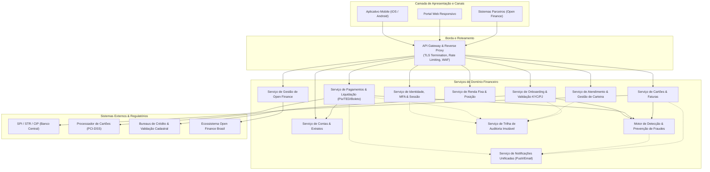
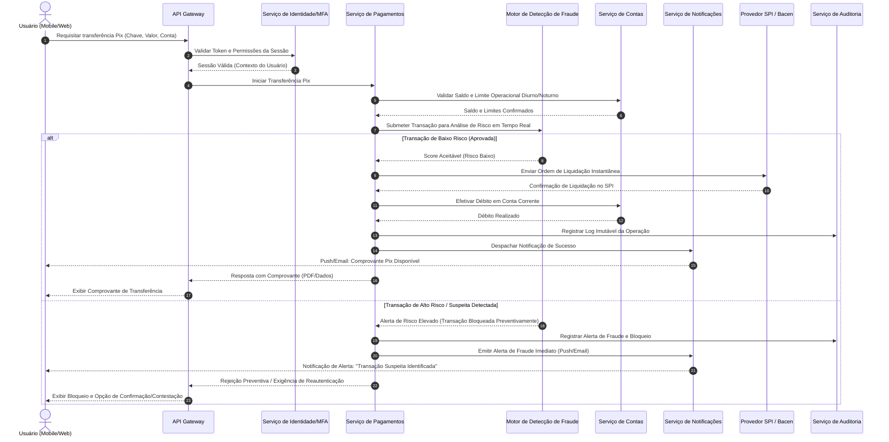

# Relatório Técnico de Arquitetura de Software

## 1. Identificação das HUs

A tabela a seguir consolida as Histórias de Usuário mapeadas para a plataforma financeira digital, identificando o perfil de ator, escopo de negócio e os requisitos funcionais diretamente relacionados.

| ID HU | Título | Perfil do Ator | Descrição Resumida | RFs Vinculados |
| :--- | :--- | :--- | :--- | :--- |
| **HU01** | Onboarding PF com Validação de Identidade | Pessoa Física (PF) | Abertura digital de conta corrente/poupança com envio e validação documental. | RF01, RF02, RF08 |
| **HU02** | Autenticação Multifator (MFA) | Todos (PF/PJ/Gerente) | Acesso seguro ao sistema exigindo múltiplos fatores (OTP e biometria). | RF03, RF04, RF05, RF06 |
| **HU03** | Transferência Instantânea via Pix | PF / PJ | Envio de valores via chaves Pix com validação de limites diurnos/noturnos e emissão de comprovante. | RF12, RF13, RF22, RF23, RF24, RF27 |
| **HU04** | Pagamento e Agendamento de Boletos | PF / PJ | Liquidação e agendamento de títulos com leitura de código de barras e lembretes proativos. | RF13, RF28, RF29, RF30, RF31 |
| **HU05** | Gestão de Cartões de Crédito e Débito | PF / PJ | Visualização de fatura, ajuste de limites, bloqueio/desbloqueio e notificações de uso. | RF14, RF15, RF16, RF17, RF18, RF19, RF20 |
| **HU06** | Contestação de Transações Não Reconhecidas | PF / PJ | Abertura de disputa direta pelo aplicativo para compras e movimentações suspeitas. | RF21, RF39 |
| **HU07** | Aplicação e Resgate em Renda Fixa | PF / PJ | Consulta de catálogo de ativos, aportes, resgates e consolidação de posição de investimentos. | RF32, RF33, RF34, RF35 |
| **HU08** | Gestão de Consentimentos Open Finance | PF / PJ | Autorização, consulta, gestão e revogação de compartilhamento de dados e iniciação de pagamentos. | RF41, RF42, RF43, RF44 |
| **HU09** | Notificação e Resposta a Alertas de Fraude | PF / PJ | Alertas em tempo real para operações anômalas com confirmação ou bloqueio preventivo pelo usuário. | RF36, RF37, RF38, RF39, RF40 |
| **HU10** | Onboarding PJ com Validação Societária | Pessoa Jurídica (PJ) | Abertura de conta jurídica com validação de CNPJ, quadro societário e documentação legal. | RF01, RF02, RF08 |
| **HU11** | Transferência Interbancária via TED | Pessoa Jurídica (PJ) | Transferência interbancária com validação de dados bancários, janelas de horário e limites. | RF13, RF25, RF26, RF27 |
| **HU12** | Gestão de Carteira de Clientes | Gerente de Relacionamento | Visão consolidada de produtos e saldos mediante consentimento do titular e registro de interações. | RF07, RF45, RF46 |
| **HU13** | Abertura de Solicitações de Serviço por Delegação | Gerente de Relacionamento | Formalização de pedidos de serviço em nome do cliente com trilha de auditoria e segregação de funções. | RF47 |

---

## 2. Diagramas de Arquitetura (Mermaid)

### 2.1. Visão Geral de Componentes da Arquitetura

---

### 2.2. Diagrama de Sequência: Processamento de Transação Pix com Avaliação Antifraude (HU03, HU09)

---

## 3. Decisões de Arquitetura

* **ADR-01: Arquitetura Orientada a Serviços de Domínio Desacoplados**
  * *Contexto:* O sistema gerencia operações críticas diversas (Pix, TED, cartões, crédito, auditoria regulatória e Open Finance) que possuem volumetrias e SLAs distintos.
  * *Decisão:* Adotar uma decomposição modular baseada em contextos delimitados, com comunicação síncrona via interfaces de aplicação estritas para consultas de baixa latência e comunicação assíncrona orientada a eventos para notificações, auditoria e conciliação.
  * *Consequência:* Permite escalabilidade elástica e independente dos módulos de maior carga (ex.: processamento Pix) sem comprometer áreas administrativas ou de onboarding.

* **ADR-02: Isolamento Estrito de Dados de Cartão (PCI-DSS Compliance)**
  * *Contexto:* O RNF06 veda o armazenamento de dados sensíveis de pagamento (PAN, CVV) no núcleo transacional próprio.
  * *Decisão:* Adotar padrão de integração por tokenização delegada com processadora certificada PCI-DSS. O sistema interno manipula exclusivamente identificadores opacos (tokens) e metadados não sensíveis (últimos 4 dígitos e bandeira).
  * *Consequência:* Minimização drástica do escopo de conformidade PCI-DSS e proteção contra vazamentos de dados transacionais de cartões.

* **ADR-03: Trilha de Auditoria Imutável Append-Only**
  * *Contexto:* RNF12 e normas regulatórias exigem rastreabilidade integral de todas as transações, eventos de fraude, acessos de gerentes e movimentações financeiras pelo prazo mínimo de 5 anos.
  * *Decisão:* Implementar um componente de auditoria dedicado com armazenamento em formato estritamente incremental (*append-only*), protegido por políticas de retenção imutável (*WORM - Write Once, Read Many*) e assinatura criptográfica dos registros.
  * *Consequência:* Garantia de conformidade com o BACEN e sustentação jurídica contra adulteração interna ou externa.

* **ADR-04: Motor de Detecção de Fraude Inline Síncrono-Assíncrono Híbrido**
  * *Contexto:* RF36 e RF37 exigem análise em tempo real com bloqueio preventivo antes da liquidação, enquanto RF40 exige persistência histórica e aprendizado analítico.
  * *Decisão:* O pipeline transacional aciona a validação de regras de risco de forma síncrona com timeout estrito durante a autorização. Eventos pós-processamento são despachados de forma assíncrona para consolidação estatística e auditoria.
  * *Consequência:* Respeita o SLA de 10 segundos do Pix (RF24/RNF15) e mantém a salvaguarda de segurança financeira.

* **ADR-05: Modelo de Consentimento Granular para Acessos e Open Finance**
  * *Contexto:* RF07, RF41, RF42, HU08, HU12 e RNF10 (LGPD) demandam controle explícito sobre compartilhamento de dados com terceiros e gerentes.
  * *Decisão:* Centralizar a autorização em um Serviço de Gestão de Consentimentos, no qual qualquer requisição a dados de clientes (seja por APIs do Open Finance ou por gerentes de relacionamento) exige verificação prévia de vigência de consentimento explícito.
  * *Consequência:* Segurança jurídica plena, rastreabilidade auditável e cumprimento rigoroso das diretrizes da LGPD e do Open Finance Brasil.

---

## 4. Tabela de Componentes e Rastreabilidade

| Componente | Responsabilidade Principal | Comunica-se com | Origem (HU / Critério de Aceite) |
| :--- | :--- | :--- | :--- |
| **API Gateway & Edge Router** | Ponto único de entrada, terminação TLS 1.2+, autenticação de borda, rate limiting e roteamento. | Canais Clientes, Todos os Serviços de Domínio | RNF01, RNF04, RNF16, RNF19 |
| **Serviço de Identidade, MFA & Sessão** | Gestão de credenciais com hash seguro, orquestração de MFA (OTP/Biometria), controle de sessões e histórico de acessos. | API Gateway, Notificador, Auditoria | HU02 (RF03, RF04, RF05, RF06, RNF03) |
| **Serviço de Onboarding & KYC** | Fluxo de cadastro digital PF/PJ, validação biométrica/documental, verificação de dados societários e checagens PLD/FT. | API Gateway, Bureaus Externos, Antifraude, Notificador, Auditoria | HU01, HU10 (RF01, RF02, RF08, RNF08) |
| **Serviço de Contas & Extratos** | Manutenção de contas correntes e poupança, cálculo de rendimentos regulamentados, consultas de saldo em tempo real e extratos. | API Gateway, Pagamentos, Relacionamento | HU01, HU12 (RF08, RF09, RF10, RF11, RNF14) |
| **Serviço de Pagamentos & Liquidação** | Processamento e agendamento de Pix, TED e Boletos; validação de limites diurnos/noturnos e emissão de comprovantes PDF. | API Gateway, Contas, Antifraude, SPI/Bacen, CIP, Auditoria | HU03, HU04, HU11 (RF12, RF13, RF22-RF31, RNF15) |
| **Serviço de Cartões & Faturas** | Emissão, gestão de limites, bloqueio/desbloqueio independente, consulta e liquidação de faturas, e gestão de contestações. | API Gateway, Processador PCI-DSS, Contas, Antifraude, Notificador | HU05, HU06 (RF14-RF21, RNF02, RNF06) |
| **Serviço de Renda Fixa** | Catálogo de produtos de investimento, liquidação de aportes/resgates, consolidação de posições e informe de rendimentos. | API Gateway, Contas, Auditoria | HU07 (RF32, RF33, RF34, RF35) |
| **Motor de Antifraude & Riscos** | Análise comportamental em tempo real, bloqueio preventivo de transações suspeitas e gestão de alertas. | Pagamentos, Cartões, Notificador, Auditoria | HU09, HU06 (RF36, RF37, RF38, RF39, RF40) |
| **Serviço de Open Finance** | Gestão do ciclo de vida de consentimentos, exposição de APIs padronizadas e iniciação de pagamentos por parceiros. | API Gateway, Contas, Pagamentos, Ecossistema Open Finance | HU08 (RF41, RF42, RF43, RF44, RNF11) |
| **Serviço de Gestão de Carteira & CRM** | Visão agregada de clientes para gerentes condicionada a consentimento, anotações de relacionamento e abertura delegada de serviços. | API Gateway, Contas, Consentimentos, Notificador, Auditoria | HU12, HU13 (RF07, RF45, RF46, RF47) |
| **Serviço de Notificações Unificadas** | Envio de mensagens transacionais e de segurança multicanal (Push Mobile e E-mail). | Pagamentos, Cartões, Antifraude, Onboarding, Canais | HU01, HU04, HU05, HU08, HU09, HU13 (RF20, RF31, RF38) |
| **Serviço de Auditoria & Conformidade** | Gravação imutável de logs de auditoria, eventos de segurança, acessos de gerentes e geração de relatórios BACEN (3040/SCR). | Todos os Serviços do Domínio, BACEN | HU12, HU13 (RF40, RNF07, RNF09, RNF10, RNF12) |

---

## 5. Bloqueios e Pendências

1. **Definição de Provedor e Protocolo de Tokenização PCI-DSS (RNF06, HU05):**
   * *Bloqueio:* É necessária a formalização da interface da processadora de cartões parceira para definir os contratos de troca de chaves e webhooks de autorização/contestação de compras.
2. **Homologação das Chaves de Acesso ao SPI/PSTI do Banco Central (RF24, RNF15):**
   * *Bloqueio:* A integração direta com o Sistema de Pagamentos Instantâneos (SPI) requer homologação de certificados digitais no padrão ICP-Brasil e conectividade com a Rede do Sistema Financeiro Nacional (RSFN).
3. **Mecanismo de Validação Documental Automatizada no Onboarding (RF02, HU01, HU10):**
   * *Pendência:* Definir os critérios de contingência operacional e validação manual para casos em que o motor automatizado de OCR/biometria facial retornar score inconclusivo no limite do SLA de 24h/48h.
4. **Política de Assinatura para Autorização de Delegação por Gerente (RF47, HU13):**
   * *Pendência:* O requisito veda transações financeiras pelo gerente sem autorização prévia; faz-se necessário homologar o mecanismo de captura de autorização do cliente em dois passos (*step-up authentication* no canal do cliente).

---

## 6. Cobertura de Requisitos

A matriz abaixo comprova o atendimento integral dos Requisitos Funcionais (RF01 a RF47) e Não Funcionais (RNF01 a RNF24) pelos componentes de arquitetura projetados.

| Código Requisito | Atendido por Componente(s) / Mecanismo Arquitetural |
| :--- | :--- |
| **RF01, RF02** | *Serviço de Onboarding & KYC* (fluxo com validação documental e bureaus de dados). |
| **RF03, RF04, RF05, RF06** | *Serviço de Identidade, MFA & Sessão* (MFA OTP/Biometria, expiração de sessão e controle de bloqueio). |
| **RF07, RF45, RF46, RF47** | *Serviço de Gestão de Carteira & CRM* e *Serviço de Open Finance/Consentimentos* (validação de acesso e segregação de funções). |
| **RF08, RF09, RF10, RF11** | *Serviço de Contas & Extratos* (ledger de saldo, motor de cálculo de poupança BACEN e filtros de extrato). |
| **RF12, RF13** | *Serviço de Pagamentos & Liquidação* (mecanismo de transferência entre contas e gerador de PDF imutável). |
| **RF14 a RF21** | *Serviço de Cartões & Faturas* integrado a *Processador PCI-DSS* e *Serviço de Notificações*. |
| **RF22 a RF27** | *Serviço de Pagamentos & Liquidação* (conectores SPI/DICT, agendamento e controle de limites operacionais). |
| **RF28 a RF31** | *Serviço de Pagamentos & Liquidação* (motor de liquidação de boletos, agendamento e notificações de vencimento). |
| **RF32 a RF35** | *Serviço de Renda Fixa* (gestão de produtos, posições consolidadas e geração de informe fiscal). |
| **RF36 a RF40** | *Motor de Antifraude & Riscos* e *Serviço de Auditoria* (análise de risco síncrona, bloqueio preventivo e trilha). |
| **RF41 a RF44** | *Serviço de Open Finance* (APIs padronizadas, gestão de ciclo de consentimento e iniciação de pagamentos). |
| **RNF01, RNF04** | *API Gateway & Reverse Proxy* (TLS 1.2+, Rate Limiting e proteção perimetral). |
| **RNF02, RNF03** | Camada de Persistência com criptografia AES-256 e algoritmo seguro de hash (bcrypt/Argon2) no *Serviço de Identidade*. |
| **RNF05, RNF12** | *Serviço de Auditoria & Conformidade* (registros append-only imutáveis com retenção de 5 anos e esteira de testes). |
| **RNF06** | Isolamento de dados via tokenização externa sem retenção de PAN/CVV no core bancário. |
| **RNF07, RNF08, RNF09, RNF10, RNF11** | Compliance by Design com regras Bacen, KYC/PLD, relatórios regulatórios (3040/SCR), LGPD e Open Finance Brasil. |
| **RNF13, RNF16, RNF17, RNF23** | Implantação em múltiplas zonas de disponibilidade, balanceamento elástico e estratégias de fallback de componentes. |
| **RNF14, RNF15** | SLAs de consulta (<1s) e Pix (<10s) viabilizados por particionamento de leitura/escrita e processamento em memória. |
| **RNF18, RNF19, RNF20, RNF21** | Canais Mobile (iOS/Android) e Web responsivo aderentes a WCAG 2.1 AA com fluxos de dupla confirmação. |
| **RNF22, RNF24** | Rotinas contínuas de snapshot/backup (RPO ≤ 1h, RTO ≤ 4h) e monitoramento de telemetria em tempo real. |

---

## 7. Gap Analysis

A análise a seguir detalha as lacunas identificadas nos requisitos recebidos, os potenciais impactos técnicos e as recomendações práticas para a engenharia de software:

| # | Lacuna de Requisito Identificada | Impacto Técnico / Arquitetural | Ação Recomendada para o Time de Engenharia |
| :-: | :--- | :--- | :--- |
| **1** | **Estratégia de Resolução em Caso de Indisponibilidade do SPI (RNF15 vs RNF17)** | Falha no provedor central pode causar transações pendentes sem retorno síncrono definitivo em até 10s. | Especificar padrão de *Circuit Breaker* e fila de conciliação assíncrona que notifique o cliente sobre status pendente sem duplicar débitos. |
| **2** | **Definição dos Critérios de Rendimento da Poupança (RF11)** | Regras de aniversário de depósito e índices variáveis (ex.: Selic vs TR) requerem cálculo retroativo e ajuste por cota diária/mensal. | Construir módulo isolado de cálculo financeiro baseado nas diretrizes oficiais da Resolução BACEN da Poupança com testes de regressão determinísticos. |
| **3** | **Limite de Tolerância no Rate Limiting para Ações Críticas (RNF04)** | Bloqueios excessivamente restritivos podem causar negação de serviço a usuários legítimos durante oscilações de conexão mobile. | Implementar rate limiting adaptativo baseado em faixas de IP, token de dispositivo (*Device Fingerprint*) e contexto autenticado. |
| **4** | **Tratamento de Transações Offline / Conectividade Intermitente no Mobile (RNF18)** | Risco de reenvio inadvertido de transferências e pagamentos de boletos quando houver instabilidade no dispositivo. | Exigir chave de idempotência (*Idempotency-Key*) gerada no cliente para todas as operações financeiras de débito e liquidação. |
| **5** | **Isolamento de Consentimentos Revogados no Open Finance (RF42, RNF10)** | Vazamento de dados em rotinas batch pré-agendadas após revogação imediata de consentimento pelo usuário. | Adicionar verificação atômica de validade do consentimento no momento exato do despacho de cada payload da API de Open Finance. |