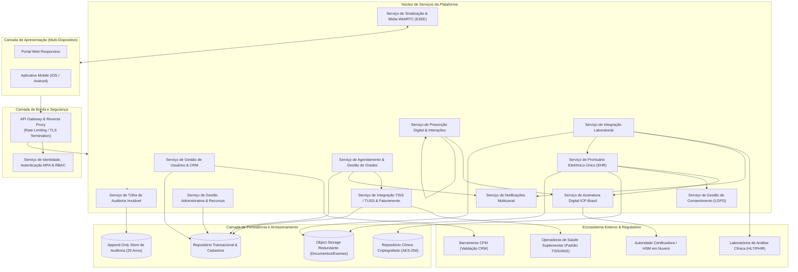
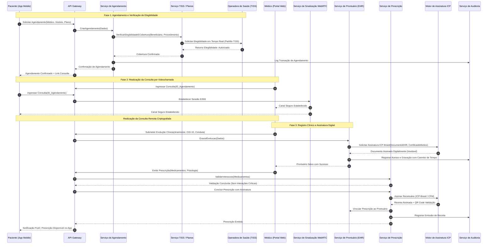

# Relatório Técnico de Arquitetura de Software

---

## 1. Identificação das HUs

Abaixo constam as Histórias de Usuário mapeadas a partir das necessidades dos stakeholders da Plataforma Integrada de Saúde Digital:

*   **HU01 — Cadastrar-se e consentir com o tratamento de dados de saúde**
    *   *Ator:* Paciente
    *   *Objetivo:* Cadastro na plataforma com registro formal e auditável de consentimento para tratamento de dados sensíveis de saúde (LGPD art. 11).
*   **HU02 — Agendar consulta presencial ou por videochamada**
    *   *Ator:* Paciente
    *   *Objetivo:* Agendamento de atendimentos com validação automática de cobertura e elegibilidade de plano de saúde em tempo real.
*   **HU03 — Participar de consulta por videochamada**
    *   *Ator:* Paciente / Médico
    *   *Objetivo:* Realização de teleconsulta segura via infraestrutura integrada com criptografia ponta a ponta e controle de sessão.
*   **HU04 — Visualizar prontuário e resultados de exames**
    *   *Ator:* Paciente
    *   *Objetivo:* Consulta unificada de histórico clínico, documentos, evoluções e exames com gestão de controle de acesso.
*   **HU05 — Acessar e compartilhar prescrição digital**
    *   *Ator:* Paciente
    *   *Objetivo:* Visualização e exportação de receituários eletrônicos com assinatura digital e mecanismo de verificação pública.
*   **HU06 — Receber notificação de resultado de exame disponível**
    *   *Ator:* Paciente
    *   *Objetivo:* Notificação multicanal proativa assim que laudos e exames forem integrados ao repositório clínico.
*   **HU07 — Validar cadastro com CRM ativo**
    *   *Ator:* Médico
    *   *Objetivo:* Validação federada de credenciais profissionais junto ao Conselho Federal de Medicina (CFM) no onboarding e de forma periódica.
*   **HU08 — Registrar evolução clínica no prontuário**
    *   *Ator:* Médico
    *   *Objetivo:* Lançamento estruturado de prontuário eletrônico (anamnese, CID, conduta) com imutabilidade garantida por assinatura digital.
*   **HU09 — Emitir prescrição digital com validade jurídica**
    *   *Ator:* Médico
    *   *Objetivo:* Prescrição eletrônica de medicamentos com checagem de interações medicamentosas e assinatura digital padrão ICP-Brasil.
*   **HU10 — Solicitar exame e receber resultado com alerta de valor crítico**
    *   *Ator:* Médico
    *   *Objetivo:* Pedido eletrônico de exames para laboratórios parceiros e monitoramento de laudos com sinalização de biomarcadores críticos.
*   **HU11 — Acessar prontuário compartilhado entre especialidades**
    *   *Ator:* Médico
    *   *Objetivo:* Acesso transversal ao histórico clínico unificado do paciente, condicionado à verificação de consentimento prévio.
*   **HU12 — Gerenciar médicos e agendas da unidade**
    *   *Ator:* Administrador de Clínica / Hospital
    *   *Objetivo:* Governança de grades de atendimento, alocação de salas/equipamentos e monitoramento de capacidade instalada.
*   **HU13 — Acompanhar faturamento por convênio**
    *   *Ator:* Administrador de Clínica / Hospital
    *   *Objetivo:* Rastreamento de guias TISS geradas, autorizações prévias, faturamento e controle de glosas de operadoras de planos de saúde.
*   **HU14 — Processar autorização prévia de procedimentos**
    *   *Ator:* Operador de Plano de Saúde
    *   *Objetivo:* Recepção, análise de cobertura e retorno padronizado (TISS) de solicitações de autorização de procedimentos e consultas.

---

## 2. Diagramas de Arquitetura (Mermaid)

### 2.1. Diagrama de Contexto e Componentes Lógicos

---

### 2.2. Diagrama de Sequência: Agendamento com Elegibilidade e Atendimento Telemedicina com Prontuário e Prescrição

---

## 3. Decisões de Arquitetura

1.  **Arquitetura Orientada a Serviços Especializados (Decoupled Microservices Pattern)**
    *   *Decisão:* Desacoplamento de responsabilidades de agendamento, prontuário eletrônico, conformidade TISS e telechamada em serviços independentes.
    *   *Justificativa:* Garante escalabilidade horizontal pontual (RNF17), isolamento de falhas críticas de faturamento em relação a atendimentos de urgência e flexibilidade para ciclos de manutenção específicos.

2.  **Imutabilidade de Registros Clínicos e Append-Only Pattern**
    *   *Decisão:* Todo registro de prontuário, evolução ou laudo clínico, uma vez assinado digitalmente com certificado ICP-Brasil, torna-se estritamente imutável. Alterações ou correções só podem ser introduzidas como novos registros de adendo vinculados (RF25, RNF06, RNF10).
    *   *Justificativa:* Cumprimento estrito às resoluções CFM nº 1.821/2007 e CFM nº 2.314/2022, assegurando valor probatório jurídico e rastreabilidade contínua.

3.  **Segregação de Dados e Criptografia em Repouso e em Trânsito (Security by Design)**
    *   *Decisão:* Todo tráfego de rede utiliza TLS 1.2+ (RNF01); prontuários, laudos e documentos clínicos são cifrados em repouso com algoritmo AES-256 (RNF02); as credenciais de acesso utilizam algoritmos robustos de derivação de chave e hash unidirecional (RNF03). Videochamadas trafegam via protocolo WebRTC seguro com criptografia ponta a ponta sem persistência de stream de mídia (RNF04).
    *   *Justificativa:* Atendimento integral aos requisitos de segurança e aos preceitos da LGPD (Art. 11 sobre dados sensíveis de saúde) e normas do CFM.

4.  **Trilha de Auditoria Independente e Truncamento de Retenção de Longo Prazo**
    *   *Decisão:* Centralização de logs de auditoria em repositório dedicado estruturado no modelo *Write-Once-Read-Many* (WORM) lógico, registrando identificador de usuário, ação, objeto, carimbo de tempo (UTC) e IP/Sessão, mantendo retenção mandatória de no mínimo 20 anos (RF06, RNF11).
    *   *Justificativa:* Conformidade com a legislação federal de registros médicos e prevenção contra fraudes e acessos indevidos a dados de saúde.

5.  **Interoperabilidade Aberta Baseada em Padrões Setoriais (TISS, TUSS, HL7/FHIR)**
    *   *Decisão:* A comunicação externa com fontes de operadoras e laboratórios opera sobre adaptadores que normalizam dados para barramentos compatíveis com ANS/TISS (para convênios) e HL7 FHIR (para troca de laudos e resultados clínicos) (RF31, RF38, RNF09, RNF26).
    *   *Justificativa:* Redução de lock-in, simplificação do onboarding de novos laboratórios e padronização das rotinas de faturamento e auditoria da saúde suplementar.

---

## 4. Tabela de Componentes e Rastreabilidade

| Componente | Responsabilidade Principal | Comunica-se com | Origem (HU / Critério de Aceite) |
| :--- | :--- | :--- | :--- |
| **API Gateway & Reverse Proxy** | Ponto único de entrada, roteamento de requisições, rate limiting, controle de concorrência e terminação TLS. | Portal Web, App Mobile, Todos os Serviços do Núcleo | RNF01, RNF05, RNF17 |
| **Serviço de Identidade, MFA & RBAC** | Autenticação multifator (OTP/Biometria), gestão de sessões, expiração automática por inatividade e autorização RBAC. | API Gateway, UserService, AuditService | HU01, RF01, RF03, RF04, RF05, RNF03 |
| **Serviço de Gestão de Usuários & CRM** | Onboarding de usuários, ciclo de vida de contas e validação de regularidade de CRM médico junto ao CFM. | Barramento CFM, AuditService, DB Relacional | HU01, HU07, RF01, RF02 |
| **Serviço de Gestão de Consentimento** | Coleta, auditoria, validação e revogação do consentimento do paciente para tratamento e compartilhamento de prontuário. | EHRService, UserService, DB Relacional | HU01, HU04, HU11, RF23, RNF07, RNF12 |
| **Serviço de Agendamento & Grade** | Gestão de disponibilidade médica, agendamento de consultas presenciais/virtuais, cancelamentos e encaixes de urgência. | HealthPlanService, NotificationService, AuditService, DB Relacional | HU02, HU12, RF07, RF08, RF10, RF12, RF13 |
| **Serviço de Teleconsulta WebRTC** | Sinalização, intermediação de sessões de vídeo/áudio ponto a ponta (E2EE), controle de tempo e compartilhamento de anexos em tempo real. | Portal Web, App Mobile, EHRService, AuditService | HU03, RF14, RF15, RF16, RF17, RF18, RNF04, RNF16, RNF22 |
| **Serviço de Prontuário Eletrônico (EHR)** | Armazenamento e recuperação de dados clínicos unificados (anamnese, CID, evolução, laudos), aplicando imutabilidade pós-assinatura. | ConsentService, SignEngine, ObjectStorage, EHRStore, AuditService | HU04, HU08, HU11, RF19, RF20, RF21, RF22, RF24, RF25, RNF02, RNF10, RNF15 |
| **Serviço de Prescrição Digital** | Emissão de receitas médicas, checagem automatizada de interações medicamentosas, validação de receituário especial e geração de QR Code. | EHRService, SignEngine, AuditService, NotificationService | HU05, HU09, RF26, RF27, RF28, RF29, RF30, RNF06 |
| **Motor de Assinatura Digital ICP-Brasil** | Execução e validação de assinaturas digitais com e-CPF / certificados em nuvem homologados conforme normas do CFM/ITI. | Autoridades Certificadoras ICP-Brasil, EHRService, PrescriptionService | HU08, HU09, RF25, RF27, RNF06, RNF08 |
| **Serviço de Integração Laboratorial** | Roteamento de pedidos de exames e ingestão assíncrona de resultados de parceiros em formato padronizado, emitindo alertas de parâmetros críticos. | Parceiros Laboratoriais (HL7/FHIR), EHRService, NotificationService, ObjectStorage | HU06, HU10, RF31, RF32, RF33, RF34, RF35, RNF26 |
| **Serviço TISS / Planos de Saúde** | Validação em tempo real de elegibilidade, verificação de coberturas TUSS, solicitação de autorizações prévias e processamento de faturamento TISS. | Operadoras de Saúde (TISS/ANS), ScheduleService, AuditService, DB Relacional | HU02, HU13, HU14, RF09, RF36, RF37, RF38, RF39, RF40, RF41, RNF09, RNF14, RNF26 |
| **Serviço de Notificações Multicanal** | Disparo de alertas em tempo real (Push Notifications e E-mails transacionais) para eventos clínicos, agendamentos e prazos. | App Mobile, Portal Web, ScheduleService, LabService, PrescriptionService | HU02, HU03, HU06, HU10, RF11, RF18, RF32 |
| **Serviço de Gestão Administrativa & Relatórios** | Configuração de clínicas/unidades, alocação de salas/recursos, monitoramento de métricas operacionais, taxa de ocupação e faturamento. | DB Relacional, EHRStore, TISSService | HU12, HU13, RF42, RF43, RF44, RF45, RF46, RNF25 |
| **Serviço Central de Auditoria** | Coleta unificada de logs de acessos a dados sensíveis, geração de trilha imutável para compliance regulatório de 20 anos. | Todos os componentes do ecossistema, AuditLogStore | RF06, RNF11 |

---

## 5. Bloqueios e Pendências

1.  **Mecanismo de Conectividade com Barramento do CFM**
    *   *Bloqueio:* A especificação de integração oficial com a base do Conselho Federal de Medicina (CFM) para checagem em tempo real de CRM ativo e suspensões requer definição do modelo de credenciamento (API REST com mTLS ou web services SOAP).
    *   *Ação:* Obter junto ao órgão de classe o convênio técnico de interoperabilidade para homologação da rotina assíncrona/síncrona de consulta cadastral.
2.  **Protocolos Específicos de Conectividade com Operadoras (Padrão TISS)**
    *   *Bloqueio:* Embora o padrão ANS TISS determine esquemas XML padronizados, a forma de transporte varia substancialmente entre operadoras de planos de saúde (WebServices proprietários, AS2, barramentos de mensageria).
    *   *Ação:* Estruturar uma camada adaptadora com suporte a múltiplos drivers de comunicação para isolar a variabilidade de cada operadora de plano de saúde.
3.  **Provedor de Certificação Digital em Nuvem (HSM ICP-Brasil)**
    *   *Pendência:* Necessidade de definição do protocolo de integração com os emissores de certificado digital em nuvem (PSC homologados pelo ITI/CFM) utilizados pelos médicos.

---

## 6. Cobertura de Requisitos

A matriz abaixo estabelece a cobertura dos Requisitos Funcionais e Não Funcionais pelo design arquitetural proposto:

*   **RF01 a RF06 (Acesso e Identidade):** Cobertos pelo *Serviço de Identidade, MFA & RBAC*, *Serviço de Gestão de Usuários & CRM* e *Serviço Central de Auditoria*.
*   **RF07 a RF13 (Agendamento de Consultas):** Cobertos pelo *Serviço de Agendamento & Grade*, integrado ao *Serviço TISS / Planos de Saúde* e *Serviço de Notificações*.
*   **RF14 a RF18 (Videochamada e Telemedicina):** Cobertos pelo *Serviço de Teleconsulta WebRTC* e *Serviço de Notificações*.
*   **RF19 a RF25 (Prontuário Eletrônico Único):** Cobertos pelo *Serviço de Prontuário Eletrônico (EHR)*, *Serviço de Gestão de Consentimento* e *Motor de Assinatura Digital ICP-Brasil*.
*   **RF26 a RF30 (Prescrição Digital):** Cobertos pelo *Serviço de Prescrição Digital* e *Motor de Assinatura Digital ICP-Brasil*.
*   **RF31 a RF35 (Integração com Laboratórios):** Cobertos pelo *Serviço de Integração Laboratorial*, com persistência em *Object Storage* e notificações via *Serviço de Notificações*.
*   **RF36 a RF41 (Planos de Saúde & Faturamento):** Cobertos pelo *Serviço TISS / Planos de Saúde*.
*   **RF42 a RF46 (Módulo Administrativo):** Cobertos pelo *Serviço de Gestão Administrativa & Relatórios*.
*   **RNF01 a RNF06 (Segurança):** Cobertos pelo *API Gateway*, criptografia de repositórios (AES-256), hashing seguro de senhas, WebRTC E2EE e *Motor de Assinatura ICP-Brasil*.
*   **RNF07 a RNF12 (Conformidade Regulatória):** Cobertos pelo *Serviço de Gestão de Consentimento*, *Serviço Central de Auditoria* (retenção de 20 anos), formatos TISS e padrões CFM/SBIS.
*   **RNF13 a RNF18 (Disponibilidade, Desempenho e Resiliência):** Cobertos pela segregação em microsserviços com escalonamento horizontal, *Object Storage* georredundante e SLAs definidos de latência para consultas/elegibilidade.
*   **RNF19 a RNF22 (Usabilidade e Compatibilidade):** Cobertos pelas interfaces unificadas multiplataforma (Web responsivo e Mobile iOS/Android) aderentes a WCAG 2.1 AA.
*   **RNF23 a RNF26 (Infraestrutura, Dados e Interoperabilidade):** Cobertos pelo modelo em múltiplas zonas de disponibilidade (Multi-AZ), políticas de backup contínuo (RPO 1h, RTO 4h) e integração via HL7 FHIR e TISS.

---

## 7. Gap Analysis

| Item / Funcionalidade | Lacuna Identificada | Impacto Arquitetural | Ação Recomendada |
| :--- | :--- | :--- | :--- |
| **Resolução de Conflitos em Agendamento Concorrente** | Os requisitos não detalham o comportamento do sistema quando dois pacientes tentam reservar o mesmo slot de agenda simultaneamente. | Risco de *double-booking* e inconsistência de dados na camada transacional. | Implementar mecanismo de bloqueio otimista/pessimista temporário (reserva transitória de 5 minutos durante o checkout do agendamento). |
| **Modo de Contingência para Falha de Operadora (TISS Off-line)** | Não há especificação do procedimento caso a operadora de plano de saúde esteja fora do ar durante a validação em tempo real (limite de 5s). | Bloqueio indevido de agendamentos e atendimentos de pacientes elegíveis. | Criar fluxo de contingência arquitetural: autorização condicional com reprocessamento assíncrono e aviso de pendência financeira. |
| **Armazenamento e Anonimização para Telemetria Clínica** | Falta definição sobre o uso de dados clínicos para painéis de BI e métricas sem ferir as restrições de dados sensíveis da LGPD. | Risco de vazamento de dados identificáveis em dashboards de relatórios administrativos. | Adicionar um módulo de pipeline de dados com mascaramento e anonimização/pseudonimização automática antes de carregar métricas gerenciais. |
| **Validação de Assinatura Off-line em Farmácias** | O requisito não detalha o ciclo de dispensação do medicamento na farmácia parceira. | Dificuldade em assegurar o uso único de receitas de controle especial em diferentes estabelecimentos. | Implementar endpoint público de verificação com validação de status de dispensação via QR Code, conforme diretrizes do CFM/ITI. |