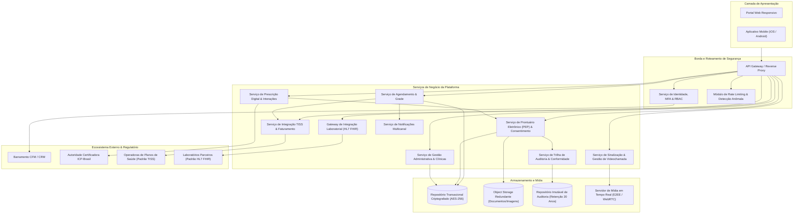
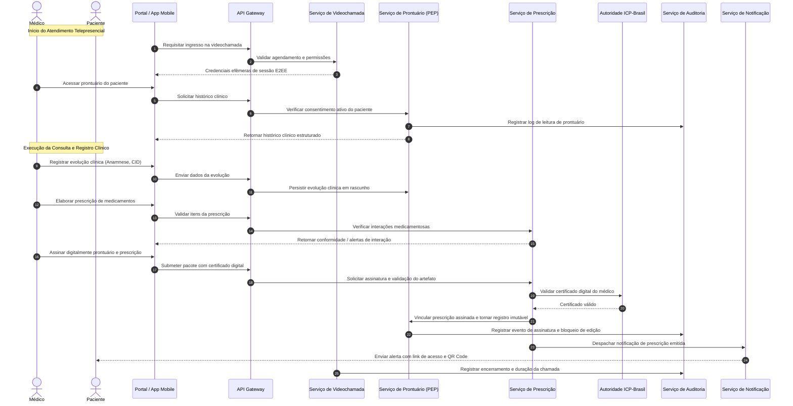

# Relatório Técnico de Arquitetura de Software

## 1. Identificação das HUs

| ID | Perfil | Título / Descrição Sintética | Critérios-Chave de Aceite |
| :--- | :--- | :--- | :--- |
| **HU01** | Paciente | Cadastro e consentimento para tratamento de dados | Coleta de dados pessoais/plano; registro temporal de consentimento explícito (LGPD Art. 11); capacidade de revogação. |
| **HU02** | Paciente | Agendamento de consulta presencial/remota | Consulta à disponibilidade em tempo real; validação prévia de cobertura com operadora; disparos de confirmação (push/e-mail). |
| **HU03** | Paciente | Participação em consulta por videochamada | Liberação de sala 5 min antes; transmissão E2EE sem gravação; troca de arquivos durante a sessão. |
| **HU04** | Paciente | Visualização de prontuário e exames | Acesso unificado a histórico, laudos e receitas; download de exames em PDF; bloqueio de acesso sem consentimento. |
| **HU05** | Paciente | Acesso e compartilhamento de prescrição digital | Exibição de assinatura digital e QR Code; exportação e compartilhamento; segregação de receituário de controle especial. |
| **HU06** | Paciente | Notificação de disponibilização de exames | Alerta imediato multicanal; identificação de laboratório/tipo de exame; integração automática ao prontuário. |
| **HU07** | Médico | Validação cadastral com CRM ativo | Consulta automatizada ao CFM/CRM; bloqueio em caso de inativação/suspensão; rotina periódica de revalidação. |
| **HU08** | Médico | Registro de evolução clínica no prontuário | Registro estruturado (anamnese, CID, conduta); imutabilidade pós-assinatura digital; suporte a adendos auditados. |
| **HU09** | Médico | Emissão de prescrição digital homologada | Assinatura digital ICP-Brasil; validação de interações medicamentosas; vinculação automática ao prontuário. |
| **HU10** | Médico | Solicitação de exames e alerta de valores críticos | Envio eletrônico ao laboratório; alerta prioritário para valores críticos fora do intervalo de referência. |
| **HU11** | Médico | Acesso a prontuário compartilhado | Acesso condicionado a consentimento explícito; log detalhado de auditoria com justificativa clínica. |
| **HU12** | Administrador | Gestão de médicos e agendas da unidade | Configuração de grade de atendimento; painel de taxa de ocupação; proteção contra cancelamentos indevidos. |
| **HU13** | Administrador | Gestão financeira e faturamento TISS | Relatório de faturamento consolidado por convênio, glosas e autorizações; exportação de dados (CSV/PDF). |
| **HU14** | Operadora | Autorização prévia de procedimentos (TISS) | Recepção de guias no padrão TISS; resposta eletrônica com prazo máximo e codificação formal de eventuais negativas. |

---

## 2. Diagramas de Arquitetura (Mermaid)

### 2.1. Visão Estrutural de Componentes

### 2.2. Diagrama de Sequência: Ciclo de Atendimento, Prontuário e Prescrição

---

## 3. Decisões de Arquitetura

1. **Estilo Arquitetural Modular Orientado a Serviços:**
   * *Justificativa:* Atendimento aos requisitos de escalabilidade horizontal (RNF17), manutenibilidade (RNF25) e desacoplamento de responsabilidades regulatórias complexas (TISS, HL7 FHIR, Prontuário Eletrônico).
2. **Segregação de Segurança em Camadas (Defense-in-Depth):**
   * *Justificativa:* Adoção de autenticação multifator (RF03), criptografia de dados em trânsito com TLS 1.2+ (RNF01) e criptografia em repouso com algoritmo padrão AES-256 (RNF02).
3. **Controle de Acesso Baseado em Políticas de Consentimento (ABAC/RBAC):**
   * *Justificativa:* Cumprimento do Artigo 11 da LGPD (RNF07) e normas do CFM (RNF08, RF23), garantindo que apenas médicos explicitamente autorizados pelo paciente acessem o prontuário entre especialidades distintas.
4. **Imutabilidade de Registros Clínicos (WORM Pattern):**
   * *Justificativa:* Assegurar conformidade com a Resolução CFM nº 1.821/2007 (RNF10, RF25), bloqueando atualizações e exclusões pós-assinatura e permitindo somente adendos versionados.
5. **Comunicação de Mídia em Tempo Real Ponto a Ponto Criptografada (E2EE):**
   * *Justificativa:* Garantir baixa latência (<150ms) e resolução adequada (RNF16) sem armazenar fluxos de áudio/vídeo em servidores da aplicação (RNF04).
6. **Padronização de Interoperabilidade em Saúde:**
   * *Justificativa:* Uso rigoroso dos padrões TISS/TUSS da ANS (RF36-RF40, RNF09) para transações de saúde suplementar e HL7 FHIR (RF31, RNF26) para integrações laboratoriais.

---

## 4. Tabela de Componentes e Rastreabilidade

| Componente | Responsabilidade Principal | Comunica-se com | Origem (HU / Critério de Aceite) |
| :--- | :--- | :--- | :--- |
| **API Gateway & Rate Limiter** | Ponto único de entrada, terminação TLS, controle de vazão e detecção de anomalias. | Clientes Web/Mobile, Serviço de Identidade, Serviços de Negócio | RNF01, RNF05, RNF13 |
| **Serviço de Identidade, MFA & RBAC** | Gestão de credenciais seguras, autenticação multifator, autorização RBAC e verificação de CRM no CFM. | Barramento CFM, Repositório Transacional, Audit Log | RF01, RF02, RF03, RF04, RF05, HU01, HU07 |
| **Serviço de Agendamento & Grade** | Gerenciamento de disponibilidade médica, agendamentos, remarcações, encaixes e bloqueios de agenda. | TISSSvc, NotifySvc, RelationalData | RF07, RF08, RF10, RF12, RF13, HU02, HU12 |
| **Serviço de Gestão de Videochamada** | Gestão de sessões, sinalização WebRTC, tokens de acesso efêmeros e auditoria de duração de chamadas. | VideoMediaServer, AuditSvc, NotifySvc | RF14, RF15, RF16, RF17, RF18, RNF04, RNF16, HU03 |
| **Serviço de Prontuário Eletrônico (PEP)** | Gestão de registros clínicos, controle de consentimento, histórico, garantia de imutabilidade e anexos. | ObjectStorage, AuditSvc, PrescriptionSvc, RelationalData | RF19, RF20, RF21, RF22, RF23, RF24, RF25, RNF10, HU04, HU08, HU11 |
| **Serviço de Prescrição Digital** | Emissão de receitas, validação de interações medicamentosas, integração com certificados ICP-Brasil. | ICP_PKI, EHRSvc, NotifySvc, RelationalData | RF26, RF27, RF28, RF29, RF30, RNF06, HU05, HU09 |
| **Gateway de Integração Laboratorial** | Recepção de laudos em padrão HL7 FHIR, solicitação de exames e emissão de alertas de valores críticos. | PartnerLabs, EHRSvc, NotifySvc | RF31, RF32, RF33, RF34, RF35, RNF26, HU06, HU10 |
| **Serviço TISS & Faturamento** | Verificação de elegibilidade em tempo real (<5s), geração de guias TISS, autorização prévia e faturamento. | HealthInsurers, ScheduleSvc, AdminSvc | RF36, RF37, RF38, RF39, RF40, RF41, RNF09, RNF14, HU13, HU14 |
| **Serviço de Gestão Administrativa** | Gestão de estabelecimentos, unidades, salas, equipamentos e extração de relatórios gerenciais/analíticos. | RelationalData, TISSSvc, ScheduleSvc | RF42, RF43, RF44, RF45, RF46, HU12, HU13 |
| **Serviço de Notificações Multicanal** | Disparo coordenado de alertas via push notification e e-mail transacional. | Clientes Web/Mobile, ScheduleSvc, LabGatewaySvc, PrescSvc | RF11, RF18, RF32, HU02, HU06, HU10 |
| **Serviço de Auditoria & Trilha Imutável** | Armazenamento de logs com carimbo de tempo para retenção mínima de 20 anos. | AuditLogStore, Todos os Serviços Core | RF06, RNF11, RNF12, HU08, HU11 |

---

## 5. Bloqueios e Pendências

1. **Disponibilidade e SLA da API do CFM:**
   * *Pendência:* O tempo de resposta e o contrato formal da interface de validação de CRM do CFM precisam ser validados com estratégia de contingência para evitar bloqueios no cadastro caso a API externa fique indisponível.
2. **Homologação da Infraestrutura de Assinatura ICP-Brasil em Nuvem:**
   * *Pendência:* Definição dos protocolos de integração (PSC/OAuth2) para certificados digitais remotos corporativos e e-CPF em nuvem homologados pelo CFM.
3. **Mecanismo de Tolerância a Falhas na Elegibilidade TISS:**
   * *Pendência:* Estabelecer o comportamento do agendamento e da admissão caso o serviço da operadora de saúde ultrapasse a meta de 5 segundos (RNF14) ou apresente indisponibilidade transitória.
4. **Política de Alta Concorrência para Encaixes de Urgência:**
   * *Pendência:* Definição de estratégia de concorrência pessimista/otimista ao alocar horários de encaixe urgente (RF13) simultaneamente à alteração de grade pelo administrador.

---

## 6. Cobertura de Requisitos

| Categoria | Requisitos Cobertos | Mecanismo Arquitetural de Atendimento |
| :--- | :--- | :--- |
| **Gestão de Acesso e Usuários** | RF01, RF02, RF03, RF04, RF05, RF06 | `Serviço de Identidade`, integração CFM, MFA e `Serviço de Auditoria`. |
| **Agendamento e Atendimento** | RF07, RF08, RF09, RF10, RF11, RF12, RF13 | `Serviço de Agendamento`, `Serviço TISS` e `Serviço de Notificações`. |
| **Videochamada Médica** | RF14, RF15, RF16, RF17, RF18 | `Serviço de Videochamada` com WebRTC E2EE sem gravação de mídia. |
| **Prontuário e Segurança Clínica** | RF19, RF20, RF21, RF22, RF23, RF24, RF25 | `Serviço de PEP`, Repositório WORM e gestão de consentimento LGPD. |
| **Prescrição Digital** | RF26, RF27, RF28, RF29, RF30 | `Serviço de Prescrição` com motor de interação e assinatura ICP-Brasil. |
| **Integração Laboratorial** | RF31, RF32, RF33, RF34, RF35 | `Gateway Laboratorial` com padronização HL7 FHIR e regras de valores críticos. |
| **Planos de Saúde e TISS** | RF36, RF37, RF38, RF39, RF40, RF41 | `Serviço TISS & Faturamento` com tabelas TUSS e guias regulatórias ANS. |
| **Administração e Governança** | RF42, RF43, RF44, RF45, RF46 | `Serviço de Gestão Administrativa` com geração de relatórios e métricas. |
| **Segurança e Criptografia** | RNF01, RNF02, RNF03, RNF04, RNF05, RNF06 | TLS 1.2+, AES-256 em repouso, hashing seguro e rate limiting no Gateway. |
| **Conformidade Regulatória** | RNF07, RNF08, RNF09, RNF10, RNF11, RNF12 | Módulo de consentimento (LGPD), trilha de auditoria de 20 anos e normas CFM/ANS. |
| **Disponibilidade e Desempenho** | RNF13, RNF14, RNF15, RNF16, RNF17, RNF18 | Arquitetura modular resiliente, redundância geográfica e cacheamento estratégico. |
| **Usabilidade e Infraestrutura** | RNF19, RNF20, RNF21, RNF22, RNF23, RNF24, RNF25, RNF26 | Multiplataforma, WCAG 2.1 AA, RPO ≤ 1h, RTO ≤ 4h e barramento HL7 FHIR/TISS. |

---

## 7. Gap Analysis

| Item Identificado | Impacto Arquitetural | Ação Recomendada |
| :--- | :--- | :--- |
| **Protocolo de Acesso Emergencial ("Break-Glass")** | Em situações de emergência médica, a exigência irrestrita de consentimento prévio do paciente (RF23/HU11) pode inviabilizar o socorro imediato. | Especificar fluxo excepcional de "Break-Glass" com justificativa obrigatória registrada e notificação compulsória ao paciente e DPO. |
| **Adaptação Dinâmica de Conectividade na Videochamada** | O requisito RNF16 exige 720p e latência ≤ 150ms, mas não define fallback em redes móveis degradadas (3G/4G instável). | Implementar mecanismo de adaptação dinâmica de bitrate/resolução com priorização contínua do canal de áudio. |
| **Ciclo de Vida do Repositório de Auditoria (20 Anos)** | O alto volume de logs de auditoria detalhados (RNF11) pode degradar desempenho e elevar custos operacionais de armazenamento ao longo do tempo. | Definir política de arquivamento em camadas (*data tiering* / *cold storage*) com assinatura digital em lote para garantir integridade e redução de custo. |
| **Tratamento de Glosas Parciais e Recursos TISS** | A especificação cobre a emissão do faturamento TISS, mas não detalha o fluxo de contestação/recurso de glosas de procedimentos recusados pelas operadoras. | Projetar submódulo de conciliação financeira e reenvio de lotes no `Serviço TISS & Faturamento`. |