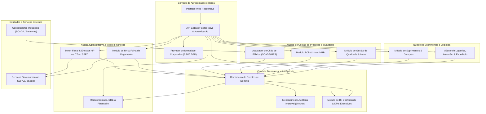
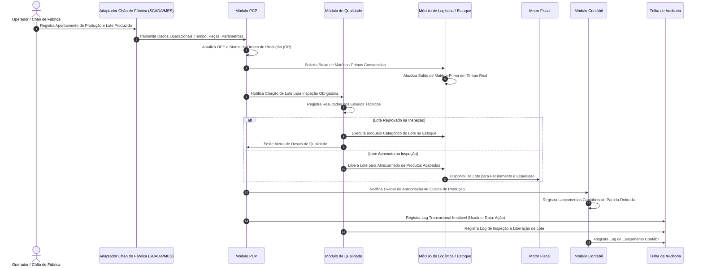

# Relatório Técnico de Arquitetura de Software

## 1. Identificação das HUs

| Identificador | Perfil do Usuário | Descrição Sintética | Valor de Negócio Agregado |
| :--- | :--- | :--- | :--- |
| **HU01** | Planejador de Produção (PCP) | Geração de Ordens de Produção (OP) e execução de cálculo de MRP. | Evita paradas de linha garantindo abastecimento preciso de insumos e matérias-primas. |
| **HU02** | Planejador de Produção (PCP) | Monitoramento em tempo real de OEE e emissão de alertas de desvios. | Aumenta a produtividade global dos centros de trabalho e mitiga gargalos operacionais. |
| **HU03** | Comprador / Gestor de Suprimentos | Gestão de cotações com múltiplos fornecedores e comparação de propostas. | Otimiza custos de aquisição e garante conformidade de alçadas de aprovação de compra. |
| **HU04** | Gestor de Suprimentos | Acompanhamento do histórico de desempenho de fornecedores (SLA/Qualidade). | Fundamenta decisões estratégicas de homologação e qualificação de fornecedores. |
| **HU05** | Analista de Qualidade | Registro de inspeção de lote e bloqueio automático de não conformes. | Impede contaminação da cadeia produtiva e envio de itens defeituosos aos clientes. |
| **HU06** | Analista de Qualidade | Rastreabilidade bidirecional ponta a ponta (do insumo ao produto acabado). | Viabiliza auditorias regulatórias eficientes e execuções seguras de *recall*. |
| **HU07** | Analista Fiscal / Faturamento | Emissão automática de NF-e/CT-e com cálculo tributário integrado. | Garante conformidade fiscal instantânea, mitigando riscos de autuações e atrasos de expedição. |
| **HU08** | Analista Fiscal | Manutenção e geração automatizada de obrigações SPED Fiscal. | Elimina retrabalho manual e assegura integridade das escriturações perante o fisco. |
| **HU09** | Analista de RH / Folha | Processamento mensal da folha integrado ao ponto e encargos. | Garante precisão no cálculo trabalhista, pontualidade de pagamento e compliance legal. |
| **HU10** | Analista de RH | Geração de obrigações acessórias trabalhistas (eSocial, RAIS, DIRF). | Assegura envio tempestivo das obrigações sindicais e governamentais. |
| **HU11** | Controller / Diretor Financeiro | Visualização em tempo real de DRE consolidada/centro de custo e Fluxo de Caixa. | Provê acurácia analítica para tomadas de decisão financeiras e alocação de capital. |
| **HU12** | Diretor / CEO (Executivo) | Acompanhamento centralizado de KPIs estratégicos via Dashboard Executivo. | Permite gestão à vista com rastreabilidade operacional de múltiplos sítios fabris. |

---

## 2. Diagramas de Arquitetura (Mermaid)

### 2.1. Diagrama Estrutural de Componentes e Fronteiras de Contexto



### 2.2. Diagrama de Sequência: Execução de Produção, Apontamento, Qualidade e Impacto Contábil



---

## 3. Decisões de Arquitetura

### DA-01: Arquitetura Orientada a Domínios com Comunicação Orientada a Eventos
- **Contexto:** A operação manufatureira abrange múltiplos processos interdependentes (produção, inspeção de qualidade, movimentação de estoque, faturamento e contabilização). Lógicas síncronas estritas criariam acoplamento excessivo e indisponibilidade em cascata.
- **Decisão:** Segmentar o sistema em módulos de domínio independentes integrados por um barramento de eventos de domínio transacionais. Eventos como `LoteInspecionado`, `ApontamentoRealizado` e `FaturamentoConcluido` acionam reações nos módulos de Logística, Contabilidade e Dashboards de forma desacoplada.
- **Consequências:** Alto desacoplamento, resiliência contra falhas parciais e escalabilidade operacional; demanda gerenciamento de consistência eventual para consolidações analíticas.

### DA-02: Multitenancy Hierárquico e Segregação de Funções (SoD)
- **Contexto:** Necessidade de suportar múltiplas plantas fabris (RNF16) com isolamento granular de dados operacionais (RF04) e controle estrito de acessos com segregação de funções em operações fiscais e financeiras (RNF03).
- **Decisão:** Implementar controle de acesso baseado em contexto hierárquico organizacional (Unidade Fabril -> Linha -> Centro de Trabalho) e papéis (RBAC). O contexto da requisição valida ativamente o escopo de dados antes de processar qualquer consulta ou mutação.
- **Consequências:** Garantia de isolamento e conformidade de governança corporativa; requer injeção e validação sistemática de contexto de segurança em todas as operações de serviço.

### DA-03: Gateway Fiscal Resiliente com Máquina de Estados de Contingência
- **Contexto:** A comunicação com serviços governamentais (SEFAZ) pode apresentar latências e indisponibilidades imprevisíveis, impactando o fluxo contínuo de expedição da fábrica (RNF15, RNF17).
- **Decisão:** Isolar a integração fiscal em um subsistema dedicado dotado de fila de processamento assíncrono e chaveamento automático para emissão em contingência offline quando a taxa de erro ou latência da SEFAZ exceder os limites configurados, seguido de reconciliação automática.
- **Consequências:** Blindagem das linhas de expedição contra interrupções externas; exige mecanismos robustos de controle transacional e tratamento de inconsistências pós-contingência.

### DA-04: Processamento Assíncrono para Cálculo de MRP e Grandes Volumes
- **Contexto:** O cálculo de necessidade de materiais (MRP) envolve a explosão recursiva de listas de materiais (BOM) para até 50.000 itens ativos com restrição de tempo de execução inferior a 10 minutos (RNF13).
- **Decisão:** Executar o motor de MRP por meio de processamento em lotes (*batch*) assíncrono com paralelização por níveis de estrutura do produto, isolado do fluxo transacional OLTP interativo.
- **Consequências:** Cumprimento dos SLAs de desempenho sem degradação na experiência do usuário do chão de fábrica; exige orquestração de tarefas e bloqueio otimista de concorrência em parâmetros de estoque.

### DA-05: Trilha de Auditoria Imutável com Retenção Prolongada
- **Contexto:** Exigência de conformidade com LGPD, CTN (retenção mínima de 10 anos) e rastreabilidade total de dados financeiros, fiscais e funcionais (RF03, RNF02, RNF10).
- **Decisão:** Implementar um serviço dedicado de trilha de auditoria append-only, com dados assinados e criptografados em repouso via padrão AES-256, separado do armazenamento transacional corrente.
- **Consequências:** Cumprimento rigoroso de compliance fiscal/legal e auditorias de segurança; demanda estratégias de particionamento e políticas de arquivamento para sustentabilidade do volume de dados.

---

## 4. Tabela de Componentes e Rastreabilidade

| Componente | Responsabilidade Principal | Comunica-se com | Origem (HU / Critério de Aceite) |
| :--- | :--- | :--- | :--- |
| **API Gateway & Autenticação** | Roteamento de requisições, controle de taxa (*rate limiting*), aplicação de políticas de segurança e mediação com provedor de identidade (SSO/LDAP). | Todos os módulos de domínio, Provedor de Identidade Corporativo. | RF01, RF02, RF04, RNF01, RNF04 |
| **Módulo PCP & Motor MRP** | Gestão de OPs, sequenciamento de capacidade, cálculo volumétrico de necessidades de materiais (MRP) e alertas de desvio. | Chão de Fábrica, Qualidade, Logística, Suprimentos, Barramento de Eventos. | HU01, HU02, RF05, RF06, RF07, RF08, RF09, RF10, RF12, RNF13 |
| **Adaptador de Chão de Fábrica** | Ingestão e normalização de telemetria industrial em tempo real proveniente de sistemas SCADA/MES via protocolos padronizados. | Sistemas Industriais (SCADA/MES), Módulo PCP, Barramento de Eventos. | HU02, RF11, RNF18 |
| **Módulo de Suprimentos & Compras** | Gestão do ciclo de aquisição, cotações multifornecedor, aprovação por alçadas, emissão de OCs e avaliação de fornecedores. | Módulo de Logística, Motor Fiscal, Barramento de Eventos. | HU03, HU04, RF13, RF14, RF15, RF16, RF17, RF18, RF19 |
| **Módulo de Qualidade & Lotes** | Definição de planos de ensaio, registro de laudos por lote, bloqueio de lotes não conformes, gestão de NC e genealogia de rastreabilidade. | Módulo PCP, Módulo de Logística, Barramento de Eventos. | HU05, HU06, RF20, RF21, RF22, RF23, RF24, RF25 |
| **Módulo de Logística & Expedição** | Endereçamento de armazém (WMS), controle de saldos de estoque, separação, montagem de romaneios, expedição e logística reversa (RMA). | Módulo PCP, Módulo de Qualidade, Motor Fiscal, Barramento de Eventos. | HU06, RF26, RF27, RF28, RF29, RF30 |
| **Motor Fiscal & Documentos Eletrônicos** | Cálculo automático de tributos (ICMS/IPI/PIS/COFINS), transmissão e contingência de NF-e/CT-e e geração de arquivos SPED. | Módulo de Logística, Módulo Contábil, Serviços Governamentais (SEFAZ), Barramento de Eventos. | HU07, HU08, RF31, RF32, RF33, RF34, RF35, RF36, RNF06, RNF07, RNF08, RNF15, RNF17 |
| **Módulo de RH & Folha de Pagamento** | Manutenção do cadastro de colaboradores, apuração de ponto eletrônico, processamento de folha, encargos e obrigações (eSocial/DIRF). | Módulo Contábil, Serviços Governamentais (eSocial), Barramento de Eventos. | HU09, HU10, RF37, RF38, RF39, RF40, RF41, RF42, RNF08, RNF09, RNF11 |
| **Módulo Contábil & Financeiro** | Lançamentos contábeis automáticos por partidas dobradas, apuração de DRE/Balanço/Fluxo de Caixa em tempo real, contas a pagar/receber e SPED ECD/EFD. | Barramento de Eventos, Módulo de Dashboards. | HU11, RF43, RF44, RF45, RF46, RF47, RF48, RF49, RNF02, RNF10 |
| **Módulo de Dashboards & KPIs** | Consolidação analítica em tempo real de índices operacionais (OEE), financeiros e de qualidade, permitindo drill-down transacional e exportações. | Todos os módulos de domínio via Barramento e repositório analítico. | HU02, HU04, HU12, RF50, RF51, RF52, RF53, RNF14 |
| **Mecanismo de Auditoria Imutável** | Captura, criptografia e guarda de eventos de negócio críticos com retenção decenal para fins de conformidade legal. | Barramento de Eventos, Repositório de Auditoria. | RF03, RNF02, RNF09, RNF10 |

---

## 5. Bloqueios e Pendências

1. **Definição de Taxonomia e Esquemas de Protocolos Industriais:**
   - *Pendência:* O requisito RNF18 menciona flexibilidade entre OPC-UA, MQTT e REST/JSON. É necessário estabelecer o catálogo de eventos padronizado de cada máquina e central de telemetria por unidade fabril para evitar a proliferação de adaptadores customizados.
2. **Motor de Regras Tributárias Configurável:**
   - *Pendência:* As constantes alterações na legislação tributária brasileira (ICMS interestadual, regimes especiais, regras de desoneração) exigem a definição da estratégia de atualização contínua de matrizes de regras fiscais sem demandar deploy de novas versões de software.
3. **Políticas de Retenção Conflitantes (LGPD vs. CTN):**
   - *Bloqueio/Pendência:* Necessidade de parecer jurídico e diretriz técnica para harmonizar o direito ao esquecimento/minimização de dados (LGPD - RNF09) com a obrigatoriedade de retenção de 10 anos de registros fiscais, contábeis e de folha de pagamento (CTN - RNF10).
4. **Alinhamento de Provedores de Câmbio em Tempo Real:**
   - *Pendência:* Para atendimento ao suporte multimoeda (RF49), é necessária a definição formal do barramento/serviço homologado para atualização periódica automatizada das taxas de câmbio oficiais.

---

## 6. Cobertura de Requisitos

```
[✓] RF01 a RF04  --> Cobertos por: API Gateway, Mecanismo de Auditoria e Multitenancy Hierárquico
[✓] RF05 a RF12  --> Cobertos por: Módulo PCP, Motor MRP, Adaptador de Chão de Fábrica e HU01/HU02
[✓] RF13 a RF19  --> Cobertos por: Módulo de Suprimentos & Compras e HU03/HU04
[✓] RF20 a RF25  --> Cobertos por: Módulo de Qualidade & Lotes e HU05/HU06
[✓] RF26 a RF30  --> Cobertos por: Módulo de Logística & Expedição e HU06
[✓] RF31 a RF36  --> Cobertos por: Motor Fiscal & Documentos Eletrônicos e HU07/HU08
[✓] RF37 a RF42  --> Cobertos por: Módulo de RH & Folha de Pagamento e HU09/HU10
[✓] RF43 a RF49  --> Cobertos por: Módulo Contábil & Financeiro e HU11
[✓] RF50 a RF53  --> Cobertos por: Módulo de Dashboards & KPIs e HU02/HU12
[✓] RNF01 a RNF05 --> Cobertos por: Padrões de Comunicação Segura (TLS 1.2+), Criptografia AES-256 e RBAC/SoD
[✓] RNF06 a RNF11 --> Cobertos por: Conformidade SEFAZ, eSocial, SPED, LGPD e Trilha de Auditoria 10 Anos
[✓] RNF12 a RNF17 --> Cobertos por: Dimensionamento Assíncrono do MRP, Gateway Fiscal com Contingência e SLAs
[✓] RNF18 a RNF20 --> Cobertos por: Adaptador SCADA/MES e APIs de Integração Documentadas
[✓] RNF21 a RNF24 --> Cobertos por: Mecanismos de Backup/WAL, Telemetria e Interface Web Responsiva
```

---

## 7. Gap Analysis

| Item Identificado | Lacuna de Especificação / Arquitetura | Impacto Arquitetural | Ação Recomendada |
| :--- | :--- | :--- | :--- |
| **Resiliência do Chão de Fábrica Offline** | Não está especificado o comportamento do apontamento de produção em caso de perda temporária de conectividade de rede na fábrica. | Possível perda de telemetria de produção e interrupção do registro de paradas de máquina. | Projetar um componente de *Edge Buffer* local na unidade fabril para enfileiramento transacional e sincronização com garantia de entrega (*store-and-forward*). |
| **Teto de Desempenho de Drill-Down em Dashboards** | RNF14 exige tempo de carga em até 5 segundos, enquanto RF52 e HU12 exigem drill-down de KPIs consolidados até a transação de origem em 3 cliques. | Consultas complexas em grandes bases transacionais podem degradar a performance OLTP e estourar o SLA. | Estabelecer visões materializadas segregadas para consultas analíticas sincronizadas via eventos, preservando as tabelas transacionais ativas. |
| **Assinatura Digital de Documentos Fiscais** | RF31 e RF35 definem emissão de NF-e/CT-e, mas não detalham o modelo de custódia e uso de certificados digitais (A1/A3) por filial. | A infraestrutura de emissão centralizada e assíncrona falha caso haja dependência de certificados em mídias físicas locais (A3). | Padronizar a exigência de certificados corporativos digitais no formato de software (A1) gerenciados centralmente pelo subsistema fiscal seguro. |
| **Mecanismo de Desfazimento Contábil (Estorno/Retificação)** | RF43 define contabilização automática, mas não detalha regras de estorno para eventos cancelados em cascata (ex.: cancelamento de NF-e ou rejeição de lote pós-apontamento). | Risco de inconsistência patrimonial caso estornos manuais sejam permitidos sem vínculo com o fato gerador. | Implementar máquina de estados contábil com estorno estrito referenciado ao identificador original do evento de domínio. |