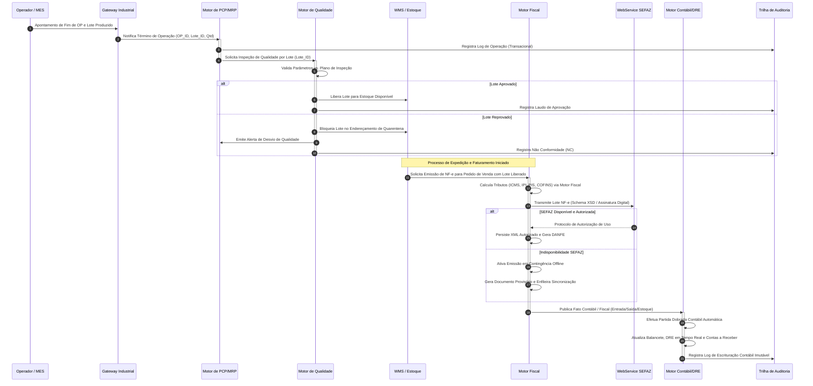

# Relatório Técnico de Arquitetura de Software

## 1. Identificação das HUs

| Identificador | Perfil do Usuário | Meta do Usuário (Objetivo) | Valor de Negócio |
| :--- | :--- | :--- | :--- |
| **HU01** | Planejador de Produção (PCP) | Criar ordens de produção (OP) e executar o cálculo de MRP com base no estoque e pedidos. | Assegura disponibilidade de matérias-primas e evita paradas na linha de manufatura. |
| **HU02** | Planejador de Produção (PCP) | Monitorar OEE dos centros de trabalho e receber alertas de desvios operacionais em tempo real. | Minimiza perdas de eficiência produtiva e viabiliza ações corretivas imediatas. |
| **HU03** | Comprador / Gestor de Suprimentos | Disparar cotações simultâneas para múltiplos fornecedores e comparar propostas com workflow de alçadas. | Otimiza custos de aquisição e garante governança no processo de compras. |
| **HU04** | Gestor de Suprimentos | Analisar o histórico de pontualidade, qualidade e custos de fornecedores por item e período. | Embaseia decisões de qualificação, homologação e descredenciamento de parceiros. |
| **HU05** | Analista de Qualidade | Registrar laudos de inspeção por lote e bloquear lotes reprovados no estoque. | Impede o avanço e a expedição de insumos ou produtos acabados não conformes. |
| **HU06** | Analista de Qualidade | Executar rastreabilidade bidirecional de lotes (do insumo recebido ao cliente final). | Atende a normas regulatórias e viabiliza auditorias e operações de recall com precisão. |
| **HU07** | Analista Fiscal / Faturamento | Emitir NF-e com motor de cálculo tributário automático e transmissão direta à SEFAZ (com contingência). | Garante conformidade fiscal, reduz tempo de faturamento e elimina erros de tributação. |
| **HU08** | Analista Fiscal | Manter registros do SPED Fiscal gerados a partir dos eventos transacionais de entrada/saída. | Garante integridade das obrigações acessórias sem necessidade de conciliação manual. |
| **HU09** | Analista de RH / DP | Processar a folha de pagamento integrada ao ponto eletrônico e gerar arquivos de remessa/eSocial. | Assegura pontualidade no pagamento e cumprimento rigoroso das leis trabalhistas. |
| **HU10** | Analista de RH | Emitir arquivos e obrigações trabalhistas oficiais (eSocial, CAGED, RAIS, DIRF) validados. | Evita autuações e multas por descumprimento de prazos e leiautes fiscais/trabalhistas. |
| **HU11** | Controller / Diretor Financeiro | Visualizar DRE e Fluxo de Caixa consolidados e por centro de custo em tempo real com drill-down. | Fornece visibilidade da saúde financeira da organização sem atraso de fechamento contábil. |
| **HU12** | Diretor / CEO (Executivo) | Acompanhar indicadores consolidados (OEE, receita, margem, qualidade) via painéis com drill-down. | Suporta a tomada de decisão estratégica fundamentada em dados em tempo real. |

---

## 2. Diagramas de Arquitetura (Mermaid)

### 2.1. Visão Geral de Componentes e Fronteiras de Contexto

```mermaid
flowchart TB
    subgraph ClientLayer [Camada de Apresentação e Borda]
        UI[Interface Web Responsiva / PWA]
        SSO[Serviço Corporativo de Identidade / LDAP / AD]
        API_GW[API Gateway & Rate Limiting Engine]
    end

    subgraph CoreServices [Núcleo de Serviços de Negócio]
        AuthModule[Serviço de Autenticação, RBAC e Auditoria]
        PCPModule[Motor de PCP, MRP e Capacidade]
        ProcurementModule[Módulo de Suprimentos e Compras]
        QualityModule[Módulo de Controle de Qualidade e Rastreabilidade]
        LogisticsModule[Módulo de Logística e Armazenagem WMS]
        FiscalModule[Motor Fiscal e Emissor SEFAZ]
        HRModule[Módulo de Recursos Humanos e Folha]
        FinanceModule[Motor Contábil, DRE e Financeiro]
        AnalyticsModule[Processador Analítico e KPIs]
    end

    subgraph IntegrationLayer [Camada de Integração Industrial e Mensageria]
        IndustrialGW[Gateway de Integração SCADA / MES - OPC-UA / MQTT]
        EventBroker[Barramento Corporativo de Eventos Transacionais]
    end

    subgraph PersistenceLayer [Camada de Persistência e Armazenamento Criptografado]
        TransactionalDB[(Repositório Transacional Central)]
        AuditStore[(Trilha de Auditoria Imutável - WORM)]
        DocumentStore[(Armazenamento de Documentos Fiscais e XMLs)]
    end

    subgraph ExternalEntities [Entidades e Sistemas Externos]
        SEFAZ[Serviços SEFAZ / Portais Governamentais]
        PlantFloor[Equipamentos de Chão de Fábrica / Sensores]
        BankingSystem[Sistemas Bancários / Remessas]
    end

    %% Conexões de Borda
    UI -->|HTTPS / TLS 1.2+| API_GW
    API_GW --> AuthModule
    AuthModule -.->|SSO Sync| SSO

    %% Conexões do Gateway para os Serviços
    API_GW --> PCPModule
    API_GW --> ProcurementModule
    API_GW --> QualityModule
    API_GW --> LogisticsModule
    API_GW --> FiscalModule
    API_GW --> HRModule
    API_GW --> FinanceModule
    API_GW --> AnalyticsModule

    %% Integração Industrial
    PlantFloor -->|Protocolo Industrial| IndustrialGW
    IndustrialGW -->|Eventos de Apontamento/Status| EventBroker
    EventBroker --> PCPModule

    %% Eventos e Acoplamento Assíncrono
    PCPModule -->|Evento de Consumo/Produção| EventBroker
    ProcurementModule -->|Evento de Recebimento| EventBroker
    QualityModule -->|Bloqueio de Lote/Laudo| EventBroker
    LogisticsModule -->|Evento de Expedição| EventBroker
    FiscalModule -->|Lançamento Fiscal Concluído| EventBroker
    HRModule -->|Fechamento de Folha| EventBroker

    EventBroker --> FinanceModule
    EventBroker --> AnalyticsModule

    %% Integrações Externas
    FiscalModule -->|Transmissão e Contingência| SEFAZ
    HRModule -->|Transmissão eSocial| SEFAZ
    FinanceModule -->|Arquivos CNAB / Pagamentos| BankingSystem

    %% Persistência
    CoreServices --> TransactionalDB
    AuthModule --> AuditStore
    FiscalModule --> DocumentStore
```



### 2.2. Diagrama de Sequência: Apontamento Produtivo, Inspeção, Faturamento e Reflexo Contábil



---

## 3. Decisões de Arquitetura

### Decisão 01: Arquitetura Orientada a Serviços Modulares com Comunicação Híbrida (Síncrona/Assíncrona)
* **Contexto:** O sistema atende múltiplos domínios funcionais complexos (PCP, Fiscal, Qualidade, RH, Contabilidade) com exigências simultâneas de consistência transacional imediata (emissão de NF-e, bloqueio de estoque) e processamento em lote/tempo real com alto throughput (integração SCADA/MES, recálculo de DRE e MRP).
* **Decisão:** Adota-se o padrão de Serviços Modulares desacoplados internamente por contratos bem definidos. Operações de comando e consulta diretas de interface utilizam APIs com protocolo de comunicação segura; fluxos intermodulares de propagação de eventos (como lançamentos contábeis a partir de produção ou compras) operam via Barramento Corporativo de Eventos com semântica de entrega garantida.
* **Consequências:** Garante baixo acoplamento entre os módulos, resiliência do sistema (falhas em módulos não críticos não interrompem a fábrica) e facilita a manutenção independente dos domínios.

### Decisão 02: Motor de Rastreabilidade e Isolamento Multi-Unidade com Segregação por Domínio Organizacional
* **Contexto:** RF01, RF04 e RNF16 exigem operação corporativa centralizada para múltiplas plantas industriais, isolando o acesso a dados transacionais entre unidades conforme a hierarquia da organização, mantendo a consolidação contábil/analítica corporativa.
* **Decisão:** Implementação de chave de particionamento lógico-organizacional transversal (*Tenant/Plant Identifier*) em todas as entidades e modelos de persistência, acoplado ao contexto de segurança validado no API Gateway e no módulo de Autorização (RBAC). Acesso cruzado entre unidades fabris é bloqueado por padrão nas camadas de aplicação e repositório, exceto para perfis executivos/corporativos consolidados.
* **Consequências:** Elimina vazamento de dados operacionais entre fábricas, permite consolidação analítica imediata e mantém a governança de acesso estrita.

### Decisão 03: Motor de Processamento Transacional Contábil e DRE Baseado em Livro-Razão Contínuo
* **Contexto:** RF43, RF45 e HU11 determinam que toda e qualquer movimentação física ou financeira (vendas, compras, consumo de insumos, folha) deve gerar lançamentos contábeis automáticos e manter a DRE e Fluxo de Caixa atualizados em tempo real sem dependência de rotinas batch de fechamento manual.
* **Decisão:** Adoção do padrão de *Contabilidade por Eventos de Domínio*. Cada evento transacional aprovado dispara um manipulador contábil síncrono ou quase real-time que converte o fato em lançamentos em partidas dobradas, atualizando saldos pré-agregados por centro de custo em estruturas otimizadas para leitura rápida (Read-Optimized Models).
* **Consequências:** Disponibilidade imediata da DRE e Balanço com suporte total a drill-down até a transação originadora, reduzindo a complexidade de conciliação no encerramento de períodos fiscais.

### Decisão 04: Estratégia de Resiliência Fiscal e Chaveamento Automático de Contingência
* **Contexto:** RF31, RF34, RNF07 e RNF17 exigem que o faturamento e a expedição de mercadorias não sejam paralisados por instabilidade ou queda de comunicação com os servidores estaduais da SEFAZ.
* **Decisão:** Implementação do padrão *Circuit Breaker* associado a um Motor de Emissão em Contingência. Se a comunicação síncrona com a SEFAZ falhar ou atingir timeout limite (30 segundos), o motor fiscal comuta automaticamente para o modo de emissão em contingência autorizado (geração do documento assinado com marcação específica), liberando a expedição física e enfileirando o documento para sincronização e conciliação assim que o circuito for restabelecido.
* **Consequências:** Elimina o represamento na expedição fabril, mitigando perdas financeiras e operacionais causadas por fatores externos.

---

## 4. Tabela de Componentes e Rastreabilidade

| Componente | Responsabilidade Principal | Comunica-se com | Origem (HU / Critério de Aceite) |
| :--- | :--- | :--- | :--- |
| **Auth & Security Core** | Gerenciar autenticação SSO/LDAP, RBAC, segregação de funções (SoD), rate limiting e trilha de auditoria imutável criptografada (AES-256). | API Gateway, Diretório Corporativo (LDAP/AD), Repositório de Auditoria, Todos os Módulos de Negócio. | RF01, RF02, RF03, RF04, RNF01, RNF02, RNF03, RNF04, RNF05, RNF09, RNF10. |
| **PCP & MRP Engine** | Planejar capacidade, gerar OPs, calcular necessidades líquidas de materiais (MRP) em até 10 min, apontar ordens e gerenciar OEE. | Gateway Industrial, Suprimentos, Qualidade, WMS/Estoque, Barramento de Eventos. | RF05, RF06, RF07, RF08, RF09, RF10, RF12, RNF13, HU01, HU02. |
| **Industrial Gateway** | Realizar a ingestão em tempo real de telemetria, eventos e apontamentos de máquinas via protocolos padrão (OPC-UA, MQTT, REST). | Chão de Fábrica (SCADA/MES), Barramento de Eventos, PCP Engine. | RF11, RNF18, HU02. |
| **Procurement Core** | Gerenciar fornecedores, compras automáticas por ponto de reabastecimento, cotações comparativas, fluxo de alçadas de OC e devoluções. | Barramento de Eventos, PCP Engine, WMS/Estoque, Qualidade, Financeiro. | RF13, RF14, RF15, RF16, RF17, RF18, RF19, HU03, HU04. |
| **Quality & Traceability Manager** | Gerenciar planos de inspeção, registrar laudos, executar bloqueio automático de lotes não conformes e prover rastreabilidade bidirecional fim a fim. | WMS/Estoque, PCP Engine, Procurement, Fiscal, Barramento de Eventos. | RF20, RF21, RF22, RF23, RF24, RF25, HU05, HU06. |
| **WMS & Logistics Core** | Controlar endereçamento de armazenagem de insumos e acabados, romaneios, planejamento de expedição e rastreamento de entregas/RMA. | Qualidade, Fiscal Engine, PCP Engine, Barramento de Eventos. | RF26, RF27, RF28, RF29, RF30, HU06, HU07. |
| **Fiscal Engine & SEFAZ Gateway** | Calcular tributos (ICMS, IPI, PIS, COFINS, ISS), gerar XMLs, transmitir NF-e/CT-e à SEFAZ, gerenciar contingência offline e alimentar SPED. | SEFAZ, WMS/Expedição, Barramento de Eventos, Motor Contábil. | RF31, RF32, RF33, RF34, RF35, RF36, RNF06, RNF07, RNF08, RNF15, RNF17, HU07, HU08. |
| **HR & Payroll Engine** | Processar ponto eletrônico, calcular folha de pagamento, encargos trabalhistas, benefícios e gerar obrigações (eSocial, CAGED, RAIS, DIRF). | Ponto Eletrônico, Entidades Bancárias, Órgãos do Governo (eSocial), Motor Contábil. | RF37, RF38, RF39, RF40, RF41, RF42, RNF08, RNF09, RNF11, HU09, HU10. |
| **Accounting & Financial Core** | Realizar lançamentos em partidas dobradas automáticos, gerenciar contas a pagar/receber, conciliação multimoeda, DRE e Balanço em tempo real. | Barramento de Eventos, Todos os Módulos de Origem Transacional, Repositório Central. | RF43, RF44, RF45, RF46, RF47, RF48, RF49, HU11. |
| **Executive Analytics & KPI Processor** | Consolidar indicadores de desempenho (OEE, faturamento, margem, desvios) com suporte a drill-down em tempo real e exportação. | Todos os Módulos de Negócio, Interface Web Responsiva, Repositório de Leitura. | RF50, RF51, RF52, RF53, RNF14, HU02, HU04, HU11, HU12. |

---

## 5. Bloqueios e Pendências

1. **Topologia de Implantação e Latência entre Plantas (RNF22 / RNF16):**
   * *Pendência:* A definição da infraestrutura híbrida ou nuvem privada necessita de validação quanto ao link de dados de cada unidade fabril, para assegurar que a latência não degrade o tempo de resposta do apontamento de chão de fábrica e do motor fiscal.
   * *Ação:* Estabelecer arquitetura com buffer local no Gateway Industrial para permitir apontamentos offline no chão de fábrica sem parada de linha.

2. **Certificados Digitais A1/A3 e Hardware de Assinatura (RNF07 / RF31):**
   * *Pendência:* Os requisitos não especificam o modelo de custódia dos certificados digitais (A1 em nuvem/servidor seguro corporativo ou A3 local por CNPJ de filial).
   * *Ação:* Homologar o uso de certificados padrão A1 centralizados em cofre seguro com gestão automatizada de ciclo de vida para viabilizar a automação de alta performance na emissão de NF-e/CT-e.

3. **Complexidade Algorítmica do MRP vs. SLA de 10 minutos (RNF13 / RF06):**
   * *Pendência:* O cálculo do MRP em estruturas de produtos com alta profundidade de níveis (BOM multinível) para 50.000 itens exige paralelização de processamento em memória para garantir execução em menos de 10 minutos.
   * *Ação:* Isolar a execução do MRP em rotina assíncrona dedicada com modelo de dados em grafo/árvore carregado em memória, desacoplado das transações operacionais correntes.

---

## 6. Cobertura de Requisitos

```
[RF01 - RF04] (Acesso/Auditoria)  --> Coberto por: Auth & Security Core / Audit Store
[RF05 - RF12] (PCP/OEE/Chão)      --> Coberto por: PCP & MRP Engine / Industrial Gateway
[RF13 - RF19] (Suprimentos)       --> Coberto por: Procurement Core / Barramento de Eventos
[RF20 - RF25] (Qualidade/Lote)    --> Coberto por: Quality & Traceability Manager
[RF26 - RF30] (Logística/WMS)     --> Coberto por: WMS & Logistics Core
[RF31 - RF36] (Fiscal/NF-e/SPED)  --> Coberto por: Fiscal Engine & SEFAZ Gateway
[RF37 - RF42] (RH/Folha/eSocial)  --> Coberto por: HR & Payroll Engine
[RF43 - RF49] (Contábil/DRE/Fin)  --> Coberto por: Accounting & Financial Core
[RF50 - RF53] (KPIs/Dashboards)   --> Coberto por: Executive Analytics & KPI Processor

[RNF01 - RNF05] (Segurança)       --> Coberto por: TLS 1.2+, AES-256 em repouso, RBAC/SoD, Cofragem
[RNF06 - RNF11] (Conformidade)    --> Coberto por: Motor Fiscal XSD, SPED/eSocial Engines, LGPD Core
[RNF12 - RNF17] (Performance)    --> Coberto por: Contingência Automática, Modelos de Leitura Rápida
[RNF18 - RNF20] (Integração)     --> Coberto por: Industrial GW (OPC-UA/MQTT), REST APIs Abertas
[RNF21 - RNF24] (Infra/Usab)      --> Coberto por: WAL Contínuo (RPO<1h), Interface Web Responsiva

[HU01 - HU12] (Histórias Usuário) --> Mapeadas integralmente aos 10 componentes funcionais.
```

---

## 7. Gap Analysis

| Item Identificado (Gap) | Impacto Arquitetural | Ação Técnica Recomendada |
| :--- | :--- | :--- |
| **1. Política de Expiração e Revogação de Certificados Digitais SEFAZ** | Paralisação inesperada do faturamento e expedição caso o certificado de alguma filial expire. | Implementar serviço de monitoramento preventivo de validade de certificados digitais com alertas automatizados (30/15/5 dias de antecedência). |
| **2. Volume e Retenção de Dados de Telemetria Industrial (SCADA/MES)** | Sobrecarga e degradação de performance do banco relacional principal com dados de alta frequência (milissegundos) vindos do chão de fábrica. | Aplicar segregação de dados: Gateway Industrial agrega e resume os dados de telemetria antes de disparar eventos de apontamento para a base transacional do ERP. |
| **3. Tratamento de Exceções em Contingência Fiscal Offline Prolongada** | Risco de conflito de numeração de notas fiscais e quebra de sequência da SEFAZ durante contingência estendida. | Implementar serviço de gestão de numeração fiscal estrita com controle de faixas exclusivas por série e mecanismo autônomo de conciliação pós-restabelecimento. |
| **4. Estratégia de Consentimento e Anonimização LGPD para RH** | Não conformidade legal ao reter dados de colaboradores demitidos além do prazo legal sem mascaramento. | Adicionar motor de gestão do ciclo de vida de dados pessoais com anonimização automática após o decurso do prazo prescricional de retenção trabalhista/fiscal (10 anos). |