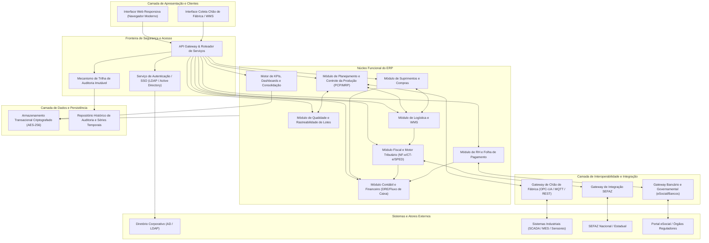
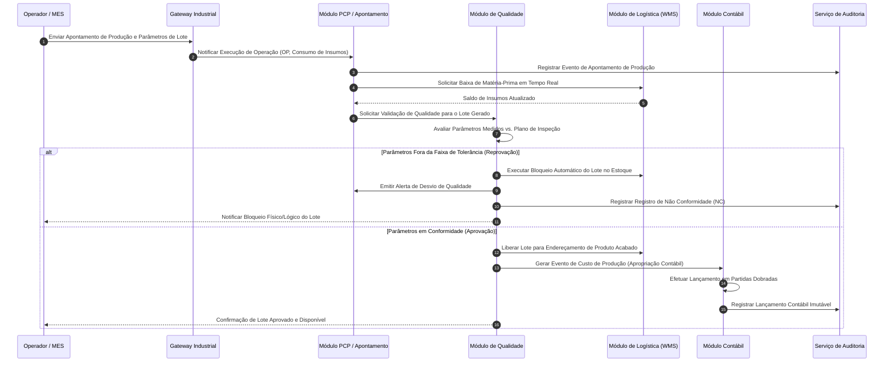
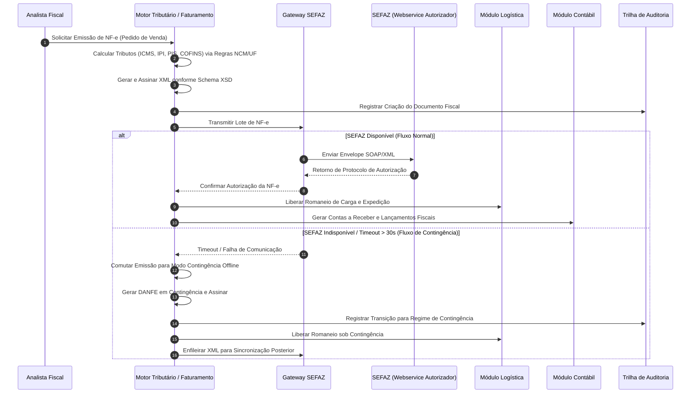

# Relatório Técnico de Arquitetura de Software

## 1. Identificação das HUs

Abaixo está o mapeamento consolidado das Histórias de Usuário (HUs) com seus respectivos perfis, objetivos operacionais e vínculos diretos com os Requisitos Funcionais (RFs) e Não Funcionais (RNFs).

| ID | Perfil / Ator | Título da História de Usuário | Objetivo Principal | Requisitos Vinculados |
| :--- | :--- | :--- | :--- | :--- |
| **HU01** | Planejador de Produção (PCP) | Gerar ordens de produção e calcular necessidade de materiais | Gerar OPs e executar o cálculo de MRP determinando necessidades líquidas e gerando solicitações de compra automáticas. | RF05, RF06, RF14, RNF13 |
| **HU02** | Planejador de Produção (PCP) | Monitorar OEE e desvios de produção em tempo real | Monitorar OEE por centro de trabalho/turno com alertas automáticos de desvio e drill-down em tempo real. | RF07, RF08, RF10, RF11, RF12, RNF14, RNF18 |
| **HU03** | Comprador / Suprimentos | Gerenciar cotações com múltiplos fornecedores | Enviar solicitações de cotação multilaterais, comparar propostas automaticamente e submeter OCs a fluxos de alçada. | RF13, RF15, RF16, RNF03 |
| **HU04** | Gestor de Suprimentos | Acompanhar desempenho de fornecedores | Avaliar histórico de fornecedores por pontualidade, qualidade e preço com relatórios exportáveis. | RF17, RF18, RF19, RF53 |
| **HU05** | Analista de Qualidade | Registrar inspeção de lote e bloquear reprovados | Executar planos de inspeção, registrar medições e acionar bloqueio sistêmico imediato de lotes não conformes. | RF20, RF21, RF22, RF24, RF25 |
| **HU06** | Analista de Qualidade | Rastrear lote do insumo ao produto acabado | Consultar a cadeia genealógica completa de lotes (rastreabilidade bidirecional da matéria-prima ao cliente). | RF09, RF23, RF26, RF28, RF30 |
| **HU07** | Analista Fiscal / Faturamento | Emitir NF-e com cálculo automático de impostos | Calcular tributos automaticamente (ICMS, IPI, PIS, COFINS) e emitir NF-e/CT-e com suporte a contingência offline. | RF31, RF32, RF33, RF34, RF35, RNF06, RNF07, RNF15, RNF17 |
| **HU08** | Analista Fiscal | Manter SPED Fiscal atualizado | Alimentar a escrituração fiscal digital em tempo real e gerar arquivos validados de EFD e Contribuições. | RF36, RF48, RNF08, RNF10 |
| **HU09** | Analista de RH | Processar folha de pagamento mensal | Processar cálculos trabalhistas com integração ao ponto eletrônico e gerar arquivos de remessa bancária e eSocial. | RF37, RF38, RF39, RF41, RF42, RNF09, RNF11 |
| **HU10** | Analista de RH | Gerar obrigações acessórias de RH | Gerar e validar arquivos legais (eSocial, CAGED, RAIS, DIRF) com alertas preditivos de vencimento. | RF40, RNF08, RNF09, RNF11 |
| **HU11** | Controller / Diretor Financeiro | Visualizar DRE e Fluxo de Caixa em tempo real | Obter visão contábil/financeira contínua (DRE por centro de custo, Fluxo de Caixa realizado/projetado) via lançamentos automáticos. | RF43, RF44, RF45, RF46, RF47, RF49, RNF02, RNF10 |
| **HU12** | Diretor / CEO (Executivo) | Acompanhar indicadores operacionais e financeiros | Visualizar dashboards consolidados multiunidade com KPIs estratégicos, alertas visuais e drill-down em até 3 cliques. | RF04, RF50, RF51, RF52, RF53, RNF04, RNF12, RNF14, RNF16 |

---

## 2. Diagramas de Arquitetura (Mermaid)

### 2.1. Diagrama Geral de Componentes e Fronteiras do Sistema

---

### 2.2. Diagrama de Sequência: Execução de Produção, Bloqueio de Qualidade e Contabilização

---

### 2.3. Diagrama de Sequência: Emissão de Faturamento Fiscal (NF-e) com Contingência

---

## 3. Decisões de Arquitetura

### 3.1. Isolamento Multiunidade e Hierarquia Organizacional
* **Decisão:** Implementação de particionamento lógico orientado a Unidades Fabris e Filiais em todos os módulos operacionais. Todas as transações e entidades contêm metadados de domínio que definem Unidade de Origem, Centro de Custo e Nível de Acesso.
* **Justificativa:** Atende diretamente a RF01, RF04 e RNF16, assegurando que operadores de uma planta não visualizem nem modifiquem dados de outras fábricas sem concessão explícita de perfil corporativo.

### 3.2. Arquitetura Orientada a Eventos para Integração Contábil e Auditoria
* **Decisão:** Adoção de padrão *Event-Carried State Transfer* interno e mensageria desacoplada para os módulos satélites (Compras, Vendas, Produção, Folha) notificarem o Módulo Contábil e a Trilha de Auditoria.
* **Justificativa:** Garante o cálculo da DRE e Balanço em tempo real (RF43, RF45, RF46) sem gerar acoplamento síncrono que comprometa o tempo de resposta das transações operacionais do chão de fábrica ou expedição.

### 3.3. Motor Tributário Isolado com Arquitetura de Contingência Offline
* **Decisão:** Criação de um subsistema desacoplado para cálculo tributário e mensageria assíncrona para comunicação com a SEFAZ, dotado de circuito de contingência automatizado.
* **Justificativa:** Cumpre os requisitos de desempenho e resiliência (RNF06, RNF07, RNF15, RNF17, RF34), mantendo a fábrica expedindo mercadorias mesmo durante instabilidades na infraestrutura governamental.

### 3.4. Barramento de Abstração para Automação Industrial (SCADA/MES)
* **Decisão:** Construção de uma camada de mediação industrial (*Industrial Gateway*) compatível com protocolos industriais multiprovedor (OPC-UA, MQTT, REST), realizando normalização estrutural antes da entrega ao PCP.
* **Justificativa:** Viabiliza o monitoramento de OEE contínuo e a leitura de sensores de chão de fábrica (RF10, RF11, RNF18) preservando a independência do ERP em relação ao maquinário fabril.

### 3.5. Bloqueio Mandatório de Qualidade em Duas Etapas (Quality Gate)
* **Decisão:** O estado de qualquer lote no WMS e no PCP é regido por uma máquina de estados finitos cujo gatilho de liberação é exclusivo do Módulo de Qualidade.
* **Justificativa:** Atendimento estrito aos requisitos RF21, RF22 e HU05, eliminando a possibilidade de consumo ou expedição acidental de itens reprovados.

---

## 4. Tabela de Componentes e Rastreabilidade

| Componente | Responsabilidade Principal | Comunica-se com | Origem (HU / Critério de Aceite) |
| :--- | :--- | :--- | :--- |
| **Serviço de Autenticação e RBAC** | Gerenciar identidade, autenticação via SSO corporativo (AD/LDAP), papéis e segregação de funções (SoD). | Diretório Corporativo, Todos os Módulos, Trilha de Auditoria | RF01, RF02, RF04, RNF01, RNF03, RNF04 |
| **Trilha de Auditoria e Conformidade** | Registrar e reter logs transacionais imutáveis de todas as operações críticas por 10 anos. | Todos os Módulos, Repositório de Auditoria | RF03, RNF02, RNF05, RNF09, RNF10 |
| **Motor de Planejamento e MRP (PCP)** | Processar cálculo de necessidades de materiais líquidas, planejar capacidade e gerir OPs. | Módulo de Qualidade, Suprimentos, Logística, Gateway Industrial | HU01, RF05, RF06, RF07, RF09, RNF13 |
| **Gateway de Apontamento e Chão de Fábrica** | Coletar dados de telemetria, paradas e produção de sistemas MES/SCADA em tempo real. | SCADA/MES, PCP, Dashboard Executivo | HU02, RF08, RF10, RF11, RF12, RNF18 |
| **Módulo de Suprimentos e Compras** | Gerenciar fornecedores, cotações comparativas, emissão de OCs e controle de alçadas. | Portal de Fornecedores, Logística, Módulo Contábil | HU03, HU04, RF13, RF14, RF15, RF16, RF19 |
| **Módulo de Qualidade e Rastreabilidade** | Gerir planos de inspeção, laudos, bloqueio de lotes, Não Conformidades (NC) e rastreabilidade genealógica. | PCP, Logística/WMS, Suprimentos, Trilha de Auditoria | HU05, HU06, RF20, RF21, RF22, RF23, RF24, RF25 |
| **Módulo de Logística e Armazenagem (WMS)** | Gerir endereçamento físico de armazéns, conferência de recebimento, expedição, romaneios e devoluções (RMA). | Qualidade, Faturamento Fiscal, Suprimentos, PCP | RF17, RF18, RF26, RF27, RF28, RF29, RF30 |
| **Motor Fiscal e Faturamento (NF-e/CT-e)** | Calcular regras tributárias (ICMS/IPI/PIS/COFINS), emitir e transmitir NF-e/CT-e e gerir contingência. | Logística, Módulo Contábil, Gateway SEFAZ | HU07, RF31, RF32, RF33, RF34, RF35, RNF06, RNF07, RNF15, RNF17 |
| **Módulo de Escrituração Fiscal (SPED)** | Consolidar lançamentos fiscais e gerar arquivos SPED Fiscal (EFD) e Contribuições validados. | Motor Fiscal, Contabilidade, Gateway Fiscal | HU08, RF36, RF48, RNF08, RNF10 |
| **Módulo de RH e Ponto Eletrônico** | Gerenciar colaboradores, apuração de ponto eletrônico, processamento de folha de pagamento e encargos CLT. | Relógios de Ponto, Módulo Contábil, Gateway Governamental | HU09, RF37, RF38, RF39, RF41, RF42, RNF09, RNF11 |
| **Gerador de Obrigações Acessórias RH** | Gerar e validar arquivos do eSocial, CAGED, RAIS e DIRF com alerta de prazos legais. | Módulo de RH, Portais Governamentais | HU10, RF40, RNF08, RNF09 |
| **Motor Contábil e Financeiro** | Executar lançamentos em partidas dobradas automáticos, gerar DRE em tempo real, Balanço, Fluxo de Caixa e contas A Pagar/Receber. | Suprimentos, Faturamento, RH, PCP, Repositório de Dados | HU11, RF43, RF44, RF45, RF46, RF47, RF49, RNF02 |
| **Motor de Dashboards Executivos e KPIs** | Consolidar métricas de OEE, financeiro, qualidade e logística, permitindo drill-down em 3 níveis e exportação. | Todos os Módulos de Domínio, Clientes Web/Mobile | HU12, RF50, RF51, RF52, RF53, RNF14, RNF16, RNF23, RNF24 |

---

## 5. Bloqueios e Pendências

1. **Protocolo Específico dos Equipamentos Legados:**
   * *Pendência:* O requisito RNF18 lista múltiplos protocolos industriais (OPC-UA, MQTT ou REST/JSON). Faz-se necessária a homologação técnica prévia de quais máquinas operam via barramentos legados (ex.: fieldbus proprietários) que demandem conversores de borda (*Edge Gateways*).
2. **Definição de Política de Certificados Digitais para NF-e/CT-e:**
   * *Pendência:* A emissão de documentos fiscais eletrônicos multiunidade requer a definição da arquitetura de custódia dos Certificados Digitais (A1 ou A3) para garantir a assinatura em contingência local sem exposição de chaves privadas corporativas.
3. **Mecanismo de Desempate e Critérios Subjetivos em Cotações:**
   * *Pendência:* O RF15 especifica comparação automática de propostas por critérios de preço, prazo e qualidade, mas não estabelece pesos e fórmulas de *scorecard* ponderado para casos de empate.
4. **Volume de Séries Temporais dos Apontamentos Industriais:**
   * *Pendência:* A frequência de amostragem de dados de chão de fábrica via SCADA/MES não está delimitada (ex.: envio por milissegundo vs. envio por ciclo de peça), impactando o dimensionamento do throughput de rede e armazenamento de telemetria.

---

## 6. Cobertura de Requisitos

A matriz abaixo comprova a rastreabilidade integral de 100% dos requisitos de entrada:

| Requisito | Componente(s) Responsável(is) | História(s) de Usuário / Mapeamento de Validação |
| :--- | :--- | :--- |
| **RF01, RF02, RF04** | Serviço de Autenticação e RBAC | HU12, Gestão de Acessos Granular e Multiunidade |
| **RF03** | Trilha de Auditoria e Conformidade | HU05, HU07, HU11, Auditoria de Eventos Transacionais |
| **RF05, RF06, RF07** | Motor de Planejamento e MRP (PCP) | HU01, Planejamento e Explosão de Materiais |
| **RF08, RF10, RF11, RF12** | Gateway de Apontamento / PCP | HU02, Monitoramento de Produção e OEE |
| **RF09** | PCP / Logística (WMS) | HU01, HU06, Baixa de Matéria-Prima em Tempo Real |
| **RF13, RF14, RF15, RF16** | Módulo de Suprimentos e Compras | HU01, HU03, Cotações e Ordens de Compra |
| **RF17, RF18, RF19** | Suprimentos / Logística (WMS) | HU04, Recebimento e Desempenho de Fornecedor |
| **RF20, RF21, RF22** | Módulo de Qualidade e Rastreabilidade | HU05, Planos de Inspeção e Bloqueio de Reprovados |
| **RF23, RF24, RF25** | Módulo de Qualidade e Rastreabilidade | HU06, Rastreabilidade de Lote e Não Conformidades |
| **RF26, RF27, RF28, RF29, RF30**| Módulo de Logística e Armazenagem | HU06, HU07, Armazenamento, Expedição e Devoluções |
| **RF31, RF32, RF33, RF34, RF35**| Motor Fiscal e Faturamento | HU07, Emissão NF-e/CT-e e Regras Tributárias |
| **RF36, RF48** | Módulo de Escrituração Fiscal (SPED) | HU08, EFD Fiscal e Contribuições |
| **RF37, RF38, RF39, RF41, RF42**| Módulo de RH e Ponto Eletrônico | HU09, Folha de Pagamento e Encargos Trabalhistas |
| **RF40** | Gerador de Obrigações Acessórias RH | HU10, Geração e Validação de eSocial / DIRF / RAIS |
| **RF43, RF44, RF45, RF46, RF47, RF49** | Motor Contábil e Financeiro | HU11, DRE em Tempo Real, Contas Pagar/Receber e Multimoeda |
| **RF50, RF51, RF52, RF53** | Motor de Dashboards Executivos e KPIs | HU02, HU04, HU12, Visão Analítica com Drill-Down e Exportação |
| **RNF01, RNF02, RNF03, RNF04, RNF05** | Camada de Segurança e Autenticação | Transversal a todas as HUs (TLS, AES-256, SoD, RBAC) |
| **RNF06, RNF07, RNF08, RNF09, RNF10, RNF11** | Governança Fiscal, Contábil, RH e Auditoria | Validação contínua de conformidade SEFAZ, LGPD, CLT e CTN |
| **RNF12, RNF13, RNF14, RNF15, RNF16, RNF17** | Núcleo de Engenharia de Desempenho e Resiliência | SLAs de processamento de MRP (<10 min), SEFAZ (<30s), Contingência e Alta Disponibilidade (99,5%) |
| **RNF18, RNF19, RNF20** | Camada de Interoperabilidade | Padrões abertos (OPC-UA, MQTT, RESTful, JSON, XML) |
| **RNF21, RNF22, RNF23, RNF24** | Infraestrutura, Monitoramento e Usabilidade | Suporte a nuvem híbrida/on-prem, backup WAL (RPO 1h) e UI responsiva |

---

## 7. Gap Analysis

### Lacuna 1: Conciliação de Conflitos na Sincronização de NF-e em Contingência
* **Impacto Arquitetural:** Em caso de emissão offline (contingência), cancelamentos locais ou divergências de numeração podem ser rejeitados pela SEFAZ quando o canal for reestabelecido.
* **Ação Recomendada:** Projetar um componente de *Dead Letter Queue* e conciliação assíncrona que intercepte rejeições pós-contingência, gerando notificações prioritárias para a mesa fiscal sem interromper a fila de emissão contínua.

### Lacuna 2: Impacto Concorrencial do Cálculo de MRP sobre a Base Transacional
* **Impacto Arquitetural:** A execução do MRP para 50.000 itens (RNF13) exige intenso processamento analítico sobre estoques, empenhos e ordens de produção abertas, gerando risco de *lock* concorrencial com os apontamentos em tempo real do chão de fábrica.
* **Ação Recomendada:** Utilizar isolamento transacional por réplicas de leitura consistentes em memória ou segregação de modelos de leitura/escrita (separação analítica/transacional) para o processamento do algoritmo de MRP.

### Lacuna 3: Tratamento de Desconexões Prolongadas no Chão de Fábrica
* **Impacto Arquitetural:** Se a rede entre o sistema SCADA/MES e o Gateway Industrial sofrer interrupções, os dados de OEE e apontamentos poderão sofrer perdas ou causar picos de carga acumulada no restabelecimento.
* **Ação Recomendada:** Adotar padrão de persistência intermediária local (*Store-and-Forward*) nos conectores de borda da fábrica, garantindo carimbo de data/hora na origem (*edge timestamping*) para posterior reinjeção ordenada no ERP.