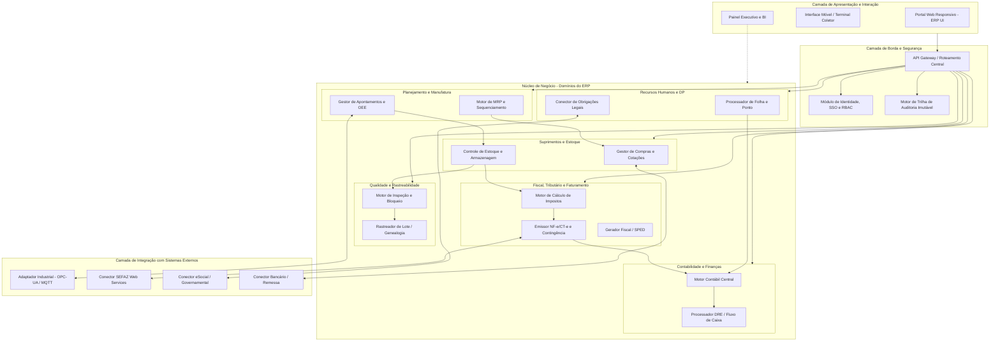
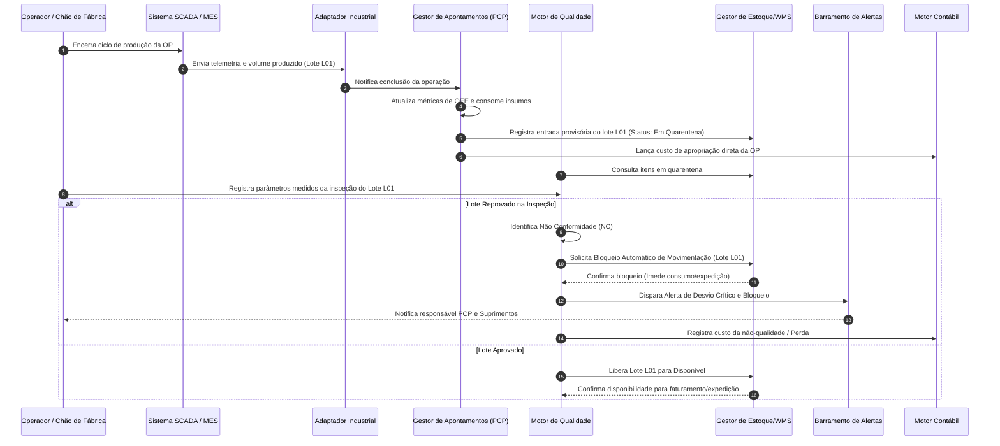

# Relatório Técnico de Arquitetura de Software

## 1. Identificação das HUs

Abaixo estão identificadas as Histórias de Usuário (HUs) mapeadas a partir dos requisitos de negócio para a manufatura integrada:

| ID | Título da História de Usuário | Ator Principal | Objetivo do Negócio | Módulos Impactados |
| :--- | :--- | :--- | :--- | :--- |
| **HU01** | Gerar OPs e Cálculo de Necessidade de Materiais | Planejador de Produção (PCP) | Automatizar a explosão de materiais (MRP) e disparar requisições de compra e produção. | PCP, Estoque, Suprimentos |
| **HU02** | Monitorar OEE e Desvios de Produção em Tempo Real | Planejador de Produção (PCP) | Obter visibilidade de eficiência das máquinas e operadores com alertas proativos de desvio. | PCP, Integração Chão de Fábrica, Notificações |
| **HU03** | Gerenciar Cotações com Múltiplos Fornecedores | Comprador / Gestor de Suprimentos | Equalizar propostas comerciais e controlar aprovações de ordens de compra por alçada. | Suprimentos, Contabilidade |
| **HU04** | Acompanhar Desempenho de Fornecedores | Gestor de Suprimentos | Avaliar pontualidade, qualidade e competitividade para qualificação de fornecedores. | Suprimentos, Qualidade |
| **HU05** | Registrar Inspeção de Lote e Bloquear Reprovados | Analista de Qualidade | Impedir movimentação ou consumo de lotes não conformes por bloqueio automático de estoque. | Qualidade, Estoque, PCP |
| **HU06** | Rastrear Lote do Insumo ao Produto Acabado | Analista de Qualidade | Prover rastreabilidade genealógica bidirecional para auditoria e processos de recall. | Qualidade, Estoque, Faturamento |
| **HU07** | Emitir NF-e com Cálculo Automático de Impostos | Analista Fiscal / Faturamento | Automatizar tributação complexa brasileira e transmissão à SEFAZ com modo contingência. | Fiscal/Faturamento, Vendas, Contabilidade |
| **HU08** | Manter SPED Fiscal Atualizado | Analista Fiscal | Escriturar automaticamente livros fiscais e apurar tributos a partir de movimentações reais. | Fiscal, Contabilidade |
| **HU09** | Processar Folha de Pagamento Mensal | Analista de RH / DP | Calcular encargos, provisões e gerar arquivos bancários com integração ao ponto eletrônico. | RH/Folha, Financeiro, Contabilidade |
| **HU10** | Gerar Obrigações Acessórias de RH | Analista de RH | Exportar eventos no padrão eSocial, DIRF, RAIS dentro dos prazos regulatórios. | RH/Folha, Auditoria |
| **HU11** | Visualizar DRE e Fluxo de Caixa em Tempo Real | Controller / Diretor Financeiro | Apurar resultado econômico e financeiro instantâneo com drill-down até o fato gerador. | Contabilidade, Financeiro, Custos |
| **HU12** | Acompanhar Indicadores no Dashboard Executivo | Diretor / CEO | Consolidar KPIs estratégicos operacionais, fabris e financeiros multi-unidade. | BI/Dashboards, Todos os Subsistemas |

---

## 2. Diagramas de Arquitetura (Mermaid)

### 2.1. Visão Lógica de Componentes do Sistema

### 2.2. Diagrama de Sequência: Ciclo Fechado de Produção, Inspeção e Bloqueio de Qualidade

---

## 3. Decisões de Arquitetura

### DA01: Separação de Domínios com Consistência Transacional e Eventos de Negócio
* **Contexto:** O ERP integra operações de alta velocidade (apontamento de máquinas) com processos de estrita consistência contábil e fiscal.
* **Decisão:** Adotar segregação lógica por domínios desacoplados. Transações internas a um domínio (ex.: emissão fiscal e baixa contábil) utilizam garantias ACID locais; integrações assíncronas (ex.: cálculo de OEE a partir de telemetria SCADA) utilizam mensageria com entrega garantida e consistência eventual.
* **Justificativa:** Previne que picos de telemetria fabril degradem o desempenho das operações fiscais e financeiras críticas.

### DA02: Isolamento Lógico Multi-Unidade com Segregação de Funções (SoD/RBAC)
* **Contexto:** Requisitos RF01, RF04, RNF03 e RNF16 exigem isolamento estrito entre filiais e controles de alçada corporativos.
* **Decisão:** Inclusão obrigatória do identificador de Unidade Fabril (*Tenant/Branch ID*) no contexto de segurança de todas as requisições, filtrado nativamente na camada de persistência. Acesso cruzado entre unidades exige permissão explícita na árvore hierárquica organizacional.
* **Justificativa:** Garante conformidade com políticas de governança, confidencialidade de custos entre plantas e integridade de consolidação fiscal.

### DA03: Motor de Regras Fiscais Desacoplado com Mecanismo de Contingência Autônomo
* **Contexto:** RF31, RF34 e RNF17 exigem que indisponibilidades da SEFAZ não paralisem o fluxo de faturamento e expedição da fábrica.
* **Decisão:** Isolar a regra tributária (cálculo de impostos) da comunicação com a SEFAZ. O módulo de faturamento gera e assina o documento digital localmente; em caso de falha de comunicação após tempo limite configurável, entra automaticamente em modo de contingência offline, enfileirando o lote assinado para transmissão posterior.
* **Justificativa:** Assegura continuidade operacional na expedição de cargas sem violar requisitos fiscais.

### DA04: Camada de Adaptação de Protocolos Industriais
* **Contexto:** RF11 e RNF18 exigem integração com chão de fábrica operando sob protocolos variados (OPC-UA, MQTT, REST).
* **Decisão:** Implementar uma camada de adaptadores de integração especializada na borda (*Edge/Bridge Adapter*), que normaliza mensagens industriais proprietárias em contratos canônicos antes do envio ao núcleo do PCP.
* **Justificativa:** Protege o modelo de domínio do ERP de particularidades de hardware e protocolos de automação industrial.

### DA05: Criptografia de Dados Sensíveis e Trilha de Auditoria Imutável
* **Contexto:** RNF02, RNF09 e RNF10 demandam proteção a dados de RH/Financeiro e retenção auditável de 10 anos.
* **Decisão:** Implementação de chave de criptografia de aplicação para campos classificados como dados pessoais (LGPD) e dados bancários/salariais. Registro de log de auditoria operacional gravado de forma somente-leitura com identificador de usuário, carimbo de tempo, IP, estado anterior e posterior.
* **Justificativa:** Atendimento integral à LGPD, Código Tributário Nacional e normas internacionais de auditoria de sistemas.

---

## 4. Tabela de Componentes e Rastreabilidade

| Componente | Responsabilidade Principal | Comunica-se com | Origem (HU / Critério de Aceite) |
| :--- | :--- | :--- | :--- |
| **Gestor de Identidade e Acesso (IAM/RBAC)** | Gerenciar perfis, autenticação SSO via AD/LDAP, segregação de funções (SoD) e controle de contexto multi-planta. | API Gateway, Todos os Componentes de Domínio | RF01, RF02, RF04, RNF03 |
| **Motor de Trilha de Auditoria** | Registrar de forma imutável e centralizada todas as mutações e acessos a dados fiscais, financeiros e de RH. | IAM, Motor Contábil, RH, Fiscal | RF03, RNF05, RNF10 |
| **Motor de Planejamento de Produção e MRP** | Gerenciar OPs, calcular necessidades líquidas de materiais, explodir listas técnicas (BOM) e capacidade de centros de trabalho. | Gestor de Compras, Estoque/WMS, Gestor de Apontamentos | HU01 (RF05, RF06, RF07, RNF13) |
| **Gestor de Apontamentos e OEE** | Capturar registros de início/pausa/fim de ordens, apurar horas de máquina/homem, calcular métricas de OEE e alertar desvios. | Adaptador Industrial, Estoque/WMS, Painel Executivo | HU02 (RF08, RF10, RF12) |
| **Adaptador de Integração Industrial** | Traduzir e normalizar dados telemétricos de chão de fábrica (OPC-UA, MQTT, REST) para os modelos do ERP. | Sistemas SCADA/MES, Gestor de Apontamentos | RF11, RNF18 |
| **Gestor de Suprimentos e Compras** | Conduzir cotações concorrentes, equalização de propostas, aprovação de ordens de compra por alçada e avaliação de fornecedores. | Estoque/WMS, Motor Contábil, Qualidade | HU03, HU04 (RF13, RF14, RF15, RF16, RF19) |
| **Motor de Inspeção e Bloqueio de Qualidade** | Registrar medições de planos de inspeção, aprovar/reprovar lotes, acionar bloqueio físico-lógico e gerir Não Conformidades. | Estoque/WMS, Gestor de Apontamentos, Alertas | HU05 (RF20, RF21, RF22, RF24, RF25) |
| **Rastreador Genealógico de Lotes** | Manter grafo de rastreabilidade bidirecional cruzando insumos recebidos, OPs transformadoras e notas de saída. | Qualidade, Estoque/WMS, Fiscal | HU06 (RF23, RNF20) |
| **Gestor de Armazém e Logística (WMS)** | Controlar saldos por endereço físico, gerir recebimento físico com conferência, expedição, romaneios e RMA. | Compras, Fiscal, Qualidade, PCP | RF17, RF18, RF26, RF27, RF28, RF29, RF30 |
| **Motor de Tributação e Faturamento Fiscal** | Calcular impostos (ICMS/IPI/PIS/COFINS), emitir e transmitir NF-e/CT-e, gerenciar contingência e alimentar SPED. | SEFAZ, Estoque, Motor Contábil | HU07, HU08 (RF31, RF32, RF33, RF34, RF35, RF36, RNF06, RNF07, RNF08, RNF15, RNF17) |
| **Gestor de Recursos Humanos e DP** | Manter cadastros funcionais, apurar ponto integrado, processar folha de pagamento, encargos e gerar arquivos legais (eSocial). | Conectores Governamentais, Bancos, Motor Contábil | HU09, HU10 (RF37, RF38, RF39, RF40, RF41, RF42, RNF09, RNF11) |
| **Motor Contábil e Financeiro** | Processar partidas dobradas automáticas, gerir contas a pagar/receber, DRE e fluxo de caixa em tempo real e ECD/EFD. | Suprimentos, Faturamento, RH, PCP | HU11 (RF43, RF44, RF45, RF46, RF47, RF48, RF49) |
| **Motor de Dashboards Executivos e KPIs** | Consolidar indicadores gerenciais, permitir drill-down transacional e prover exportações operacionais estruturadas. | Todos os Componentes de Negócio | HU12 (RF50, RF51, RF52, RF53, RNF14, RNF24) |

---

## 5. Bloqueios e Pendências

1. **Definição de Latência Máxima e Buffer de Conexão no Chão de Fábrica (PCP / SCADA):**
   * *Pendência:* O requisito RF11 estipula integração via OPC-UA/MQTT/REST, porém não define o volume de mensagens por segundo por centro de trabalho nem o comportamento em cenários de queda de link local na fábrica.
   * *Impacto:* Risco de sobrecarga no barramento de integração ou perda de apontamento se não houver fila local em cada planta.

2. **Detalhamento da Política de Alçadas de Compra e SoD (Suprimentos / Financeiro):**
   * *Pendência:* RF16 e RNF03 definem aprovação por alçada e Segregação de Funções, mas não especificam os fluxos de aprovação cruzada (ex.: aprovação paralela de múltiplos diretores acima de determinado valor).
   * *Impacto:* Necessidade de modelagem de um motor de regras de fluxo de trabalho (*workflow*) dinâmico.

3. **Resolução de Conflitos em Contingência Offline de NF-e:**
   * *Pendência:* Ao operar em contingência (RF34/RNF17), se a numeração for rejeitada posteriormente pela SEFAZ por duplicidade ou inconsistência fiscal, o fluxo de retorno de mercadoria já expedida não está formalizado.
   * *Impacto:* Exige protocolo operacional compensatório com o setor fiscal.

---

## 6. Cobertura de Requisitos

A matriz abaixo comprova a rastreabilidade integral entre Requisitos Funcionais (RF), Requisitos Não Funcionais (RNF) e a arquitetura projetada:

| Requisito Funcional | Componente(s) Responsável(is) | Requisito Não Funcional Atendido |
| :--- | :--- | :--- |
| **RF01, RF02, RF04** | Gestor de Identidade e Acesso (IAM/RBAC) | RNF01 (TLS), RNF03 (RBAC/SoD), RNF04 (Rate Limiting) |
| **RF03** | Motor de Trilha de Auditoria | RNF02 (Criptografia repouso), RNF10 (Retenção 10 anos) |
| **RF05, RF06, RF07** | Motor de Planejamento de Produção e MRP | RNF13 (MRP em até 10 min), RNF16 (Multi-planta) |
| **RF08, RF10, RF12** | Gestor de Apontamentos e OEE | RNF12 (99,5% uptime), RNF23 (Métricas operacionais) |
| **RF11** | Adaptador de Integração Industrial | RNF18 (Protocolos OPC-UA/MQTT/REST) |
| **RF13, RF14, RF15, RF16, RF19** | Gestor de Suprimentos e Compras | RNF03 (SoD em aprovações), RNF19 (APIs RESTful) |
| **RF17, RF18, RF26, RF27, RF28, RF29, RF30** | Gestor de Armazém e Logística (WMS) | RNF16 (Escalabilidade), RNF20 (Formatos padrão) |
| **RF20, RF21, RF22, RF24, RF25** | Motor de Inspeção e Bloqueio de Qualidade | RNF12 (Alta disponibilidade) |
| **RF23** | Rastreador Genealógico de Lotes | RNF20 (Exportação de dados rastreáveis) |
| **RF31, RF32, RF33, RF34, RF35, RF36** | Motor de Tributação e Faturamento Fiscal | RNF06 (Legislação fiscal), RNF07 (Schemas SEFAZ), RNF08 (SPED), RNF15 (<= 30s), RNF17 (Contingência) |
| **RF37, RF38, RF39, RF40, RF41, RF42** | Gestor de Recursos Humanos e DP | RNF08 (eSocial), RNF09 (LGPD), RNF11 (CLT) |
| **RF43, RF44, RF45, RF46, RF47, RF48, RF49** | Motor Contábil e Financeiro | RNF02 (Criptografia), RNF08 (ECD/EFD), RNF10 (Imutabilidade) |
| **RF50, RF51, RF52, RF53** | Motor de Dashboards Executivos e KPIs | RNF14 (Carregamento <= 5s), RNF24 (Interface responsiva) |
| *Infraestrutura Global* | Barramentos, Replicação, Backups | RNF21 (Backup WAL RPO < 1h), RNF22 (Implantação Híbrida) |

---

## 7. Gap Analysis

| Item Identificado | Descrição da Lacuna | Impacto Arquitetural | Ação Recomendada para o Time de Desenvolvimento |
| :--- | :--- | :--- | :--- |
| **1. Conciliação de Custos Industriais Reais vs. Padrão** | Os requisitos abordam consumo de insumos (RF09) e DRE em tempo real (RF45), mas não detalham o método de apropriação de custos indiretos de fabricação (CIF) e fechamento de custo médio ponderado. | Risco de distorção no cálculo da margem de contribuição no dashboard gerencial antes do encerramento contábil mensal. | Especificar um submódulo de Contabilidade de Custos que suporte apropriação por absorção/ABC com estornos e ajustes automáticos de variações fabris. |
| **2. Conectividade Intermitente na Coleta Móvel** | Não há previsão explícita para coletores WMS operando em galpões com zonas de sombra de rede sem fio (RF26/RF28). | Falhas de transação durante conferência de recebimento ou inventário rotativo por perda de conexão. | Projetar a camada de frontend móvel com capacidade de armazenamento local temporário (*offline-first*) e sincronização idempotente na reconexão. |
| **3. Governança de Chaves Criptográficas (KMS)** | RNF02 exige AES-256 para dados sensíveis, mas não define a estratégia de rotação e custódia das chaves de criptografia. | Fragilidade de conformidade com a LGPD em auditorias externas caso a custódia das chaves resida estática na aplicação. | Estabelecer interface para integração com serviço corporativo de gerenciamento de chaves (*Key Management Service*) desacoplado da base de dados. |
| **4. Regime de Transição da Reforma Tributária** | RF06 e RNF06 cobrem a legislação fiscal atual (ICMS/IPI/PIS/COFINS), mas não prevêem a transição gradual para CBS/IBS/IS. | Risco de obsolescência rápida da tabela de regras fiscais nos próximos ciclos tributários. | Implementar o Motor de Tributação baseado em motor de regras flexíveis (*Rule Engine* parametrizável) com suporte a vigência temporal de regras e coexistência de modelos fiscais. |