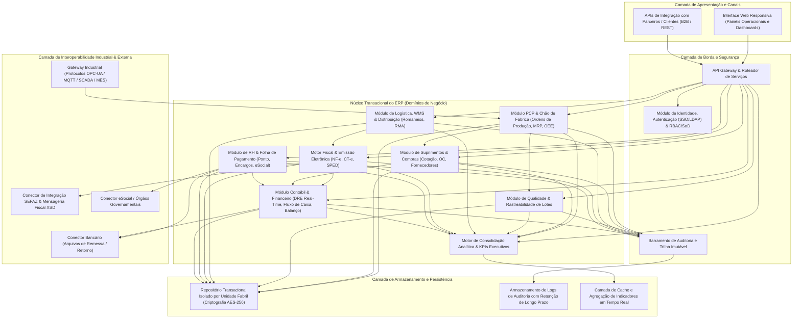
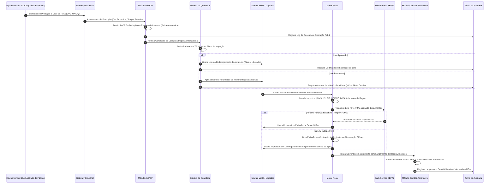

# Relatório Técnico de Arquitetura de Software

## 1. Identificação das HUs

Abaixo está o mapeamento consolidado das Histórias de Usuário identificadas no domínio do ERP Manufatureiro, associando perfis operacionais, objetivos de negócio e valor agregado:

| ID | Perfil / Persona | Objetivo de Negócio | Valor Agregado |
| :--- | :--- | :--- | :--- |
| **HU01** | Planejador de Produção (PCP) | Criar ordens de produção (OP) e executar cálculo de MRP automatizado. | Evita paradas de linha garantindo disponibilidade de insumos e alocação ótima de recursos. |
| **HU02** | Planejador de Produção (PCP) | Monitorar índice OEE e desvios de processo fabril em tempo real. | Agilidade na contenção de perdas operacionais e elevação do rendimento dos centros de trabalho. |
| **HU03** | Comprador / Suprimentos | Executar cotações multifornecedor com equalização e fluxo de alçadas. | Redução de custos de aquisição e garantia de conformidade na esteira de aprovações de compra. |
| **HU04** | Gestor de Suprimentos | Avaliar e auditar o desempenho de fornecedores por pontualidade, preço e qualidade. | Governança na cadeia de suprimentos e suporte a decisões de homologação e descredenciamento. |
| **HU05** | Analista de Qualidade | Registrar inspeções de lote com bloqueio automático de não conformidades. | Barreira contra evasão de defeitos para o processo produtivo subsequente ou expedição a clientes. |
| **HU06** | Analista de Qualidade | Rastrear a genealogia bidirecional do lote (insumo $\leftrightarrow$ produto acabado $\leftrightarrow$ cliente). | Atendimento a auditorias regulatórias, compliance e capacidade imediata de *recall*. |
| **HU07** | Analista Fiscal / Faturamento | Emitir NF-e/CT-e com cálculo tributário automatizado e contingência operacional. | Mitigação de risco tributário, agilidade no faturamento e conformidade estrita com a SEFAZ. |
| **HU08** | Analista Fiscal | Alimentar e gerar escriturações fiscais digitais (SPED Fiscal/Contribuições). | Redução de esforço manual de fechamento fiscal e garantia de integridade nas obrigações acessórias. |
| **HU09** | Analista de RH / DP | Processar folha de pagamento integrada a ponto eletrônico e encargos legais. | Precisão no cálculo trabalhista (CLT/Convenções) e tempestividade de crédito e encargos. |
| **HU10** | Analista de RH / DP | Gerar e validar eventos do eSocial e obrigações anuais/mensais do departamento de pessoal. | Conformidade trabalhista perante órgãos governamentais sem retrabalho de consolidação. |
| **HU11** | Controller / Finanças | Acompanhar DRE, Balanço e Fluxo de Caixa projetado/realizado em tempo real. | Visibilidade financeira instantânea e suporte analítico com *drill-down* direto à origem transacional. |
| **HU12** | Diretor / Executivo (C-Level) | Visualizar painéis unificados de KPIs operacionais, de qualidade e financeiros. | Governança executiva baseada em dados em tempo real com controle de desvios por meta. |

---

## 2. Diagramas de Arquitetura (Mermaid)

### 2.1. Visão de Componentes e Fronteiras de Domínio do Sistema

O diagrama abaixo expressa a decomposição modular do ERP corporativo, as camadas de integração com o chão de fábrica e sistemas governamentais, e as fronteiras de responsabilidade.

---

### 2.2. Diagrama de Sequência: Execução de Produção, Apontamento, Controle de Qualidade e Faturamento Fiscal

O diagrama a seguir descreve o fluxo ponta a ponta desde o apontamento de chão de fábrica via protocolo industrial até o fechamento contábil e emissão fiscal, contemplando bloqueios automáticos de qualidade.

---

## 3. Decisões de Arquitetura

### 3.1. Isolamento Multitenancy Hierárquico por Unidade Fabril (RF01, RF04, RNF16)
* **Decisão:** A arquitetura adota particionamento lógico rígido por Unidade Fabril (*Plant-Level Tenancy*), controlado nativamente na camada de aplicação e reforçado nas chaves compostas de persistência (`Company_ID`, `Plant_ID`, `Business_Unit_ID`).
* **Justificativa:** Atende à restrição de visibilidade de dados interplantas estabelecida pela hierarquia organizacional, permitindo ao mesmo tempo consolidações financeiras e corporativas globais (como DRE corporativa e planejamento mestre) de forma transparente sem quebra de privacidade fabril.

### 3.2. Desacoplamento Assíncrono com Mensageria para Processamento Intensivo (RF06, RF11, RNF13, RNF18)
* **Decisão:** O cálculo de necessidade de materiais (MRP) e a ingestão de telemetria industrial de chão de fábrica operam desacoplados da esteira de requisições transacionais síncronas através de filas de trabalho e canais de mensageria assíncrona.
* **Justificativa:** Processamentos pesados de explosão de lista de materiais (BOM) para bases de até 50.000 itens não bloqueiam as operações de cadastro ou apontamento. A ingestão industrial contínua de telemetria é absorvida sem degradação do tempo de resposta da interface com o usuário.

### 3.3. Motor Fiscal Baseado em Regras Externas e Máquina de Estados com Contingência (RF31–RF34, RNF06, RNF07, RNF17)
* **Decisão:** O Motor de Regras Fiscais é estruturado como um componente desacoplado e versionável, isolando parametrizações tributárias (regras de NCM, CFOP, alíquotas interestaduais) da lógica transacional. A emissão de documentos eletrônicos implementa uma Máquina de Estados com transição imediata para modo de contingência em caso de *timeout* com a SEFAZ.
* **Justificativa:** Garante adaptação ágil às alterações frequentes da legislação tributária nacional sem necessidade de refatoração do núcleo do ERP, cumprindo o requisito de faturamento contínuo sem interrupções nas docas de expedição.

### 3.4. Governança, SoD e Trilha de Auditoria Imutável (RF02, RF03, RNF02, RNF03, RNF10)
* **Decisão:** Integração com Provedor de Identidade Corporativo (Single Sign-On / LDAP) acoplada a uma matriz de Segregação de Funções (SoD - *Segregation of Duties*). Todas as mutações de dados financeiros, fiscais e de RH são interceptadas e emitidas para uma trilha de auditoria append-only, armazenada com criptografia de dados em repouso padrão AES-256.
* **Justificativa:** Cumpre a conformidade com o Código Tributário Nacional (retenção de 10 anos), regras do eSocial/SPED, além de mitigar fraudes e garantir conformidade com a LGPD.

---

## 4. Tabela de Componentes e Rastreabilidade

| Componente | Responsabilidade Principal | Comunica-se com | Origem (HU / Critério de Aceite) |
| :--- | :--- | :--- | :--- |
| **Módulo de Identidade & Acesso (IAM)** | Gerenciar identidades, autenticação SSO/LDAP, autorização granular RBAC e regras de Segregação de Funções (SoD). | Todos os Módulos do Sistema, Diretório Corporativo (AD/LDAP). | RF01, RF02, RF04, RNF03 |
| **Trilha de Auditoria & Segurança** | Interceptar operações, gravar logs imutáveis e garantir retenção de longo prazo com criptografia AES-256. | Todos os Módulos do Sistema, Armazenamento Seguro de Logs. | RF03, RNF02, RNF04, RNF09, RNF10 |
| **Motor de PCP & MRP** | Gestão de OPs, cálculo de necessidade líquida de materiais (MRP), sequenciamento e cálculo de OEE. | Módulo de Suprimentos, Qualidade, Gateway Industrial, Armazém/WMS. | HU01, HU02, RF05–RF10, RF12, RNF13 |
| **Gateway de Interoperabilidade Industrial** | Ingestão e tradução de telemetria industrial (OPC-UA, MQTT, REST) e comunicação com SCADA/MES. | SCADA/MES, Sensores de Linha, Motor de PCP. | RF11, RNF18 |
| **Módulo de Suprimentos & Compras** | Gestão de catálogo de fornecedores, cotações multifornecedor, emissão de OC com alçadas e recebimento. | Motor de PCP, Qualidade, Módulo Fiscal, Contábil-Financeiro. | HU03, HU04, RF13–RF19 |
| **Módulo de Qualidade & Rastreabilidade** | Planos de inspeção, bloqueio automático de não conformidades, genealogia bidirecional de lotes e custos da não qualidade. | Motor de PCP, Módulo de Suprimentos, WMS/Logística, Contábil. | HU05, HU06, RF20–RF25 |
| **Módulo de Logística, WMS & Expedição** | Endereçamento de armazém, romaneios de carga, controle de frotas/rotas, rastreamento de entregas e RMA. | Módulo de Qualidade, Módulo Fiscal, Painel de KPIs. | RF26–RF30 |
| **Motor Fiscal & Emissão Tributária** | Motor de regras de tributação (ICMS, IPI, PIS, COFINS), mensageria XSD SEFAZ, emissão de NF-e/CT-e, contingência e SPED. | Logística, Suprimentos, Contábil-Financeiro, Web Services SEFAZ. | HU07, HU08, RF31–RF36, RNF06, RNF07, RNF15, RNF17 |
| **Módulo de RH & Folha de Pagamento** | Cadastro de colaboradores, apuração de ponto eletrônico, processamento de folha, encargos e mensageria eSocial/DIRF/RAIS. | Relógios de Ponto, Conector eSocial, Contábil-Financeiro, Bancos. | HU09, HU10, RF37–RF42, RNF08, RNF11 |
| **Módulo Contábil & Financeiro** | Lançamentos contábeis automáticos por partidas dobradas, apuração de DRE real-time, fluxo de caixa, contas a pagar/receber e SPED ECD/EFD. | Suprimentos, Faturamento Fiscal, RH, Painéis Executivos. | HU11, RF43–RF49 |
| **Motor Analítico & Dashboards de KPIs** | Consolidação de métricas em tempo real, engine de drill-down analítico, verificação de limites/metas e exportação. | Todos os módulos de domínio de negócio, Interface Web. | HU12, RF50–RF53, RNF14, RNF24 |

---

## 5. Bloqueios e Pendências

1. **Definição dos Padrões de Protocolos de Relógios de Ponto (REP):** O requisito RF38 prevê integração com relógios de ponto, porém não especifica os layouts/portarias ministeriais suportadas (ex: Portaria 671 MTP) para coleta automática dos arquivos AFD/AFDT.
2. **Estratégia de Atualização de Taxas de Câmbio Multimoeda (RF49):** Falta a indicação da fonte oficial de ingestão das taxas de câmbio (ex: Banco Central do Brasil - PTAX) e a frequência de sincronização automática para conversão das transações para a moeda funcional.
3. **Mecanismo de Assinatura Digital de Documentos Fiscais:** Embora RNF07 exija validade jurídica via XSD da SEFAZ, é necessária a definição técnica sobre o suporte a certificados digitais em nuvem (A3 / HSM em nuvem) versus certificados em arquivo (A1 local/servidor).
4. **Resolução de Conflitos em Cenário de Contingência Fiscal Prolongada:** Pendente detalhamento das regras de reconciliação de numeração e cancelamento de notas fiscais caso ocorra emissão em contingência off-line concomitantemente a restabelecimento instável de links com a SEFAZ.

---

## 6. Cobertura de Requisitos

A matriz abaixo estabelece a cobertura dos Requisitos Funcionais e Não Funcionais pelos componentes e diretrizes arquiteturais desenhados:

| Grupo / ID | Descrição Resumida | Componente / Mecanismo de Cobertura | Status |
| :--- | :--- | :--- | :--- |
| **RF01–RF04** | Gestão de Usuários, SSO, Auditoria e Hierarquia Fabril | Módulo IAM + Módulo de Auditoria + Multitenancy Plant-Level | Integral |
| **RF05–RF12** | PCP, MRP, Capacidade, Apontamentos, OEE e SCADA | Motor de PCP & MRP + Gateway de Interoperabilidade Industrial | Integral |
| **RF13–RF19** | Suprimentos, Ponto de Pedido, Cotações, OC e Devoluções | Módulo de Suprimentos & Compras + Motor de Alçadas | Integral |
| **RF20–RF25** | Planos de Qualidade, Inspeção, Bloqueio, Rastreabilidade e NC | Módulo de Qualidade & Rastreabilidade de Lotes | Integral |
| **RF26–RF30** | WMS, Expedição, Romaneios, Rastreamento e RMA | Módulo de Logística, WMS & Distribuição | Integral |
| **RF31–RF36** | Emissão NF-e/CT-e, Tributos, Contingência, SPED Fiscal | Motor Fiscal & Emissão Tributária + Conector SEFAZ | Integral |
| **RF37–RF42** | Cadastro RH, Ponto, Folha, eSocial e Benefícios | Módulo de RH & Folha de Pagamento + Conector eSocial | Integral |
| **RF43–RF49** | Lançamentos Contábeis, DRE Real-Time, SPED ECD/EFD, Câmbio | Módulo Contábil & Financeiro | Integral |
| **RF50–RF53** | Dashboards Executivos, Metas, Drill-Down e Exportação | Motor Analítico & Dashboards de KPIs | Integral |
| **RNF01–RNF05** | TLS 1.2+, Criptografia AES-256, RBAC/SoD, Rate Limit | Camada de Borda, Gateway de Segurança e Persistência Segura | Integral |
| **RNF06–RNF11** | Conformidade Legislação Brasileira, SPED, LGPD, 10 anos retenção | Motor Fiscal, Motor Contábil, RH e Trilha de Auditoria | Integral |
| **RNF12–RNF17** | SLA 99,5%, MRP <10min, Painéis <5s, NF-e <30s, Contingência | Camada Assíncrona de Processamento + Cache Analítico | Integral |
| **RNF18–RNF20** | Interoperabilidade OPC-UA/MQTT, RESTful APIs, Formatos Padrão | Gateway Industrial + API Gateway + Conectores B2B | Integral |
| **RNF21–RNF24** | Backup WAL (RPO 1h), Implantação Híbrida, Monitoramento TI, UI Web | Arquitetura Portável de Infraestrutura e Interface Responsiva | Integral |

---

## 7. Gap Analysis

| Lacuna de Especificação | Impacto Arquitetural Potencial | Ação Recomendada para o Time de Engenharia |
| :--- | :--- | :--- |
| **Comportamento em Falha de Conexão com Chão de Fábrica (SCADA offline)** | Perda de apontamentos de produção e desbalanceamento no cálculo instantâneo do OEE e consumo de insumos. | Especificar um mecanismo de *Store-and-Forward* no Gateway Industrial local da fábrica, permitindo bufferização de telemetria e sincronização resiliente pós-restabelecimento de rede. |
| **Volume e Estratégia de Arquivamento de Dados de IoT Industrial** | Degradação de performance na base de dados transacional devido ao elevado fluxo de mensagens/segundo dos sensores industriais. | Separar a trilha de dados de alta frequência (série temporal da telemetria de máquinas) da base de registros operacionais transacionais do ERP, aplicando políticas de agregação e expurgo. |
| **Tratamento de Lotes Misto / Segregação Parcial em Linha** | Ausência de regra para situações em que apenas uma fração do lote de produção é reprovada pela inspeção de processo. | Projetar o Módulo de Qualidade com suporte a sub-lotes e desdobramento (*split*) de ordens de produção, isolando frações reprovadas sem reter a parcela conforme. |
| **Matriz de Alçadas de Aprovação de Compras Dinâmica** | Dificuldade em manter fluxos de aprovação quando há mudanças organizacionais ou ausências temporárias de gestores. | Implementar um motor de regras de delegação de alçadas configurável baseado em papéis hierárquicos, centro de custo e limites financeiros, com delegação temporária de autoridade. |