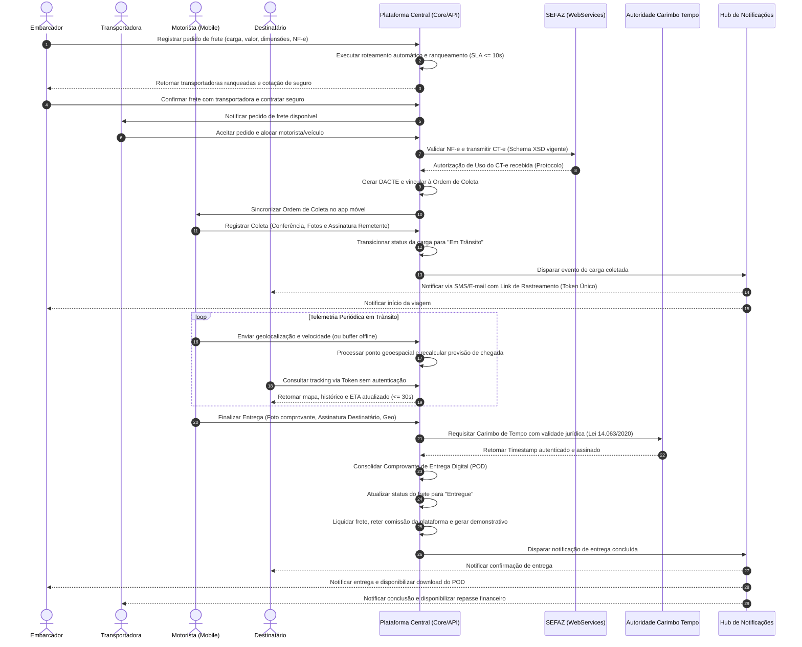

# Relatório Técnico de Arquitetura de Software

## 1. Identificação das HUs

| ID | Título da História de Usuário | Ator Principal | Objetivo do Negócio / Valor Entregue |
|---|---|---|---|
| **HU01** | Registrar pedido de frete | Embarcador | Cadastrar frete com características da carga e upload de NF-e/documentos, disparando roteamento automático sem negociação manual. |
| **HU02** | Selecionar transportadora e contratar seguro | Embarcador | Comparar transportadoras ranqueadas por múltiplos critérios e contratar apólice de seguro em fluxo único com emissão fiscal. |
| **HU03** | Acompanhar pedidos e receber comprovante de entrega | Embarcador | Visão unificada de tracking da frota com alertas de ocorrências em trânsito e recepção imediata do Comprovante de Entrega Digital (POD). |
| **HU04** | Abrir sinistro por avaria ou extravio | Embarcador | Acionar cobertura securitária de ponta a ponta na plataforma via integração direta com seguradora parceira, anexando laudos e fotos. |
| **HU05** | Aceitar pedidos de frete e gerenciar frota | Transportadora | Visualizar demandas compatíveis, gerenciar alocação de motoristas/veículos e aceitar/recusar fretes dentro do SLA estipulado. |
| **HU06** | Acompanhar operação dos motoristas em tempo real | Transportadora | Painel de monitoramento geoespacial da frota em campo com recepção de telemetria e tratativa de ocorrências operacionais. |
| **HU07** | Consultar demonstrativo financeiro de repasse | Transportadora | Conciliação financeira transparente com visualização de valores brutos, comissão retida pela plataforma e saldo líquido a receber. |
| **HU08** | Executar coleta com registro de evidências | Motorista | Registro de carga coletada com fotos, conferência de volumes e captura de assinatura digital com sincronização online/offline. |
| **HU09** | Registrar entrega com assinatura digital do destinatário | Motorista | Formalização do POD sem papel via aplicativo móvel com carimbo de tempo, geolocalização, fotos e assinatura em até 4 toques. |
| **HU10** | Registrar ocorrência durante o transporte | Motorista | Notificação tempestiva de anomalias (avarias, sinistros, tentativas frustradas) com anexação de evidências visuais. |
| **HU11** | Rastrear carga em tempo real sem cadastro | Destinatário | Consulta pública simplificada via link com token efêmero com visualização de mapa, marcos de status e previsão dinâmica de chegada. |
| **HU12** | Receber notificações de cada etapa da entrega | Destinatário | Comunicação multicanal proativa (e-mail e SMS) sobre as fases da viagem e alterações na estimativa de entrega. |
| **HU13** | Monitorar SLA de fretes e acionar contingência | Administrador | Torre de controle para mitigação proativa de riscos de atraso, pedidos estagnados e intervenção manual em fretes críticos. |
| **HU14** | Acompanhar painel financeiro da plataforma | Administrador | Gestão executiva de receitas de intermediação, inadimplência, volume operacional e métricas de desempenho do ecossistema. |

---

## 2. Diagramas de Arquitetura (Mermaid)

### 2.1. Visão de Componentes do Sistema (C4 - Nível 2 / Nível 3 Conceitual)

```mermaid
graph TB
    subgraph Clientes ["Camada de Apresentação e Clientes"]
        WEB_EMBARCADOR["Portal Web do Embarcador"]
        WEB_TRANS["Portal Web da Transportadora"]
        WEB_ADMIN["Torre de Controle Admin"]
        APP_MOTORISTA["Aplicativo Mobile do Motorista (Offline-First)"]
        TRACKING_PUBLICO["Web App de Rastreamento (Acesso via Token)"]
    end

    subgraph Borda ["Camada de Borda e Segurança"]
        API_GATEWAY["API Gateway & Reverse Proxy (TLS 1.2+, WAF, Rate Limit)"]
        AUTH_MFA["Serviço de Identidade, Sessão e MFA"]
    end

    subgraph Core ["Serviços Centrais da Aplicação"]
        SRV_PEDIDOS["Serviço de Pedidos e Fretes"]
        SRV_ROTEAMENTO["Motor de Roteamento, Cotação e Ranqueamento"]
        SRV_FISCAL["Módulo Fiscal (CT-e / SEFAZ / Validação NF-e)"]
        SRV_RASTREAMENTO["Serviço de Telemetria e Séries Temporais Geoespaciais"]
        SRV_POD["Serviço de POD e Assinatura com Carimbo do Tempo"]
        SRV_OCORRENCIAS["Serviço de Ocorrências e Sinistros"]
        SRV_FINANCEIRO["Módulo de Faturamento, Comissões e Repasses"]
        SRV_NOTIFICACOES["Módulo de Notificações Multicanal (E-mail/SMS/Push)"]
        SRV_AUDITORIA["Serviço de Trilha de Auditoria Imutável"]
    end

    subgraph Integracoes ["Provedores e Parceiros Externos"]
        EXT_SEFAZ["SEFAZ (Ambiente Autorizador CT-e / NF-e)"]
        EXT_SEGUROS["Gateway de Seguradoras Parceiras"]
        EXT_CARIMBO["Autoridade Certificadora de Carimbo de Tempo (ACT)"]
        EXT_MENSAGENS["Provedores de Envio SMS / E-mail"]
    end

    subgraph Persistencia ["Camada de Armazenamento de Dados (Criptografia AES-256)"]
        DB_TRANSACIONAL[("Banco de Dados Transacional / Relacional")]
        DB_GEO_TEMPORAL[("Banco de Dados de Telemetria e Séries Temporais")]
        OBJ_STORAGE[("Armazenamento de Objetos e Arquivos Criptografados")]
        DB_AUDITORIA[("Repositório de Logs e Auditoria Imutável")]
    end

    %% Conexões Clientes -> Borda
    WEB_EMBARCADOR --> API_GATEWAY
    WEB_TRANS --> API_GATEWAY
    WEB_ADMIN --> API_GATEWAY
    APP_MOTORISTA --> API_GATEWAY
    TRACKING_PUBLICO --> API_GATEWAY

    API_GATEWAY --> AUTH_MFA

    %% Roteamento Gateway -> Serviços Core
    API_GATEWAY --> SRV_PEDIDOS
    API_GATEWAY --> SRV_ROTEAMENTO
    API_GATEWAY --> SRV_FISCAL
    API_GATEWAY --> SRV_RASTREAMENTO
    API_GATEWAY --> SRV_POD
    API_GATEWAY --> SRV_OCORRENCIAS
    API_GATEWAY --> SRV_FINANCEIRO
    API_GATEWAY --> SRV_NOTIFICACOES

    %% Interações Internas Core
    SRV_PEDIDOS --> SRV_ROTEAMENTO
    SRV_PEDIDOS --> SRV_FISCAL
    SRV_PEDIDOS --> SRV_NOTIFICACOES
    SRV_POD --> SRV_FINANCEIRO
    SRV_RASTREAMENTO --> SRV_NOTIFICACOES
    SRV_OCORRENCIAS --> SRV_NOTIFICACOES

    %% Serviços -> Integrações
    SRV_FISCAL --> EXT_SEFAZ
    SRV_OCORRENCIAS --> EXT_SEGUROS
    SRV_POD --> EXT_CARIMBO
    SRV_NOTIFICACOES --> EXT_MENSAGENS

    %% Serviços -> Persistência
    SRV_PEDIDOS --> DB_TRANSACIONAL
    SRV_ROTEAMENTO --> DB_TRANSACIONAL
    SRV_FISCAL --> DB_TRANSACIONAL
    SRV_FINANCEIRO --> DB_TRANSACIONAL
    SRV_RASTREAMENTO --> DB_GEO_TEMPORAL
    SRV_POD --> OBJ_STORAGE
    SRV_OCORRENCIAS --> OBJ_STORAGE
    SRV_PEDIDOS --> OBJ_STORAGE
    SRV_AUDITORIA --> DB_AUDITORIA

    %% Auditoria transversal
    SRV_PEDIDOS -.-> SRV_AUDITORIA
    SRV_FISCAL -.-> SRV_AUDITORIA
    SRV_FINANCEIRO -.-> SRV_AUDITORIA
```



---

### 2.2. Diagrama de Sequência: Ciclo de Execução do Frete, Coleta, Emissão Fiscal, Telemetria e POD com Validade Jurídica



---

## 3. Decisões de Arquitetura

### Decisão 01: Arquitetura Orientada a Serviços Especializados com Segregação de Cargas de Trabalho
* **Contexto:** A plataforma precisa atender simultaneamente a operações transacionais com forte consistência (emissão fiscal de CT-e, faturamento e auditoria financeira) e alto volume de dados de streaming com baixa latência (telemetria e rastreamento em tempo real).
* **Decisão:** Adotar divisão lógica por componentes de serviço desacoplados:
  * Um motor transacional para pedidos, cotações, governança de contratos fiscais e financeiro.
  * Um pipeline dedicado para telemetria e séries temporais com persistência otimizada para dados geoespaciais.
  * Armazenamento particionado para objetos binários (fotos de coletas, POD, NF-e, laudos).
* **Consequências:** Garante que surtos de telemetria móvel não degradem o processamento fiscal ou financeiro, isolando domínios de falha e permitindo escalabilidade horizontal independente.

### Decisão 02: Padrão *Offline-First* com Buffer e Sincronização Transacional no Aplicativo Mobile
* **Contexto:** Os motoristas frequentemente trafegam por rodovias e regiões periféricas sem cobertura contínua de internet celular (RNF17, RF28).
* **Decisão:** Implementar uma camada de persistência local segura no dispositivo móvel do motorista. Todas as ações (coleta, entrega, ocorrências, fotos e telemetria) são persistidas localmente primeiro, atribuídas a identificadores únicos globais e sincronizadas com a nuvem de forma assíncrona com reconciliação idempotente assim que a conectividade for restabelecida.
* **Consequências:** Elimina a dependência de sinal de rede no momento crítico da assinatura do remetente/destinatário e impede a perda de dados de fiscalização e comprovação de entrega.

### Decisão 03: Governança de Validade Jurídica do Comprovante de Entrega Digital (POD)
* **Contexto:** Atendimento à Lei Federal nº 14.063/2020 e Código Tributário Nacional para dar eficácia jurídica à entrega de mercadorias sem utilização de canhotos físicos de papel (RF37, RF38, RNF10).
* **Decisão:** O documento de entrega digital consolidará: foto do comprovante/mercadoria, assinatura vetorial do destinatário, coordenadas geográficas de satélite, dados de IP/sessão e integração com autoridade de carimbo de tempo digital (*Timestamp* imutável). Os metadados serão criptografados e arquivados com política de retenção mínima obrigatória de 5 anos.
* **Consequências:** Total respaldo probatório contra fraudes, não-repúdio de recebimento e viabilização de liquidação financeira instantânea entre embarcador e transportadora.

### Decisão 04: Isolamento de Acesso Público ao Rastreamento com Tokens Criptográficos Efêmeros
* **Contexto:** O destinatário da mercadoria deve rastrear sua entrega em tempo real sem fricção de cadastro (RF30), porém o sistema deve proteger rigorosamente a privacidade dos envolvidos e a rota do motorista (RNF05, RNF06, RNF09 - LGPD).
* **Decisão:** Acesso ao rastreamento exposto exclusivamente por URLs com tokens seguros assinados criptograficamente, com tempo de vida limitado até o encerramento da entrega e escopo restrito exclusivamente às informações públicas daquela remessa específica (omitindo dados confidenciais de outros fretes, placas de veículos sensíveis ou dados pessoais do motorista).
* **Consequências:** Conformidade com a LGPD e blindagem contra raspagem de dados ou acesso indevido a trajetos de frotas comerciais.

---

## 4. Tabela de Componentes e Rastreabilidade

| Componente | Responsabilidade Principal | Comunica-se com | Origem (HU / Requisito) |
|---|---|---|---|
| **Módulo de Autenticação e MFA** | Gerenciar identidades, autorização RBAC por perfil (embarcador, transportadora, motorista, admin), sessões com MFA e ciclo de vida de tokens móveis. | Clientes Web/Mobile, API Gateway, Banco Transacional | RF01, RF02, RNF03, RNF04 |
| **Serviço de Gestão de Pedidos e Cargas** | Orquestrar o ciclo de vida do pedido de frete, declaração de ad valorem, validação de restrições de carga e anexação de documentos fiscais/técnicos. | Portal Embarcador, Motor de Roteamento, Módulo Fiscal, Repositório de Objetos | HU01, HU03, RF05, RF06, RF07, RF08, RF09 |
| **Motor de Roteamento e Cotação** | Executar o ranqueamento automático de transportadoras em até 10s por preço, SLA, capacidade de veículo e score de reputação; tratar recusas e timeout de aceite. | Serviço de Pedidos, Portal da Transportadora, Módulo de Notificações, Banco Transacional | HU02, HU05, RF10, RF11, RF12, RF13, RF14, RF15, RF16, RNF13 |
| **Serviço de Integração Fiscal (CT-e/NF-e)** | Validar NF-e junto à SEFAZ, gerar leiaute XML (XSD vigente), assinar, transmitir, emitir CT-e em contingência offline, cancelar, inutilizar e gerar DACTE. | SEFAZ, Serviço de Pedidos, Repositório de Documentos | HU02, RF17, RF18, RF19, RF20, RF21, RF22, RNF07, RNF08, RNF14 |
| **Aplicativo do Motorista (Mobile Engine)** | Suportar operação do motorista com interface tátil simplificada, roteamento multiparadas, coleta de assinaturas, fotos e buffer offline para sincronização posterior. | API Gateway, Câmera/GPS do Dispositivo, Armazenamento Local do Aparelho | HU08, HU09, HU10, RF23, RF24, RF27, RF28, RF29, RNF17, RNF18, RNF19, RNF21 |
| **Serviço de Telemetria e Rastreamento** | Ingerir streaming de coordenadas do motorista a cada ciclo configurado, persistir séries temporais, recalcular previsão dinâmica de chegada e publicar mapa ao vivo. | App do Motorista, Web Rastreamento Público, Torre de Controle Admin, Banco Geoespacial | HU06, HU11, RF25, RF30, RF31, RF32, RNF05, RNF06, RNF12, RNF15, RNF16, RNF23 |
| **Módulo de Notificações Multicanal** | Disparar alertas transacionais e informativos via E-mail, SMS e Push Notifications sobre cada evento do ciclo de vida da carga para remetente, transportadora e destinatário. | Gateways de E-mail/SMS, Serviço de Pedidos, Serviço de Ocorrências, Serviço de Telemetria | HU12, RF13, RF33, RF34, RF35, RF36 |
| **Serviço de POD e Assinatura Digital** | Consolidar pacote de entrega com fotos, assinatura vetorial, geocoordenadas e requisitar carimbo de tempo autenticado conforme padrão da Lei 14.063/2020. | App do Motorista, Autoridade de Carimbo de Tempo, Repositório de Arquivos | HU03, HU09, RF37, RF38, RF39, RF40, RNF10 |
| **Serviço de Ocorrências e Sinistros** | Formalizar avarias, extravios, recusas de recebimento; integrar com APIs de seguradoras parceiras para cotação de apólice e abertura de sinistros. | App Motorista, Portal Embarcador, Gateways de Seguradoras, Repositório de Documentos | HU04, HU10, RF26, RF40, RF41, RF42, RF43, RF44 |
| **Módulo Financeiro e Faturamento** | Calcular valores de frete, tarifas de ad valorem, reter comissão automática da plataforma, consolidar faturas periódicas de embarcadores e demonstrativos de repasse. | Portal Embarcador, Portal Transportadora, Painel Admin, Banco Transacional | HU07, HU14, RF45, RF46, RF47, RF48, RF49 |
| **Serviço de Auditoria e Governança** | Registrar trilha de auditoria imutável de todas as ações de usuários, eventos fiscais e transações financeiras com criptografia e retenção mínima de 5 anos. | Todos os Serviços Core, Repositório de Auditoria Imutável | RF04, RNF02, RNF11, RNF22 |
| **Torre de Controle Operacional (Admin SLA)** | Monitorar em tempo real fretes com risco de estouro de SLA, disparar reassignação de pedidos abandonados e exibir KPIs de manutenibilidade do sistema. | Serviço de Rastreamento, Serviço de Pedidos, Painel Admin | HU13, RF36, RNF25 |

---

## 5. Bloqueios e Pendências

### Bloqueios Arquiteturais
1. **Regras de Contingência Tributária e Emissão Offline de CT-e (RF19):** A emissão de CT-e em modo de contingência no transporte rodoviário exige alinhamento com a SEFAZ de cada estado (modalidades EPEC ou SVC). É imperativo definir a política exata para veículos que iniciam a viagem em regiões sem conectividade antes da autorização fiscal.
2. **Homologação com Autoridade Certificadora de Carimbo do Tempo (ACT) (RF38 / RNF10):** A validade jurídica do POD depende da definição do padrão de carimbo do tempo (ICP-Brasil vs. timestamping qualificado conforme a Lei nº 14.063/2020), necessitando de validação do departamento jurídico antes do fechamento do contrato de integração da API.

### Pendências de Negócio
1. **Políticas de Timeout e Janelas de Resposta no Ranqueamento de Transportadoras (RF15):** Necessidade de formalizar os prazos exatos de tolerância (ex: 15 min, 30 min) concedidos a cada transportadora antes que o pedido passe automaticamente para a próxima ranqueada.
2. **Modelo de Cobertura e Franquia de Sinistros (RF41 / RF42):** Definição da regra de negócio para pedidos onde a seguradora rejeitar a cotação instantânea devido ao perfil da carga (ex: carga perigosa ou alto risco de roubo).

---

## 6. Cobertura de Requisitos

```
[RF01 - RF04] (Gestão de Acesso/Auditoria)  --> Módulo de Autenticação / Auditoria [COBERTO]
[RF05 - RF09] (Pedidos de Frete)            --> Serviço de Gestão de Pedidos [COBERTO]
[RF10 - RF16] (Roteamento e Ranqueamento)   --> Motor de Roteamento e Cotação [COBERTO]
[RF17 - RF22] (Emissão CT-e / Fiscal)       --> Serviço Fiscal / Integração SEFAZ [COBERTO]
[RF23 - RF29] (Operação do Motorista)       --> App Mobile Offline-First [COBERTO]
[RF30 - RF32] (Rastreamento Tempo Real)     --> Serviço de Telemetria e Séries Temporais [COBERTO]
[RF33 - RF36] (Notificações)                --> Módulo de Notificações Multicanal [COBERTO]
[RF37 - RF40] (Comprovante POD)             --> Serviço de POD e Carimbo de Tempo [COBERTO]
[RF41 - RF44] (Seguros e Sinistros)         --> Serviço de Ocorrências e Sinistros [COBERTO]
[RF45 - RF49] (Financeiro / Faturamento)    --> Módulo Financeiro e Comissões [COBERTO]
[RNF01 - RNF06] (Segurança / MFA / Tokens)  --> Camada de Borda, Criptografia AES-256 e RBAC [COBERTO]
[RNF07 - RNF11] (Conformidade / Leis)       --> Módulo Fiscal, POD Jurídico, Trilha 5 Anos [COBERTO]
[RNF12 - RNF17] (Disponibilidade/SLA/Scale) --> Arquitetura Especializada e App Offline-First [COBERTO]
[RNF18 - RNF21] (Usabilidade / Mobile)      --> Design de Interface Móvel em até 4 toques [COBERTO]
[RNF22 - RNF25] (Infra / Geo / Métricas)    --> Persistência Geoespacial, Backup e Observabilidade [COBERTO]
```

---

## 7. Gap Analysis

| Item Identificado | Lacuna de Especificação / Arquitetural | Impacto no Projeto | Ação Recomendada para o Time de Engenharia |
|---|---|---|---|
| **Gestão de Devoluções e Reentregas** | Os requisitos abordam a recusa do recebimento (RF40), mas não detalham o fluxo logístico reverso (armazenamento temporário, novo frete de devolução ou reentrega). | Inconsistência no faturamento de frete e falta de tela no app do motorista para nova tentativa de entrega. | Especificar a máquina de estados de devolução/reentrega e os custos adicionais de frete associados. |
| **Exposição de Dados e Roteamento Privado** | O RNF06 exige transmissão de geolocalização restrita, mas não especifica regras de mascaramento em áreas urbanas sensíveis de segurança. | Risco de vazamento de rotas de cargas de alto valor em tempo real para agentes não autorizados. | Implementar camada de ofuscação/jittering de rotas públicas e permissões rigorosas via tokens na API de rastreamento. |
| **Tratamento de Assinatura Offline sem Conexão Prolongada** | O RNF10 exige validade jurídica com timestamp no POD, mas em operação offline contínua o relógio do aparelho celular pode estar dessincronizado ou adulterado. | Risco de contestação jurídica do carimbo de data/hora do POD registrado em modo desconectado. | Utilizar mecanismo de validação cruzada do timestamp do dispositivo móvel com o timestamp emitido pelo servidor na reconciliação de rede. |
| **Limites de Upload e Compressão de Imagens** | O aplicativo permite envio de múltiplas fotos (coleta, avaria, entrega), mas não há política de resolução e compactação definida para redes móveis 3G/4G restritas. | Lentidão no upload e consumo excessivo de plano de dados dos motoristas em áreas remotas. | Adotar pipeline cliente no aplicativo móvel para compressão e redimensionamento automático de imagens antes do armazenamento e sincronização. |