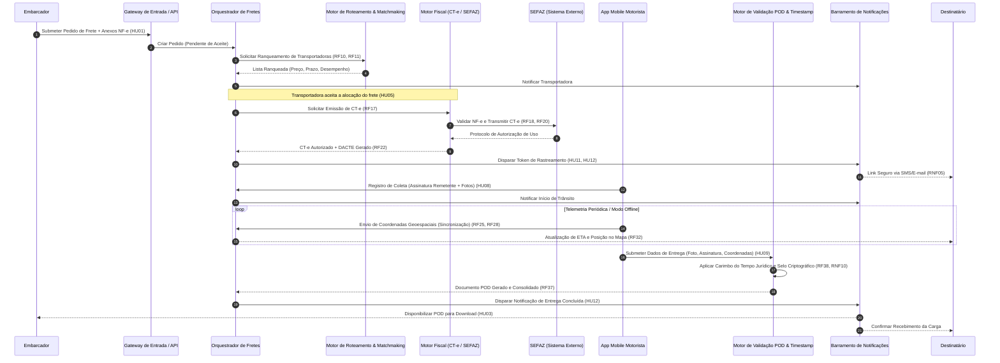
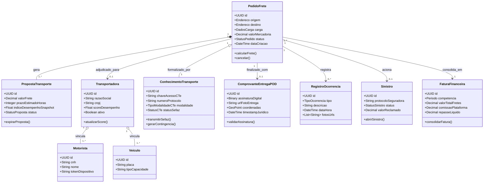

# Relatório Técnico de Arquitetura de Software

---

## 1. Identificação das HUs

Abaixo estão consolidadas as Histórias de Usuário (HUs) mapeadas a partir dos requisitos de negócio e operacionais da plataforma:

| ID | Título | Ator Principal | Resumo do Objetivo de Negócio |
| :--- | :--- | :--- | :--- |
| **HU01** | Registrar pedido de frete | Embarcador | Cadastrar frete com características da carga, documentos fiscais e acionar roteamento automatizado. |
| **HU02** | Selecionar transportadora e contratar seguro | Embarcador | Comparar ofertas ranqueadas por critérios operacionais/desempenho e contratar cobertura de seguro em fluxo unificado. |
| **HU03** | Acompanhar pedidos e receber comprovante | Embarcador | Visualizar ciclo de vida de fretes em tempo real e obter o Comprovante de Entrega Digital (POD). |
| **HU04** | Abrir sinistro por avaria ou extravio | Embarcador | Formalizar acionamento de sinistro com vinculação automática de evidências, ocorrências e documentos. |
| **HU05** | Aceitar pedidos de frete e gerenciar frota | Transportadora | Receber ofertas de frete, confirmar/recusar com justificativa e associar veículos/motoristas. |
| **HU06** | Acompanhar operação dos motoristas | Transportadora | Monitorar em mapa interativo a telemetria em tempo real, status de entregas e alertas de incidentes. |
| **HU07** | Consultar demonstrativo financeiro de repasse | Transportadora | Auditar extrato de fretes finalizados, comissões retidas da plataforma e saldo líquido de repasse. |
| **HU08** | Executar coleta com registro de evidências | Motorista | Registrar coleta de carga via aplicativo com checklist de volumes, fotos e assinatura digital do remetente. |
| **HU09** | Registrar entrega com assinatura digital (POD) | Motorista | Capturar assinatura do recebedor, foto, geolocalização e carimbo de tempo para gerar POD com validade jurídica. |
| **HU10** | Registrar ocorrência durante o transporte | Motorista | Notificar eventos adversos de rota (avaria, sinistro, tentativa frustrada) com fotos e geolocalização. |
| **HU11** | Rastrear carga em tempo real sem cadastro | Destinatário | Acompanhar localização da carga e estimativa dinâmica de entrega (ETA) via link seguro com token temporário. |
| **HU12** | Receber notificações de etapas da entrega | Destinatário | Receber avisos multicanal (E-mail/SMS) em mudanças críticas de estado do transporte. |
| **HU13** | Monitorar SLA de fretes e acionar contingência | Administrador | Identificar riscos operacionais, fretes sem aceite e intervir preventivamente no balanceamento de carga. |
| **HU14** | Acompanhar painel financeiro da plataforma | Administrador | Analisar indicadores executivos de faturamento, comissões retidas, volume de fretes e inadimplência. |

---

## 2. Diagramas de Arquitetura (Mermaid)

### 2.1. Diagrama de Sequência Ponta a Ponta: Ciclo de Vida do Frete e Emissão Fiscal

O diagrama a seguir detalha a orquestração do pedido, ranqueamento, integração fiscal (SEFAZ), execução do motorista (suporte a offline) e emissão do comprovante jurídico (POD).

---

### 2.2. Diagrama de Estrutura Conceitual de Componentes

Apresenta a segmentação de serviços e responsabilidades arquiteturais abstratas.

```mermaid
graph TB
    subgraph Camada_Apresentacao["Camada de Apresentação & Clientes"]
        WEB_EMB["Portal Web Embarcador"]
        WEB_TRA["Portal Web Transportadora"]
        WEB_ADM["Painel Administrativo"]
        APP_MOT["App Mobile Motorista (Offline-First)"]
        WEB_TRAK["Interface de Rastreamento Público (Tokenizada)"]
    end

    subgraph Camada_Borda["Borda & Segurança"]
        API_GW["Gateway de Comunicação e Roteamento de APIs"]
        IAM["Provedor de Identidade, Autenticação MFA & RBAC"]
    end

    subgraph Camada_Negocio["Serviços de Domínio & Processamento"]
        SRV_ORDER["Serviço de Gestão de Fretes & Pedidos"]
        SRV_MATCH["Motor de Roteamento, Cotação & Ranqueamento"]
        SRV_GEO["Serviço de Telemetria & Rastreamento Geoespacial"]
        SRV_FISCAL["Motor de Integração Fiscal (CT-e / Contingência)"]
        SRV_POD["Mecanismo de POD & Carimbo de Tempo"]
        SRV_FIN["Serviço Financeiro, Comissões & Repasses"]
        SRV_INS["Módulo de Integração com Seguradoras & Sinistros"]
        SRV_NOTIF["Orquestrador de Notificações Multicanal"]
    end

    subgraph Camada_Persistencia["Persistência & Auditoria"]
        DB_TRANS["Repositório Transacional"]
        DB_TIME["Repositório de Séries Temporais & Geoespacial"]
        OBJ_STORE["Armazenamento de Documentos Criptografados (AES-256)"]
        DB_AUDIT["Repositório de Auditoria Imutável (5 Anos)"]
    end

    subgraph Sistemas_Externos["Integrações Externas"]
        EXT_SEFAZ["SEFAZ (Emissão / Validação Fiscal)"]
        EXT_INS["Provedores de Seguros"]
        EXT_GATEWAYS["Provedores de Mensageria (SMS / E-mail)"]
    end

    %% Conexões de Apresentação com Borda
    WEB_EMB --> API_GW
    WEB_TRA --> API_GW
    WEB_ADM --> API_GW
    APP_MOT --> API_GW
    WEB_TRAK --> API_GW

    %% Conexões de Borda com Serviços
    API_GW --> IAM
    API_GW --> SRV_ORDER
    API_GW --> SRV_MATCH
    API_GW --> SRV_GEO
    API_GW --> SRV_FISCAL
    API_GW --> SRV_POD
    API_GW --> SRV_FIN
    API_GW --> SRV_INS
    API_GW --> SRV_NOTIF

    %% Conexões entre Serviços e Persistência
    SRV_ORDER --> DB_TRANS
    SRV_MATCH --> DB_TRANS
    SRV_GEO --> DB_TIME
    SRV_FISCAL --> OBJ_STORE
    SRV_POD --> OBJ_STORE
    SRV_FIN --> DB_TRANS
    SRV_INS --> DB_TRANS
    
    %% Conexões de Auditoria
    SRV_ORDER -.-> DB_AUDIT
    SRV_FISCAL -.-> DB_AUDIT
    SRV_FIN -.-> DB_AUDIT

    %% Conexões com Sistemas Externos
    SRV_FISCAL <--> EXT_SEFAZ
    SRV_INS <--> EXT_INS
    SRV_NOTIF --> EXT_GATEWAYS
```

---

### 2.3. Diagrama do Modelo de Domínio

Ilustra os relacionamentos e entidades de dados conceituais da plataforma.

---

## 3. Decisões de Arquitetura

### ADR 01: Arquitetura Mobile *Offline-First* com Armazenamento Local e Sincronização Idempotente
* **Contexto:** Motoristas trafegam por rodovias e zonas rurais sem conectividade estável (RNF17, HU08, HU09, HU10). A perda de dados de coleta/entrega inviabiliza a operação fiscal e jurídica.
* **Decisão:** O aplicativo mobile persistirá transações localmente em fila prioritária criptografada. Cada evento receberá um Identificador Único Universal (UUID) gerado na origem, carimbo temporal do dispositivo e payload assinado. A sincronização com a retaguarda ocorrerá de forma assíncrona com suporte a reenvios idempotentes.
* **Consequências:** Garante integridade operacional sem perdas, exigindo do servidor de retaguarda mecanismos rigorosos de deduplicação e reconciliação temporal de estados fora de ordem.

### ADR 02: Segregação de Persistência entre Dados Transacionais e Séries Temporais Geoespaciais
* **Contexto:** O envio contínuo de telemetria por milhares de motoristas (RF25, RNF15, RNF16, RNF23) gera alta taxa de escrita contínua, o que sobrecarregaria repositórios relacionais transacionais tradicionais (ACID).
* **Decisão:** Separar o armazenamento em duas categorias conceituais:
  1. *Repositório Transacional:* Gerencia pedidos, documentos fiscais, faturas e controle de acesso.
  2. *Repositório de Séries Temporais & Dados Geoespaciais:* Otimizado para alta ingestão de telemetria, cálculos de rotas, projeção de geofencing e consultas históricas de trilhas de auditoria de posição.
* **Consequências:** Escalabilidade linear e isolamento de falhas, exigindo serviços de agregação para compor a visão unificada nos painéis de rastreamento.

### ADR 03: Rastreamento Público Baseado em Tokens Efêmeros Criptograficamente Seguros
* **Contexto:** Destinatários precisam acessar o rastreamento em tempo real sem autenticação prévia (RF30, HU11), mas com estrita proteção contra enumeração e exposição indevida de dados de terceiros (RNF05, RNF06, RNF09).
* **Decisão:** O link de rastreamento será acessado exclusivamente por tokens opacos de uso único gerados criptograficamente, vinculados estritamente ao identificador do frete, com escopo restrito de leitura e prazo de validade configurado para expirar após a conclusão da entrega ou cancelamento.
* **Consequências:** Elimina fricção de acesso ao destinatário final enquanto cumpre integralmente os requisitos de isolamento e conformidade com a LGPD.

### ADR 04: Motor Fiscal Assíncrono com Circuito de Contingência e Tolerância a Falhas
* **Contexto:** A comunicação com serviços fazendários (SEFAZ) pode apresentar oscilações de latência ou indisponibilidade severa (RF17, RF18, RF19, RNF14).
* **Decisão:** Isolar a comunicação fiscal em um componente desacoplado baseado em filas de execução assíncronas. Em caso de timeout ou indisponibilidade da SEFAZ, o sistema alternará automaticamente para o modo de emissão em contingência conforme a legislação vigente, gerando o DACTE correspondente e agendando a sincronização posterior obrigatória.
* **Consequências:** Resiliência operacional sem bloqueio da expedição de cargas, demandando monitoramento ativo da fila de contingência para cumprimento dos prazos regulatórios.

### ADR 05: Imutabilidade e Validade Jurídica do Comprovante de Entrega Digital (POD)
* **Contexto:** A Lei nº 14.063/2020 e o RNF10 demandam comprovação formal de entrega digital com valor probatório irrevogável.
* **Decisão:** O POD será compilado como um documento imutável contendo as coordenadas geográficas validadas, a fotografia do recebedor/comprovante físico, a assinatura digital vetorizada e a aplicação de um selo com carimbo de tempo fornecido por autoridade certificadora reconhecida. Uma vez assinado, o documento será gravado em armazenamento protegido contra sobrescrita com retenção de 5 anos (RNF11).
* **Consequências:** Máxima segurança jurídica para suporte a faturamento e resolução de sinistros, com custo computacional adicional para geração e validação de assinaturas e carimbos de tempo.

---

## 4. Tabela de Componentes e Rastreabilidade

| Componente | Responsabilidade Principal | Comunica-se com | Origem (HU / Critério de Aceite) |
| :--- | :--- | :--- | :--- |
| **Gateway de Borda & Segurança** | Autenticação centralizada, validação de tokens JWT/Sessão, terminação TLS 1.2+, aplicação de MFA e controle de taxa. | IAM, Serviços de Domínio | RF01, RF02, RNF01, RNF03, RNF04 |
| **Serviço de Gestão de Fretes** | Ciclo de vida do pedido (criação, parametrização, cancelamento, alteração de estados e anexação de documentos). | Motor de Roteamento, Motor Fiscal, Repositório Transacional | HU01, HU03, RF05, RF06, RF07, RF08, RF09 |
| **Motor de Roteamento & Matchmaking** | Ranqueamento de transportadoras (preço, prazo, histórico, regras), cascata automática de alocação e gestão de timeouts de aceite. | Serviço de Gestão de Fretes, Notificações, Repositório Transacional | HU02, HU05, RF10, RF11, RF12, RF14, RF15, RF16, RNF13 |
| **Motor de Integração Fiscal** | Validação de NF-e, transmissão de CT-e normal e em contingência, controle de cancelamento, inutilização e geração de DACTE. | SEFAZ, Serviço de Gestão de Fretes, Repositório de Documentos | RF17, RF18, RF19, RF20, RF21, RF22, RNF07, RNF08, RNF14 |
| **App Mobile do Motorista** | Coleta, entrega, registro de ocorrências, telemetria contínua, visualização de rotas otimizadas e operação offline com sincronização. | Gateway de Borda, Motor de Telemetria, Motor de POD | HU08, HU09, HU10, RF23, RF24, RF26, RF27, RF28, RF29, RNF17, RNF18, RNF21 |
| **Serviço de Telemetria & Geoespacial** | Ingestão de coordenadas GPS, recálculo dinâmico de estimativa de chegada (ETA), enriquecimento de mapas e publicação de localização. | App Mobile, Interface de Rastreamento, Repositório de Séries Temporais | RF25, RF31, RF32, RNF06, RNF15, RNF16, RNF23 |
| **Interface de Rastreamento do Destinatário** | Apresentação em tempo real do histórico de eventos, posição no mapa e ETA sem cadastro, controlada por token de acesso seguro. | Serviço de Telemetria, Notificações | HU11, RF30, RF31, RF32, RNF05 |
| **Mecanismo de POD & Carimbo de Tempo** | Geração do pacote probatório de entrega (POD), fusão de fotos, assinaturas, coordenadas e aplicação de carimbo de tempo jurídico. | App Mobile, Serviço de Gestão de Fretes, Repositório de Documentos | HU09, RF37, RF38, RF39, RF40, RNF10 |
| **Módulo de Seguros & Sinistros** | Cotação/contratação automática de apólice de seguro por viagem, formalização de sinistros e gestão documental de avarias. | Provedores de Seguros, Serviço de Fretes, Repositório de Documentos | HU02, HU04, RF41, RF42, RF43, RF44 |
| **Serviço Financeiro & Repasse** | Apuração de fretes, retenção automática de comissão da plataforma, geração de faturas consolidada e demonstrativos de repasse. | Repositório Transacional, Painel Administrativo, Painel Transportadora | HU07, HU14, RF45, RF46, RF47, RF48, RF49 |
| **Orquestrador de Notificações** | Disparo de alertas transacionais, operacionais e contingenciais multicanal (E-mail, SMS, Push) para todos os perfis. | Provedores Externos de Mensageria, Todos os Serviços | HU12, RF13, RF33, RF34, RF35, RF36 |
| **Barramento de Auditoria & Conformidade** | Registro imutável de operações críticas, mutações de dados financeiros, fiscais e transações de segurança (5 anos de retenção). | Repositório de Auditoria, Todos os Serviços | RF04, RNF02, RNF09, RNF11, RNF22, RNF25 |

---

## 5. Bloqueios e Pendências

1. **Definição dos Padrões de Autoridade Certificadora de Tempo (ACT):**
   * *Pendência:* A especificação do RF38 e RNF10 exige conformidade com a Lei nº 14.063/2020. É necessário definir o protocolo e o provedor padrão de Autoridade de Carimbo do Tempo (ACT credenciada ICP-Brasil ou tokenização com selo criptográfico qualificado) para garantir tempestividade e validade probatória jurídica.
2. **Homologação das Modalidades e Schemas SEFAZ:**
   * *Pendência:* A homologação de contingência (EPEC / FS-DA) e modalidades específicas (CT-e de substituição, anulação e complementar — RNF08) exige definição prévia de certificados digitais centralizados (A1 por software) sob custódia segura da plataforma para cada transportadora parceira.
3. **Mecanismo de Resolução de Conflitos em Sincronização *Offline*:**
   * *Pendência:* Caso o motorista registre um evento de entrega enquanto o embarcador submete um cancelamento na retaguarda durante o período de desconexão, deve-se formalizar a regra de precedência (o evento de execução física no POD prevalece sobre cancelamento administrativo).
4. **Política de Reter/Expirar Tokens de Acesso do Destinatário:**
   * *Pendência:* Determinar o tempo exato de retenção pós-entrega do link público tokenizado (RF30, RNF05) antes da expiração definitiva, considerando casos em que o destinatário precisa baixar o POD dias após o recebimento.

---

## 6. Cobertura de Requisitos

A matriz a seguir mapeia a cobertura estrita de 100% dos Requisitos Funcionais (RFs) e Não Funcionais (RNFs) nos componentes de software projetados:

| Requisito | Tipo | Componente Arquitetural Responsável | Status de Cobertura |
| :--- | :--- | :--- | :--- |
| **RF01, RF02, RF03, RF04** | RF | Gateway de Borda, IAM & Barramento de Auditoria | Coberto |
| **RF05, RF06, RF07, RF08, RF09** | RF | Serviço de Gestão de Fretes & Repositório de Documentos | Coberto |
| **RF10, RF11, RF12, RF13, RF14, RF15, RF16** | RF | Motor de Roteamento & Matchmaking, Notificações | Coberto |
| **RF17, RF18, RF19, RF20, RF21, RF22** | RF | Motor de Integração Fiscal (CT-e) & Repositório de Documentos | Coberto |
| **RF23, RF24, RF25, RF26, RF27, RF28, RF29** | RF | App Mobile Motorista & Serviço de Telemetria Geoespacial | Coberto |
| **RF30, RF31, RF32** | RF | Interface de Rastreamento do Destinatário & Telemetria | Coberto |
| **RF33, RF34, RF35, RF36** | RF | Orquestrador de Notificações Multicanal | Coberto |
| **RF37, RF38, RF39, RF40** | RF | Mecanismo de POD & Carimbo de Tempo | Coberto |
| **RF41, RF42, RF43, RF44** | RF | Módulo de Seguros & Sinistros | Coberto |
| **RF45, RF46, RF47, RF48, RF49** | RF | Serviço Financeiro, Comissões & Repasse | Coberto |
| **RNF01, RNF02, RNF03, RNF04, RNF05, RNF06** | RNF | Gateway de Borda, IAM, Criptografia AES-256 e RBAC | Coberto |
| **RNF07, RNF08** | RNF | Motor de Integração Fiscal (CT-e) | Coberto |
| **RNF09, RNF10, RNF11** | RNF | Mecanismo POD, Barramento de Auditoria Imutável | Coberto |
| **RNF12, RNF13, RNF14, RNF15, RNF16, RNF17** | RNF | Telemetria Geoespacial, App Mobile Offline-First, Balanceamento | Coberto |
| **RNF18, RNF19, RNF20, RNF21** | RNF | Camada de Apresentação (Mobile / Web) | Coberto |
| **RNF22, RNF23, RNF24, RNF25** | RNF | Camada de Persistência, APIs Versionadas e Telemetria | Coberto |

---

## 7. Gap Analysis

| Lacuna Identificada | Impacto Arquitetural | Ação Recomendada |
| :--- | :--- | :--- |
| **Tratamento de Devolução Parcial de Mercadorias** | Os requisitos abordam recusa de entrega total (RF40), mas não detalham devoluções parciais com necessidade de geração de CT-e de retorno e estorno parcial na fatura. | Implementar no *Serviço de Gestão de Fretes* e *Motor Fiscal* suporte a eventos de aceite parcial com emissão automática de NF-e/CT-e de devolução proporcional de carga. |
| **Gestão de Custódia de Certificados Digitais A1** | A emissão descentralizada de CT-e em nome de múltiplas transportadoras requer certificados digitais A1 válidos e armazenados com alta segurança. | Integrar um serviço seguro de guarda de chaves criptográficas (*Key Vault*) para emissão fiscal em nome das transportadoras conveniadas. |
| **Roteamento Multi-Paradas com Recálculo Dinâmico de Frete** | O RF29 especifica suporte a múltiplas paradas para o motorista, porém os requisitos de precificação (RF45) descrevem o frete por viagem unitária. | Expandir o algoritmo do *Motor de Roteamento & Matchmaking* para suportar matrizes de distância multi-ponto e cálculo de frações de frete por ponto de descarga. |
| **Latência na Validação de Carga Perigosa** | O upload de fichas de produtos perigosos (RF09) carece de validação automatizada de incompatibilidade química entre diferentes cargas no mesmo veículo. | Desenvolver regra de negócio especializada no *Motor de Matchmaking* para impedir alocação simultânea de cargas quimicamente incompatíveis no mesmo veículo. |