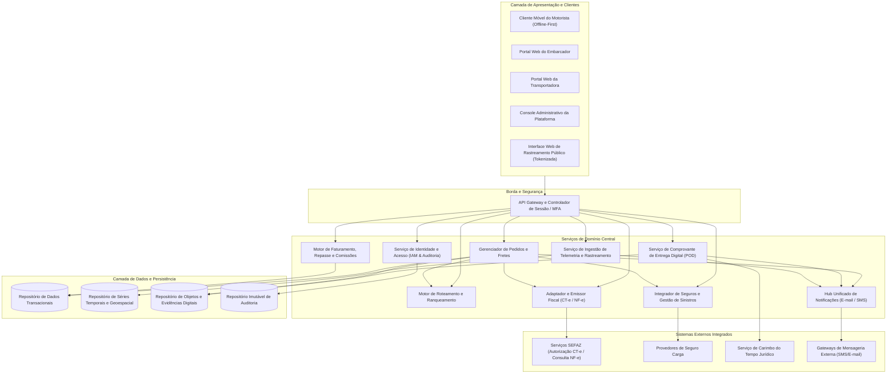
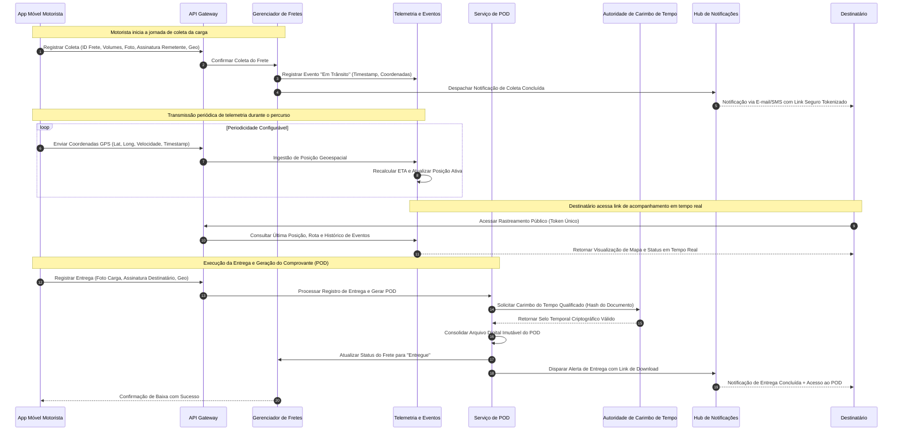

# Relatório Técnico de Arquitetura de Software

## 1. Identificação das HUs

A tabela a seguir consolida as Histórias de Usuário do sistema, seus respectivos atores, objetivos de negócio e o mapeamento direto com os Requisitos Funcionais (RF) e Requisitos Não Funcionais (RNF).

| ID | Título | Ator Primário | Objetivo / Descrição Sumária | Requisitos Vinculados |
| :--- | :--- | :--- | :--- | :--- |
| **HU01** | Registrar pedido de frete | Embarcador | Cadastrar ordens de transporte com características de carga, restrições e anexos para disparo do roteamento automático. | RF01, RF05, RF06, RF09, RF10, RNF01, RNF02, RNF03 |
| **HU02** | Selecionar transportadora e contratar seguro | Embarcador | Visualizar opções ranqueadas, contratar apólice de seguro por viagem e confirmar frete com emissão do CT-e. | RF11, RF12, RF17, RF20, RF41, RNF13, RNF14, RNF24 |
| **HU03** | Acompanhar pedidos e receber POD | Embarcador | Monitorar status em painel consolidado, receber alertas de ocorrências e obter o comprovante de entrega (POD). | RF07, RF34, RF37, RF39, RNF02, RNF10, RNF12 |
| **HU04** | Abrir sinistro por avaria ou extravio | Embarcador | Formalizar abertura de sinistro vinculando ocorrências, laudos e fotos diretamente às seguradoras parceiras. | RF42, RF43, RF44, RNF02, RNF24 |
| **HU05** | Aceitar pedidos de frete e gerenciar frota | Transportadora | Receber ofertas de frete compatíveis, gerenciar aceite/recusa por prazo e vincular motoristas e veículos. | RF03, RF13, RF14, RF15, RF16, RF35, RNF13 |
| **HU06** | Acompanhar operação dos motoristas | Transportadora | Monitorar motoristas em tempo real no mapa, acompanhar SLAs e intervir em ocorrências operacionais. | RF25, RF26, RF32, RF35, RNF06, RNF15, RNF16, RNF23 |
| **HU07** | Consultar demonstrativo financeiro | Transportadora | Visualizar faturamento líquido, comissões retidas da plataforma e extrato detalhado para conciliação. | RF45, RF46, RF48, RNF02, RNF11 |
| **HU08** | Executar coleta com evidências | Motorista | Registrar início de transporte com checagem de volumes, fotos da carga e assinatura digital do remetente. | RF23, RF24, RF28, RF29, RNF04, RNF17, RNF18, RNF21 |
| **HU09** | Registrar entrega com POD | Motorista | Capturar assinatura digital do destinatário, foto do comprovante e coordenadas com carimbo de tempo (online/offline). | RF27, RF28, RF37, RF38, RF39, RF40, RNF04, RNF10, RNF17, RNF21 |
| **HU10** | Registrar ocorrência em trânsito | Motorista | Notificar avarias, tentativas frustradas, acidentes ou sinistros com evidências anexadas via aplicativo móvel. | RF26, RF28, RF31, RF34, RF35, RNF17, RNF18 |
| **HU11** | Rastrear carga sem cadastro | Destinatário | Acessar rastreamento público via link tokenizado, visualizando mapa, histórico de eventos e previsão dinâmica. | RF30, RF31, RF32, RNF01, RNF05, RNF12, RNF15 |
| **HU12** | Receber notificações de entrega | Destinatário | Receber alertas multicanal (E-mail/SMS) sobre o ciclo de vida da carga e gerenciar preferências de comunicação. | RF33, RNF05, RNF09 |
| **HU13** | Monitorar SLA e contingência | Administrador | Identificar fretes em risco, reatribuir pedidos sem transportadora e auditar o cumprimento dos níveis de serviço. | RF04, RF15, RF16, RF36, RNF11, RNF12, RNF25 |
| **HU14** | Acompanhar painel financeiro | Administrador | Gerenciar receita global, comissionamento retido, faturamento consolidado e indicadores de inadimplência. | RF46, RF47, RF49, RNF02, RNF11, RNF25 |

---

## 2. Diagramas de Arquitetura (Mermaid)

### 2.1. Diagrama Estrutural de Componentes da Plataforma

---

### 2.2. Diagrama de Sequência: Ciclo de Vida de Execução do Frete, Coleta e Entrega Digital (POD)

---

## 3. Decisões de Arquitetura

### Decisão 01: Arquitetura Orientada a Serviços com Desacoplamento Fiscal e Operacional
* **Contexto:** A plataforma lida com requisitos concorrentes de alta frequência (telemetria contínua a cada poucos segundos) e transações regulatórias de baixa latência e alta consistência (CT-e, validação de NF-e na SEFAZ e liquidação financeira).
* **Decisão:** Segmentar os domínios em serviços especializados com limites claros de contexto. A comunicação síncrona é restrita a operações de consulta imediata e validação de sessão; operações de emissão fiscal, roteamento automático, persistência de telemetria e despacho de notificações ocorrem por meio de eventos assíncronos e filas de processamento distribuído.
* **Consequências:** Garante que a instabilidade de serviços governamentais externos (SEFAZ) não degrade a ingestão de coordenadas de rastreamento ou a usabilidade das aplicações móveis e web.

### Decisão 02: Padrão *Offline-First* com Bufferização Criptografada no Cliente Móvel
* **Contexto:** Motoristas realizam coletas e entregas em áreas rurais ou rodovias sem cobertura de rede móvel (RNF17, RF28). Nenhum evento transacional de coleta, entrega ou ocorrência pode ser perdido.
* **Decisão:** O aplicativo do motorista manterá uma base de dados local criptografada para armazenar mutações, fotos, assinaturas digitais vetoriais e coordenadas GPS coletadas em modo desconectado. Ao detectar restabelecimento de conectividade, o cliente executa sincronização idempotente baseada em chaves de transação únicas.
* **Consequências:** Elimina a perda de dados em trânsito; exige tratamento avançado de concorrência, idempotência nos pontos de entrada da API e mecanismos de validação temporal retrospectiva.

### Decisão 03: Rastreamento Público sem Autenticação via Tokens Assinados e com Expiração
* **Contexto:** O destinatário da mercadoria necessita acompanhar o frete em tempo real sem atrito de cadastro (RF30, HU11), porém os dados de outros fretes e posições de outros motoristas devem permanecer estritamente protegidos (RNF05, RNF06).
* **Decisão:** Acesso à interface de rastreamento do destinatário através de identificadores opacos associados a tokens de segurança assinados digitalmente e de uso restrito por escopo de carga. Estes tokens possuem tempo de expiração determinado (fechamento após confirmação de entrega + janela de visualização do POD) e limitam o escopo de leitura estritamente aos dados daquele frete específico.
* **Consequências:** Atende à conformidade com a LGPD e RNF05/RNF06, impedindo a enumeração de fretes por agentes não autorizados e garantindo facilidade de uso ao consumidor final.

### Decisão 04: Motor de Comprovante de Entrega Digital (POD) com Carimbo de Tempo Jurídico
* **Contexto:** O POD substitui o canhoto de papel e deve possuir validade jurídica incontestável (RF37, RF38, RNF10) conforme a Lei nº 14.063/2020, registrando evidências imutáveis do ato de entrega.
* **Decisão:** O subsistema de POD encapsulará os artefatos de entrega (imagem do comprovante/mercadoria, vetor de assinatura, metadados de geolocalização e identificador do motorista) em um documento digital padronizado. O hash deste documento é submetido a uma Autoridade de Carimbo de Tempo para anexação de carimbo temporal sincronizado a fontes oficiais antes de ser arquivado em armazenamento imutável.
* **Consequências:** Confere força probatória aos registros operacionais, reduzindo litígios trabalhistas e comerciais entre embarcador, transportadora e destinatário.

### Decisão 05: Segregação do Repositório de Telemetria e Otimização Geoespacial
* **Contexto:** Milhares de motoristas transmitem telemetria em tempo real (RNF15, RNF16, RNF23), gerando um volume expressivo de séries temporais que degradariam bancos de dados relacionais transacionais tradicionais.
* **Decisão:** Isolar a persistência de coordenadas geográficas e leituras de sensores em um mecanismo de persistência otimizado para séries temporais e indexação geoespacial. O banco de dados transacional mantém apenas o ponteiro do estado atual consolidado do frete.
* **Consequências:** Garante escalabilidade horizontal da ingestão de coordenadas sem impacto no processamento de pedidos, liquidação de comissões e emissão fiscal.

---

## 4. Tabela de Componentes e Rastreabilidade

| Componente | Responsabilidade Principal | Comunica-se com | Origem (HU / Critério de Aceite) |
| :--- | :--- | :--- | :--- |
| **Módulo de Identidade e Acesso (IAM & Auditoria)** | Autenticar usuários, aplicar MFA para administradores e embarcadores, emitir e renovar tokens de sessão móvel e gravar trilha imutável de auditoria. | API Gateway, Repositório de Auditoria, DB Transacional | RF01, RF02, RF04, RNF03, RNF04, RNF11 |
| **Gerenciador de Pedidos e Fretes** | Orquestrar o ciclo de vida do pedido de frete (registro, cotação, aceite, despacho, cancelamento, alteração de status e anexos). | Routing Engine, Fiscal Service, Insurance Service, Notification Hub, DB Transacional, Storage de Documentos | RF05, RF06, RF07, RF08, RF09, HU01, HU03, HU05 |
| **Motor de Roteamento e Ranqueamento** | Calcular fretes comparativos, ranquear transportadoras por preço/prazo/veículo/score e gerenciar regra de transbordo por timeout de aceite. | Gerenciador de Pedidos e Fretes, DB Transacional | RF10, RF11, RF12, RF14, RF15, RF16, RNF13, HU01, HU02 |
| **Adaptador Fiscal e Emissor CT-e** | Validar NF-es na SEFAZ, gerar leiaute XML do CT-e conforme schema XSD, transmitir autorizações, emitir DACTE e tratar contingência offline. | Gerenciador de Pedidos, Provedor SEFAZ, Storage de Documentos, DB Transacional | RF17, RF18, RF19, RF20, RF21, RF22, RNF07, RNF08, RNF14, HU02 |
| **Serviço de Ingestão de Telemetria e Rastreamento** | Ingerir fluxos de coordenadas GPS, calcular previsão dinâmica de entrega (ETA), armazenar séries temporais e alimentar mapas de tracking. | App Motorista, Tracking Público, Notification Hub, DB Geoespacial | RF25, RF30, RF31, RF32, RNF05, RNF06, RNF15, RNF16, RNF23, HU06, HU11 |
| **Serviço de POD e Assinatura Digital** | Consolidar pacote de entrega digital (foto + assinatura + geo), obter carimbo de tempo jurídico e publicar POD para as partes. | App Motorista, Autoridade de Carimbo de Tempo, Storage de Documentos, Notification Hub | RF24, RF27, RF37, RF38, RF39, RF40, RNF10, HU08, HU09 |
| **Gerenciador de Ocorrências e Sinistros** | Registrar desvios de transporte (avarias, acidentes, recusas), acionar seguradoras parceiras e gerir documentação probatória de sinistros. | App Motorista, Portal Embarcador, Provedores de Seguros, Storage de Documentos, DB Transacional | RF26, RF41, RF42, RF43, RF44, HU04, HU10 |
| **Motor de Faturamento, Repasse e Comissões** | Calcular ad valorem, liquidar valores brutos e líquidos de frete, reter comissão da plataforma e gerar demonstrativos e faturas periódicas. | Gerenciador de Pedidos, Portal Financeiro, DB Transacional | RF45, RF46, RF47, RF48, RF49, HU07, HU14 |
| **Hub Unificado de Notificações** | Gerenciar preferências de contato e despachar notificações transacionais automatizadas via SMS e E-mail para todas as partes. | Gateways de Notificação Externos, Gerenciador de Pedidos, Telemetria, POD Service | RF33, RF34, RF35, RF36, HU12 |
| **Cliente Móvel do Motorista (Driver App)** | Prover interface acessível com suporte a luvas/baixa luminosidade, guiar rotas multiparadas, coletar dados offline e sincronizar com o backend. | API Gateway (endpoints de coleta, entrega, ocorrências e telemetria) | RF23, RF24, RF25, RF26, RF27, RF28, RF29, RNF17, RNF18, RNF19, RNF21, HU08, HU09, HU10 |

---

## 5. Bloqueios e Pendências

1. **Definição de Provedores Oficiais de Carimbo de Tempo (Lei nº 14.063/2020):**
   * *Pendência:* O requisito RNF10 estabelece a obrigatoriedade de carimbo de tempo com validade jurídica formal para o POD. É necessário formalizar se o selo temporal exigirá credenciamento ICP-Brasil (Assinatura Eletrônica Qualificada) ou se utilizará o padrão de Assinatura Avançada com certificado corporativo do emissor da plataforma.
   * *Ação:* Validar a classificação jurídica de aceite junto ao corpo jurídico dos embarcadores para definir o protocolo de integração com a Autoridade Certificadora de Tempo.

2. **Protocolo de Tolerância a Indisponibilidade da SEFAZ Estadual:**
   * *Pendência:* As regras de autorização de CT-e em contingência (RF19 e RNF08) variam de acordo com as Unidades Federativas (SVAN, SVRS, contingência FS-DA ou EPEC). 
   * *Ação:* Mapear a matriz de contingência por UF para implementar o chaveamento automático de emissão em contingência quando o tempo de resposta da SEFAZ exceder o SLA de 30 segundos (RNF14).

3. **Integração de APIs com Seguradoras Parceiras:**
   * *Pendência:* Necessidade de padronização do contrato de API para averbação automática da carga e abertura de sinistro (RF41, RF42), considerando que nem todas as seguradoras disponibilizam endpoints síncronos com suporte a anexos pesados (laudos/fotos).
   * *Ação:* Estabelecer um adaptador de mensageria com fila de retentativas assíncronas para averbação de apólices e tramitação de sinistros.

---

## 6. Cobertura de Requisitos

A matriz abaixo comprova a total cobertura dos 49 Requisitos Funcionais e 25 Requisitos Não Funcionais na arquitetura proposta.

| Grupo de Requisitos | IDs Cobertos | Componente(s) Arquitetural(is) Responsável(is) |
| :--- | :--- | :--- |
| **Gestão de Acesso e Usuários** | RF01, RF02, RF03, RF04 | Módulo de Identidade e Acesso (IAM & Auditoria), API Gateway |
| **Pedidos e Cargas** | RF05, RF06, RF07, RF08, RF09 | Gerenciador de Pedidos e Fretes, Storage de Objetos |
| **Roteamento e Ranqueamento** | RF10, RF11, RF12, RF13, RF14, RF15, RF16 | Motor de Roteamento e Ranqueamento, Gerenciador de Pedidos |
| **Documento Fiscal (CT-e/NF-e)** | RF17, RF18, RF19, RF20, RF21, RF22 | Adaptador Fiscal e Emissor CT-e, Storage de Documentos |
| **Operação do Motorista (Mobile)** | RF23, RF24, RF25, RF26, RF27, RF28, RF29 | Cliente Móvel do Motorista, Serviço de Telemetria, POD Service |
| **Rastreamento em Tempo Real** | RF30, RF31, RF32 | Serviço de Telemetria e Rastreamento, Repositório Geoespacial |
| **Alertas e Notificações** | RF33, RF34, RF35, RF36 | Hub Unificado de Notificações, Gateways Externos |
| **Comprovante Digital (POD)** | RF37, RF38, RF39, RF40 | Serviço de POD e Assinatura Digital, Storage de Documentos |
| **Seguros e Sinistros** | RF41, RF42, RF43, RF44 | Gerenciador de Ocorrências e Sinistros, Adaptadores Seguradora |
| **Financeiro e Faturamento** | RF45, RF46, RF47, RF48, RF49 | Motor de Faturamento, Repasse e Comissões |
| **Segurança e Criptografia** | RNF01, RNF02, RNF03, RNF04, RNF05, RNF06 | API Gateway, Módulo IAM, Repositórios Criptografados (AES-256) |
| **Conformidade Regulatória** | RNF07, RNF08, RNF09, RNF10, RNF11 | Adaptador Fiscal, Serviço de POD, Trilha Imutável de Auditoria |
| **Disponibilidade e Desempenho** | RNF12, RNF13, RNF14, RNF15, RNF16, RNF17 | Arquitetura Distribuída, Motor de Roteamento, Fila Assíncrona |
| **Usabilidade e Interfaces** | RNF18, RNF19, RNF20, RNF21 | Cliente Móvel do Motorista, Portais Web Responsivos |
| **Infraestrutura e Integrações**| RNF22, RNF23, RNF24, RNF25 | DB Geoespacial, Contratos de API Versionados, Repositórios |

---

## 7. Gap Analysis

A análise a seguir identifica lacunas de especificação na entrada de requisitos, seus impactos potenciais na arquitetura e as ações de mitigação estabelecidas.

| # | Lacuna de Especificação Identificada | Impacto Técnico / Arquitetural | Ação Arquitetural / Solução Recomendada |
| :--- | :--- | :--- | :--- |
| **G01** | **Resolução de Conflitos em Sincronização Concorrente Offline:** Os requisitos preveem operação offline do motorista (RF28, RNF17), mas não especificam o comportamento caso um pedido seja cancelado pelo embarcador enquanto o motorista estiver desconectado e executando a coleta. | Inconsistência de estado entre o ERP do embarcador e o dispositivo físico em trânsito; risco de coleta indevida. | Implementar estratégia de resolução determinística no backend: o evento de coleta efetuado em campo prevalece sobre cancelamentos concorrentes, acionando automaticamente um fluxo compensatório de devolução monitorada. |
| **G02** | **Tratamento de Assinatura com Recusa Parcial de Mercadoria:** O RF40 trata a recusa de recebimento, mas não detalha se há suporte a recebimento parcial de volumes com emissão de CT-e de retorno complementar. | O POD pode registrar entrega de volumes com divergência sem respaldo fiscal automatizado. | Isolar o fluxo de recusa em duas categorias no aplicativo do motorista: Recusa Integral (retorno total da mercadoria) e Entrega com Ressalva/Parcial, acionando o módulo fiscal para emissão automática do evento de desacordo e documento fiscal de devolução. |
| **G03** | **Políticas de Retenção e Expurgos para Conformidade LGPD:** O RNF09 exige conformidade com a LGPD e o RNF11 exige guarda de 5 anos de dados fiscais/financeiros pelo CTN, havendo potencial conflito sobre dados pessoais de destinatários e motoristas. | Risco de vazamento de dados de localização histórica e dados pessoais de terceiros após o encerramento do transporte. | Implementar rotina de anonimização e expurgo progressivo: dados cadastrais diretos e históricos detalhados de GPS de motoristas/destinatários são anonimizados após a conclusão do frete e liquidação fiscal, preservando-se apenas os logs fiscais e financeiros estritamente requeridos pelo prazo legal de 5 anos. |
| **G04** | **Degradação de Qualidade de Imagem em Upload Offline:** O RNF21 restringe o fluxo de entrega a 4 interações, mas uploads de fotos de alta resolução em conexões 3G/4G instáveis podem falhar ou exaurir o tráfego do motorista. | Falhas na transmissão do POD e lentidão na confirmação de entrega para o cliente final. | Configurar compressão e otimização de imagem na camada de cliente antes do enfileiramento de sincronização, mantendo a legibilidade do texto e metadados criptográficos em tamanho reduzido. |