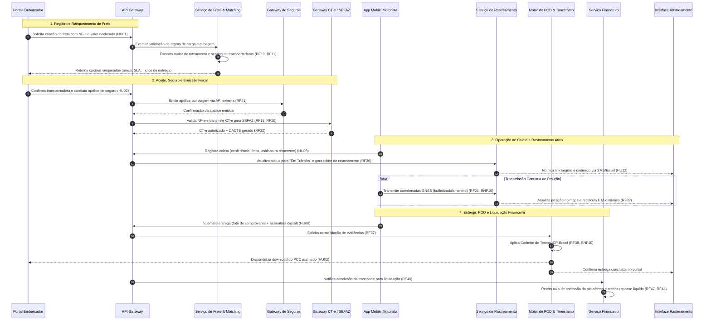
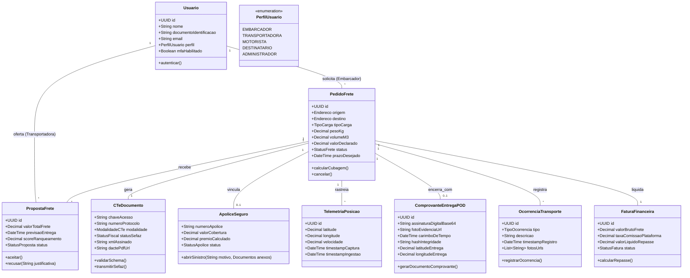

# Relatório Técnico de Arquitetura de Software

## 1. Identificação das HUs

A tabela abaixo consolida as Histórias de Usuário (HUs) do sistema, categorizadas por perfil de acesso, seus objetivos de negócio e critérios essenciais de aceitação:

| ID | Perfil | Título / Objetivo de Negócio | Critérios Essenciais de Aceitação |
| :--- | :--- | :--- | :--- |
| **HU01** | Embarcador | **Registrar pedido de frete** Permitir a criação de ordens de frete estruturadas com disparo de roteamento automático sem intervenção manual. | Preenchimento obrigatório de origem, destino, dimensões, peso e valor declarado; upload de documentos (NF-e, fichas); disparo do pipeline de matching. |
| **HU02** | Embarcador | **Selecionar transportadora e contratar seguro** Comparar transportadoras ranqueadas por múltiplos critérios e efetuar contratação integrada de apólice de seguro de carga. | Exibição de score/preço/prazo; contratação integrada de seguro por viagem; acionamento automático de emissão fiscal (CT-e) e notificação da transportadora. |
| **HU03** | Embarcador | **Acompanhar pedidos e receber comprovante (POD)** Monitoramento consolidado do ciclo de vida da carga com recebimento em tempo real do comprovante com validade jurídica. | Visão integrada com status e alertas visuais de desvios; download do POD imediatamente após a entrega; notificação imediata de ocorrências. |
| **HU04** | Embarcador | **Abrir sinistro por avaria ou extravio** Formalização e tramitação digital de sinistros com a seguradora integrada via plataforma. | Vinculação direta ao frete, ocorrências e fotos registradas; anexo de laudos/BO; atualização e notificação sobre o status do processo na seguradora. |
| **HU05** | Transportadora | **Aceitar pedidos de frete e gerenciar frota** Avaliação de ofertas de frete roteadas, aceite/recusa com SLA de resposta e alocação de frota/motoristas. | Exibição prévia de detalhes da carga e remuneração; aceite com timeout para cascata de transportadoras; recusa com justificativa obrigatória. |
| **HU06** | Transportadora | **Acompanhar operação dos motoristas em tempo real** Monitoramento de telemetria, rotas ativas e ocorrências de campo da frota vinculada. | Painel geoespacial com localização dos veículos; alertas imediatos de desvio ou incidentes; canal de comunicação com o condutor. |
| **HU07** | Transportadora | **Consultar demonstrativo financeiro de repasse** Acompanhamento de créditos, comissões retidas pela plataforma e valores líquidos a receber. | Discriminação individualizada por frete (bruto, taxa de comissão, líquido); filtros temporais e exportação em formatos estruturados (CSV/PDF). |
| **HU08** | Motorista | **Executar coleta com registro de evidências** Formalização do início do transporte via aplicativo mobile com validação documental e física. | Conferência de volumes; captura de fotos e assinatura digital do remetente; transição de estado da carga para "em trânsito"; registro de ressalvas na coleta. |
| **HU09** | Motorista | **Registrar entrega com assinatura digital do destinatário** Conclusão da entrega com captura de evidências digitais (POD) e operação em modo offline. | Captura de foto, assinatura e geocoordenadas em até 4 toques; geração de POD com carimbo de tempo; suporte a recusa documentada; sincronização offline. |
| **HU10** | Motorista | **Registrar ocorrência durante o transporte** Apontamento em campo de eventos impeditivos ou acidentais durante o trajeto. | Categorização padronizada (avaria, roubo, ausência do recebedor); anexo de fotos comprobatórias; notificação instantânea às partes interessadas. |
| **HU11** | Destinatário | **Rastrear carga em tempo real sem cadastro** Acesso transparente ao rastreamento por link tokenizado e seguro sem barreira de login. | Acesso direto via token descartável e efêmero; mapa com posição atualizada da carga e previsão dinâmica (ETA); histórico cronológico de eventos. |
| **HU12** | Destinatário | **Receber notificações de cada etapa da entrega** Comunicação proativa multicanal (E-mail/SMS) com informações acionáveis do frete. | Disparos automáticos em marcos críticos (coleta, trânsito, rota de entrega, conclusão e ocorrência); gestão de preferências de canal pelo destinatário. |
| **HU13** | Administrador | **Monitorar SLA de fretes e acionar contingência** Governança operacional de pedidos órfãos, atrasos iminentes e intervenção corretiva. | Painel de controle de SLAs em risco; alarmes de fretes não aceitos com reatribuição manual; comunicação integrada de contingência. |
| **HU14** | Administrador | **Acompanhar painel financeiro da plataforma** Visibilidade analítica de receitas de comissão, volumetria transacional e controle de inadimplência. | Métricas consolidadas de take-rate, volume bruto transacionado (GMV), ticket médio e inadimplência; filtros multidimensionais e extração de relatórios. |

---

## 2. Diagramas de Arquitetura (Mermaid)

### 2.1. Diagrama de Componentes Lógicos (Visão C4 Nível 2/3 Conceitual)

```mermaid
flowchart TB
    subgraph ClientLayer["Camada de Apresentação e Clientes"]
        WEB_SHIPPER["Portal Web do Embarcador"]
        WEB_CARRIER["Portal Web da Transportadora"]
        WEB_ADMIN["Painel de Controle Administrativo"]
        MOB_DRIVER["Aplicativo Mobile do Motorista (Offline-First)"]
        WEB_TRACKING["Interface Web de Rastreamento (Pública/Tokenizada)"]
    end

    subgraph EdgeLayer["Camada de Borda e Segurança"]
        API_GW["API Gateway e Controlador de Borda\n[Roteamento, Rate Limiting, TLS Termination]"]
        AUTH_MFA["Provedor de Identidade, Sessão e MFA"]
    end

    subgraph CoreServices["Camada de Serviços de Domínio (Lógica de Negócio)"]
        AUTH_SRV["Serviço de Gestão de Acessos e Perfis"]
        FREIGHT_SRV["Serviço de Pedidos de Frete e Cargas"]
        ROUTING_SRV["Motor de Roteamento, Cotação e Ranqueamento"]
        FISCAL_SRV["Gateway de Emissão e Validação Fiscal (CT-e / SEFAZ)"]
        INSURANCE_SRV["Gateway de Integração de Seguros e Sinistros"]
        TRACKING_SRV["Serviço de Ingestão e Processamento de Telemetria"]
        DRIVER_SRV["Serviço de Operações de Campo do Motorista"]
        POD_SRV["Motor de Geração de Comprovante Digital (POD)"]
        NOTIF_SRV["Barramento / Hub de Notificações Multicanal"]
        FIN_SRV["Serviço Financeiro, Comissionamento e Faturamento"]
        AUDIT_SRV["Serviço de Auditoria e Conformidade Legal"]
    end

    subgraph EventAndMessaging["Espinha Dorsal de Eventos"]
        EVENT_BUS["Barramento de Eventos e Mensageria Assíncrona"]
    end

    subgraph DataStorageLayer["Camada de Persistência Abstrata"]
        DB_RELATIONAL[("Repositório de Dados Transacional / Relacional")]
        DB_TIMESERIES[("Repositório Geoespacial e Séries Temporais")]
        DOC_STORAGE[("Repositório de Documentos e Evidências Digitais")]
        DB_AUDIT[("Repositório de Trilha de Auditoria Imutável")]
    end

    subgraph ExternalEntities["Sistemas e Provedores Externos"]
        EXT_SEFAZ["Serviços SEFAZ (Autorização CT-e / Consulta NF-e)"]
        EXT_INSURER["APIs de Seguradoras Parceiras"]
        EXT_NOTIF["Provedores de Telecomunicação (SMS / E-mail)"]
        EXT_TIMESTAMP["Autoridade Certificadora de Carimbo de Tempo (ACT)"]
    end

    %% Client to Edge
    WEB_SHIPPER --> API_GW
    WEB_CARRIER --> API_GW
    WEB_ADMIN --> API_GW
    MOB_DRIVER --> API_GW
    WEB_TRACKING --> API_GW

    API_GW --> AUTH_MFA
    API_GW --> CoreServices

    %% Internal Communication & Events
    FREIGHT_SRV --> EVENT_BUS
    ROUTING_SRV --> EVENT_BUS
    FISCAL_SRV --> EVENT_BUS
    TRACKING_SRV --> EVENT_BUS
    DRIVER_SRV --> EVENT_BUS
    POD_SRV --> EVENT_BUS
    FIN_SRV --> EVENT_BUS
    INSURANCE_SRV --> EVENT_BUS

    EVENT_BUS --> NOTIF_SRV
    EVENT_BUS --> AUDIT_SRV

    %% External Connections
    FISCAL_SRV <--> EXT_SEFAZ
    INSURANCE_SRV <--> EXT_INSURER
    NOTIF_SRV --> EXT_NOTIF
    POD_SRV <--> EXT_TIMESTAMP

    %% Data Connections
    AUTH_SRV & FREIGHT_SRV & ROUTING_SRV & FIN_SRV & DRIVER_SRV --> DB_RELATIONAL
    TRACKING_SRV --> DB_TIMESERIES
    POD_SRV & FISCAL_SRV & INSURANCE_SRV & FREIGHT_SRV --> DOC_STORAGE
    AUDIT_SRV --> DB_AUDIT
```

---

### 2.2. Diagrama de Sequência: Ciclo de Vida do Frete (Contratação, Execução, POD e Liquidação)

---

### 2.3. Diagrama de Classes de Domínio Conceitual

---

## 3. Decisões de Arquitetura

### 3.1. ADR 01: Padrão Arquitetural Híbrido Orientado a Eventos e Microserviços
* **Contexto:** A plataforma necessita atender a requisitos estritos de desacoplamento, escalabilidade para alto volume de telemetria (RNF16), integração assíncrona com órgãos fiscais e seguradoras, e processamento de regras de negócio em até 10s (RNF13).
* **Decisão:** Adotar uma arquitetura baseada em serviços fracamente acoplados, orquestrados por uma espinha dorsal de mensageria/eventos assíncronos. As operações síncronas de consulta e comando passam por um API Gateway com terminação de segurança, enquanto transições de estado de carga, eventos de telemetria e notificações trafegam via barramento de eventos.
* **Consequências:**
  * *Positivas:* Resiliência contra indisponibilidade momentânea de terceiros (SEFAZ/Seguradoras); isolamento do processamento em lote de telemetria sem degradar o fluxo transacional de pedidos.
  * *Mitigações:* Necessidade de consistência eventual em operações não-críticas e rastreabilidade distribuída via Correlation-ID.

### 3.2. ADR 02: Estratégia de Persistência Poliglota e Segregação de Dados
* **Contexto:** Os dados da plataforma possuem naturezas heterogêneas: transações fiscais/financeiras exigem ACID e retenção de 5 anos (RNF11); dados de localização exigem alto throughput de escrita e consultas geoespaciais em séries temporais (RNF23); evidências digitais e fotos exigem armazenamento durável de objetos.
* **Decisão:** Segregar a camada de dados em três mecanismos conceituais:
  1. *Motor Relacional Transacional:* Para entidades centrais, faturamento, permissões e registros de auditoria.
  2. *Motor de Séries Temporais e Geoespacial:* Otimizado para ingestão rápida de coordenadas de motoristas e consultas de proximidade/histórico.
  3. *Motor de Armazenamento de Objetos Imutáveis:* Para guarda segura de XMLs de CT-e, DACTEs, fotos de coleta/entrega e arquivos de POD com carimbo de tempo.
* **Consequências:** Garante o cumprimento do RPO máximo de 1 hora (RNF22) e previne degradação do banco principal pelo volume contínuo de rastreamento.

### 3.3. ADR 03: Arquitetura do Aplicativo Mobile com Operação Offline-First e Sincronização Segura
* **Contexto:** Motoristas frequentemente transitam por áreas com conectividade celular instável ou nula (sombra de sinal), mas não podem ser impedidos de coletar, registrar ocorrências ou colher assinaturas de entrega (RNF17, RF28).
* **Decisão:** Implementar padrão *Offline-First* no cliente mobile. O aplicativo mantém um repositório local protegido por chave de criptografia derivada do token de sessão (RNF04). Todas as transições de status, coordenadas GNSS, fotos e assinaturas são enfileiradas localmente com carimbo de data/hora do dispositivo e sincronizadas de forma idempotente assim que a conectividade for restabelecida.
* **Consequências:** Elimina a perda de dados em campo. Exige controle rigoroso de concorrência e identificadores universais únicos (UUIDv4) gerados no cliente para evitar colisões no servidor.

### 3.4. ADR 04: Isolamento e Efemeridade no Rastreamento Público sem Autenticação
* **Contexto:** Destinatários precisam rastrear suas mercadorias sem criar credenciais na plataforma (RF30), porém dados de localização não podem vazar nem expor informações de terceiros (RNF05, RNF06).
* **Decisão:** O acesso público ao rastreamento é viabilizado por meio de tokens criptográficos opacos, de alta entropia, atribuídos univocamente a um único frete e associados a um ciclo de vida estrito (expiração automática após a conclusão do frete + janela de carência configurável). O endpoint de consulta expõe apenas a projeção sanitizada dos dados (posição do veículo, histórico do frete específico e ETA recalculado), sem acesso a dados cadastrais sensíveis do embarcador, transportadora ou outros fretes compartilhados na mesma rota.

### 3.5. ADR 05: Mecanismo de Validade Jurídica para o Comprovante de Entrega Digital (POD)
* **Contexto:** A substituição do comprovante em papel exige conformidade com a Lei nº 14.063/2020 e aceitação jurídica irrefutável (RF37, RF38, RNF10).
* **Decisão:** O POD será gerado em formato canônico consolidando: assinatura manuscrita digitalizada, metadados de geolocalização do dispositivo no momento da captura, evidência fotográfica, identificador da chave do CT-e e carimbo de tempo (*timestamping*) emitido em conformidade com padrões de Autoridade Certificadora de Tempo. O artefato gerado recebe hash criptográfico SHA-256 e torna-se imutável no armazenamento de documentos.

---

## 4. Tabela de Componentes e Rastreabilidade

| Componente | Responsabilidade Principal | Comunica-se com | Origem (HU / Critério de Aceite) |
| :--- | :--- | :--- | :--- |
| **Controlador de Borda e API Gateway** | Ponto único de entrada, terminação TLS (RNF01), validação de tokens JWT, rate limiting e roteamento perimetral. | Clientes Web/Mobile, Provedor de Identidade, Serviços de Domínio | RF02, RNF01, RNF03, RNF04, RNF05 |
| **Serviço de Gestão de Acessos e Perfis** | Cadastro e gestão de embarcadores, transportadoras, motoristas e administradores; aplicação de RBAC e controle de MFA. | API Gateway, Repositório Transacional, Auditoria | RF01, RF02, RF03, RNF03, HU05 |
| **Serviço de Pedidos de Frete e Cargas** | Gestão do ciclo de vida dos pedidos, validação de regras de carga, dimensões, valores declarados e cancelamento. | Barramento de Eventos, Repositório Transacional, Repositório de Documentos | RF05, RF06, RF07, RF08, RF09, HU01, HU03 |
| **Motor de Roteamento e Ranqueamento** | Seleção algorítmica de transportadoras homologadas, scoring multidimensional (preço, prazo, performance) e cascata de aceite. | Repositório Transacional, Barramento de Eventos, Gateway de Notificações | RF10, RF11, RF12, RF14, RF15, RF16, RNF13, HU01, HU02, HU05 |
| **Gateway Fiscal de CT-e** | Integração bidirecional com SEFAZ, validação de NF-e, emissão de CT-e (normal/contingência), controle de DACTE e cancelamentos. | SEFAZ Externa, Barramento de Eventos, Armazenamento de Documentos | RF17, RF18, RF19, RF20, RF21, RF22, RNF07, RNF08, RNF14, HU02 |
| **Serviço de Operações de Campo (Motorista)** | Gestão de ordens de serviço mobile, controle de coletas, paradas, roteirização otimizada e protocolo offline-first. | App Mobile, Repositório Transacional, Barramento de Eventos | RF23, RF24, RF27, RF28, RF29, RNF17, RNF18, RNF21, HU08, HU09 |
| **Serviço de Ingestão de Telemetria e Rastreamento** | Ingestão contínua de coordenadas GNSS, recálculo de ETA em tempo real e fornecimento da visão pública tokenizada de rastreio. | App Mobile, Interface Destinatário, Repositório Séries Temporais, Barramento | RF25, RF30, RF31, RF32, RNF06, RNF15, RNF16, RNF23, HU06, HU11 |
| **Gestor de Ocorrências e Sinistros** | Registro e triagem de ocorrências em trânsito (avarias, extravios, roubos) e integração com seguradoras parceiras para apólices/sinistros. | App Motorista, Seguradoras Externas, Barramento de Eventos, Documentos | RF26, RF40, RF41, RF42, RF43, RF44, HU04, HU10 |
| **Motor de Comprovante de Entrega (POD)** | Agrupamento de evidências de entrega, geração do documento POD, integração com Autoridade de Carimbo de Tempo e distribuição. | App Motorista, ACT Externa, Armazenamento de Documentos, Barramento | RF37, RF38, RF39, RNF10, HU03, HU09 |
| **Hub de Notificações Multicanal** | Roteamento e envio de alertas transacionais por E-mail e SMS aos atores do sistema de acordo com eventos de frete. | Provedores SMS/E-mail, Barramento de Eventos | RF13, RF33, RF34, RF35, RF36, HU12, HU13 |
| **Serviço Financeiro e de Comissionamento** | Cálculo de frete, apuração automática de taxa de comissão da plataforma, emissão de faturas consolidadas e repasses líquidos. | Repositório Transacional, Barramento de Eventos | RF45, RF46, RF47, RF48, RF49, HU07, HU14 |
| **Serviço de Auditoria e Conformidade Legal** | Coleta centralizada e gravação imutável de logs de operações críticas, fiscais, financeiras e de acesso conforme LGPD e CTN. | Todos os Serviços de Domínio, Repositório de Auditoria Imutável | RF04, RNF02, RNF09, RNF11, RNF25 |

---

## 5. Bloqueios e Pendências

1. **Definição da Infraestrutura de Carimbo de Tempo (ACT/PKI):**
   * *Pendência:* O requisito RNF10 e RF38 exigem carimbo de tempo com validade jurídica (Lei 14.063/2020), mas não especificam se a Autoridade de Carimbo do Tempo (ACT) será contratada externamente via credenciamento ICP-Brasil ou gerada via Módulo de Segurança de Hardware (HSM) corporativo.
   * *Ação Necessária:* Alinhar com o setor jurídico e de compliance a definição do padrão de certificado digital (A1 corporativo centralizado vs A3 distribuído) e contratar provedor homologado de Carimbo do Tempo.

2. **Fluxo de Contingência Fiscal de CT-e no Ambiente Mobile:**
   * *Pendência:* O RF19 exige suporte a CT-e em contingência offline. É necessário esclarecer se a chave de contingência (FS-DA ou EPEC) pode ser emitida diretamente pelo backend quando alertado pelo motorista ou se o motorista só inicia o trânsito após autorização remota prévia.
   * *Ação Necessária:* Definir a política de transporte de carga em zonas desconectadas: a mercadoria só sai com CT-e/DACTE pré-autorizado ou com formulário de contingência pré-impresso.

3. **Política de Reatribuição e Cascata de Fretes Recusados (SLA de Timeout):**
   * *Pendência:* O RF15 e a HU05 estipulam avanço para a próxima transportadora após estouro de tempo limite ("prazo configurado"), porém a granularidade de tempo padrão (ex: 15 min, 1 hora) e comportamento em caso de esgotamento total da lista de parceiros elegíveis não estão explicitados.
   * *Ação Necessária:* Especificar os parâmetros padrões de timeout da máquina de estados de roteamento e regras de fallback para notificação ao administrador da plataforma.

4. **Regulamentação de Privacidade e Purga de Dados Pessoais (LGPD):**
   * *Pendência:* O RNF09 impõe conformidade com a LGPD, enquanto o RNF11 exige retenção de 5 anos pelo CTN. Há aparente tensão quanto aos dados de geolocalização e fotos de motoristas/destinatários.
   * *Ação Necessária:* Elaborar política de ciclo de vida de dados com anonimização progressiva: retenção estrita dos dados fiscais/financeiros por 5 anos e expurgo/pseudonimização de dados de telemetria fina após encerramento do período legal de contestações.

---

## 6. Cobertura de Requisitos

A matriz abaixo comprova o atendimento integral de todos os Requisitos Funcionais (RF01 a RF49) e Requisitos Não Funcionais (RNF01 a RNF25) pela arquitetura proposta:

| ID Requisito | Componente Arquitetural Responsável | Rastreabilidade HU | Status de Atendimento |
| :--- | :--- | :--- | :--- |
| **RF01, RF02, RF03** | Serviço de Gestão de Acessos e Perfis | HU01, HU05 | **Totalmente Coberto** |
| **RF04** | Serviço de Auditoria e Conformidade Legal | HU13, HU14 | **Totalmente Coberto** |
| **RF05, RF06, RF07, RF08, RF09**| Serviço de Pedidos de Frete e Cargas | HU01, HU03 | **Totalmente Coberto** |
| **RF10, RF11, RF12, RF14, RF15, RF16**| Motor de Roteamento e Ranqueamento | HU01, HU02, HU05 | **Totalmente Coberto** |
| **RF13, RF33, RF34, RF35, RF36**| Hub de Notificações Multicanal | HU05, HU12, HU13 | **Totalmente Coberto** |
| **RF17, RF18, RF19, RF20, RF21, RF22**| Gateway Fiscal de CT-e | HU02 | **Totalmente Coberto** |
| **RF23, RF24, RF27, RF28, RF29**| Serviço de Operações de Campo (Motorista) | HU08, HU09 | **Totalmente Coberto** |
| **RF25, RF30, RF31, RF32** | Serviço de Ingestão de Telemetria e Rastreamento | HU06, HU11 | **Totalmente Coberto** |
| **RF26, RF40** | Gestor de Ocorrências e Sinistros | HU10 | **Totalmente Coberto** |
| **RF37, RF38, RF39** | Motor de Comprovante de Entrega (POD) | HU03, HU09 | **Totalmente Coberto** |
| **RF41, RF42, RF43, RF44** | Gestor de Ocorrências e Sinistros | HU02, HU04 | **Totalmente Coberto** |
| **RF45, RF46, RF47, RF48, RF49**| Serviço Financeiro e de Comissionamento | HU07, HU14 | **Totalmente Coberto** |
| **RNF01, RNF03, RNF04, RNF05**| API Gateway / Provedor de Identidade e Sessão | HU01, HU11 | **Totalmente Coberto** |
| **RNF02, RNF11** | Camada de Persistência / Serviço de Auditoria | Transversal | **Totalmente Coberto** |
| **RNF06** | Serviço de Ingestão de Telemetria (RBAC de Rota) | HU06, HU11 | **Totalmente Coberto** |
| **RNF07, RNF08, RNF14** | Gateway Fiscal de CT-e (Schema SEFAZ / SLA) | HU02 | **Totalmente Coberto** |
| **RNF09, RNF10** | Serviço de Auditoria / Motor de POD | HU03, HU09 | **Totalmente Coberto** |
| **RNF12, RNF16** | Arquitetura Global Escalável / Barramento de Eventos| Transversal | **Totalmente Coberto** |
| **RNF13** | Motor de Roteamento e Ranqueamento (SLA 10s) | HU01 | **Totalmente Coberto** |
| **RNF15, RNF23** | Ingestão Telemetria / Motor Séries Temporais | HU11 | **Totalmente Coberto** |
| **RNF17, RNF18, RNF21** | App Mobile (Offline-first, UX simplificada) | HU08, HU09, HU10 | **Totalmente Coberto** |
| **RNF19, RNF20** | Camada de Apresentação (Android/iOS, Web SPA) | Todos os perfis | **Totalmente Coberto** |
| **RNF22** | Políticas de Snapshot e Backup da Persistência | Transversal | **Totalmente Coberto** |
| **RNF24** | Gateways de Integração Externa Versionados | HU02, HU04 | **Totalmente Coberto** |
| **RNF25** | Painel de Métricas e Observabilidade Operacional | HU13, HU14 | **Totalmente Coberto** |

---

## 7. Gap Analysis

A análise detalhada de requisitos identificou as seguintes lacunas de especificação funcional e não funcional, com seus respectivos impactos de arquitetura e ações recomendadas:

### 7.1. Gestão de Cargas Fracionadas e Re-roteamento Dinâmico
* **Lacuna Identificada:** Os requisitos tratam o pedido de frete primariamente como carga dedicada ou direta (origem -> destino). No entanto, para rotas com múltiplas paradas (RF29), não estão descritas as regras de desmembramento de frete fracionado, redespacho ou cancelamento de uma única entrega intermediária.
* **Impacto na Arquitetura:** O modelo de dados de `PedidoFrete` e a máquina de estados precisam suportar granularidade por pacote/item, sob risco de inviabilizar o recálculo do valor de frete e da comissão em coletas parciais.
* **Ação Recomendada:** Modelar a entidade `OrdemDeTransporte` como agregador de múltiplos `ItensDeFrete`, permitindo transições de status independentes por destinatário final.

### 7.2. Mecanismo de Conciliação em Estornos e Cancelamentos Fiscais Pós-Aceite
* **Lacuna Identificada:** O RF08 trata do cancelamento antes do aceite da transportadora. Todavia, a legislação tributária permite o cancelamento do CT-e perante a SEFAZ em prazos restritos após a emissão. Não há regra especificada para compensação financeira ou cancelamento após o início do deslocamento do motorista.
* **Impacto na Arquitetura:** O Serviço Financeiro e o Gateway Fiscal carecem de um fluxo orquestrado de cancelamento com aplicação de taxa de deslocamento (*no-show fee*) e anulação/substituição fiscal automática de CT-e (RNF08).
* **Ação Recomendada:** Implementar um fluxo de mediação de cancelamento que execute estorno parcial de comissão e emita automaticamente a Carta de Correção Eletrônica (CC-e) ou CT-e de Anulação.

### 7.3. Degradação Graciosa dos Provedores de Notificação (SMS/E-mail)
* **Lacuna Identificada:** Os requisitos RF33 e HU12 pressupõem entrega contínua de SMS/E-mail para os marcos do frete sem definir política de *fallback* para falhas de entrega em operadoras de telecomunicação.
* **Impacto na Arquitetura:** Sobrecarga no Hub de Notificações e retenção de filas em momentos de pico ou oscilação de gateways externos, afetando a garantia de entrega da mensagem de "saiu para entrega".
* **Ação Recomendada:** Adotar padrão *Circuit Breaker* com failover transparente entre múltiplos provedores de mensageria SMS/Push e estratégia de retentativa exponencial com dead-letter queues (DLQ).

### 7.4. Gestão do Ciclo de Vida da Bateria e Consumo de Dados no App Mobile
* **Lacuna Identificada:** O envio frequente de telemetria em tempo real (RF25, RNF15) em conjunto com operações contínuas do GPS pode esgotar rapidamente a bateria e a cota de dados móveis do condutor em rotas de longa distância.
* **Impacto na Arquitetura:** Risco de parada de transmissão e rejeição do aplicativo pelos motoristas de campo (RNF18).
* **Ação Recomendada:** Implementar no cliente mobile um motor de transmissão adaptativo por contexto geográfico (ex: amostragem reduzida em rodovias lineares com velocidade constante e aumento de frequência em áreas urbanas ou nas proximidades do raio de entrega/geofence).