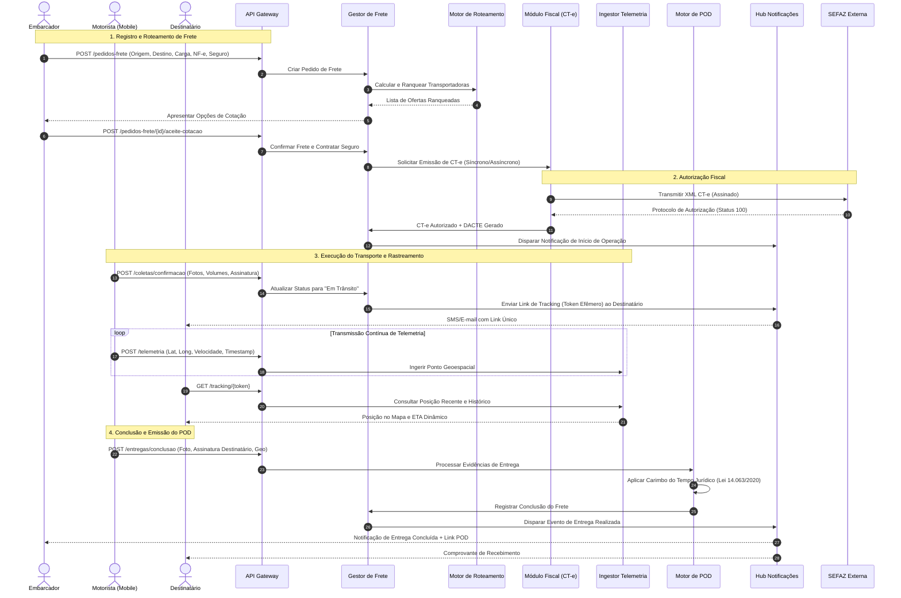
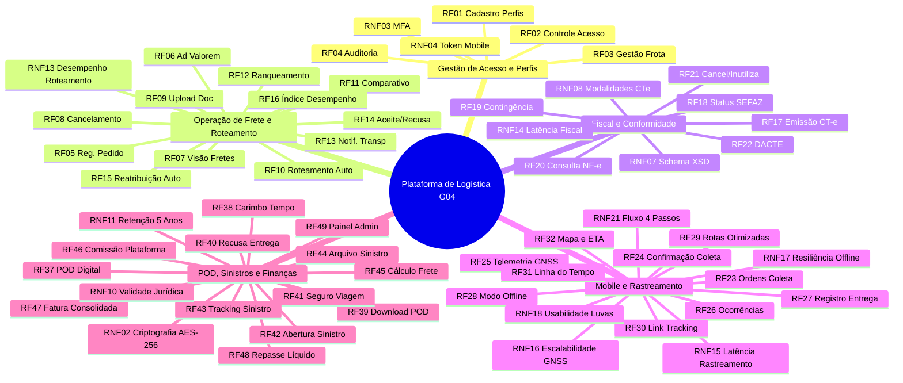

# Relatório Técnico de Arquitetura de Software

---

## 1. Identificação das HUs

| ID | Perfil / Ator | Título da História de Usuário | Objetivo Principal | Requisitos Funcionais Vinculados |
| :--- | :--- | :--- | :--- | :--- |
| **HU01** | Embarcador | Registrar pedido de frete | Cadastrar frete com características da carga e acionar cotação/roteamento automático. | RF05, RF06, RF07, RF09, RF10 |
| **HU02** | Embarcador | Selecionar transportadora e contratar seguro | Comparar propostas ranqueadas, contratar cobertura de seguro e autorizar início do frete. | RF11, RF12, RF17, RF41, RF45 |
| **HU03** | Embarcador | Acompanhar pedidos e receber comprovante | Visualizar tracking consolidado e baixar Documento Comprobatório de Entrega (POD). | RF07, RF34, RF37, RF39 |
| **HU04** | Embarcador | Abrir sinistro por avaria ou extravio | Formalizar sinistro integrando ocorrências, laudos e acionando seguradora parceira. | RF42, RF43, RF44 |
| **HU05** | Transportadora | Aceitar pedidos de frete e gerenciar frota | Receber ofertas de frete ranqueadas, registrar aceite/recusa e gerenciar capacidade. | RF03, RF13, RF14, RF15, RF35 |
| **HU06** | Transportadora | Acompanhar operação dos motoristas em tempo real | Monitorar telemetria da frota ativa, alertas de desvio de SLA e ocorrências em trânsito. | RF25, RF32, RF35, RF36 |
| **HU07** | Transportadora | Consultar demonstrativo financeiro de repasse | Visualizar demonstrativo de repasse com comissões deduzidas e saldo líquido exportável. | RF46, RF48 |
| **HU08** | Motorista | Executar coleta com registro de evidências | Registrar coleta mobile com checklist, assinatura digital e fotos da carga. | RF23, RF24, RF28 |
| **HU09** | Motorista | Registrar entrega com assinatura digital (POD) | Capturar evidências digitais de conclusão ou recusa com carimbo temporal. | RF27, RF28, RF37, RF38, RF40 |
| **HU10** | Motorista | Registrar ocorrência durante o transporte | Notificar incidentes operacionais (avaria, sinistro, tentativa frustrada) em tempo hábil. | RF26, RF28, RF31, RF34, RF35 |
| **HU11** | Destinatário | Rastrear carga em tempo real sem cadastro | Consultar status, posição no mapa e ETA via link protegido por token efêmero. | RF30, RF31, RF32 |
| **HU12** | Destinatário | Receber notificações de cada etapa da entrega | Receber alertas por multicanais (SMS/E-mail) a cada marco da jornada de entrega. | RF33 |
| **HU13** | Administrador | Monitorar SLA de fretes e acionar contingência | Supervisionar fretes em risco, reatribuir pedidos estagnados e manter saúde operacional. | RF04, RF15, RF16, RF36 |
| **HU14** | Administrador | Acompanhar painel financeiro da plataforma | Gerenciar receitas de comissão, volume transacionado, inadimplência e auditoria. | RF04, RF46, RF47, RF49 |

---

## 2. Diagramas de Arquitetura (Mermaid)

### 2.1. Visão Geral de Componentes da Plataforma (Diagrama Conceitual)

```mermaid
flowchart TB
    subgraph Clients["Camada de Apresentação e Clientes"]
        WEB_EMB["Portal Web Embarcador"]
        WEB_TRA["Portal Web Transportadora"]
        WEB_ADM["Painel de Controle Admin"]
        MOB_MOT["App Mobile Motorista (Offline-First)"]
        WEB_DES["Visualizador de Tracking Público (Tokenizado)"]
    end

    subgraph Edge["Camada de Entrada e Borda"]
        APIGW["API Gateway Central (TLS 1.2+ / Rate Limit / WAF)"]
        AUTH_SRV["Serviço de Autenticação & MFA (IAM)"]
    end

    subgraph CoreServices["Serviços de Domínio Logístico"]
        FREIGHT_SRV["Gestor de Pedidos de Frete"]
        ROUTING_SRV["Motor de Roteamento e Ranqueamento"]
        TELEMETRY_SRV["Ingestor de Telemetria e Séries Temporais"]
        FISCAL_SRV["Módulo Fiscal (CT-e / SEFAZ Bridge)"]
        POD_SRV["Serviço de Evidências & POD (Carimbo de Tempo)"]
        INCIDENT_SRV["Gestor de Ocorrências e Sinistros"]
        FINANCE_SRV["Motor Financeiro, Tarifação e Repasses"]
        NOTIF_SRV["Hub de Notificações Multicanal (SMS/Email)"]
    end

    subgraph AsyncBus["Espinha Dorsal de Mensageria e Eventos"]
        EVT_BUS["Barramento de Eventos de Domínio Assíncronos"]
    end

    subgraph StorageLayer["Persistência Poliglota e Dados"]
        DB_TRANS["Repositório Transacional e Audit Trail"]
        DB_GEO["Repositório de Séries Temporais Geoespaciais"]
        DOC_STORE["Armazenamento de Documentos e Evidências Criptografadas"]
    end

    subgraph ExternalEntities["Ecossistema de Integrações Externas"]
        EXT_SEFAZ["SEFAZ Nacional / Estadual (WebServices)"]
        EXT_INSURANCE["APIs de Seguradoras Parceiras"]
        EXT_GATEWAYS["Provedores SMS / E-mail Transacional"]
        EXT_TSA["Autoridade de Carimbo do Tempo (TSA / ICP-Brasil)"]
    end

    Clients --> APIGW
    APIGW --> AUTH_SRV
    APIGW --> FREIGHT_SRV
    APIGW --> ROUTING_SRV
    APIGW --> TELEMETRY_SRV
    APIGW --> FISCAL_SRV
    APIGW --> POD_SRV
    APIGW --> INCIDENT_SRV
    APIGW --> FINANCE_SRV
    APIGW --> WEB_DES

    FREIGHT_SRV <--> EVT_BUS
    ROUTING_SRV <--> EVT_BUS
    TELEMETRY_SRV <--> EVT_BUS
    FISCAL_SRV <--> EVT_BUS
    POD_SRV <--> EVT_BUS
    INCIDENT_SRV <--> EVT_BUS
    FINANCE_SRV <--> EVT_BUS
    EVT_BUS --> NOTIF_SRV

    FREIGHT_SRV --> DB_TRANS
    FINANCE_SRV --> DB_TRANS
    INCIDENT_SRV --> DB_TRANS
    TELEMETRY_SRV --> DB_GEO
    POD_SRV --> DOC_STORE
    FISCAL_SRV --> DOC_STORE

    FISCAL_SRV <--> EXT_SEFAZ
    INCIDENT_SRV <--> EXT_INSURANCE
    POD_SRV <--> EXT_TSA
    NOTIF_SRV --> EXT_GATEWAYS
```

---

### 2.2. Diagrama de Sequência: Ciclo de Vida do Frete (Registro ao POD)

---

## 3. Decisões de Arquitetura

### ADR 01: Arquitetura Orientada a Eventos para Ingestão Telemétrica e Atualizações de SLA
* **Contexto:** A plataforma deve suportar milhares de transmissões de geolocalização por minuto sem degradar as operações transacionais de pedidos e conciliação financeira (RNF15, RNF16).
* **Decisão:** Separar a ingestão de telemetria da camada de processamento transacional por meio de um barramento de eventos assíncronos. A camada de ingestão recebe coordenadas geoespaciais e publica eventos em tópicos leves, desacoplando o cálculo de rotas dinâmicas, predição de SLA e projeção de interfaces web.
* **Consequências:** 
  * *Positivas:* Alta capacidade de escalabilidade horizontal para picos de telemetria; isolamento de falhas (um atraso em relatórios financeiros não afeta o rastreamento em tempo real).
  * *Negativas:* Consistência eventual na projeção do painel de monitoramento (tolerância máxima de até 30s conforme RNF15).

### ADR 02: Padrão *Store-and-Forward* e Estratégia de Sincronização *Offline-First* no Mobile
* **Contexto:** Motoristas trafegam por rodovias e regiões remotas com conectividade instável ou nula (RF28, RNF17). O registro de coletas, ocorrências e entregas não pode ser bloqueado pela falta de sinal.
* **Decisão:** O cliente mobile implementa armazenamento local encriptado que retém todas as transações, fotos e assinaturas. Um mecanismo de sincronização bidirecional em segundo plano executa a replicação assim que a conectividade for restabelecida, garantindo integridade transacional por idempotência (UUID gerado localmente).
* **Consequências:** 
  * *Positivas:* Zero perda de dados operacionais em campo; interface do motorista ágil e desimpedida de latência de rede.
  * *Negativas:* Necessidade de controle robusto de concorrência e reconciliação temporal baseada no carimbo de geração original do evento.

### ADR 03: Emissão Fiscal com Resiliência Operacional e Contingência Desacoplada
* **Contexto:** A emissão do CT-e depende dos WebServices da SEFAZ, que apresentam variações de latência e períodos de indisponibilidade (RF17, RF18, RF19, RNF07, RNF14).
* **Decisão:** Implementar um módulo de integração fiscal baseado em *Circuit Breaker* e *Retry Pattern* com chaveamento automático para emissão em contingência (EPEC/FS-DA) quando o tempo de resposta da SEFAZ ultrapassar os limites contratuais.
* **Consequências:** 
  * *Positivas:* Operação logística de transporte não é paralisada por indisponibilidades governamentais; cumprimento integral das normas tributárias vigentes.
  * *Negativas:* Complexidade operacional de reconciliação fiscal posterior quando os serviços da SEFAZ normalizarem.

### ADR 04: Isolamento de Acesso ao Tracking Público via Tokens Criptográficos Sem Estado (*Stateless*)
* **Contexto:** Destinatários devem rastrear a carga sem necessidade de autenticação tradicional, porém sem expor dados de terceiros ou dados confidenciais do frete (RF30, RNF05, RNF09).
* **Decisão:** Disponibilizar endpoints públicos de leitura acessíveis unicamente por tokens cifrados efêmeros, associados estritamente ao identificador do frete. A projeção de dados exposta oculta valores monetários, dados fiscais completos e informações de outros clientes.
* **Consequências:** 
  * *Positivas:* Usabilidade imediata para o destinatário final; aderência total aos princípios de minimização de dados da LGPD.
  * *Negativas:* Exige política de revogação e controle rígido do ciclo de expiração temporal do token.

### ADR 05: Comprovante de Entrega Digital (POD) com Carimbo de Tempo e Validade Jurídica
* **Contexto:** A Lei nº 14.063/2020 e o Código Tributário Nacional exigem integridade, irrefutabilidade e retenção mínima de 5 anos para documentos fiscais e comprovações de entrega (RF37, RF38, RNF10, RNF11).
* **Decisão:** O POD gerado consolida a assinatura vetorial, imagem fotográfica capturada, coordenadas GNSS e metadados da transação em formato imutável, recebendo carimbo de tempo (*Timestamp*) emitido por autoridade certificadora credenciada. O arquivo final e sua trilha de auditoria são armazenados com chave de retenção estrita.
* **Consequências:** 
  * *Positivas:* Irrefutabilidade jurídica em disputas de extravio e sinistro; digitalização completa sem dependência de canhoto físico.
  * *Negativas:* Sobrecusto de latência e integração com serviço emissor de carimbo de tempo.

---

## 4. Tabela de Componentes e Rastreabilidade

| Componente | Responsabilidade Principal | Comunica-se com | Origem (HU / Critério de Aceite) |
| :--- | :--- | :--- | :--- |
| **API Gateway & Edge Router** | Ponto único de entrada, terminação TLS 1.2+, limitação de taxa, validação de tokens e roteamento de requisições. | Clientes Web/Mobile, IAM, Serviços de Domínio | RNF01, RNF03, RNF04, RNF05 |
| **Serviço de Identidade e Acesso (IAM)** | Gerenciamento de identidades, autorização por perfis (RBAC), controle de sessão e autenticação multifator (MFA). | API Gateway, Repositório Transacional | RF01, RF02, RNF03, RNF04 |
| **Gestor de Pedidos de Frete** | Ciclo de vida do frete (criação, parametrização de carga, upload de documentos, cancelamento e encerramento). | API Gateway, Motor de Roteamento, Barramento de Eventos, Repositório Transacional | RF05, RF06, RF07, RF08, RF09, HU01, HU03 |
| **Motor de Roteamento e Ranqueamento** | Aplicação de regras de compatibilidade veicular, cálculo comparativo de fretes, ranqueamento e cascateamento de aceite. | Gestor de Frete, Repositório Transacional, Barramento de Eventos | RF10, RF11, RF12, RF13, RF14, RF15, RF16, HU02, HU05, RNF13 |
| **Módulo Fiscal (CT-e / SEFAZ Bridge)** | Validação de NF-e, geração de XMLs conforme schemas XSD, transmissão SEFAZ, contingência e emissão do DACTE. | SEFAZ Externa, Gestor de Frete, Repositório de Documentos | RF17, RF18, RF19, RF20, RF21, RF22, RNF07, RNF08, RNF14 |
| **Ingestor Telemétrico & Geoespacial** | Ingestão em lote/fluxo contínuo de coordenadas GNSS, atualização de mapas, cálculo de ETA dinâmico e geofencing. | App Mobile, Barramento de Eventos, Repositório Geoespacial | RF25, RF32, RNF15, RNF16, RNF23, HU06, HU11 |
| **Módulo Mobile & Sincronizador Offline** | Execução de rotas, checklists de coleta/entrega, suporte operacional com baixa luminosidade e enfileiramento local. | App Mobile, API Gateway, Repositório Transacional | RF23, RF24, RF27, RF28, RF29, RNF17, RNF18, RNF19, RNF21, HU08, HU09 |
| **Motor de Prova de Entrega (POD Engine)** | Empacotamento de evidências digitais (foto, geo, assinatura), acoplamento de carimbo do tempo e exportação do POD. | App Mobile, Autoridade TSA, Repositório de Documentos, Barramento de Eventos | RF37, RF38, RF39, RF40, RNF10, HU09 |
| **Gestor de Ocorrências e Sinistros** | Registro e triagem de ocorrências em trânsito, abertura de sinistros, agregação de laudos e integração com seguradoras. | App Mobile, Seguradoras Externas, Gestor de Frete, Repositório Transacional | RF26, RF41, RF42, RF43, RF44, HU04, HU10 |
| **Módulo de Rastreamento Público & Notificações** | Geração de links seguros protegidos por token, renderização do mapa público e envio de notificações multicanal (SMS/Email). | Gateways SMS/E-mail, Ingestor Telemétrico, Destinatário | RF30, RF31, RF33, RF34, RF35, RF36, RNF05, HU11, HU12, HU13 |
| **Motor Financeiro, Tarifação e Repasses** | Cálculo de frete base, retenção de comissão, emissão de faturas consolidadas, demonstrativos de repasse e painel gerencial. | Gestor de Frete, Repositório Transacional, Administrador | RF45, RF46, RF47, RF48, RF49, RNF11, HU07, HU14 |
| **Trilha de Auditoria e Logs Imutáveis** | Captura contínua de ações administrativas, fiscais e financeiras com garantia de imutabilidade e retenção de 5 anos. | Todos os Serviços de Domínio, Repositório Transacional | RF04, RNF02, RNF11, RNF22, RNF25 |

---

## 5. Bloqueios e Pendências

1. **Protocolo de Integração e Homologação com Provedor de Carimbo do Tempo (TSA):**
   * *Pendência:* Definição do provedor acreditado e do modelo de tarifação por carimbo temporal emitido segundo a ICP-Brasil (RNF10, RF38).
   * *Impacto:* Bloqueia a formalização final do POD em conformidade com a Lei nº 14.063/2020.
2. **Definição de Certificados Digitais das Transportadoras para Emissão do CT-e:**
   * *Pendência:* Alinhamento se o modelo de emissão será centralizado (procuração eletrônica / certificado do embarcador/plataforma) ou se cada transportadora submeterá seu certificado digital (A1) para guarda no cofre de chaves da plataforma.
   * *Impacto:* Define a arquitetura do cofre de chaves e o fluxo de assinatura digital de documentos fiscais.
3. **Contratos e Schemas das APIs de Seguradoras Parceiras:**
   * *Pendência:* Obtenção dos contratos de interface (Swagger/WSDL) para cotação instantânea de averbação e acionamento de sinistros.
   * *Impacto:* Risco de necessidade de adaptadores legados assíncronos caso a seguradora não possua APIs REST síncronas.
4. **Regulamentação de Privacidade de Dados Pessoais de Motoristas Terceirizados (LGPD):**
   * *Pendência:* Validação jurídica do termo de consentimento para rastreamento de localização de aparelhos móveis particulares (BYOD) durante as viagens ativas.
   * *Impacto:* Necessidade de implementar bloqueio estrito de telemetria fora da janela de transporte ativo.

---

## 6. Cobertura de Requisitos

### Matriz de Mapeamento Técnico

* **Segurança e Criptografia (RNF01, RNF02, RNF06):** Atendido pelo API Gateway (TLS 1.2+), Camada de Persistência com criptografia em repouso AES-256 e políticas de autorização no barramento de telemetria.
* **Conformidade Regulatória (RNF07 a RNF11):** Atendido pelo Módulo Fiscal integrado com schemas XSD SEFAZ, Repositório Imutável de Auditoria com retenção programada de 5 anos e Motor de POD integrado com carimbo temporal.
* **Performance e Escalabilidade (RNF12 a RNF16, RNF23):** Garantido pela separação do Ingestor Telemétrico, persistência otimizada para séries temporais e barramento de eventos assíncrono para processamento desacoplado.
* **Disponibilidade e Resiliência (RNF17, RNF22, RNF24, RNF25):** Atendido pela arquitetura *offline-first* do cliente mobile, rotinas de backup com RPO de 1 hora, isolamento de APIs externas com contratos versionados e métricas operacionais centralizadas.

---

## 7. Gap Analysis

| Item / Funcionalidade | Lacuna / Ambiguidade Identificada nos Requisitos | Impacto na Arquitetura e Engenharia | Ação Recomendada para o Time de Desenvolvimento |
| :--- | :--- | :--- | :--- |
| **Ciclo de Vida do Token de Rastreamento (RNF05)** | O requisito especifica token único com prazo de expiração, mas não define a regra de extensão caso a carga sofra atrasos em trânsito. | Risco de o destinatário perder o acesso ao mapa de rastreamento antes da entrega física em caso de atraso na rota. | Configurar o ciclo de vida do token baseado em estado do frete (*Time-To-Live* dinâmico: expira em $X$ dias após o evento de conclusão da entrega, e não em tempo fixo prévio). |
| **Resolução de Conflitos na Sincronização Offline (RF28, RNF17)** | O sistema permite operações offline no app, mas não detalha regras de precedência caso uma ocorrência seja informada na web e outra no mobile concomitantemente. | Potencial inconsistência temporal de estados de frete e status de entrega. | Implementar algoritmo de consolidação com reconciliação determinística baseada no carimbo de geração original do dispositivo e carimbo de rede verificado. |
| **Custos e Ciclo de Vida de Mídias e Fotos de Comprovantes (RF24, RF27, RNF11)** | Exigência de anexar fotos de comprovantes, cargas avariadas e POD com retenção mínima de 5 anos sem especificação de políticas de compressão. | Crescimento desordenado do volume de armazenamento de dados não estruturados de alto custo. | Definir camada de armazenamento por camadas (*Tiered Storage*): dados quentes com alta disponibilidade nos primeiros 90 dias, migrando para arquivamento a frio encriptado para atendimento fiscal dos 5 anos. |
| **Chaveamento e Reconciliação de Contingência SEFAZ (RF19, RNF08)** | Não há especificação sobre o timeout aceitável antes de decidir pelo modo offline/contingência na emissão do CT-e. | Bloqueio temporário do carregamento caso a SEFAZ oscile sem atingir falha total explícita. | Implementar padrão *Circuit Breaker* com limiar de timeout de 15s na conexão primária; caso acionado $N$ vezes, alternar automaticamente para o fluxo de emissão em contingência. |
| **Tratamento de Divergência de Valores e Ad Valorem em Trânsito (RF06, RF41)** | Falta definição de comportamento sistêmico caso o motorista constate fisicamente volume ou valor de carga discrepante da NF-e inserida. | Risco de cobertura de seguro insuficiente durante o trânsito ou glosa de sinistro pela seguradora. | Criar fluxo de exceção no app mobile que force o bloqueio da saída da coleta caso haja divergência declarada, notificando o embarcador para retificação fiscal antes do início da viagem. |