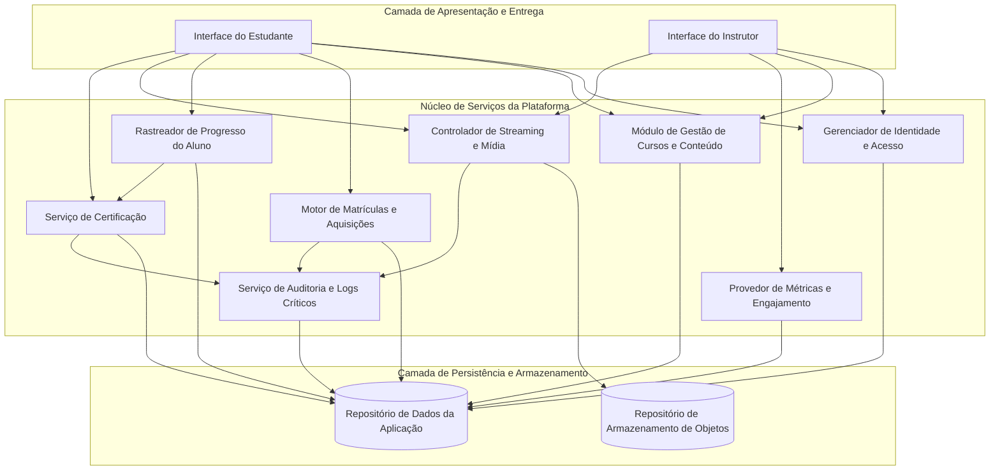
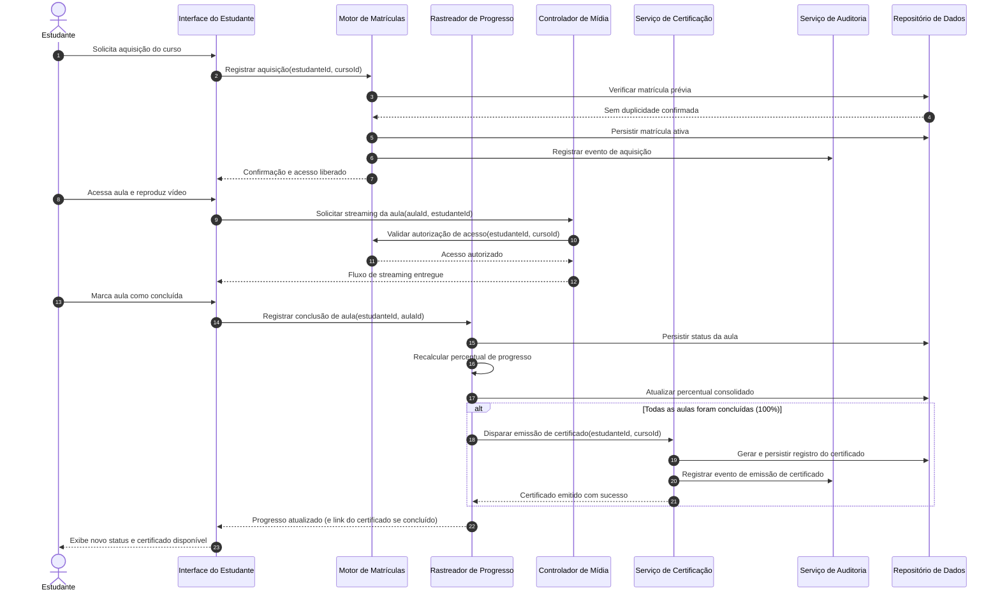

# Relatório Técnico de Arquitetura de Software

## 1. Identificação das HUs

| Identificador | Título | Ator Primário | Resumo do Objetivo |
|---|---|---|---|
| **HU01** | Criar e estruturar um curso | Instrutor | Permitir a criação de cursos, estruturação modular, inclusão de aulas e upload de arquivos de vídeo. |
| **HU02** | Publicar e despublicar curso | Instrutor | Gerenciar o ciclo de visibilidade do curso na plataforma sem afetar estudantes já matriculados. |
| **HU03** | Acompanhar matrículas do curso | Instrutor | Prover visualização consolidada do total de matrículas ativas por curso. |
| **HU04** | Acompanhar engajamento por aula | Instrutor | Exibir métricas de consumo por aula (visualizações e percentual de conclusão). |
| **HU05** | Cadastrar-se na plataforma | Estudante | Registrar novos estudantes mediante validação de unicidade de e-mail e regras de credenciais. |
| **HU06** | Adquirir um curso | Estudante | Efetivar a matrícula em cursos disponíveis, garantindo liberação imediata de acesso e prevenção de duplicidade. |
| **HU07** | Assistir aulas e acompanhar progresso | Estudante | Reproduzir vídeos via streaming, registrar conclusões de aulas e calcular progresso percentual. |
| **HU08** | Receber e baixar o certificado de conclusão | Estudante | Gerar automaticamente e permitir o download de certificado digital após conclusão integral das aulas. |
| **HU09** | Acessar meus cursos adquiridos | Estudante | Disponibilizar painel centralizado para navegação nos cursos adquiridos e retomada de aulas. |

---

## 2. Diagramas de Arquitetura (Mermaid)

### 2.1. Diagrama de Estrutura e Componentes Conceituais

### 2.2. Diagrama de Sequência: Aquisição, Consumo e Emissão de Certificado

---

## 3. Decisões de Arquitetura

1. **Desacoplamento de Armazenamento e Entrega de Mídia**:
   * *Justificativa*: Em atendimento ao RNF03 e RNF04, arquivos pesados de vídeo não devem transitar pelo banco transacional nem saturar o servidor de aplicação. Define-se um contrato abstrato com um provedor de Armazenamento de Objetos externo e entrega via streaming segmentado.

2. **Isolamento de Segurança e Autorização Granular**:
   * *Justificativa*: Conforme RNF01 e RNF02, todas as requisições de conteúdo protegido (aulas, vídeos, certificados) devem passar obrigatoriamente por uma barreira centralizada de autenticação e validação de vínculo de matrícula. As credenciais devem sofrer aplicação de função de derivação de chave criptográfica unidirecional (hashing robusto) antes da persistência.

3. **Geração Determinística de Progresso e Emissão Assíncrona de Certificação**:
   * *Justificativa*: A consistência no cálculo do progresso (RNF07, RF10, RF12) exige atualização atômica de estado ao concluir uma aula. A emissão de certificado (RF11, RF15) é ativada de forma determinística quando a completude atinge 100%, garantindo persistência imediata e auditada do documento.

4. **Trilha de Auditoria para Operações Críticas**:
   * *Justificativa*: Atendendo ao RNF09, o subsistema de auditoria registra de forma não repudidável as transações essenciais da plataforma: concessão de acesso a cursos, emissão de certificados e eventuais falhas durante operações de carga de mídia.

5. **Otimização de Consultas Analíticas para o Painel do Instrutor**:
   * *Justificativa*: Para cumprir o tempo de resposta máximo de 3 segundos no painel de controle (RNF06, RF13, RF14), os dados de engajamento e métricas de matrículas devem ser estruturados em visões agregadas ou otimizadas para leitura analítica, desacopladas do fluxo transacional pesado.

---

## 4. Tabela de Componentes e Rastreabilidade

| Componente | Responsabilidade Principal | Comunica-se com | Origem (HU / Critério de Aceite) |
|---|---|---|---|
| **Gerenciador de Identidade e Acesso** | Gerenciar autenticação, cadastro com validações de unicidade/segurança e emissão de sessões seguras. | Interface, Repositório de Dados | HU05 (Critérios 1, 2, 3), RF06, RF16, RNF02 |
| **Módulo de Gestão de Cursos e Conteúdo** | Controlar ciclo de vida de cursos, criação/edição modular, hierarquia de aulas e estado de publicação. | Interface, Controlador de Mídia, Repositório de Dados | HU01 (Critérios 1, 2), HU02 (Critérios 1, 2, 3), RF01, RF02, RF04, RF05 |
| **Controlador de Streaming e Mídia** | Orquestrar uploads de vídeo, validar vínculos de acesso e prover URLs/estruturas de streaming. | Interface, Módulo de Gestão de Cursos, Repositório de Objetos, Auditoria | HU01 (Critério 3), HU07 (Critério 1), RF03, RNF03, RNF04, RNF10 |
| **Motor de Matrículas e Aquisições** | Processar aquisição de cursos, impedir matrículas duplicadas, liberar acesso imediato e consultar cursos do aluno. | Interface, Gerenciador de Acesso, Auditoria, Repositório de Dados | HU06 (Critérios 1, 2, 3), HU09 (Critérios 1, 2), RF07, RF08, RNF01 |
| **Rastreador de Progresso do Aluno** | Registrar conclusão de aulas, persistir estado automaticamente e calcular percentuais de avanço. | Interface, Motor de Matrículas, Serviço de Certificação, Repositório de Dados | HU07 (Critérios 2, 3), HU09 (Critério 3), RF09, RF10, RF12, RNF07 |
| **Serviço de Certificação** | Validar requisitos de conclusão, gerar certificados digitais com metadados obrigatórios e gerenciar download. | Rastreador de Progresso, Interface, Auditoria, Repositório de Dados | HU08 (Critérios 1, 2, 3), RF11, RF15, RNF09 |
| **Provedor de Métricas e Engajamento** | Consolidar número de matrículas por curso, taxas de conclusão e visualizações por aula. | Interface, Repositório de Dados | HU03 (Critérios 1, 2), HU04 (Critérios 1, 2), RF13, RF14, RNF06 |
| **Serviço de Auditoria e Logs Críticos** | Registrar de forma centralizada e persistente eventos de aquisição, certificados e falhas de upload. | Motor de Matrículas, Serviço de Certificação, Controlador de Mídia, Repositório de Dados | RNF09 |

---

## 5. Bloqueios e Pendências

1. **Mecanismo Transacional de Pagamento**:
   * *Descrição*: O requisito RF07/HU06 estabelece a aquisição de cursos com preço (RF01), contudo não há definição sobre integrações de gateways de pagamento, tratamento de estornos, moedas suportadas ou suporte a cursos gratuitos.
   * *Risco*: Complexidade adicional no fluxo de liberação do `Motor de Matrículas`.

2. **Pipeline de Transcodificação de Vídeo**:
   * *Descrição*: O RNF03 exige streaming sem download prévio. Não está especificado se a transcodificação (ex: geração de múltiplos bitrates/resoluções) ocorre de forma assíncrona após o upload ou se o sistema assume vídeos já pré-formatados.
   * *Risco*: Sobrecarga de processamento e latência na disponibilização de novas aulas (HU01).

3. **Regra de Adição de Aulas Pós-Certificação**:
   * *Descrição*: O comportamento do sistema caso um instrutor adicione novas aulas (RF02/RF04) em um curso cujo estudante já emitiu certificado (HU08) não está documentado.
   * *Risco*: Inconsistência na base de progresso (redução retroativa do percentual de 100% vs imutabilidade do certificado emitido).

---

## 6. Cobertura de Requisitos

| Requisito Funcional | Componente(s) Responsável(is) | História de Usuário Mapeada | Status de Cobertura |
|---|---|---|---|
| **RF01** | Módulo de Gestão de Cursos e Conteúdo | HU01 | Totalmente Coberto |
| **RF02** | Módulo de Gestão de Cursos e Conteúdo | HU01 | Totalmente Coberto |
| **RF03** | Controlador de Streaming e Mídia | HU01 | Totalmente Coberto |
| **RF04** | Módulo de Gestão de Cursos e Conteúdo | HU01 | Totalmente Coberto |
| **RF05** | Módulo de Gestão de Cursos e Conteúdo | HU02 | Totalmente Coberto |
| **RF06** | Gerenciador de Identidade e Acesso | HU05 | Totalmente Coberto |
| **RF07** | Motor de Matrículas e Aquisições | HU06 | Totalmente Coberto |
| **RF08** | Motor de Matrículas / Controlador de Mídia | HU06, HU07 | Totalmente Coberto |
| **RF09** | Rastreador de Progresso do Aluno | HU07 | Totalmente Coberto |
| **RF10** | Rastreador de Progresso do Aluno | HU07 | Totalmente Coberto |
| **RF11** | Serviço de Certificação | HU08 | Totalmente Coberto |
| **RF12** | Rastreador de Progresso do Aluno | HU07, HU09 | Totalmente Coberto |
| **RF13** | Provedor de Métricas e Engajamento | HU03 | Totalmente Coberto |
| **RF14** | Provedor de Métricas e Engajamento | HU04 | Totalmente Coberto |
| **RF15** | Serviço de Certificação | HU08 | Totalmente Coberto |
| **RF16** | Gerenciador de Identidade e Acesso | HU05 | Totalmente Coberto |

| Requisito Não Funcional | Componente / Diretriz Arquitetural | Status de Cobertura |
|---|---|---|
| **RNF01 (Segurança)** | Barreira de autorização entre Matrícula e Controlador de Mídia | Totalmente Coberto |
| **RNF02 (Segurança)** | Algoritmo de Hashing seguro no Gerenciador de Identidade | Totalmente Coberto |
| **RNF03 (Desempenho)** | Controlador de Streaming e Mídia | Totalmente Coberto |
| **RNF04 (Escalabilidade)**| Repositório de Armazenamento de Objetos desacoplado | Totalmente Coberto |
| **RNF05 (Usabilidade)**   | Camada de Apresentação Responsiva | Totalmente Coberto |
| **RNF06 (Desempenho)**   | Visões otimizadas no Provedor de Métricas (< 3s) | Totalmente Coberto |
| **RNF07 (Confiabilidade)**| Persistência atômica no Rastreador de Progresso | Totalmente Coberto |
| **RNF08 (Compatibilidade)** Camada de Apresentação padronizada para navegadores web | Totalmente Coberto |
| **RNF09 (Manutenibilidade)** Serviço de Auditoria e Logs Críticos | Totalmente Coberto |
| **RNF10 (Acessibilidade)** Player integrado na Camada de Apresentação | Totalmente Coberto |

---

## 7. Gap Analysis

| Item Analisado | Lacuna Identificada | Impacto Arquitetural | Ação Recomendada |
|---|---|---|---|
| **Fluxo Financeiro** | Ausência de definição quanto ao processamento transacional de compras e notas fiscais. | O `Motor de Matrículas` atualmente assume confirmação direta síncrona sem webhook ou fila de conciliação de pagamentos. | Definir contrato de integração com provedor de pagamentos e tratamento assíncrono de status de pedido (Pendente, Aprovado, Recusado). |
| **Processamento de Mídia** | Falta de detalhamento sobre o pipeline pós-upload (validação de codecs, compressão e geração de manifestos de streaming). | Possível degradação de performance no cliente caso vídeos brutos em formatos incompatíveis sejam entregues. | Estabelecer um módulo de processamento em segundo plano (background worker) para validação e segmentação do vídeo antes da liberação. |
| **Políticas de Concorrência de Sessão** | Inexistência de especificação sobre acessos simultâneos com as mesmas credenciais. | Risco de compartilhamento indevido de contas para consumo de conteúdo protegido (violação indireta de RNF01). | Implementar mecanismo de controle de sessões ativas por usuário no Gerenciador de Identidade e Acesso. |
| **Validação de Certificados** | Ausência de endpoint público ou código de verificação para autenticidade de certificados por terceiros. | Limitação do valor probatório do documento gerado em PDF fora da plataforma. | Incorporar hash único/chave pública de validação impressa no certificado com rota de checagem pública. |