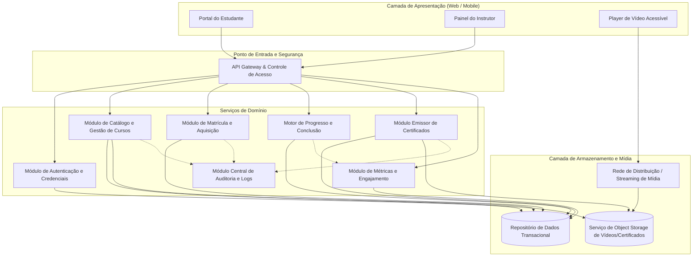
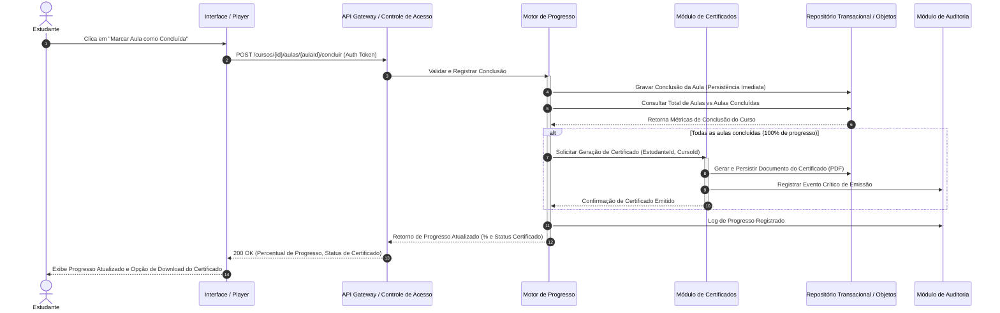

# Relatório Técnico de Arquitetura de Software

---

## 1. Identificação das HUs

| História de Usuário | Ator | Descrição / Objetivo | Requisitos Relacionados |
| :--- | :--- | :--- | :--- |
| **HU01** — Criar e estruturar um curso | Instrutor | Criar cursos (título, descrição, capa, preço), organizar módulos e aulas com upload de vídeo. | RF01, RF02, RF03, RF04, RNF04, RNF09 |
| **HU02** — Publicar e despublicar curso | Instrutor | Controlar visibilidade pública do curso sem impactar alunos já matriculados. | RF04, RF05, RNF01 |
| **HU03** — Acompanhar matrículas do curso | Instrutor | Visualizar contagem consolidada de estudantes matriculados por curso. | RF13, RNF06 |
| **HU04** — Acompanhar engajamento por aula | Instrutor | Monitorar métricas de visualizações e taxa de conclusão por aula no painel. | RF14, RNF06 |
| **HU05** — Cadastrar-se na plataforma | Estudante | Realizar cadastro único na plataforma com validação de dados e segurança de credenciais. | RF06, RF16, RNF02 |
| **HU06** — Adquirir um curso | Estudante | Comprar e receber concessão imediata e unívoca de acesso aos conteúdos. | RF07, RF08, RNF01, RNF09 |
| **HU07** — Assistir aulas e acompanhar progresso | Estudante | Consumir vídeo via streaming adaptável, registrar conclusão de aulas e atualizar percentual em tempo real. | RF09, RF10, RF12, RNF03, RNF07, RNF10 |
| **HU08** — Receber e baixar certificado | Estudante | Emissão automática de certificado após conclusão integral do curso e download em formato PDF. | RF11, RF15, RNF09 |
| **HU09** — Acessar cursos adquiridos | Estudante | Painel centralizado listando cursos matriculados, percentual de evolução e acesso direto a aulas. | RF08, RF12, RNF05, RNF08 |

---

## 2. Diagramas de Arquitetura (Mermaid)

### 2.1. Diagrama Estrutural de Componentes e Fronteiras do Sistema

---

### 2.2. Diagrama de Sequência: Conclusão de Aula, Atualização de Progresso e Emissão de Certificado

---

## 3. Decisões de Arquitetura

1. **Desacoplamento e Streaming de Mídia:**
   - *Decisão:* Os arquivos de vídeo são armazenados exclusivamente em um serviço dedicado de armazenamento de objetos desacoplado da aplicação central, sendo transmitidos aos clientes por meio de protocolos de streaming fracionado.
   - *Justificativa:* Cumpre os requisitos **RNF03** e **RNF04**, impedindo o download integral síncrono antes da reprodução e aliviando a carga computacional dos servidores de aplicação.

2. **Garantia Transacional e Idempotência na Conclusão de Aulas:**
   - *Decisão:* O registro de conclusão de aulas utiliza operações atômicas e idempotentes no repositório de persistência, disparando sincronamente o cálculo do progresso agregado.
   - *Justificativa:* Atende a **RF09**, **RF10**, **RNF07** e ao critério de aceite de **HU07**, eliminando o risco de perda de estado ou cálculos de percentuais inconsistentes.

3. **Isolamento de Políticas de Acesso e Direitos de Matrícula (Entitlement):**
   - *Decisão:* Todas as requisições para URLs de consumo de mídia e dados estruturados de aulas são submetidas a uma validação centralizada de matrícula ativa antes da autorização. Cursos despublicados mantêm a regra de acesso para matrículas preexistentes.
   - *Justificativa:* Garante o cumprimento estrito de **RF08**, **RNF01** e critérios de aceite da **HU02** e **HU06**.

4. **Tratamento Assíncrono/Otimizado para Métricas do Painel do Instrutor:**
   - *Decisão:* As visualizações e conclusões registram eventos que alimentam estruturas de leitura otimizadas para consulta analítica.
   - *Justificativa:* Satisfaz a exigência de tempo de resposta inferior a 3 segundos no painel (**RNF06**, **RF13**, **RF14**), mitigando gargalos gerados por consultas analíticas agregadas em tabelas transacionais puras.

5. **Auditoria Centralizada de Eventos Críticos:**
   - *Decisão:* Eventos de aquisição de cursos, emissão de certificados e falhas no upload de mídia são encapsulados e encaminhados a um barramento/serviço unificado de auditoria e logging estruturado.
   - *Justificativa:* Conformidade mandatória com o requisito **RNF09**.

---

## 4. Tabela de Componentes e Rastreabilidade

| Componente | Responsabilidade Principal | Comunica-se com | Origem (HU / Critério de Aceite) |
| :--- | :--- | :--- | :--- |
| **Módulo de Autenticação e Credenciais** | Gerenciar o ciclo de vida de identidades, registro de usuários, validação de regras de senha e geração de credenciais criptografadas. | API Gateway, Repositório de Dados Transacional | HU05 (Critérios 1, 2, 3), RF06, RF16, RNF02 |
| **Módulo de Catálogo e Gestão de Cursos** | Prover a manutenção de cursos, módulos, aulas, estado de visibilidade (publicado/rascunho) e metadados de mídia. | Repositório de Dados Transacional, Serviço de Object Storage, Módulo de Auditoria | HU01 (Critérios 1, 2, 3), HU02 (Critérios 1, 3), RF01, RF02, RF04, RF05 |
| **Módulo de Matrícula e Aquisição** | Processar aquisições, validar duplicidade de compra, conceder direito de acesso imediato e listar cursos adquiridos pelo estudante. | Repositório de Dados Transacional, Módulo de Auditoria, API Gateway | HU06 (Critérios 1, 2, 3), HU09 (Critérios 1, 2, 3), RF07, RF08, RNF01 |
| **Motor de Progresso e Conclusão** | Registrar conclusão de aulas, calcular percentual de avanço do aluno e disparar emissão de certificados. | Repositório de Dados Transacional, Módulo Emissor de Certificados, Módulo de Métricas | HU07 (Critérios 2, 3), HU08 (Critério 1), RF09, RF10, RF12, RNF07 |
| **Módulo Emissor de Certificados** | Gerar e persistir os documentos de certificação contendo dados do aluno, curso, instrutor e data, viabilizando download em PDF. | Repositório de Dados Transacional, Serviço de Object Storage, Módulo de Auditoria | HU08 (Critérios 1, 2, 3), RF11, RF15, RNF09 |
| **Módulo de Métricas e Engajamento** | Consolidar contagem de matrículas e métricas de engajamento por aula (visualizações e taxa de conclusão). | Repositório de Dados Transacional, API Gateway | HU03 (Critérios 1, 2), HU04 (Critérios 1, 2), RF13, RF14, RNF06 |
| **Camada de Streaming e Object Storage** | Armazenar binários de vídeos e certificados de forma segura e distribuí-los sob demanda com suporte a streaming contínuo. | Player de Vídeo, Módulo de Catálogo, Módulo Emissor de Certificados | HU01 (Critério 3), HU07 (Critério 1), RNF03, RNF04, RNF10 |
| **Módulo Central de Auditoria e Logs** | Capturar e indexar registros imutáveis de transações críticas (aquisições, certificados, falhas de upload). | Módulo de Matrícula, Módulo Emissor de Certificados, Módulo de Catálogo | RNF09 |

---

## 5. Bloqueios e Pendências

1. **Definição de Fluxo de Pagamento / Gateway Financeiro:**
   - *Impacto:* O requisito RF07/HU06 menciona que o estudante "adquire" o curso e que a liberação deve ser imediata. Não há detalhamento de provedores de pagamento externos, webhook de confirmação ou fluxos de gratuidade/cupom.
2. **Especificação do Pipeline de Transcodificação de Vídeo:**
   - *Impacto:* O RNF03 estipula entrega via streaming sem download prévio. Falta especificar se a transcodificação (ex.: HLS/DASH para múltiplas resoluções) ocorre de forma síncrona na ingestão ou por processo assíncrono em fila de segundo plano.
3. **Mecanismo de Desistência e Reembolso:**
   - *Impacto:* Não há especificação sobre o comportamento do sistema caso uma compra seja estornada (se o progresso e certificado emitidos são revogados ou suspensos).

---

## 6. Cobertura de Requisitos

| Requisito | Componente(s) Responsável(is) | História(s) de Usuário Atendida(s) | Status de Cobertura |
| :--- | :--- | :--- | :--- |
| **RF01** | Módulo de Catálogo e Gestão de Cursos | HU01 | Totalmente Coberto |
| **RF02** | Módulo de Catálogo e Gestão de Cursos | HU01 | Totalmente Coberto |
| **RF03** | Módulo de Catálogo e Gestão de Cursos / Object Storage | HU01 | Totalmente Coberto |
| **RF04** | Módulo de Catálogo e Gestão de Cursos | HU01, HU02 | Totalmente Coberto |
| **RF05** | Módulo de Catálogo e Gestão de Cursos | HU02 | Totalmente Coberto |
| **RF06** | Módulo de Autenticação e Credenciais | HU05 | Totalmente Coberto |
| **RF07** | Módulo de Matrícula e Aquisição | HU06 | Totalmente Coberto |
| **RF08** | Módulo de Matrícula e Aquisição / API Gateway | HU06, HU09 | Totalmente Coberto |
| **RF09** | Motor de Progresso e Conclusão | HU07 | Totalmente Coberto |
| **RF10** | Motor de Progresso e Conclusão | HU07 | Totalmente Coberto |
| **RF11** | Módulo Emissor de Certificados | HU08 | Totalmente Coberto |
| **RF12** | Motor de Progresso e Conclusão / API Gateway | HU07, HU09 | Totalmente Coberto |
| **RF13** | Módulo de Métricas e Engajamento | HU03 | Totalmente Coberto |
| **RF14** | Módulo de Métricas e Engajamento | HU04 | Totalmente Coberto |
| **RF15** | Módulo Emissor de Certificados | HU08 | Totalmente Coberto |
| **RF16** | Módulo de Autenticação e Credenciais | HU05 | Totalmente Coberto |
| **RNF01** | API Gateway / Módulo de Matrícula e Aquisição | HU02, HU06 | Totalmente Coberto |
| **RNF02** | Módulo de Autenticação e Credenciais | HU05 | Totalmente Coberto |
| **RNF03** | Camada de Streaming e Object Storage | HU07 | Totalmente Coberto |
| **RNF04** | Camada de Streaming e Object Storage | HU01 | Totalmente Coberto |
| **RNF05** | Camada de Apresentação (Frontend) | HU09 | Totalmente Coberto |
| **RNF06** | Módulo de Métricas e Engajamento | HU03, HU04 | Totalmente Coberto |
| **RNF07** | Motor de Progresso e Conclusão | HU07 | Totalmente Coberto |
| **RNF08** | Camada de Apresentação (Frontend) | HU05, HU07, HU09 | Totalmente Coberto |
| **RNF09** | Módulo Central de Auditoria e Logs | HU01, HU06, HU08 | Totalmente Coberto |
| **RNF10** | Player de Vídeo Acessível (Frontend) | HU07 | Totalmente Coberto |

---

## 7. Gap Analysis

| Lacuna Identificada | Impacto Arquitetural | Ação Recomendada |
| :--- | :--- | :--- |
| **Controle de versão de cursos já concluídos/em andamento** | Se o instrutor adicionar ou remover aulas de um curso publicado (**RF04**), o progresso de alunos com 100% ou em andamento pode ser corrompido ou invalidar certificados emitidos. | Implementar versionamento de grade curricular: alterações estruturais geram uma nova versão do curso sem afetar matrículas ativas da versão legada. |
| **Ausência de limite de tamanho e formato para upload de vídeos** | Riscos de sobrecarga de rede, estouro de capacidade no Object Storage e falha na reprodução por codecs não suportados pelos navegadores. | Definir formalmente contrato de upload com validação de tipos MIME suportados e limite de tamanho por aula. |
| **Validação e autenticidade pública de certificados** | Terceiros não possuem mecanismo exposto para checar se o certificado baixado pelo estudante (**RF15**) é legítimo. | Incluir um identificador único (código de verificação) e um endpoint público de checagem de autenticidade no Módulo Emissor de Certificados. |
| **Geração síncrona vs assíncrona de relatórios de métricas** | Em cursos com centenas de milhares de alunos, calcular taxa de conclusão por aula sob demanda pode violar o limite de 3 segundos (**RNF06**). | Adotar agregação pré-computada de métricas (visão materializada/job de consolidação) atualizada periodicamente ou orientada por eventos. |