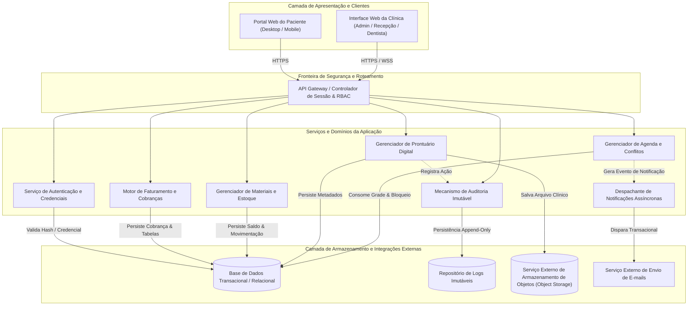
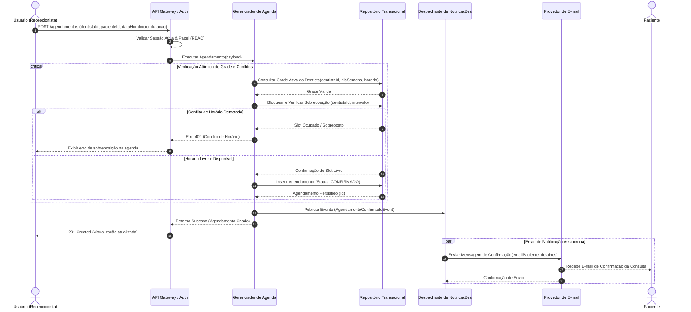
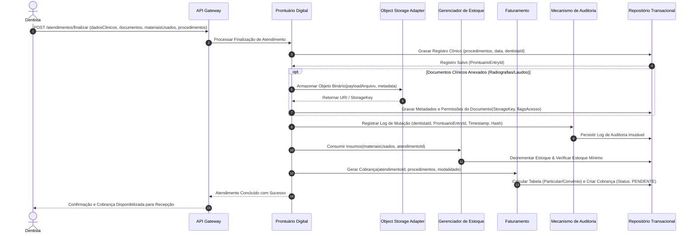

# Relatório Técnico de Arquitetura de Software

## 1. Identificação das HUs

Abaixo estão consolidadas as Histórias de Usuário (HUs) do sistema de Gestão para Clínica Odontológica, correlacionadas aos seus perfis de usuário, objetivos de negócio e requisitos funcionais e não funcionais associados:

| HU | Título | Perfil | Resumo do Objetivo de Negócio | RFs Relacionados | RNFs Relacionados |
| :--- | :--- | :--- | :--- | :--- | :--- |
| **HU01** | Visualizar agenda unificada dos dentistas | Recepcionista | Obter visão centralizada e simultânea das agendas de todos os dentistas em visões diária e semanal com filtros. | RF03, RF04 | RNF01, RNF06, RNF09 |
| **HU02** | Agendar, cancelar e remarcar consulta | Recepcionista | Realizar a gestão operacional das consultas com validação de grade, bloqueio de sobreposição e disparo de notificações. | RF05, RF06, RF07, RF08 | RNF01, RNF06, RNF08 |
| **HU03** | Registrar pagamento de cobrança | Recepcionista | Registrar pagamentos totais ou parciais de cobranças geradas e manter status financeiro atualizado. | RF20, RF21 | RNF01, RNF08 |
| **HU04** | Registrar procedimento no prontuário | Dentista | Registrar dados clínicos, procedimentos executados e observações em ordem cronológica decrescente com autoria. | RF09, RF10, RF12, RF13 | RNF01, RNF02, RNF05 |
| **HU05** | Anexar radiografias e documentos clínicos | Dentista | Realizar upload e vínculo de exames e laudos ao prontuário, controlando visibilidade de acesso. | RF11, RF12 | RNF02, RNF03, RNF07 |
| **HU06** | Consultar prontuário completo do paciente | Dentista | Consultar histórico longitudinal, dados clínicos e anexos de pacientes com busca por nome ou CPF. | RF09, RF12 | RNF01, RNF02, RNF03 |
| **HU07** | Gerar cobrança após atendimento | Dentista | Emitir cobrança vinculando procedimentos realizados a tabelas de convênio ou particular para a recepção. | RF18, RF19, RF20 | RNF01, RNF02 |
| **HU08** | Gerenciar dentistas e grades de horário | Administrador | Cadastrar profissionais e configurar suas disponibilidades de atendimento sem impactar retroativamente a agenda. | RF01, RF03, RF07 | RNF01, RNF04 |
| **HU09** | Gerenciar materiais e alertas de estoque | Administrador | Controlar entradas, saídas e limites mínimos de materiais/equipamentos com alertas visuais no painel. | RF14, RF15, RF16, RF17 | RNF01, RNF08 |
| **HU10** | Consultar relatório de faturamento | Administrador | Gerar relatórios consolidados e analíticos de receita por período, dentista e modalidade com exportação. | RF22 | RNF01, RNF08 |
| **HU11** | Acessar agendamentos pelo portal | Paciente | Visualizar histórico de consultas e agendamentos futuros via portal autenticado. | RF23, RF24 | RNF01, RNF02, RNF09, RNF10 |
| **HU12** | Acessar e baixar documentos pelo portal | Paciente | Visualizar e realizar download de documentos clínicos liberados pelo profissional de saúde. | RF23, RF25 | RNF01, RNF02, RNF03, RNF07, RNF10 |

---

## 2. Diagramas de Arquitetura (Mermaid)

### 2.1 Diagrama Estrutural de Componentes

Apresenta a decomposição lógica em camadas, interfaces conceituais e barramentos de integração interna e externa.

### 2.2 Diagrama de Sequência: Agendamento de Consulta e Notificação (HU02 / RF05, RF06, RF08)

Demonstra o fluxo com validação concorrente de disponibilidade de grade, bloqueio de sobreposição atômico e notificação desacoplada.

### 2.3 Diagrama de Sequência: Registro de Atendimento, Prontuário, Documentos e Cobrança (HU04, HU05, HU07, HU09)

Demonstra o fluxo integral de encerramento de atendimento clínico, registro imutável de prontuário, upload seguro para Object Storage, baixa de estoque e geração de faturamento.

---

## 3. Decisões de Arquitetura

### ADR-01: Controle de Acesso Baseado em Perfis (RBAC) e Gestão de Sessões
* **Contexto:** Necessidade de restringir o acesso a prontuários, faturamento, agendas e estoques com base nos perfis: Administrador, Recepcionista, Dentista e Paciente (RF01, RF02, RNF01, RNF03).
* **Decisão:** Adotar controle de acesso baseado em papéis (RBAC) validado centralizadamente na fronteira da API. As sessões serão mantidas com expiração determinística por inatividade de 30 minutos (RNF01). Credenciais de autenticação serão protegidas com funções de derivação de chaves criptográficas adaptativas baseadas em fator de trabalho seguro (hash de senhas resistente a ataques de força bruta, atendendo ao RNF04).
* **Consequências:** Garante segregação rigorosa de privilégios; exige persistência de estado de sessão e validação em todas as transações de entrada.

### ADR-02: Desacoplamento do Armazenamento de Arquivos Binários (Object Storage)
* **Contexto:** Prontuários contêm radiografias e laudos de alta densidade de dados (RF11, RNF07). O armazenamento local no servidor de aplicação degradaria o desempenho e a elasticidade.
* **Decisão:** Isolar os arquivos binários em um serviço desacoplado de Object Storage. O banco de dados transacional conterá exclusivamente os metadados (identificador do arquivo, tipo MIME, data, dentista proprietário, chaves de controle de acesso e hash de integridade). O acesso aos arquivos pelo portal ou pelo dentista será mediado por autorização explícita e entrega via URLs pré-assinadas temporárias.
* **Consequências:** Atende integralmente a RNF07 e RNF03; reduz sobrecarga no tráfego da API principal e garante conformidade de acesso.

### ADR-03: Rastreabilidade, Não Repúdio e Auditoria Imutável de Prontuários
* **Contexto:** Dados odontológicos exigem estrita conformidade com LGPD, CFO e integridade forense (RF13, RNF02, RNF05).
* **Decisão:** Todo evento de criação, alteração ou anexo em prontuário deve acionar um componente de auditoria em regime *append-only* (somente inclusão). Cada registro de auditoria conterá: carimbo de tempo (*timestamp* com fuso oficial), identificador do usuário autenticado, endereço de origem, identificador da entidade e representação da mutação.
* **Consequências:** Garante não repúdio e conformidade legal; impede alterações silenciosas na base clínica.

### ADR-04: Isolamento de Visualização e Agregação da Agenda Unificada
* **Contexto:** A recepcionista necessita visualizar múltiplos dentistas simultaneamente em visões diária e semanal com tempo de resposta inferior a 3 segundos (RF04, HU01, RNF06).
* **Decisão:** A recuperação da agenda consolidada deve utilizar consultas indexadas por intervalo temporal e identificadores de profissionais, evitando bloqueios na base transacional. A validação de sobreposição durante a escrita (RF06) ocorrerá sob controle de concorrência com isolamento transacional para evitar *double-booking*.
* **Consequências:** Garante performance em leitura (RNF06) sem comprometer a consistência de escrita.

### ADR-05: Estratégia Assíncrona de Notificações
* **Contexto:** Pacientes devem ser notificados por e-mail em alterações de agendamento (RF08, HU02), sem que a latência de serviços externos afete o fluxo operacional da recepção.
* **Decisão:** Processamento desacoplado de notificações. O serviço de agenda emite um evento de domínio e libera imediatamente o cliente; o despachante de notificações consome o evento e gerencia retentativas em caso de falha de comunicação com o provedor de e-mail.
* **Consequências:** Aumenta a resiliência e disponibilidade do agendamento (RNF08).

---

## 4. Tabela de Componentes e Rastreabilidade

| Componente | Responsabilidade Principal | Comunica-se com | Origem (HU / Critério de Aceite) |
| :--- | :--- | :--- | :--- |
| **Controlador de Sessão e RBAC (API Gateway)** | Autenticar usuários, verificar hash de senhas, gerenciar tempo de expiração de sessão (30 min) e aplicar barreiras de autorização por perfil. | *AuthService*, Todos os Serviços de Aplicação | RF01, RF02, RNF01, RNF04 / HU01-HU12 |
| **Serviço de Autenticação e Credenciais** | Gestão de identidade de usuários (dentistas, recepcionistas, administradores, pacientes), geração de tokens e hashes de segurança. | *TransactionalDB*, *API Gateway* | RF01, RF02, RNF04 / HU08, HU11 |
| **Gerenciador de Agenda e Conflitos** | Gerenciar grades de horário individuais, consolidar visão unificada da clínica, agendar, remarcar, cancelar e validar atomicamente sobreposição de horários. | *TransactionalDB*, *NotificationService*, *AuditService* | RF03, RF04, RF05, RF06, RF07 / HU01, HU02, HU08, RNF06 |
| **Gerenciador de Prontuário Digital** | Manter prontuário do paciente, histórico de procedimentos clínicos, notas de atendimento e controle de acesso médico a registros próprios. | *TransactionalDB*, *DocumentStorageAdapter*, *AuditService*, *BillingService*, *InventoryService* | RF09, RF10, RF12, RF13 / HU04, HU06, RNF02, RNF05 |
| **Adaptador de Documentos e Objetos** | Fazer upload, versionamento e controle de download de arquivos binários (radiografias, laudos e receitas), gerando links de acesso seguro restrito. | *ObjectStorage*, *ClinicalRecordService*, *TransactionalDB* | RF11, RF25 / HU05, HU12, RNF03, RNF07 |
| **Gerenciador de Materiais e Estoque** | Cadastrar insumos, controlar saldo, processar entradas/saídas, vincular consumo aos atendimentos e disparar alertas de nível mínimo. | *TransactionalDB*, *ClinicalRecordService*, *API Gateway* | RF14, RF15, RF16, RF17 / HU09 |
| **Motor de Faturamento e Cobranças** | Gerenciar procedimentos, tabelas de convênio e particular, gerar cobranças pós-atendimento, registrar liquidações e produzir relatórios financeiros. | *TransactionalDB*, *ClinicalRecordService*, *API Gateway* | RF18, RF19, RF20, RF21, RF22 / HU03, HU07, HU10 |
| **Despachante de Notificações** | Processar eventos de agendamento de forma assíncrona e disparar mensagens de confirmação/cancelamento/remarcação aos pacientes. | *EmailProvider*, *ScheduleService* | RF08 / HU02 |
| **Mecanismo de Auditoria e Conformidade** | Gravar registros imutáveis de alterações clínicas com autoria, data e hora (*append-only* log). | *AuditLogDB*, *ClinicalRecordService* | RF13, RNF02, RNF05 / HU04 |
| **Portal Web do Paciente** | Interface responsiva para pacientes visualizarem histórico, agendamentos futuros e realizarem download seguro de documentos liberados. | *API Gateway*, *ScheduleService*, *DocumentStorageAdapter* | RF23, RF24, RF25 / HU11, HU12, RNF09, RNF10 |

---

## 5. Bloqueios e Pendências

1. **Gestão de Concorrência em Agendamentos Simultâneos:** Risco de tentativa de reserva simultânea do mesmo slot de horário por recepcionistas distintas. Exige estratégia estrita de concorrência pessimista ou otimista com tratamento de contenção no banco de dados.
2. **Definição de Fluxo de Credenciamento Inicial do Paciente:** O portal do paciente exige autenticação (RF23/HU11), mas os requisitos não detalham o fluxo de primeiro acesso (se ativado pela recepcionista na clínica ou via auto-cadastro com validação de dados).
3. **Mecanismo de Retenção e Ciclo de Vida no Object Storage:** O RNF07 exige Object Storage externo e o RNF11 backup com retenção mínima de 30 dias. É necessária definição de política de versionamento e redundância geográfica para os arquivos binários.
4. **Política de Pagamentos Parciais e Inadimplência:** A HU03 menciona pagamentos parciais, porém não há detalhamento sobre cálculo de saldo devedor remanescente, juros ou bloqueios de faturamento futuro na emissão de novas cobranças.

---

## 6. Cobertura de Requisitos

A matriz abaixo comprova o atendimento integral de todos os Requisitos Funcionais e Não Funcionais estabelecidos:

| Requisito | Status de Cobertura | Componente(s) Responsável(is) | Observação de Projeto |
| :--- | :--- | :--- | :--- |
| **RF01** | Coberto | *AuthService*, *API Gateway* | Cadastros de perfis: Admin, Recepcionista, Dentista, Paciente. |
| **RF02** | Coberto | *API Gateway* (RBAC) | Filtro de autorização por rota/recurso baseado no perfil ativo. |
| **RF03** | Coberto | *ScheduleService*, *TransactionalDB* | Entidade de agenda individualizada por dentista. |
| **RF04** | Coberto | *ScheduleService*, *SPA_Admin_Recep* | Consulta agregada de múltiplos dentistas com filtros temporais. |
| **RF05** | Coberto | *ScheduleService* | Operações transacionais de criação, cancelamento e remarcação. |
| **RF06** | Coberto | *ScheduleService*, *TransactionalDB* | Restrição de unicidade de slot e validação de sobreposição. |
| **RF07** | Coberto | *ScheduleService*, *TransactionalDB* | Parametrização da grade horária semanal por profissional. |
| **RF08** | Coberto | *NotificationService*, *EmailProvider* | Publicação e consumo de eventos de agendamento com disparo de e-mail. |
| **RF09** | Coberto | *ClinicalRecordService*, *TransactionalDB* | Modelo relacional centrado no paciente com histórico de atos clínicos. |
| **RF10** | Coberto | *ClinicalRecordService* | Registro de procedimento com campos de descrição e notas clínicas. |
| **RF11** | Coberto | *DocumentStorageAdapter*, *ObjectStorage* | Upload desacoplado com vínculo de identificadores no prontuário. |
| **RF12** | Coberto | *ClinicalRecordService*, *API Gateway* | Controle de escopo de dados restrito aos pacientes do dentista. |
| **RF13** | Coberto | *AuditService*, *ClinicalRecordService* | Metadados obrigatórios de rastreabilidade gravados automaticamente. |
| **RF14** | Coberto | *InventoryService*, *TransactionalDB* | Cadastro de materiais/equipamentos com limites mínimos de estoque. |
| **RF15** | Coberto | *InventoryService* | Livro-razão de entradas e saídas de itens de estoque. |
| **RF16** | Coberto | *InventoryService*, *SPA_Admin_Recep* | Mecanismo de gatilho/alerta visual ao atingir quantidade mínima. |
| **RF17** | Coberto | *InventoryService*, *ClinicalRecordService* | Vínculo transacional de consumo de insumo à consulta realizada. |
| **RF18** | Coberto | *BillingService*, *TransactionalDB* | Cadastro mestre de procedimentos odontológicos e precificação base. |
| **RF19** | Coberto | *BillingService*, *TransactionalDB* | Matriz de precificação por convênio e tabelas associadas. |
| **RF20** | Coberto | *BillingService* | Composição de cobrança vinculando procedimentos e modalidade. |
| **RF21** | Coberto | *BillingService* | Gestão de status financeiro (Pendente, Parcial, Liquidado). |
| **RF22** | Coberto | *BillingService*, *SPA_Admin_Recep* | Motor de consolidação e exportação de relatórios gerenciais. |
| **RF23** | Coberto | *Portal Web do Paciente*, *API Gateway* | Aplicação web responsiva dedicada com barreira de autenticação. |
| **RF24** | Coberto | *Portal Web do Paciente*, *ScheduleService* | Visualização filtrada de consultas futuras e passadas do paciente logado. |
| **RF25** | Coberto | *Portal Web do Paciente*, *DocumentStorageAdapter* | Acesso controlado exclusivamente a documentos marcados como liberados. |
| **RNF01** | Coberto | *API Gateway*, *AuthService* | Sessões com auto-encerramento em 30 min e autenticação mandatória. |
| **RNF02** | Coberto | *AuditService*, *ClinicalRecordService* | Conformidade com LGPD/CFO: logs de acesso e restrição de escopo. |
| **RNF03** | Coberto | *DocumentStorageAdapter*, *API Gateway* | Controle de acesso a binários via URLs temporárias assinadas. |
| **RNF04** | Coberto | *AuthService* | Armazenamento de credenciais com algoritmos de hash adaptativo (bcrypt). |
| **RNF05** | Coberto | *AuditService*, *AuditLogDB* | Registro de mutação *append-only* com garantia de imutabilidade. |
| **RNF06** | Coberto | *ScheduleService*, *TransactionalDB* | Otimização de consultas indexadas para renderização < 3s. |
| **RNF07** | Coberto | *DocumentStorageAdapter*, *ObjectStorage* | Arquitetura com Object Storage externo desacoplado da aplicação. |
| **RNF08** | Coberto | Infraestrutura / Todos os Serviços | Arquitetura resiliente e modular para garantia de 99,5% de disponibilidade. |
| **RNF09** | Coberto | *SPA_Admin_Recep*, *Portal Web do Paciente* | Design de interfaces responsivas para navegadores móveis e desktops. |
| **RNF10** | Coberto | Camada de Apresentação | Compatibilidade baseada em padrões web para os navegadores modernos. |
| **RNF11** | Coberto | Camada de Persistência | Rotinas automatizadas de backup diário com retenção de 30 dias. |

---

## 7. Gap Analysis

| # | Item Omitido / Lacuna | Descrição da Lacuna | Impacto Arquitetural | Ação Recomendada para o Time de Desenvolvimento |
| :--- | :--- | :--- | :--- | :--- |
| **01** | **Mecanismo de Desbloqueio e Flag de Liberação de Documentos** | A HU12 e o RF25 estipulam que o paciente acessa apenas documentos "explicitamente disponibilizados", mas os RFs de dentista (RF11/RF12) não descrevem o campo/ação de liberação. | Risco de vazamento de minutas/documentos internos ou bloqueio indevido de laudos ao paciente. | Incluir atributo booleano `liberado_paciente` na entidade de metadados de documentos, com controle de alternância na tela do dentista. |
| **02** | **Tratamento de Indisponibilidade de Insumos em Atendimentos** | O RF16 emite alerta de estoque baixo e o RF17 vincula consumo ao atendimento, mas não define se a falta de estoque impede a finalização do atendimento. | Falha de integridade se o sistema tentar impedir o dentista de registrar um atendimento já ocorrido por falta de saldo no sistema. | Tratar o estoque com permissão de saldo negativo operacional associado a alerta crítico, nunca bloqueando o registro do prontuário médico. |
| **03** | **Assinatura Digital de Documentos Clínicos** | O RNF02 cita normas do CFO e LGPD. O CFO exige assinatura digital com certificado ICP-Brasil em receitas e laudos digitais emitidos eletronicamente. | Insegurança jurídica caso receitas emitidas pelo portal não possuam mecanismo de verificação de autenticidade. | Projetar interface abstrata para módulo de assinatura digital com suporte a certificados digitais nos anexos do prontuário. |
| **04** | **Tratamento de Conflito em Alteração de Grade Horária** | A HU08 declara que alterações na grade não devem afetar agendamentos pré-existentes, mas não há regra caso a nova grade reduza o expediente e gere agendamentos órfãos fora do novo horário. | Inconsistência na renderização da agenda e possíveis falhas em reagendamentos automáticos. | Manter a versão da grade associada ao agendamento no momento da criação ou sinalizar agendamentos legados em destaque na visualização da recepção. |