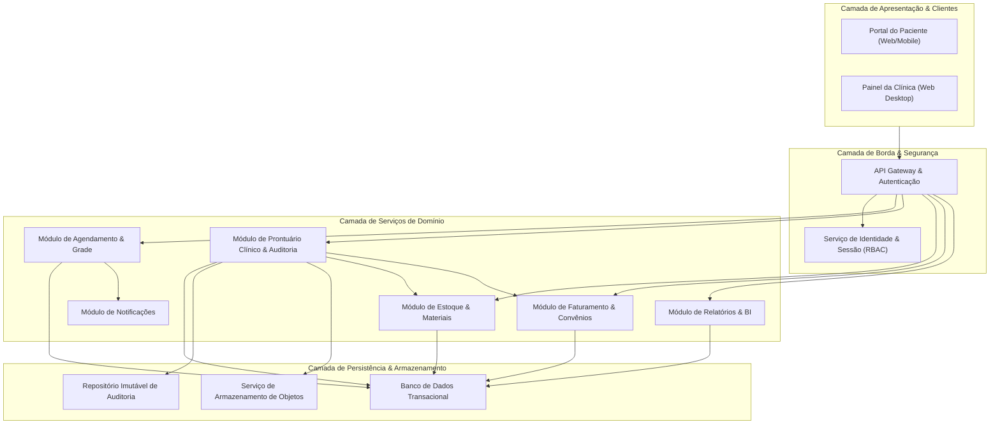
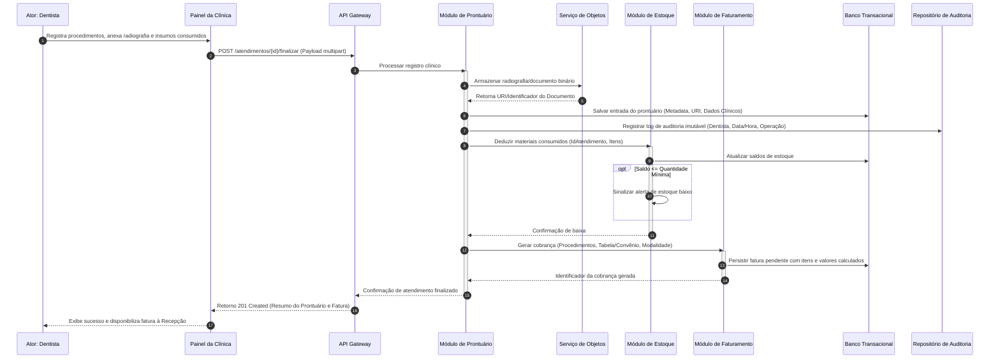

# Relatório Técnico de Arquitetura de Software

## 1. Identificação das HUs

Abaixo está a síntese das Histórias de Usuário (HUs) mapeadas a partir das necessidades dos perfis operacionais, clínicos, administrativos e dos pacientes:

| ID | Perfil | Título | Resumo da Necessidade e Valor de Negócio |
| :--- | :--- | :--- | :--- |
| **HU01** | Recepcionista | Visualizar agenda unificada dos dentistas | Visão consolidada (diária/semanal) com distinção de status e filtros por profissional para otimização de marcações. |
| **HU02** | Recepcionista | Agendar, cancelar e remarcar consulta | Gestão completa do ciclo de agendamento com validação de choques de horário e disparo automático de notificações. |
| **HU03** | Recepcionista | Registrar pagamento de cobrança | Liquidação total ou parcial de débitos gerados por atendimentos clínicos e acompanhamento de pendências financeiras. |
| **HU04** | Dentista | Registrar procedimento no prontuário | Registro cronológico, detalhado e imutável de atos odontológicos realizados, vinculado à identidade do profissional. |
| **HU05** | Dentista | Anexar radiografias e documentos clínicos | Upload e catalogação de arquivos e exames de imagem no repositório clínico com controle estrito de visibilidade. |
| **HU06** | Dentista | Consultar prontuário completo do paciente | Acesso ao histórico clínico pregressa, exames e observações para suporte à tomada de decisão assistencial. |
| **HU07** | Dentista | Gerar cobrança após atendimento | Discriminação dos procedimentos executados, aplicando tabelas de preço particulares ou de convênios. |
| **HU08** | Administrador | Gerenciar dentistas e grades de horário | Configuração de disponibilidade e jornada dos profissionais sem impacto retroativo nos agendamentos passados. |
| **HU09** | Administrador | Gerenciar materiais e alertas de estoque | Controle de saldo e consumo de insumos odontológicos com emissão de alertas ao atingir o ponto de reposição. |
| **HU10** | Administrador | Consultar relatório de faturamento | Extração e consolidação de métricas financeiras por período, modalidade de pagamento e profissional executante. |
| **HU11** | Paciente | Acessar agendamentos pelo portal | Visualização de compromissos futuros e histórico de consultas via autoatendimento web autenticado. |
| **HU12** | Paciente | Acessar e baixar documentos pelo portal | Consulta e download individualizado de laudos, radiografias e prescrições liberadas pelo corpo clínico. |

---

## 2. Diagramas de Arquitetura (Mermaid)

### 2.1. Visão Geral de Componentes da Arquitetura Lógica

---

### 2.2. Diagrama de Sequência: Ciclo de Atendimento Clínico e Fechamento

O fluxo a seguir ilustra o encerramento de uma consulta pelo Dentista, contemplando o registro de prontuário, anexo de imagens, baixa de materiais, geração de cobrança e auditoria.

---

## 3. Decisões de Arquitetura

### 3.1. Estilo Arquitetural Modular Orientado a Serviços
* **Contexto:** A aplicação engloba contextos operacionais distintos (Agendamento, Gestão Clínica, Suprimentos e Financeiro) que demandam isolamento de regras de negócio e diferentes padrões de concorrência.
* **Decisão:** Estruturar o sistema em módulos de domínio logicamente desacoplados, expostos através de uma interface de API unificada (Gateway).
* **Consequência:** Facilita a manutenção, testes unitários/integrados isolados e permite evolução granular sem acoplamento direto entre prontuário e regras financeiras.

### 3.2. Segregação do Armazenamento de Arquivos Binários (Object Storage Desacoplado)
* **Contexto:** Radiografias, exames e documentos clínicos possuem volumetria elevada e formatos variados (PDF, JPEG, PNG), o que degrada a performance de backups e a escalabilidade se mantidos na base relacional (RNF07).
* **Decisão:** Utilizar armazenamento de objetos dedicado para os binários de arquivos, persistindo na base de dados relacional unicamente os metadados, identificadores de documento e referências de acesso restrito.
* **Consequência:** Escalabilidade independente do armazenamento de mídia, custos otimizados e conformidade com a segregação de dados clínicos.

### 3.3. Trilhas de Auditoria Imutáveis e Conformidade (LGPD/CFO)
* **Contexto:** Os requisitos legais e normativos (RNF02, RNF05, RF13) exigem rastreabilidade de todas as mutações e acessos a dados sensíveis de prontuários.
* **Decisão:** Implementação de um componente de *Audit Trail* baseado no padrão *Append-Only* (somente inserção), onde cada evento de criação ou alteração em prontuário gera um registro com carimbo temporal, identificador do profissional e integridade verificável.
* **Consequência:** Garantia de não-repúdio e proteção contra adulterações retroativas em prontuários.

### 3.4. Controle de Acesso Baseado em Papéis e Relações (RBAC/ReBAC)
* **Contexto:** O sistema atende múltiplos perfis (Administrador, Recepcionista, Dentista, Paciente) com restrições severas de visualização (ex: paciente só vê seus próprios documentos liberados; recepcionista não acessa anotações clínicas; dentista só altera seus atendimentos).
* **Decisão:** Adoção de RBAC (*Role-Based Access Control*) associado a regras contextuais de propriedade de registro (o paciente deve ter vínculo com o documento; o dentista deve ser o titular do atendimento).
* **Consequência:** Camada de segurança estrita na borda e nos serviços de aplicação, eliminando acessos indevidos a dados de saúde protegidos.

### 3.5. Controle de Concorrência Pessimista/Otimista em Agendamentos
* **Contexto:** Bloqueio mandatório de sobreposição de horários na grade do mesmo profissional (RF06, RNF06).
* **Decisão:** Aplicação de travas transacionais na checagem e inserção de agendamentos no banco de dados, garantindo isolamento serializável ou locks atômicos por profissional/intervalo de tempo.
* **Consequência:** Prevenção de *double-booking* mesmo em cenários de requisições concorrentes simultâneas via recepção ou canais digitais.

---

## 4. Tabela de Componentes e Rastreabilidade

| Componente | Responsabilidade Principal | Comunica-se com | Origem (HU / Critério de Aceite) |
| :--- | :--- | :--- | :--- |
| **Módulo de Identidade e Acesso** | Autenticação, controle de sessões (timeout 30m), criptografia de senhas via hash seguro e aplicação de políticas de autorização (RBAC). | API Gateway, Banco Transacional | RF01, RF02, RNF01, RNF04, HU11 |
| **Módulo de Agendamento** | Gerenciamento de grades de horários, cálculo de disponibilidade, validação de sobreposições, marcação, reagendamento e cancelamento. | Banco Transacional, Módulo de Notificações, API Gateway | RF03, RF04, RF05, RF06, RF07, RNF06, HU01, HU02, HU08, HU11 |
| **Módulo de Notificações** | Envio assíncrono de notificações transacionais (e-mail) para confirmações, cancelamentos e avisos de agenda. | Provedor de Mensageria/E-mail, Módulo de Agendamento | RF08, HU02 |
| **Módulo de Prontuário Clínico** | Registro de intervenções odontológicas, gestão de histórico temporal, associação de documentos e controle de visibilidade externa. | Banco Transacional, Repositório de Auditoria, Object Storage, Módulo de Estoque, Módulo de Faturamento | RF09, RF10, RF11, RF12, RF13, RNF02, RNF03, HU04, HU05, HU06, HU12 |
| **Módulo de Repositório de Documentos** | Interface de abstração para upload, armazenamento seguro, geração de URLs temporárias e download de laudos/imagens. | Object Storage, Módulo de Prontuário Clínico, API Gateway | RF11, RF25, RNF03, RNF07, HU05, HU12 |
| **Módulo de Estoque e Suprimentos** | Cadastro de insumos e equipamentos, movimentação (entradas/saídas), baixa vinculada a atendimentos e disparo de alertas de nível crítico. | Banco Transacional, Módulo de Prontuário Clínico, API Gateway | RF14, RF15, RF16, RF17, HU09 |
| **Módulo de Faturamento e Convênios** | Manutenção de tabelas particulares/convênios, geração de títulos a pagar/receber vinculados a atos clínicos e quitação de faturas. | Banco Transacional, Módulo de Prontuário Clínico, API Gateway | RF18, RF19, RF20, RF21, HU03, HU07 |
| **Módulo de Relatórios e Análise** | Consolidação e agregação de dados financeiros, operacionais e de estoque para relatórios gerenciais e exportações. | Banco Transacional, API Gateway | RF22, HU10 |
| **Módulo de Auditoria (Audit Trail)** | Coleta e armazenamento append-only de todas as ações de leitura/escrita realizadas sobre prontuários e dados regulados. | Banco Transacional / Base de Log, Módulo de Prontuário | RF13, RNF02, RNF05, HU04 |
| **Portal do Paciente (BFF/Adapter)** | Interface e orquestração de chamadas seguras para consulta de consultas e download de documentos liberados pelo titular. | API Gateway, Módulo de Agendamento, Módulo de Prontuário | RF23, RF24, RF25, RNF03, RNF09, HU11, HU12 |

---

## 5. Bloqueios e Pendências

1. **Definição das Regras de Exibição de Documentos para Pacientes (RF25 / HU12):**
   * *Pendência:* O requisito estabelece que apenas documentos "explicitamente disponibilizados" pelo dentista são visíveis no portal. Faz-se necessária a modelagem de uma flag de visibilidade booleana (`disponivel_paciente: boolean`) por documento, associada à assinatura eletrônica do profissional responsável.
2. **Estratégia de Retenção e Ciclo de Vida do Log de Auditoria (RNF05 / RNF11):**
   * *Bloqueio:* As normas do CFO exigem guarda prolongada do prontuário (frequentemente superior a 20 anos), contrastando com a retenção mínima de backup de 30 dias (RNF11). É mandatório definir formalmente a política de expurgo e arquivamento de longo prazo (*cold storage*) para dados de prontuário e logs imutáveis.
3. **Mecanismo de Liberação Parcial de Insumos (RF17 / HU09):**
   * *Pendência:* Não está especificado o fluxo a ser adotado caso um procedimento utilize um insumo cujo saldo em estoque esteja zerado no momento do atendimento (bloqueio do registro vs. saldo negativo temporário com justificativa).
4. **Resolução de Conflitos em Grade de Horários Retroativa (RF07 / HU08):**
   * *Pendência:* Estabelecer formalmente a estratégia do sistema quando uma alteração de grade eliminar um bloco que já possui consultas previamente agendadas (manter agendamentos como exceção ou forçar fila de reagendamento pela recepção).

---

## 6. Cobertura de Requisitos

A matriz abaixo demonstra o atendimento de 100% dos Requisitos Funcionais e Não Funcionais pelo design arquitetural proposto:

| Requisito | Componente / Mecanismo Arquitetural Responsável | Situação |
| :--- | :--- | :--- |
| **RF01, RF02** | Módulo de Identidade e Acesso (RBAC + Sessões) | Coberto |
| **RF03, RF04** | Módulo de Agendamento + Views Unificadas de Agenda | Coberto |
| **RF05, RF06** | Módulo de Agendamento com Travas de Concorrência | Coberto |
| **RF07** | Módulo de Agendamento (Grade e Disponibilidade) | Coberto |
| **RF08** | Módulo de Notificações (Integração assíncrona de E-mail) | Coberto |
| **RF09, RF10** | Módulo de Prontuário Clínico | Coberto |
| **RF11** | Módulo de Repositório de Documentos + Object Storage | Coberto |
| **RF12, RF13** | Módulo de Prontuário + Módulo de Auditoria | Coberto |
| **RF14, RF15** | Módulo de Estoque e Suprimentos | Coberto |
| **RF16** | Módulo de Estoque (Engine de Regras de Saldo Mínimo) | Coberto |
| **RF17** | Integração Prontuário-Estoque (Baixa por Atendimento) | Coberto |
| **RF18, RF19** | Módulo de Faturamento (Tabelas de Procedimentos e Convênios) | Coberto |
| **RF20, RF21** | Módulo de Faturamento (Motor de Cobranças e Liquidação) | Coberto |
| **RF22** | Módulo de Relatórios e Análise | Coberto |
| **RF23, RF24, RF25** | Portal do Paciente + API Gateway | Coberto |
| **RNF01, RNF04** | Mecanismos de Hash Criptográfico, Sessão e Inatividade | Coberto |
| **RNF02, RNF03** | Isolamento de Dados Clínicos, RBAC e URLs Protegidas | Coberto |
| **RNF05** | Módulo de Auditoria Imutável (Append-Only Log) | Coberto |
| **RNF06** | Otimização de Índices e Projeções de Leitura na Agenda (<3s) | Coberto |
| **RNF07** | Serviço Desacoplado de Object Storage | Coberto |
| **RNF08** | Infraestrutura com Alta Disponibilidade (99.5% Uptime) | Coberto |
| **RNF09, RNF10** | Arquitetura de Apresentação Responsiva Multiplataforma | Coberto |
| **RNF11** | Rotinas de Backup Automatizadas e Políticas de Retenção | Coberto |

---

## 7. Gap Analysis

| Item Analisado | Lacuna Identificada | Impacto Técnico / Arquitetural | Ação Recomendada |
| :--- | :--- | :--- | :--- |
| **Tratamento de Falhas na Notificação** | O RF08 exige envio de e-mails, mas não define comportamento em caso de indisponibilidade do servidor de e-mails. | O bloqueio síncrono no ato do agendamento pode degradar o tempo de resposta ou abortar transações válidas. | Implementar padrão de mensageria assíncrona (*Outbox Pattern*) para desacoplar a confirmação do envio do e-mail. |
| **Download Seguro de Arquivos Grandes** | O tráfego de imagens radiográficas de alta resolução através da API principal consome banda e memória do servidor da aplicação. | Sobrecarga dos nós de processamento e risco de lentidão na navegação clínica geral. | Utilizar links pré-assinados (*Pre-Signed URLs*) de curta duração gerados diretamente pelo Object Storage para upload e download. |
| **Tratamento de Sessões Concorrentes** | RNF01 trata inatividade de 30 minutos, mas não especifica regras para múltiplos logins simultâneos com as mesmas credenciais. | Risco de compartilhamento indevido de contas entre recepcionistas ou dentistas, ferindo a rastreabilidade do CFO. | Adotar invalidação de sessão anterior no novo login ou restrição explícita de sessão única por usuário autenticado. |
| **Versionamento de Prontuário** | O RF12 prevê edição de registros por parte do dentista, enquanto o RNF05 exige logs imutáveis. | Risco de sobrescrita de dados clínicos sem preservação do histórico de retificações. | Implementar versionamento de entradas de prontuário (registros com *soft-update*, preservando a revisão anterior intacta). |