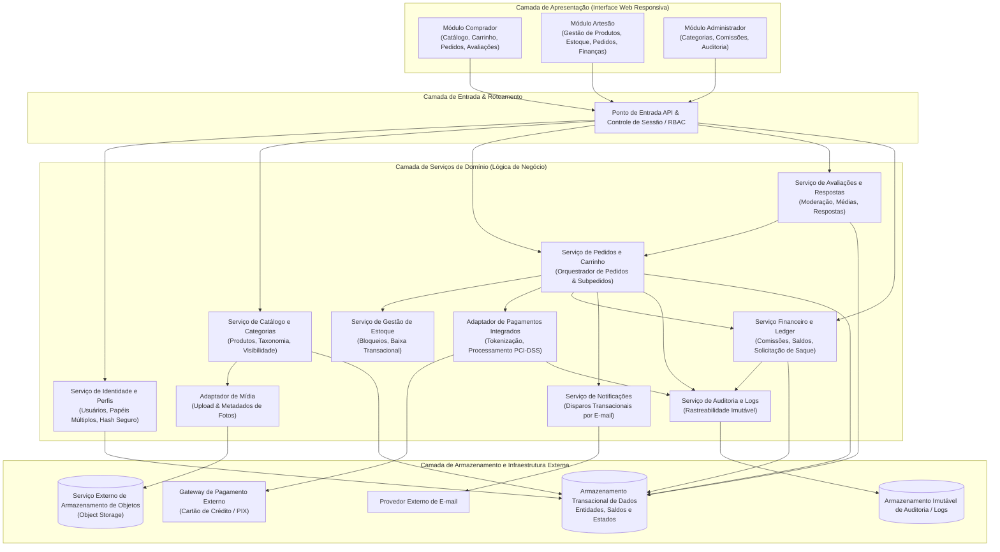
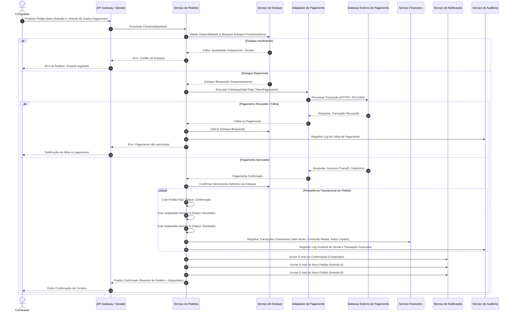
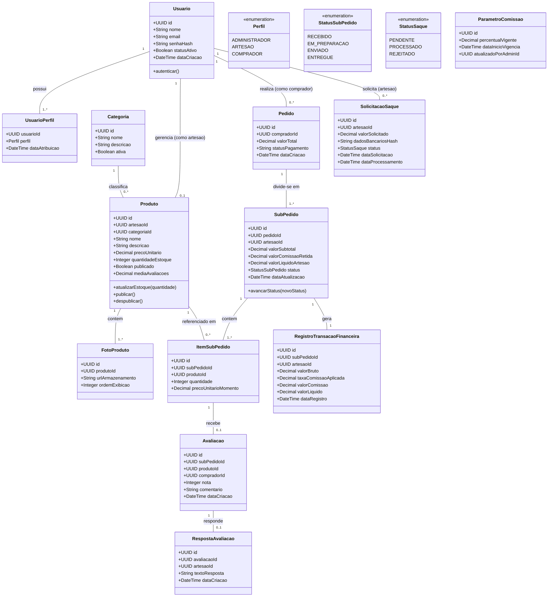

# Relatório Técnico de Arquitetura de Software

## 1. Identificação das HUs

Abaixo estão consolidadas as Histórias de Usuário (HUs) com o mapeamento direto para seus respectivos Requisitos Funcionais (RF), Requisitos Não Funcionais (RNF) e critérios de aceite estruturais:

| HU | Título | Ator | Descrição Resumida | RFs Associados | RNFs Associados |
| :--- | :--- | :--- | :--- | :--- | :--- |
| **HU01** | Cadastrar produto com fotos | Artesão | Cadastro de produtos com nome, descrição, preço, estoque, categoria e upload desacoplado de múltiplas fotos. | RF04, RF06 | RNF01, RNF04, RNF07 |
| **HU02** | Gerenciar estoque dos produtos | Artesão | Manutenção manual de estoque, bloqueio de itens zerados e decremento transacional após vendas. | RF05, RF07, RF08, RF09 | RNF01, RNF08 |
| **HU03** | Acompanhar e atualizar status dos pedidos recebidos | Artesão | Gestão do ciclo de vida de subpedidos atribuídos ao artesão (recebido, em preparação, enviado, entregue) com disparos de notificação. | RF19, RF20, RF22 | RNF01, RNF07, RNF13 |
| **HU04** | Visualizar painel financeiro | Artesão | Consulta analítica de histórico de vendas, comissões retidas, valores líquidos e saldo para saque. | RF26, RF28, RF29 | RNF01, RNF06, RNF09 |
| **HU05** | Solicitar saque do saldo disponível | Artesão | Solicitação de saque informando dados bancários, retenção/bloqueio imediato do saldo e registro em log auditável. | RF30 | RNF01, RNF09, RNF11, RNF13 |
| **HU06** | Responder avaliações de compradores | Artesão | Inserção de resposta pública única e imutável a avaliações de compradores em produtos de sua autoria. | RF25 | RNF01, RNF07 |
| **HU07** | Navegar e pesquisar produtos | Comprador | Navegação por categorias, listagem paginada/otimizada e busca textual por nome, categoria ou artesão. | RF10, RF11 | RNF05, RNF07, RNF10 |
| **HU08** | Adicionar itens ao carrinho e finalizar compra | Comprador | Gestão de carrinho unificado multiartesão, cálculo de totais, checkout transacional com pagamento integrado e divisão em subpedidos. | RF13, RF14, RF15, RF16, RF17, RF18, RF22 | RNF03, RNF07, RNF08, RNF13 |
| **HU09** | Acompanhar status dos pedidos | Comprador | Visualização consolidada de pedidos com rastreio individual por subpedido de cada artesão. | RF21, RF22 | RNF07, RNF10 |
| **HU10** | Avaliar produto após entrega | Comprador | Submissão de nota (1 a 5) e comentário textual condicionado à entrega confirmada do item, com restrição de unicidade. | RF23, RF24 | RNF07, RNF11 |
| **HU11** | Gerenciar categorias da plataforma | Administrador | Criação, alteração e desativação de categorias taxonômicas com regras de proteção para itens vinculados. | RF12 | RNF01, RNF13 |
| **HU12** | Configurar percentual de comissão | Administrador | Definição da taxa de comissão da plataforma com versionamento e log imutável, aplicada a vendas futuras. | RF27 | RNF01, RNF09, RNF13 |

---

## 2. Diagramas de Arquitetura (Mermaid)

### 2.1. Visão Lógica de Componentes do Sistema

### 2.2. Diagrama de Sequência: Processamento Transacional de Pedido Multiartesão

O diagrama a seguir detalha a finalização do pedido contendo produtos de múltiplos artesãos, a garantia de reserva e decremento transacional de estoque, a integração com o gateway de pagamento e a criação segregada dos subpedidos.

### 2.3. Diagrama de Classes do Domínio

---

## 3. Decisões de Arquitetura

### Decisão 1: Modelo Estrutural de Subpedidos Independentes por Artesão
* **Contexto:** Compradores podem adicionar produtos de diferentes artesãos em um único carrinho de compras (RF22, HU08).
* **Decisão:** Adotar a cisão do Pedido Mestre (`Pedido`) em múltiplos `SubPedidos`, agrupados por artesão no momento da liquidação financeira. Cada `SubPedido` possui seu próprio ciclo de vida de status (`Recebido`, `Em preparação`, `Enviado`, `Entregue`), sua própria chave contábil de comissão e seu próprio canal de notificação.
* **Impacto:** Permite aos artesãos gerenciar entregas e pedidos de forma autônoma (RF20, HU03), simplifica a rastreabilidade por parte do comprador (HU09) e viabiliza o cálculo independente de comissões e repasses (RF26, RF28).

### Decisão 2: Garantia de Atomicidade e Transacionalidade (Checkout, Estoque e Pagamento)
* **Contexto:** Requisito RNF08 estipula que, em caso de falha de pagamento, nenhuma cobrança deve ser efetivada e nenhum estoque decrementado. RF08 impede compras com estoque zerado.
* **Decisão:** Implementar um padrão de transação compensatória em dois estágios no Serviço de Pedidos:
  1. Bloqueio lógico temporário de estoque durante o envio da requisição ao Gateway de Pagamento.
  2. Em caso de aprovação: confirmação definitiva da baixa do estoque e persistência do pedido em bloco transacional único.
  3. Em caso de recusa/timeout: liberação imediata do estoque bloqueado e registro de falha em log de auditoria, sem criação de obrigações financeiras.
* **Impacto:** Elimina o risco de inconsistência de estoque (*overselling*) e garante integridade transacional financeira.

### Decisão 3: Desacoplamento de Armazenamento de Arquivos Estáticos (Fotos de Produtos)
* **Contexto:** RNF04 exige o desacoplamento de fotos de produtos do servidor da aplicação via serviço externo de armazenamento de objetos (*Object Storage*).
* **Decisão:** O upload de fotos será orquestrado via geração de URLs assinadas/delegadas de escrita no serviço de armazenamento de objetos ou através de um adaptador de ingestão com processamento assíncrono de metadados, armazenando no banco de dados exclusivamente os identificadores de URI seguros.
* **Impacto:** Reduz a carga de I/O no núcleo da aplicação, otimiza o desempenho de entrega de catálogo (RNF05) e possibilita escalabilidade elástica da camada de mídia.

### Decisão 4: Ledger Contábil e Imutabilidade Financeira
* **Contexto:** RNF09, RNF13, RF26, RF27 e HU12 exigem registro imutável de vendas, alterações de comissão e saques, além de histórico auditável para o painel do artesão.
* **Decisão:** Adotar o conceito de Livro-Razão Contábil (*Financial Ledger*) baseado em transações do tipo *append-only* (somente inserção). Alterações em taxas de comissão geram novos registros versionados com *timestamp* e identificação do administrador responsável, aplicando-se estritamente aos subpedidos criados após sua vigência.
* **Impacto:** Impossibilita adulteração retroativa de comissões cobradas, fornece base de dados consistente para o painel do vendedor (RNF06) e garante rastreabilidade total para conformidade regulatória.

### Decisão 5: Controle de Acesso Baseado em Perfis e Recursos (RBAC Híbrido)
* **Contexto:** RF01, RF03, RNF01 exigem suporte a perfis distintos (Administrador, Artesão, Comprador), permitindo que um usuário opere simultaneamente como comprador e artesão.
* **Decisão:** A identidade do usuário é única, possuindo uma coleção de concessões de perfis (`UsuarioPerfil`). O controle de acesso no Gateway valida:
  - Papel do usuário (RBAC) para acesso às rotas funcionais.
  - Vínculo de propriedade do recurso (*Resource-Based Access Control*) para operações de edição de produtos (RF05), atualização de pedidos (RF20) e respostas a avaliações (RF25), garantindo que um artesão acesse exclusivamente seus próprios registros.
* **Impacto:** Garante segregação estrita de dados e conformidade estrita com os critérios de segurança (RNF01).

---

## 4. Tabela de Componentes e Rastreabilidade

| Componente | Responsabilidade Principal | Comunica-se com | Origem (HU / Critério de Aceite) |
| :--- | :--- | :--- | :--- |
| **Ponto de Entrada API & Controle de Sessão** | Autenticação, emissão/validação de credenciais com hash seguro, roteamento e controle de permissões por perfil. | Serviço de Identidade e Perfis, Demais Serviços de Domínio | RF01, RF02, RF03, RNF01, RNF02, RNF10 |
| **Serviço de Identidade e Perfis** | Gerenciamento do ciclo de vida dos usuários, validação de unicidade, gestão de papéis múltiplos (Artesão/Comprador) e hash de credenciais. | Ponto de Entrada API, Armazenamento Transacional | RF01, RF02, RF03, RNF02, RNF11 |
| **Serviço de Catálogo e Categorias** | Gestão de produtos, controle de publicação/visibilidade, categorização taxonômica e buscas públicas por nome/categoria/artesão. | Adaptador de Mídia, Armazenamento Transacional, Serviço de Estoque | RF04, RF05, RF06, RF10, RF11, RF12, HU01, HU07, HU11, RNF05 |
| **Adaptador de Mídia** | Integração com serviço de armazenamento de objetos externo para upload, validação de formato e entrega de links de fotos de produtos. | Serviço Externo de Armazenamento de Objetos, Serviço de Catálogo | RF04, HU01, RNF04 |
| **Serviço de Gestão de Estoque** | Manutenção de saldos de estoque por produto, validação de disponibilidade e execução de bloqueios/baixas atômicas. | Serviço de Catálogo, Serviço de Pedidos, Armazenamento Transacional | RF07, RF08, RF09, HU02, RNF08 |
| **Serviço de Pedidos e Carrinho** | Gestão de sessão de carrinho, consolidação de totais, orquestração do checkout, particionamento de pedidos em subpedidos por artesão e rastreio de status. | Serviço de Estoque, Adaptador de Pagamentos, Serviço Financeiro, Serviço de Notificações, Serviço de Auditoria | RF13, RF14, RF15, RF16, RF18, RF20, RF21, RF22, HU03, HU08, HU09 |
| **Adaptador de Pagamentos Integrados** | Intermediação com provedor externo de pagamentos sob protocolo seguro (HTTPS/PCI-DSS), geração de transação e tratamento de confirmações/falhas. | Gateway Externo de Pagamento, Serviço de Pedidos, Serviço de Auditoria | RF16, RF17, RNF03, RNF08, RNF13, HU08 |
| **Serviço de Avaliações e Respostas** | Validação de elegibilidade (pedido entregue), registro de nota/comentário único por produto, moderação e publicação de resposta única do artesão. | Serviço de Pedidos, Armazenamento Transacional | RF23, RF24, RF25, HU06, HU10 |
| **Serviço Financeiro e Ledger** | Cálculo e retenção de comissões da plataforma, parametrização de taxas vigentes, consolidação do painel financeiro e processamento de solicitações de saque. | Serviço de Pedidos, Serviço de Auditoria, Armazenamento Transacional | RF26, RF27, RF28, RF29, RF30, HU04, HU05, HU12, RNF06, RNF09 |
| **Serviço de Notificações** | Geração e envio de comunicações assíncronas por e-mail para compradores (confirmação de compra) e artesãos (novos pedidos e eventos). | Provedor Externo de E-mail, Serviço de Pedidos | RF18, RF19, HU03, HU08 |
| **Serviço de Auditoria e Logs** | Registro append-only de eventos críticos, alterações em tabelas financeiras, auditoria de segurança e trilhas de execução. | Armazenamento Imutável de Auditoria, Todos os Serviços | RNF09, RNF13, HU05, HU12 |

---

## 5. Bloqueios e Pendências

1. **Protocolo de Saques e Liquidação Bancária (RF30 / HU05):**
   * *Pendência:* A especificação define que o artesão informa os dados bancários e o saldo entra em processamento. Não foi detalhada a estratégia de integração com arranjo de transferências automáticas via gateway (ex: split de pagamento direto ou rotina de lote/PIX manual pelo administrador).
   * *Ação de Desbloqueio:* Definir se haverá módulo de liquidação financeira automatizado via API do provedor de pagamento ou se o status "processado" será alterado via painel administrativo após compensação bancária externa.

2. **Políticas de Reclassificação de Produtos em Exclusão de Categorias (RF12 / HU11):**
   * *Pendência:* O critério de aceite da HU11 menciona que ao remover uma categoria com itens associados, os artesãos devem ser notificados para reclassificação, mas não especifica o estado do produto enquanto não reclassificado (ex: fallback para categoria genérica "Outros" ou suspensão de visibilidade).
   * *Ação de Desbloqueio:* Estabelecer a regra de negócio padrão: vincular itens desclassificados temporariamente a uma categoria de sistema ("Não categorizado") e despublicá-los até atualização pelo artesão.

3. **Cálculo de Frete e Prazos de Entrega Segregados por Artesão (RF22):**
   * *Pendência:* Como os produtos de múltiplos artesãos partem de origens geográficas distintas, os requisitos não abordam a regra de cálculo, agregação ou rateio de custos de frete no carrinho consolidado.
   * *Ação de Desbloqueio:* Alinhar com o Product Owner se o MVP contemplará frete fixo/grátis embutido no preço do produto ou se será introduzida uma etapa de cálculo logístico individual por subpedido no checkout.

---

## 6. Cobertura de Requisitos

A matriz abaixo comprova a rastreabilidade total de todos os Requisitos Funcionais e Não Funcionais estabelecidos:

| ID Requisito | Tipo | Componente(s) Responsável(is) | História de Usuário (HU) | Status de Cobertura |
| :--- | :--- | :--- | :--- | :--- |
| **RF01** | Funcional | Ponto de Entrada API, Serv. Identidade | - | Totalmente Coberto |
| **RF02** | Funcional | Ponto de Entrada API, Serv. Identidade | - | Totalmente Coberto |
| **RF03** | Funcional | Serv. Identidade e Perfis | - | Totalmente Coberto |
| **RF04** | Funcional | Serv. Catálogo, Adaptador Mídia | HU01 | Totalmente Coberto |
| **RF05** | Funcional | Serv. Catálogo, Serv. Estoque | HU02 | Totalmente Coberto |
| **RF06** | Funcional | Serv. Catálogo | HU01 | Totalmente Coberto |
| **RF07** | Funcional | Serv. Catálogo, Serv. Estoque | HU02 | Totalmente Coberto |
| **RF08** | Funcional | Serv. Estoque, Serv. Pedidos | HU02, HU08 | Totalmente Coberto |
| **RF09** | Funcional | Serv. Estoque, Serv. Pedidos | HU02, HU08 | Totalmente Coberto |
| **RF10** | Funcional | Serv. Catálogo e Categorias | HU07 | Totalmente Coberto |
| **RF11** | Funcional | Serv. Catálogo e Categorias | HU07 | Totalmente Coberto |
| **RF12** | Funcional | Serv. Catálogo e Categorias | HU11 | Totalmente Coberto |
| **RF13** | Funcional | Serv. Pedidos e Carrinho | HU08 | Totalmente Coberto |
| **RF14** | Funcional | Serv. Pedidos e Carrinho | HU08 | Totalmente Coberto |
| **RF15** | Funcional | Serv. Pedidos e Carrinho | HU08 | Totalmente Coberto |
| **RF16** | Funcional | Serv. Pedidos, Adaptador Pagamentos | HU08 | Totalmente Coberto |
| **RF17** | Funcional | Adaptador de Pagamentos Integrados | HU08 | Totalmente Coberto |
| **RF18** | Funcional | Serv. Pedidos, Serv. Notificações | HU08 | Totalmente Coberto |
| **RF19** | Funcional | Serv. Pedidos, Serv. Notificações | HU03 | Totalmente Coberto |
| **RF20** | Funcional | Serv. Pedidos e Carrinho | HU03 | Totalmente Coberto |
| **RF21** | Funcional | Serv. Pedidos e Carrinho | HU09 | Totalmente Coberto |
| **RF22** | Funcional | Serv. Pedidos e Carrinho | HU08, HU09 | Totalmente Coberto |
| **RF23** | Funcional | Serv. Avaliações e Respostas | HU10 | Totalmente Coberto |
| **RF24** | Funcional | Serv. Avaliações, Serv. Catálogo | HU07, HU10 | Totalmente Coberto |
| **RF25** | Funcional | Serv. Avaliações e Respostas | HU06 | Totalmente Coberto |
| **RF26** | Funcional | Serv. Financeiro e Ledger | HU04, HU08 | Totalmente Coberto |
| **RF27** | Funcional | Serv. Financeiro e Ledger | HU12 | Totalmente Coberto |
| **RF28** | Funcional | Serv. Financeiro e Ledger | HU04 | Totalmente Coberto |
| **RF29** | Funcional | Serv. Financeiro e Ledger | HU04, HU05 | Totalmente Coberto |
| **RF30** | Funcional | Serv. Financeiro e Ledger | HU05 | Totalmente Coberto |
| **RNF01** | Não Funcional | Ponto de Entrada API, Serv. Identidade | HU01 a HU06, HU11, HU12 | Totalmente Coberto |
| **RNF02** | Não Funcional | Serv. Identidade e Perfis | - | Totalmente Coberto |
| **RNF03** | Não Funcional | Adaptador de Pagamentos Integrados | HU08 | Totalmente Coberto |
| **RNF04** | Não Funcional | Adaptador de Mídia, Armazenamento Externo | HU01 | Totalmente Coberto |
| **RNF05** | Não Funcional | Serv. Catálogo e Categorias | HU07 | Totalmente Coberto |
| **RNF06** | Não Funcional | Serv. Financeiro e Ledger | HU04 | Totalmente Coberto |
| **RNF07** | Não Funcional | Camada de Apresentação (UI) | HU01 a HU10 | Totalmente Coberto |
| **RNF08** | Não Funcional | Serv. Pedidos, Serv. Estoque, Pagamento | HU02, HU08 | Totalmente Coberto |
| **RNF09** | Não Funcional | Serv. Financeiro, Serv. Auditoria | HU04, HU05, HU12 | Totalmente Coberto |
| **RNF10** | Não Funcional | Camada de Apresentação (UI) | HU07, HU09 | Totalmente Coberto |
| **RNF11** | Não Funcional | Todos os Serviços / Governança | HU05, HU10 | Totalmente Coberto |
| **RNF12** | Não Funcional | Infraestrutura / Redundância | Transversal | Totalmente Coberto |
| **RNF13** | Não Funcional | Serv. Auditoria e Logs | HU03, HU05, HU08, HU12 | Totalmente Coberto |

---

## 7. Gap Analysis

| Lacuna de Especificação | Impacto Arquitetural | Ação Recomendada para o Time de Engenharia |
| :--- | :--- | :--- |
| **1. Ausência de Mecanismo de Cancelamento / Devolução / Reembolso** | Falta de modelo de transação compensatória reversa para subpedidos cancelados pelo artesão ou solicitados pelo comprador antes do envio. | Projetar o ciclo de vida estendido de `SubPedido` com estados `CANCELADO` e `REEMBOLSADO`, modelando o estorno financeiro de saldo líquido e recomposição automática de estoque. |
| **2. Concorrência e Reserva Temporária no Carrinho** | Risco de colisão no checkout caso múltiplos usuários tentem comprar a última unidade em estoque simultaneamente. | Especificar um mecanismo de *TTL (Time-To-Live)* para retenção temporária do item durante a etapa final de pagamento no `Serviço de Estoque`, liberando-o automaticamente caso a transação não seja confirmada em *N* minutos. |
| **3. Criptografia e Armazenamento de Dados Bancários para Saque** | Risco de vazamento de dados sensíveis bancários informados pelo artesão (RNF11 - LGPD). | Implementar cifragem simétrica a nível de aplicação para campos de agência, conta e documento bancário no `Serviço Financeiro`, com restrição de visibilidade e mascaramento na interface. |
| **4. Estratégia de Indexação para Busca Parcial em Tempo Real (HU07)** | Degradação de desempenho no catálogo (RNF05) ao pesquisar simultaneamente por nome, categoria e artesão à medida que a base cresce. | Definir abstração de índices de busca otimizados para texto e agregação dentro do `Serviço de Catálogo`, desacoplando consultas de leitura intensiva das tabelas transacionais de escrita. |