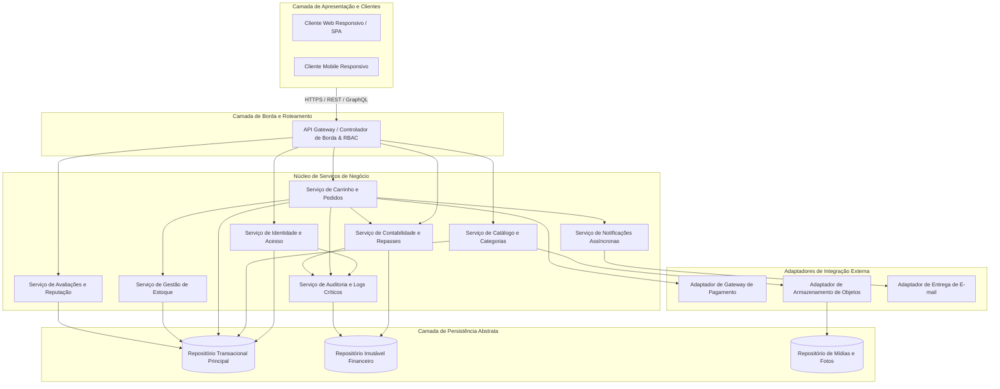
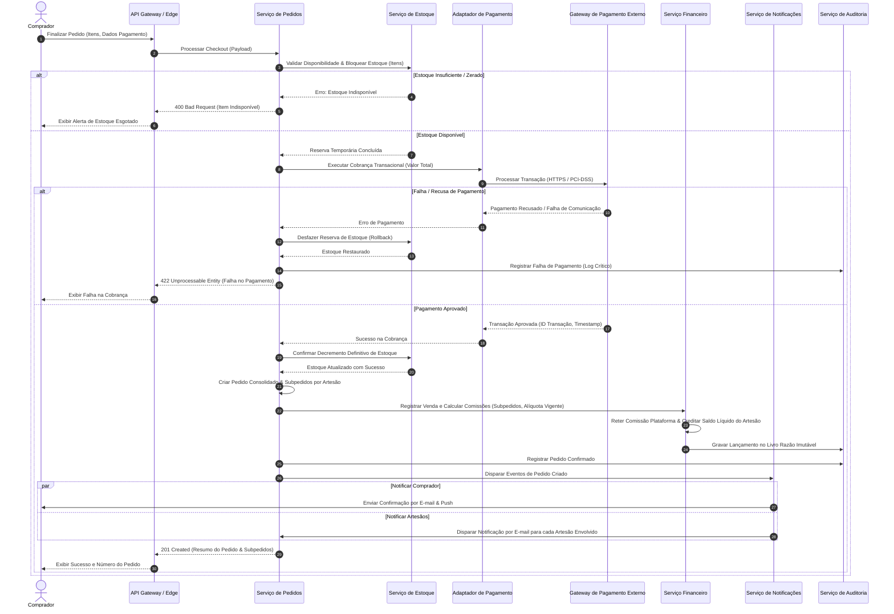
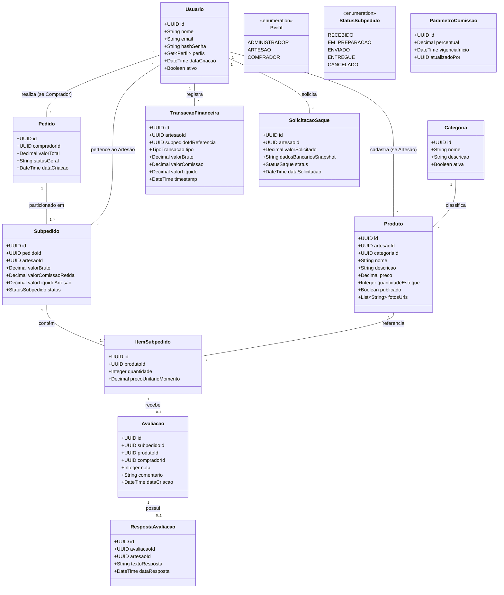

# Relatório Técnico de Arquitetura de Software

## 1. Identificação das HUs

A tabela a seguir consolida as Histórias de Usuário (HUs) levantadas para o Marketplace de Produtos Artesanais, mapeando seus respectivos atores, objetivos de negócio e valor agregado gerado.

| ID | Título | Ator | Objetivo (O que deseja) | Valor de Negócio (Para que) |
|---|---|---|---|---|
| **HU01** | Cadastrar produto com fotos | Artesão | Cadastrar produtos com atributos completos (nome, descrição, preço, estoque, categoria) e fotos | Apresentar catálogo atrativo aos compradores e habilitar a comercialização imediata |
| **HU02** | Gerenciar estoque dos produtos | Artesão | Atualizar manualmente a quantidade em estoque e acompanhar decrementos automáticos | Evitar rupturas, inconsistências de estoque e cancelamento de compras |
| **HU03** | Acompanhar e atualizar status dos pedidos recebidos | Artesão | Visualizar pedidos recebidos e transicionar seus status (recebido, preparação, enviado, entregue) | Manter transparência logística com o comprador e organizar o fluxo operacional |
| **HU04** | Visualizar painel financeiro | Artesão | Consultar extrato consolidado com valores brutos, comissões retidas e saldo líquido | Garantir previsibilidade financeira e controle sobre repasses da plataforma |
| **HU05** | Solicitar saque do saldo disponível | Artesão | Requisitar transferência bancária dos valores líquidos disponíveis | Efetivar o recebimento financeiro de suas vendas realizadas na plataforma |
| **HU06** | Responder avaliações de compradores | Artesão | Publicar respostas oficiais e imutáveis aos feedbacks de clientes em seus produtos | Estabelecer relacionamento de confiança e zelar pela reputação da sua marca |
| **HU07** | Navegar e pesquisar produtos | Comprador | Explorar produtos por árvore de categorias e pesquisa textual indexada por nome/artesão | Facilitar a descoberta de itens relevantes e impulsionar a conversão de vendas |
| **HU08** | Adicionar itens ao carrinho e finalizar compra | Comprador | Comprar itens de múltiplos artesãos em um único carrinho com checkout transacional integrado | Proporcionar experiência de compra unificada, segura e sem fricção de múltiplos pagamentos |
| **HU09** | Acompanhar status dos pedidos | Comprador | Monitorar o ciclo de vida consolidado do pedido e o progresso individual de cada subpedido | Obter rastreabilidade de entrega clara por artesão |
| **HU10** | Avaliar produto após entrega | Comprador | Atribuir nota (1 a 5) e comentário a produtos de pedidos formalmente entregues | Alimentar a reputação comunitária da plataforma e auxiliar outros compradores |
| **HU11** | Gerenciar categorias da plataforma | Administrador | Criar, atualizar e excluir a taxonomia de categorias do marketplace | Manter o catálogo estruturado, consistente e com navegação simplificada |
| **HU12** | Configurar percentual de comissão | Administrador | Parametrizar a alíquota de comissão da plataforma com controle de vigência e auditoria | Ajustar a rentabilidade do modelo de negócio sem retroatividade indevida |

---

## 2. Diagramas de Arquitetura (Mermaid)

### 2.1. Diagrama Estrutural de Componentes e Fronteiras de Contexto

A arquitetura adota um desacoplamento em camadas de serviços de domínio, delimitando os contextos de Catálogo, Checkout/Pedidos, Financeiro e Identidade, garantindo a neutralidade técnica e aderência aos requisitos funcionais e não-funcionais.

---

### 2.2. Diagrama de Sequência: Processamento Transacional de Checkout Multi-Artesão

O fluxo a seguir detalha o processamento de fechamento de pedido com múltiplos itens de diferentes artesãos, contemplando a orquestração transacional de estoque, comunicação com gateway de pagamento, particionamento em subpedidos, retenção de comissão e garantias de reversão (rollback) em caso de falha.

---

### 2.3. Diagrama do Modelo de Dados Conceitual do Domínio

---

## 3. Decisões de Arquitetura

### 3.1. Modelo de Particionamento de Pedidos (Subpedidos por Artesão)
* **Contexto:** Compradores podem consolidar itens de diferentes artesãos em um único carrinho e pagar em uma única transação (RF13, RF16, RF22, HU08). Cada artesão é responsável pela preparação e despacho exclusivo dos seus produtos (RF20, HU03, HU09).
* **Decisão:** Adotar o padrão de *Aggregate Root* com Pedido Consolidado (nível Comprador) particionado em Subpedidos independentes (nível Artesão). O ciclo de vida logístico e de repasse financeiro é operado estritamente na granularidade de Subpedido.
* **Justificativa:** Permite que falhas operacionais ou atrasos de um artesão não bloqueiem a transição de estado, as notificações e o repasse financeiro dos demais artesãos do mesmo pedido.
* **Consequências:** Exige lógica de cálculo financeiro e frete segregada por Subpedido, além de gerenciamento de status mestre que consolida o status dos nós-filhos para a visão do comprador.

### 3.2. Garantia de Transacionalidade e Isolamento de Estoque
* **Contexto:** RNF08 estipula que falhas de pagamento não devem impactar estoque nem gerar cobranças parciais. RF08 impede compra de produtos com estoque zerado.
* **Decisão:** Implementar padrão de Reserva Transacional com *Two-Phase Allocation*: durante o checkout, o estoque é bloqueado temporariamente com expiração curta. Apenas mediante resposta síncrona positiva do Gateway de Pagamento o decremento definitivo é efetivado; em caso de recusa/timeout, o bloqueio é imediatamente revertido via mecanismo de compensação.
* **Justificativa:** Previne condições de corrida (*race conditions*) em acessos concorrentes ao último item de um artesão e garante consistência estrita sem travar longamente o banco de dados.
* **Consequências:** Requer serviço de limpeza automática de reservas expiradas em caso de abandono de checkout no meio do fluxo.

### 3.3. Livro Razão Financeiro (*Ledger*) Imutável com Retenção de Comissão em Snapshot
* **Contexto:** RF26, RF27, RF28, RF29, RF30, RNF09 e HU12 exigem rastreabilidade de vendas, saldo para saque, histórico de comissões e alteração de comissão sem impacto retroativo.
* **Decisão:** Utilizar o padrão de *Event-Appended Ledger* (Escrita Apenas / *Append-Only*) para todas as movimentações monetárias (venda, retenção de taxa, solicitação de saque, estorno). O percentual de comissão é fixado no registro do Subpedido via *snapshot* no instante da liquidação da compra.
* **Justificativa:** Assegura conformidade fiscal, integridade para auditoria contábil e elimina o risco de recálculo incorreto de vendas passadas ao atualizar a taxa da plataforma.
* **Consequências:** Saldos disponíveis para saque devem ser calculados a partir da consolidação do histórico ou mantidos em tabela de saldo derivado transacional com proteção de concorrência.

### 3.4. Desacoplamento do Armazenamento de Arquivos Binários (Object Storage Externo)
* **Contexto:** RNF04 e HU01 exigem que múltiplas fotos de produtos sejam armazenadas em serviço externo de *Object Storage*, desacoplado do servidor de aplicação.
* **Decisão:** O upload de mídias operará via geração de URLs assinadas pré-autorizadas (*Pre-signed Upload URLs*) emitidas pelo serviço de aplicação, permitindo que o cliente web/mobile envie a mídia diretamente para o *Object Storage*.
* **Justificativa:** Elimina a saturação de memória e banda do backend durante o tráfego de imagens pesadas e viabiliza a entrega via redes de distribuição com baixa latência (RNF05).
* **Consequências:** O cadastro do produto torna-se um processo de duas etapas: obtenção do link de upload e envio do formulário contendo as URIs definitivas das imagens processadas.

### 3.5. Modelo de Identidade com Papéis Cumulativos (*Multi-Role RBAC*)
* **Contexto:** RF01, RF03 e RNF01 determinam que um mesmo usuário autenticado possa operar simultaneamente com os perfis de comprador e de artesão.
* **Decisão:** Implementar RBAC (*Role-Based Access Control*) baseado em conjunto de papéis atribuídos a um identificador único de usuário (*Subject*). Tokens de sessão carregarão as permissões consolidadas (`roles: ["BUYER", "ARTISAN"]`).
* **Justificativa:** Evita a criação de contas duplicadas com o mesmo e-mail e permite alternar contextos de compra e gestão de loja sem necessidade de logout.
* **Consequências:** Endpoints e componentes de interface devem validar autorizações com base no papel específico exigido pelo recurso (`@RequireRole("ARTISAN")`), e não apenas no status de autenticação genérico.

---

## 4. Tabela de Componentes e Rastreabilidade

| Componente | Responsabilidade Principal | Comunica-se com | Origem (HU / Critério de Aceite) |
|---|---|---|---|
| **Gestor de Identidade e Acesso (IAM)** | Autenticar usuários, gerar tokens seguros, efetuar hash de senhas (ex.: bcrypt) e validar múltiplos perfis simultâneos (Comprador/Artesão/Admin). | Base de Dados Transacional, Gateway de Borda | RF01, RF02, RF03, RNF01, RNF02, RNF11 |
| **Controlador de Catálogo e Mídia** | Gerenciar o ciclo de vida dos produtos (criação, edição, publicação, remoção lógica), integração com Object Storage e gestão de categorias pelo Admin. | Adaptador de Object Storage, Base de Dados, Serviço de Auditoria | RF04, RF05, RF06, RF10, RF11, RF12, RNF04, HU01, HU07, HU11 |
| **Controlador de Estoque** | Executar a reserva transacional de itens durante o checkout, confirmação de baixa pós-venda, ajuste manual pelo artesão e bloqueio de itens zerados. | Base de Dados Transacional, Orquestrador de Pedidos | RF07, RF08, RF09, RNF08, HU02, HU08 |
| **Orquestrador de Carrinho e Checkout** | Montar carrinhos de múltiplos artesãos, apresentar resumos financeiros consolidados e gerenciar a máquina de estados do checkout transacional. | Controlador de Estoque, Adaptador de Gateway de Pagamento, Gestor de Subpedidos | RF13, RF14, RF15, RF16, RF17, RNF08, HU08 |
| **Gestor de Subpedidos e Logística** | Particionar pedidos por artesão, controlar as transições de status operacional (recebido -> preparação -> enviado -> entregue) e expor rastreamento. | Base de Dados, Despachante de Notificações, Serviço de Auditoria | RF18, RF20, RF21, RF22, HU03, HU09 |
| **Adaptador de Gateway de Pagamento** | Abstrair a comunicação segura (HTTPS/PCI-DSS) com operadoras de cartão/PIX, garantindo não retenção de dados sensíveis de pagamento. | Gateway de Pagamento Externo, Orquestrador de Checkout | RF16, RF17, RNF03, RNF08, HU08 |
| **Motor Financeiro e Repasses (Ledger)** | Reter comissões da plataforma com base em alíquota histórica, registrar lançamentos contábeis imutáveis, gerenciar saldo líquido e processar solicitações de saque. | Repositório Imutável (Ledger), Serviço de Auditoria | RF26, RF27, RF28, RF29, RF30, RNF06, RNF09, HU04, HU05, HU12 |
| **Gestor de Avaliações e Reputação** | Habilitar avaliação (1 a 5 e texto) para produtos entregues, calcular média ponderada de notas e receber resposta única/imutável do artesão. | Base de Dados, Gestor de Subpedidos | RF23, RF24, RF25, HU06, HU10 |
| **Despachante de Notificações** | Processar eventos do sistema e enviar e-mails transacionais e alertas na plataforma para compradores e artesãos de forma desacoplada. | Adaptador de Envio de E-mail, Orquestrador de Pedidos | RF18, RF19, HU03, HU08 |
| **Serviço de Auditoria e Logs Críticos** | Registrar de forma estruturada e append-only eventos críticos: confirmação de pedidos, falhas de pagamento, saques e alterações de parâmetros de comissão. | Repositório de Auditoria | RNF09, RNF13, HU05, HU12 |

---

## 5. Bloqueios e Pendências

1. **Protocolo de Liquidação e Cancelamento de Subpedidos Isolados:** A especificação prevê pedidos com múltiplos artesãos (RF22), mas não define a política de estorno parcial quando apenas um dos artesãos falha no envio ou cancela seu subpedido. É necessário definir se o reembolso de um subpedido cancelado é automático e como ficam as taxas de processamento do gateway.
2. **Tempo Limite de Bloqueio de Estoque no Checkout:** É necessária a definição do tempo de expiração (*TTL/Timeout*) da reserva temporária de estoque durante a geração de ordens (ex.: PIX que aguarda pagamento por até 30 minutos).
3. **Fluxo Operacional de Aprovação de Saques:** RF30 e HU05 especificam que o artesão pode solicitar saque informando dados bancários, mas não delimitam se o processamento é automatizado via API bancária de transferências ou se existe etapa manual de aprovação/validação documental pelo Administrador.
4. **Política de Reclassificação de Produtos Órfãos:** Em HU11, é estipulado que artesãos sejam notificados ao remover uma categoria. Deve-se formalizar o estado transitório do produto (ex.: categoria "Outros / Sem Categoria" padrão ou suspensão temporária da visibilidade do item).

---

## 6. Cobertura de Requisitos

A matriz abaixo comprova o atendimento integral de todos os Requisitos Funcionais (RF01 a RF30) e Não Funcionais (RNF01 a RNF13) pelos módulos da arquitetura proposta.

| ID Requisito | Atendido por (Módulo / Mecanismo de Arquitetura) | Status |
|---|---|---|
| **RF01** | Gestor de Identidade e Acesso (IAM) - Esquema de usuários com papéis mapeados | Coberto |
| **RF02** | Gestor de Identidade e Acesso (IAM) - Ciclo de vida de tokens de autenticação | Coberto |
| **RF03** | IAM - Suporte a múltiplos papéis por entidade de usuário (*Multi-role Subject*) | Coberto |
| **RF04** | Controlador de Catálogo + Adaptador de Object Storage | Coberto |
| **RF05** | Controlador de Catálogo - Validação de propriedade (*Ownership Check*) para edição/remoção | Coberto |
| **RF06** | Controlador de Catálogo - Flag booleana de publicação/visibilidade | Coberto |
| **RF07** | Controlador de Estoque - Operações de ajuste de saldo de estoque | Coberto |
| **RF08** | Controlador de Estoque - Bloqueio de checkout quando saldo = 0 | Coberto |
| **RF09** | Controlador de Estoque + Orquestrador de Pedidos - Decremento atômico pós-aprovação | Coberto |
| **RF10** | Controlador de Catálogo - Filtros indexados por categoria | Coberto |
| **RF11** | Controlador de Catálogo - Mecanismo de busca textual por produto, categoria ou artesão | Coberto |
| **RF12** | Controlador de Catálogo - Módulo de gestão taxonômica exclusivo para Admin | Coberto |
| **RF13** | Orquestrador de Carrinho e Checkout - Gestão de sessão e itens do carrinho | Coberto |
| **RF14** | Orquestrador de Carrinho e Checkout - Operações de incremento/decremento de itens | Coberto |
| **RF15** | Orquestrador de Carrinho e Checkout - Endpoint de cálculo consolidado pré-checkout | Coberto |
| **RF16** | Orquestrador de Checkout + Adaptador de Gateway de Pagamento | Coberto |
| **RF17** | Adaptador de Gateway de Pagamento - Interface com suporte a PIX e Cartão | Coberto |
| **RF18** | Despachante de Notificações - Disparo de e-mail e evento em tela pós-aprovação | Coberto |
| **RF19** | Despachante de Notificações - Disparo assíncrono de alerta de nova venda ao artesão | Coberto |
| **RF20** | Gestor de Subpedidos - Máquina de estados (Recebido -> Preparação -> Enviado -> Entregue) | Coberto |
| **RF21** | Gestor de Subpedidos - Endpoint de consulta de pedidos e subpedidos do comprador | Coberto |
| **RF22** | Orquestrador de Pedidos / Gestor de Subpedidos - Divisão por artesão | Coberto |
| **RF23** | Gestor de Avaliações - Regra de validação de entrega confirmada antes da avaliação | Coberto |
| **RF24** | Gestor de Avaliações - Visão pública com agregações e listagem de reviews | Coberto |
| **RF25** | Gestor de Avaliações - Resposta pública unívoca do vendedor | Coberto |
| **RF26** | Motor Financeiro - Retenção de taxa e cálculo de repasse líquido | Coberto |
| **RF27** | Motor Financeiro - Parametrização de comissão por Administrador com vigência temporal | Coberto |
| **RF28** | Motor Financeiro - Painel financeiro com agregação contábil | Coberto |
| **RF29** | Motor Financeiro - Consolidação de saldo disponível via Ledger | Coberto |
| **RF30** | Motor Financeiro - Módulo de saque com snapshot de dados bancários | Coberto |
| **RNF01** | Gateway de Borda / IAM - Autorização via RBAC | Coberto |
| **RNF02** | IAM - Função criptográfica de hashing seguro (ex.: bcrypt) | Coberto |
| **RNF03** | Adaptador de Gateway de Pagamento - HTTPS/TLS obrigatório e conformidade PCI-DSS | Coberto |
| **RNF04** | Adaptador de Armazenamento de Objetos - Isolamento e upload desacoplado de mídias | Coberto |
| **RNF05** | Estratégia de Indexação e Caching em Camada de Leitura no Catálogo (< 2s) | Coberto |
| **RNF06** | Modelagem de Agregação / Índices Otimizados no Motor Financeiro (< 3s) | Coberto |
| **RNF07** | Camada de Apresentação Responsiva (Web/Mobile) | Coberto |
| **RNF08** | Padrão de Compensação Transacional / Reserva em Duas Fases no Checkout | Coberto |
| **RNF09** | Repositório Financeiro Imutável (*Append-Only Ledger*) | Coberto |
| **RNF10** | Aderência aos padrões Web W3C nos clientes de interface | Coberto |
| **RNF11** | Governança de Dados / Criptografia de dados bancários em repouso (LGPD) | Coberto |
| **RNF12** | Redundância de infraestrutura e desacoplamento de serviços (99,5% SLA) | Coberto |
| **RNF13** | Serviço de Auditoria e Logs Críticos estruturados | Coberto |

---

## 7. Gap Analysis

A análise de lacunas operacionais e técnicas identifica pontos de refinamento essenciais para mitigar riscos de implementação:

| Lacuna Identificada | Impacto Arquitetural | Ação Recomendada |
|---|---|---|
| **Cálculo de Frete e Prazos por Artesão** | A especificação não cita cálculo de frete individualizado para múltiplos artesãos situados em diferentes regiões geográficas. | Adicionar interface de cálculo logístico segregado por Subpedido, permitindo que cada vendedor informe dimensões, CEP de origem ou regras de frete fixo. |
| **Gestão de Disputas e Devoluções** | Inexistência de fluxo sistêmico para devolução ou contestação de itens entregues com defeito. | Projetar máquina de estados estendida no Subpedido para comportar os estados `EM_CONTESTACAO` e `ESTORNADO`, vinculando estornos ao Ledger. |
| **Validação de Chaves Bancárias / PIX para Saque** | Risco de saques rejeitados por inconsistência nos dados informados pelo artesão (HU05). | Criar camada de validação sintática prévia de chaves PIX/contas bancárias e registrar histórico imutável das contas de destino utilizadas. |
| **Resiliência a Notificações de Pagamento Assíncrono (Webhooks)** | Falhas de rede podem impedir o recebimento de confirmação de pagamento emitido pelo Gateway externo. | Implementar endpoint idempotente para recepção de webhooks do Gateway com fila de retentativas e processo de reconciliação periódica de status. |
| **Mecanismo de Moderação de Conteúdo nas Avaliações** | Avaliações e respostas são públicas (RF24, RF25), podendo conter linguagem ofensiva ou dados sensíveis sem mediação. | Planejar mecanismo de denúncia de conteúdo ou moderação administrativa para ocultação de avaliações que violem termos de uso. |