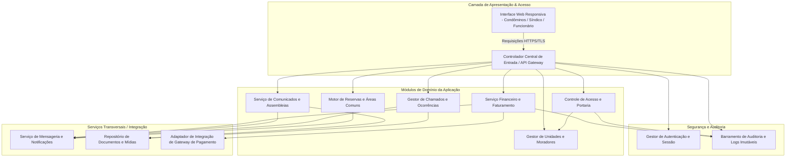
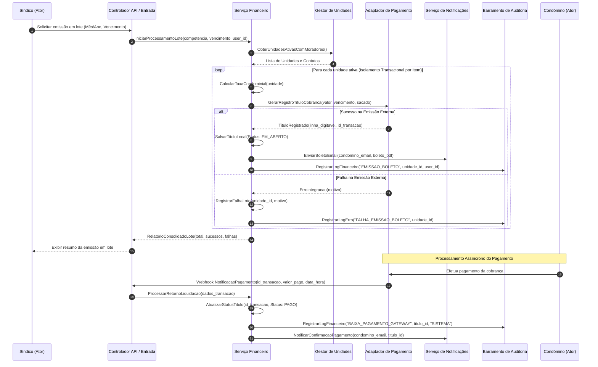

# Relatório Técnico de Arquitetura de Software

## 1. Identificação das HUs

Abaixo estão consolidadas as Histórias de Usuário (HUs) do sistema de gestão condominial, mapeadas a partir dos requisitos de negócio e operacionais:

| ID | Perfil | Título | Resumo da Necessidade | Critérios de Aceite Principais |
| :--- | :--- | :--- | :--- | :--- |
| **HU01** | Síndico | Cadastrar unidades e moradores | Manter cadastro estruturado de unidades (bloco/número/tipo) e moradores vinculados com seus respectivos papéis. | • Validação de unicidade de CPF. • Campos obrigatórios (bloco, número, nome, CPF, e-mail). • Suporte a múltiplos moradores por unidade (proprietário/inquilino). |
| **HU02** | Síndico | Emitir boletos em lote | Realizar a geração mensal consolidada de títulos de cobrança para todas as unidades ativas. | • Entrada de competência e data de vencimento. • Execução transacional e resiliente. • Relatório de falhas pontuais e envio por e-mail. |
| **HU03** | Síndico | Acompanhar inadimplências | Monitorar débitos vencidos por unidade, período e valor acumulado. | • Filtros por bloco, período e faixa de atraso. • Exportação de dados consolidados em formato CSV. • Cálculo dinâmico de dias em mora. |
| **HU04** | Síndico | Publicar comunicados | Divulgar informativos gerais aos condôminos com suporte a fixação de prioridade. | • Notificação imediata por mensageria/e-mail. • Fixação no topo do mural de avisos. |
| **HU05** | Síndico | Gerenciar ocorrências | Triar, categorizar e atualizar o ciclo de vida dos chamados abertos no condomínio. | • Transição de estados (aberta, em andamento, encerrada). • Notificação automática ao autor em cada alteração de estado. |
| **HU06** | Síndico | Criar e registrar assembleias | Agendar sessões de assembleia, publicar pautas e anexar atas deliberativas. | • Notificação prévia dos condôminos com dados do evento. • Upload e disponibilização de atas e anexos em formato PDF. |
| **HU07** | Síndico | Gerenciar áreas comuns e reservas | Cadastrar espaços compartilhados, estabelecer regras de uso e gerir a agenda consolidada. | • Parametrização de capacidade, horários e janelas de antecedência. • Visualização global da agenda e cancelamento administrativo. |
| **HU08** | Condômino | Visualizar e pagar boleto pelo portal | Consultar histórico financeiro da unidade e obter linha digitável/documento de cobrança. | • Listagem com status (aberto, pago, vencido). • Download de documento e liquidação automática via webhook de pagamento. |
| **HU09** | Condômino | Reservar área comum | Solicitar agendamento de espaço compartilhado com validação em tempo real de conflitos. | • Bloqueio de reservas sobrepostas no mesmo intervalo. • Confirmação instantânea e disparo de comprovante por e-mail. |
| **HU10** | Condômino | Registrar e acompanhar ocorrência | Abrir chamados de manutenção, reclamações ou sugestões e monitorar o status. | • Tipificação de categoria e anexação de evidências visuais. • Linha do tempo de interações e notificações de avanço. |
| **HU11** | Condômino | Pré-autorizar entrada de visitante | Cadastrar previamente visitantes esperados para desonerar a portaria física. | • Registro de nome e data prevista da visita. • Cancelamento permitido até o momento do ingresso físico. |
| **HU12** | Condômino | Acompanhar assembleias e consultar atas | Acessar cronograma de reuniões futuras e repositório de atas passadas. | • Consulta detalhada de pautas agendadas. • Download de atas e documentos complementares em PDF. |
| **HU13** | Funcionário | Registrar entrada e saída de visitantes | Controlar o fluxo físico de terceiros nas dependências do condomínio. | • Coleta de dados (nome, documento, unidade de destino). • Associação com pré-autorizações e encerramento no registro de saída. |
| **HU14** | Funcionário | Consultar pré-autorizações de acesso | Visualizar lista diária de acessos previamente liberados pelos moradores. | • Filtros por unidade e nome de visitante. • Vinculação direta da entrada à autorização existente. |

---

## 2. Diagramas de Arquitetura (Mermaid)

### 2.1. Diagrama de Componentes Lógicos do Sistema

### 2.2. Diagrama de Sequência: Emissão em Lote e Liquidação de Boletos (HU02, HU08, RF11, RF12, RNF05, RNF11)

---

## 3. Decisões de Arquitetura

### ADR 01: Modelo Arquitetural em Camadas com Fronteiras Modulares Claras
* **Contexto**: O sistema precisa suportar múltiplos perfis de acesso, fluxos transacionais heterogêneos (financeiro, acesso físico, reservas) e requisitos rigorosos de rastreabilidade e disponibilidade (RNF07).
* **Decisão**: Adotar uma arquitetura orientada a serviços lógicos/módulos de domínio desacoplados com inversão de controle. Cada subdomínio (Financeiro, Portaria, Reservas, Ocorrências) expõe interfaces formais bem delimitadas.
* **Consequências**: Facilita a testabilidade unitária e de integração, permite a evolução independente dos subsistemas e isola falhas em operações críticas sem comprometer o portal.

### ADR 02: Processamento Transacional Resiliente com Isolamento em Lote (Bulkhead Pattern)
* **Contexto**: A emissão de boletos em lote (RF13, RNF11) lida com dezenas ou centenas de unidades simultaneamente e integra-se a serviços externos de cobrança sujeitos a instabilidades temporárias.
* **Decisão**: A rotina de faturamento deve processar cada unidade em blocos transacionais isolados com controle de estado. Uma falha de integração externa em uma unidade individual não aborta nem reverte as cobranças das demais unidades já emitidas com sucesso.
* **Consequências**: Atende estritamente ao RNF11, gerando relatório de auditoria e lista explícita de exceções para reprocessamento direcionado pelo síndico.

### ADR 03: Barramento Centralizado de Auditoria e Logs Imutáveis
* **Contexto**: O sistema exige rastreabilidade completa para transações financeiras (RNF05), acessos à portaria (RNF06) e eventos críticos do condomínio (RNF13).
* **Decisão**: Implementar um barramento unificado e síncrono para operações de auditoria. Todo evento transacional deve ser gravado com metadados obrigatórios (identificador do ator, endereço de origem, data/hora em UTC, payload anterior e posterior). Os registros de auditoria possuem política estrita de apenas inserção (*append-only*), vedando deleções ou alterações.
* **Consequências**: Garante conformidade com RNF05, RNF06 e subsidia trilhas de auditoria para investigações ou litígios condominiais.

### ADR 04: Isolamento de Dados Críticos, Tokenização e Governança de Privacidade (LGPD & PCI-DSS)
* **Contexto**: Exigência de conformidade com LGPD (RNF04) no tratamento de moradores/visitantes e conformidade PCI-DSS (RNF03) na esteira financeira.
* **Decisão**: 
  1. A plataforma não armazena nem transita dados de cartões de crédito ou instrumentos sensíveis de pagamento; delega-se o processamento diretamente aos intermediadores homologados via tokenização.
  2. Dados de visitantes e moradores devem conter marcas temporais de ciclo de vida e criptografia em repouso e trânsito para campos de identificação pessoal (CPF, documentos).
  3. Desativação de usuários (RF07) implementa exclusão lógica (*soft delete*) para resguardar a integridade dos dados históricos sem exposição operacional.
* **Consequências**: Mitiga riscos regulatórios e operacionais de vazamento de dados, reduzindo o escopo de auditoria de conformidade.

### ADR 05: Mecanismo de Bloqueio Concorrente para Agendamento de Áreas Comuns
* **Contexto**: O RF27 estipula que o sistema deve impedir rigorosamente reservas sobrepostas para a mesma área e intervalo de tempo.
* **Decisão**: Aplicar validação com bloqueio transacional exclusivo no ato da reserva, verificando conflitos de agenda no intervalo `[data_inicio, data_fim]` antes da confirmação da persistência.
* **Consequências**: Elimina condições de corrida (*race conditions*) quando múltiplos condôminos tentam reservar o mesmo espaço simultaneamente (ex.: salão de festas em datas festivas).

---

## 4. Tabela de Componentes e Rastreabilidade

| Componente | Responsabilidade Principal | Comunica-se com | Origem (HU / Critério de Aceite) |
| :--- | :--- | :--- | :--- |
| `GestorAutenticacaoAcesso` | Gerenciar autenticação, políticas de senhas criptografadas (`bcrypt`), controle de sessão ativa (timeout 30 min) e RBAC por perfil. | `PortalWeb`, `ModuloAuditoriaLogs` | RF01, RF02, RF03, RNF01, RNF02 |
| `GestorUnidadesMoradores` | Manutenção cadastral de blocos, unidades, vinculação de proprietários/inquilinos, controle de veículos e inativação lógica. | `FinanceiroService`, `PortariaModule`, `ModuloAuditoriaLogs` | HU01, RF04, RF05, RF06, RF07, RF08 |
| `ServicoFinanceiroBoletos` | Gestão da taxa condominial, cálculo de cobrança, faturamento individual/lote, controle de status, painel de inadimplência e baixas manuais. | `AdaptadorGatewayPagamento`, `GestorUnidadesMoradores`, `ServicoNotificacoes`, `ModuloAuditoriaLogs` | HU02, HU03, HU08, RF09, RF10, RF12, RF13, RF14, RF15, RNF05, RNF08, RNF11 |
| `AdaptadorGatewayPagamento` | Abstrair comunicação com provedores de pagamento externos para emissão de cobranças e recepção de webhooks de liquidação. | `ServicoFinanceiroBoletos` | RF11, RF12, RNF03 |
| `ServicoComunicadosAssembleias` | Publicação de informativos murais, criação de assembleias, registro de pautas, gestão e distribuição de atas digitais. | `ServicoNotificacoes`, `FileStorageService`, `ModuloAuditoriaLogs` | HU04, HU06, HU12, RF16, RF17, RF18, RF19, RF20 |
| `GestorOcorrencias` | Recepção, tipificação, gestão do ciclo de vida, upload de evidências e histórico de interações das ocorrências. | `ServicoNotificacoes`, `FileStorageService`, `ModuloAuditoriaLogs` | HU05, HU10, RF21, RF22, RF23, RF24, RNF13 |
| `MotorReservasAreasComuns` | Parametrização de áreas de lazer, motor de checagem de regras/conflitos e cancelamento de agendamentos. | `ServicoNotificacoes`, `GestorUnidadesMoradores`, `ModuloAuditoriaLogs` | HU07, HU09, RF25, RF26, RF27, RF28, RF29, RNF08 |
| `ControleAcessoPortaria` | Registro de entradas/saídas físicas de visitantes, gestão de pré-autorizações e disponibilização de logs operacionais. | `GestorUnidadesMoradores`, `ModuloAuditoriaLogs` | HU11, HU13, HU14, RF30, RF31, RF32, RF33, RNF06 |
| `ServicoNotificacoes` | Despacho assíncrono de e-mails transacionais (boletos, avisos, mudanças de status, convocações). | `FinanceiroModule`, `ComunicacaoModule`, `OcorrenciasModule`, `ReservasModule` | HU02, HU04, HU05, HU06, HU07, HU09, HU10, RF17, RF24 |
| `FileStorageService` | Gerenciamento de armazenamento seguro de arquivos estáticos (atas em PDF, fotos de ocorrências). | `ComunicacaoModule`, `OcorrenciasModule` | HU06, HU10, HU12, RF19 |
| `ModuloAuditoriaLogs` | Coleta e consolidação imutável de eventos operacionais, financeiros e acessos à portaria. | Todos os componentes de domínio | RNF05, RNF06, RNF13 |

---

## 5. Bloqueios e Pendências

1. **Protocolo e Mecanismo de Conciliação Bancária / Gateway**:
   * *Pendência*: Definição do protocolo exato (ex.: integração via Webhooks REST com assinatura criptográfica HMAC vs. arquivos de remessa/retorno padrão bancário) para a conciliação automática de pagamentos.
   * *Ação*: Alinhar com o provedor financeiro a especificação técnica dos retornos assíncronos e o tempo de compensação de liquidação.
2. **Definição dos Prazos de Retenção de Dados de Visitantes (LGPD)**:
   * *Pendência*: A regra de retenção de dados pessoais de visitantes na portaria (RNF04 vs. RNF06) carece de especificação jurídica formal do condomínio sobre o tempo de descarte/anonimização do histórico de visitas.
   * *Ação*: Obter parecer de conformidade jurídica para configurar rotina de expurgo/anonimização automática dos dados de acesso após o período legal.
3. **Mecanismo de Resolução de Notificações em Falha**:
   * *Pendência*: Política de reintento (*retry policy*) para notificações transacionais por e-mail quando o servidor de mensagens estiver indisponível.
   * *Ação*: Especificar uma fila de reprocessamento para garantir que nenhum condômino fique sem receber avisos críticos de assembleia ou cobrança.

---

## 6. Cobertura de Requisitos

A matriz abaixo detalha como cada Requisito Funcional (RF) e Não Funcional (RNF) é atendido pela arquitetura:

| Requisito | Componente(s) Responsável(is) | Decisão de Arquitetura (ADR) | HU Associada |
| :--- | :--- | :--- | :--- |
| **RF01, RF02, RF03** | `GestorAutenticacaoAcesso` | ADR 01 | Transversal a todas as HUs |
| **RF04, RF05, RF06, RF07, RF08** | `GestorUnidadesMoradores` | ADR 01, ADR 04 | HU01 |
| **RF09, RF10, RF13** | `ServicoFinanceiroBoletos` | ADR 01, ADR 02 | HU02 |
| **RF11, RF12** | `ServicoFinanceiroBoletos`, `AdaptadorGatewayPagamento` | ADR 02, ADR 04 | HU08 |
| **RF14, RF15** | `ServicoFinanceiroBoletos` | ADR 01, ADR 03 | HU03 |
| **RF16, RF17** | `ServicoComunicadosAssembleias`, `ServicoNotificacoes` | ADR 01 | HU04 |
| **RF18, RF19, RF20** | `ServicoComunicadosAssembleias`, `FileStorageService` | ADR 01 | HU06, HU12 |
| **RF21, RF22, RF23, RF24** | `GestorOcorrencias`, `ServicoNotificacoes`, `FileStorageService` | ADR 01, ADR 03 | HU05, HU10 |
| **RF25, RF26, RF27, RF28, RF29** | `MotorReservasAreasComuns`, `ServicoNotificacoes` | ADR 01, ADR 05 | HU07, HU09 |
| **RF30, RF31, RF32, RF33** | `ControleAcessoPortaria`, `GestorUnidadesMoradores` | ADR 01, ADR 03, ADR 04 | HU11, HU13, HU14 |
| **RNF01, RNF02** | `GestorAutenticacaoAcesso` | ADR 01 | Transversal |
| **RNF03** | `AdaptadorGatewayPagamento` | ADR 04 | HU02, HU08 |
| **RNF04** | `GestorUnidadesMoradores`, `ControleAcessoPortaria` | ADR 04 | HU01, HU11, HU13 |
| **RNF05, RNF06, RNF13** | `ModuloAuditoriaLogs` | ADR 03 | HU02, HU03, HU13 |
| **RNF07, RNF08** | Todos os Componentes de Domínio | ADR 01, ADR 05 | HU03, HU07, HU09 |
| **RNF09, RNF10** | `PortalWeb` | ADR 01 | Transversal |
| **RNF11** | `ServicoFinanceiroBoletos` | ADR 02 | HU02 |
| **RNF12** | Infraestrutura / Estratégia de Backup Diário | ADR 03 | Operacional |

---

## 7. Gap Analysis

| # | Lacuna Identificada | Impacto Arquitetural | Ação Recomendada para o Time de Desenvolvimento |
| :--- | :--- | :--- | :--- |
| **GAP-01** | **Tratamento de Estornos e Conflito de Baixas Manuais com Gateway** | Risco de inconsistência de saldo contábil caso uma baixa manual seja feita no momento em que uma liquidação do gateway é confirmada via Webhook. | Implementar uma máquina de estados finitos rígida para a entidade `TituloCobranca` com trava de concorrência que rejeita baixa manual se o status já for `PAGO` ou `EM_PROCESSAMENTO`. |
| **GAP-02** | **Ausência de Estratégia para Cancelamento com Devolução de Taxas de Reserva** | Se for instituída cobrança pelo uso de áreas comuns (ex.: salão de festas), a regra atual de cancelamento (RF28) não prevê fluxo de estorno financeiro. | Desacoplar a regra de agendamento do módulo de faturamento, criando uma interface de integração opcional para cobrança de taxas de locação de espaços. |
| **GAP-03** | **Sobrecarga em Consultas Analíticas (Painel de Inadimplência e Calendários)** | Consultas agregadas de inadimplência histórica (RF15/RNF08) em condomínios de grande porte podem degradar a meta de resposta em até 3 segundos. | Projetar visualizações materializadas ou índices compostos especializados cobrindo `[unidade_id, status, data_vencimento]` para acelerar as consultas do painel. |
| **GAP-04** | **Limite de Armazenamento e Sanitização de Anexos de Ocorrências e Atas** | O envio irrestrito de fotos de ocorrências (HU10) e atas em PDF pode sobrecarregar o repositório de arquivos e introduzir riscos de arquivos maliciosos. | Incluir componente de validação de tipo MIME, limite estrito de tamanho por arquivo e varredura de integridade no componente `FileStorageService`. |