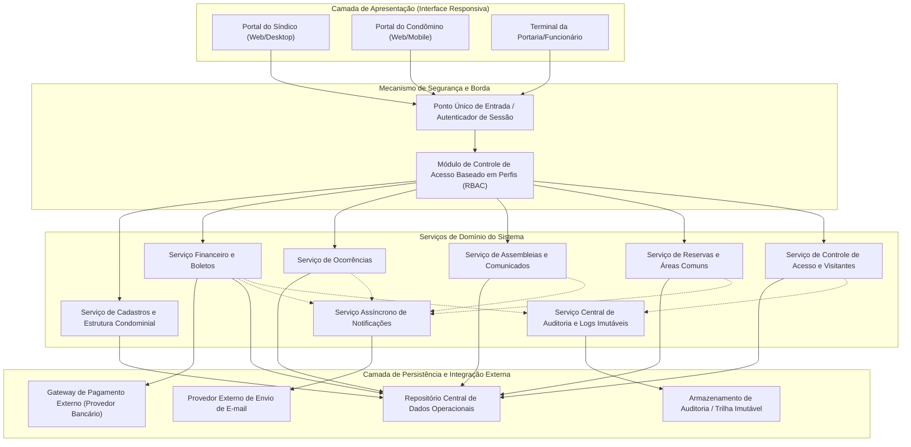
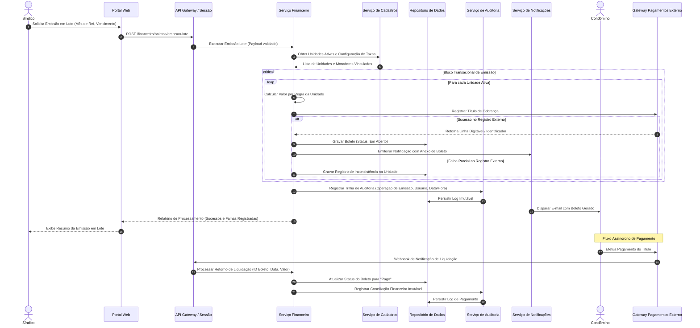
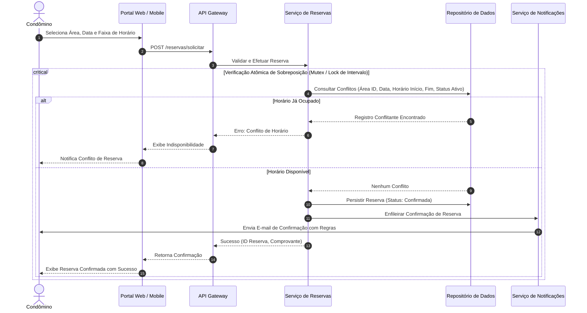
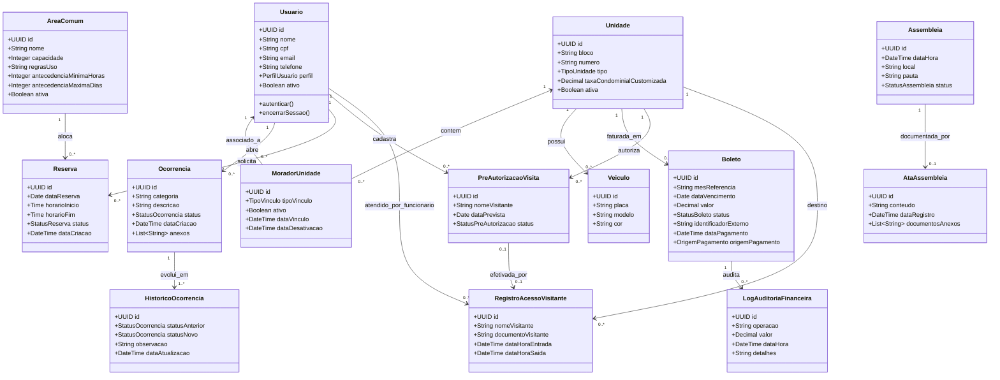

# Relatório Técnico de Arquitetura de Software

## 1. Identificação das HUs

A tabela a seguir consolida as Histórias de Usuário (HUs) levantadas para o Sistema de Administração de Condomínio Residencial, mapeando atores, objetivos de negócio e escopo funcional:

| ID | Ator Principal | Título / Objetivo | Escopo e Critérios Chave |
|---|---|---|---|
| **HU01** | Síndico | Cadastrar unidades e moradores | Gestão cadastral de blocos, unidades e vínculo de moradores (proprietário/inquilino), garantindo unicidade de CPF e preservação de histórico. |
| **HU02** | Síndico | Emitir boletos em lote | Processamento transacional em lote de cobranças mensais por unidade ativa, integração para envio e tratamento de falhas parciais. |
| **HU03** | Síndico | Acompanhar inadimplências | Painel analítico de débitos consolidados por período, bloco e faixa de atraso com exportação de dados estruturados. |
| **HU04** | Síndico | Publicar comunicados | Criação, fixação e difusão de avisos informativos com disparo de notificações aos condôminos. |
| **HU05** | Síndico | Gerenciar ocorrências | Triagem, categorização, atualização de fluxo de estados e comunicação de progresso aos autores. |
| **HU06** | Síndico | Criar e registrar assembleias | Convocação formal, publicação de pautas, gestão de eventos e arquivamento de atas e anexos documentais. |
| **HU07** | Síndico | Gerenciar áreas comuns e reservas | Parametrização de regras de uso, capacidade, bloqueios, acompanhamento de agenda global e cancelamentos administrativos. |
| **HU08** | Condômino | Visualizar e pagar boleto pelo portal | Consulta de obrigações financeiras, download de títulos e conciliação automática de liquidação via gateway. |
| **HU09** | Condômino | Reservar área comum | Agendamento de espaços com validação de disponibilidade em tempo real e bloqueio estrito de sobreposição temporal. |
| **HU10** | Condômino | Registrar e acompanhar ocorrência | Abertura de chamados com categorização, anexos de mídia e rastreamento de histórico de intervenções. |
| **HU11** | Condômino | Pré-autorizar entrada de visitante | Cadastro antecipado de visitas esperadas para agilização do fluxo de controle de acesso na portaria. |
| **HU12** | Condômino | Acompanhar assembleias e consultar atas | Visualização de cronograma de assembleias e acesso para leitura/download de atas e deliberações. |
| **HU13** | Funcionário | Registrar entrada e saída de visitantes | Registro operacional de fluxo de portaria com captura de dados, documento, vínculo à unidade e checagem de pré-autorizações. |
| **HU14** | Funcionário | Consultar pré-autorizações de acesso | Consulta em tempo real de visitantes autorizados no dia, filtrados por unidade ou nome, com vinculação imediata no check-in. |

---

## 2. Diagramas de Arquitetura (Mermaid)

### 2.1. Visão Geral de Componentes do Sistema (Container/Component Level)

---

### 2.2. Diagrama de Sequência: Emissão em Lote, Liquidação de Boletos e Notificação

---

### 2.3. Diagrama de Sequência: Reserva de Área Comum com Bloqueio de Concorrência

---

### 2.4. Modelo de Domínio e Relacionamentos Estruturais

---

## 3. Decisões de Arquitetura

* **ADR-01: Isolamento de Fronteiras de Domínio e Arquitetura Baseada em Serviços Especializados**
  * *Decisão:* Organizar a arquitetura em módulos/serviços de domínio coesos (Cadastros, Financeiro, Reservas, Portaria, Ocorrências, Assembleias e Notificações) orquestrados por uma Camada de Borda/API Gateway central.
  * *Justificativa:* Garante baixo acoplamento, manutenibilidade (RNF13) e escalabilidade independente dos módulos com cargas assimétricas (como consultas de portaria em tempo real vs. processamento financeiro pesado).

* **ADR-02: Garantia de Atomicidade e Tratamento Transacional na Emissão de Cobranças em Lote**
  * *Decisão:* A emissão em lote de boletos (RF13, HU02, RNF11) deve operar sob padrão transacional resiliente com isolamento por unidade. Em caso de falha de comunicação com o gateway bancário em determinada unidade, a transação local daquela unidade é registrada em estado de inconsistência/falha sem abortar as emissões das demais unidades ativas.
  * *Justificativa:* Cumpre rigorosamente o RNF11, impedindo corrupção de dados ou bloqueio total da rotina mensal de faturamento.

* **ADR-03: Controle de Concorrência Pessimista / Bloqueio Atômico para Reserva de Áreas Comuns**
  * *Decisão:* Adotar validação atômica de intervalo de datas/horários com bloqueio transacional exclusivo durante a persistência da solicitação de reserva (RF27, HU09).
  * *Justificativa:* Impede condições de corrida (*race conditions*) onde dois condôminos poderiam reservar o mesmo espaço no mesmo milissegundo, satisfazendo a regra de integridade de negócios.

* **ADR-04: Imutabilidade e Trilha de Auditoria com Separação de Responsabilidades**
  * *Decisão:* Estabelecer um componente dedicado de Auditoria e Logs que registre em modelo imutável (*append-only*) toda mutação financeira (emissão, baixa manual, liquidação) e registros de acesso à portaria (RNF05, RNF06, RNF13).
  * *Justificativa:* Garante conformidade legal, rastreabilidade forense e não-repúdio das operações financeiras e de segurança predial.

* **ADR-05: Estratégia de Desativação Lógica (*Soft Delete*) e Conformidade com LGPD**
  * *Decisão:* Implementar desativação lógica para registros de moradores e unidades (RF07) associada a mecanismos de mascaramento/anonimização sob demanda para atendimento aos direitos de titulares previstos na LGPD (RNF04).
  * *Justificativa:* Permite manter a integridade referencial histórica de transações financeiras e acessos passados sem violar o ciclo de vida e retenção de dados pessoais.

* **ADR-06: Desacoplamento Assíncrono do Mecanismo de Notificação**
  * *Decisão:* As comunicações e disparos de e-mails (comunicados, boletos gerados, confirmação de reservas, assembleias e mudanças de status de ocorrências) devem ser desacoplados via fila/barramento assíncrono interno.
  * *Justificativa:* Evita que lentidões ou indisponibilidades temporárias do provedor de e-mail bloqueiem a experiência do usuário final ou excedam os limites de latência das requisições síncronas (RNF08).

---

## 4. Tabela de Componentes e Rastreabilidade

| Componente | Responsabilidade Principal | Comunica-se com | Origem (HU / Critério de Aceite) |
|---|---|---|---|
| **Mecanismo de Segurança e Sessão (API Gateway / RBAC)** | Autenticar credenciais seguras, gerenciar tempo de expiração de sessão (30 min) e aplicar controle de acesso estrito por perfil. | Camada de Apresentação, Todos os Serviços de Domínio | RF01, RF02, RF03, RNF01, RNF02 |
| **Serviço de Cadastros e Estrutura Condominial** | Administrar blocos, unidades, moradores (proprietários/inquilinos), veículos e desativação lógica mantendo histórico. | Repositório de Dados, Serviço Financeiro | HU01, RF04, RF05, RF06, RF07, RF08, RNF04 |
| **Serviço Financeiro e Boletos** | Configurar taxas, emitir boletos individuais/lote, integrar com gateway de cobrança, registrar baixas manuais e alimentar painel de inadimplência. | Repositório de Dados, Gateway de Pagamento Externo, Serviço de Auditoria, Serviço de Notificações | HU02, HU03, HU08, RF09, RF10, RF11, RF12, RF13, RF14, RF15, RNF03, RNF05, RNF08, RNF11 |
| **Serviço de Reservas e Áreas Comuns** | Parametrizar áreas, regras de uso, validar disponibilidade em tempo real, gerenciar cancelamentos e calendário unificado. | Repositório de Dados, Serviço de Notificações | HU07, HU09, RF25, RF26, RF27, RF28, RF29, RNF08 |
| **Serviço de Ocorrências** | Registrar chamados internos e externos, suportar anexos, controlar transições de status e histórico de atendimento. | Repositório de Dados, Serviço de Notificações | HU05, HU10, RF21, RF22, RF23, RF24, RNF13 |
| **Serviço de Assembleias e Comunicados** | Publicar avisos com destaque, agendar assembleias com pauta, gerenciar arquivamento de atas e anexos digitais. | Repositório de Dados, Serviço de Notificações | HU04, HU06, HU12, RF16, RF17, RF18, RF19, RF20, RNF13 |
| **Serviço de Portaria e Controle de Acesso** | Registrar entradas e saídas de visitantes, gerenciar pré-autorizações de condôminos e consultar histórico de acessos por unidade. | Repositório de Dados, Serviço de Auditoria | HU11, HU13, HU14, RF30, RF31, RF32, RF33, RNF06, RNF13 |
| **Serviço Assíncrono de Notificações** | Processar filas de mensageria para envio de e-mails transacionais (boletos, avisos, confirmações de reservas e ocorrências). | Provedor Externo de Mensageria, Serviços de Negócio | RF17, RF24, HU02, HU04, HU06, HU09, HU10 |
| **Serviço de Auditoria e Logs Imutáveis** | Capturar eventos críticos, registros financeiros e acessos à portaria em trilha imutável (*append-only*). | Repositório de Auditoria, Serviço Financeiro, Serviço de Portaria | RNF05, RNF06, RNF13 |

---

## 5. Bloqueios e Pendências

1. **Tratamento de Indisponibilidade na Portaria (Modo Offline/Degradado):**
   * *Pendência:* O documento de requisitos não especifica o comportamento do sistema de portaria (RF30/HU13) em caso de queda temporária de conectividade de rede com o servidor central.
   * *Impacto:* Risco de retenção física na entrada do condomínio caso o terminal dependa exclusivamente de chamadas síncronas online.

2. **Política de Retenção e Expurgos Financeiros vs. LGPD:**
   * *Pendência:* Conflito potencial entre a obrigação de retenção fiscal/contábil de registros financeiros (RNF05 - mínimo legal de 5 anos) e eventuais solicitações de exclusão total de dados de ex-moradores sob a égide da LGPD (RNF04).
   * *Impacto:* Necessidade de definir formalmente regras de anonimização parcial em vez de deleção física.

3. **Validação de Limites de Cancelamento de Reservas:**
   * *Pendência:* RF28 estipula cancelamento "dentro do prazo configurado pelo síndico", mas não define regras de negócio para eventuais taxas de cancelamento tardio ou liberação automática para fila de espera.

4. **Tratamento de Idempotência em Webhooks do Gateway:**
   * *Pendência:* O gateway externo pode reenviar múltiplos eventos de liquidação do mesmo boleto (RF11/RF12).
   * *Impacto:* Necessidade de implementar chave de idempotência obrigatória no endpoint de recepção de pagamentos para evitar conciliação duplicada.

---

## 6. Cobertura de Requisitos

A matriz abaixo demonstra a cobertura integral dos Requisitos Funcionais (RF) e Não Funcionais (RNF) pelos componentes da arquitetura e pelas Histórias de Usuário correspondentes:

| Requisito ID | Categoria / Descrição Resumida | Componente(s) Responsável(is) | História de Usuário (HU) | Status de Cobertura |
|---|---|---|---|---|
| **RF01** | Cadastro de perfis de usuário | Mecanismo de Segurança / Cadastros | HU01 | Coberto |
| **RF02** | Restrição de acesso por perfil (RBAC) | Mecanismo de Segurança (API Gateway) | Todas | Coberto |
| **RF03** | Autenticação e encerramento de sessão | Mecanismo de Segurança / Sessão | Todas | Coberto |
| **RF04** | Gestão de unidades (bloco/número/tipo) | Serviço de Cadastros | HU01 | Coberto |
| **RF05** | Cadastro de moradores e vínculo à unidade | Serviço de Cadastros | HU01 | Coberto |
| **RF06** | Identificação proprietário vs inquilino | Serviço de Cadastros | HU01 | Coberto |
| **RF07** | Desativação lógica preservando histórico | Serviço de Cadastros | HU01 | Coberto |
| **RF08** | Registro de veículos por unidade | Serviço de Cadastros | HU01 | Coberto |
| **RF09** | Parametrização da taxa condominial | Serviço Financeiro e Boletos | HU01, HU02 | Coberto |
| **RF10** | Emissão individual de boletos | Serviço Financeiro e Boletos | HU08 | Coberto |
| **RF11** | Integração com gateway de pagamentos | Serviço Financeiro / Adapter Gateway | HU02, HU08 | Coberto |
| **RF12** | Atualização automática de status de pagamento | Serviço Financeiro (Webhook Processor) | HU08 | Coberto |
| **RF13** | Emissão em lote de boletos | Serviço Financeiro e Boletos | HU02 | Coberto |
| **RF14** | Registro de pagamentos manuais | Serviço Financeiro e Boletos | HU03 | Coberto |
| **RF15** | Painel analítico de inadimplências | Serviço Financeiro (Módulo de Consulta) | HU03 | Coberto |
| **RF16** | Publicação de comunicados no portal | Serviço de Assembleias e Comunicados | HU04 | Coberto |
| **RF17** | Notificação de comunicados por e-mail | Serviço Assíncrono de Notificações | HU04 | Coberto |
| **RF18** | Criação e convocação de assembleias | Serviço de Assembleias e Comunicados | HU06 | Coberto |
| **RF19** | Registro e vinculação de atas | Serviço de Assembleias e Comunicados | HU06 | Coberto |
| **RF20** | Consulta pública de assembleias e atas | Serviço de Assembleias e Comunicados | HU12 | Coberto |
| **RF21** | Registro de ocorrências por condôminos | Serviço de Ocorrências | HU10 | Coberto |
| **RF22** | Registro de ocorrências internas (funcionários) | Serviço de Ocorrências | HU05 | Coberto |
| **RF23** | Triagem e atualização de status de ocorrência | Serviço de Ocorrências | HU05 | Coberto |
| **RF24** | Notificação de atualização de ocorrência | Serviço Assíncrono de Notificações | HU05, HU10 | Coberto |
| **RF25** | Cadastro e regras de áreas comuns | Serviço de Reservas e Áreas Comuns | HU07 | Coberto |
| **RF26** | Reserva de áreas comuns pelo condômino | Serviço de Reservas e Áreas Comuns | HU09 | Coberto |
| **RF27** | Bloqueio de reservas sobrepostas | Serviço de Reservas (Lock Concorrência) | HU09 | Coberto |
| **RF28** | Cancelamento de reservas dentro do prazo | Serviço de Reservas e Áreas Comuns | HU07, HU09 | Coberto |
| **RF29** | Calendário consolidado de reservas | Serviço de Reservas e Áreas Comuns | HU07 | Coberto |
| **RF30** | Registro de entrada/saída de visitantes | Serviço de Portaria e Controle de Acesso | HU13 | Coberto |
| **RF31** | Pré-autorização de visitantes | Serviço de Portaria e Controle de Acesso | HU11 | Coberto |
| **RF32** | Exibição de pré-autorizações na portaria | Serviço de Portaria e Controle de Acesso | HU14 | Coberto |
| **RF33** | Histórico de visitantes consultável | Serviço de Portaria / Auditoria | HU13, HU14 | Coberto |
| **RNF01** | Timeout de sessão inativa em 30 min | Mecanismo de Segurança e Sessão | Todas | Coberto |
| **RNF02** | Hash seguro de senhas criptográficas | Mecanismo de Segurança | HU01 | Coberto |
| **RNF03** | Conformidade PCI-DSS (sem retenção de cartão) | Serviço Financeiro / Adapter Gateway | HU08 | Coberto |
| **RNF04** | Conformidade com a LGPD | Todos os Componentes / Camada de Dados | Todas | Coberto |
| **RNF05** | Imutabilidade e rastreabilidade financeira | Serviço de Auditoria e Logs Imutáveis | HU02, HU03, HU08 | Coberto |
| **RNF06** | Rastreabilidade de acessos na portaria | Serviço de Auditoria / Portaria | HU13, HU14 | Coberto |
| **RNF07** | Uptime mínimo 99,5% (24/7) | Infraestrutura / Arquitetura de Borda | Todas | Coberto |
| **RNF08** | Desempenho (<3s no painel e calendário) | Mecanismos de Indexação e Cache Lógico | HU03, HU07 | Coberto |
| **RNF09** | Responsividade Web/Mobile | Camada de Apresentação Responsiva | Todas | Coberto |
| **RNF10** | Compatibilidade de navegadores | Camada de Apresentação Responsiva | Todas | Coberto |
| **RNF11** | Transacionalidade na emissão em lote | Serviço Financeiro e Boletos | HU02 | Coberto |
| **RNF12** | Rotina de backup diário com retenção | Camada de Persistência e Backup | Todas | Coberto |
| **RNF13** | Auditoria e logs de eventos críticos | Serviço de Auditoria e Logs Imutáveis | HU04, HU05, HU13 | Coberto |

---

## 7. Gap Analysis

A análise técnica a seguir aponta lacunas de especificação encontradas nos requisitos originais, avalia o impacto técnico-arquitetural e detalha as ações recomendadas para implementação:

| ID | Lacuna Identificada | Impacto Arquitetural | Ação Recomendada |
|---|---|---|---|
| **GAP-01** | **Mecanismo de Retentativa e Idempotência no Envio de Boletos em Lote** | Falhas transitórias de conexão com o gateway podem gerar reprocessamento acidental e cobrança duplicada ou boletos não enviados. | Implementar padrão de Chave de Idempotência única por Unidade/Mês/Ano e fila de retentativa (*retry queue*) com retrocesso exponencial (*exponential backoff*) para processamento assíncrono. |
| **GAP-02** | **Formato e Armazenamento Seguro de Anexos (Ocorrências e Atas)** | O upload descontrolado de fotos e documentos PDF pode degradar a performance do repositório principal e gerar vulnerabilidades de injeção de arquivos. | Estabelecer um serviço dedicado de armazenamento de objetos estáticos com validação de tipos MIME, varredura de integridade e limite de tamanho de payload (ex.: máximo 10MB por arquivo). |
| **GAP-03** | **Tratamento de Visitantes Recorrentes / Prestadores de Serviço** | RF30 a RF33 cobrem visitantes pontuais, mas não contemplam explicitamente regras para prestadores de serviço com permanência estendida ou recorrente. | Estender o modelo do `Servico_Portaria` para suportar tipificação de visitante (Visitante Comum vs. Prestador de Serviço) com controle de vigência de crachá/autorização. |
| **GAP-04** | **Estratégia de Cache para Cumprimento do SLA de 3 Segundos (RNF08)** | O cálculo agregado do Painel de Inadimplência em condomínios de grande porte pode violar o tempo de resposta estipulado de 3 segundos se executado puramente *on-the-fly*. | Projetar visões materializadas ou agregadores em camada de cache em memória para os indicadores consolidados de débito, invalidando o cache a cada nova baixa ou emissão. |
| **GAP-05** | **Notificação Multicanal em Cenários de Urgência** | Os requisitos limitam notificações exclusivamente ao canal de e-mail (RF17, RF24), o que pode ser ineficiente para avisos críticos de portaria ou assembleias iminentes. | Estruturar a interface do `Servico_Notificacoes` sob padrão *Strategy*, permitindo conectar facilmente novos canais de entrega (como mensagens instantâneas ou push notification) sem alterar os serviços de domínio. |