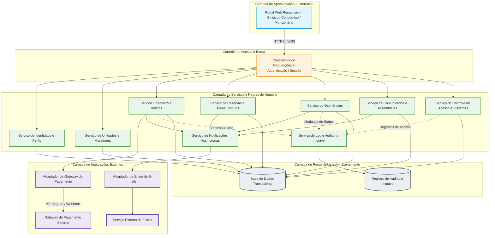
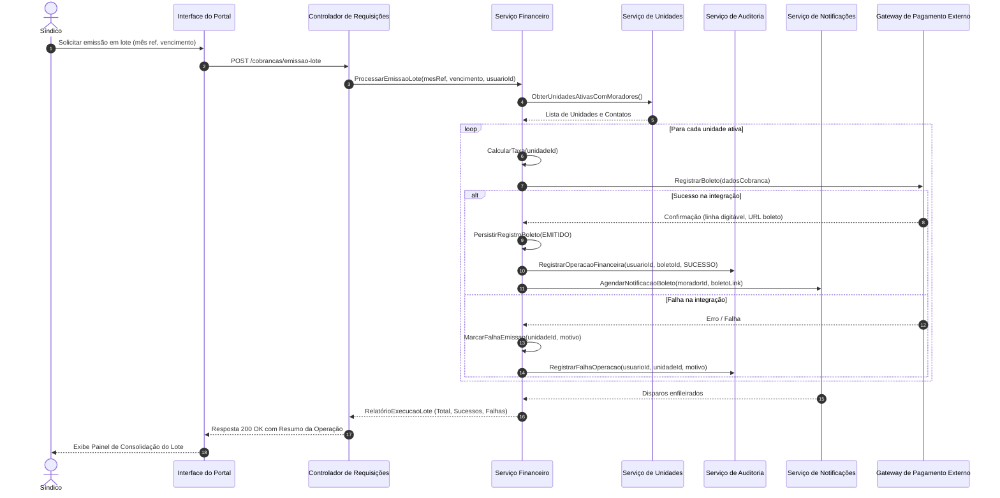

# Relatório Técnico de Arquitetura de Software

## 1. Identificação das HUs

Abaixo estão consolidadas as Histórias de Usuário (HUs), seus respectivos atores, escopos e o mapeamento com os Requisitos Funcionais (RF) e Requisitos Não Funcionais (RNF).

| ID | Ator | Título da História de Usuário | Resumo dos Critérios de Aceite | Requisitos Vinculados |
| :--- | :--- | :--- | :--- | :--- |
| **HU01** | Síndico | Cadastrar unidades e moradores | Campos obrigatórios (bloco, número, nome, CPF único, e-mail); suporte a múltiplos moradores por unidade e tipos de vínculo. | RF01, RF04, RF05, RF06, RF07, RF08, RNF04 |
| **HU02** | Síndico | Emitir boletos em lote | Entrada de mês de referência e vencimento; geração individual por unidade ativa; disparo de notificação; tratamento transacional de falhas parciais. | RF09, RF10, RF13, RNF05, RNF11, RNF13 |
| **HU03** | Síndico | Acompanhar inadimplências | Painel com boletos vencidos em aberto; filtros por bloco, período e atraso; exportação em formato estruturado (CSV); tempo de resposta $\le$ 3s. | RF15, RNF08, RNF09 |
| **HU04** | Síndico | Publicar comunicados | Título, corpo e data; envio imediato de notificação por e-mail; opção de fixação em destaque no portal. | RF16, RF17, RNF13 |
| **HU05** | Síndico | Gerenciar ocorrências | Listagem detalhada; filtros por status, categoria e período; atualização de status com notificação ao autor. | RF23, RF24, RNF13 |
| **HU06** | Síndico | Criar e registrar assembleias | Agendamento com notificação aos condôminos; vinculação de ata pós-evento com suporte a anexos (PDF). | RF18, RF19, RF20, RNF09 |
| **HU07** | Síndico | Gerenciar áreas comuns e reservas | Configuração de regras (horários, antecedência mín./máx.); calendário consolidado; cancelamento administrativo com notificação. | RF25, RF27, RF28, RF29, RNF08 |
| **HU08** | Condômino | Visualizar e pagar boleto pelo portal | Listagem por status; download de boleto; baixa automática via integração de pagamento. | RF02, RF03, RF10, RF11, RF12, RNF01, RNF03 |
| **HU09** | Condômino | Reservar área comum | Consulta de disponibilidade em tempo real; validação de sobreposição; confirmação imediata e envio de comprovante. | RF02, RF26, RF27, RNF07, RNF08 |
| **HU10** | Condômino | Registrar e acompanhar ocorrência | Registro com categoria, descrição e anexos; visualização do histórico de tramitação; recebimento de alertas de status. | RF21, RF24, RNF09, RNF13 |
| **HU11** | Condômino | Pré-autorizar entrada de visitante | Cadastro prévio de visitante e data prevista; disponibilização para a portaria; cancelamento de autorizações pendentes. | RF31, RNF04, RNF06 |
| **HU12** | Condômino | Acompanhar assembleias e consultar atas | Visualização de cronograma e pautas; download de atas e anexos em formato padrão (PDF). | RF20, RNF09, RNF10 |
| **HU13** | Funcionário | Registrar entrada e saída de visitantes | Registro de acesso com validação de dados; identificação de pré-autorização; registro imutável com operador, data e hora. | RF02, RF30, RF32, RF33, RNF04, RNF06, RNF13 |
| **HU14** | Funcionário | Consultar pré-autorizações de acesso | Listagem filtrável por unidade ou visitante; vinculação direta da entrada à pré-autorização existente. | RF31, RF32, RNF08, RNF09 |

---

## 2. Diagramas de Arquitetura (Mermaid)

### 2.1. Diagrama de Componentes da Arquitetura Lógica

### 2.2. Diagrama de Sequência: Emissão de Boletos em Lote e Notificação

---

## 3. Decisões de Arquitetura

1. **Estratégia de Autenticação e Gestão de Sessões (RNF01, RNF02):**
   - A autenticação adota mecanismo desacoplado baseado em tokens seguros com verificação criptográfica e cálculo seguro de hash para credenciais de acesso.
   - O controle de expiração de sessão inativa é aplicado pelo Controlador de Borda com tempo limite de 30 minutos sem atividade, invalidando os identificadores temporários de sessão.

2. **Isolamento e Conformidade de Dados de Pagamento (RNF03, RF11, RF12):**
   - O sistema segue o padrão de integração transparente/redirecionamento com provedor de pagamento. Em estrita conformidade com o PCI-DSS, nenhuma credencial bancária sensível ou dados de cartão de crédito trafegam ou residem nas estruturas de persistência do condomínio.
   - O processamento de retornos é tratado por meio de manipuladores assíncronos de *webhooks*, idempotentes e protegidos por assinaturas criptográficas de integridade.

3. **Auditoria e Imutabilidade das Operações Críticas (RNF05, RNF06, RNF13):**
   - Registros de transações financeiras, auditoria de portaria e histórico de tramitações de ocorrências são canalizados para um repositório com política de adição exclusiva (*append-only*), blindado contra operações de alteração ou exclusão (*hard delete*).
   - Cada evento contém identificador de autor, carimbo de tempo (*timestamp* universal), endereço lógico de origem e carga útil de contexto.

4. **Tratamento Transacional de Processamento em Lote (RNF11, RF13):**
   - A emissão de boletos é estruturada sob o padrão de Transação Compensatória / Lote Granular. A falha de geração de uma unidade específica não invalida o lote inteiro (*partial failure resilience*); as falhas são catalogadas, registradas em log de auditoria e apresentadas em relatório consolidado para reprocessamento.

5. **Proteção de Dados Pessoais e Governança (RNF04, RF07):**
   - Implementação de desativação lógica para moradores e histórico de visitantes, garantindo rastreabilidade histórica e controle estrito de visibilidade (princípio do menor privilégio por perfil) para aderência às diretrizes da LGPD.

6. **Mecanismo de Concorrência para Reservas (RF27, RNF08):**
   - O Serviço de Reservas emprega verificação com bloqueio transacional pessimista/otimista ao nível de recurso e intervalo de tempo, garantindo atomicidade na verificação de conflitos antes da alocação de qualquer área comum.

---

## 4. Tabela de Componentes e Rastreabilidade

| Componente | Responsabilidade Principal | Comunica-se com | Origem (HU / Critério de Aceite) |
| :--- | :--- | :--- | :--- |
| **Controlador de Requisições e Autenticação** | Validar tokens, interceptar requisições, impor limites de sessão inativa (30m) e aplicar controle de acesso baseado em papéis (RBAC). | Todos os Serviços de Negócio | HU01 a HU14, RF01, RF02, RF03, RNF01 |
| **Serviço de Identidade e Perfis** | Gerenciar credenciais com hash seguro, cadastro de usuários e definição de papéis (síndico, condômino, funcionário, admin). | Repositório Geral | HU01, RF01, RF02, RF03, RNF02, RNF04 |
| **Serviço de Unidades e Moradores** | Cadastrar e gerenciar blocos, unidades, tipos, veículos e vínculos de moradores (proprietário/inquilino), incluindo desativação sem deleção física. | Repositório Geral, Serviço de Auditoria | HU01, RF04, RF05, RF06, RF07, RF08, RNF04 |
| **Serviço Financeiro e Boletos** | Configurar taxas, orquestrar emissão individual e em lote com resiliência transacional, calcular inadimplências e processar baixas. | Serviço de Unidades, Adaptador de Gateway, Notificações, Auditoria, Repositório Geral | HU02, HU03, HU08, RF09, RF10, RF12, RF13, RF14, RF15, RNF05, RNF08, RNF11 |
| **Adaptador de Gateway de Pagamento** | Abstrair comunicação com provedores de pagamento externos, gerenciar emissão de boletos e recepção de webhooks/notificações de liquidação. | Gateway Externo, Serviço Financeiro | HU02, HU08, RF11, RF12, RNF03 |
| **Serviço de Reservas e Áreas Comuns** | Administrar áreas comuns, validar regras de negócio/antecedência, impedir sobreposições temporais e gerenciar cancelamentos. | Serviço de Notificações, Repositório Geral | HU07, HU09, RF25, RF26, RF27, RF28, RF29, RNF08 |
| **Serviço de Ocorrências** | Registrar reclamações/solicitações/sugestões, permitir anexos, suportar tramitação de status e histórico de tratativas. | Serviço de Notificações, Auditoria, Repositório Geral | HU05, HU10, RF21, RF22, RF23, RF24, RNF13 |
| **Serviço de Comunicados e Assembleias** | Publicar avisos em mural, agendar assembleias, disponibilizar pautas e registrar atas com arquivos anexados. | Serviço de Notificações, Repositório Geral | HU04, HU06, HU12, RF16, RF17, RF18, RF19, RF20 |
| **Serviço de Controle de Portaria e Visitantes** | Registrar acessos (entrada/saída), gerenciar pré-autorizações e disponibilizar histórico de visitas por unidade. | Auditoria, Serviço de Unidades, Repositório Geral | HU11, HU13, HU14, RF30, RF31, RF32, RF33, RNF06 |
| **Serviço de Notificações Assíncronas** | Receber eventos do sistema e despachar notificações de forma desacoplada para os canais de comunicação dos usuários. | Adaptador de E-mail | HU02, HU04, HU05, HU06, HU07, HU09, HU10, RF17, RF24 |
| **Serviço de Log e Auditoria Imutável** | Armazenar trilha imutável de eventos operacionais, financeiros, de segurança e portaria com dados completos de autoria e contexto. | Repositório de Auditoria Imutável | HU02, HU05, HU13, RNF05, RNF06, RNF13 |

---

## 5. Bloqueios e Pendências

1. **Definição do Provedor de Armazenamento de Documentos e Mídias:**
   - O sistema exige anexos para assembleias (atas em PDF), ocorrências (fotos) e exportações (CSV). Falta definir se o armazenamento de objetos será provido por armazenamento compartilhado desacoplado ou serviço de binários com URLs pré-assinadas.
2. **Política de Expiração e Revogação de Pré-Autorizações de Acesso:**
   - A especificação indica que o condômino informa data prevista (HU11), mas não detalha se a autorização expira automaticamente às 23:59 da data definida ou se permite janelas de tolerância para visitantes recorrentes.
3. **Mecanismo de Retentativa e Resolução de Conflitos em Webhooks de Pagamento:**
   - Necessidade de detalhar a política de *retry* exponencial e armazenamento de payloads brutos em casos de indisponibilidade transitória no processamento de baixas automáticas (RF12).
4. **Tratamento de Anonimização LGPD pós-desligamento de Moradores:**
   - O requisito RF07 define que o histórico do morador não deve ser excluído. É necessário especificar a regra de ofuscação/anonimização de dados sensíveis (CPF, telefone, e-mail) após a saída definitiva do morador para cumprimento do direito ao esquecimento previsto na LGPD (RNF04).

---

## 6. Cobertura de Requisitos

A matriz abaixo estabelece a cobertura completa de todos os Requisitos Funcionais e Não Funcionais pelos componentes e mecanismos arquiteturais:

| ID Requisito | Tipo | Componente / Mecanismo Arquitetural de Cobertura | Status de Cobertura |
| :--- | :--- | :--- | :--- |
| **RF01** | Funcional | Serviço de Identidade e Perfis | Coberto |
| **RF02** | Funcional | Controlador de Requisições (Mecanismo RBAC) | Coberto |
| **RF03** | Funcional | Controlador de Requisições / Sessões | Coberto |
| **RF04** | Funcional | Serviço de Unidades e Moradores | Coberto |
| **RF05** | Funcional | Serviço de Unidades e Moradores | Coberto |
| **RF06** | Funcional | Serviço de Unidades e Moradores | Coberto |
| **RF07** | Funcional | Serviço de Unidades e Moradores (Flag de Ativação Lógica) | Coberto |
| **RF08** | Funcional | Serviço de Unidades e Moradores | Coberto |
| **RF09** | Funcional | Serviço Financeiro e Boletos | Coberto |
| **RF10** | Funcional | Serviço Financeiro / Adaptador de Gateway de Pagamento | Coberto |
| **RF11** | Funcional | Adaptador de Gateway de Pagamento | Coberto |
| **RF12** | Funcional | Adaptador de Gateway / Serviço Financeiro (Webhook Handler) | Coberto |
| **RF13** | Funcional | Serviço Financeiro e Boletos (Processamento em Lote) | Coberto |
| **RF14** | Funcional | Serviço Financeiro / Serviço de Auditoria Imutável | Coberto |
| **RF15** | Funcional | Serviço Financeiro (Consulta de Inadimplência Otimizada) | Coberto |
| **RF16** | Funcional | Serviço de Comunicados e Assembleias | Coberto |
| **RF17** | Funcional | Serviço de Notificações Assíncronas | Coberto |
| **RF18** | Funcional | Serviço de Comunicados e Assembleias | Coberto |
| **RF19** | Funcional | Serviço de Comunicados e Assembleias | Coberto |
| **RF20** | Funcional | Serviço de Comunicados / Portal Web | Coberto |
| **RF21** | Funcional | Serviço de Ocorrências | Coberto |
| **RF22** | Funcional | Serviço de Ocorrências | Coberto |
| **RF23** | Funcional | Serviço de Ocorrências | Coberto |
| **RF24** | Funcional | Serviço de Notificações Assíncronas | Coberto |
| **RF25** | Funcional | Serviço de Reservas e Áreas Comuns | Coberto |
| **RF26** | Funcional | Serviço de Reservas e Áreas Comuns | Coberto |
| **RF27** | Funcional | Serviço de Reservas (Mecanismo de Lock Concorrente) | Coberto |
| **RF28** | Funcional | Serviço de Reservas e Áreas Comuns | Coberto |
| **RF29** | Funcional | Serviço de Reservas / Portal Web | Coberto |
| **RF30** | Funcional | Serviço de Controle de Portaria e Visitantes | Coberto |
| **RF31** | Funcional | Serviço de Controle de Portaria e Visitantes | Coberto |
| **RF32** | Funcional | Serviço de Controle de Portaria e Visitantes | Coberto |
| **RF33** | Funcional | Serviço de Controle de Portaria / Serviço de Auditoria | Coberto |
| **RNF01** | Não Funcional | Controlador de Sessão com Expiração Automática (30 min) | Coberto |
| **RNF02** | Não Funcional | Mecanismo Criptográfico de Hash de Senhas no Serviço de Identidade | Coberto |
| **RNF03** | Não Funcional | Gateway de Pagamento Isolado (Arquitetura sem Coleta de Cartões) | Coberto |
| **RNF04** | Não Funcional | Políticas de Retenção e Controle de Visibilidade de Dados Pessoais | Coberto |
| **RNF05** | Não Funcional | Repositório de Auditoria Imutável (*Append-Only*) | Coberto |
| **RNF06** | Não Funcional | Repositório de Auditoria Imutável para Registros de Portaria | Coberto |
| **RNF07** | Não Funcional | Infraestrutura com redundância de serviços e alta disponibilidade | Coberto |
| **RNF08** | Não Funcional | Otimização de consultas, indexação e paginação para resposta $\le$ 3s | Coberto |
| **RNF09** | Não Funcional | Design Responsivo na Camada de Apresentação | Coberto |
| **RNF10** | Não Funcional | Padrões Web W3C na Camada de Interface | Coberto |
| **RNF11** | Não Funcional | Transacionalidade granular no Módulo Financeiro | Coberto |
| **RNF12** | Não Funcional | Política de Rotina Diária de Cópias de Segurança e Retenção de 90 dias | Coberto |
| **RNF13** | Não Funcional | Serviço de Log e Auditoria Imutável integrado aos serviços críticos | Coberto |

---

## 7. Gap Analysis

| Item Identificado | Descrição da Lacuna | Impacto Arquitetural | Ação Recomendada |
| :--- | :--- | :--- | :--- |
| **G01: Política de Contingência de Acesso na Portaria** | Falta de especificação sobre o comportamento do controle de acesso (RF30) em caso de queda de conectividade externa na guarita. | Alto. Bloqueio na entrada de moradores e visitantes caso o sistema dependa estritamente de conexão ativa em tempo real. | Projetar mecanismo de sincronização local na estação da portaria com capacidade de operação em *cache* local e consolidação posterior. |
| **G02: Mecanismo de Rate-Limiting para Disparo em Lote** | Ausência de diretrizes sobre limitação de taxa no envio de notificações por e-mail em massa (boletos e comunicados). | Médio. Risco de bloqueio do serviço de notificação por provedores externos de mensageria por comportamento abusivo (*spam/throttling*). | Implementar fila de mensageria com controle de vazão (*rate limiting*) no Serviço de Notificações Assíncronas. |
| **G03: Limite de Armazenamento e Quota de Arquivos** | Não foram definidos limites de tamanho de arquivos para upload de anexos de ocorrências (HU10) e atas de assembleias (HU06). | Médio. Risco de degradação no desempenho de rede, estouro de espaço em disco e vulnerabilidade a ataques de negação de serviço (*Denial of Service* via uploads volumosos). | Definir validação rígida de tipos MIME permitidos e limite máximo por anexo (ex: máx. 5MB por arquivo/foto) no Controlador de Borda. |
| **G04: Protocolo de Retenção e Descarte de Dados Pessoais (LGPD)** | Falta de definição do ciclo de vida temporal para dados de visitantes esporádicos após o término da visita. | Alto. Armazenamento indefinido de documentos e nomes de visitantes sem finalidade ativa, contrariando o princípio de minimização da LGPD. | Estabelecer rotina automatizada de expurgo/anonimização periódica para cadastros de visitantes inativos há mais de X meses/anos, mantendo apenas registros estatísticos de auditoria. |