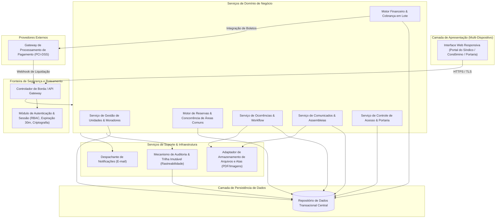
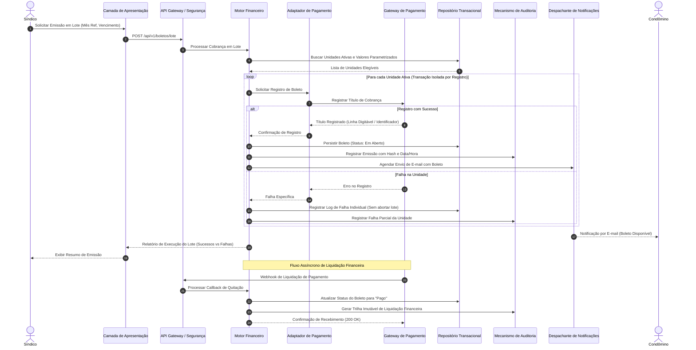
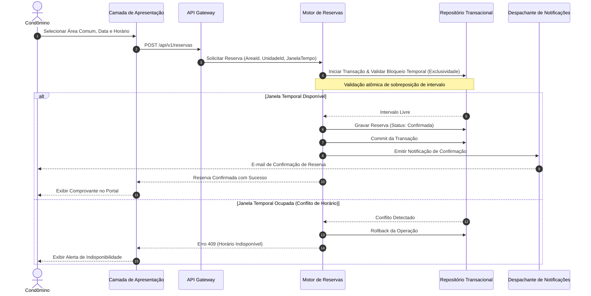

# Relatório Técnico de Arquitetura de Software

## 1. Identificação das HUs

A tabela a seguir consolida o mapeamento entre as Histórias de Usuário (HUs), atores envolvidos, escopo de negócio e os respectivos Requisitos Funcionais (RF) e Requisitos Não Funcionais (RNF) correlacionados.

| ID | Título | Ator | Descrição e Critérios Essenciais | Requisitos Vinculados |
| :--- | :--- | :--- | :--- | :--- |
| **HU01** | Cadastrar unidades e moradores | Síndico | Cadastro de unidades (bloco/número obrigatórios) e moradores (CPF único, nome, e-mail). Vínculo de múltiplos moradores por unidade e distinção entre proprietário/inquilino. | RF04, RF05, RF06, RF07, RF08, RNF04 |
| **HU02** | Emitir boletos em lote | Síndico | Emissão transacional de cobranças por mês de referência e vencimento para todas as unidades ativas. Disparo de e-mail e isolamento de falhas parciais. | RF09, RF10, RF13, RNF05, RNF11, RNF13 |
| **HU03** | Acompanhar inadimplências | Síndico | Painel analítico de boletos em aberto pós-vencimento, com filtros por bloco, período e faixa de atraso, além de exportação em formato tabular/CSV. | RF15, RNF08 |
| **HU04** | Publicar comunicados | Síndico | Publicação de informes com título, corpo e data; disparo síncrono/assíncrono de e-mails para a base de condôminos e fixação no topo do portal. | RF16, RF17, RNF13 |
| **HU05** | Gerenciar ocorrências | Síndico | Visualização, categorização, triagem e transição de estados de ocorrências com disparo de notificação ao solicitante a cada mudança de status. | RF23, RF24, RNF13 |
| **HU06** | Criar e registrar assembleias | Síndico | Agendamento de assembleias com notificação de pauta e registro posterior de ata com anexação de documentos digitais (PDF). | RF18, RF19, RNF13 |
| **HU07** | Gerenciar áreas comuns e reservas | Síndico | Parametrização de áreas comuns (regras, horários, prazos de antecedência/cancelamento), visão em calendário unificado e cancelamento administrativo. | RF25, RF28, RF29, RNF08 |
| **HU08** | Visualizar e pagar boleto pelo portal | Condômino | Consulta de histórico financeiro, visualização e download de título de cobrança, e baixa automática mediante confirmação de pagamento. | RF10, RF11, RF12, RF14, RNF03, RNF05 |
| **HU09** | Reservar área comum | Condômino | Validação de disponibilidade de data/horário em tempo real, bloqueio de sobreposição (exclusividade temporal) e emissão de comprovante por e-mail. | RF26, RF27, RF28, RNF07 |
| **HU10** | Registrar e acompanhar ocorrência | Condômino | Submissão de chamados (reclamações/sugestões) com categorização e anexos; rastreamento de histórico e notificações de atualização. | RF21, RF24, RNF09 |
| **HU11** | Pré-autorizar entrada de visitante | Condômino | Registro prévio de dados do visitante e data prevista, permitindo cancelamento prévio antes da efetivação do acesso. | RF31, RNF04 |
| **HU12** | Acompanhar assembleias e consultar atas | Condômino | Visualização de cronograma de assembleias futuras e download direto de atas registradas e documentos complementares em formato PDF. | RF20, RNF09, RNF10 |
| **HU13** | Registrar entrada e saída de visitantes | Funcionário | Registro de fluxo de portaria (nome, documento, unidade, horários), checagem de pré-autorizações e encerramento de estadias em aberto. | RF30, RF32, RF33, RNF06 |
| **HU14** | Consultar pré-autorizações de acesso | Funcionário | Consulta operacional das pré-autorizações do dia, permitindo busca por unidade ou nome e associação direta ao registro de entrada. | RF31, RF32, RNF06, RNF08 |

---

## 2. Diagramas de Arquitetura (Mermaid)

### 2.1. Visão Lógica de Componentes (Diagrama de Blocos Estruturais)

---

### 2.2. Diagrama de Sequência: Emissão e Processamento de Cobrança em Lote (HU02, HU08, RF10, RF11, RF12, RF13, RNF05, RNF11)

---

### 2.3. Diagrama de Sequência: Reserva de Áreas Comuns com Controle de Concorrência (HU07, HU09, RF26, RF27, RNF07, RNF08)

---

## 3. Decisões de Arquitetura

*   **ADR-01: Controle de Acesso Baseado em Perfis (RBAC) e Gestão de Sessão**
    *   *Contexto:* O sistema atende múltiplos perfis (Síndico, Condômino, Funcionário, Administrador) com privilégios estritos e necessidade de encerramento por inatividade (RNF01, RF01, RF02, RF03).
    *   *Decisão:* Implementar autorização via *Role-Based Access Control* centralizada na camada de borda, validando privilégios em cada requisição. A política de expiração de sessão exige renovação contínua de credenciais temporárias a cada interação, com invalidação forçada após 30 minutos de inatividade cronológica. O armazenamento de credenciais adotará funções de derivação de chave robustas com *salt* criptográfico conforme exigido por RNF02.
*   **ADR-02: Isolamento Transacional na Emissão de Boletos em Lote**
    *   *Contexto:* A emissão mensal envolve múltiplos registros externos e não pode ser interrompida por completo caso ocorra falha em uma única unidade (RNF11, HU02, RF13).
    *   *Decisão:* A geração de lote opera sob o padrão *Batch Step Isolation*, em que cada unidade é processada em sua própria sub-transação atômica. Caso o gateway externo ou a validação de dados falhe para a Unidade X, a falha é registrada em tabela de inconsistências do lote, consolidando o sucesso das demais unidades e emitindo relatório detalhado ao operador.
*   **ADR-03: Bloqueio Concorrencial para Reserva de Recursos Compartilhados**
    *   *Contexto:* Múltiplos condôminos podem tentar reservar a mesma área comum no mesmo instante temporal (RF27, HU09).
    *   *Decisão:* O motor de reservas implementa verificação atômica com bloqueio em nível de linha/intervalo temporal durante a transação de persistência. A regra de negócio garante que a consulta de sobreposição `(Inicio_Novo < Fim_Existente) AND (Fim_Novo > Inicio_Existente)` ocorra em bloco isolado, prevenindo condições de corrida (*Race Conditions*).
*   **ADR-04: Trilha de Auditoria Imutável (Append-Only) para Eventos Críticos**
    *   *Contexto:* Transações financeiras e registros de portaria exigem integridade comprobatória para auditoria e LGPD (RNF04, RNF05, RNF06, RNF13).
    *   *Decisão:* Todo evento classificado como crítico (financeiro, entrada/saída, alterações de ocorrência) dispara gravação síncrona em tabela de auditoria *Append-Only* (somente inserção), contendo carimbo temporal de precisão, identificador do usuário executor, operação e estado anterior/posterior, sem suporte a comandos de atualização ou deleção.
*   **ADR-05: Desacoplamento e Abstração do Gateway de Pagamento e Notificações**
    *   *Contexto:* O sistema não deve depender rigidamente de APIs de provedores específicos de pagamento ou envio de e-mails, respeitando PCI-DSS (RNF03, RF11).
    *   *Decisão:* Aplicação do padrão *Adapter/Port*, onde o núcleo de negócio interage com contratos abstratos de liquidação e notificação. Nenhum dado de cartão de crédito trafega ou reside no sistema; os pagamentos são baseados em emissão de boletos e confirmação assíncrona por *Webhooks* protegidos por autenticação mútua.

---

## 4. Tabela de Componentes e Rastreabilidade

| Componente | Responsabilidade Principal | Comunica-se com | Origem (HU / Critério de Aceite) |
| :--- | :--- | :--- | :--- |
| **Módulo de Autenticação & Autorização** | Gerenciar autenticação de credenciais, controle de sessões ativas com expiração de 30 min, criptografia de senhas e aplicação das políticas RBAC. | API Gateway, Repositório Central | HU01, HU08, HU13, RF01, RF02, RF03, RNF01, RNF02 |
| **Serviço de Gestão Cadastral** | Gerenciar o ciclo de vida de unidades habitacionais, proprietários, inquilinos, veículos e histórico de desativação lógica (soft delete). | Repositório Central, Motor de Auditoria | HU01, RF04, RF05, RF06, RF07, RF08, RNF04 |
| **Motor Financeiro & Cobrança** | Parametrizar taxas, orquestrar emissão unitária e em lote de boletos, registrar pagamentos manuais e gerar dados para o painel de inadimplência. | Adaptador de Pagamento, Repositório Central, Despachante de Notificações, Motor de Auditoria | HU02, HU03, HU08, RF09, RF10, RF12, RF13, RF14, RF15, RNF05, RNF08, RNF11 |
| **Adaptador de Gateway de Pagamento** | Abstrair a comunicação externa com o provedor bancário/pagamentos, formatar títulos de cobrança e tratar callbacks/webhooks de quitação. | Gateway Externo, Motor Financeiro, API Gateway | HU02, HU08, RF11, RF12, RNF03 |
| **Motor de Reservas de Espaços** | Parametrizar regras de uso, verificar disponibilidade de horários em tempo real, executar bloqueios atômicos contra sobreposição e gerenciar cancelamentos. | Repositório Central, Despachante de Notificações, Motor de Auditoria | HU07, HU09, RF25, RF26, RF27, RF28, RF29, RNF07, RNF08 |
| **Serviço de Ocorrências & Atendimento** | Registrar chamados de condôminos e funcionários, vincular evidências fotográficas, transicionar status de atendimento e registrar histórico. | Repositório Central, Armazenamento de Arquivos, Despachante de Notificações | HU05, HU10, RF21, RF22, RF23, RF24, RNF09, RNF13 |
| **Serviço de Comunicados & Assembleias** | Gerenciar informes aos moradores, agendamento de assembleias, publicação de pautas e custódia digital de atas e anexos em PDF. | Repositório Central, Armazenamento de Arquivos, Despachante de Notificações | HU04, HU06, HU12, RF16, RF17, RF18, RF19, RF20, RNF13 |
| **Serviço de Portaria & Acesso** | Gerenciar pré-autorizações emitidas por moradores, registrar entradas e saídas de visitantes e manter histórico de circulação por unidade. | Repositório Central, Motor de Auditoria | HU11, HU13, HU14, RF30, RF31, RF32, RF33, RNF04, RNF06 |
| **Despachante de Notificações** | Receber eventos assíncronos do domínio e despachar mensagens de e-mail (boletos, avisos de assembleia, status de chamados, comunicados). | Serviços de Domínio, Provedor de Mensagens Externo | HU02, HU04, HU05, HU06, HU09, HU10, RF17, RF24 |
| **Motor de Auditoria & Conformidade** | Assegurar a escrita em modo imutável de todas as ações sensíveis (financeiro, acessos, cadastros) garantindo rastreabilidade e suporte à LGPD. | Serviços de Domínio, Repositório Central | RNF04, RNF05, RNF06, RNF12, RNF13 |

---

## 5. Bloqueios e Pendências

1.  **Regra de Recálculo e Cancelamento de Boletos Vencidos:** O documento define a consulta a inadimplências (HU03) e exibição de boletos vencidos (HU08), mas não especifica a política de aplicação de juros, multas diárias ou se o condômino pode gerar uma segunda via atualizada diretamente no portal.
2.  **Operação de Contingência na Portaria em Falhas de Conectividade:** O RNF07 estipula 99,5% de disponibilidade para o portal, porém a portaria necessita de alta resiliência para o fluxo físico de visitantes (HU13). Não está definido se deve existir mecanismo de sincronização local/offline temporário para registro de acesso na portaria física em caso de queda de link de rede.
3.  **Regras de Limite de Reservas Concorrentes por Unidade:** A especificação impede sobreposição de reservas na mesma área (RF27), mas não restringe se uma mesma unidade pode monopolizar fins de semana consecutivos ou reservar múltiplas áreas distintas na mesma data.
4.  **Exclusão e Retenção de Dados Sensíveis de Visitantes (LGPD):** O RNF04 e RNF06 exigem conformidade LGPD e rastreabilidade de histórico de acessos. Faz-se necessária a definição formal do prazo de retenção (ciclo de expiração/anonimização) dos dados cadastrais de visitantes e documentos associados após o período de vigência de auditoria.

---

## 6. Cobertura de Requisitos

A matriz abaixo estabelece o mapeamento bidirecional completo entre todos os Requisitos (Funcionais e Não Funcionais), componentes arquiteturais e as estratégias de realização técnica adotadas.

| Requisito | Tipo | Componente Responsável | Estratégia de Realização Técnica |
| :--- | :--- | :--- | :--- |
| **RF01** | Funcional | Módulo de Autenticação | Cadastro unificado com segregação de papéis (*roles*) em esquema de identidade. |
| **RF02** | Funcional | Módulo de Autenticação / Gateway | Validação de escopo e permissões (*RBAC Guard*) em nível de rota e de serviço. |
| **RF03** | Funcional | Módulo de Autenticação | Controle de emissão e revogação de tokens de sessão com endpoint de *logout*. |
| **RF04** | Funcional | Gestão Cadastral | CRUD de unidades com verificação de unicidade da chave Bloco + Número. |
| **RF05** | Funcional | Gestão Cadastral | Vínculo estrutural 1:N entre Unidade e Moradores, validando unicidade de CPF. |
| **RF06** | Funcional | Gestão Cadastral | Flag tipificada (*enum*: Proprietário, Inquilino) associada ao relacionamento. |
| **RF07** | Funcional | Gestão Cadastral | Desativação lógica (*Soft Delete* / Flag de Ativo) preservando chaves estrangeiras. |
| **RF08** | Funcional | Gestão Cadastral | Entidade Veículo vinculada à Unidade com validação de formato de placa. |
| **RF09** | Funcional | Motor Financeiro | Tabela de parametrização de tarifas por unidade ou tipo de unidade. |
| **RF10** | Funcional | Motor Financeiro | Mecanismo de composição e emissão individual de cobrança com data de vencimento. |
| **RF11** | Funcional | Adaptador de Pagamento | Conector de integração com API de registro bancário de boletos. |
| **RF12** | Funcional | Motor Financeiro / Adaptador | Endpoint receptor de Webhook autenticado com transição automática de estado. |
| **RF13** | Funcional | Motor Financeiro | Processamento em lote particionado com isolamento de falha por unidade. |
| **RF14** | Funcional | Motor Financeiro | Interface administrativa para conciliação e baixa manual com trilha de auditoria. |
| **RF15** | Funcional | Motor Financeiro | Query indexada de inadimplentes agrupada por período, bloco e dias de atraso. |
| **RF16** | Funcional | Comunicados & Assembleias | Publicação com ordenação temporal e suporte à sinalização de fixação no topo. |
| **RF17** | Funcional | Despachante de Notificações | Evento de domínio disparado após criação de comunicado para envio em massa. |
| **RF18** | Funcional | Comunicados & Assembleias | Entidade de evento assemblear contendo data, local, pauta e lista de presença. |
| **RF19** | Funcional | Comunicados & Assembleias | Vínculo 1:1 entre Assembleia Concluída e Ata registrada com guarda documental. |
| **RF20** | Funcional | Comunicados & Assembleias | Interface de consulta pública aos condôminos autenticados com link de download. |
| **RF21** | Funcional | Ocorrências & Atendimento | Formulário de abertura de tickets vinculado ao usuário logado e sua unidade. |
| **RF22** | Funcional | Ocorrências & Atendimento | Módulo interno para reporte de manutenções e ocorrências de infraestrutura. |
| **RF23** | Funcional | Ocorrências & Atendimento | Máquina de estados finitos para o ticket: *Aberta -> Em Andamento -> Encerrada*. |
| **RF24** | Funcional | Despachante de Notificações | Gatilho acionado na transição de estado da ocorrência informando o autor. |
| **RF25** | Funcional | Motor de Reservas | Cadastro de áreas com parametrização de regras, limites e antecedência. |
| **RF26** | Funcional | Motor de Reservas | Seleção de data/slot com validação de elegibilidade e regras do espaço. |
| **RF27** | Funcional | Motor de Reservas | Bloqueio atômico de sobreposição de intervalo de datas durante a transação. |
| **RF28** | Funcional | Motor de Reservas | Checagem de janela limite parametrizada permitida para cancelamento sem ônus. |
| **RF29** | Funcional | Motor de Reservas | Visualização agregada de reservas em formato de matriz/calendário. |
| **RF30** | Funcional | Portaria & Acesso | Registro transacional de tráfego de pessoas (Check-in / Check-out). |
| **RF31** | Funcional | Portaria & Acesso | Registro antecipado de visitante pelo morador com escopo temporal definido. |
| **RF32** | Funcional | Portaria & Acesso | Painel operacional com filtro por dia corrente e busca rápida por unidade/nome. |
| **RF33** | Funcional | Portaria & Acesso | Consulta histórica indexada por ID de unidade e intervalo de datas. |
| **RNF01** | Não Funcional | Módulo de Autenticação | Middleware de checagem de inatividade (timeout após 30 min sem requests). |
| **RNF02** | Não Funcional | Módulo de Autenticação | Algoritmo de hash adaptativo (ex.: bcrypt com fator de custo calibrado). |
| **RNF03** | Não Funcional | Arquitetura Geral | Escopo limitado a boletos; ausência total de custódia de dados de cartão (PCI). |
| **RNF04** | Não Funcional | Motor de Auditoria / Cadastros | Tratamento restrito de dados pessoais, consentimento e registro de uso (LGPD). |
| **RNF05** | Não Funcional | Motor de Auditoria | Tabela de log financeiro *Append-Only* com carimbo de tempo e ID do executor. |
| **RNF06** | Não Funcional | Motor de Auditoria | Log estruturado e imutável de movimentação de visitantes na portaria. |
| **RNF07** | Não Funcional | Infraestrutura / Domínio | Arquitetura com separação em camadas stateless para garantia de alta disponibilidade. |
| **RNF08** | Não Funcional | Persistência / Serviços | Índices nos campos de busca e agregação (vencimentos, reservas) para resposta < 3s. |
| **RNF09** | Não Funcional | Camada de Apresentação | Design responsivo com layout adaptável para mobile e desktop. |
| **RNF10** | Não Funcional | Camada de Apresentação | Uso de padrões web canônicos compatíveis com navegadores modernos. |
| **RNF11** | Não Funcional | Motor Financeiro | Padrão *Batch Step Isolation* com transações atômicas independentes por unidade. |
| **RNF12** | Não Funcional | Infraestrutura de Persistência | Rotinas automatizadas de dump diário e políticas de retenção de 90 dias. |
| **RNF13** | Não Funcional | Motor de Auditoria | Registro centralizado de logs de eventos para operações críticas do sistema. |

---

## 7. Gap Analysis

| Lacuna Identificada | Impacto Arquitetural | Ação Recomendada |
| :--- | :--- | :--- |
| **1. Política de Expiração e Recálculo de Boleto Vencido** | Incerteza na geração de segunda via com acréscimo automático de encargos (multa/juros). Pode forçar intervenção manual constante do síndico. | Especificar no Motor Financeiro um calculador de encargos parametrizável e definir se o gateway suporta atualização inline da linha digitável. |
| **2. Mecanismo de Armazenamento e Limites de Anexos (PDFs e Fotos)** | Upload irrestrito de fotos em ocorrências e PDFs de atas pode comprometer o desempenho e a capacidade de armazenamento. | Estabelecer um adaptador de armazenamento de objetos dedicado, impondo restrições rígidas de tamanho (ex.: máx 5MB), formatos aceitos e compressão no envio. |
| **3. Tratamento de Exclusão e Anonimização de Dados (LGPD)** | Risco de não conformidade legal caso um ex-morador ou visitante solicite a revogação de dados pessoais, conflitando com a imutabilidade dos logs de auditoria. | Implementar estratégia de pseudo-anonimização nos dados cadastrais dos registros históricos, mantendo os registros de eventos de segurança vinculados a identificadores ofuscados. |
| **4. Comunicação de Falha no Despacho de E-mails** | Notificações de comunicados e boletos podem sofrer rejeição (bounces). A ausência de feedback pode deixar o morador desinformado. | Adicionar mecanismo de fila assíncrona com retentativas (*retry pattern*) e registrar o status de entrega do e-mail no painel de comunicados e boletos. |