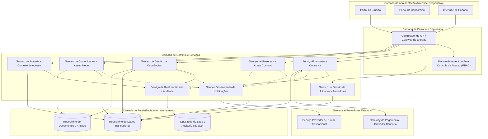
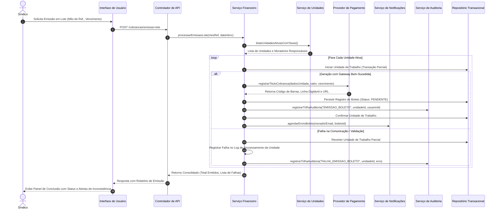
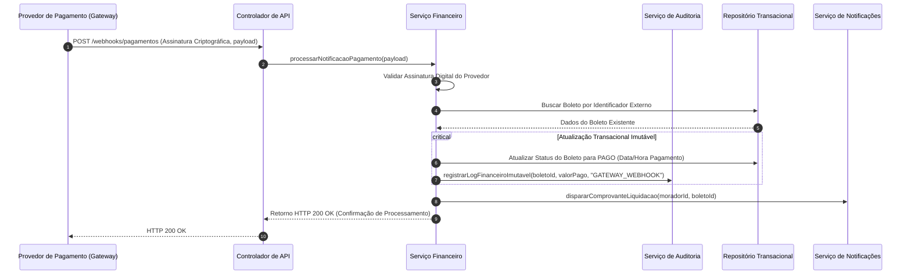

# Relatório Técnico de Arquitetura de Software

## 1. Identificação das HUs

A tabela a seguir consolida o mapeamento entre as Histórias de Usuário (HUs), seus perfis de atuação, objetivos de negócio, critérios de aceitação fundamentais e os requisitos funcionais (RF) e não funcionais (RNF) correlatos.

| ID | Perfil | Título / Objetivo | Critérios Chave de Aceite | Requisitos Rastreabilidade |
| :--- | :--- | :--- | :--- | :--- |
| **HU01** | Síndico | Cadastrar unidades e moradores | Validação de campos obrigatórios (bloco, número, CPF, nome, e-mail); unicidade de CPF; suporte a múltiplos moradores (proprietário/inquilino) por unidade; soft-delete para preservação de histórico. | RF04, RF05, RF06, RF07, RF08, RNF04 |
| **HU02** | Síndico | Emitir boletos em lote | Entrada de mês de referência e data de vencimento; geração individual por unidade ativa; emissão transacional resiliente a falhas parciais; envio assíncrono por e-mail com relatório de inconsistências. | RF09, RF10, RF13, RNF05, RNF11, RNF13 |
| **HU03** | Síndico | Acompanhar inadimplências | Painel consolidado com boletos vencidos em aberto; filtros por bloco, período e dias de atraso; exportação em CSV; tempo de resposta inferior a 3 segundos. | RF15, RNF05, RNF08 |
| **HU04** | Síndico | Publicar comunicados | Criação de informes com título, corpo e data; fixação no topo da interface; disparo imediato de notificações por e-mail a todos os condôminos. | RF16, RF17, RNF13 |
| **HU05** | Síndico | Gerenciar ocorrências | Visualização parametrizada por status, categoria e unidade; transição de estados do ciclo de vida; notificação reativa por e-mail ao autor. | RF23, RF24, RNF13 |
| **HU06** | Síndico | Criar e registrar assembleias | Agendamento com pauta, local e data; notificação prévia aos condôminos; registro e vinculação da ata com upload de anexos; consulta pública posterior. | RF18, RF19, RF20 |
| **HU07** | Síndico | Gerenciar áreas comuns e reservas | Parametrização de regras de uso, antecedência e horários; visualização global via calendário consolidado; cancelamento administrativo com alerta ao condômino. | RF25, RF28, RF29, RNF08 |
| **HU08** | Condômino | Visualizar e pagar boleto pelo portal | Listagem de títulos com status em tempo real; download do documento de cobrança; conciliação automática via webhook do gateway de pagamento ou baixa manual registrada. | RF10, RF11, RF12, RF14, RNF03, RNF05 |
| **HU09** | Condômino | Reservar área comum | Consulta de disponibilidade em tempo real; bloqueio estrito de sobreposição de horários; confirmação imediata e notificação por e-mail. | RF26, RF27, RF28, RNF08 |
| **HU10** | Condômino | Registrar e acompanhar ocorrência | Abertura de chamados com anexação de evidências; acompanhamento do histórico cronológico de status e atualizações. | RF21, RF24, RNF13 |
| **HU11** | Condômino | Pré-autorizar entrada de visitante | Cadastro prévio de visitantes esperados com data programada; disponibilização da autorização na portaria; possibilidade de cancelamento antes do ingresso. | RF31, RF32, RNF04, RNF06 |
| **HU12** | Condômino | Acompanhar assembleias e consultar atas | Exibição de assembleias futuras e disponibilização de atas e anexos em formato padrão para download. | RF20 |
| **HU13** | Funcionário | Registrar entrada e saída de visitantes | Validação de identificação física e unidade; detecção de pré-autorizações ativas; registro cronológico imutável com identificação do operador de portaria. | RF30, RF32, RF33, RNF04, RNF06, RNF13 |
| **HU14** | Funcionário | Consultar pré-autorizações de acesso | Consulta em tempo real de visitantes esperados com filtros por unidade e nome; vinculação direta entre o fluxo de autorização e o evento de entrada. | RF31, RF32, RNF06 |

---

## 2. Diagramas de Arquitetura (Mermaid)

### 2.1. Diagrama Estrutural de Componentes

O diagrama a seguir descreve a topologia lógica dos componentes do sistema, suas fronteiras de responsabilidade e pontos de integração externa.

---

### 2.2. Diagrama de Sequência: Emissão em Lote e Notificação de Boletos (HU02 / RF10 / RF13 / RNF11)

Este diagrama detalha o processo transacional resiliente de geração de boletos condominiais, integração com provedor financeiro externo e notificação assíncrona.

---

### 2.3. Diagrama de Sequência: Conciliação de Pagamento via Webhook (HU08 / RF11 / RF12 / RNF03 / RNF05)

Este diagrama representa a confirmação assíncrona de liquidação financeira e atualização de status.

---

## 3. Decisões de Arquitetura

### ADR-01: Isolamento de Domínios em Serviços Modulares e Baixo Acoplamento
* **Contexto:** O sistema gerencia aspectos distintos (financeiro, segurança patrimonial, controle social/comunicados, reservas físicas e governança de acesso).
* **Decisão:** Adoção de uma divisão em módulos de serviço desacoplados dentro da arquitetura de backend, com contratos de interface claros. As comunicações intermodulares críticas operam de forma direta via abstrações de serviço, enquanto operações transversais (notificações e auditoria) operam de forma desacoplada para isolar falhas de infraestrutura.
* **Consequências:** Alto desacoplamento, testabilidade facilitada e independência na manutenção de fluxos regulatórios (ex.: financeiro vs. portaria).

### ADR-02: Gestão de Identidade, Sessão e Controle de Acesso Baseado em Papéis (RBAC) (RNF01, RNF02)
* **Contexto:** Perfis heterogêneos (Síndico, Condômino, Funcionário, Administrador) operam o sistema sob exigência de encerramento automático após 30 minutos de inatividade e armazenamento de credenciais segundo padrões criptográficos robustos.
* **Decisão:** Implementação de um interceptor de segurança na camada de entrada com mecanismo de expiração de token de sessão/acesso por inatividade (timeout deslizante de 30 minutos). O armazenamento de senhas utilizará algoritmo de derivação de chave baseado em hash adaptativo com sal (`bcrypt`).
* **Consequências:** Garantia de conformidade de segurança e controle estrito de privilégios de acesso.

### ADR-03: Processamento em Lote com Transacionalidade Parcial e Resiliência (RNF11, RF13, HU02)
* **Contexto:** A geração mensal de boletos para centenas de unidades pode enfrentar indisponibilidades pontuais de validação ou de rede junto ao gateway. Uma falha numa unidade específica não pode anular ou corromper a emissão das demais.
* **Decisão:** Estratégia de *Unit of Work* com isolamento de transação a nível de registro individual dentro de um loop de controle em lote. O processo compila os sucessos e falhas em um relatório final sem abortar a rotina integral.
* **Consequências:** Atendimento ao requisito RNF11, mantendo a consistência da carteira de cobrança e dispensando intervenções de reexecução cega.

### ADR-04: Trilha de Auditoria Imutável para Ações Financeiras e Portaria (RNF05, RNF06, RNF13)
* **Contexto:** Operações de portaria (registro de visitantes) e movimentações financeiras (baixas manuais, geração de cobrança) exigem não-repúdio e rastreabilidade total.
* **Decisão:** Criação de um barramento/serviço central de auditoria que grava eventos em uma estrutura transacional de log que aceita apenas inserções (*append-only*), associando identificador do operador, unidade, carimbo de tempo (*timestamp*) e carga de dados da operação.
* **Consequências:** Auditoria fiscal e de segurança asseguradas sem impacto na performance das transações primárias de negócio.

### ADR-05: Proteção de Dados Pessoais (LGPD) e Conformidade com Meios de Pagamento (PCI-DSS) (RNF03, RNF04)
* **Contexto:** O sistema manipula dados pessoais sensíveis de moradores e visitantes, além de integrar com provedores financeiros.
* **Decisão:** O sistema não persistirá, em hipótese alguma, dados brutos de cartão de crédito/débito, transferindo a tokenização inteiramente ao Gateway de Pagamento. Para conformidade com LGPD, dados de visitantes e moradores inativos serão gerenciados sob retenção controlada e mecanismos de mascaramento/anonimização quando expirada a base legal.
* **Consequências:** Cumprimento rigoroso de RNF03 e RNF04, minimizando o raio de impacto em cenários de vazamento de dados.

### ADR-06: Mecanismo de Notificação Desacoplado do Ciclo de Requisição HTTP
* **Contexto:** Eventos como criação de assembleias, publicação de comunicados e mudanças de status de ocorrências requerem envio massivo de e-mails, o que degradaria os tempos de resposta se processados de forma síncrona.
* **Decisão:** O subsistema de notificações processará os disparos através de despachantes em background (*job workers*), retirando do ciclo de vida das requisições HTTP a latência de comunicação com provedores externos de mensageria.
* **Consequências:** Cumprimento dos limites de latência e proteção da experiência do usuário (RNF08).

---

## 4. Tabela de Componentes e Rastreabilidade

| Componente | Responsabilidade Principal | Comunica-se com | Origem (HU / Critério de Aceite) |
| :--- | :--- | :--- | :--- |
| **Controlador de API / Gateway de Entrada** | Ponto único de entrada, roteamento de requisições, controle de taxa e terminação de protocolos de rede seguros. | Módulo de Autenticação, Serviços de Domínio | RNF01, RNF07, RNF10 |
| **Módulo de Autenticação e RBAC** | Autenticação de credenciais com `bcrypt`, controle de sessões, expiração automática (30 min) e validação de permissões por perfil. | Controlador de API, Repositório Transacional | RF01, RF02, RF03, RNF01, RNF02 |
| **Serviço de Gestão de Unidades e Moradores** | Cadastro e manutenção de blocos, unidades, moradores (proprietário/inquilino), veículos e histórico desativado. | Repositório Transacional, Módulo de Autenticação | HU01, RF04, RF05, RF06, RF07, RF08, RNF04 |
| **Serviço Financeiro e Cobrança** | Cálculo de taxas, emissão individual e em lote de boletos, conciliação de pagamentos, registros de baixas manuais e painel de inadimplência. | Gateway de Pagamento, Repositório Transacional, Serviço de Auditoria, Serviço de Notificações | HU02, HU03, HU08, RF09, RF10, RF11, RF12, RF13, RF14, RF15, RNF03, RNF05, RNF08, RNF11 |
| **Adaptador de Gateway de Pagamento** | Encapsulamento da comunicação com o provedor financeiro, emissão de cobranças, recebimento e validação de webhooks. | Gateway de Pagamento Externo, Serviço Financeiro | RF11, RF12, RNF03 |
| **Serviço de Reservas e Áreas Comuns** | Gestão de espaços, validação de regras de antecedência/capacidade, prevenção de concorrência/sobreposição de horários e calendário. | Repositório Transacional, Serviço de Notificações | HU07, HU09, RF25, RF26, RF27, RF28, RF29, RNF08 |
| **Serviço de Gestão de Ocorrências** | Abertura de chamados por moradores/funcionários, atualização de ciclo de vida (aberta/em andamento/encerrada) e categorização. | Repositório de Documentos, Repositório Transacional, Serviço de Notificações, Serviço de Auditoria | HU05, HU10, RF21, RF22, RF23, RF24, RNF13 |
| **Serviço de Comunicados e Assembleias** | Publicação de avisos, convocação de assembleias, registro e distribuição de atas e documentos anexos. | Repositório Transacional, Repositório de Documentos, Serviço de Notificações | HU04, HU06, HU12, RF16, RF17, RF18, RF19, RF20 |
| **Serviço de Portaria e Controle de Acesso** | Registro de fluxo de entrada/saída de visitantes, gestão de pré-autorizações e disponibilização de histórico à portaria e síndico. | Repositório Transacional, Serviço de Auditoria | HU11, HU13, HU14, RF30, RF31, RF32, RF33, RNF04, RNF06 |
| **Serviço de Auditoria e Rastreabilidade** | Persistência append-only e estruturada de eventos sensíveis (financeiros, acessos físicos, mutações de chamados). | Repositório de Auditoria Imutável | RNF05, RNF06, RNF13 |
| **Serviço Desacoplado de Notificações** | Processamento assíncrono e despacho de e-mails transacionais (boletos, avisos, ocorrências, convocações). | Provedor de E-mail Externo | HU02, HU04, HU05, HU06, HU09, HU10, RF17, RF24 |
| **Camada de Apresentação (Web/Mobile Responsiva)** | Interface com o usuário adaptável para desktops e dispositivos móveis, aderente aos navegadores modernos. | Controlador de API | RNF08, RNF09, RNF10 |

---

## 5. Bloqueios e Pendências

1. **Definição de Política de Armazenamento de Arquivos e Mídias:**
   * *Pendência:* O sistema prevê upload de anexos de ocorrências (fotos) e atas de assembleias (PDFs), mas não há detalhamento sobre cotas de armazenamento por condomínio nem políticas de retenção/compressão de imagens.
2. **Tratamento de Concorrência em Reservas Simultâneas:**
   * *Pendência:* Para assegurar o cumprimento de RF27 em ambientes com múltiplos nós, é mandatória a especificação do mecanismo abstrato de isolamento transacional (*pessimistic locking* ou verificação serializável de intervalos) para impedir condições de corrida no exato milissegundo de reserva simultânea por condôminos distintos.
3. **Mapeamento do Fluxo de Baixa Manual e Conciliação Bancária:**
   * *Pendência:* A especificação de RF14 prevê registro de pagamentos fora da plataforma (ex.: transferências diretas), porém não detalha se deve exigir anexação de comprovante bancário ou fluxo de aprovação dupla para mitigar riscos de fraude interna.
4. **Ciclo de Vida e Retenção de Dados de Visitantes (LGPD):**
   * *Pendência:* A coleta de documento e nome de visitantes (RF30) carece de especificação quanto ao prazo legal de retenção após o término da visita e rotina de expurgo automático/anonimização periódica.

---

## 6. Cobertura de Requisitos

A matriz abaixo comprova o atendimento integral de todos os Requisitos Funcionais e Não Funcionais pelo design arquitetural proposto:

| Requisito | Tipo | Componente(s) Responsável(is) | Estratégia de Atendimento |
| :--- | :--- | :--- | :--- |
| **RF01** | Funcional | Módulo de Autenticação / Svc. Unidades | Cadastro parametrizado de credenciais com atributos de perfil (Síndico, Condômino, Funcionário, Administrador). |
| **RF02** | Funcional | Controlador de API / Módulo de Autenticação | Interceptor de segurança validando tokens e privilégios conforme a rota de execução (RBAC). |
| **RF03** | Funcional | Módulo de Autenticação | Endpoints dedicados para login e revogação de tokens de sessão no encerramento (logout). |
| **RF04** | Funcional | Svc. Unidades e Moradores | Módulo de gerenciamento com suporte à estrutura hierárquica (bloco, número, tipo). |
| **RF05** | Funcional | Svc. Unidades e Moradores | Vínculo relacional entre entidade de Morador e Unidade, com checagem de unicidade de CPF. |
| **RF06** | Funcional | Svc. Unidades e Moradores | Campo discriminador de papel na unidade (proprietário vs. inquilino). |
| **RF07** | Funcional | Svc. Unidades e Moradores | Mecanismo de exclusão lógica (*soft-delete*) mantendo a integridade referencial histórica. |
| **RF08** | Funcional | Svc. Unidades e Moradores | Cadastro de veículos subordinado à unidade imobiliária cadastrada. |
| **RF09** | Funcional | Svc. Financeiro e Cobrança | Parametrização dinâmica da tabela de taxas condominiais por unidade/categoria. |
| **RF10** | Funcional | Svc. Financeiro / Adaptador Gateway | Rotina de emissão de título com definição de datas de vencimento e valores. |
| **RF11** | Funcional | Adaptador Gateway de Pagamento | Integração via chamadas de API com gateways homologados para liquidação de títulos. |
| **RF12** | Funcional | Svc. Financeiro / Adaptador Gateway | Endpoint de webhook para recepção de liquidação financeira e baixa automática. |
| **RF13** | Funcional | Svc. Financeiro | Processamento em lote com isolamento transacional por unidade (*Unit of Work*). |
| **RF14** | Funcional | Svc. Financeiro / Svc. Auditoria | Endpoint para registro de baixa manual com trilha de auditoria atrelada ao usuário operador. |
| **RF15** | Funcional | Svc. Financeiro | Mecanismo de consulta indexada por períodos e status de vencimento para alimentação do dashboard. |
| **RF16** | Funcional | Svc. Comunicados e Assembleias | Módulo de publicação de informativos com priorização de exibição (fixação). |
| **RF17** | Funcional | Svc. Notificações | Despacho assíncrono de e-mails para a lista de moradores ativos da base. |
| **RF18** | Funcional | Svc. Comunicados e Assembleias | Entidade de Assembleia contendo local, pauta, horário e gatilho de notificação. |
| **RF19** | Funcional | Svc. Comunicados / Repositório Documentos | Associação de documento digital de ata à assembleia correspondente previamente cadastrada. |
| **RF20** | Funcional | Svc. Comunicados e Assembleias | Interface e serviços de consulta a assembleias ativas e download de atas históricas. |
| **RF21** | Funcional | Svc. Ocorrências | Interface de autosserviço com upload de fotos e abertura de tíquetes. |
| **RF22** | Funcional | Svc. Ocorrências | Canal interno de abertura de chamados restrito ao perfil de funcionários. |
| **RF23** | Funcional | Svc. Ocorrências | Painel de controle do síndico para categorização e transição de estados de chamados. |
| **RF24** | Funcional | Svc. Notificações / Svc. Ocorrências | Disparo de e-mail ao autor a cada mutação de estado no ciclo da ocorrência. |
| **RF25** | Funcional | Svc. Reservas e Áreas Comuns | Parametrização de regras de capacidade, horários permitidos e prazos de antecedência. |
| **RF26** | Funcional | Svc. Reservas e Áreas Comuns | Motor de agendamento por condômino com validação de janelas livres. |
| **RF27** | Funcional | Svc. Reservas e Áreas Comuns | Validação atômica de sobreposição de intervalo de datas/horários para o mesmo recurso físico. |
| **RF28** | Funcional | Svc. Reservas e Áreas Comuns | Cancelamento de agendamento validando limites de tempo pré-estabelecidos. |
| **RF29** | Funcional | Svc. Reservas e Áreas Comuns | Visão matricial consolidada de calendário com carregamento otimizado. |
| **RF30** | Funcional | Svc. Portaria e Controle de Acesso | Interface de portaria com captura de dados de visitantes e registro de timestamp de entrada/saída. |
| **RF31** | Funcional | Svc. Portaria / UI Condômino | Módulo para o morador cadastrar agendamento de visitas futuras. |
| **RF32** | Funcional | Svc. Portaria e Controle de Acesso | Visão do dia na portaria destacando visitantes com pré-autorização ativa para liberação ágil. |
| **RF33** | Funcional | Svc. Portaria / Svc. Auditoria | Consulta histórica de acessos físicos com filtros por unidade e intervalo de datas. |
| **RNF01** | Não Funcional | Módulo de Autenticação | Controle de inatividade com revogação automática de sessões após 30 minutos. |
| **RNF02** | Não Funcional | Módulo de Autenticação | Hash criptográfico adaptativo (`bcrypt`) para segurança de armazenamento de senhas. |
| **RNF03** | Não Funcional | Adaptador Gateway de Pagamento | Diretrizes PCI-DSS: desvio de dados de cartão diretamente para o gateway sem persistência local. |
| **RNF04** | Não Funcional | Toda a Arquitetura | Políticas de tratamento e proteção de dados pessoais em conformidade com a LGPD. |
| **RNF05** | Não Funcional | Svc. Auditoria / Svc. Financeiro | Registros imutáveis (*append-only*) para todas as movimentações financeiras. |
| **RNF06** | Não Funcional | Svc. Auditoria / Svc. Portaria | Registro auditável imutável de fluxo de portaria com identificação do operador. |
| **RNF07** | Não Funcional | Infraestrutura e Arquitetura | Arquitetura desacoplada e modular projetada para operar em alta disponibilidade (meta 99,5%). |
| **RNF08** | Não Funcional | Svc. Financeiro / Svc. Reservas | Consultas indexadas e paginação para assegurar carregamento inferior a 3 segundos. |
| **RNF09** | Não Funcional | Camada de Apresentação | Design responsivo para atendimento a interfaces móveis e computadores de mesa. |
| **RNF10** | Não Funcional | Camada de Apresentação | Compatibilidade ampla com motores dos principais navegadores web modernos. |
| **RNF11** | Não Funcional | Svc. Financeiro | Processamento em lote particionado e transacional com tolerância a falhas parciais. |
| **RNF12** | Não Funcional | Estratégia de Persistência | Políticas diárias de backup automatizado e retenção estruturada mínima por 90 dias. |
| **RNF13** | Não Funcional | Svc. Auditoria e Logs | Barramento de auditoria registrando sistematicamente eventos críticos do sistema. |

---

## 7. Gap Analysis

| Lacuna de Especificação Identificada | Impacto Arquitetural | Ação Recomendada para o Time de Engenharia |
| :--- | :--- | :--- |
| **1. Política de Inadimplência vs. Bloqueio de Reservas:** Os requisitos não especificam se um morador inadimplente pode reservar áreas comuns. | Pode permitir que moradores com pendências financeiras graves continuem reservando áreas nobres sem controle do síndico. | Incluir nas regras de negócio do `Serviço de Reservas` um parâmetro configurável pelo síndico que permita checar a regularidade financeira antes de confirmar o agendamento (HU09/RF26). |
| **2. Tratamento de Arquivos Grandes e Varredura de Segurança:** Não há regras para limite de tamanho e validação de tipo de arquivos em atas (HU06) e fotos de ocorrências (HU10). | Risco de esgotamento de armazenamento e potenciais vulnerabilidades de upload de arquivos maliciosos. | Especificar limites de payload (ex.: máx. 5MB por anexo), extensão restrita (PDF, PNG, JPEG) e camada de escaneamento de arquivos antes de persistir no Repositório de Documentos. |
| **3. Idempotência em Notificações de Webhook do Gateway:** Falta detalhamento sobre como lidar com reenvios repetidos de confirmação de pagamento pelo gateway (RF11/RF12). | Risco de duplicação de lançamentos financeiros ou reprocessamento desnecessário de rotinas de baixa. | Implementar uma tabela de idempotência na camada de entrada financeira (`chave_evento_gateway`), garantindo que o mesmo evento não seja processado mais de uma vez. |
| **4. Estratégia de Expiração de Pré-Autorizações de Visitantes:** Não há regra sobre o destino de pré-autorizações não utilizadas na data prevista (HU11/HU14). | Acúmulo de registros pendentes na visualização de portaria, induzindo o operador a erros de triagem. | Implementar rotina de expiração automática que marque pré-autorizações como expiradas caso o visitante não dê entrada até as 23h59 da data agendada. |