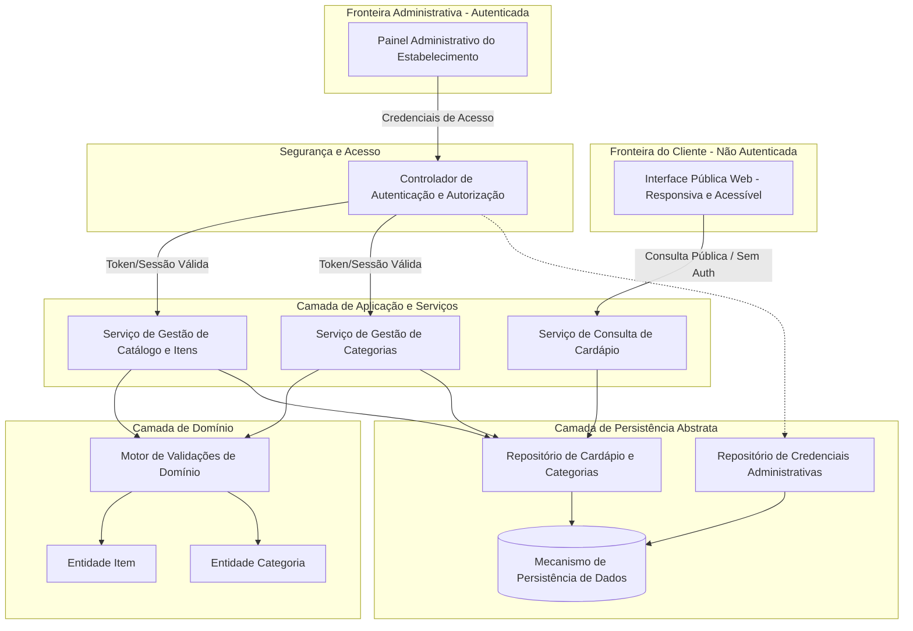
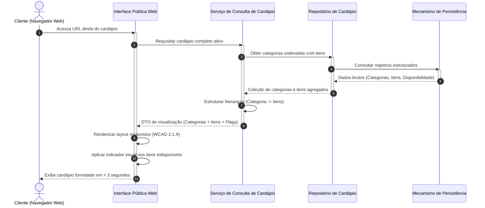
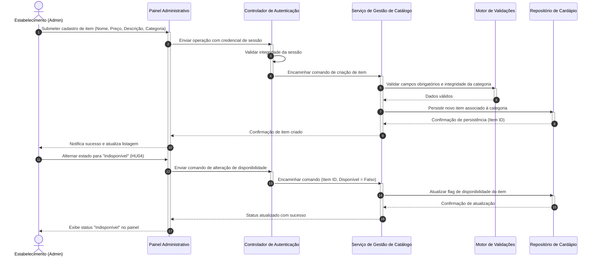
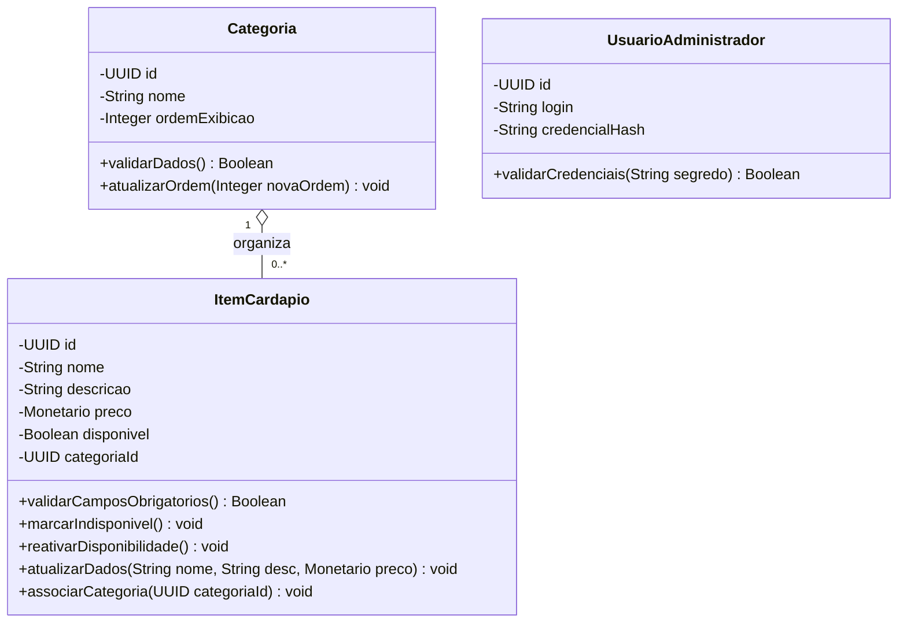

# Relatório Técnico de Arquitetura de Software

## 1. Identificação das HUs

A tabela a seguir consolida as Histórias de Usuário (HUs) mapeadas a partir dos requisitos de negócio e técnicos, identificando os atores, escopo e requisitos correlacionados.

| HU ID | Título | Ator | Escopo Funcional | Requisitos Correlacionados |
|---|---|---|---|---|
| **HU01** | Cadastrar item no cardápio | Estabelecimento (Admin) | Validação e criação de itens com nome, descrição e preço. | RF01, RF11, RNF03, RNF05 |
| **HU02** | Organizar itens por categoria | Estabelecimento (Admin) | Criação, gestão de ordenação e vinculação exclusiva de itens a categorias. | RF04, RF05, RNF03, RNF05 |
| **HU03** | Editar item do cardápio | Estabelecimento (Admin) | Atualização de dados cadastrais (nome, descrição, preço, categoria). | RF02, RF11, RNF03, RNF05 |
| **HU04** | Marcar item como indisponível | Estabelecimento (Admin) | Alternância de estado de disponibilidade do item sem exclusão. | RF06, RF07, RNF03, RNF05 |
| **HU05** | Remover item do cardápio | Estabelecimento (Admin) | Exclusão lógica/física de item com solicitação de confirmação prévia. | RF03, RNF03, RNF05 |
| **HU06** | Visualizar cardápio sem cadastro | Cliente (Público) | Acesso direto via web sem necessidade de credenciais ou login. | RF08, RNF01, RNF02, RNF04, RNF06, RNF07 |
| **HU07** | Navegar por categorias | Cliente (Público) | Visualização estruturada e agrupada dos itens por categorias ordenadas. | RF09, RF11, RNF01, RNF02, RNF06, RNF07 |
| **HU08** | Identificar itens indisponíveis | Cliente (Público) | Sinalização visual explícita de itens marcados como indisponíveis. | RF10, RF11, RNF01, RNF06, RNF07 |

---

## 2. Diagramas de Arquitetura (Mermaid)

### 2.1. Visão Geral de Componentes da Arquitetura

O diagrama abaixo ilustra a segregação de responsabilidades em camadas lógicas conceituais, dividindo a fronteira pública da fronteira administrativa autenticada.

---

### 2.2. Diagrama de Sequência: Consulta Pública do Cardápio (HU06, HU07, HU08)

Fluxo demonstrando o acesso sem autenticação com agrupamento por categorias e identificação visual de itens indisponíveis.

---

### 2.3. Diagrama de Sequência: Gestão e Disponibilidade de Item (HU01, HU04)

Fluxo administrativo protegido demonstrando validação, criação e alteração de status de disponibilidade de um item.

---

### 2.4. Diagrama de Classes Conceitual do Domínio

---

## 3. Decisões de Arquitetura

1. **Separação Rígida de Contextos (Público vs. Administrativo)**:
   - **Contexto Público (Leitura Livre)**: Otimizado para alta vazão, latência reduzida e tolerância a falhas. Não realiza mutação de estado e dispensa autenticação, assegurando o cumprimento de RF08, RNF02 e RNF04.
   - **Contexto Administrativo (Escrita e Manutenção)**: Protegido obrigatoriamente por camada de controle de acesso (RNF03), com regras transacionais e validações de integridade estrutural.

2. **Abordagem de Leitura Otimizada para o Cardápio Público**:
   - A visualização do cliente exige consultas agregadas (Categorias + Itens). A camada de persistência deve disponibilizar contratos de recuperação em lote para evitar o problema de múltiplas requisições sequenciais (*N+1 queries*), garantindo a meta de tempo de carregamento inferior a 3 segundos (RNF02).

3. **Ciclo de Vida e Estado dos Itens (Exclusão Lógica vs. Indisponibilidade)**:
   - **Indisponibilidade (RF06, RF07, HU04)**: O item permanece persistido e referenciado à categoria, preservando a ordenação e metadados, mas recebe sinalização visual específica na apresentação.
   - **Exclusão (RF03, HU05)**: Exige fluxo de confirmação explícita para evitar exclusões acidentais de catálogo.

4. **Princípio da Neutralidade de Apresentação e Acessibilidade**:
   - A interface do cliente deve ser desacoplada da camada de dados por meio de contratos claros (DTOs), permitindo renderização semântica (HTML estruturado) compatível com normas de acessibilidade WCAG 2.1 nível A (RNF07) e responsividade para dispositivos móveis e desktops (RNF01, RNF06).

---

## 4. Tabela de Componentes e Rastreabilidade

| Componente | Responsabilidade Principal | Comunica-se com | Origem (HU / Critério de Aceite) |
|---|---|---|---|
| **Interface Pública Web** | Apresentação responsiva, sem autenticação, com renderização de itens por categoria e sinalização de indisponibilidade acessível. | Serviço de Consulta de Cardápio | HU06, HU07, HU08, RF08, RF09, RF10, RF11, RNF01, RNF06, RNF07 |
| **Painel Administrativo** | Interface de gestão protegida para CRUD de categorias, itens e alteração de disponibilidade. | Controlador de Autenticação e Autorização | HU01, HU02, HU03, HU04, HU05, RF01-RF07, RNF03 |
| **Controlador de Autenticação** | Validação de credenciais de acesso, gerenciamento de sessões administrativas e bloqueio de acessos não autorizados. | Painel Administrativo, Repositório de Credenciais, Serviços de Gestão | RNF03 |
| **Serviço de Consulta de Cardápio** | Agregação e orquestração de dados públicos (categorias ordenadas e itens) com estratégia para baixa latência. | Repositório de Cardápio e Categorias | HU06, HU07, HU08, RF08, RF09, RF10, RF11, RNF02, RNF04 |
| **Serviço de Gestão de Catálogo** | Execução de regras de negócio para cadastro, edição, exclusão e alteração de disponibilidade de itens. | Motor de Validações, Repositório de Cardápio e Categorias | HU01, HU03, HU04, HU05, RF01, RF02, RF03, RF06, RF07, RNF05 |
| **Serviço de Gestão de Categorias** | Gerenciamento de criação, edição, remoção e ordenação de categorias de itens. | Motor de Validações, Repositório de Cardápio e Categorias | HU02, RF04, RF05, RNF05 |
| **Motor de Validações de Domínio** | Garantia das invariantes: obrigatoriedade de campos (nome, preço), unicidade e integridade relacional. | Entidade Item, Entidade Categoria | HU01 (Critério 1), HU02 (Critério 2), HU03, RNF05 |
| **Repositório de Cardápio e Categorias** | Abstração de acesso aos dados persistidos de itens e categorias. | Mecanismo de Persistência de Dados | RF01-RF11, RNF02, RNF05 |
| **Repositório de Credenciais** | Abstração de consulta e persistência de dados de autenticação de administradores. | Mecanismo de Persistência de Dados | RNF03 |

---

## 5. Bloqueios e Pendências

1. **Regra de Exclusão de Categoria com Itens Vinculados (Bloqueio Conceitual)**:
   - *Descrição*: O requisito RF04 permite a remoção de categorias, porém não explicita o comportamento esperado para os itens associados (se devem ser excluídos em cascata, movidos para uma categoria padrão "Geral/Sem Categoria" ou se a exclusão da categoria deve ser bloqueada).
   - *Impacto*: Risco de inconsistência relacional ou perda acidental de dados de itens cadastrados.

2. **Controle de Concorrência Administrativa (Pendência)**:
   - *Descrição*: Não há especificação sobre múltiplos operadores administrativos alterando o cardápio ou status de disponibilidade concorrentemente.
   - *Impacto*: Possibilidade de sobreposição acidental de alterações de preços ou status.

3. **Mecanismo de Suporte a Imagens e Mídia (Pendência de Escopo)**:
   - *Descrição*: Os requisitos RF01 e RF11 delimitam itens a "nome, descrição e preço", sem menção a fotografias. É necessário validar se fotos de produtos farão parte de versões futuras para antecipar abstração de armazenamento de objetos binários.

---

## 6. Cobertura de Requisitos

A matriz abaixo comprova a total cobertura dos Requisitos Funcionais (RF) e Não Funcionais (RNF) pelos componentes da arquitetura.

| Requisito | Tipo | Componente(s) Responsável(is) | Mecanismo de Atendimento |
|---|---|---|---|
| **RF01** | Funcional | Serviço de Gestão de Catálogo, Motor de Validações | Validação de obrigatoriedade (nome, preço) e persistência do item. |
| **RF02** | Funcional | Serviço de Gestão de Catálogo, Repositório | Atualização transacional dos atributos do item. |
| **RF03** | Funcional | Painel Admin, Serviço de Gestão de Catálogo | Diálogo de confirmação de exclusão e remoção lógica/física. |
| **RF04** | Funcional | Serviço de Gestão de Categorias, Repositório | Manutenção de ciclo de vida e ordenação de categorias. |
| **RF05** | Funcional | Serviço de Gestão de Catálogo, Motor de Validações | Vínculo unidirecional estrito do item a uma única categoria. |
| **RF06** | Funcional | Serviço de Gestão de Catálogo | Alteração do atributo `disponivel` para `falso` sem exclusão. |
| **RF07** | Funcional | Serviço de Gestão de Catálogo | Alteração do atributo `disponivel` para `verdadeiro`. |
| **RF08** | Funcional | Interface Pública Web, Serviço de Consulta | Rota pública sem passagem por interceptadores de autenticação. |
| **RF09** | Funcional | Interface Pública Web, Serviço de Consulta | Resposta com agregação estruturada de itens sob categorias. |
| **RF10** | Funcional | Interface Pública Web | Aplicação de estilos/labels visuais indicando indisponibilidade. |
| **RF11** | Funcional | Interface Pública Web, Serviço de Consulta | Exposição completa dos atributos públicos (nome, desc, preço). |
| **RNF01** | Não Funcional | Interface Pública Web | Design responsivo adaptável a múltiplos viewports (mobile/desktop). |
| **RNF02** | Não Funcional | Serviço de Consulta, Repositório | Consultas otimizadas/agregadas para resposta em < 3 segundos. |
| **RNF03** | Não Funcional | Controlador de Autenticação | Proteção de rotas administrativas com verificação de credenciais. |
| **RNF04** | Não Funcional | Arquitetura Geral Desacoplada | Isolamento da camada pública para manter leitura operacional contínua. |
| **RNF05** | Não Funcional | Toda a Arquitetura | Separação em camadas lógicas e desacoplamento via repositórios. |
| **RNF06** | Não Funcional | Interface Pública Web | Utilização de padrões web compatíveis com navegadores modernos. |
| **RNF07** | Não Funcional | Interface Pública Web | Semântica visual, contraste e padrões WCAG 2.1 nível A. |

---

## 7. Gap Analysis

A análise a seguir identifica as lacunas entre os requisitos fornecidos e os requisitos arquiteturais operacionais recomendados para implementação sustentável.

| Item | Lacuna Identificada | Impacto Arquitetural | Ação Recomendada |
|---|---|---|---|
| **GAP-01** | **Comportamento de Categoria Órfã**: Inexistência de regra para exclusão de categorias contendo itens vinculados. | Risco de integridade referencial ou ocultação acidental de itens no cardápio público. | Adotar a regra de **bloqueio de exclusão** caso a categoria possua itens associados, exigindo desvinculação prévia pelo usuário administrador. |
| **GAP-02** | **Granularidade de Ordenação**: HU02 exige controle de ordem das categorias, mas não especifica ordenação manual de itens dentro de cada categoria. | Possibilidade de listagem não determinística dos itens na visualização do cliente. | Incluir atributo conceitual `ordemExibicao` também na entidade `ItemCardapio` para assegurar controle determinístico da exibição. |
| **GAP-03** | **Estratégia de Cache e Invalidacão**: RNF02 (<3s) e RNF04 (99% 24/7) demandam alta eficiência em leitura, mas HU01/HU03 exigem atualização imediata. | Se implementado cache sem estratégia de purga, atualizações administrativas não aparecerão imediatamente aos clientes. | Estabelecer gatilho de invalidação automática de cache na camada de serviço de catálogo sempre que ocorrer alteração em itens ou categorias. |
| **GAP-04** | **Políticas de Acessibilidade (WCAG 2.1 A)**: RNF07 exige nível A, o que demanda requisitos claros sobre contraste para itens indisponíveis. | Redução de opacidade simples em itens indisponíveis (citada na HU08) pode violar os critérios de taxa de contraste mínimo exigidos pela WCAG. | Adotar explicitamente rótulos textuais e ícones acessíveis (ex.: badge textual "Indisponível") em conjunto com variações visuais, sem depender unicamente de contraste reduzido. |