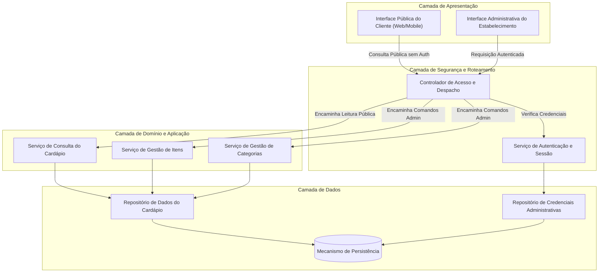
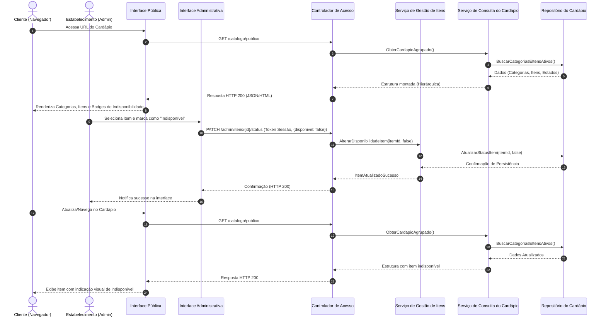
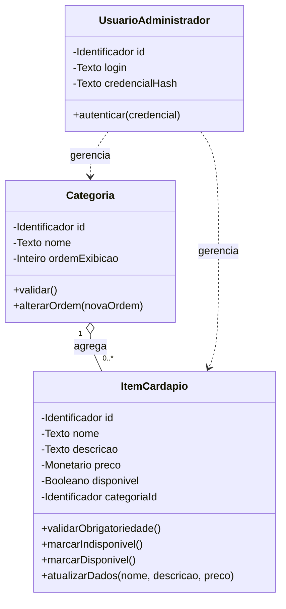

# Relatório Técnico de Arquitetura de Software

## 1. Identificação das HUs

| Identificador | Título | Perfil | Resumo do Escopo |
| :--- | :--- | :--- | :--- |
| **HU01** | Cadastrar item no cardápio | Estabelecimento (Admin) | Validação de campos obrigatórios (nome, preço), persistência e disponibilização imediata do item. |
| **HU02** | Organizar itens por categoria | Estabelecimento (Admin) | Criação de categorias, controle de ordenação e associação unívoca de itens a categorias. |
| **HU03** | Editar item do cardápio | Estabelecimento (Admin) | Atualização cadastral dos atributos de itens com propagação imediata para a visualização pública. |
| **HU04** | Marcar item como indisponível | Estabelecimento (Admin) | Alternância de estado operacional do item sem remoção da listagem pública. |
| **HU05** | Remover item do cardápio | Estabelecimento (Admin) | Exclusão de itens do catálogo público com fluxo de confirmação prévia. |
| **HU06** | Visualizar cardápio sem cadastro | Cliente | Acesso direto e público via navegador, otimizado para dispositivos móveis e desktops. |
| **HU07** | Navegar pelo cardápio por categorias | Cliente | Renderização estruturada e agrupada de itens conforme a taxonomia e ordenação definida. |
| **HU08** | Identificar itens indisponíveis | Cliente | Sinalização visual explícita de itens marcados como indisponíveis mantendo a integridade da lista. |

---

## 2. Diagramas de Arquitetura (Mermaid)

### 2.1. Diagrama de Componentes (Visão Estrutural)



### 2.2. Diagrama de Sequência: Consulta Pública e Atualização de Disponibilidade



### 2.3. Diagrama de Modelo de Domínio



---

## 3. Decisões de Arquitetura

* **DA01 — Segregação de Contextos de Acesso (Público vs. Administrativo):**
  * *Contexto:* O sistema possui dois perfis operacionais com requisitos de segurança opostos: clientes com acesso livre e anônimo (RF08, HU06) e administradores com acesso restrito (RNF03, HU01-HU05).
  * *Decisão:* Separação arquitetural entre a borda de consumo público (sem exigência de identificação de sessão) e a borda administrativa protegida por barreiras de autenticação centralizada no controlador de entrada.

* **DA02 — Estruturação Hierárquica em Tempo de Consulta (Taxonomia Categorizada):**
  * *Contexto:* Os requisitos RF09, HU02 e HU07 exigem que os itens sejam exibidos agrupados por categoria e respeitem uma ordem customizável.
  * *Decisão:* O *Serviço de Consulta do Cardápio* encapsula a composição hierárquica `Categoria -> Lista[Item]`, garantindo que o cliente receba uma árvore de dados estruturada, minimizando o processamento no cliente e atendendo ao limite de tempo de resposta (RNF02).

* **DA03 — Preservação de Visibilidade para Itens Indisponíveis (State Flag Pattern):**
  * *Contexto:* Os requisitos RF06, RF10, HU04 e HU08 exigem que itens indisponíveis continuem no cardápio, porém destacados visualmente.
  * *Decisão:* A indisponibilidade é modelada como um atributo booleano de estado (`disponivel`), e não como remoção lógica ou física do catálogo. Itens indisponíveis são retornados no fluxo de leitura pública com essa sinalização expressa.

* **DA04 — Modularidade e Isolamento de Responsabilidades:**
  * *Contexto:* Atendimento direto ao requisito de manutenibilidade (RNF05).
  * *Decisão:* Isolamento do sistema em módulos desacoplados (Apresentação, Domínio/Negócio, Persistência), permitindo evolução independente dos mecanismos de persistência e interfaces sem afetar as regras de validação.

---

## 4. Tabela de Componentes e Rastreabilidade

| Componente | Responsabilidade Principal | Comunica-se com | Origem (HU / Critério de Aceite) |
| :--- | :--- | :--- | :--- |
| **Interface Pública do Cliente** | Renderização responsiva, acessível (WCAG) e anônima do cardápio agrupado por categoria e indicação visual de indisponibilidade. | Controlador de Acesso e Despacho | HU06 (CA1, CA2), HU07 (CA1, CA2), HU08 (CA1, CA2), RNF01, RNF06, RNF07 |
| **Interface Administrativa** | Interface protegida para operações de CRUD de itens/categorias, ordenação e alternância de disponibilidade com confirmações de exclusão. | Controlador de Acesso e Despacho | HU01 (CA1), HU02 (CA1, CA3), HU03 (CA2), HU04 (CA2), HU05 (CA1), RNF03 |
| **Controlador de Acesso e Despacho** | Roteamento de requisições, aplicação de políticas de autenticação para rotas restritas e exposição livre de rotas de leitura. | Serviço de Autenticação, Serviço de Consulta, Serviços de Gestão | RF08, RNF03, HU06 (CA1) |
| **Serviço de Autenticação e Sessão** | Validação de credenciais de administradores e gestão do ciclo de vida da sessão. | Repositório de Credenciais Administrativas | RNF03 |
| **Serviço de Consulta do Cardápio** | Agregação e formatação eficiente da taxonomia de categorias ordenadas e itens para visualização rápida. | Repositório de Cardápio | RF08, RF09, RF10, RF11, RNF02, HU06, HU07, HU08 |
| **Serviço de Gestão de Itens** | Validação de regras de negócio (campos obrigatórios, unicidade de categoria), criação, edição, remoção e alternância de estado de disponibilidade. | Repositório de Cardápio | RF01, RF02, RF03, RF05, RF06, RF07, HU01 (CA1, CA2), HU03 (CA1), HU04 (CA1), HU05 (CA2) |
| **Serviço de Gestão de Categorias** | Gestão do ciclo de vida de categorias e manipulação da ordenação de exibição. | Repositório de Cardápio | RF04, HU02 (CA1, CA3) |
| **Repositório de Cardápio** | Abstração de persistência e recuperação das entidades Categoria e Item do Cardápio. | Mecanismo de Persistência | RF01 a RF07, RNF04, RNF05 |

---

## 5. Bloqueios e Pendências

1. **Mecanismo de Reordenação de Categorias (HU02 / RF04):** A especificação estabelece que a ordem deve ser "controlável pelo estabelecimento", mas não define se a ordenação é feita via índice numérico manual, interface de arrastar-e-soltar ou chave de precedência. Recomenda-se adotar internamente um campo `ordemExibicao` indexado sequencialmente.
2. **Tratamento de Itens Órfãos na Exclusão de Categorias (RF04):** Não está explicitado o comportamento esperado ao remover uma categoria que possui itens vinculados (bloqueio de exclusão, exclusão em cascata ou desassociação de itens).
3. **Suporte a Imagens e Mídia dos Itens (Omissão de Especificação):** Os requisitos RF01 e RF11 delimitam campos obrigatórios como nome, descrição e preço, omitindo o suporte a fotos/imagens dos pratos.
4. **Política de Remoção de Itens (HU05 / RF03):** O requisito demanda remoção do cardápio, porém deve-se esclarecer se a persistência subjacente deve aplicar *soft delete* (desativação lógica) para histórico e auditoria ou *hard delete* definitivo.

---

## 6. Cobertura de Requisitos

```
MATRIZ DE RASTREABILIDADE
---------------------------------------------------------------------------------------------------------
Requisito | Histórias Associadas | Componente(s) Responsável(is)           | Mecanismo Arquitetural
---------------------------------------------------------------------------------------------------------
RF01      | HU01                 | Serv. Gestão Itens, Repositório         | Validação de dados e persistência
RF02      | HU03                 | Serv. Gestão Itens, Repositório         | Mutação transacional de estado
RF03      | HU05                 | Serv. Gestão Itens, Repositório         | Exclusão com confirmação
RF04      | HU02                 | Serv. Gestão Categorias, Repositório    | CRUD de taxonomia com ordenação
RF05      | HU02                 | Serv. Gestão Itens, Repositório         | Vínculo de integridade referencial
RF06      | HU04                 | Serv. Gestão Itens, Repositório         | Transição de estado booleano
RF07      | HU04                 | Serv. Gestão Itens, Repositório         | Transição de estado booleano
RF08      | HU06                 | UI Pública, Controlador, Serv. Consulta | Rota aberta sem barreira de auth
RF09      | HU07                 | Serv. Consulta, UI Pública              | Agrupamento hierárquico
RF10      | HU08                 | UI Pública, Serv. Consulta              | Sinalizador visual condicional
RF11      | HU06, HU07           | UI Pública, Serv. Consulta              | Projeção de dados de apresentação
---------------------------------------------------------------------------------------------------------
RNF01     | HU06                 | UI Pública                              | Design responsivo (Mobile-First)
RNF02     | HU06                 | Serv. Consulta, Repositório             | Otimização de payload e índices
RNF03     | HU01-HU05            | Controlador, Serv. Autenticação         | Controle de acesso baseado em sessão
RNF04     | Geral                | Mecanismo de Persistência, Gateway      | Topologia tolerante a falhas (24/7)
RNF05     | Geral                | Todos os Componentes                    | Arquitetura em camadas desacopladas
RNF06     | HU06                 | UI Pública                              | Conformidade com padrões web abertos
RNF07     | HU06, HU07, HU08     | UI Pública                              | Semântica acessível (WCAG 2.1 A)
---------------------------------------------------------------------------------------------------------
```

---

## 7. Gap Analysis

| Lacuna Identificada | Impacto Arquitetural | Ação Recomendada |
| :--- | :--- | :--- |
| **Comportamento de integridade na remoção de categorias com itens associados** | Risco de inconsistência de dados ou erro em tempo de execução ao tentar renderizar itens com categoria nula. | Adicionar regra de validação que impede a exclusão de categorias não vazias ou mover automaticamente os itens para uma categoria padrão antes da remoção. |
| **Requisito de atualização "imediata" vs. Desempenho (<3s)** | Estratégias agressivas de cache de leitura pública podem atrasar a visualização de edições cadastrais (HU01, HU03, HU04). | Implementar mecanismo explícito de invalidação de dados de leitura no momento em que qualquer comando de escrita (gestão) for concluído com sucesso. |
| **Proteção contra abusos na API Pública** | A ausência de autenticação no endpoint público (RF08) expõe o serviço a ataques de negação de serviço ou raspagem abusiva. | Aplicar controle de vazão (*rate limiting*) no Controlador de Acesso para o endpoint público sem degradar a experiência de usuários legítimos. |
| **Critérios de unicidade e limites de tamanho de campos** | Risco de duplicação acidental de nomes de itens e categorias ou quebra de layout na UI móvel. | Definir restrições de tamanho máximo de caracteres para nome/descrição e regra de unicidade de nome de categoria por estabelecimento. |