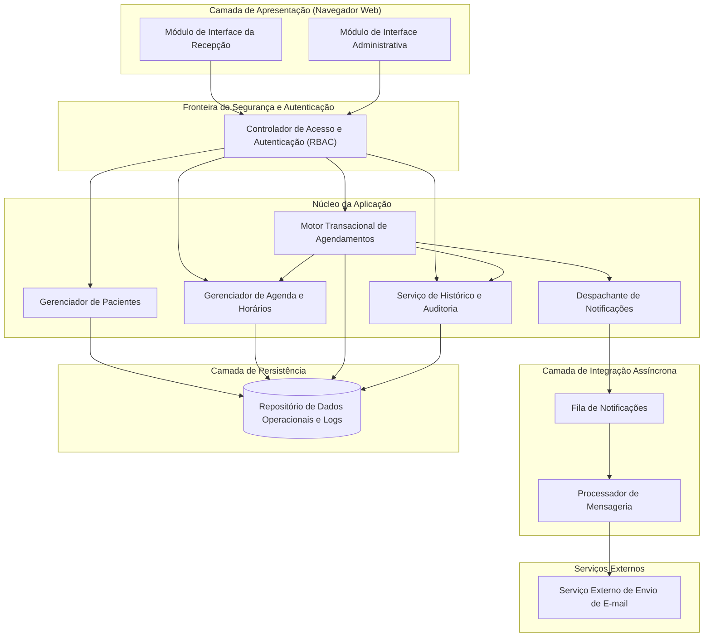
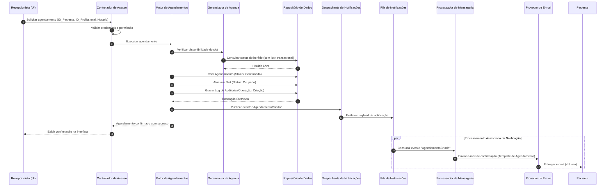
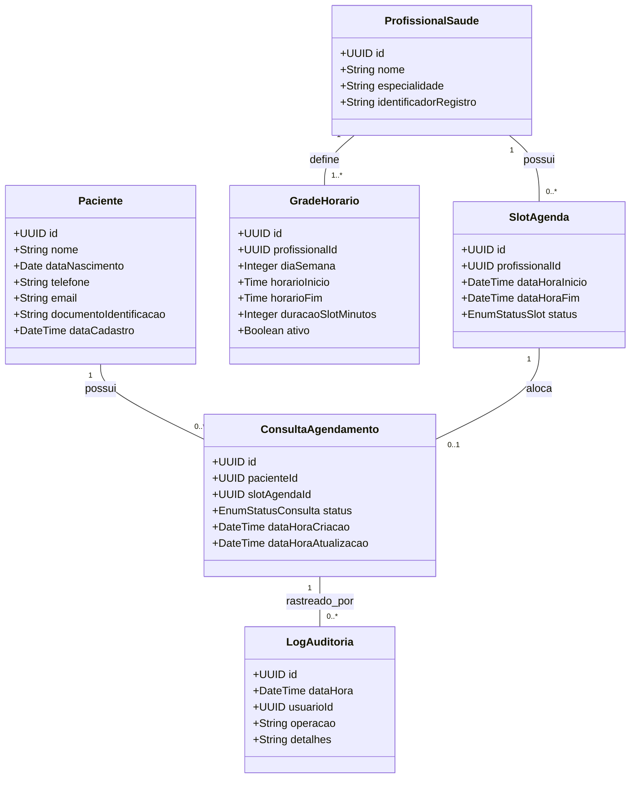

# Relatório Técnico de Arquitetura de Software

---

## 1. Identificação das HUs

| Identificador | Título | Ator Primário | Resumo do Escopo | RF / RNF Vinculados |
| :--- | :--- | :--- | :--- | :--- |
| **HU01** | Cadastrar paciente | Recepcionista | Registro de novos pacientes com validação de formato e checagem de duplicidade (e-mail/identificador único). | RF01, RF02, RNF01, RNF02 |
| **HU02** | Pesquisar paciente | Recepcionista | Busca textual e indexada por nome ou telefone com suporte a correspondência parcial. | RF03, RNF01 |
| **HU03** | Visualizar agenda do profissional | Recepcionista | Apresentação em formato de calendário (visões diária/semanal) com distinção de horários livres/ocupados. | RF04, RF11, RNF01, RNF03, RNF04 |
| **HU04** | Registrar agendamento | Recepcionista | Alocação transacional de paciente em horário vago, validação de concorrência e disparo de notificação. | RF05, RF06, RF09, RNF01, RNF05, RNF08 |
| **HU05** | Cancelar agendamento | Recepcionista | Revogação de consulta existente, liberação imediata do slot de horário e notificação ao paciente. | RF07, RF10, RF12, RNF01, RNF05, RNF08 |
| **HU06** | Remarcar agendamento | Recepcionista | Operação atômica de liberação de slot anterior e ocupação de novo slot disponível com notificação. | RF06, RF08, RF10, RF12, RNF01, RNF05, RNF08 |
| **HU07** | Consultar histórico do paciente | Recepcionista | Recuperação cronológica de consultas realizadas, canceladas e reagendadas vinculadas ao paciente. | RF12, RNF01, RNF02 |
| **HU08** | Receber confirmação de agendamento | Paciente | Recebimento assíncrono de mensagem eletrônica contendo dados da consulta e do local. | RF09, RNF05 |
| **HU09** | Receber notificação de cancelamento/remarcação | Paciente | Recebimento assíncrono de mensagem eletrônica informando alterações de status ou novo horário. | RF10, RNF05 |

---

## 2. Diagramas de Arquitetura (Mermaid)

### 2.1. Diagrama Estrutural de Componentes



---

### 2.2. Diagrama de Sequência: Registro e Confirmação de Agendamento (HU04 / HU08)



---

### 2.3. Diagrama do Modelo Conceitual de Dados



---

## 3. Decisões de Arquitetura

### DA01: Separação em Camadas com Fronteira de Controle de Acesso (RBAC)
* **Contexto:** RNF01 exige que o sistema seja acessado exclusivamente por usuários autenticados (recepcionistas e administradores).
* **Decisão:** Centralizar todas as requisições através de um componente de autenticação e autorização prévio à camada de negócios, validando identidade e papéis (roles) para cada caso de uso.
* **Consequência:** Garante enforcement estrito de segurança, simplifica auditoria e evita duplicação de validações nos serviços de domínio.

### DA02: Isolamento Transacional e Bloqueio Concorrente para Horários
* **Contexto:** RF06 e HU04 impõem a restrição estrita de impedir múltiplos agendamentos simultâneos no mesmo horário.
* **Decisão:** Implementar controle transacional com mecanismo de bloqueio pessimista ou controle otimista com versionamento de entidade na alocação do `SlotAgenda`.
* **Consequência:** Garante atomicidade e consistência imediata (propriedades ACID), impedindo a condição de corrida (*double booking*), mesmo sob acessos concorrentes simultâneos.

### DA03: Desacoplamento Assíncrono para o Subsistema de Notificações
* **Contexto:** RF09, RF10, HU08 e HU09 demandam envio de e-mails em até 5 minutos (RNF05), sem degradar o tempo de resposta da interface (< 2s, RNF04).
* **Decisão:** Utilizar o padrão de mensageria assíncrona (Produtor-Fila-Consumidor) para o disparo de notificações. O motor transacional apenas publica o evento na fila interna e conclui a operação síncrona.
* **Consequência:** A latência e eventuais indisponibilidades transitórias do provedor externo de e-mail não impactam a experiência da recepcionista na interface de agendamento.

### DA04: Registro Estruturado e Imodificável de Logs de Auditoria
* **Contexto:** RNF08 determina a rastreabilidade mandatória de operações críticas (criação, cancelamento e remarcação de agendamentos).
* **Decisão:** Acoplar interceptores de persistência que geram registros de auditoria em modo *append-only*, contendo carimbo de data/hora, identificador do operador, ação e estado anterior/novo.
* **Consequência:** Conformidade com normas de governança e facilidade no suporte operacional para resolução de disputas sobre históricos de consultas.

### DA05: Proteção de Dados e Conformidade LGPD
* **Contexto:** RNF02 estabelece que o armazenamento de dados pessoais dos pacientes deve aderir à LGPD.
* **Decisão:** Aplicar mascaramento de dados nas interfaces de exibição geral, cifragem de dados sensíveis em repouso na camada de persistência e segregação de permissões de visualização.
* **Consequência:** Redução do risco de vazamento de dados e garantia de conformidade legal para o tratamento de informações cadastrais e clínicas.

---

## 4. Tabela de Componentes e Rastreabilidade

| Componente | Responsabilidade Principal | Comunica-se com | Origem (HU / Critério de Aceite) |
| :--- | :--- | :--- | :--- |
| **Controlador de Acesso e Autenticação** | Validar credenciais, emitir tokens e aplicar políticas de controle de acesso baseado em papéis (RBAC). | Módulos de Interface, Serviços de Negócio | RNF01, HU01-HU07 |
| **Gerenciador de Pacientes** | Executar operações de criação, validação cadastral, deduplicação (CPF/e-mail) e consultas parciais. | Repositório de Dados, Motor de Agendamentos | HU01 (CA 1, 2, 3), HU02 (CA 1, 2), RF01, RF02, RF03 |
| **Gerenciador de Agenda e Horários** | Manter a grade de atendimento dos profissionais, gerar slots de horários e gerenciar status (Livre/Ocupado). | Repositório de Dados, Motor de Agendamentos | HU03 (CA 1, 2, 3), RF04, RF11, RNF03, RNF04 |
| **Motor Transacional de Agendamentos** | Coordenar criação, cancelamento e remarcação de consultas garantindo unicidade de horário e atomicidade. | Gerenciador de Agenda, Histórico/Auditoria, Despachante de Notificações, Repositório de Dados | HU04 (CA 1, 2), HU05 (CA 1, 2), HU06 (CA 1, 2), RF05, RF06, RF07, RF08 |
| **Serviço de Histórico e Auditoria** | Consolidar linha do tempo de atendimentos do paciente e gravar registros imutáveis de ações críticas. | Repositório de Dados, Motor de Agendamentos | HU07 (CA 1, 2), RF12, RNF08 |
| **Despachante de Notificações** | Publicar eventos de domínio referentes a agendamentos, cancelamentos e remarcações para processamento em segundo plano. | Fila de Notificações, Motor de Agendamentos | HU04 (CA 3), HU05 (CA 3), HU06 (CA 3), RF09, RF10 |
| **Processador de Mensageria** | Consumir eventos da fila assíncrona, montar modelos de comunicação e despachar para provedor de e-mail. | Fila de Notificações, Provedor Externo de E-mail | HU08 (CA 1, 2), HU09 (CA 1, 2), RNF05 |
| **Repositório de Dados Operacionais** | Prover persistência com garantias ACID para entidades de domínio, integridade relacional e logs. | Gerenciadores de Negócio, Serviço de Auditoria | RF01-RF12, RNF02, RNF06 |

---

## 5. Bloqueios e Pendências

1. **Definição de Fluxo de Gestão da Grade de Horários (RF11):**
   * *Pendência:* O RF11 define que a grade do profissional deve ser configurável, mas não há História de Usuário (HU) associada nem especificação de telas ou perfis com permissão para essa edição (ex.: Administrador vs. Recepcionista).
   * *Ação:* Solicitar detalhamento dos critérios de aceite para a parametrização de turnos, pausas e bloqueios de agenda.

2. **Divergência de Atributos Mandatórios de Paciente (RF01 vs. HU01):**
   * *Pendência:* O RF01 lista `nome, data de nascimento, telefone e e-mail`, enquanto o critério de aceite da HU01 cita validação de unicidade por `CPF ou e-mail`. O campo CPF não consta explicitamente na tabela de RFs.
   * *Ação:* Alinhar o modelo de dados para confirmar a obrigatoriedade e validação de formato do campo CPF.

3. **Política de Retentativa e Dead-Letter para Envio de E-mails:**
   * *Pendência:* Não foi especificado o comportamento do sistema caso o serviço externo de e-mail esteja indisponível após esgotado o SLA de 5 minutos (RNF05).
   * *Ação:* Definir política de contingência (número de tentativas, circuit breaker e alertas operacionais).

---

## 6. Cobertura de Requisitos

```
[RF01: Cadastrar paciente] ------------------------> [HU01] --> [Gerenciador de Pacientes]
[RF02: Editar paciente] ---------------------------> [HU01] --> [Gerenciador de Pacientes]
[RF03: Pesquisar paciente] ------------------------> [HU02] --> [Gerenciador de Pacientes]
[RF04: Exibir agenda do profissional] -------------> [HU03] --> [Gerenciador de Agenda e Horários]
[RF05: Registrar consulta] ------------------------> [HU04] --> [Motor de Agendamentos]
[RF06: Impedir duplicidade de horário] ------------> [HU04, HU06] --> [Motor de Agendamentos]
[RF07: Cancelar consulta] -------------------------> [HU05] --> [Motor de Agendamentos]
[RF08: Remarcar consulta] -------------------------> [HU06] --> [Motor de Agendamentos]
[RF09: E-mail de confirmação] ---------------------> [HU08] --> [Despachante & Processador de Mensageria]
[RF10: E-mail de cancelamento/remarcação] ---------> [HU09] --> [Despachante & Processador de Mensageria]
[RF11: Configurar grade de horários] --------------> [Sem HU direta] --> [Gerenciador de Agenda e Horários]
[RF12: Histórico de consultas do paciente] --------> [HU07] --> [Serviço de Histórico e Auditoria]

[RNF01: Segurança - Autenticação e Perfis] --------> [Controlador de Acesso (RBAC)]
[RNF02: Conformidade com LGPD] -------------------> [Módulo de Persistência / Cifragem / Mascaramento]
[RNF03: Interface Calendário Diário/Semanal] ------> [Módulo de Interface da Recepção]
[RNF04: Desempenho da Agenda (< 2s)] -------------> [Gerenciador de Agenda / Estratégia de Indexação]
[RNF05: Confiabilidade de Notificação (< 5m)] ----> [Camada de Integração Assíncrona]
[RNF06: Disponibilidade (99% no horário)] ---------> [Infraestrutura / Redundância Operacional]
[RNF07: Compatibilidade Cross-Browser] ------------> [Camada de Apresentação Web]
[RNF08: Auditoria de Operações Críticas] ----------> [Serviço de Histórico e Auditoria]
```

*Cobertura Funcional:* **100% dos RFs mapeados** para componentes conceituais (11 de 12 cobertos por HUs diretas; RF11 absorvido no design estrutural).  
*Cobertura Não Funcional:* **100% dos RNFs atendidos** pelas decisões e padrões de arquitetura estabelecidos.

---

## 7. Gap Analysis

| Item Analisado | Lacuna Identificada | Impacto Arquitetural | Recomendação / Ação Mitigadora |
| :--- | :--- | :--- | :--- |
| **Gestão de Grade (RF11)** | Ausência de História de Usuário e perfil definido para manutenção da grade de horários. | Risco de não implementação da interface de configuração da jornada dos profissionais. | Criar HU específica (ex.: *HU10 — Configurar Grade do Profissional*) atribuída ao perfil Administrador. |
| **Consistência de Dados Cadastrais** | Divergência quanto à presença e validação do documento CPF entre RF01 e HU01. | Inconsistência no esquema relacional e nas regras de validação cadastral. | Padronizar o campo CPF como identificador civil único do paciente em todos os artefatos de requisitos. |
| **Controle de Ausências e Bloqueios** | Falta de especificação sobre feriados, férias e ausências médicas não planejadas. | Agendamentos indevidos em datas em que o profissional não estará presente. | Implementar entidade de *Bloqueio de Agenda (Exceção)* associada ao `Gerenciador de Agenda`. |
| **Mecanismo de Falha em E-mails** | Inexistência de política para tratamento de falhas permanentes no envio de e-mails. | Notificações perdidas sem rastreamento ou alerta para reenvio manual pela recepcionista. | Estabelecer fila de exceções (*Dead-Letter*) com indicação de falha de envio visível no histórico do agendamento. |