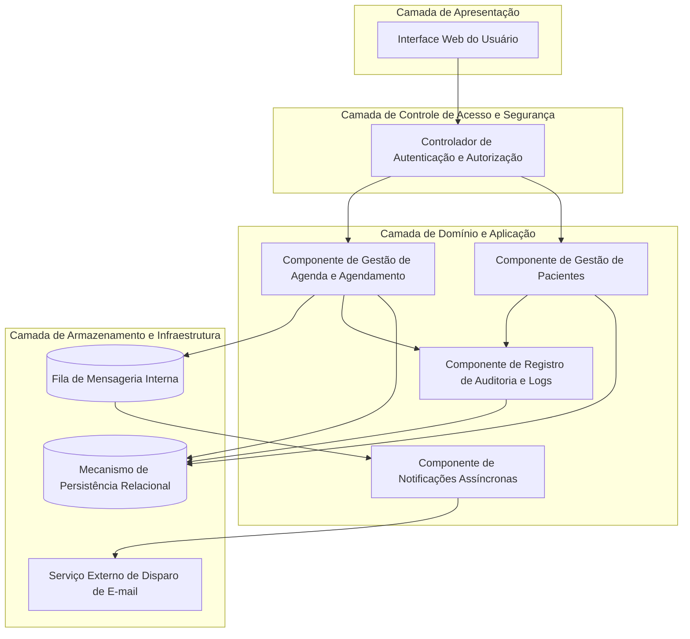
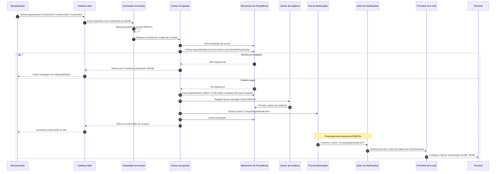
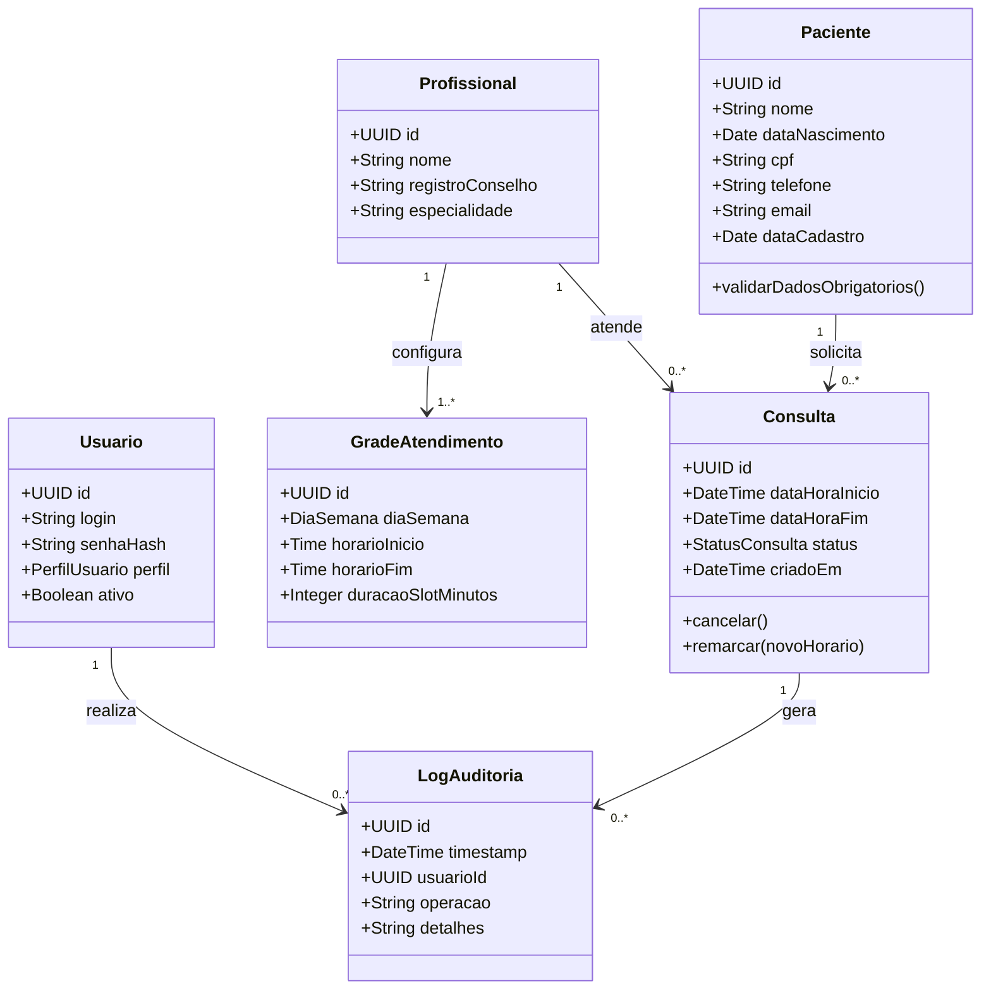

# Relatório Técnico de Arquitetura de Software

---

## 1. Identificação das HUs

A tabela a seguir consolida o catálogo de Histórias de Usuário identificadas, seus respectivos atores primários, escopo funcional e relevância operacional para o sistema da clínica.

| ID | Título | Ator Primário | Descrição Resumida | Prioridade |
|---|---|---|---|---|
| **HU01** | Cadastrar paciente | Recepcionista | Registro cadastral de novos pacientes com validação de dados obrigatórios e restrição de duplicidade (CPF/e-mail). | Alta |
| **HU02** | Pesquisar paciente | Recepcionista | Consulta de registros de pacientes por termos parciais de nome ou telefone. | Alta |
| **HU03** | Visualizar agenda do profissional | Recepcionista | Exibição de horários disponíveis e ocupados em visualizações de calendário diário e semanal. | Alta |
| **HU04** | Registrar agendamento | Recepcionista | Alocação de paciente em horário livre com emissão de confirmação e disparo assíncrono de e-mail. | Crítica |
| **HU05** | Cancelar agendamento | Recepcionista | Liberação de horário reservado, confirmação de operação e notificação ao paciente. | Média |
| **HU06** | Remarcar agendamento | Recepcionista | Desalocação atômica do horário prévio e ocupação de novo horário vago, com notificação de atualização. | Alta |
| **HU07** | Consultar histórico do paciente | Recepcionista | Recuperação de linha do tempo de consultas passadas, realizadas e canceladas vinculadas ao paciente. | Média |
| **HU08** | Receber confirmação por e-mail | Paciente | Recepção de notificação contendo dados da consulta, profissional e localidade após agendamento. | Alta |
| **HU09** | Receber notificação de alteração | Paciente | Recepção de e-mail de aviso em eventos de cancelamento ou remarcação de consulta. | Alta |

---

## 2. Diagramas de Arquitetura (Mermaid)

### 2.1. Visão Estrutural: Diagrama de Componentes Lógicos

Representação dos módulos conceituais do sistema, isolando camadas de interface, lógica de negócios, auditoria, segurança e serviços de mensageria.

### 2.2. Visão Dinâmica: Diagrama de Sequência de Agendamento e Notificação

Detalhamento da execução de um agendamento com validação de concorrência, persistência transacional, rastreabilidade e notificação desacoplada.

### 2.3. Diagrama de Modelo de Domínio

Modelo conceitual de classes refletindo as entidades fundamentais, restrições e relacionamentos do negócio.

---

## 3. Decisões de Arquitetura

### Decisão 01: Adoção de Arquitetura em Camadas com Isolamento de Domínio
* **Contexto:** Necessidade de separar regras de negócios (agendamento, integridade cadastral), autenticação/autorização e mecanismos de interface/persistência.
* **Decisão:** Estruturar a aplicação em camadas conceituais bem delimitadas: Apresentação, Controle de Acesso/Segurança, Aplicação/Domínio e Persistência/Infraestrutura.
* **Consequência:** Promove manutenibilidade, testabilidade unitária e independência de fornecedores de persistência ou interface.

### Decisão 02: Desacoplamento Assíncrono para o Subsistema de Notificações
* **Contexto:** O requisito RNF05 estipula que a notificação deve ocorrer em até 5 minutos, enquanto o RNF04 exige tempo de resposta da agenda em até 2 segundos. Acoplamentos síncronos com servidores de e-mail podem degradar a performance da interface.
* **Decisão:** Implementar padrão de mensageria interno orientado a eventos. As transações de agendamento, cancelamento e remarcação persistem os dados locais e postam um evento em fila para consumo por um motor de notificações assíncrono.
* **Consequência:** A interface responde imediatamente à recepcionista; oscilações ou lentidões no envio de e-mails não bloqueiam as operações do sistema.

### Decisão 03: Controle Estrito de Transacionalidade e Concorrência de Horários
* **Contexto:** O requisito RF06 proíbe o agendamento concorrente de duas consultas no mesmo slot de tempo de um profissional.
* **Decisão:** Assegurar que a verificação de disponibilidade e a reserva do horário ocorram sob um contexto transacional atômico e isolado (com bloqueio lógico ou controle de concorrência no repositório de dados).
* **Consequência:** Eliminação de condições de corrida (*race conditions*) em acessos simultâneos por múltiplos operadores.

### Decisão 04: Mecanismo Integrado de Auditoria para Operações Críticas
* **Contexto:** RNF08 exige rastreabilidade completa para criação, cancelamento e remarcação de consultas; RNF02 exige conformidade com diretrizes de proteção de dados pessoais (LGPD).
* **Decisão:** Centralizar a captura de eventos de mutação em um componente de auditoria dedicado que registra o identificador do operador autenticado, data/hora, tipo de operação e estado anterior/posterior do registro.
* **Consequência:** Conformidade regulatória, suporte a investigações de desvios e preservação do histórico para fins legais.

---

## 4. Tabela de Componentes e Rastreabilidade

| Componente | Responsabilidade Principal | Comunica-se com | Origem (HU / Critério de Aceite) |
|---|---|---|---|
| **Controlador de Autenticação e Autorização** | Validar identidade do usuário (Recepcionista/Admin) e autorizar a execução das rotinas do sistema. | Interface Web, Componentes de Domínio | RNF01 |
| **Gestor de Pacientes** | Efetuar cadastro, validação de formato de campos (e-mail/CPF), unicidade e recuperação de dados de pacientes. | Repositório de Dados, Gestor de Auditoria | HU01, HU02, RF01, RF02, RF03 |
| **Gestor de Agenda e Agendamento** | Gerenciar a grade de atendimento, validar disponibilidade de slots, controlar bloqueios atômicos e orquestrar agendamento, cancelamento e remarcação. | Repositório de Dados, Fila de Notificações, Gestor de Auditoria | HU03, HU04, HU05, HU06, HU07, RF04, RF05, RF06, RF07, RF08, RF11, RF12, RNF04 |
| **Gestor de Auditoria e Logs** | Interceptar operações críticas e persistir trilhas de auditoria contendo autor, data, hora e natureza da transação. | Repositório de Dados | RNF02, RNF08 |
| **Fila de Notificações** | Armazenar temporariamente eventos de domínio gerados pelas ações da agenda para processamento em segundo plano. | Gestor de Agenda, Motor de Notificações | RNF05 |
| **Motor de Notificações** | Processar eventos da fila e acionar o provedor de e-mail com os modelos padronizados de confirmação, alteração e cancelamento. | Fila de Notificações, Provedor de E-mail | HU08, HU09, RF09, RF10, RNF05 |
| **Provedor de E-mail** | Entregar formalmente as mensagens de correio eletrônico aos destinatários finais (pacientes). | Motor de Notificações | RF09, RF10, HU08, HU09 |
| **Repositório de Dados** | Prover persistência confiável, controle transacional e integridade relacional dos dados cadastrais e operacionais. | Gestor de Pacientes, Gestor de Agenda, Gestor de Auditoria | RF01 a RF12, RNF02, RNF08 |

---

## 5. Bloqueios e Pendências

1. **Definição de Gestão de Profissionais:** Os requisitos citam a visualização da agenda do profissional (RF04) e configuração de grade (RF11), mas não detalham o fluxo ou permissão para cadastro/edição dos dados do profissional de saúde.
2. **Critério de Chave Única de Paciente (Divergência RF vs HU):** O critério de aceite da HU01 cita restrição de unicidade por "CPF ou e-mail", todavia o requisito RF01 não lista expressamente o CPF como atributo obrigatório de entrada.
3. **Política de Expiração e Retenção de Dados (LGPD):** O RNF02 estipula conformidade com a LGPD, mas não define a política de descarte, anonimização ou exportação de dados a pedido do titular.
4. **Tratamento de Falhas de Notificação Externa:** Ausência de definição quanto à política de re-tentativa (*retry policy*) e alerta em caso de falha persistente do provedor de e-mail.

---

## 6. Cobertura de Requisitos

| Requisito Funcional / Não Funcional | Histórias de Usuário Vinculadas | Componente(s) Arquitetural(is) Responsável(is) | Status de Cobertura |
|---|---|---|---|
| **RF01** (Cadastro de Paciente) | HU01 | Gestor de Pacientes, Repositório de Dados | Totalmente Coberto |
| **RF02** (Edição de Paciente) | HU01 | Gestor de Pacientes, Repositório de Dados | Totalmente Coberto |
| **RF03** (Pesquisa de Paciente) | HU02 | Gestor de Pacientes, Repositório de Dados | Totalmente Coberto |
| **RF04** (Visualização de Agenda) | HU03 | Gestor de Agenda, Interface Web | Totalmente Coberto |
| **RF05** (Registro de Consulta) | HU04 | Gestor de Agenda, Repositório de Dados | Totalmente Coberto |
| **RF06** (Prevenção de Duplicidade no Horário) | HU04 | Gestor de Agenda, Repositório de Dados | Totalmente Coberto |
| **RF07** (Cancelamento de Consulta) | HU05 | Gestor de Agenda, Repositório de Dados | Totalmente Coberto |
| **RF08** (Remarcação de Consulta) | HU06 | Gestor de Agenda, Repositório de Dados | Totalmente Coberto |
| **RF09** (E-mail de Confirmação) | HU04, HU08 | Gestor de Agenda, Fila de Notificações, Motor de Notificações | Totalmente Coberto |
| **RF10** (E-mail de Cancelamento/Remarcação) | HU05, HU06, HU09 | Gestor de Agenda, Fila de Notificações, Motor de Notificações | Totalmente Coberto |
| **RF11** (Configuração de Grade de Horários) | HU03 | Gestor de Agenda, Repositório de Dados | Totalmente Coberto |
| **RF12** (Histórico de Consultas do Paciente) | HU07 | Gestor de Agenda, Gestor de Pacientes, Repositório de Dados | Totalmente Coberto |
| **RNF01** (Segurança / Autenticação) | HU01 a HU07 | Controlador de Autenticação e Autorização | Totalmente Coberto |
| **RNF02** (Conformidade LGPD) | HU01, HU07 | Gestor de Auditoria, Repositório de Dados | Totalmente Coberto |
| **RNF03** (Usabilidade do Calendário) | HU03 | Interface Web | Totalmente Coberto |
| **RNF04** (Desempenho <= 2s) | HU03 | Gestor de Agenda, Repositório de Dados | Totalmente Coberto |
| **RNF05** (Confiabilidade de E-mail <= 5min) | HU08, HU09 | Fila de Notificações, Motor de Notificações | Totalmente Coberto |
| **RNF06** (Disponibilidade >= 99%) | Todas as HUs | Camada de Persistência, Toda a Arquitetura | Totalmente Coberto |
| **RNF07** (Compatibilidade de Navegadores) | Todas as HUs | Interface Web | Totalmente Coberto |
| **RNF08** (Logs e Manutenibilidade) | HU04, HU05, HU06 | Gestor de Auditoria, Repositório de Dados | Totalmente Coberto |

---

## 7. Gap Analysis

| Item / Lacuna Identificada | Impacto Arquitetural | Ação Recomendada para o Time de Engenharia |
|---|---|---|
| **Inconsistência no Campo CPF** | Se o CPF não for obrigatório no modelo relacional, a validação de unicidade da HU01 falhará ou exigirá regras condicionais nulas. | Padronizar a especificação do RF01 e do modelo de dados para inclusão mandatória do campo CPF com validação de formato e índice único. |
| **Mecanismo de Recuperação de Falhas de E-mail** | Falhas transitórias no provedor de comunicação podem violar o envio das notificações (HU08/HU09). | Estabelecer fila de processamento com padrão de repetição (*Dead-Letter Queue* / *Backoff Estratégico*) no Motor de Notificações. |
| **Gerenciamento do Ciclo de Vida do Profissional** | Sem entidade e telas de gestão do corpo clínico, a vinculação de agendas dependerá de cargas manuais no banco de dados. | Solicitar a criação de Histórias de Usuário específicas para cadastro e manutenção de profissionais de saúde e suas especialidades. |
| **Transição de Status de Consultas Passadas** | O sistema não detalha como consultas agendadas tornam-se "Realizadas" no histórico (RF12). | Definir processo periódico automatizado ou ação manual da recepcionista para confirmar o comparecimento do paciente e atualizar o status da consulta. |